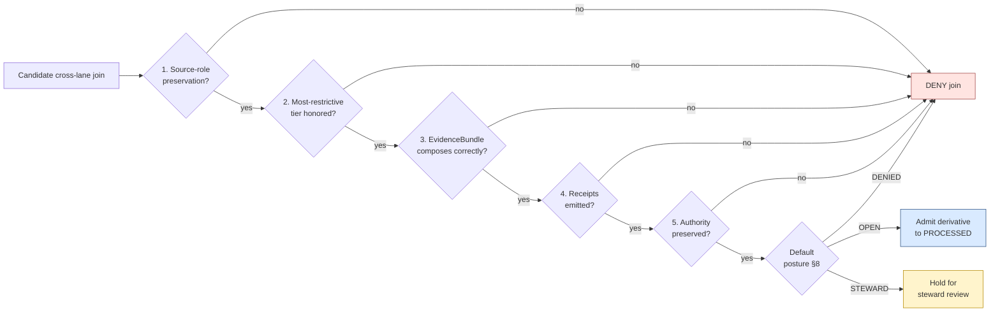

<!-- [KFM_META_BLOCK_V2]
doc_id: kfm://doc/architecture/cross-lane-join-policy
title: Cross-Lane Join Policy — Architectural Foundation
type: standard
version: v1
status: draft
owners: <TBD: docs steward + governance lead + each domain steward (16)>
created: 2026-05-24
updated: 2026-05-24
policy_label: public
related: [
  docs/architecture/TRUST_MEMBRANE.md,
  docs/architecture/critical-asset-exposure.md,
  docs/architecture/cross-domain-invasives.md,
  docs/architecture/system-context.md,
  docs/architecture/governed-api.md,
  docs/architecture/map-shell.md,
  docs/architecture/ui/CONTINUITY_NOTES.md,
  docs/standards/MAP_TRUST_STATES.md,
  docs/standards/EVIDENCE_BUNDLE.md,
  docs/standards/RELEASE_MANIFEST.md,
  docs/standards/PROV/README.md,
  docs/standards/DUO_PROFILE.md,
  docs/standards/SENSITIVITY_RUBRIC.md,
  contracts/v1/source/,
  schemas/contracts/v1/source/,
  policy/joins/,
  policy/sensitivity/
]
tags: [kfm, architecture, cross-lane-join, source-role, anti-collapse, sensitivity, most-restrictive-tier, governance, adr-s-14]
notes: [
  "Architectural foundation for cross-lane joins in KFM. Consolidates Atlas §24.1 (Master Source-Role Anti-Collapse Register), Atlas §24.4 (Cross-Lane Relation Atlas), and kfm_unified_doctrine_synthesis.md §17 (Cross-lane relations and source-role anti-collapse).",
  "Sister architecture docs (critical-asset-exposure.md, cross-domain-invasives.md) defer to this document for the cross-lane-join admissibility rules.",
  "ADR-S-14 (open) is the doctrinal placeholder for this document's normative content: 'Cross-lane join policy: which joins require steward review, which are denied, which are open.' See §15 item 1."
]
[/KFM_META_BLOCK_V2] -->

# Cross-Lane Join Policy — Architectural Foundation

> The architecture of how KFM admits, denies, or steward-gates **joins across domain lanes** — and the seven source roles, five admissibility checks, and three default postures that compose to produce a finite, auditable answer for every cross-lane join the system attempts.

| Status | Owners | Last reviewed |
|---|---|---|
| **draft** | _TBD — docs steward + governance lead + each domain steward_ | 2026-05-24 |

---

> [!CAUTION]
> **This document is the architectural foundation, not the per-join policy code.** The OPA rules that mechanically admit, deny, or gate joins live in `policy/joins/` (PROPOSED home). Per-domain sensitivity rules live in `policy/sensitivity/<domain>/`. The `SourceDescriptor.source_role` enum and its schema live in `contracts/v1/source/` and `schemas/contracts/v1/source/`. This document defines the **vocabulary, admissibility checks, default postures, and verification points** that those canonical homes implement. See §2.

---

## Quick jump

- [1. Purpose](#1-purpose)
- [2. Scope and repo fit](#2-scope-and-repo-fit)
- [3. Authority and standing](#3-authority-and-standing)
- [4. The seven canonical source roles](#4-the-seven-canonical-source-roles)
- [5. Allowed downstream-role transitions](#5-allowed-downstream-role-transitions)
- [6. The five join-admissibility checks](#6-the-five-join-admissibility-checks)
- [7. The cross-lane relation atlas — consolidated](#7-the-cross-lane-relation-atlas--consolidated)
- [8. The three default postures — OPEN, STEWARD-REVIEW, DENIED](#8-the-three-default-postures--open-steward-review-denied)
- [9. What promotion never does](#9-what-promotion-never-does)
- [10. Join-evaluation architecture](#10-join-evaluation-architecture)
- [11. The anti-collapse failure modes](#11-the-anti-collapse-failure-modes)
- [12. Render-time and AI enforcement](#12-render-time-and-ai-enforcement)
- [13. Anti-patterns](#13-anti-patterns)
- [14. Tensions and known limits](#14-tensions-and-known-limits)
- [15. Open questions](#15-open-questions)
- [16. Related docs](#16-related-docs)
- [Appendix A — Join admissibility matrix](#appendix-a--join-admissibility-matrix)
- [Appendix B — Source-role transition cheatsheet](#appendix-b--source-role-transition-cheatsheet)

---

## 1. Purpose

CONFIRMED — Atlas §24.1:

> *"KFM treats source role as a first-class identity attribute. An observed reading is not interchangeable with a modeled estimate; a regulatory determination is not interchangeable with an administrative compilation; an aggregate publication is not interchangeable with candidate evidence; synthetic content is never the same thing as observed reality. The lifecycle and the governed API both fail closed when these roles are conflated."*

CONFIRMED — `kfm_unified_doctrine_synthesis.md` §17:

> *"Cross-lane joins create the most powerful KFM views — and the most dangerous source-role collisions. A join is permitted only when each side preserves its `EvidenceBundle`, source role, sensitivity tier, and release state."*
>
> *"**Source-role collapse is the most common silent failure.** A modeled value cited as an observation, an aggregate cited as a per-place observation, a synthetic surface presented as reality — these are doctrine violations even when the underlying data are correct."*

These two passages, taken together, name the architectural concern this document is the foundation of. KFM's most powerful outputs come from joining records across domain lanes — hydrology × hazards × settlements, fauna × flora × habitat, archaeology × roads × settlements, frontier-matrix × everything. Those same joins are the structural failure mode that produces KFM's most consequential silent failures: a modeled value rendered as if observed, an aggregate plotted as if per-place, a regulatory designation cited as if it were evidence of presence.

This document collects the rules that prevent those failures into one architectural foundation. It is **not** a domain doctrine, **not** an external standards profile, **not** a sensitivity rubric, and **not** policy code. It is the **architecture of the admissibility decision itself** — the vocabulary, checks, postures, and verification points that determine whether a proposed cross-lane join can produce a release-eligible derivative.

Two prior-session-authored sibling documents apply this foundation to specific cases:

- [`docs/architecture/critical-asset-exposure.md`](./critical-asset-exposure.md) §9 — cross-lane risks when one side is a critical-asset class.
- [`docs/architecture/cross-domain-invasives.md`](./cross-domain-invasives.md) §7 — cross-lane joins when one side is an invasive-record class.

Both defer to this document for the underlying rules. Other applications (cross-domain hazards composition, frontier-matrix cell composition, etc.) defer here as well.

[Back to top](#quick-jump)

---

## 2. Scope and repo fit

### 2.1 What this document is

| Aspect | Value | Label |
|---|---|---|
| Document class | KFM cross-cutting architectural foundation | CONFIRMED per Directory Rules §6.1 (`docs/architecture/`) |
| Proposed path | `docs/architecture/cross-lane-join-policy.md` | PROPOSED; casing matches sibling architecture-folder convention |
| Sibling architecture docs | `system-context.md`, `governed-api.md`, `map-shell.md`, `maplibre-3d.md`, `contract-schema-policy-split.md`, `TRUST_MEMBRANE.md`, `critical-asset-exposure.md`, `cross-domain-invasives.md`, `ui/CONTINUITY_NOTES.md` | CONFIRMED per Directory Rules §6.1 (mounted-repo presence NEEDS VERIFICATION) |
| Primary doctrine anchors | `kfm_unified_doctrine_synthesis.md` §17; Atlas §24.1 (Source-Role Anti-Collapse Register), §24.1.2 (Anti-collapse failure modes), §24.1.3 (Roles to source-descriptor fields), §24.4 (Cross-Lane Relation Atlas), §24.9.3 (Governance-process anti-patterns), §24.12 ADR-S-14 (Cross-lane join policy — open ADR) | CONFIRMED |
| Authority NOT held | Doctrine; the source-role enum schema; OPA join-policy code; per-domain sensitivity rules; per-join steward chains; the per-domain F. cross-lane tables | CONFIRMED |

### 2.2 What this document is NOT

| If the content is about… | …it lives at | …not here |
|---|---|---|
| The `source_role` enum vocabulary itself | `contracts/v1/source/source_descriptor.md` (PROPOSED home) + ADR-S-04 | this doc |
| The `SourceDescriptor` JSON Schema | `schemas/contracts/v1/source/source_descriptor.schema.json` (PROPOSED home) | this doc |
| The OPA rules that admit/deny per-join | `policy/joins/<domain-pair>/` (PROPOSED homes) | this doc |
| Per-domain sensitivity tier defaults | `policy/sensitivity/<domain>/` (PROPOSED homes per Atlas §24.13 crosswalk) | this doc |
| The full sensitivity-tier vocabulary (T0–T4) | `docs/standards/SENSITIVITY_RUBRIC.md` (PROPOSED, not yet authored) + ADR-S-05 | this doc |
| Per-domain object families and cross-lane edges (F. tables) | Per-domain contracts at `contracts/v1/<domain>/` | this doc |
| The full anti-collapse register row text | Atlas §24.1.2 (this doc preserves the table verbatim with cross-references) | this doc |
| Promotion-gate sequence | `policy/release/` + `docs/architecture/TRUST_MEMBRANE.md` §5.3 | this doc |
| Render-time policy code | `policy/render/` + `packages/maplibre-runtime/src/verifier/` | this doc |
| AI-runtime policy code | `policy/ai/` + `packages/governed-ai/` | this doc |
| Tests and fixtures | `tests/joins/`, `fixtures/joins/` (PROPOSED homes) | this doc |
| Per-domain join runbooks | `docs/runbooks/joins/` (PROPOSED home) | this doc |

What this document **does** own:

- The architectural definition of the seven source roles (§4).
- The allowed downstream-role-transition table (§5).
- The five join-admissibility checks (§6).
- The consolidated cross-lane relation atlas (§7).
- The three default postures — OPEN, STEWARD-REVIEW, DENIED (§8) — the heart of ADR-S-14.
- The promotion-never-upgrades-role rule (§9).
- The join-evaluation architecture (§10).
- The anti-collapse failure-mode register (§11), preserving Atlas §24.1.2 verbatim with cross-references to the architectural enforcement.
- The render-time and AI enforcement specification (§12).
- The anti-pattern register (§13).

[Back to top](#quick-jump)

---

## 3. Authority and standing

| Aspect | Value | Label |
|---|---|---|
| Document class | KFM architecture foundation (cross-cutting) | CONFIRMED per Directory Rules §6.1 |
| Canonical path | `docs/architecture/cross-lane-join-policy.md` | PROPOSED |
| Primary doctrine anchor | **Atlas §24.1** — Master Source-Role Anti-Collapse Register | CONFIRMED |
| Cross-lane register anchor | **Atlas §24.4** — Cross-Lane Relation Atlas (per owning domain) | CONFIRMED |
| Anti-collapse failure-mode anchor | **Atlas §24.1.2** — Anti-collapse failure modes (DENY conditions) | CONFIRMED |
| Source-descriptor anchor | **Atlas §24.1.3** — Roles to source-descriptor fields (PROPOSED schema home) | CONFIRMED-as-PROPOSED |
| Architectural composition | **`kfm_unified_doctrine_synthesis.md` §17** — Cross-lane relations and source-role anti-collapse; **§29.3** — governance-process anti-patterns ("source role is fixed at admission; never upgraded by promotion") | CONFIRMED |
| ADR placeholder | **ADR-S-14** — "Cross-lane join policy: which joins require steward review, which are denied, which are open. Cross-lane joins are inference-risk multipliers." | CONFIRMED open ADR |
| Companion ADRs | **ADR-S-04** (Source-role enum), **ADR-S-05** (Sensitivity tier scheme) | CONFIRMED open ADRs |
| Sister architecture | [`docs/architecture/critical-asset-exposure.md`](./critical-asset-exposure.md), [`docs/architecture/cross-domain-invasives.md`](./cross-domain-invasives.md), [`docs/architecture/TRUST_MEMBRANE.md`](./TRUST_MEMBRANE.md) | CONFIRMED authored (prior session) |
| Authority NOT held | Source-role enum vocabulary itself, schema, OPA code, per-domain sensitivity, contracts, tests, deployment topology | CONFIRMED |

[Back to top](#quick-jump)

---

## 4. The seven canonical source roles

CONFIRMED verbatim from **Atlas §24.1.1** *Canonical source-role classes*. KFM treats source role as a first-class identity attribute on every `SourceDescriptor`. The enum is set at admission and **never edited in-place**; corrections produce a new descriptor and a `CorrectionNotice` (CONFIRMED — Atlas §24.1.3).

| # | Role | Definition (CONFIRMED) | Typical example | Allowed downstream role |
|---|---|---|---|---|
| 1 | **Observed** | A direct reading, measurement, or first-hand evidentiary record tied to a place and time. | Stream-gauge stage reading; soil pedon description; air-quality monitor sample; ground archaeological observation. | May feed modeled or aggregate products; **never relabeled** as 'regulatory' or 'administrative'. |
| 2 | **Regulatory** | An authoritative determination by a regulatory or governing body with legal or administrative force. | NFHL flood-zone designation; air-quality non-attainment ruling; designated critical habitat unit; protected-species listing. | Cite as regulatory context; **never** labeled an 'observed' event or a 'modeled' estimate. |
| 3 | **Modeled** | A derived product from inputs, assumptions, or fitted parameters; uncertainty and provenance of inputs must be preserved. | Hydrograph reconstruction; smoke-trajectory model; suitability raster; population-estimation surface; AODRaster. | Cite with model identity, run receipt, and bounds; **never** labeled an observation. |
| 4 | **Aggregate** | A published summary, total, or average over a unit (county, year, watershed); irreversible loss of individual record fidelity. | USDA crop county totals; Census tract aggregates; decadal climate normal; resource-estimate summary. | Cite with `AggregationReceipt`; **never** treated as a per-place record. |
| 5 | **Administrative** | A compiled record produced by an agency for administration, registration, or accounting purposes — not necessarily an observation or a regulation. | Land office tract book; deed-index compilation; county incorporation record; transport-facility roster. | Cite as administrative context; **never** collapsed with observation or regulation. |
| 6 | **Candidate** | A record that has not yet been promoted to PROCESSED — typically in WORK / QUARANTINE pending validation, review, or evidence resolution. | Source-watcher output; PR-submitted record before review; freshly-ingested raw fixture. | **Never** exposed on a public surface; promotion gate must close before any downstream role applies. |
| 7 | **Synthetic** | Reconstructed, generated, or simulated content — including AI-drafted text, 3D reconstructions of partially-observed scenes, and synthetic surfaces. | AI-drafted narrative summary; 3D reconstruction of a historic site from partial evidence; synthetic terrain. | Cite with `RepresentationReceipt` and `RealityBoundaryNote`; **never** labeled as observed reality. |

### 4.1 Why seven, not fewer

The corpus is explicit (Atlas §24.1) that these seven are **not collapsible**. A naïve simplification would collapse Observed and Administrative ("they're both records that exist"), or Modeled and Aggregate ("they're both derived"), or Candidate and Synthetic ("they're both not-yet-real"). Each of these collapses is the failure mode the doctrine exists to prevent. The seven roles are doctrinal vocabulary, governed by ADR-S-04, and changes to the enum require ADR review.

> [!IMPORTANT]
> The source-role enum is **doctrinal vocabulary**, not a configuration setting. A pipeline that invents a new role at admission ("partially-observed," "semi-modeled," "quasi-regulatory") is a doctrine violation regardless of how reasonable the new label sounds.

[Back to top](#quick-jump)

---

## 5. Allowed downstream-role transitions

CONFIRMED — Atlas §24.1.1 *Allowed downstream role* column + §29.3 governance-process anti-pattern *"Promotion that 'upgrades' a source role (modeled → observed): **Source role is fixed at admission; never upgraded by promotion.**"*

A **transition** is the act of producing a downstream artifact from an upstream record. KFM permits some transitions (an observation may feed an aggregate; a model may produce a derived surface) and prohibits others (a model output may never be relabeled an observation).

| From role | May produce | May NOT produce | Why |
|---|---|---|---|
| Observed | Modeled (when fed into a model); Aggregate (when summarized); cited evidence in any derivative | Regulatory; Administrative | Observation is the highest-trust role; "promotion" to regulatory or administrative would invent authority KFM does not have |
| Regulatory | Cited regulatory context in any derivative | Observed; Modeled; Aggregate; Administrative | Regulatory determination is its own role; transformation breaks the authority |
| Modeled | Aggregate (when summarized); cited modeled context | Observed; Regulatory; Administrative | The model's predictive nature is irreducible; relabeling erases it |
| Aggregate | Higher-level aggregate (with new `AggregationReceipt`); cited aggregate context | Observed; Per-place anything | Aggregation is one-way; per-place fidelity is irrecoverable |
| Administrative | Cited administrative context in any derivative | Observed; Regulatory; Modeled | Administrative records are documentary, not evidentiary |
| Candidate | Any role **only after promotion** completes (RAW → WORK → PROCESSED) | Any role in PUBLISHED before promotion | Candidate is by definition pre-promotion |
| Synthetic | Cited synthetic context (with `RealityBoundaryNote`) | Observed; Regulatory; Modeled; Aggregate; Administrative | Synthetic content is interpretive; cannot become evidence |

> [!WARNING]
> **The "never upgraded" rule is absolute** (Atlas §29.3). A modeled value does not become observed because the model was good. An aggregate does not become per-place because the cell is small. A candidate does not become observed because it passed validation. The role is fixed at admission; promotion changes the lifecycle phase, not the role.

[Back to top](#quick-jump)

---

## 6. The five join-admissibility checks

PROPOSED — synthesizing the §17 architectural rules into a five-check structure. Every cross-lane join MUST pass all five checks before any downstream artifact may be admitted to PROCESSED, much less PUBLISHED.

| # | Check | What it verifies | What fails it |
|---|---|---|---|
| 1 | **Source-role preservation** | Each contributing record's role travels intact into the join derivative. | An observation joined with a model, where the output is labeled "observation," collapses roles. |
| 2 | **Most-restrictive tier** | The join's sensitivity tier is the most-restrictive of any contributing record (Atlas §24.5; `MAP_TRUST_STATES.md` §6.2). | A T4 critical-asset joined with a T0 hydrology layer producing a T0 output. |
| 3 | **EvidenceBundle composition** | The join produces a new `EvidenceBundle` that references each contributing bundle by `EvidenceRef`; it does not flatten them. | A join that silently inherits one side's bundle and discards the other. |
| 4 | **Receipt emission** | The join emits its own receipt — `TransformReceipt` for the join logic, `AggregationReceipt` if the join produces summaries, `PolicyDecision` recording the cross-lane check. | A join that produces output without recording how the output was produced. |
| 5 | **Authority preservation** | The join does not transfer authority from one domain to another. | Identity claimed by the wrong domain (e.g., Agriculture asserting species identity without citing Fauna as the taxonomic source). |

### 6.1 The composition rule

Checks 1–5 compose: a join that passes any subset of them but fails one of the others is still inadmissible. There is no "mostly passing" — failure is failure.

PROPOSED — diagram composes the §6 checks with the §8 default-posture decision. Tooling and route names NEEDS VERIFICATION.

[Back to top](#quick-jump)

---

## 7. The cross-lane relation atlas — consolidated

CONFIRMED — preserved from **`kfm_unified_doctrine_synthesis.md` §17** with cross-references to per-domain Atlas §24.4.x edges. This is the doctrinal join register; per-domain extensions live in `contracts/v1/<domain>/` F. (cross-lane) tables.

| # | Join | Most-restrictive applicable rule | Failure mode if violated | Default posture (§8) |
|---|---|---|---|---|
| 1 | **Hydrology × Fauna** (aquatic species) | Species sensitivity sets tier; HUC stays T0. | Sensitive occurrence implied from joined geometry. | STEWARD-REVIEW |
| 2 | **Soil × Agriculture** | Aggregation tier; **no farm/operator × parcel × yield join** for public release. | Private business detail exposed. | OPEN for aggregate; DENIED for farm/operator detail |
| 3 | **Archaeology × Roads / Rail** | Historical route may publish; **site coordinates do not**. | Site location inferred from corridor inflection. | STEWARD-REVIEW |
| 4 | **Hazards × Settlements** | Public exposure summary OK; **critical-asset precise locations DENY**. | Adversary mapping. | STEWARD-REVIEW for summary; DENIED for critical-asset precise |
| 5 | **People × Land** | Deceased, historical assertions allowed at T1; **living-person × parcel DENY**. | Privacy / identity exposure. | OPEN for deceased historical; DENIED for living-person |
| 6 | **Atmosphere × Hazards** | Source-role anti-collapse: observed/modeled/regulatory/aggregate must remain distinct. | Modeled forecast read as observed measurement. | OPEN with source-role surfaced; DENIED for collapse |
| 7 | **Frontier matrix × all** | Named definition + uncertainty + source-role preservation. | One "frontier score" treated as universal truth. | STEWARD-REVIEW |

PROPOSED extensions (from sister architecture docs):

| # | Join | Most-restrictive applicable rule | Failure mode if violated | Default posture (§8) | Source |
|---|---|---|---|---|---|
| 8 | **Fauna × Flora** (invasive context) | Identity preservation; framing-not-instruction (Atlas §24.4.6) | Management instruction inferred from cross-lane composition. | STEWARD-REVIEW | `cross-domain-invasives.md` §7 |
| 9 | **Fauna × Habitat** | Public-safe occurrences only; restricted occurrences never cross. | Restricted occurrence implied via habitat-quality model. | OPEN for public-safe; DENIED for restricted | `cross-domain-invasives.md` §7 |
| 10 | **Flora × Archaeology** | Ethnobotanical context (steward-reviewed); never overrides cultural-heritage authority. | Site location inferred from ethnobotanical detail. | STEWARD-REVIEW | `cross-domain-invasives.md` §7 |
| 11 | **Critical-asset × Hazards** | Critical-asset rules dominate; precise locations DENY. | Adversary mapping (parallel to row 4). | DENIED for precise; STEWARD-REVIEW for summary | `critical-asset-exposure.md` §10 |
| 12 | **Planetary/3D × any sensitive class** | Scene admission gate; `RealityBoundaryNote` required. | Reconstruction read as observation. | STEWARD-REVIEW | `critical-asset-exposure.md` §12 |

### 7.1 What the table is and isn't

The table is the **doctrinal join register** — the rows that ADR-S-14 will canonicalize when it closes. It is not exhaustive: new cross-lane joins discovered in practice produce new rows, each gated by steward review on first admission and elevated to the table once the policy is stable. The per-domain F. tables in `contracts/v1/<domain>/` may add row-level detail that this consolidated view does not capture.

[Back to top](#quick-jump)

---

## 8. The three default postures — OPEN, STEWARD-REVIEW, DENIED

PROPOSED — the heart of **ADR-S-14**. The corpus open ADR specifically asks: *"which joins require steward review, which are denied, which are open."* This document's normative content for ADR-S-14 is that **every cross-lane join falls into one of three default postures**, and the architectural enforcement differs per posture.

### 8.1 OPEN

A join with all of:

- All five §6 admissibility checks pass mechanically.
- All contributing records are public-safe (T0 or T1 with prior `RedactionReceipt`).
- No row in the §7 atlas requires steward review or denial.
- Source roles are non-collapsing (e.g., aggregate × aggregate at consistent geometry scope).

→ admitted at PROCESSED without per-join human review; subject only to the standard promotion gates (`docs/architecture/TRUST_MEMBRANE.md` §5).

Example: aggregate county-level hydrology × aggregate county-level agriculture, both at T0, both with `AggregationReceipt` — produces a county-summary derivative; OPEN.

### 8.2 STEWARD-REVIEW

A join with one or more of:

- A row in the §7 atlas marked STEWARD-REVIEW.
- A T2 or T3 input that requires reviewer-class audience-class projection.
- A novel join shape not previously seen (per-join history is tracked).
- A `RealityBoundaryNote`-class element (synthetic or 3D reconstruction) on either side.
- A consent-bearing record on either side.
- A source-role combination that has not been pre-approved (e.g., the first time a Modeled × Regulatory join is attempted).

→ held at PROCESSED with `audience_class=denied` for public; a `ReviewRecord` is required before promotion; the steward chain is per-domain.

Example: Fauna × Flora invasive context for a cross-county management-framing layer — STEWARD-REVIEW because the framing-not-instruction rule applies and both domain stewards must sign off.

### 8.3 DENIED

A join with one or more of:

- A row in the §7 atlas marked DENIED.
- A T4 input on at least one side that no transform can demote in the join context.
- A source-role collapse that no receipt can repair (e.g., Modeled labeled as Observed).
- An instruction-class output where doctrine permits only framing (`cross-domain-invasives.md` §10).
- An adversary-mapping shape (`critical-asset-exposure.md` §10).
- A living-person × identifiable-location join.

→ refused at the CATALOG → PUBLISHED boundary; may exist in CATALOG with `audience_class=denied` for all audiences; no transform can promote it.

Example: A precise-location join of critical infrastructure × hazard exposure for adversary-mapping shape — DENIED regardless of receipt scaffolding.

### 8.4 Posture is per-join, not per-domain

The three postures attach to **joins**, not to domains. The same Fauna domain participates in OPEN joins (public range polygon × ecological system), STEWARD-REVIEW joins (occurrence × habitat with sensitive occurrence), and DENIED joins (precise sensitive-occurrence × precise habitat). The posture is computed at the join level from the inputs.

[Back to top](#quick-jump)

---

## 9. What promotion never does

CONFIRMED — `kfm_unified_doctrine_synthesis.md` §29.3:

> *"Promotion that 'upgrades' a source role (modeled → observed) — **Source role is fixed at admission; never upgraded by promotion.**"*

CONFIRMED — Atlas §24.9.3 (same rule, governance-process anti-pattern):

> *"Source role is fixed at admission; never upgraded by promotion."*

This is the most consequential single architectural rule in cross-lane join policy. Promotion (the governed state transition from CATALOG → PUBLISHED) **changes the lifecycle phase, not the role**. A record admitted as Modeled remains Modeled forever; a record admitted as Candidate must close out as a specific other role only at admission of a *new* descriptor, not by promotion.

### 9.1 The three things promotion changes

1. **Lifecycle phase** — RAW → WORK → PROCESSED → CATALOG/TRIPLET → PUBLISHED.
2. **Audience class** — internal/steward → public via the audience-class projection.
3. **Release state** — candidate → released, eventually → withdrawn or superseded.

### 9.2 The three things promotion never changes

1. **Source role** — Modeled stays Modeled; Aggregate stays Aggregate; Synthetic stays Synthetic.
2. **Source identity** — the `SourceDescriptor.source_id` is content-addressed; promotion does not rewrite it.
3. **Source-role-derived authority** — a model does not become an observation by virtue of being promoted; an aggregate does not become per-place by virtue of being summarized further.

### 9.3 What happens if the underlying truth needs to change

If a Modeled record later proves to have observed validation (e.g., the model's predictions were field-confirmed), the architectural answer is **a new SourceDescriptor for the field observation** that cites the modeled record as context — not a relabeling of the modeled record.

If a Candidate record turns out to be a high-quality observation, the architectural answer is **a new SourceDescriptor that admits the same data as Observed** — not a promotion of the Candidate.

> [!IMPORTANT]
> Promotion is **never a rebranding operation**. It is a release transition. The doctrine line is absolute: "Source role is fixed at admission; never upgraded by promotion."

[Back to top](#quick-jump)

---

## 10. Join-evaluation architecture

PROPOSED — where in the lifecycle each of the §6 checks is mechanically enforced.

| Lifecycle phase | What is checked here | Who fails closed |
|---|---|---|
| Admission (External → PRE-RAW) | `source_role` is set on every incoming `SourceDescriptor` | Source-watcher; if role is missing/invalid, record goes to QUARANTINE |
| WORK → PROCESSED | Per-record validity; role-preservation checks on per-domain transforms | Validators; `policy/sensitivity/<domain>/` |
| PROCESSED → CATALOG (the join boundary) | All five §6 checks; the cross-lane join evaluation; default-posture computation | `policy/joins/<domain-pair>/`; cross-lane validator |
| CATALOG → PUBLISHED (promotion gate, the inner mouth) | Default-posture-OPEN admits to PUBLISHED; STEWARD-REVIEW requires `ReviewRecord`; DENIED fails closed | Promotion gate; release authority |
| Governed API (the outer mouth) | Audience-class projection per join derivative | Governed API; OPA `policy/api/audience-class.rego` |
| Render time | Generalization-floor; re-check of release state | Render-time verifier |
| AI runtime | Source-role qualification in any answer that traverses a cross-lane join | Governed AI; AIReceipt evaluator |

### 10.1 The join-evaluation point is at the CATALOG boundary

PROPOSED. Cross-lane joins are evaluated at **PROCESSED → CATALOG**, not at promotion (which is later). This is so that:

1. The join's `EvidenceBundle` is composed before promotion is even attempted.
2. Default-posture computation is finalized before any audience-class projection.
3. The receipt chain is complete by the time the release manifest is constructed.
4. A failed join is held at PROCESSED with a clear receipt, not silently absorbed into a release.

### 10.2 What the cross-lane validator emits

For every join attempted, the cross-lane validator MUST emit:

- A `PolicyDecision` recording which of the five §6 checks passed, which failed, and the default posture computed.
- A `TransformReceipt` recording the join's logic (which two or more sources, which join operation, which receipts produced).
- (When the join admits) a new `EvidenceBundle` composing the contributing bundles by `EvidenceRef`.
- (When the join is STEWARD-REVIEW) a `ReviewRecord` placeholder requiring sign-off before promotion.
- (When the join is DENIED) a `PolicyDecision` with `reason_code` recording why; this record is auditable evidence that the join was considered and refused.

> [!NOTE]
> A failed join with no audit record is itself a doctrine violation. The architectural answer is "denied joins are recorded as denied," not "denied joins disappear."

[Back to top](#quick-jump)

---

## 11. The anti-collapse failure modes

CONFIRMED verbatim from **Atlas §24.1.2** *Anti-collapse failure modes (DENY conditions)*. This is the load-bearing failure-mode register; every row names a real collapse pattern that has occurred or could occur, the DENY surface that mechanically refuses it, and the required guardrail.

| Collapse pattern | Domains most at risk | Denied outcome | Required guardrail |
|---|---|---|---|
| Modeled product labeled or queried as observed | Air; Hydrology; Habitat; Agriculture; 3D | DENY at publication; ABSTAIN at AI surface | `RunReceipt` + uncertainty surface + role-preserving DTO field |
| Regulatory zone labeled as an observed flood / event | Hydrology; Hazards; Air | DENY publication of regulatory layer as event evidence | Separate regulatory-layer and observed-event lanes; banner in UI |
| Aggregate cited as a per-place truth | Agriculture; People; Geology; Air | DENY join from aggregate cell to single record; ABSTAIN at AI | `AggregationReceipt`; geometry-scope guard; matrix-cell semantics |
| Administrative compilation cited as observation | People/Land; Settlements; Roads | DENY publication of compilation as observed event timeline | Source-role tag preserved; named `LifeEvent` / `AdminEvent` types |
| Candidate record exposed on a public surface | All | DENY at trust membrane; route to QUARANTINE | Promotion gate; no PUBLISHED edge to WORK / QUARANTINE |
| Synthetic content presented as observed reality | Planetary/3D; AI; Archaeology; Habitat | DENY publication; HOLD for steward review; ABSTAIN at AI | `RealityBoundaryNote`; `RepresentationReceipt`; UI badge |
| AI text treated as evidence | All Focus Mode surfaces | DENY publication; ABSTAIN at Focus Mode; `AIReceipt` mandatory | Cite-or-abstain rule; `AIReceipt`; release state required |

> [!CAUTION]
> The Atlas §24.1.2 table is **authoritative**. This document preserves it verbatim and cross-references each row to the architectural enforcement point (§10). New collapse patterns observed in practice go into the Atlas (or a successor doctrine doc), not into this file.

[Back to top](#quick-jump)

---

## 12. Render-time and AI enforcement

CONFIRMED — `kfm_unified_doctrine_synthesis.md` §17, §20; `docs/architecture/TRUST_MEMBRANE.md` §6. The join's posture is computed at the CATALOG boundary (§10); render-time and AI runtime are the **second and third lines of enforcement** that catch what the catalog-side validator would otherwise miss.

### 12.1 Render-time

| Check | What it refuses | Reference |
|---|---|---|
| Audience-class re-check | A tile fetched by an audience the join was not released for | `docs/architecture/TRUST_MEMBRANE.md` §6 row 1 |
| Generalization-floor | A zoom level that would defeat the join's aggregation or generalization | `docs/architecture/critical-asset-exposure.md` §11 |
| Source-role chip presence | A rendered layer that elides the source-role chip when role surfaces would be required (e.g., modeled-spread, synthetic) | `MAP_TRUST_STATES.md` §7.3 (separate-chip rule for `RealityBoundaryNote`-class elements) |
| Cross-lane derivative provenance | A tile from a join that does not resolve back through its `EvidenceBundle` to all contributing source descriptors | `docs/standards/EVIDENCE_BUNDLE.md` |

### 12.2 AI runtime

CONFIRMED — `kfm_unified_doctrine_synthesis.md` §20 *"AI is interpretive, not the root truth source."*

| AI may do | AI MUST NOT do |
|---|---|
| Summarize a cross-lane join's resolved `EvidenceBundle` with full source-role qualification ("Based on a modeled spread prediction" vs "Based on an APHIS-confirmed survey") | Collapse source-role distinctions in prose ("Asian carp is in this watershed," without specifying the source role of the supporting evidence) |
| ABSTAIN when the join's `EvidenceBundle` does not close | Answer from raw model memory when the join's bundle is incomplete |
| Qualify any join-derived claim with the most-restrictive contributing source role | Cite an aggregate cell as a per-place observation |
| Refuse to produce instruction-class output where the join's framing-not-instruction posture (`cross-domain-invasives.md` §10) applies | Generate management recommendations from invasive cross-lane data |
| Surface the `RealityBoundaryNote` when any contributing record is Synthetic | Quietly elide the synthetic origin of a 3D reconstruction in a narrative summary |

### 12.3 Why three lines of defense

The catalog-side validator can be bypassed by a bug; render-time can be bypassed by a cached tile that survives invalidation; AI runtime can be bypassed by a prompt that frames the question to evade citation. **All three are required** because each catches what the others can miss. The architectural cost is acceptable; the failure cost is not.

[Back to top](#quick-jump)

---

## 13. Anti-patterns

CONFIRMED — synthesized from Atlas §24.1.2, §24.9.2 (trust-membrane), §24.9.3 (governance-process), `kfm_unified_doctrine_synthesis.md` §17, §20.

| Anti-pattern | What goes wrong | DENY surface |
|---|---|---|
| **Modeled labeled as Observed** | Source-role collapse — the canonical failure (§4, §11) | Validator; AI ABSTAIN |
| **Aggregate plotted at precise location** | Source-role collapse — "the aggregate cell becomes a point" (§11) | Validator; render-time generalization-floor |
| **Regulatory cited as observed event** | Source-role collapse — "the zone becomes a hazard event" (§11) | Validator; UI banner |
| **Administrative compilation cited as observation** | Source-role collapse — "the deed record becomes an event timeline" (§11) | Validator |
| **Candidate exposed on public surface** | Promotion gate bypassed; trust membrane breach (§11, `TRUST_MEMBRANE.md` §6 row 1) | Trust membrane; promotion gate |
| **Synthetic content as observed** | Reality boundary violated (§11) | Scene admission gate; `RepresentationReceipt` validator |
| **AI text as evidence** | Cite-or-abstain broken (§11) | Focus Mode; `AIReceipt` |
| **Promotion that upgrades a source role** | §9 absolute rule violated | Promotion gate |
| **Join admits without all five §6 checks passing** | §6 admissibility check bypassed | Cross-lane validator |
| **OPEN posture applied when STEWARD-REVIEW is required** | Steward chain bypassed | Cross-lane validator |
| **DENIED join repackaged under a different name** | Doctrine evasion ("we called it 'integration' instead of 'join'") | Cross-lane validator (joins are structural, not nominal) |
| **Join derivative without its own `EvidenceBundle`** | Audit chain broken (§6 check 3) | Validator; promotion gate |
| **Join derivative without `TransformReceipt`** | Reproducibility broken (§6 check 4) | Validator |
| **Per-domain authority transferred via join** | Authority preservation broken (§6 check 5) | Cross-lane validator |
| **Source-role-stripped DTO returned by governed API** | Cross-lane outcome rendered without the role qualification needed to interpret it | Governed API contract; client cannot interpret |
| **AI answer collapses source roles in prose** | §12.2 violation | Governed AI runtime; ABSTAIN |
| **Withdrawn join derivative survives in cache** | Cache-invalidation broken (C6-08) | Render-time verifier |
| **"Per-jurisdiction harmonization" smuggled as a join** | Cross-jurisdiction source-role collapse (§14 item 6) | Cross-lane validator |
| **Failed join with no audit record** | §10.2 violation — denied joins are recorded as denied | Validator (must emit `PolicyDecision` with reason) |

[Back to top](#quick-jump)

---

## 14. Tensions and known limits

| # | Tension | Source | KFM posture |
|---|---|---|---|
| 1 | **ADR-S-14 is open** — this document is its proposed normative content but does not close it. | Atlas §24.12 | Surfaced as §15 item 1. The three-posture model (§8) is the load-bearing proposal. |
| 2 | **The seven source roles are a doctrinal floor**, but real source classes sometimes blur (e.g., a regulatory document that compiles observations). | §4.1 | The descriptor records the role with the highest doctrinal authority; ambiguity goes to QUARANTINE for steward review. |
| 3 | **Cross-jurisdiction "harmonization" pressure** — partners may push for a unified view across state lines that masks source-role distinctions. | §13 anti-pattern | Architecturally: no. Cross-jurisdiction joins preserve each side's role; "harmonization" without role preservation is a collapse. |
| 4 | **OPEN posture is rare in practice** — most cross-lane joins have at least one input with non-trivial sensitivity. | §8 | This is correct. STEWARD-REVIEW is the working default; OPEN is reserved for joins with verifiably low-risk inputs. |
| 5 | **The §7 atlas is non-exhaustive** — new join shapes emerge as KFM grows. | §7.1 | New joins enter as STEWARD-REVIEW until promoted (after pattern review) to OPEN or DENIED. |
| 6 | **Performance: five checks per join is expensive** | §6 | Pre-compute the per-domain-pair posture at the join definition; per-record evaluation is then a single posture lookup plus a per-record receipt check. |
| 7 | **Per-domain F. tables (Atlas §24.4.x)** can drift from the §7 consolidated view here. | Atlas §24.4 | The consolidated view here is the union; per-domain detail in contracts is the canonical source for join shape within a domain. |
| 8 | **ADR-S-04 (source-role enum) and ADR-S-05 (sensitivity tier) are open** — this document depends on both being closed. | Atlas §24.12 | Surfaced as §15 items 2–3; this document anchors on the corpus-CONFIRMED enum and tier defaults. |
| 9 | **AI runtime can be subverted by clever prompting** — a question that does not name the join can still produce a collapse. | §12.2 | The AI runtime's denial surface (§12.2) inspects the cited bundles, not the question shape; collapse fails closed regardless of prompt. |
| 10 | **A complex multi-way join may pass each pairwise check yet fail an overall coherence check** — e.g., A × B is OPEN, B × C is OPEN, but A × B × C produces a collapse C alone would not. | §6 | Multi-way joins evaluate each contributing pair AND the joint posture; the most-restrictive across all pairs wins, with an additional joint-collapse check. |
| 11 | **The framing-not-instruction rule** (§13 row) is specific to invasive joins per `cross-domain-invasives.md` §10, but is structurally similar to the alert-authority prohibition in Hazards. | `cross-domain-invasives.md` §10 | The two are instances of a broader pattern: KFM observes and frames; it does not instruct or alert. Per-domain rules concretize the pattern. |
| 12 | **Receipt fan-out** — a multi-way join produces multiple receipts; storage and resolver cost scales with the join's contributing-record count. | §10.2 | Cost is acceptable; receipts are the audit chain. Truncating receipts to "summarize" is itself an anti-pattern. |

[Back to top](#quick-jump)

---

## 15. Open questions

UNKNOWN / NEEDS VERIFICATION items, tracked here until resolved by ADR or mounted-repo evidence.

1. **ADR-S-14 closure** — adopt the three-posture model (§8) as the normative content, or revise. Highest-priority open question this document raises.
2. **ADR-S-04 closure** — adopt the seven-role enum (§4) verbatim or revise (e.g., split Administrative or merge Candidate with WORK-stage marker).
3. **ADR-S-05 closure** — sensitivity tier scheme T0–T4. This document defers; closure unblocks `docs/standards/SENSITIVITY_RUBRIC.md`.
4. **`policy/joins/` as a new policy folder** — PROPOSED throughout this document; needs ADR or Directory Rules update.
5. **Per-domain-pair join policy files** — `policy/joins/hydrology-hazards/`, `policy/joins/fauna-flora/`, etc. (PROPOSED). How granular should the policy files be?
6. **OPEN vs STEWARD-REVIEW threshold** — what verifiable signal admits a previously-STEWARD-REVIEW join to OPEN? Pattern-review history is one option; corpus-pin is another.
7. **Multi-way join evaluation** (§14 item 10) — does the system evaluate every pairwise plus the joint, or some other strategy?
8. **Per-jurisdiction join evaluation** (§14 item 3) — how does the system handle multi-jurisdiction sources whose sensitivity rules differ?
9. **Receipt fan-out limits** (§14 item 12) — when a join references twelve contributing records, does the resolver enforce a fan-out budget?
10. **Cross-lane validator implementation home** — `packages/cross-lane-validator/` (PROPOSED); should it be one package or per-domain-pair?
11. **AI prompt-shape detection** (§14 item 9) — should the AI runtime detect prompts that *seek* a known collapse, beyond inspecting cited bundles?
12. **Posture-recompute trigger** — when a contributing source descriptor's role or sensitivity changes (rare but possible per §9.3), do existing derivative posture decisions need recomputation?
13. **Joint-coherence check** (§14 item 10) — concrete shape of the check beyond pairwise.
14. **Test-harness location** — `tests/joins/` PROPOSED; needs fixtures for every row in the §11 anti-collapse register.

[Back to top](#quick-jump)

---

## 16. Related docs

PROPOSED links — verify all paths against mounted repo before publishing.

### Architecture

- [`docs/architecture/TRUST_MEMBRANE.md`](./TRUST_MEMBRANE.md) — the membrane through which join derivatives pass; §5.3 inner mouth is where join admissibility is enforced.
- [`docs/architecture/critical-asset-exposure.md`](./critical-asset-exposure.md) — applies this document's rules to critical-asset joins; §9–§10 are the canonical adversary case.
- [`docs/architecture/cross-domain-invasives.md`](./cross-domain-invasives.md) — applies this document's rules to invasive joins; §7 is the cross-lane register.
- [`docs/architecture/system-context.md`](./system-context.md) — _PROPOSED placement._
- [`docs/architecture/governed-api.md`](./governed-api.md) — _PROPOSED placement._
- [`docs/architecture/map-shell.md`](./map-shell.md) — _PROPOSED placement._
- [`docs/architecture/ui/CONTINUITY_NOTES.md`](./ui/CONTINUITY_NOTES.md) — join derivatives traverse the seven continuity axes.
- [`docs/architecture/contract-schema-policy-split.md`](./contract-schema-policy-split.md) — the rule that keeps this document out of `contracts/`, `schemas/`, and `policy/`.

### Doctrine

- [`docs/doctrine/trust-membrane.md`](../doctrine/trust-membrane.md) — the membrane invariants.
- [`docs/doctrine/lifecycle-law.md`](../doctrine/lifecycle-law.md) — the lifecycle this document's join-evaluation point sits in.
- [`docs/doctrine/authority-ladder.md`](../doctrine/authority-ladder.md) — the authority preservation rule (§6 check 5).
- [`docs/doctrine/truth-posture.md`](../doctrine/truth-posture.md) — cite-or-abstain enforcement (§12.2).

### Standards

- [`docs/standards/MAP_TRUST_STATES.md`](../standards/MAP_TRUST_STATES.md) — most-restrictive-tier rule (§6 check 2).
- [`docs/standards/EVIDENCE_BUNDLE.md`](../standards/EVIDENCE_BUNDLE.md) — bundle composition for join derivatives (§6 check 3).
- [`docs/standards/RELEASE_MANIFEST.md`](../standards/RELEASE_MANIFEST.md) — release-side handling.
- [`docs/standards/PROV/README.md`](../standards/PROV/README.md) — provenance threading.
- [`docs/standards/DUO_PROFILE.md`](../standards/DUO_PROFILE.md) — consent gates for consent-bearing inputs.
- [`docs/standards/SENSITIVITY_RUBRIC.md`](../standards/SENSITIVITY_RUBRIC.md) — _PROPOSED, not yet authored._ T0–T4 vocabulary.

### Open ADRs this document depends on

- **ADR-S-04** — Source-role enum canonical vocabulary, evolution rule.
- **ADR-S-05** — Sensitivity tier scheme (T0–T4) adoption.
- **ADR-S-14** — Cross-lane join policy. This document is the proposed normative content.

### Implementation homes (canonical)

- [`contracts/v1/source/`](../../contracts/v1/source/) — `SourceDescriptor` object meaning; `source_role` field.
- [`schemas/contracts/v1/source/`](../../schemas/contracts/v1/source/) — `SourceDescriptor` JSON Schema.
- [`policy/joins/`](../../policy/joins/) — _PROPOSED home._ Per-join-pair OPA rules.
- [`policy/sensitivity/<domain>/`](../../policy/sensitivity/) — per-domain sensitivity rules.
- [`packages/cross-lane-validator/`](../../packages/cross-lane-validator/) — _PROPOSED._ Join-evaluation point implementation.
- [`packages/governed-api/`](../../packages/governed-api/) — _PROPOSED._ Audience-class projection for join DTOs.
- [`packages/governed-ai/`](../../packages/governed-ai/) — _PROPOSED._ AI source-role qualification.

### Tests / runbooks

- [`tests/joins/`](../../tests/joins/) — _PROPOSED._ One fixture per row in §11 anti-collapse register.
- [`fixtures/joins/`](../../fixtures/joins/) — _PROPOSED._ Inputs.
- [`docs/runbooks/joins/`](../runbooks/joins/) — _PROPOSED home._ Steward how-to for STEWARD-REVIEW joins.

[Back to top](#quick-jump)

---

<strong>Appendix A — Join admissibility matrix</strong>

PROPOSED consolidated matrix for the twelve canonical join shapes (§7 rows 1–7 from corpus + rows 8–12 from sister documents).

| Join | Default posture | Most-restrictive tier rule | Source-role concern | Reference |
|---|---|---|---|---|
| Hydrology × Fauna (aquatic species) | STEWARD-REVIEW | Species sensitivity sets tier; HUC stays T0 | Observed occurrence + Regulatory HUC | §17 row 1 |
| Soil × Agriculture | OPEN aggregate / DENIED farm-operator | Aggregation tier | Aggregate + Aggregate; Observed × Administrative for joins involving operator identity | §17 row 2 |
| Archaeology × Roads/Rail | STEWARD-REVIEW | T4 site coords; T0 historical route | Observed × Administrative | §17 row 3 |
| Hazards × Settlements | STEWARD-REVIEW summary / DENIED critical-asset precise | T4 critical-asset precise | Observed Hazard × Observed Infrastructure × Regulatory designation | §17 row 4 |
| People × Land | OPEN deceased historical / DENIED living-person | T4 living-person | Administrative People × Administrative Land | §17 row 5 |
| Atmosphere × Hazards | OPEN with role surfaced / DENIED for collapse | Source-role anti-collapse | Observed × Modeled × Regulatory × Aggregate (highest-risk for collapse) | §17 row 6 |
| Frontier-matrix × all | STEWARD-REVIEW | Named definition + uncertainty | All seven roles potentially contribute | §17 row 7 |
| Fauna × Flora (invasive) | STEWARD-REVIEW | Identity preservation; framing-not-instruction | Mixed source roles per `cross-domain-invasives.md` §8 | `cross-domain-invasives.md` §7 |
| Fauna × Habitat | OPEN public-safe / DENIED restricted | Public-safe occurrences only | Observed Fauna × Modeled Habitat | `cross-domain-invasives.md` §7 |
| Flora × Archaeology | STEWARD-REVIEW | Ethnobotanical context steward-reviewed | Observed Flora × Observed Archaeology (steward chain) | `cross-domain-invasives.md` §7 |
| Critical-asset × Hazards | DENIED precise / STEWARD-REVIEW summary | Critical-asset rules dominate | Observed Infrastructure × Observed Hazard | `critical-asset-exposure.md` §10 |
| Planetary/3D × sensitive class | STEWARD-REVIEW | `RealityBoundaryNote` required | Synthetic × Observed/Regulatory/etc. | `critical-asset-exposure.md` §12 |

<strong>Appendix B — Source-role transition cheatsheet</strong>

A compact lookup for §5. Read "row → column" as "may a record in role X produce a downstream derivative in role Y?"

| From ↓ / To → | Observed | Regulatory | Modeled | Aggregate | Administrative | Candidate | Synthetic |
|---|:-:|:-:|:-:|:-:|:-:|:-:|:-:|
| **Observed** | (no transform needed) | ✗ | ✓ (model input) | ✓ (summary) | ✗ | n/a | ✓ (representation input) |
| **Regulatory** | ✗ | (no transform needed) | ✗ | ✗ | ✗ | n/a | ✗ |
| **Modeled** | ✗ | ✗ | (no transform needed) | ✓ (summary) | ✗ | n/a | ✓ (representation input) |
| **Aggregate** | ✗ | ✗ | ✗ | ✓ (higher-level aggregate) | ✗ | n/a | ✗ |
| **Administrative** | ✗ | ✗ | ✗ | ✗ | (no transform needed) | n/a | ✗ |
| **Candidate** | only via new admission | only via new admission | only via new admission | only via new admission | only via new admission | (lifecycle phase, not transform) | only via new admission |
| **Synthetic** | ✗ | ✗ | ✗ | ✗ | ✗ | n/a | (no transform needed) |

Legend:

- ✓ — permitted derivation; new artifact carries appropriate receipt
- ✗ — prohibited; doctrine violation if attempted
- "no transform needed" — the role itself is the target; identity output
- "only via new admission" — Candidate cannot be "promoted" to a different role by transform; the architectural answer is a new `SourceDescriptor` for the same data admitted at the desired role

**The most consequential cells**:

- **Modeled → Observed: ✗** — the canonical collapse (§11 row 1).
- **Aggregate → Observed: ✗** — and Aggregate → any per-place role is ✗ (§11 row 3).
- **Synthetic → any other role: ✗** — reality boundary (§11 row 6).
- **Candidate → any role on PUBLISHED: ✗** without going through promotion (§11 row 5).

---

### Footer

> **Document class:** Cross-cutting architecture foundation · **Scope:** Vocabulary, admissibility checks, default postures, and verification points for all cross-lane joins in KFM · **Authority NOT held:** the source-role enum schema, OPA join-policy code, per-domain sensitivity rules, per-domain F. cross-lane tables, deployment topology.

| | |
|---|---|
| **Open ADR** | **ADR-S-14** — Cross-lane join policy. This document is the proposed normative content. |
| **Companion open ADRs** | **ADR-S-04** Source-role enum · **ADR-S-05** Sensitivity tier scheme |
| **Membrane** | [`TRUST_MEMBRANE.md`](./TRUST_MEMBRANE.md) — the broader architecture this document's joins traverse |
| **Applications** | [`critical-asset-exposure.md`](./critical-asset-exposure.md) · [`cross-domain-invasives.md`](./cross-domain-invasives.md) |
| **Sibling architecture** | [system-context.md](./system-context.md) · [governed-api.md](./governed-api.md) · [map-shell.md](./map-shell.md) · [ui/CONTINUITY_NOTES.md](./ui/CONTINUITY_NOTES.md) |
| **Companion standards** | [MAP_TRUST_STATES.md](../standards/MAP_TRUST_STATES.md) · [EVIDENCE_BUNDLE.md](../standards/EVIDENCE_BUNDLE.md) · [RELEASE_MANIFEST.md](../standards/RELEASE_MANIFEST.md) · [PROV/](../standards/PROV/README.md) · [DUO_PROFILE.md](../standards/DUO_PROFILE.md) |
| **Canonical implementation homes** | Meaning → [`contracts/v1/source/`](../../contracts/v1/source/) · Shape → [`schemas/contracts/v1/source/`](../../schemas/contracts/v1/source/) · Rules → [`policy/joins/`](../../policy/joins/) · Sensitivity → [`policy/sensitivity/`](../../policy/sensitivity/) · Validator → [`packages/cross-lane-validator/`](../../packages/cross-lane-validator/) |
| **Last updated** | 2026-05-24 |
| **Doc owner** | _TBD_ |

[Back to top](#quick-jump)
