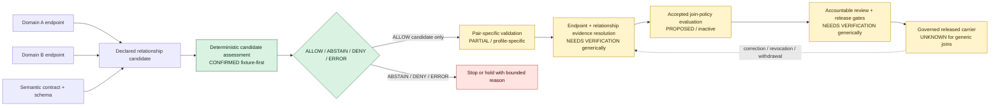

<!-- [KFM_META_BLOCK_V2]
doc_id: kfm://doc/architecture/cross-lane-join-policy
title: Cross-Lane Join Policy — Architecture and Current Implementation Boundary
type: architecture
version: v2.0.0
status: draft; repository-grounded; implementation-partial; policy-inactive; non-publisher
owners:
  - "@bartytime4life"
created: 2026-05-24
updated: 2026-08-18
policy_label: public
owning_root: docs/
responsibility: Explain how KFM preserves endpoint authority, source role, evidence, sensitivity, and release boundaries when records from independently governed domain lanes are evaluated together.
base_commit: f287d7e1501229ebde23737aba98c07279684dbc
prior_blob: 521007752082798a285db0204faf3ee091a3894a
directory_governance: ADR-0029 adopts docs/doctrine/directory-rules.md as the writable Directory Rules authority; this existing same-path architecture page remains explanatory only.
truth_posture: CONFIRMED current repository evidence; PROPOSED policy architecture; UNKNOWN production enforcement unless explicitly identified below
related:
  - ../doctrine/directory-rules.md
  - ../adr/ADR-0029-adopt-directory-governance-standard-v2.md
  - ./TRUST_MEMBRANE.md
  - ./cross-domain/cross-lane-relations.md
  - ./cross-domain/source-role-anti-collapse.md
  - ../../control_plane/cross_domain_seam_register.yaml
  - ../../control_plane/policy_gate_register.yaml
  - ../../contracts/joins/cross_lane_join_assessment.md
  - ../../contracts/source/source_role_transition_assessment.md
  - ../../schemas/contracts/v1/joins/cross_lane_join_assessment.schema.json
  - ../../schemas/contracts/v1/policy/policy_decision.schema.json
  - ../../policy/joins/README.md
  - ../../tools/joins/join_candidates.py
  - ../../fixtures/contracts/v1/joins/cross_lane_join_assessment/cases.json
  - ../../tests/joins/test_join_candidates.py
  - ../../.github/workflows/cross-lane-join-assessment.yml
tags: [kfm, architecture, cross-lane, joins, source-role, evidence, sensitivity, policy-boundary, non-publisher]
notes:
  - "@bartytime4life is the verified CODEOWNERS review route. Join-policy stewardship, affected-domain review, and independent release authority remain NEEDS VERIFICATION."
  - "The current executable proof is a deterministic, fixture-only candidate assessment. It is not a policy evaluator, relationship-truth authority, review decision, release decision, or publication path."
  - "OPEN / STEWARD-REVIEW / DENIED remain proposed policy postures while ADR-S-14 is unresolved; they must not be inferred from helper ALLOW / ABSTAIN / DENY / ERROR outcomes."
[/KFM_META_BLOCK_V2] -->

<a id="top"></a>

# Cross-Lane Join Policy — Architecture and Current Implementation Boundary

> **Operating rule.** A cross-lane operation may produce a reviewable candidate only while every endpoint keeps its own domain authority, source role, evidence reference, temporal and spatial support, and strictest applicable sensitivity. A candidate result is never relationship truth, policy approval, release approval, or publication.


| Field | Current bounded result |
|---|---|
| **Evidence snapshot** | `main@f287d7e1501229ebde23737aba98c07279684dbc` |
| **Architecture page** | **CONFIRMED** at this path; explanatory authority only |
| **Candidate assessment** | **CONFIRMED** contract, schema, helper, 19-case synthetic fixture matrix, focused tests, and a read-only workflow |
| **Join-policy source** | **CONFIRMED** documented at `policy/joins/`; **inactive** — no accepted local bundle, evaluator, selector, or decision emitter is established |
| **Policy postures** | `OPEN`, `STEWARD-REVIEW`, and `DENIED` are **PROPOSED** while ADR-S-14 remains unresolved |
| **Public/release path** | **UNKNOWN / not proven complete** for generic cross-lane joins; no candidate outcome authorizes it |
| **Review route** | `@bartytime4life` through `CODEOWNERS`; stewardship and independent approval remain **NEEDS VERIFICATION** |

> [!IMPORTANT]
> **Do not read this page as activated policy.** The current repository proves a bounded, no-network candidate-assessment slice. It does not prove an accepted generic join policy, `PolicyDecision` family for joins, EvidenceBundle resolution, accountable review, release integration, governed public consumption, or correction propagation for all cross-lane derivatives.

> [!CAUTION]
> `ALLOW` from the fixture helper means only **“emit a reviewable `CANDIDATE_RELATION` report.”** It does not mean `OPEN`, `ANSWER`, evidence closure, relation truth, policy permission, review approval, release, or publication.

**Quick navigation:** [Purpose](#1-purpose-and-non-effects) · [Evidence](#2-current-repository-evidence) · [Responsibility split](#3-responsibility-and-authority-split) · [Invariants](#4-keystone-invariants) · [Source roles](#5-source-role-preservation) · [Candidate assessment](#6-current-candidate-assessment) · [Five checks](#7-five-architecture-level-admissibility-controls) · [Outcomes](#8-outcome-vocabularies-must-not-collapse) · [Seams](#9-current-cross-domain-seam-projection) · [Policy boundary](#10-current-policy-boundary) · [Lifecycle](#11-governed-evaluation-and-release-flow) · [Public surfaces](#12-api-map-search-export-and-ai-boundaries) · [Failure modes](#13-failure-mode-register) · [Validation](#14-validation-and-acceptance) · [Correction](#15-correction-revocation-and-rollback) · [Open decisions](#16-open-decisions-and-verification-backlog) · [References](#17-related-repository-surfaces)

---

## 1. Purpose and non-effects

This page explains the cross-cutting architecture for evaluating a declared relationship candidate between objects owned by different KFM domain lanes. It reconciles the original anti-collapse design with the repository's current fixture-first implementation and inactive policy boundary.

It answers four questions:

1. What must remain separate when endpoints are evaluated together?
2. What does the current candidate helper actually prove?
3. Which additional controls are required before a join can become a governed derivative?
4. Where do meaning, shape, policy, tooling, evidence, review, release, and public delivery belong?

This page does **not**:

- define endpoint or relationship truth;
- choose a canonical identity for either endpoint;
- activate `policy/joins/` or accept ADR-S-14;
- create an `EvidenceBundle`, `PolicyDecision`, `ReviewRecord`, receipt, proof, release manifest, or rollback card;
- authorize lifecycle writes, source activation, public use, release, deployment, promotion, or publication;
- lower rights, consent, sensitivity, geoprivacy, cultural, living-person, infrastructure, or location protections;
- turn a matching key, overlap, proximity, validator pass, workflow success, or helper `ALLOW` into authoritative knowledge.

The document belongs at the existing `docs/architecture/` path because it explains how several responsibility roots compose. Accepted [ADR-0029](../adr/ADR-0029-adopt-directory-governance-standard-v2.md) makes [Directory Rules v2](../doctrine/directory-rules.md) the placement authority; the path does not make this prose policy or implementation authority.

[Back to top](#top)

---

## 2. Current repository evidence

The table below is the strongest safe current-state statement for this architecture at the pinned base commit.

| Surface | Confirmed repository state | Safe interpretation |
|---|---|---|
| This page | Existing architecture file, prior blob `521007752082798a285db0204faf3ee091a3894a` | Same-path modernization; no new authority home is created. |
| Directory governance | ADR-0029 is accepted and pins `docs/doctrine/directory-rules.md` as the writable Directory Rules authority | Placement is settled for this change; policy acceptance is not. |
| Seam projection | [`control_plane/cross_domain_seam_register.yaml`](../../control_plane/cross_domain_seam_register.yaml) is `PROPOSED`, partial, navigational/review-only, and records five high-risk seams as `HOLD_UNRESOLVED` | The register helps reviewers find risk; it does not authorize a join. |
| Semantic profile | [`CrossLaneJoinAssessment`](../../contracts/joins/cross_lane_join_assessment.md) is proposed, fixture-first, dry-run, local-only, and non-authoritative | Meaning is bounded to candidate assessment, not generic relation truth. |
| Machine shape | [`cross_lane_join_assessment.schema.json`](../../schemas/contracts/v1/joins/cross_lane_join_assessment.schema.json) is a closed Draft 2020-12 profile, version `0.1.0` | The current fixture assessment has an enforceable shape. |
| Helper | [`tools/joins/join_candidates.py`](../../tools/joins/join_candidates.py) performs parameterized in-memory exact-key SQL and synthetic spatial-temporal comparison | Deterministic candidate computation exists; no real geometry engine or network source is involved. |
| Fixtures | [`cases.json`](../../fixtures/contracts/v1/joins/cross_lane_join_assessment/cases.json) supplies a synthetic base and 19 finite cases | Test coverage is fixture-bounded and public-safe by construction. |
| Focused tests | [`test_join_candidates.py`](../../tests/joins/test_join_candidates.py) contains ten focused tests covering schema, polarity, SQL handling, outcomes, tamper, interval/identity checks, symlink/duplicate-key rejection, and no-network/no-write properties | Tests prove the declared local profile only. |
| Dedicated workflow | [`cross-lane-join-assessment.yml`](../../.github/workflows/cross-lane-join-assessment.yml) runs with `KFM_NO_NETWORK=1`, pinned actions, the fixture matrix, focused tests, and generated-receipt validation | The workflow validates candidate-assessment artifacts; it does not execute join policy. |
| Policy boundary | [`policy/joins/README.md`](../../policy/joins/README.md) documents two pair-routing children and explicitly reports no local Rego module, accepted bundle, selector, evaluator, or decision emitter | The lane exists but is inactive. |
| Outward policy shape | [`policy_decision.schema.json`](../../schemas/contracts/v1/policy/policy_decision.schema.json) permits six families and does not include `joins` | `policy_family: joins` is not a valid current `PolicyDecision`. |
| Policy gate register | [`control_plane/policy_gate_register.yaml`](../../control_plane/policy_gate_register.yaml) is `PROPOSED` with an empty `entries` list | No active generic join policy gate is registered. |
| Public/release integration | No complete generic flow was established by the inspected contract, schema, helper, policy README, gate register, tests, or workflow | Remains **UNKNOWN / NEEDS VERIFICATION**; do not infer maturity from adjacent files. |

### 2.1 Evidence strength

- **CONFIRMED:** file presence, pinned bytes, closed fixture schema, deterministic helper behavior expressed in code, synthetic fixture count, focused test assertions, workflow commands, policy-lane inactivity, and the empty proposed policy-gate register.
- **PROPOSED:** the complete five-check policy model, three join postures, pair-profile activation rules, outward decision normalization, and public-surface obligations.
- **UNKNOWN / NEEDS VERIFICATION:** accepted join-policy stewardship, an evaluator/bundle binding, required-check coupling, real-source or real-geometry behavior, EvidenceRef-to-EvidenceBundle closure for join relations, review/release/correction integration, and deployed consumers.

[Back to top](#top)

---

## 3. Responsibility and authority split

A cross-lane feature touches many roots, but every artifact keeps one authority owner. The join does not create a new sovereign layer above the participating domains.

| Concern | Owning surface | This architecture consumes it but must not replace it |
|---|---|---|
| Endpoint and domain meaning | Participating domain contracts and domain documentation | Each domain retains authority for its own object, identity, interpretation, and correction. |
| Relationship meaning | [`contracts/joins/`](../../contracts/joins/) or an accepted domain/cross-domain contract | Policy and tooling cannot invent semantics. |
| Machine shape | [`schemas/contracts/v1/joins/`](../../schemas/contracts/v1/joins/) or an accepted relation/domain profile | Schema validity is not relation truth. |
| Source-role transformation grammar | [`contracts/source/source_role_transition_assessment.md`](../../contracts/source/source_role_transition_assessment.md) plus domain source-role matrices | Promotion and joins cannot launder source role. |
| Candidate computation | [`tools/joins/`](../../tools/joins/) and bounded pair-specific validators | A helper may propose; it may not decide policy or publish. |
| Join admissibility source | [`policy/joins/`](../../policy/joins/) after acceptance and binding | Current lane is documented but inactive. |
| Evidence and provenance | Evidence, registry, receipt, proof, and catalog authorities | A join needs endpoint support and independent relationship support; policy cannot invent either. |
| Review | Governed review records and accountable reviewer routes | CODEOWNERS routing is not review proof or release authority. |
| Release, correction, rollback | [`release/`](../../release/) and the relevant lifecycle/accountability roots | No helper or policy outcome substitutes for release closure. |
| Public API, maps, search, export, AI | Governed released-carrier surfaces | Public clients consume released, obligation-compliant derivatives only. |

> [!IMPORTANT]
> **Endpoint validity, relationship validity, policy admissibility, review approval, and release are five different claims.** Proving one never proves the others.

[Back to top](#top)

---

## 4. Keystone invariants

Every binary or n-ary cross-lane operation must preserve these invariants. Missing context fails closed; it is not filled from plausibility, proximity, a domain label, model memory, or a passing workflow.

1. **Domain authority remains separate.** A relation points to domain-owned endpoints; it does not transfer ownership or let one lane rewrite another lane's facts.
2. **Source role remains explicit.** Each endpoint retains its role, and the derivative never upgrades or collapses it.
3. **Sensitivity is monotonic and composition-aware.** The result inherits at least the strictest endpoint posture and may become more restrictive when the combination creates a new protected inference.
4. **Evidence remains separable.** Endpoint evidence and independent relationship support remain separately resolvable; one endpoint's evidence cannot substitute for the relation.
5. **Time, space, scale, precision, cardinality, and uncertainty remain part of the claim.** A join key or overlap does not erase support limits.
6. **Candidate status remains visible.** A helper result is a candidate report, not a graph edge of record, policy decision, review decision, or released carrier.
7. **Rights and consent do not transfer by adjacency.** Permission for one endpoint, purpose, or audience does not silently authorize the other endpoint or the derivative.
8. **Corrections propagate through dependencies.** A corrected, withdrawn, superseded, or newly restricted input invalidates dependent assessments and any later governed derivative.
9. **Public clients remain behind the trust membrane.** No candidate, internal policy input, sensitive reason, or unreleased relationship becomes a normal public path.

The first four are the durable anti-collapse spine. The remaining five make the spine operational across modern KFM surfaces.

[Back to top](#top)

---

## 5. Source-role preservation

### 5.1 Current seven-role vocabulary

The current fixture schema constrains each endpoint to seven values. That is **CONFIRMED for the `CrossLaneJoinAssessment` profile**. Global adoption and evolution of the vocabulary remain a governance decision; domain source-role matrices may add lane-specific interpretation without changing these values silently.

| Role | Bounded meaning | Cross-lane guardrail |
|---|---|---|
| `OBSERVED` | Direct measurement, reading, or first-hand evidentiary record tied to stated support | Preserve observation time, method, scale, and uncertainty; do not let another role become observed by association. |
| `REGULATORY` | Determination or designation with administrative or legal force | Present as regulatory context, not an observed event or measurement. |
| `MODELED` | Derived output from inputs, assumptions, parameters, or fitted methods | Preserve model identity, bounds, input lineage, and run support; never label as observed. |
| `AGGREGATE` | Summary over a unit, interval, or population with loss of record-level fidelity | Preserve aggregation scope; never project to a person, parcel, point, or single event without separate support. |
| `ADMINISTRATIVE` | Compiled record for registration, accounting, administration, or documentation | Preserve documentary caveats; do not present as observation, regulation, title, residence, or causation. |
| `CANDIDATE` | Unresolved or pre-authority record requiring additional evidence, validation, or review | Never expose as released truth; lifecycle movement does not manufacture a stronger role. |
| `SYNTHETIC` | Generated, reconstructed, simulated, or representational content | Preserve the reality boundary and representation support; never present as observed reality. |

### 5.2 Promotion never upgrades role

[`SourceRoleTransitionAssessment`](../../contracts/source/source_role_transition_assessment.md) makes the shared minimum explicit:

| Operation | Allowed output role | Required support |
|---|---|---|
| `PASSTHROUGH` or `GENERALIZE` | Same role as the input | Input evidence linkage and preserved limits |
| `PROMOTE_LIFECYCLE` | Same role; unresolved candidate inputs stay on hold | Promotion changes lifecycle state, not authority class |
| `AGGREGATE` | `AGGREGATE` | Aggregation receipt reference |
| `MODEL` | `MODELED` | Model-run receipt reference |
| `SYNTHESIZE` | `SYNTHETIC` | Representation receipt and reality-boundary note references |

A field observation that later validates a model is a new observed record that may cite the model as context. It is not a relabeled model. An unresolved candidate that later gains support is re-admitted through the governed source/domain process; a lifecycle transition alone does not make it observed.

### 5.3 The current helper's bounded role check

The generic fixture helper preserves both endpoint roles and always emits `output_role: CANDIDATE_RELATION`. Its current compatibility rule abstains when mixed roles include `MODELED`, `AGGREGATE`, or `CANDIDATE`. That is a deliberately narrow fixture rule, not a complete accepted source-role compatibility matrix for every domain pair.

[Back to top](#top)

---

## 6. Current candidate assessment

The implemented slice is a **deterministic candidate-assessment helper**. It provides useful proof without pretending to solve the full join-policy problem.

### 6.1 Mechanics

| Predicate | Current behavior | Explicit limitation |
|---|---|---|
| `EXACT_KEY` | Parameterized one-row-per-side join in in-memory SQLite | Values are synthetic fixture inputs; a key match does not prove identity or relation truth. |
| `SPATIAL_TEMPORAL` | Compares declared synthetic spatial-cell references and timezone-aware validity intervals with bounded tolerance | It is not a geometry engine and proves no real-world spatial relationship. |

Identity is deterministic: the helper computes RFC 8785/SHA-256-bound assessment and candidate identifiers through the repository hashing package. It validates stored decisions against re-derived decisions and fails closed on identity or decision tamper.

### 6.2 Six-rule fixture vector

The assessment emits one non-negative failure count for each rule:

1. `DEPENDENCIES_READY`
2. `EVIDENCE_REFS_PRESENT`
3. `JOIN_PREDICATE_MATCHED`
4. `LIVING_PERSON_SAFE`
5. `SENSITIVITY_SAFE`
6. `SOURCE_ROLES_COMPATIBLE`

These checks are inspectable and deterministic. They are not a complete accepted policy input profile.

### 6.3 Finite helper outcomes

| Helper outcome | Status examples | Exact authority |
|---|---|---|
| `ALLOW` | `JOIN_CANDIDATE` | May emit a reviewable local candidate report only. |
| `ABSTAIN` | `NO_JOIN_CANDIDATE`, `EVIDENCE_REF_MISSING`, `SOURCE_ROLE_REVIEW_REQUIRED`, `SENSITIVITY_REVIEW_REQUIRED` | The helper cannot safely emit an unrestricted candidate under the declared inputs. |
| `DENY` | `LIVING_PERSON_JOIN_DENIED`, `GEOMETRY_PRECISION_BLOCKED` | Candidate emission is refused by the bounded fixture profile. |
| `ERROR` | `VALIDATOR_SYSTEM_ERROR` | A dependency or system condition failed; no candidate assertion is made. |

### 6.4 Effects are schema-fixed to false

Every assessment declares all of these effects as `false`:

- lifecycle write;
- EvidenceBundle creation;
- policy-decision creation;
- review-decision creation;
- release-decision creation;
- publication; and
- public-use authorization.

The governance block is likewise fixture-only, dry-run, no-network, and non-authoritative for identity, relationship truth, policy, review, release, or publication.

### 6.5 What the implementation does not yet do

- resolve `EvidenceRef` to `EvidenceBundle` or prove relationship evidence;
- execute real geometry or source adapters;
- evaluate rights, consent, caller capability, purpose limitation, or full uncertainty composition;
- emit an accepted join `PolicyDecision`;
- produce transform, aggregation, review, release, correction, or rollback records;
- write lifecycle state, catalog/triplet state, or public carriers;
- activate a pair profile or prove n-ary safety.

[Back to top](#top)

---

## 7. Five architecture-level admissibility controls

The draft policy architecture preserves five controls. They are the target governance model, not a claim that the current helper closes them.

| Control | Required result | Current generic implementation status |
|---|---|---|
| **Source-role preservation** | Every endpoint role remains explicit; no role is upgraded, merged, or stripped from the derivative | **PARTIAL:** endpoint roles and `CANDIDATE_RELATION` are preserved; the generic conflict rule is intentionally narrow. |
| **Most-restrictive posture** | The derivative uses at least the strictest endpoint sensitivity and escalates for join-induced risk | **PARTIAL:** the helper computes the strictest of `PUBLIC_SAFE`, `INTERNAL`, `RESTRICTED`, `PROHIBITED`; broader rights/consent/composition policy is absent. |
| **Evidence composition** | Endpoint support and independent relationship support remain separately resolvable; no flattening or substitution | **NOT CLOSED:** the helper checks EvidenceRef presence only and creates no EvidenceBundle. |
| **Receipt and process memory** | Accepted transform, aggregation, policy, review, release, correction, and rollback records are emitted in their owning roots | **NOT IMPLEMENTED BY HELPER:** all decision/evidence/release effects are fixed false. |
| **Authority preservation** | Domains, tools, validators, policy, reviewers, and consumers claim only their assigned authority | **PARTIAL:** endpoint domain/role fields remain visible and all authority effects are false; full reviewer/evaluator/release binding is absent. |

All five compose conservatively. A future accepted evaluator must also receive explicit relationship semantics, time, space, scale, precision, cardinality, uncertainty, rights, consent, sensitivity, review, release, correction, rollback, caller, purpose, audience, and policy identity. The five labels are not a complete machine input schema.

### 7.1 Why the six fixture rules and five policy controls differ

The six-rule vector validates a small candidate-computation profile. The five controls govern whether a relationship derivative is admissible for an operation and audience. They answer different questions and must not be collapsed:

```text
six fixture rules
  -> can the helper emit a bounded candidate report?

five architecture controls + complete governed context
  -> could an accepted policy evaluate a declared derivative?

review + evidence + release + rollback closure
  -> may a governed carrier be exposed to an audience?
```

[Back to top](#top)

---

## 8. Outcome vocabularies must not collapse

KFM currently has several finite vocabularies at different layers. Similar words do not make them interchangeable.

| Vocabulary | Current status | Meaning |
|---|---|---|
| Candidate assessment: `ALLOW`, `ABSTAIN`, `DENY`, `ERROR` | **CONFIRMED implemented** for the fixture profile | Whether the helper emits a bounded candidate report. |
| Proposed join posture: `OPEN`, `STEWARD-REVIEW`, `DENIED` | **PROPOSED** while ADR-S-14 is unresolved | Architecture vocabulary for future operation/audience-specific policy posture. |
| `PolicyDecision`: `ANSWER`, `ABSTAIN`, `DENY`, `ERROR` | **CONFIRMED schema vocabulary** for six existing families | Outward policy result for a supported family; `joins` is not currently enumerated. |
| Validation: `PASS` / `FAIL` and findings | **CONFIRMED in focused validation** | Whether an artifact conforms to its declared profile. |
| Review state | **Separate authority** | Accountable approval, requested changes, hold, or rejection. |
| Release/publication state | **Separate authority** | Whether a reviewed derivative is included in a governed release and exposed to an audience. |

Forbidden translations include:

- helper `ALLOW` → proposed `OPEN`;
- helper `ALLOW` → `PolicyDecision.ANSWER`;
- validator `PASS` → relation truth;
- workflow success → review approval;
- review approval → release;
- release filename or location → publication;
- any finite outcome → source-role upgrade.

> [!WARNING]
> The current `PolicyDecision` schema does not permit `policy_family: joins`. A future implementation must either adopt a versioned schema change or compose accepted existing-family decisions through a separate accepted contract. It must not emit schema-invalid join decisions under a familiar filename.

[Back to top](#top)

---

## 9. Current cross-domain seam projection

The proposed [`cross_domain_seam_register.yaml`](../../control_plane/cross_domain_seam_register.yaml) is a navigational and review projection, not an allowlist. Its defaults preserve each participant's EvidenceBundle, source role, strictest sensitivity/policy posture, and release requirement. It grants no mutation or publication authority.

At the pinned baseline, all five registered seams are `HOLD_UNRESOLVED`, `public_join_allowed: false`, and have no bound seam contract path.

| Seam | Preserved authority | Prohibited inference |
|---|---|---|
| Agriculture × Soil — suitability context | Agriculture owns agricultural observations; Soil owns map units/components/properties | Private farm/operator/parcel/yield join; soil property presented as observed crop yield |
| Archaeology × Roads/Rail/Trade — historic corridor context | Archaeology owns site identity, sensitivity, provenience; Roads/Rail/Trade owns corridor identity and route uncertainty | Corridor inflection treated as site location; historic route treated as archaeological evidence |
| Atmosphere × Hazards — condition/advisory context | Atmosphere owns observations/models/forecast context; Hazards owns event and official-advisory context | Advisory presented as measurement; model/forecast presented as observed condition |
| Fauna × Hydrology — aquatic occurrence context | Fauna owns occurrence/taxon/sensitivity; Hydrology owns unit/reach/water context | Occurrence treated as established population; public HUC used to imply precise sensitive occurrence |
| Hazards × Settlements/Infrastructure — exposure context | Hazards owns hazard/exposure context; Settlements/Infrastructure owns asset/settlement identity and sensitivity | Exposure summary used to reveal precise asset location; hazard geometry treated as infrastructure identity |

New or unregistered seam shapes must remain fail-closed. Adding a row to a proposed register is not policy acceptance, and pairwise-safe seams do not prove an n-ary composition safe.

[Back to top](#top)

---

## 10. Current policy boundary

### 10.1 Verified local tree and status

```text
policy/joins/
├── README.md
├── habitat-fauna/
└── habitat-hydrology/
```

The parent and pair children document routing, risks, inputs, and future authoring requirements. The inspected parent reports:

- no local `.rego` module;
- no accepted policy bundle;
- no selector or evaluator binding;
- no decision emitter;
- no native join-policy tests;
- no active entry in the proposed policy-gate register; and
- no complete runtime, release, or public-consumer flow.

The two current pair children are documentation boundaries. Their presence does not prove either pair `OPEN`, accepted, or active.

### 10.2 Proposed posture model

The architecture's three postures remain useful as a target, but they have no current generic evaluator:

| Proposed posture | Bounded future meaning | Required handling |
|---|---|---|
| `OPEN` | An accepted profile supports the exact operation and audience with complete inputs and enforceable obligations | Continue only to downstream evidence, review, lifecycle, and release gates; never infer publication. |
| `STEWARD-REVIEW` | Accountable domain/specialist judgment is required | Hold or abstain; preserve reasons; do not expose publicly. |
| `DENIED` | The operation is prohibited or cannot be made safe under the declared profile | Stop and record only bounded, public-safe reasons in an accepted process lane. |

No current pair is proven `OPEN` by the inspected policy lane. Novel, ambiguous, unsupported, unregistered, rights-unclear, consent-unclear, sensitive, or n-ary profiles must fail closed until accepted policy and accountable review say otherwise.

### 10.3 Activation requirements

A future child policy profile must identify and pin at least:

- participating domains, orientation, predicate, direction, cardinality, operation, purpose, audience, and caller class;
- semantic contract and canonical machine profile;
- endpoint, relationship, and EvidenceBundle requirements;
- time, space, scale, precision, uncertainty, rights, consent, sensitivity, geoprivacy, and correction inputs;
- policy package, version, entrypoint, bundle digest, evaluator identity, and accepted decision mapping;
- finite outcomes, public-safe reasons, enforceable obligations, and consumer capabilities;
- positive, abstain, deny, error, leakage, revocation, stale-decision, cache, and rollback fixtures;
- accountable domain and specialist review routes; and
- decision, receipt, release, correction, withdrawal, and rollback homes.

[Back to top](#top)

---

## 11. Governed evaluation and release flow

The safe end-to-end model keeps candidate computation, policy, review, release, and public delivery visibly separate.


```mermaid
flowchart LR
  A["Domain A endpoint"] --> J["Declared relationship candidate"]
  B["Domain B endpoint"] --> J
  C["Semantic contract + schema"] --> J

  J --> V["Deterministic candidate assessment\nCONFIRMED fixture-first"]
  V --> Q{"ALLOW / ABSTAIN / DENY / ERROR"}

  Q -->|ALLOW candidate only| PV["Pair-specific validation\nPARTIAL / profile-specific"]
  Q -->|ABSTAIN / DENY / ERROR| STOP["Stop or hold with bounded reason"]

  PV --> E["Endpoint + relationship evidence resolution\nNEEDS VERIFICATION generically"]
  E --> P["Accepted join-policy evaluation\nPROPOSED / inactive"]
  P --> R["Accountable review + release gates\nNEEDS VERIFICATION generically"]
  R --> U["Governed released carrier\nUNKNOWN for generic joins"]

  U -. correction / revocation / withdrawal .-> E

  classDef confirmed fill:#d9f2e1,stroke:#1f6f43,color:#0b2e1a;
  classDef proposed fill:#fff4cc,stroke:#b58900,color:#3b2a00;
  classDef stop fill:#ffe4e1,stroke:#a04545,color:#3b0b0b;
  class V,Q confirmed;
  class PV,E,P,R,U proposed;
  class STOP stop;
```

### 11.1 Lifecycle interpretation

- Candidate assessment is read-only and does not write RAW, WORK, QUARANTINE, PROCESSED, CATALOG/TRIPLET, or PUBLISHED.
- A future admitted relationship record must enter the owning lifecycle through an accepted contract and policy path; a helper report is not copied into PUBLISHED.
- Evidence closure and policy posture must be known before release assembly.
- Release remains a governed state transition with review, correction, withdrawal, and rollback support appropriate to the consequence.
- Watchers, tools, validators, workflows, maps, search, and AI remain non-publishers.

[Back to top](#top)

---

## 12. API, map, search, export, and AI boundaries

Joined data can create a protected fact even when each endpoint appears public. Controls must apply to the complete derivative and every carrier, not only to the input rows.

| Surface | Required architecture | Fail-closed condition |
|---|---|---|
| Catalog / graph | Declared relation profile, endpoint refs, roles, evidence, uncertainty, visibility, correction lineage | Unsupported or sensitive candidate becomes discoverable truth. |
| Governed API / search | Released DTO, server-side obligation enforcement, field allowlist, visibility filter, stale-index invalidation | Candidate, internal policy state, or restricted fields leak through raw responses or snippets. |
| Map / tiles | Generalization floor, audience projection, role labels, release state, dependency-aware cache invalidation | Zoom, style, overlay, or stale cache reconstructs protected precision or hides role distinctions. |
| Export / screenshot | Explicit permission, quantity and precision limits, field allowlist, surface-aware suppression | Bulk or visual composition defeats per-record controls. |
| Embeddings / retrieval | Public-safe corpus, visibility metadata, correction/deletion propagation | Similarity search preserves or reconstructs a withdrawn or restricted relationship. |
| Focus Mode / AI | Resolve released evidence, preserve endpoint roles and limitations, cite or abstain, emit a bounded runtime outcome | Generated language invents, strengthens, homogenizes, or retains an unsupported relation. |

AI may summarize a released cross-lane derivative only after the underlying evidence and policy context close. It must identify modeled, aggregate, regulatory, administrative, candidate, or synthetic support rather than flattening it into fluent prose. It must not use model memory to repair an unresolved EvidenceRef or generate management, legal, ownership, alert, or operational conclusions beyond the released evidence scope.

Current production enforcement of these generic join controls remains **UNKNOWN / NEEDS VERIFICATION**. This section defines the architectural burden; it does not claim deployed behavior.

[Back to top](#top)

---

## 13. Failure-mode register

| Failure mode | Why it is unsafe | Required bounded response |
|---|---|---|
| Modeled or forecast material presented as observed | Launders derivation and uncertainty into apparent measurement | Candidate `ABSTAIN`; future policy/public surface `ABSTAIN` or `DENY`. |
| Regulatory designation presented as an observed event | Converts authority context into event evidence | Keep roles separate; deny homogeneous presentation. |
| Aggregate projected to person, parcel, point, or single event | Invents fidelity the aggregate does not contain | Abstain or deny; preserve aggregation support and precision. |
| Administrative record presented as observation, residence, title, heirship, or causation | Overstates documentary evidence and may create legal/privacy harm | Preserve administrative caveats; deny unsupported conclusion. |
| Candidate exposed as released truth | Bypasses evidence, policy, review, and release | Deny public path; keep candidate report internal. |
| Synthetic reconstruction presented as reality | Hides representation and may expose inferred sensitive context | Require reality-boundary support; abstain or deny. |
| Evidence present on endpoints but absent for the relationship | Treats adjacency as proof | Abstain; require independent relation support. |
| Public inputs combined into a living-person, rare-species, archaeology, or critical-asset inference | Join-induced sensitivity creates a new protected fact | Deny or generalize under accepted policy and specialist review. |
| Pairwise-safe links combined into unsafe n-ary reconstruction | Pair checks miss whole-set harm | Re-evaluate the complete set; fail closed. |
| Workflow success represented as policy or release approval | Confuses conformance evidence with authority | Keep validation, policy, review, and release objects distinct. |
| Denied join renamed as context, enrichment, integration, crosswalk, or convenience | Evades controls through vocabulary | Evaluate structure, effect, and audience rather than filename. |
| Corrected or withdrawn endpoint survives in graph, tile, search, export, or AI cache | Public state becomes stale and misleading | Invalidate dependent assessments, decisions, carriers, and caches. |
| Failure reason echoes identity, coordinates, private review notes, or exploit detail | Denial path leaks the protected fact | Emit stable public-safe codes; keep sensitive detail in restricted review evidence. |

[Back to top](#top)

---

## 14. Validation and acceptance

### 14.1 Current executable proof commands

The dedicated workflow runs the following no-network checks for the candidate-assessment slice:

```bash
python tools/ci/install_python_ci.py project-test
python tools/joins/join_candidates.py --fixtures
python -m pytest tests/joins/test_join_candidates.py -q --strict-config --strict-markers
python tools/validators/validate_generated_receipt.py \
  data/receipts/generated/genrec-full-atlas-crosswalk-validator-20260809.json \
  --repo-root .
```

These commands validate the existing contract/schema/helper/fixture/test slice. They do not validate or activate `policy/joins/`.

### 14.2 Documentation acceptance for this page

A review of this page should prove:

- every current-state claim is pinned to a repository surface named in §2;
- proposed policy and public behavior remain visibly proposed or unknown;
- helper `ALLOW` is never equated with policy, review, release, or publication;
- current paths use accepted responsibility roots and do not create a parallel home;
- source role, sensitivity, evidence, domain authority, lifecycle, and correction remain separate;
- relative links resolve at the branch head;
- headings and local anchors are unique;
- Mermaid describes status honestly and does not imply implementation where none is proven;
- no owner, steward, approval, required check, or deployment state is invented.

### 14.3 Workflow coupling note

The dedicated `cross-lane-join-assessment` workflow currently watches the contract, schema, helper, fixture, test, source-map, receipt, and workflow paths. This architecture page is not in that workflow's path filter. A future behavioral change must close its own dependency set and update workflow filters when the documentation is a required contract companion; a prose-only update must not force unrelated behavioral CI merely to obtain a badge.

[Back to top](#top)

---

## 15. Correction, revocation, and rollback

Cross-lane derivatives depend on more than two endpoint rows. Their dependency graph includes endpoint identity and versions, source roles, evidence, time/space support, rights, consent, sensitivity, relationship profile, policy, reviews, release, and every public carrier.

A mature implementation must:

1. bind assessments and decisions to immutable or versioned endpoint and profile identities;
2. expire or recompute when any bound input changes;
3. propagate source corrections, consent revocation, rights changes, sensitivity escalation, policy supersession, review withdrawal, and release withdrawal;
4. invalidate catalog/graph projections, API/search indexes, map/tile caches, exports, embeddings, and AI retrieval state;
5. preserve prior decisions and bounded reason codes for audit without leaking protected details; and
6. retain a rollback target for every material released derivative.

Current generic correction and rollback closure for join derivatives is **NEEDS VERIFICATION**. The candidate helper creates no lifecycle or release state, so reverting its bounded implementation or this documentation update has no direct publication effect.

**Rollback for this page:** revert the single documentation commit. No contract, schema, policy source, fixture, test, data, receipt, release, or public artifact is changed by this update.

[Back to top](#top)

---

## 16. Open decisions and verification backlog

| Priority | Decision or verification item | Current status | Closure evidence |
|---|---|---|---|
| P0 | Replace the lineage placeholder ADR-S-14 with an accepted numbered decision, or explicitly reject/revise the three-posture model | `PROPOSED / unresolved` | Accepted ADR with exact scope, non-effects, migration, tests, correction, and rollback. |
| P0 | Decide the outward join-policy result contract | `CONFLICTED / open` | Versioned decision: add a `joins` family to `PolicyDecision`, compose existing families through a separate accepted contract, or adopt another finite object without parallel authority. |
| P0 | Bind an accepted policy bundle, evaluator, selector, input profile, and decision emitter | `ABSENT in inspected lane` | Pinned policy source, evaluator identity, fixtures, native tests, register entry, and governed consumer tests. |
| P0 | Resolve endpoint and relationship evidence separately | `NOT CLOSED generically` | EvidenceRef-to-EvidenceBundle resolver behavior plus independent relationship support, negative fixtures, and correction propagation. |
| P0 | Establish accountable join-policy, domain, privacy/rights, sensitivity, security, review, and release roles | `NEEDS VERIFICATION` | Verified assignments and separation-of-duties record; CODEOWNERS alone is insufficient. |
| P1 | Reconcile sensitivity vocabularies (`PUBLIC_SAFE` / `INTERNAL` / `RESTRICTED` / `PROHIBITED`, T0–T4 lineage, and domain-specific profiles) | `NEEDS DECISION` | Accepted crosswalk with monotonic and join-induced-risk rules plus compatibility fixtures. |
| P1 | Resolve join/relation/domain machine-profile placement and aliases | `CONFLICTED / open` | Accepted contract/schema placement decision and migration/compatibility plan. |
| P1 | Define pair-profile registry, orientation, slug grammar, inheritance, and first-admission review | `PARTIAL documentation only` | Machine register, schema, validator, pair fixtures, owner review, and no-silent-inheritance tests. |
| P1 | Define n-ary and joint-coherence evaluation | `UNKNOWN` | Whole-set algorithm, reconstruction-risk fixtures, deterministic identity, and fail-closed tests. |
| P1 | Define transform, aggregation, policy, review, correction, and release receipt bindings | `NOT IMPLEMENTED by generic helper` | Canonical object references, schemas, validators, and replay tests. |
| P1 | Prove governed public consumers enforce every obligation | `UNKNOWN` | API/map/search/export/AI contract tests, negative leakage fixtures, cache invalidation, and withdrawal replay. |
| P2 | Couple required hosted checks to accepted risk-significant changes | `NEEDS VERIFICATION` | Exact-head hosted runs and repository required-check evidence without weakening gates. |
| P2 | Define bounded public-safe reason-code and audit-detail separation | `PROPOSED` | Accepted reason registry, sensitive-output tests, reviewer guidance, and correction semantics. |

Until these close, the safe system claim is narrow: **KFM can deterministically assess synthetic cross-lane candidates under one fixture profile; generic join-policy and public-release closure remain incomplete.**

[Back to top](#top)

---

## 17. Related repository surfaces

### Governing placement and trust

- [Directory Rules v2](../doctrine/directory-rules.md) — accepted placement law through ADR-0029.
- [ADR-0029](../adr/ADR-0029-adopt-directory-governance-standard-v2.md) — adoption and compatibility-migration decision.
- [Trust Membrane](./TRUST_MEMBRANE.md) — broader public/internal architecture.
- [Cross-Lane Relations](./cross-domain/cross-lane-relations.md) — earlier four-invariant synthesis; treat current implementation claims there as lineage unless reverified.
- [Source-Role Anti-Collapse](./cross-domain/source-role-anti-collapse.md) — detailed role-collapse doctrine lineage.

### Current machine and executable evidence

- [CrossLaneJoinAssessment contract](../../contracts/joins/cross_lane_join_assessment.md)
- [CrossLaneJoinAssessment schema](../../schemas/contracts/v1/joins/cross_lane_join_assessment.schema.json)
- [SourceRoleTransitionAssessment](../../contracts/source/source_role_transition_assessment.md)
- [Candidate helper](../../tools/joins/join_candidates.py)
- [Synthetic fixture matrix](../../fixtures/contracts/v1/joins/cross_lane_join_assessment/cases.json)
- [Focused tests](../../tests/joins/test_join_candidates.py)
- [Dedicated workflow](../../.github/workflows/cross-lane-join-assessment.yml)

### Policy and control-plane boundaries

- [Join policy boundary](../../policy/joins/README.md)
- [Habitat–Fauna pair routing](../../policy/joins/habitat-fauna/README.md)
- [Habitat–Hydrology pair routing](../../policy/joins/habitat-hydrology/README.md)
- [Cross-domain seam register](../../control_plane/cross_domain_seam_register.yaml)
- [Policy gate register](../../control_plane/policy_gate_register.yaml)
- [PolicyDecision schema](../../schemas/contracts/v1/policy/policy_decision.schema.json)

---

## Appendix A — Candidate-assessment interpretation card

| Question | Safe answer from the current helper |
|---|---|
| Did the declared exact key or synthetic spatial-temporal predicate match? | Yes/no, deterministically, within the fixture profile. |
| Were both EvidenceRef fields present? | Yes/no; presence only, not resolution. |
| Did the bounded living-person or geometry-precision rule block candidate emission? | Yes/no, under the fixture values. |
| Were endpoint source roles retained? | Yes; both remain visible and output is `CANDIDATE_RELATION`. |
| Was strictest fixture sensitivity inherited? | Yes, across the four profile values. |
| Is the relationship true? | **Not established.** |
| Is the join allowed by accepted policy? | **Not established.** |
| Was review completed? | **No authority to say.** |
| Is the derivative released or public-safe? | **No. Every effect is fixed false.** |

## Appendix B — Reviewer stop conditions

Stop and return `ABSTAIN`, `DENY`, `ERROR`, `HOLD`, or an equivalent accepted fail-closed result when any of these remains unresolved for the requested operation and audience:

- endpoint identity, owner, lifecycle state, source role, or correction posture;
- relationship semantics, direction, cardinality, or independent evidence;
- valid/observation time, geography, scale, precision, uncertainty, or tolerance;
- rights, consent, purpose limitation, sensitivity, geoprivacy, cultural, living-person, genomic, archaeology, rare-species, or infrastructure posture;
- policy identity, bundle, evaluator, reason/obligation mapping, or caller capability;
- required review, release reference, correction path, withdrawal behavior, or rollback target; or
- consumer ability to enforce every obligation across API, map, search, export, cache, embedding, and AI surfaces.

## Appendix C — Lineage join-risk examples

The prior edition collected the examples below from atlas and sibling-document lineage. They remain useful for threat modeling, but they are **not an accepted pair registry, posture allowlist, or proof of implementation**. Where a row overlaps the current seam register, the register state in §9 controls the current navigational projection; otherwise the row remains `LINEAGE / PROPOSED` until repository and governance evidence establishes a profile.

| Example composition | Primary risk to preserve | Safe default before an accepted profile |
|---|---|---|
| Hydrology × Fauna | Public hydrologic geometry may narrow a sensitive aquatic occurrence | Hold for fauna/geoprivacy review; never infer precise occurrence or established population. |
| Soil × Agriculture | Aggregate context may be joined to private farm, operator, parcel, or yield detail | Permit only separately supported aggregate context; deny private-identifying composition. |
| Archaeology × Roads/Rail | Corridor geometry may reveal or appear to prove a site location | Hold; preserve archaeology authority and withhold precise site support. |
| Hazards × Settlements/Infrastructure | Exposure context may reveal critical-asset precision | Separate public summary from operational detail; deny exploit-enabling precision. |
| People × Land | Historical administration may be mistaken for living-person residence, title, or ownership | Deny living-person/location inference; preserve documentary and legal caveats. |
| Atmosphere × Hazards | Observation, model, forecast, advisory, and regulatory context may collapse | Preserve each role and time; abstain or deny homogeneous presentation. |
| Frontier Matrix × any domain | One named classification may be presented as universal truth | Require versioned definition, geography/time, uncertainty, and source-role-visible support. |
| Fauna × Flora | Invasive or ecological context may become unsupported management instruction | Frame evidence and uncertainty; do not generate instruction-class conclusions. |
| Fauna × Habitat | A modeled habitat surface may imply a restricted occurrence | Permit only separately released public-safe support; deny reconstruction of sensitive occurrence. |
| Flora × Archaeology | Ethnobotanical context may reveal cultural or site information | Hold for qualified cultural/domain review and preserve exact-location restrictions. |
| Critical asset × Hazards | Combined access, topology, hazard, and asset detail may enable adversary mapping | Deny precise public composition; allow only reviewed generalized summaries. |
| Planetary/3D × sensitive domain | Reconstruction may be read as observation or expose hidden precision | Require an explicit reality boundary, representation support, and sensitivity review. |

These examples should migrate into accepted pair or seam profiles only through the owning contract, schema, policy, fixture, validator, review, and correction path. Repetition in architecture prose does not activate them.

---

> **Document boundary:** explanatory cross-cutting architecture · **Current proof:** deterministic, synthetic, no-network candidate assessment · **Current join-policy state:** documented but inactive · **Publication authority:** none.

[Back to top](#top)
