# 🗃️ **Kansas Frontier Matrix — Data Architecture & Lineage (v2.1.1 · Tier-Ω+∞ Certified)**  
`docs/architecture/data-architecture.md`

**Mission:** Define, document, and govern the **data architecture** of the **Kansas Frontier Matrix (KFM)** —  
ensuring reproducible pipelines, traceable provenance, and FAIR+CARE-aligned data lifecycle management under **MCP-DL v6.4.3**.

---

## 📚 Overview

The **KFM Data Architecture** establishes a governed, transparent framework for managing data through all stages of its lifecycle —  
from raw ingestion to processed, validated, enriched, and archived datasets.  

It ensures interoperability through **STAC**, **DCAT**, and **CIDOC CRM** linkages, backed by FAIR+CARE principles and automated CI/CD validation.

---

## 🧩 Architecture Overview

```mermaid
flowchart TD
  subgraph RAW["Raw Layer"]
    R1["External Data (NOAA · USGS · FEMA · KGS)"]
    R2["Immutable Storage · metadata.json"]
  end

  subgraph WORK["Work Layer"]
    W1["ETL Processing (Extract · Transform · Load)"]
    W2["FAIR+CARE Validation"]
    W3["Temporary Staging (tmp · processed · validation)"]
  end

  subgraph STAC["Metadata Layer"]
    S1["STAC Catalog · DCAT Dataset"]
    S2["Collection + Item JSON Files"]
  end

  subgraph ARCH["Archive Layer"]
    A1["Checksummed Artifacts"]
    A2["Manifest + SBOM + Ledger"]
  end

  subgraph GOV["Governance Layer"]
    G1["FAIR+CARE Council Review"]
    G2["Governance Ledger Entry"]
  end

  R1 --> R2 --> W1 --> W2 --> W3 --> S1 --> S2 --> A1 --> A2 --> G1 --> G2
```

<!-- END OF MERMAID -->

---

## 🧱 Data Layer Definitions

| Layer | Purpose | Key Directory | Examples |
|:--|:--|:--|:--|
| **Raw Layer** | Immutable, original source data. | `data/raw/` | NOAA, USGS, FEMA datasets. |
| **Work Layer** | Temporary and processed workspace for ETL operations. | `data/work/` | Normalized `.geojson`, `.csv`, `.tif`. |
| **Metadata Layer** | Machine-readable dataset catalogs and FAIR+CARE metadata. | `data/stac/`, `data/meta/` | STAC items, DCAT datasets. |
| **Archive Layer** | Permanently preserved, versioned releases. | `data/archive/` | `manifest.zip`, `sbom.spdx.json`. |
| **Governance Layer** | Provenance tracking and ethical data oversight. | `data/reports/` | FAIR+CARE, validation, audit ledgers. |

---

## ⚙️ Data Lifecycle Process

<!-- END OF MERMAID -->

---

## 🧮 Metadata Standards

| Standard | Domain | Application |
|:--|:--|:--|
| **STAC 1.0** | Geospatial data cataloging | `data/stac/catalog.json`, `items/` |
| **DCAT 3.0** | Dataset metadata interoperability | `data/meta/*.jsonld` |
| **CIDOC CRM** | Cultural heritage entity linkage | `data/graph/entities/` |
| **OWL-Time** | Temporal data semantics | Event timelines |
| **GeoSPARQL** | Geospatial relationships | Bounding box, geometry fields |
| **FAIR / CARE** | Data ethics and governance | `data/reports/fair/`, `data/reports/audit/` |

---

## ⚖️ FAIR + CARE Alignment

| Principle | Implementation | Artifact |
|:--|:--|:--|
| **Findable** | Unique STAC item IDs and catalog search. | `data/stac/catalog.json` |
| **Accessible** | Open datasets under MIT / CC-BY 4.0 licenses. | `LICENSE` |
| **Interoperable** | STAC/DCAT metadata with JSON-LD. | `data/meta/*.jsonld` |
| **Reusable** | Versioned datasets with manifest checksums. | `releases/v*/manifest.zip` |
| **Collective Benefit (CARE)** | Governance council reviews for cultural sensitivity. | `data/reports/audit/data_provenance_ledger.json` |

---

## 🔍 Governance Integration

| Workflow | Function | Output |
|:--|:--|:--|
| `stac-validate.yml` | Validates STAC/DCAT metadata schema. | `reports/validation/stac_validation_report.json` |
| `faircare-validate.yml` | Runs FAIR+CARE compliance checks. | `reports/fair/data_care_assessment.json` |
| `governance-ledger.yml` | Updates provenance and checksum logs. | `data/reports/audit/data_provenance_ledger.json` |
| `policy-check.yml` | Verifies data contract adherence. | `reports/audit/policy_check.json` |

---

## 🧩 Data Provenance Model

<!-- END OF MERMAID -->

Each dataset is cryptographically signed and recorded in:
- `data/reports/audit/data_provenance_ledger.json`
- `releases/v*/manifest.zip`
- `releases/v*/sbom.spdx.json`

---

## 🧠 Tools & Validation Frameworks

| Tool | Role | Validation Layer |
|:--|:--|:--|
| **GDAL / Rasterio / Fiona** | Geospatial transformations. | Work layer |
| **stac-validator** | STAC schema validation. | Metadata layer |
| **pySHACL / rdflib** | RDF and ontology validation. | Graph layer |
| **spaCy / GeoPy** | NLP + geocoding enrichment. | Enrichment layer |
| **OPA / Conftest** | Governance and compliance rules. | Policy layer |

---

## 🧾 Version History

| Version | Date | Author | Summary |
|:--|:--|:--|:--|
| **v2.1.1** | 2025-11-16 | @kfm-architecture | Added FAIR+CARE governance, DCAT integration, and CI validation mapping. |
| v2.0.0 | 2025-10-25 | @kfm-data-lab | Introduced ontology integration and provenance model diagram. |
| v1.0.0 | 2025-10-04 | @kfm-architecture | Initial data architecture and lifecycle documentation. |

---

**Kansas Frontier Matrix © 2025**  
*“Every Dataset Has a Lineage — Every Lineage Has Governance.”*  
📍 `docs/architecture/data-architecture.md` — Data lifecycle and governance architecture of the Kansas Frontier Matrix.

