<div align="center">

# 🧱 **Kansas Frontier Matrix — Data Architecture (v2.0.0 · Tier-Ω+∞ Certified)**  
`docs/architecture/data-architecture.md`

**Mission:** Specify the **full data subsystem** of the **Kansas Frontier Matrix (KFM)** — how datasets move through **acquisition → transformation → validation → cataloging → publication**, with **lineage, integrity, and interoperability** guaranteed under **MCP-DL v6.3** and **FAIR/CARE**.

[](../../.github/workflows/site.yml)
[](../../.github/workflows/stac-validate.yml)
[](../../docs/)
[](../../.github/workflows/sbom.yml)
[](../../.github/workflows/slsa.yml)
[](../../LICENSE)

</div>

---

```yaml
---
title: "Kansas Frontier Matrix — Data Architecture"
document_type: "Architecture Spec"
version: "v2.0.0"
last_updated: "2025-11-16"
owners: ["@kfm-data","@kfm-architecture","@kfm-ai","@kfm-security","@kfm-accessibility"]
status: "Stable"
maturity: "Production"
license: "CC-BY 4.0"
tags: ["data-architecture","stac","etl","checksums","provenance","tiles","crs","parquet","cog","jsonl","fair","care","dq"]
alignment:
  - MCP-DL v6.3
  - STAC 1.0 / STAC API
  - DCAT 2.0
  - JSON Schema / ISO 19115
  - CIDOC CRM / OWL-Time / GeoSPARQL
  - COG / MVT / NetCDF / Parquet
validation:
  docs_ci_required: true
  frontmatter_required: ["title","version","owners","last_updated","license"]
  mermaid_end_marker: "<!-- END OF MERMAID -->"
observability:
  endpoint: "https://metrics.kfm.ai/data"
  metrics: ["stac_pass_rate","checksum_drift_pct","dq_rule_pass_pct","tile_build_latency_s","storage_growth_gb"]
preservation_policy:
  retention: "raw permanent · processed 5y · logs 90d · tiles 2y"
  checksum_algorithm: "SHA-256"
  replication_targets: ["GitHub","Zenodo DOI","OSF"]
---
```

---

## 📚 Overview

KFM’s **data architecture** turns **heterogeneous historical, ecological, and textual sources** into **clean, indexed, and documented** spatiotemporal assets.  
The system is **declarative and deterministic**: any contributor can **rebuild identical outputs** with **verifiable provenance**.

---

## 🧩 Data System Layers

```mermaid
flowchart TD
  A["🌐 External Sources\n(data/sources/)"] --> B["📦 Raw Archive\n(data/raw/ · LFS/DVC)"]
  B --> C["⚙️ ETL & Enrichment\n(src/etl/ · Makefile)"]
  C --> D["✅ Processed Datasets\n(data/processed/)"]
  D --> E["🧩 STAC & Metadata\n(data/stac/ · processed/metadata/)"]
  E --> F["🔐 Checksums & QA\n(data/checksums/ · DQ reports)"]
  F --> G["🗺 Tiles & Exports\n(data/tiles/ · KML/KMZ)"]
  G --> H["🌎 Publication & UI\n(web/ · Pages · API / STAC API)"]
```


<!-- END OF MERMAID -->

---

## 🧱 Components & Standards

| Layer | Directory | Description | Standards |
|:--|:--|:--|:--|
| **Source Registry** | `data/sources/` | JSON manifests (origin, license, coverage, access) | JSON Schema |
| **Raw Archive** | `data/raw/` | Immutable snapshots (optionally DVC) | Source formats |
| **ETL Pipelines** | `src/etl/` | Python/GDAL/Rasterio/Pandas + Makefile orchestration | MCP workflows |
| **Processed Store** | `data/processed/` | Validated outputs | COG, GeoJSON, CSV, Parquet, JSONL |
| **Metadata & Catalogs** | `data/stac/` · `data/processed/metadata/` | STAC Items/Collections + thumbnails, previews | STAC 1.0, JSON Schema |
| **Checksums & QA** | `data/checksums/` | SHA-256 hashes + Data Quality (DQ) reports | FIPS 180-4 |
| **Tiles** | `data/tiles/` | MVT/COG pyramids for web | MVT, EPSG:3857 |

---

## 🧭 Data Contracts & Conventions

### File naming
```
<domain>_<dataset>_v<MAJOR>.<MINOR>_<year>.<ext>
# e.g. terrain_ks_1m_dem_v2.0_2020.tif
```

### CRS & projection policy
- **Authoritative** CRS: **EPSG:4326** for catalog coordinates.  
- Tiles in **EPSG:3857**; rasters in native projection allowed, published as **COG**; reprojected views provided when needed.

### Compression & formats
- **COG**: `DEFLATE`, overviews, internal tiling.  
- **GeoJSON**: UTF-8, `bbox` present, feature count logged.  
- **Parquet**: columnar for large tabulars; **gzip/snappy** as appropriate.  
- **JSONL** for OCR/text corpora.

### Partitioning
- Temporal partitioning by **year/quarter** for large rasters; spatial partitioning by **HUC/County** for vectors where helpful.

---

## 🧮 Data Quality (DQ) Framework

| Rule | Description | Target |
|:--|:--|:--|
| **Schema completeness** | Required STAC + custom fields present | 100% |
| **Geometry validity** | No self-intersections / empty geom | 100% |
| **CRS declared** | CRS in metadata and files | 100% |
| **Checksum parity** | SHA-256 match raw→processed | 100% |
| **Temporal plausibility** | Dates within expected intervals | ≥ 99% |
| **Value ranges** | Domain-specific numeric bounds | per domain |

**Reports**: `data/processed/metadata/<domain>/dq_report.json` (CI artifact and Pages report).

---

## ⚙️ ETL Orchestration

**Makefile targets**
```bash
make fetch           # pull sources by manifest
make process         # run all ETL pipelines
make stac            # write & validate STAC items/collections
make checksums       # compute and diff SHA-256
make tiles           # build raster/vector tiles
make validate        # run full DQ suite
```

**Pipeline guarantees**
- Logs to `data/work/logs/`  
- Thumbnails to `data/processed/metadata/<domain>/thumbnails/`  
- Per-asset `.sha256` and STAC item emitted atomically

---

## 🧾 STAC & Metadata Linkage

**1↔1 relationships** for each dataset:

1) **Source** → `data/sources/<domain>/<dataset>.json`  
2) **Processed** → `data/processed/<domain>/<dataset>.<ext>`  
3) **Checksum** → `data/checksums/<domain>/<dataset>.<ext>.sha256`  
4) **STAC Item** → `data/stac/<domain>/<dataset>.json`  
5) **Preview** → `data/processed/metadata/<domain>/thumbnails/<dataset>.png`

**Required STAC fields**
- `license`, `providers`, `created`, `links`, `datetime`/`interval`, `bbox`, `assets.data`, `assets.thumbnail`  
- **Lineage**: use `rel:source` and `rel:derived_from` (or `scientific:lineage` if extension enabled)

---

## 🔐 Integrity, Provenance & Supply Chain

| Mechanism | Purpose | Enforcement |
|:--|:--|:--|
| **Checksums (SHA-256)** | Asset integrity | `checksums.yml` |
| **STAC Validation** | Catalog consistency | `stac-validate.yml` |
| **Provenance bundles** | Release evidence (SBOM/SLSA/`.prov.json`) | Release pipelines |
| **Action pinning + OIDC** | Workflow hygiene | OPA/Conftest policy |
| **Ethics flags (CARE)** | Sensitive data publishing rules | STAC `properties.data_ethics` + CI gate |

---

## 🌐 Publication & Visualization

```mermaid
graph LR
  DP["data/processed/"] --> S["data/stac/"]
  S --> T["data/tiles/"]
  T --> W["web/config/layers.json"]
  W --> UI["MapLibre UI · Docs"]
```


<!-- END OF MERMAID -->

- Web toggles are backed by STAC Items; every visible layer links to **metadata**, **preview**, and **checksum**.  
- Optional **STAC API** provides `/stac/search` for bbox/time queries.

---

## 🧠 Domains & Collections (Authoritative)

| Domain | Primary Datasets | Format | Temporal | Spatial |
|:--|:--|:--|:--:|:--|
| **Terrain** | DEM, slope, hillshade | COG | 2018-2020 | KS |
| **Hydrology** | NHD flowlines, HUC, flood | GeoJSON | 1900-2025 | Basins |
| **Landcover** | NLCD, veg, crops | COG/CSV | 1992-2021 | KS |
| **Climate** | Temp/precip/drought | NetCDF/COG | 1980-2025 | KS |
| **Hazards** | Tornado/flood/wildfire | GeoJSON/COG | 1950-2025 | KS/region |
| **Tabular** | Census/economy/ag | Parquet/CSV | 1860-2025 | County/State |
| **Text** | OCR/oral/treaties | JSONL/TXT | 1800-present | Archives |

---

## 🧩 Data Governance & CI

| Workflow | Role | Trigger | Outputs |
|:--|:--|:--|:--|
| `fetch.yml` | Acquire sources from manifests | schedule/manual | `data/raw/` |
| `checksums.yml` | Integrity verification | data PR | `.sha256` + diffs |
| `stac-validate.yml` | STAC schema & links | PR/push | `stac-report.json` |
| `docs-validate.yml` | Docs-as-code enforcement | PR/push | lint + meta reports |
| `ai-ethics.yml` | Bias checks for model outputs tied to data | weekly | `ai_ethics_report.json` |

**Policy-as-Code (OPA)**: block merges if required STAC/metadata fields missing or if restricted datasets are targeted for public Pages.

---

## 📈 Observability & Health

```yaml
data_metrics:
  export_to: "https://metrics.kfm.ai/data"
  fields:
    - stac_pass_rate
    - checksum_drift_pct
    - dq_rule_pass_pct
    - tile_build_latency_s
    - storage_growth_gb
  alerts:
    slack: "#ci-alerts"
    thresholds:
      checksum_drift_pct: 0
      stac_pass_rate: 1.0
      dq_rule_pass_pct: 0.98
```

---

## 🧭 Privacy, Licensing & CARE

- **Licensing** preserved in STAC Items; public artifacts **CC-BY 4.0** unless otherwise stated.  
- **Indigenous/culturally sensitive** datasets carry `properties.data_ethics` and may be **aggregated or excluded** from public Pages.  
- **PII redaction** policy documented in `docs/standards/ethics/`.

---

## 🧪 Local Reproducibility

```bash
# 1) fetch sources by manifest
make fetch

# 2) run ETL pipelines
make process

# 3) write & validate STAC
make stac

# 4) compute checksums
make checksums

# 5) (optional) build tiles
make tiles
```

All steps log to `data/work/logs/` and attach SHA-256 to outputs.

---

## 🧩 Risk Register (Data)

| ID | Risk | Likelihood | Impact | Mitigation | Owner |
|:--|:--|:--:|:--:|:--|:--|
| DATA-001 | STAC schema drift | M | M | strict CI gates | @kfm-data |
| DATA-002 | Checksum mismatch | L | H | recompute + block PR | @kfm-data |
| DATA-003 | CRS mislabeling | M | M | CRS policy + DQ rules | @kfm-data |
| DATA-004 | Sensitive layer leak | L | H | CARE flags + policy gate | @kfm-security |
| DATA-005 | Tile build regressions | M | M | perf budgets + retry | @kfm-web |

---

## 🔗 Related Documentation

- `docs/architecture/architecture.md` — System overview  
- `docs/architecture/api-architecture.md` — API contracts & STAC API  
- `docs/architecture/pipelines.md` — ETL orchestration  
- `data/ARCHITECTURE.md` — Per-dataset details and SOPs  
- `.github/workflows/stac-validate.yml` — CI gate for metadata

---

## 🧾 Versioning & Lifecycle

```yaml
versioning:
  policy: "Semantic Versioning (MAJOR.MINOR.PATCH)"
  dataset_version_field: "properties.version"
  stac_tag_pattern: "stac-v*"
  doi_on_major: true
  provenance_bundle:
    - "data_provenance.prov.json"
    - "data_provenance.sha256"
```

---

## 🕰 Version History

| Version | Date | Summary |
|:--|:--|:--|
| **v2.0.0** | 2025-11-16 | Tier-Ω+∞: Added DQ framework, CRS/compression policies, partitioning, CARE licensing rules, observability metrics, CI governance, provenance bundles, and versioning policy. |
| v1.0.0 | 2025-10-04 | Initial data architecture specification and lineage model. |

---

<div align="center">

**Kansas Frontier Matrix — Data Architecture**  
*“Every Dataset Proven. Every Process Reproducible. Every Publication Interoperable.”*

</div>