<div align="center">

# 🧱 **Kansas Frontier Matrix — Data Architecture & Metadata Schema**
`docs/architecture/data-architecture.md`

**Purpose:**  
Define the **core data architecture, metadata modeling standards**, and **catalog interoperability framework** for the Kansas Frontier Matrix (KFM).  
Establish how all datasets, collections, and entities are structured using **STAC 1.0**, **DCAT 3.0**, **CIDOC CRM**, **GeoSPARQL**, **OWL-Time**, **PROV-O**, and **FAIR+CARE** to enable ethical, interoperable, and sustainable data integration.

[](../README.md)
[](../../LICENSE)
[](../standards/faircare.md)
[](#)
</div>

---

## 📘 Overview

The **KFM Data Architecture** defines a unified, metadata-driven foundation for integrating historical, environmental, and cultural datasets.  
It ensures interoperability between:
- 🗂 **STAC 1.0.0** collections and items  
- 🧭 **DCAT 3.0** catalogs and datasets  
- 🕰 **CIDOC CRM** for historical entities and events  
- 🌎 **GeoSPARQL / OWL-Time** for spatial and temporal representation  
- ⚖️ **FAIR+CARE** for ethical governance and accessibility  

All datasets follow **data contracts** in `docs/standards/data-contracts.md`, validated via automated workflows and referenced through **telemetry** and **governance ledgers**.

---

## 🗂️ Directory Context

```plaintext
docs/
 └── architecture/
     ├── data-architecture.md        # This document
     ├── api-architecture.md         # API and graph integration
     ├── web-ui-design.md            # Frontend and accessibility architecture
     └── github-architecture.md      # CI/CD and automation governance
```

---

## ⚙️ Core Architectural Model

```mermaid
flowchart TD
  A["Raw Data (NOAA · USGS · KHS · DASC · GBIF · GLO)"] --> B["ETL Pipelines (src/pipelines/etl)"]
  B --> C["Staging & Validation (data/work/staging)"]
  C --> D["Processed Data (data/processed)"]
  D --> E["STAC Collections & DCAT Datasets (data/stac · dcat.jsonld)"]
  E --> F["Knowledge Graph (Neo4j · RDF/JSON-LD export)"]
  F --> G["Web & API Access (MapLibre · REST/GraphQL)"]
  E --> H["Governance Ledger + Telemetry (focus-telemetry.json)"]
```



---

## 🧩 Metadata Standards Alignment

| Layer | Specification | Description | Governing Standard |
|-------|----------------|-------------|--------------------|
| **Tabular / Raster** | CF / GeoTIFF / Parquet | Data format and structure | ISO 19115, OGC |
| **Catalogs** | STAC 1.0 + DCAT 3.0 | Dataset & asset metadata | OGC / W3C |
| **Data Contracts** | JSON Schema v2020-12 | Validation and normalization rules | MCP-DL v6.3 |
| **Governance** | FAIR+CARE | Ethical compliance, CARE tagging | FAIR+CARE Council |
| **Provenance** | PROV-O + DCAT | Lineage and access policies | W3C |
| **Temporal** | OWL-Time | Start/end/bounds of events | W3C |
| **Spatial** | GeoSPARQL | CRS + feature geometry | OGC |
| **Historical Entities** | CIDOC CRM | Person / Place / Event linkage | ICOM / ISO |

---

## 🧾 Dataset Contract Example (`data-contract-v3.json`)

```json
{
  "$schema": "https://json-schema.org/draft/2020-12/schema",
  "title": "KFM Data Contract — v3.0",
  "type": "object",
  "required": ["id", "title", "description", "license", "stac_version", "extent"],
  "properties": {
    "id": { "type": "string", "description": "Unique dataset identifier (UUID/URN)." },
    "title": { "type": "string", "description": "Descriptive dataset title." },
    "description": { "type": "string" },
    "license": { "type": "string", "description": "SPDX identifier (e.g., CC-BY-4.0)." },
    "providers": { "type": "array", "items": { "type": "object" } },
    "stac_version": { "type": "string", "enum": ["1.0.0"] },
    "extent": {
      "type": "object",
      "properties": {
        "spatial": { "type": "object", "properties": { "bbox": { "type": "array", "minItems": 4 } } },
        "temporal": { "type": "object", "properties": { "interval": { "type": "array", "minItems": 1 } } }
      }
    },
    "assets": {
      "type": "object",
      "patternProperties": {
        ".*": {
          "type": "object",
          "required": ["href", "type"],
          "properties": {
            "href": { "type": "string", "format": "uri" },
            "type": { "type": "string" },
            "checksum:multihash": { "type": "string" }
          }
        }
      }
    }
  }
}
```

---

## ⚖️ FAIR+CARE Metadata Integration

| Principle | Implementation | Validation Source |
|------------|----------------|-------------------|
| **Findable** | UUID-based IDs; catalog indexed in STAC/DCAT | `stac-validate.yml` |
| **Accessible** | Public metadata + restricted access for sensitive data | `faircare-validate.yml` |
| **Interoperable** | STAC ↔ DCAT harmonization; RDF graph integration | `api-architecture.md` |
| **Reusable** | Open license, provenance, checksum, and version metadata | `data-contract-v3.json` |
| **CARE — Authority to Control** | CARE-tag enforcement per dataset | Governance ledger |
| **CARE — Responsibility** | Provenance chain validated in telemetry | `focus-telemetry.json` |

---

## 🧮 STAC ↔ DCAT Interoperability

| Mapping Field | STAC Equivalent | DCAT 3.0 Equivalent | Notes |
|----------------|-----------------|---------------------|-------|
| `stac_version` | ✅ | `dcat:conformsTo` | Catalog versioning |
| `id` | `stac:id` | `dct:identifier` | Unique dataset ID |
| `title` | `stac:title` | `dct:title` | Title consistency |
| `description` | `stac:description` | `dct:description` | Text content alignment |
| `license` | `stac:license` | `dct:license` | SPDX or CC terms |
| `providers` | `stac:providers` | `dcat:contactPoint` | Organizations or authors |
| `extent.spatial` | `bbox` | `dct:spatial` | Bounding box (EPSG:4326) |
| `extent.temporal` | `interval` | `dct:temporal` | ISO 8601 date intervals |
| `assets` | `stac:assets` | `dcat:distribution` | Asset links and types |
| `checksum:multihash` | `checksum` ext | `spdx:checksum` | File integrity metadata |

> Round-trip validation is performed via `stac-validate.yml` workflow.

---

## 🧭 Governance Data Model


Each `DATASET` and `ITEM` carries a **`care_tag`** attribute controlling ethical visibility:
- `public` — freely available  
- `restricted` — authenticated users only  
- `sensitive` — FAIR+CARE Council approval required

---

## 📊 Telemetry Integration

Telemetry metrics for dataset activity are recorded automatically:

| Event | Description | Workflow |
|--------|--------------|----------|
| `dataset-validated` | Data contract + schema compliance passed | `faircare-validate.yml` |
| `dataset-flagged` | FAIR+CARE or PII violation found | `faircare-validate.yml` |
| `dataset-published` | Promoted to `data/processed/` and indexed in STAC/DCAT | `stac-validate.yml` |
| `dataset-updated` | Schema or checksum modified | `telemetry-export.yml` |

All events are appended to `releases/v10.2.0/focus-telemetry.json` and linked in the governance ledger.

---

## ♻️ Sustainability & Provenance

| Metric | Target | Verified By |
|--------|--------|-------------|
| Data validation latency | ≤ 10 minutes | Telemetry logs |
| Asset checksum validation | 100% coverage | STAC validator |
| Carbon footprint (validation runs) | ≤ 25 Wh/run | telemetry-export.yml |
| Metadata completeness | 100% required fields | data-contract-v3.json |

---

## 🧾 Internal Citation

```text
Kansas Frontier Matrix (2025). Data Architecture & Metadata Schema (v10.2.3).
Defines FAIR+CARE-aligned STAC/DCAT data architecture and governance-integrated metadata schema for interoperable, ethical, and sustainable dataset management.
```

---

## 🕰️ Version History

| Version | Date | Author | Summary |
|---------:|------|--------|---------|
| v10.2.3 | 2025-11-09 | `@kfm-architecture` | Align to v10.2: catalog bridge parity, JSON-LD exports, telemetry schema v3, governance model refinements. |
| v9.9.0  | 2025-11-08 | `@kfm-architecture` | STAC/DCAT mapping, governance schema integration, telemetry linkages. |
| v9.8.0  | 2025-11-06 | `@kfm-data` | Contract examples and sustainability metrics. |

---

<div align="center">

**Kansas Frontier Matrix**  
*Ethical Data × FAIR+CARE Governance × Interoperable Metadata*  
© 2025 Kansas Frontier Matrix · CC-BY 4.0 · Master Coder Protocol v6.3 · Diamond⁹ Ω / Crown∞Ω Ultimate Certified  

[Back to Architecture Index](README.md) · [Governance Charter](../standards/governance/ROOT-GOVERNANCE.md)

</div>
