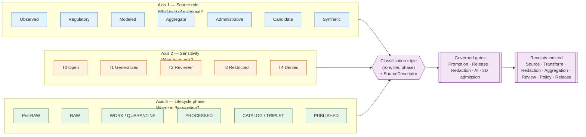
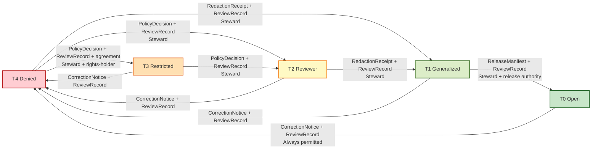

<!-- [KFM_META_BLOCK_V2]
doc_id: kfm://doc/data-classification-framework-v1
title: KFM Data Classification Framework
type: architecture
version: v1.0
status: draft
owners: TODO-architecture-steward-or-codeowners
created: 2026-05-24
updated: 2026-05-24
policy_label: public
related:
  - ../../docs/doctrine/directory-rules.md
  - ../../docs/architecture/connected-dots-architecture-brief.md
  - ../../docs/architecture/kfm-unified-doctrine-synthesis.md
  - ../../docs/architecture/maplibre-3d.md
  - ../../docs/atlases/KFM_Domains_v1_1_plus_Pass23_Pass32_Consolidated_Atlas.md
  - ../../docs/standards/PROV.md
  - ../../docs/standards/ISO-19115.md
  - ../../KFM_Encyclopedia.md
  - ../../KFM_Unified_Implementation_Architecture_Build_Manual.md
  - ../../ai-build-operating-contract.md
  - TODO/docs/standards/SENSITIVITY_RUBRIC.md
  - TODO/docs/adr/ADR-S-05-sensitivity-tier-scheme.md
  - TODO/docs/adr/ADR-S-04-source-role-vocabulary.md
tags:
  - kfm
  - architecture
  - data-classification
  - sensitivity
  - source-role
  - lifecycle
  - rights
  - sovereignty
  - care
  - fair
  - policy
notes:
  - "Synthesis of two classification axes in KFM doctrine — sensitivity tier T0–T4 (publication-tier, PROPOSED in Atlas v1.1 §24.5) and sensitivity_rank 0–5 (per-record field, CONFIRMED in Pass 10 §C6-01) — plus the source-role anti-collapse register (Atlas v1.1 §24.1)."
  - "The relationship between the T0–T4 tier and 0–5 rubric is NOT settled in doctrine. This document treats them as orthogonal until ADR-S-05 (or a successor) resolves the relationship; both are presented here so neither is silently dropped."
  - "All repo paths in this doc are PROPOSED; no mounted repo was inspected. Schema homes follow ADR-0001 default (`schemas/contracts/v1/<family>/`) per Directory Rules §7.4."
  - "External standards references (FAIR, CARE, GA4GH, NIST SP 800-226, EDPB Guidelines 01/2025) are project-grounded — they appear in Pass 10 C15 and C9 — and are EXTERNAL-only for their version-sensitive specifics."
[/KFM_META_BLOCK_V2] -->

# Kansas Frontier Matrix — Data Classification Framework

**How KFM classifies every datum by source role, sensitivity, lifecycle phase, and rights posture — and how those classifications gate publication, redaction, AI access, and rollback.**

| Field | Value |
|---|---|
| **Status** | Draft |
| **Owners** | TODO — architecture steward + sensitivity-policy steward (placeholder) |
| **Last reviewed** | 2026-05-24 |
| **Proposed path** | `docs/architecture/data-classification-framework.md` ([Directory Rules §6.1](#2-doctrine-basis-and-authority): architecture notes → `docs/architecture/`) |
| **Truth posture** | **CONFIRMED** doctrine synthesis from KFM corpus · **PROPOSED** implementation paths, schema homes, ADR numbers · **UNKNOWN** mounted-repo state · **NEEDS VERIFICATION** schema field presence, policy bundle presence, validator coverage |
| **Rollback target** | Removing this file leaves prior classification doctrine intact in [Atlas v1.1 §24.1/§24.5](#16-related-docs), [Pass 10 §C6](#16-related-docs), [Encyclopedia §11](#16-related-docs). No downstream artifact depends on this file yet. |

> **One-sentence rule.** *Every KFM record carries a **source role**, a **sensitivity classification**, and a **lifecycle phase**; together these three axes decide what may be published, to whom, under what transforms, with which receipts, and how to roll back.*

> [!IMPORTANT]
> **This is doctrine synthesis, not implementation evidence.** Sensitivity tiers (T0–T4) and the source-role vocabulary remain **PROPOSED** at doctrine rank pending ADR-S-04 and ADR-S-05 acceptance (Atlas v1.1 §24.12). The 0–5 sensitivity rubric is **CONFIRMED** at doctrine rank per Pass 10 §C6-01 but its reconciliation with T0–T4 is **NEEDS VERIFICATION** — see §6 and §15.

---

## Mini Table of Contents

1. [Purpose and scope](#1-purpose-and-scope)
2. [Doctrine basis and authority](#2-doctrine-basis-and-authority)
3. [The three classification axes](#3-the-three-classification-axes)
4. [Source-role anti-collapse register](#4-source-role-anti-collapse-register)
5. [Sensitivity tier scheme — T0 to T4](#5-sensitivity-tier-scheme--t0-to-t4)
6. [Sensitivity rubric — 0 to 5 (per-record field)](#6-sensitivity-rubric--0-to-5-per-record-field)
7. [Per-domain classification matrix](#7-per-domain-classification-matrix)
8. [Tier transitions (allowed motion)](#8-tier-transitions-allowed-motion)
9. [Receipts required for classification operations](#9-receipts-required-for-classification-operations)
10. [Lifecycle integration](#10-lifecycle-integration)
11. [FAIR + CARE alignment](#11-fair--care-alignment)
12. [Classification fields on the SourceDescriptor](#12-classification-fields-on-the-sourcedescriptor)
13. [Failure modes and anti-patterns](#13-failure-modes-and-anti-patterns)
14. [Governance and enforcement points](#14-governance-and-enforcement-points)
15. [Open questions and verification backlog](#15-open-questions-and-verification-backlog)
16. [Related docs](#16-related-docs)

---

## 1. Purpose and scope

KFM publishes inspectable claims drawn from heterogeneous sources — hydrologic gauges, soil pedons, archaeological survey, fauna occurrence, genealogical assertions, regulatory zones, modeled surfaces, AI-drafted summaries, 3D scenes, and more. The trust membrane between these sources and any public surface depends on **classifying every datum along three axes the rest of the system can read and enforce**:

- **Source role** — what kind of evidence the datum is (observed, modeled, regulatory, aggregate, administrative, candidate, synthetic).
- **Sensitivity** — what harm could result from publication (T0 open → T4 denied; per-record `sensitivity_rank` 0–5).
- **Lifecycle phase** — where the datum sits in the governed transformation pipeline (Pre-RAW → RAW → WORK / QUARANTINE → PROCESSED → CATALOG / TRIPLET → PUBLISHED).

> [!NOTE]
> **This document defines the classification framework. It does not implement it.** Implementation lives in `policy/sensitivity/`, `policy/release/`, `policy/maplibre/`, `policy/ai/`, the SourceDescriptor schema under `schemas/contracts/v1/source/`, the per-receipt schemas under `schemas/contracts/v1/receipts/`, and the OPA/Rego rules referenced in Atlas v1.1 §24 and Pass 10 §C5. All such homes are **PROPOSED** until mounted-repo evidence confirms presence.

### 1.1 What this doc is

A doctrine-synthesis architecture brief that:

- Names the three classification axes and how they compose.
- Consolidates the **source-role anti-collapse register** (Atlas v1.1 §24.1) and the **sensitivity tier scheme** (§24.5) into one place.
- Surfaces the unresolved relationship between **T0–T4** (publication tier) and **`sensitivity_rank` 0–5** (per-record field).
- Lists the receipts, gates, and policy homes that turn classification into enforcement.
- Itemizes the per-domain defaults and allowed transforms.

### 1.2 What this doc is not

- A schema definition. Schema homes are under `schemas/contracts/v1/` (PROPOSED; see ADR-0001).
- A policy implementation. Policy bundles live under `policy/` (PROPOSED).
- A validator catalog. Validator details live under `tools/validators/` and Atlas v1.1 §20.6.
- A per-domain operating manual. Domain manuals live under `docs/domains/<domain>/`.

[↑ Back to top](#top)

---

## 2. Doctrine basis and authority

> **Authority ladder** *(rung 1 outranks rung 6)*: KFM core invariants → accepted ADRs → Directory Rules + canonical doctrine docs → per-root READMEs → domain dossiers + prior reports → current mounted-repo convention. **External standards (FAIR, CARE, GA4GH, NIST, EDPB) sit beside rung 5 as language only — they never amend KFM doctrine** (Unified Doctrine Synthesis §5).

| Source | Section(s) | What it contributes | Status |
|---|---|---|---|
| Atlas v1.1, Domains Culmination | §24.1 Master Source-Role Anti-Collapse Register | Source-role vocabulary; anti-collapse DENY conditions | **CONFIRMED doctrine** |
| Atlas v1.1, Domains Culmination | §24.5 Master Sensitivity / Rights Tier Reference (extends v1.0 §20.5) | T0–T4 tier scheme; per-domain tier matrix; tier-transition rules | **PROPOSED tier scheme** at doctrine rank |
| Atlas v1.1, Domains Culmination | §24.2 Master Receipt Catalog; §24.6 Pipeline Gate Reference | Receipt families; gate ladder RAW → PUBLISHED | **CONFIRMED doctrine** |
| KFM Encyclopedia | §11 Sensitive / Deny-by-Default Posture | Cross-cutting deny lanes | **CONFIRMED doctrine** |
| Pass 10 Idea Index | §C6-01 Sensitivity Rubric 0–5; §C6-02..08 redaction profiles | Per-record sensitivity rank; named redaction profile family | **CONFIRMED** as cataloged idea |
| Pass 10 Idea Index | §C15 FAIR + CARE Reconciliation | MetaBlock v2 CARE fields; OPA default-deny on CARE-tagged assets | **CONFIRMED** as cataloged idea |
| Unified Doctrine Synthesis | §15 Sensitivity tiers; §16 Per-domain sensitivity matrix | Tier-transition table requiring `RedactionReceipt` + `ReviewRecord` + `PolicyDecision` | **CONFIRMED doctrine synthesis** |
| Directory Rules v1.3 | §6.1 architecture lane; §17 ADR discipline; §13 anti-patterns | Path placement; ADR triggers; drift posture | **CONFIRMED** as canonical placement authority |
| AI Build Operating Contract | §7 Publication, rights, sensitivity | Cite-or-abstain; fail-safe defaults | **CONFIRMED operating contract** |

> [!CAUTION]
> **Atlas master tables are navigational, not authoritative.** `EvidenceBundle`, the source dossiers, and the schemas under `schemas/contracts/v1/…` (per Directory Rules §7.4 / ADR-0001) remain the canonical sources for any specific claim. A table in this doc that disagrees with v1.0 is **drift to record**, not a correction. *(Atlas v1.1 Ch. 24 preamble.)*

[↑ Back to top](#top)

---

## 3. The three classification axes

> [!NOTE]
> **The three axes do not collapse.** A record's role is not its tier; its tier is not its phase; its phase is not its role. Promotion changes lifecycle phase. Redaction changes tier (or produces a tier-distinct derivative). **Promotion never silently changes source role** — Atlas v1.1 §24.1 calls the violation *source-role collapse*, and it fails closed.

### 3.1 Reading the triple

Every record-bearing object in KFM resolves a *(role, tier, phase)* triple before any gate can act on it. The triple is:

- **Set at admission** (`SourceDescriptor` records role, default tier, and admission phase = RAW).
- **Mutated only by governed transitions** (lifecycle gates change phase; transforms change tier via `RedactionReceipt` or `AggregationReceipt`; **role is fixed at admission**).
- **Carried through every receipt** so that downstream gates can read the triple without re-deriving it.

[↑ Back to top](#top)

---

## 4. Source-role anti-collapse register

> **Evidence basis (CONFIRMED doctrine):** Atlas v1.1 §24.1 / Source A pp. 150–153.

KFM treats source role as a **first-class identity attribute**. An observed reading is not interchangeable with a modeled estimate; a regulatory determination is not interchangeable with an administrative compilation; an aggregate publication is not interchangeable with candidate evidence; **synthetic content is never the same thing as observed reality**. The lifecycle and the governed API both **fail closed** when these roles are conflated.

### 4.1 Canonical source-role classes

| Role | Definition (CONFIRMED doctrine) | Typical example | Allowed downstream role |
|---|---|---|---|
| **Observed** | A direct reading, measurement, or first-hand evidentiary record tied to a place and time. | Stream-gauge stage reading; soil pedon description; air quality monitor sample; ground archaeological observation. | May feed modeled or aggregate products; **never relabeled as regulatory or administrative**. |
| **Regulatory** | An authoritative determination by a regulatory or governing body with legal or administrative force. | NFHL flood-zone designation; air-quality non-attainment ruling; designated critical habitat; protected-species listing. | Cite as regulatory context; **never labeled an observed event or a modeled estimate**. |
| **Modeled** | A derived product from inputs, assumptions, or fitted parameters; uncertainty and provenance of inputs must be preserved. | Hydrograph reconstruction; smoke trajectory model; suitability raster; population estimation surface; AODRaster. | Cite with model identity, run receipt, bounds; **never labeled an observation**. |
| **Aggregate** | A published summary, total, or average over a unit (county, year, watershed); **irreversible loss of individual record fidelity**. | USDA crop county totals; Census tract aggregates; decadal climate normal; resource estimate summary. | Cite with `AggregationReceipt`; **never treated as a per-place record**. |
| **Administrative** | A compiled record produced by an agency for administration, registration, or accounting — not an observation or a regulation. | Land office tract book; deed index compilation; county incorporation record; transport facility roster. | Cite as administrative context; **never collapsed with observation or regulation**. |
| **Candidate** | A proposed record awaiting validation, evidence resolution, deduplication, or steward review; not yet authoritative. | Quarantined connector output; unresolved person assertion; duplicate site candidate; unmerged crop observation. | May be cited as candidate evidence in WORK / QUARANTINE; **must not appear in PUBLISHED without promotion**. |
| **Synthetic** | Content generated by simulation, reconstruction, AI, or interpolation; **no underlying first-hand observation**. Includes synthetic surfaces, generated text, AI-drafted notes. | Synthetic terrain surface; reconstructed historical scene; AI-drafted summary of an EvidenceBundle. | Carries `RealityBoundaryNote` and `RepresentationReceipt`; **must never be presented or queried as observed reality**. |

> [!IMPORTANT]
> **Role is set at admission. Promotion does not upgrade role.** Promotion does not upgrade an observation to a regulation, or a model to an aggregate, or a candidate to a verified record — those are **separate governed transitions with their own evidence and review requirements**. *(Atlas v1.1 §24.1.1 reading note.)*

### 4.2 Anti-collapse failure modes (DENY conditions)

> **Evidence basis (CONFIRMED doctrine):** Atlas v1.1 §24.1.2.

| Collapse pattern | Domains most at risk | Denied outcome | Required guardrail |
|---|---|---|---|
| Modeled product labeled or queried as observed. | Air; Hydrology; Habitat; Agriculture; 3D | **DENY** at publication; **ABSTAIN** at AI surface. | `ModelRunReceipt` + uncertainty surface + role-preserving DTO field. |
| Regulatory zone labeled as an observed flood / event. | Hydrology; Hazards; Air | **DENY** publication of regulatory layer as event evidence. | Separate regulatory-layer and observed-event lanes; UI banner. |
| Aggregate cited as a per-place truth. | Agriculture; People; Geology; Air | **DENY** join from aggregate cell to single record; **ABSTAIN** at AI. | `AggregationReceipt`; geometry-scope guard; matrix-cell semantics. |
| Administrative compilation cited as observation. | People/Land; Settlements; Roads | **DENY** publication of compilation as observed event timeline. | Source-role tag preserved; named `LifeEvent` / `AdminEvent` types. |
| Candidate record exposed on a public surface. | All | **DENY** at trust membrane; route to QUARANTINE. | Promotion gate; no PUBLISHED edge to WORK / QUARANTINE. |
| Synthetic content presented as observed reality. | Planetary/3D; AI; Archaeology; Habitat | **DENY** publication; **HOLD** for steward review; **ABSTAIN** at AI. | `RealityBoundaryNote`; `RepresentationReceipt`; UI badge. |
| AI text treated as evidence. | All Focus Mode surfaces | **DENY** publication; **ABSTAIN** at Focus Mode; `AIReceipt` mandatory. | Cite-or-abstain rule; `AIReceipt`; release state required. |

[↑ Back to top](#top)

---

## 5. Sensitivity tier scheme — T0 to T4

> **Evidence basis (PROPOSED at doctrine rank):** Atlas v1.1 §24.5.1; Encyclopedia §11; Unified Doctrine Synthesis §15.
>
> **Doctrine rule:** *KFM publishes only the safest representation that still answers the steward's and the public's reasonable needs.* (CONFIRMED doctrine; Encyclopedia §11.)

### 5.1 Tier definitions

| Tier | Name | Definition (PROPOSED) | Default audience |
|---|---|---|---|
| **T0** | Open | Public-safe with no transformations required; no rights, sensitivity, or steward gating beyond standard release. | Any public client via governed API. |
| **T1** | Generalized | Public-safe only after generalization, fuzzing, aggregation, or redaction; transform reviewed and recorded. | Any public client via governed API. |
| **T2** | Reviewer | Released only to authenticated reviewers or domain stewards; policy-bounded; correction path active. | Stewards, reviewers, named research collaborators. |
| **T3** | Restricted | Released only under named agreement (rights, sovereignty, consent) and recorded. | Named authorized parties only. |
| **T4** | Denied | **Not released to any audience**; existence of a record may be released only as steward review permits. | — |

> [!WARNING]
> **T4 is the fail-closed default for any object whose rights, sovereignty, sensitivity, or evidence sufficiency is unresolved.** Promotion to a lower-numbered tier is a governed transition requiring artifacts and reviewers; see §8.

### 5.2 What the tier governs

A tier label answers exactly one question: *"who may receive this representation of this object, under what transforms?"* It does **not**:

- Decide source role (that is §4).
- Decide lifecycle phase (that is §10).
- Decide validation status (that is `ValidationReport`).
- Decide release state (that is `ReleaseManifest`).

The tier composes with role and phase to produce the **promotion / release decision**, which is recorded as `PolicyDecision` + `ReviewRecord` + (when redaction applied) `RedactionReceipt`.

[↑ Back to top](#top)

---

## 6. Sensitivity rubric — 0 to 5 (per-record field)

> **Evidence basis (CONFIRMED in cataloged idea):** Pass 10 §C6-01 *Sensitivity Rubric 0–5*; Pass 10 §C6-02 *Named Redaction Profiles*.

> [!WARNING]
> **PROPOSED CORRECTION — unresolved doctrine relationship.** The KFM corpus carries **two parallel sensitivity scales**: the **T0–T4 publication tier** (Atlas v1.1 §24.5, PROPOSED at doctrine rank) and the **`sensitivity_rank` 0–5 rubric** (Pass 10 §C6-01, CONFIRMED as cataloged idea, with expansion direction *"Author docs/standards/SENSITIVITY_RUBRIC.md"*). They are **not the same axis** — the rank is a per-record field naming the underlying sensitivity class; the tier is the publication posture. The mapping between them is **NEEDS VERIFICATION** and is tracked as **ADR-S-05 Sensitivity tier scheme T0–T4** in Atlas v1.1 §24.12. Both scales are presented here so neither is silently dropped; reconciliation belongs to ADR-S-05.

### 6.1 Rubric levels (CONFIRMED in Pass 10 §C6-01)

| Rank | Class | Default redaction posture | Default profile (illustrative, from C6-02) |
|---|---|---|---|
| **0** | Public / open | None. | `kfm:redact:none` |
| **1** | Common non-sensitive | None. | `kfm:redact:none` |
| **2** | Watchlist | Light generalization where exposure is unwarranted. | (per-domain) |
| **3** | SINC / locally sensitive | Default profile `profile:sinc-obscure-10km`. | `point_10km_hex_seeded_v1` |
| **4** | Threatened / rare | Strict mask or embargo. | `point_3km_jitter_v1` or `centroid_1km_v1` (per domain) |
| **5** | Sacred / critical | **Fail-closed; no map/timeline exposure.** | (no public profile; T4) |

> [!NOTE]
> **The rubric is required on every node and persisted in catalog records and evidence bundles.** *(Pass 10 §C6-01 "Detailed Explanation".)* Per Pass 10's expansion direction, the canonical rubric document is `docs/standards/SENSITIVITY_RUBRIC.md` — **PROPOSED, not yet authored** (Directory Rules §18.e OPEN-DR-05).

### 6.2 Working hypothesis for rank ↔ tier (PROPOSED — pending ADR-S-05)

This is **a hypothesis offered for the ADR**, not a settled mapping. Stewards reviewing per-domain policy should reference both scales until the ADR resolves them.

| `sensitivity_rank` | Likely default tier | Why |
|---|---|---|
| 0–1 | T0 Open | Public-safe by default. |
| 2 | T0–T1 | Light generalization may apply per domain. |
| 3 | T1–T2 | SINC-class data typically requires named profile or steward release. |
| 4 | T2–T4 | Per-domain; rare-species exact coords are T4. |
| 5 | T4 Denied | Fail-closed; no public surface. |

> [!IMPORTANT]
> **The hypothesis is illustrative.** Per-domain matrix entries (§7) reference T-tiers, not ranks. Until ADR-S-05 lands, **policy bundles SHOULD treat the two scales as independent inputs** and require both where both are present. Conflicts (e.g., `rank = 3`, `tier = T0`) should produce `HOLD` for steward review, not silent reconciliation.

### 6.3 Named redaction profiles (CONFIRMED idea, Pass 10 §C6-02)

Redactions reference a **named profile** that specifies strategy (radius mask, grid, jitter, centroid, DP aggregate), parameters, seeding rule, and any embargo. The catalog of profiles (PROPOSED home `policy/redaction/profiles.yaml`) ships:

| Profile | Strategy | Typical use |
|---|---|---|
| `point_10km_hex_seeded_v1` | H3 hex generalization, seeded | Rank-3 SINC / locally sensitive points. |
| `point_3km_jitter_v1` | Seeded coordinate jitter | Rank-4 threatened occurrence, public summary OK. |
| `centroid_1km_v1` | Polygon → centroid + coarse cell | Rare-plant precise locations. |
| `kfm:redact:none` | No transform | Rank 0–1; documents the absence as a positive decision. |

Each profile ships its method documentation, a Rego fixture stating which ranks it satisfies, and a verifier that re-runs the transform from a `RedactionReceipt`'s parameters and **checks determinism**. *(Pass 10 §C6-02; §C6-03 seeded reproducible jitter.)*

[↑ Back to top](#top)

---

## 7. Per-domain classification matrix

> **Evidence basis (PROPOSED at doctrine rank):** Atlas v1.1 §24.5.2; Encyclopedia §11.1; Unified Doctrine Synthesis §16.

| Domain / object class | Default tier | Allowed transforms (PROPOSED) | Required gates |
|---|---|---|---|
| Archaeology — site location | **T4** | Steward + cultural review + generalized geometry (coarse cell) + `RedactionReceipt` → T2 or T1. | `RedactionReceipt` + `ReviewRecord` + `PolicyDecision`. |
| Archaeology — human remains / sacred sites | **T4** | **No transform releases this to T0**; T3 only under explicit named authorization. | Sovereignty review + `ReviewRecord` + `PolicyDecision`. |
| Fauna — sensitive occurrence | **T4** | Geoprivacy generalization + `RedactionReceipt` → T1. | `RedactionReceipt` + `ReviewRecord` + `PolicyDecision`. |
| Fauna — range polygon | T1 | Aggregate / generalized public-safe layer. | `AggregationReceipt` or `RedactionReceipt`. |
| Flora — rare-plant precise locations | **T4** | Generalization + `RedactionReceipt` → T1; ethnobotanical context governed. | `RedactionReceipt` + `ReviewRecord`. |
| Hydrology — HUC12 + flowlines | T0 | None required. | Standard Gates A–G. |
| Hydrology — well / withdrawal records | T1/T2 | Aggregation; **private-owner join denial**. | `AggregationReceipt`. |
| Soil — SSURGO / gNATSGO public layers | T0 | None required. | Standard Gates A–G. |
| Agriculture — county histograms | T0/T1 | Aggregation; **private farm/operator × parcel joins deny**. | `AggregationReceipt`. |
| Atmosphere / Air — observed | T0/T1 | Stale-state badge; operational disclaimer. | Stale-state policy. |
| Hazards — historical events | T0 | None for historical; **alert-authority claims deny**. | `policy/release/hazards/` (PROPOSED). |
| Hazards — KFM as alert authority | **T4 forever** | **No transform permits KFM to act as an emergency-alert authority.** | Policy boundary; deny at runtime. |
| Roads / Rail — modern public network | T0 | None required. | Standard Gates A–G. |
| Roads / Rail — historic uncertain routes | T1 | Generalization; uncertainty surface. | `UncertaintySurface`. |
| Settlements / Infrastructure — critical assets | **T2** | Public summary only; precise locations deny. | `policy/sensitivity/infrastructure/` (PROPOSED). |
| Infrastructure — condition / vulnerability | **T4** | T3 to named authorities only; never T0 / T1. | Steward review + named-party agreement. |
| People / DNA — living-person fields | **T4** | Aggregation by tract or county + `AggregationReceipt` → T1. | Consent or aggregation gate + `ReviewRecord`. |
| People / DNA — raw DNA segment data | **T4** | No transform releases this to a public tier; T3 only under explicit research agreement. | Named consent + `ReviewRecord` + `PolicyDecision`. |
| People / Land — private person-parcel join | **T4** | Generalized parcel + de-identified person → T2 only. | `RedactionReceipt` + `ReviewRecord`. |
| Governed AI — RAW / WORK access via AI surface | **T4** | **AI never reads RAW or WORK content**; only released `EvidenceBundle`. | `PolicyDecision` + `AIReceipt`. |
| Planetary / 3D — sensitive 3D scene content | **T4** | Generalization / clipping / withholding; `RealityBoundaryNote` + `RepresentationReceipt` → T1 or T2 where steward review supports. | Steward review + `RedactionReceipt` + `RepresentationReceipt`. |

> [!CAUTION]
> **The matrix does not name every case.** Per-domain dossiers under `docs/domains/<domain>/` (PROPOSED) remain authoritative for edge cases. When the matrix and a domain dossier disagree, **prefer the dossier and file a drift entry** in `docs/registers/DRIFT_REGISTER.md` (PROPOSED).

[↑ Back to top](#top)

---

## 8. Tier transitions (allowed motion)

> **Evidence basis (CONFIRMED doctrine):** Atlas v1.1 §24.5.3; Unified Doctrine Synthesis §15.

### 8.1 Transition table

| From → To | Required artifacts | Required reviewer | Reversibility (CONFIRMED doctrine) |
|---|---|---|---|
| **T4 → T3** | `PolicyDecision` + `ReviewRecord` + agreement | Steward + rights-holder where applicable | Reversible: agreement revocation returns object to T4 with `CorrectionNotice`. |
| **T4 → T2** | `PolicyDecision` + `ReviewRecord` | Steward | Reversible: review revocation returns object to T4. |
| **T4 → T1** | `RedactionReceipt` + `ReviewRecord` | Steward | Reversible: redaction can be re-evaluated; correction may demote a published T1 to T4. |
| **T3 → T2** | `PolicyDecision` + `ReviewRecord` | Steward | Reversible. |
| **T2 → T1** | `RedactionReceipt` + `ReviewRecord` | Steward | Reversible. |
| **T1 → T0** | `ReleaseManifest` + `ReviewRecord` | Steward + release authority | Reversible: rollback supported via `RollbackCard`. |
| **Any tier → T4 (downgrade)** | `CorrectionNotice` + `ReviewRecord` | Steward + rights-holder where applicable | **Always permitted**; precedes derivative invalidation. |

> [!TIP]
> **Reading rule (CONFIRMED, Atlas v1.1 §24.5.3):** A tier upgrade (toward more public) always needs **both** a transform receipt **and** a review record. A tier downgrade (toward less public) **never** needs both — `CorrectionNotice` alone is sufficient to remove or restrict.

[↑ Back to top](#top)

---

## 9. Receipts required for classification operations

> **Evidence basis (CONFIRMED doctrine):** Atlas v1.1 §24.2.1 Master Receipt Catalog; Unified Doctrine Synthesis §12.
>
> **Doctrine rule:** *A receipt is a structured, persisted record of a specific governed operation, with enough context for audit and rollback. The receipt is never optional when the operation is consequential; **if no receipt exists, the operation did not happen in the governed sense**.* (Atlas v1.1 §24.2.)

| Receipt | What classification operation it pins | Required content (PROPOSED shape) |
|---|---|---|
| **`SourceDescriptor`** | Initial *(role, tier-default, phase=RAW)* classification at admission. Anchors every downstream receipt. | `source_id`, `source_role`, `authority`, `rights`, `sensitivity_rank`, `default_tier`, `cadence`, `ingest_hash`, `time`, `citation`. |
| **`TransformReceipt`** | Geometry / attribute transform (reprojection, generalization, snap, simplification). | `input_geom_hash`, `output_geom_hash`, `transform`, `parameters`, `tolerance`, `timestamp`, `actor`. |
| **`RedactionReceipt`** | Public-safe transform that masked, fuzzed, or withheld content for sensitivity, rights, or policy. | `policy_ref`, `redaction_method` (named profile id + version), `kept_fields`, `removed_fields`, `geometry_transform`, `reviewer`. |
| **`AggregationReceipt`** | Aggregation step pinning geometry scope and suppression. | `geometry_scope`, `time_scope`, `aggregation_method`, `input_source_refs`, `suppression_rule`, `output_unit`. |
| **`ModelRunReceipt`** | Modeled output; required when source role = modeled. | `model_id`, `model_version`, `inputs[]`, `parameters`, `run_time`, `uncertainty_surface_ref`, `validation_ref`. |
| **`RepresentationReceipt`** | Representation step where surface fidelity differs from evidence fidelity (3D from 2D, tile downsampling). | `evidence_ref`, `representation_method`, `parameters`, `reality_boundary_note_ref`. |
| **`AIReceipt`** | Governed AI answer over classified evidence. | `prompt_scope`, `evidence_refs[]`, `policy_ref`, `outcome` (`ANSWER` / `ABSTAIN` / `DENY` / `ERROR`), `reason_code`, `model_id`, `time`. |
| **`ReviewRecord`** | Steward / rights-holder / policy review of a candidate transition (source admission, redaction approval, promotion, release). | `reviewer`, `role`, `decision` (`ALLOW` / `RESTRICT` / `DENY` / `HOLD`), `evidence_refs[]`, `policy_ref`, `time`. |
| **`PolicyDecision`** | Policy evaluation against a specific object. | `policy_id`, `target_object`, `decision`, `reason_code`, `time`, `evidence_refs[]`. |
| **`ValidationReport`** | Validator outcome bound to deterministic inputs. | `validator_id`, `target`, `passes[]`, `failures[]`, `time`, `deterministic_inputs`. |
| **`ReleaseManifest`** | Released artifact set, digests, policy posture, rollback target. | `release_id`, `contents[]`, `digests`, `evidence_refs[]`, `rollback_target`, `time`. |
| **`CorrectionNotice`** | Correction of a published classification — tier change, role change (rare, ADR-class), redaction repair. | `claim_ref`, `prior_release_ref`, `change_summary`, `invalidates[]`, `review_ref`, `time`. |
| **`RollbackCard`** | Rollback decision tied to a classification failure or correction. | `release_id`, `rollback_to`, `reason`, `invalidates[]`, `review_ref`, `time`. |
| **`RealityBoundaryNote`** | Public/steward statement that a carrier is synthetic or reconstructed — paired with synthetic-role classification. | `scope`, `method_summary`, `evidence_refs[]`, `visibility`. |

> **Schema-home convention (PROPOSED).** Each receipt class lives under `schemas/contracts/v1/receipts/` unless an ADR relocates it. *(Atlas v1.1 §24.2 schema-home note; Directory Rules §7.4 / ADR-0001.)* Actual file presence is **NEEDS VERIFICATION** against the mounted repo.

[↑ Back to top](#top)

---

## 10. Lifecycle integration

> **Evidence basis (CONFIRMED doctrine):** Atlas v1.1 §24.6 Pipeline Gate Reference; Unified Doctrine Synthesis §6, §10; Connected-Dots Brief §4; KFM Implementation Build Manual §6.1.

Classification rides the lifecycle. Every gate checks role, tier, and phase consistency and **fails closed** if any axis is inconsistent or undecided.

```mermaid
flowchart LR
    A[Pre-RAW<br/><i>event signal</i>] -->|Admission gate| B[RAW<br/><i>SourceDescriptor set<br/>role + default tier</i>]
    B -->|Normalization gate| C[WORK / QUARANTINE<br/><i>TransformReceipt<br/>ValidationReport</i>]
    C -->|Validation gate| D[PROCESSED<br/><i>RedactionReceipt if<br/>sensitivity applies</i>]
    D -->|Catalog-closure gate| E[CATALOG / TRIPLET<br/><i>EvidenceBundle<br/>CatalogMatrix</i>]
    E -->|Release gate| F[PUBLISHED<br/><i>ReleaseManifest<br/>tier-specific audience</i>]
    F -. CorrectionNotice + RollbackCard .-> F

    classDef preraw fill:#eceff1,stroke:#37474f;
    classDef raw fill:#fff3e0,stroke:#e65100;
    classDef work fill:#fff9c4,stroke:#f57f17;
    classDef proc fill:#e1f5fe,stroke:#0277bd;
    classDef cat fill:#f3e5f5,stroke:#6a1b9a;
    classDef pub fill:#c8e6c9,stroke:#1b5e20,stroke-width:2px;
    class A preraw
    class B raw
    class C work
    class D proc
    class E cat
    class F pub
```

### 10.1 Gate × classification table

| Gate (transition) | Classification check | Required artifacts | Failure-closed outcome |
|---|---|---|---|
| **Admission (— → RAW)** | Source identity and **role set at admission**; rights minimally established; default tier assigned. | `SourceDescriptor` (role, authority, rights, sensitivity, cadence); hash of payload. | Source not admitted; logged as candidate awaiting steward. |
| **Normalization (RAW → WORK / QUARANTINE)** | Schema, geometry, time, identity, evidence, rights, and policy rules are runnable; role preserved through transform. | `TransformReceipt`; `ValidationReport` (working set); `PolicyDecision`; QUARANTINE for failures. | Quarantine with reason; **never silently promotes**. |
| **Validation (WORK → PROCESSED)** | Validators deterministic and tied to fixtures; redaction applied if sensitivity > rank-1 / tier > T0. | `ValidationReport` pass; `RedactionReceipt` if sensitivity applies; `AggregationReceipt` if applies. | Stay in WORK; structured `FAIL`. |
| **Catalog closure (PROCESSED → CATALOG / TRIPLET)** | `EvidenceRef`s resolve; tier consistent with audience plan. | `CatalogMatrix` entry; `EvidenceBundle`; graph/triplet projections if applicable. | `HOLD` at PROCESSED; no public edge. |
| **Release (CATALOG → PUBLISHED)** | Tier matches audience; review state present where required; release authority distinct from author when materiality applies. | `ReleaseManifest`; rollback target; correction path; `ReviewRecord` if required. | `HOLD` at CATALOG; no public surface change. |
| **Correction (PUBLISHED → PUBLISHED′)** | Detected error or new evidence; tier may downgrade; downstream derivatives identified. | `CorrectionNotice`; invalidation list; `RollbackCard` if rollback needed. | Surface remains in prior state; no silent rollback. |

### 10.2 Receipt ↔ phase mapping (PROPOSED minimums)

| Receipt | RAW | WORK / QUARANTINE | PROCESSED | CATALOG / TRIPLET | PUBLISHED |
|---|:-:|:-:|:-:|:-:|:-:|
| `SourceDescriptor` | • | • | • | • | • |
| `TransformReceipt` |  | • | • |  |  |
| `RedactionReceipt` |  | • | • | • |  |
| `AggregationReceipt` |  | • | • | • |  |
| `ModelRunReceipt` |  | • | • | • |  |
| `RepresentationReceipt` |  |  | • | • |  |
| `AIReceipt` |  |  |  | • | • *(Focus Mode only)* |
| `ReviewRecord` |  | • | • | • |  |
| `PolicyDecision` | • | • | • | • | • |
| `ValidationReport` |  | • | • |  |  |
| `ReleaseManifest` |  |  |  |  | • |
| `CorrectionNotice` |  |  |  |  | • |
| `RollbackCard` |  |  |  |  | • |
| `RealityBoundaryNote` |  |  | • | • | • |

> **Reading note (CONFIRMED, Atlas v1.1 §24.2.2):** A dot means the receipt is normally emitted, amended, or referenced at that phase. Receipts created earlier remain referenced (not duplicated) at later phases via `EvidenceRef`.

[↑ Back to top](#top)

---

## 11. FAIR + CARE alignment

> **Evidence basis (CONFIRMED in cataloged ideas):** Pass 10 §C15 FAIR + CARE Reconciliation; §C15-01 MetaBlock v2; §C15-03 OPA default-deny on CARE-tagged assets.
>
> **Doctrine framing (CONFIRMED, Pass 10 §C15-04):** *"FAIR by design, CARE in practice."*

KFM treats FAIR and CARE as paired, not competing. **FAIR** principles shape the architecture so every asset is findable, accessible, interoperable, reusable. **CARE** principles shape the policy so whether an asset is actually published — and to whom and on what terms — is governed by the relevant community's authority.

### 11.1 CARE fields on classification

| MetaBlock v2 field | Classification role |
|---|---|
| `steward_org` | Institutional steward of the asset; named on `ReviewRecord` for the asset's reviews. |
| `authority_to_control` | The community or body whose authority governs the asset; non-empty value **triggers OPA default-deny** (Pass 10 §C15-03). |
| `consent` | Consent grant under which the asset is held; structured (GA4GH DUO codes or KFM consent tokens). |
| `obligations` | Obligations attached to use; carried on `ReleaseManifest` and surfaced in audience-facing notices. |
| `benefit_commitments` | What benefit flows back to the relevant community from publication and reuse. |

### 11.2 Default-deny on CARE-tagged assets (CONFIRMED idea, Pass 10 §C15-03)

Any asset whose MetaBlock v2 declares a non-empty `authority_to_control` is gated by an OPA rule that **defaults to DENY on publication**. The explicit allow path requires the named authority's consent grant to be present, valid, and unrevoked. The rule runs at the promotion gate **and** at the admission webhook, so a CARE violation is rejected at both build time and runtime.

> [!NOTE]
> **Default-deny is the only posture that makes CARE robust to drift.** Default-allow with explicit denials means any oversight produces a CARE violation; default-deny means oversight produces a publication delay that can be remediated. The remediation playbook is `docs/runbooks/care-remediation.md` (**PROPOSED, not yet authored** — Pass 10 §C15 expansion direction).

### 11.3 Related external frameworks (project-grounded references)

| Framework | KFM contact point | Evidence in corpus |
|---|---|---|
| GA4GH AAI / Passports / DUO | Consent tokens (Pass 10 §C6-07); access-control for human-subject data (§C9-04). | Pass 10 §C9-04 (CONFIRMED). |
| NIST SP 800-226 (Differential Privacy) | Per-dataset epsilon budget; aggregate releases only (§C6-05). | Pass 10 §C9-05 (CONFIRMED). |
| EDPB Guidelines 01/2025 (Pseudonymisation) | Pseudonymisation key handling per dataset. | Pass 10 §C9-05 (CONFIRMED). |
| STRIDE + LINDDUN + FAIR+CARE | Layered threat modeling (KFM-P8-IDEA-0002). | Atlas v1.1 KFM-P8-IDEA-0002 (CONFIRMED). |

[↑ Back to top](#top)

---

## 12. Classification fields on the SourceDescriptor

> **Evidence basis (PROPOSED descriptor surface):** Atlas v1.1 §24.1.3.
>
> **Schema-home note (PROPOSED).** Source-role is a `SourceDescriptor` field; the canonical schema home defaults to `schemas/contracts/v1/source/source-descriptor.json` per Directory Rules §7.4 and ADR-0001, unless an accepted ADR relocates it. **NEEDS VERIFICATION:** actual file presence and field names.

| Field | Type / vocabulary | Required? | Notes |
|---|---|---|---|
| `source_role` | enum: `observed` \| `regulatory` \| `modeled` \| `aggregate` \| `administrative` \| `candidate` \| `synthetic` | MUST | **Set at admission. Never edited in-place**; corrections produce a new descriptor and a `CorrectionNotice`. |
| `role_authority` | string (issuing body / model identity / steward) | MUST when `role ∈ {regulatory, modeled, aggregate}` | Disambiguates the authoring authority for downstream cite text. |
| `role_aggregation_unit` | geometry-scope token (county, HUC, tract, year, decade, …) | MUST when `source_role = aggregate` | Prevents geometry-scope drift on join. |
| `role_model_run_ref` | EvidenceRef → `ModelRunReceipt` | MUST when `source_role = modeled` | Pins inputs, parameters, version that produced the value. |
| `role_synthetic_basis` | `{ method, inputs, reality_boundary_note_ref }` | MUST when `source_role = synthetic` | Records what is and is not real in the carrier. |
| `role_candidate_disposition` | enum: `pending` \| `merged` \| `rejected` \| `quarantined` | MUST when `source_role = candidate` | Tracks promotion state; **PUBLISHED edge forbidden until merged**. |
| `sensitivity_rank` | int 0..5 *(per Pass 10 §C6-01)* | MUST | Per-record sensitivity class; persisted in catalog records and evidence bundles. |
| `default_tier` | enum: `T0` \| `T1` \| `T2` \| `T3` \| `T4` *(per Atlas §24.5)* | MUST | Default publication tier at admission; mutated only by governed tier transitions (§8). |
| `rights` | structured: `{ license, terms, embargo_until, attribution }` | MUST | Source-rights snapshot at admission. |
| `authority_to_control` | string \| null *(per Pass 10 §C15-01)* | OPTIONAL but required for CARE-applicable assets | Non-empty triggers OPA default-deny (Pass 10 §C15-03). |
| `consent_ref` | EvidenceRef → consent grant (DUO / KFM consent token) | MUST when `authority_to_control` non-empty | Resolves the named authority's consent grant. |

> [!CAUTION]
> **Names above are PROPOSED shape.** An ADR or schema PR is the authoritative resolution. Field names, types, and required-conditions **NEEDS VERIFICATION** against the mounted SourceDescriptor schema. *(Atlas v1.1 §24.1.3 closing note.)*

[↑ Back to top](#top)

---

## 13. Failure modes and anti-patterns

> **Evidence basis (CONFIRMED doctrine):** Atlas v1.1 §24.9 Failure-Mode and Anti-Pattern Register; Directory Rules §13; AI Build Operating Contract §11.

| Anti-pattern | What goes wrong | Required guardrail |
|---|---|---|
| **Source-role collapse on promotion.** | Promotion silently relabels an aggregate as a per-place observation, or a model output as observed. | Role is fixed at admission; promotion does not edit role; corrections require new descriptor + `CorrectionNotice`. |
| **Sensitivity rank ↔ tier mismatch silently reconciled.** | Policy bundle picks one scale and ignores the other (e.g., rank-3 record published at T0). | Both scales are independent inputs until ADR-S-05 lands; conflicts → `HOLD`, not silent reconciliation. |
| **Tile / vector / 3D / screenshot / export leak.** | Sensitive coordinates reach the public via a non-API surface that the redaction gate never saw. | Sensitive lane fail-closed; renderer-boundary tests; cross-surface lint; 3D admission gate. *(Atlas v1.1 §24.10.)* |
| **Inference attack via cross-lane join.** | Aggregate + context join exposes a living person who was protected at each layer alone. | Aggregation receipt; minimum-cell suppression; **person-parcel join denial**; periodic join threat modeling. |
| **Watcher-as-publisher.** | A watcher writes directly to `data/catalog/` or `data/published/`, bypassing promotion. | Workers emit receipts and candidate decisions only; promotion is a separate governed transition. *(Directory Rules §13.5.)* |
| **Public route reads canonical store.** | `apps/explorer-web/` reads `data/processed/` directly, skipping the governed API. | Route reads MUST go through `apps/governed-api/`. *(Directory Rules §13.5.)* |
| **Synthetic content presented as observed.** | Reconstructed 3D scene or AI-drafted summary shipped without `RealityBoundaryNote`. | `RealityBoundaryNote` + `RepresentationReceipt`; UI badge; AI surface ABSTAIN. |
| **Source-role upgrade by paraphrase (AI).** | AI quotes an aggregate cell as a per-place fact. | Cite-or-abstain; `AIReceipt`; ban list of upcasting phrases; periodic AIReceipt sampling. *(Atlas v1.1 §24.10.)* |
| **Documentation cited as implementation proof.** | A reviewer treats Atlas / supplement / this doc as evidence the repo behaves as described. | Truth labels; this doc explicitly **does not assert implementation**; verify against mounted repo. |
| **CARE-tagged asset published without consent grant.** | OPA rule mis-evaluated or bypassed; an `authority_to_control`-tagged asset reaches PUBLISHED. | Default-deny at promotion **and** runtime admission; remediation playbook on denial. *(Pass 10 §C15-03.)* |

[↑ Back to top](#top)

---

## 14. Governance and enforcement points

> **Evidence basis (PROPOSED implementation framing):** Directory Rules §6, §13; AI Build Operating Contract §10–§11; Encyclopedia §11; KFM Implementation Build Manual §5.

This document defines the framework. The following are the **PROPOSED enforcement points** where the framework becomes enforceable. Each home is PROPOSED until verified in a mounted repo.

| Concern | PROPOSED home | What lives here |
|---|---|---|
| Per-domain sensitivity policy | `policy/sensitivity/<domain>/` | OPA / Rego rules implementing the per-domain matrix (§7). |
| Per-domain release policy | `policy/release/<domain>/` | Release-gate rules; tier-to-audience binding. |
| AI-surface policy | `policy/ai/` | Cite-or-abstain enforcement; AI tier-T4 access denial. |
| MapLibre admission policy | `policy/maplibre/` | 3D admission decision; `RepresentationReceipt` enforcement. *(Directory Rules §11 / `docs/architecture/maplibre-3d.md` §11.)* |
| Source-descriptor schema | `schemas/contracts/v1/source/source-descriptor.json` | Classification fields (§12). *(Per ADR-0001.)* |
| Receipt schemas | `schemas/contracts/v1/receipts/<receipt>.json` | Receipt shapes (§9). *(Atlas v1.1 §24.2.)* |
| Redaction profile catalog | `policy/redaction/profiles.yaml` | Named profile registry with versioned profile ids. *(Pass 10 §C6-02.)* |
| Sensitivity rubric standard | `docs/standards/SENSITIVITY_RUBRIC.md` | Authoritative description of `sensitivity_rank` 0–5. *(Pass 10 §C6-01 expansion direction; Directory Rules §18.e OPEN-DR-05.)* |
| Drift register | `docs/registers/DRIFT_REGISTER.md` | Per-domain matrix vs. dossier conflicts; tier-vs-rank conflicts. |
| Verification backlog | `docs/registers/VERIFICATION_BACKLOG.md` | NEEDS VERIFICATION items from this doc. |
| Tests — policy parity (CI / runtime) | `tests/policy/<domain>/` | Same OPA bundle evaluated in CI and at runtime. *(Pass 10 §C5-03.)* |
| Tests — classification fixtures | `tests/fixtures/source-descriptors/` | Valid / invalid `SourceDescriptor` payloads per role and tier. |

> [!NOTE]
> **Promote everything as a thin slice first.** The KFM build doctrine prefers one proof-bearing slice (e.g., hydrology HUC12 + flowlines, public-safe at T0) end-to-end over broad domain coverage. *(Connected-Dots Brief §7 "First product is not breadth — it is depth on one slice"; KFM Implementation Build Manual §5.)*

[↑ Back to top](#top)

---

## 15. Open questions and verification backlog

<strong>Doctrine-level open questions (ADR-class)</strong>

| Item | Status | Ref |
|---|---|---|
| **ADR-S-04 — Source-role vocabulary v1.** Lock the enum: `observed` \| `regulatory` \| `modeled` \| `aggregate` \| `administrative` \| `candidate` \| `synthetic`. | **NEEDS VERIFICATION** | Atlas v1.1 §24.12 |
| **ADR-S-05 — Sensitivity tier scheme T0–T4.** Lock the tier scheme and **resolve relationship to `sensitivity_rank` 0–5** (Pass 10 §C6-01). Until decided, both scales are independent inputs (§6.2). | **NEEDS VERIFICATION** | Atlas v1.1 §24.12 |
| **ADR-S-03 — Receipt class home.** Confirm `schemas/contracts/v1/receipts/` or relocate. | **NEEDS VERIFICATION** | Atlas v1.1 §24.12; Directory Rules §2.4(5) |
| **Authoring of `docs/standards/SENSITIVITY_RUBRIC.md`.** Pass 10 §C6-01 expansion direction; not yet authored. | **PROPOSED, not yet authored** | Directory Rules §18.e OPEN-DR-05 |
| **OPA epsilon defaults (NIST SP 800-226).** Per-dataset epsilon budget table. | **NEEDS VERIFICATION** | Pass 10 §C6-05; §9.4 unresolved-questions |
| **Per-class cell-size and jitter defaults.** What `point_10km_hex_seeded_v1` resolves to for KDWP SINC species across counties of varying density. | **NEEDS VERIFICATION** | Pass 10 §C6-04 |
| **Tombstone vs. erasure boundary.** Right-to-be-forgotten obligations may require true deletion, not tombstoning. | **NEEDS VERIFICATION** | Pass 10 §C5-09; §C6-08 |
| **CARE-applicable curation SOP.** Per Pass 10 §C15-01 expansion direction. | **PROPOSED, not yet authored** | Pass 10 §C15-01 |

<strong>Mounted-repo verification items</strong>

| Item | Verification needed |
|---|---|
| `schemas/contracts/v1/source/source-descriptor.json` | File presence; field names; conformance to §12. |
| `schemas/contracts/v1/receipts/<receipt>.json` for each receipt in §9 | File presence; field shape; tests under `tests/contract/`. |
| `policy/sensitivity/<domain>/` | Rule presence for each domain row in §7. |
| `policy/release/<domain>/` | Rule presence; tier-to-audience binding. |
| `policy/ai/` | Cite-or-abstain enforcement; AI T4 denial. |
| `policy/redaction/profiles.yaml` | Profile catalog (Pass 10 §C6-02). |
| `tests/policy/<domain>/` | Same OPA bundle in CI and runtime (Pass 10 §C5-03). |
| `tests/fixtures/source-descriptors/{valid,invalid}/` | Per-role and per-tier valid/invalid fixtures. |
| `apps/governed-api/` | Public reads go through it; canonical stores not exposed. |
| Drift register | Entries for any per-domain matrix ↔ dossier conflict. |

[↑ Back to top](#top)

---

## 16. Related docs

| Doc | Role | Path (PROPOSED) |
|---|---|---|
| Directory Rules | Canonical placement authority | [`docs/doctrine/directory-rules.md`](../doctrine/directory-rules.md) |
| Connected-Dots Architecture Brief | System-wide doctrine narrative | [`docs/architecture/connected-dots-architecture-brief.md`](./connected-dots-architecture-brief.md) |
| KFM Unified Doctrine Synthesis | Three-source synthesis (Connected-Dots + Crosswalk Validator + Reis/Housley reference) | [`docs/architecture/kfm-unified-doctrine-synthesis.md`](./kfm-unified-doctrine-synthesis.md) |
| MapLibre-3D Architecture | Renderer-decision; 3D admission policy | [`docs/architecture/maplibre-3d.md`](./maplibre-3d.md) |
| Domains v1.1 Consolidated Atlas | §24.1 source-role; §24.2 receipts; §24.5 sensitivity tiers; §24.6 lifecycle gates | [`docs/atlases/KFM_Domains_v1_1_plus_Pass23_Pass32_Consolidated_Atlas.md`](../atlases/KFM_Domains_v1_1_plus_Pass23_Pass32_Consolidated_Atlas.md) |
| KFM Encyclopedia | §11 Sensitive / Deny-by-Default Posture | [`KFM_Encyclopedia.md`](../../KFM_Encyclopedia.md) |
| PROV-O standards profile | Provenance standard underpinning receipts | [`docs/standards/PROV.md`](../standards/PROV.md) |
| ISO 19115 standards profile | Geographic metadata crosswalk | [`docs/standards/ISO-19115.md`](../standards/ISO-19115.md) |
| **TODO — Sensitivity Rubric standard** | `sensitivity_rank` 0–5 canonical doc | `docs/standards/SENSITIVITY_RUBRIC.md` *(PROPOSED, not yet authored)* |
| **TODO — Source-Role ADR** | ADR-S-04 | `docs/adr/ADR-S-04-source-role-vocabulary.md` *(PROPOSED)* |
| **TODO — Sensitivity Tier ADR** | ADR-S-05 (must resolve T0–T4 ↔ 0–5 relationship) | `docs/adr/ADR-S-05-sensitivity-tier-scheme.md` *(PROPOSED)* |
| **TODO — CARE Remediation Runbook** | OPA default-deny remediation path | `docs/runbooks/care-remediation.md` *(PROPOSED, not yet authored)* |
| AI Build Operating Contract | §7 Publication, rights, sensitivity | [`ai-build-operating-contract.md`](../../ai-build-operating-contract.md) |

---

End of document. Version <strong>v1.0 (draft)</strong> · Last updated <strong>2026-05-24</strong> · Owners <strong>TODO — architecture steward + sensitivity-policy steward (placeholder)</strong> · Rollback target: removing this file leaves prior classification doctrine intact in Atlas v1.1 §24, Pass 10 §C6 / §C15, and Encyclopedia §11.

[↑ Back to top](#top)
