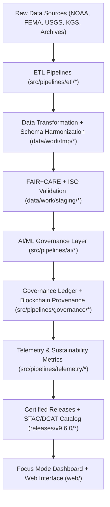
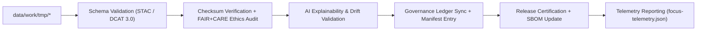
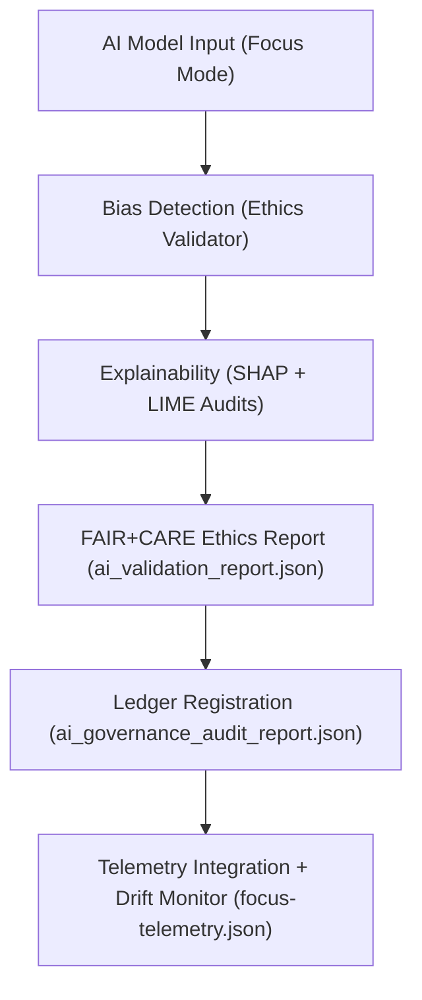
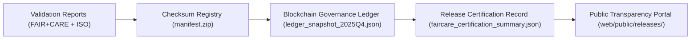
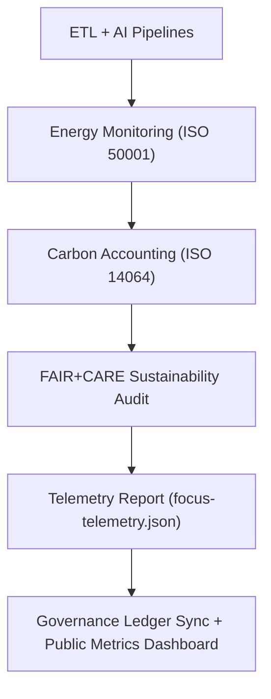

<div align="center">

# 🔄 Kansas Frontier Matrix — **Data Flow Diagrams & Governance Pipeline Maps**
`docs/architecture/data-flow-diagrams.md`

**Purpose:**  
This document provides a **visual and conceptual representation** of the Kansas Frontier Matrix (KFM) data lifecycle — from raw ingestion through AI-driven insight, governance validation, and sustainable release certification.  
It integrates **ETL automation, FAIR+CARE validation, and blockchain provenance** into a unified, transparent pipeline.

[](../../docs/standards/faircare-validation.md)
[](../../docs/architecture/README.md)
[]()
[](../../LICENSE)

</div>

---

## 📚 Overview

The **Kansas Frontier Matrix Data Flow Architecture** orchestrates data across multiple domains — **climate, hazards, hydrology, landcover, terrain, and textual archives** — within a FAIR+CARE and ISO-certified governance ecosystem.

This document illustrates:
- End-to-end **data movement** from raw acquisition to processed releases.  
- Cross-domain **AI governance**, validation, and provenance tracking.  
- Embedded **telemetry and sustainability metrics** at every workflow stage.  

---

## 🧭 High-Level System Data Flow



### Description
1. **Raw Data Ingestion:** Imports datasets from trusted open repositories.  
2. **Transformation:** Standardizes file formats, coordinate systems, and schema attributes.  
3. **Validation:** Conducts FAIR+CARE audits, ISO checks, and provenance verification.  
4. **AI Governance:** Performs explainability analysis, bias detection, and model transparency audits.  
5. **Ledger Registration:** Immutable blockchain linkage ensures accountability and reproducibility.  
6. **Telemetry Integration:** Logs carbon, power, and sustainability statistics for every run.  
7. **Publication:** Certified data released under MIT license with complete governance documentation.  

---

## 🧩 FAIR+CARE Validation Pipeline (Detailed View)



### Key Processes
- **Schema Validation:** Ensures compliance with FAIR, ISO 19115, and DCAT 3.0 standards.  
- **Checksum Verification:** Confirms integrity between raw, staged, and processed data layers.  
- **Ethics Audit:** Reviews datasets for accessibility, inclusion, and sustainability compliance.  
- **AI Validation:** Measures transparency, drift, and model accountability under FAIR+CARE.  
- **Governance Sync:** Links validation results to immutable ledger and release metadata.  

---

## 🧠 AI Governance & Explainability Flow



### Governance Notes
- **Bias Detection:** Evaluates input variable weighting across hazard and climate models.  
- **Explainability Audits:** Quantifies feature contributions to ensure interpretability.  
- **Ethical AI Certification:** FAIR+CARE Council validates model integrity before deployment.  
- **Telemetry Feedback Loop:** Tracks energy efficiency, inference latency, and model drift.  

---

## ⚙️ Domain-Specific Data Pipeline Summary

| Domain | Input Sources | Transformation Layer | Validation Layer | Output Layer |
|---------|----------------|----------------------|------------------|--------------|
| **Climate** | NOAA, NIDIS, USDM | Reprojection, CF Conventions | FAIR+CARE + Schema Validation | Processed Climate Data |
| **Hazards** | FEMA, USGS, NOAA | Geospatial ETL + Correlation | FAIR+CARE + AI Audit | Risk Model Outputs |
| **Hydrology** | USGS, EPA | Basin Aggregation + Flow Normalization | Schema + FAIR Validation | Streamflow & Groundwater Summaries |
| **Landcover** | NASA, MODIS | Raster Harmonization | FAIR+CARE QA | Vegetation Index Outputs |
| **Terrain** | USGS DEM, LiDAR | Elevation Reprojection + Grid Merge | FAIR+CARE Validation | Slope & Elevation Data |
| **Text / Archival** | Historical Archives, OCR | Text Normalization + Metadata Extraction | FAIR+CARE + NLP Validation | Searchable Metadata + Provenance Logs |

---

## ⚖️ Governance & Provenance Flow



### Integration Highlights
- **Immutable Ledger:** Each checksum and validation event recorded in blockchain-linked JSON ledger.  
- **FAIR+CARE Certification:** Release-level ethics approvals validated via council governance.  
- **Transparency Portal:** Enables open verification through web UI and Focus Mode dashboards.  

---

## 🌱 Sustainability & Telemetry Integration Flow



| Metric | Standard | Description |
|---------|-----------|-------------|
| **Power Efficiency** | ISO 50001 | Logs energy consumption for each ETL pipeline. |
| **Carbon Offset** | ISO 14064 | Records verified emission reductions per release. |
| **Telemetry JSON** | FAIR+CARE | Links sustainability data to governance audit chain. |
| **Dashboard Metrics** | MCP-DL | Displays transparency KPIs on Focus Mode dashboard. |

---

## 🧾 Internal Use Citation

```text
Kansas Frontier Matrix (2025). Data Flow Diagrams & Governance Pipeline Maps (v9.6.0).
Comprehensive visual documentation of FAIR+CARE-certified data, AI, and governance pipelines.
Ensures transparency, interoperability, and sustainability under MCP-DL v6.3 and ISO 19115 standards.
```

---

## 🧾 Version Notes

| Version | Date | Notes |
|----------|------|--------|
| v9.6.0 | 2025-11-03 | Added sustainability telemetry integration and blockchain governance flow. |
| v9.5.0 | 2025-11-02 | Introduced AI explainability mapping to validation diagrams. |
| v9.3.2 | 2025-10-28 | Established FAIR+CARE data flow visualization baseline. |

---

<div align="center">

**Kansas Frontier Matrix** · *FAIR+CARE Data Lifecycle × Governance Transparency × Sustainable Automation*  
[🔗 Repository](https://github.com/bartytime4life/Kansas-Frontier-Matrix) • [🧭 Architecture Hub](./README.md) • [⚖️ Governance Ledger](../../docs/standards/governance/DATA-GOVERNANCE.md)

</div>

