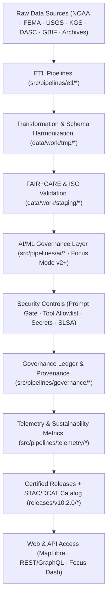
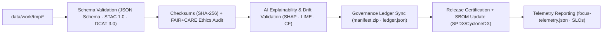
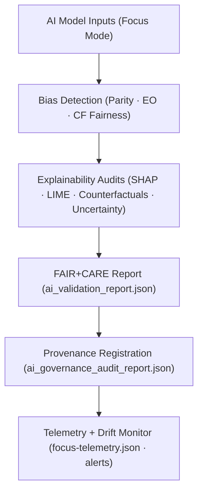
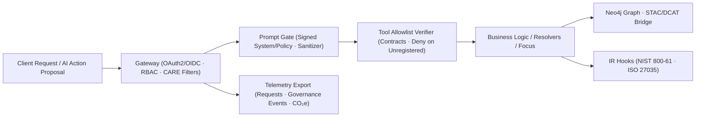
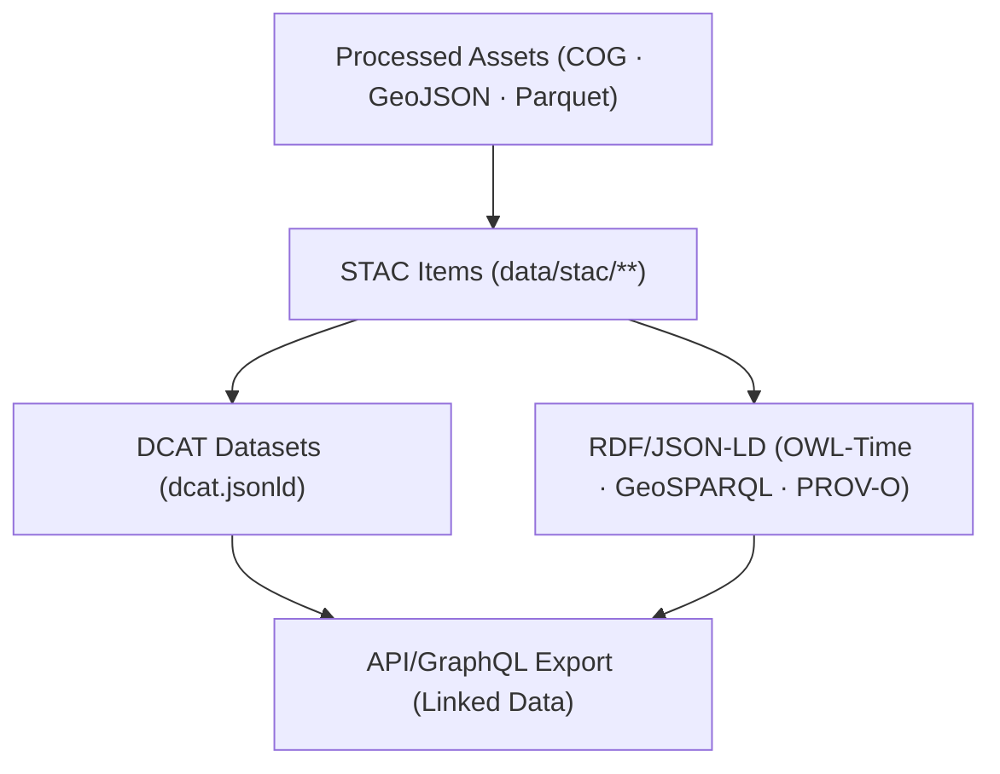
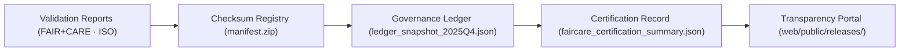
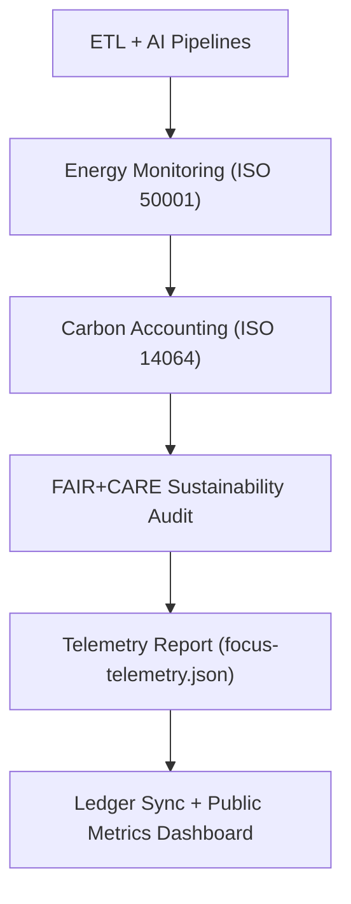

<div align="center">

# 🔄 Kansas Frontier Matrix — **Data Flow Diagrams & Governance Pipeline Maps**
`docs/architecture/data-flow-diagrams.md`

**Purpose:**  
Visual and conceptual maps of the **KFM data lifecycle** — from raw ingestion to AI insights, validation, security governance, and certified releases — with **telemetry and sustainability** embedded at every step.

[](./README.md)
[](../../LICENSE)
[](../standards/faircare.md)
[]()
[](../security/supply-chain.md)

</div>

---

## 📘 Overview

The **KFM Data Flow Architecture** orchestrates multi-domain pipelines — **climate, hazards, hydrology, landcover, terrain, ecology, geology, and textual archives** — in a unified, **FAIR+CARE** and **ISO** aligned framework.

This document illustrates:
- End-to-end **data movement** from raw acquisition to certified releases and catalogs.  
- **AI & security governance** touchpoints (prompt defense, tool allowlists, secrets, provenance, IR).  
- Embedded **telemetry (energy/CO₂e)** and sustainability metrics throughout.

---

## 🧭 High-Level System Data Flow



### Description
1. **Raw Ingestion:** Imports from authoritative repositories with license/source capture.  
2. **Transform:** Standardizes formats/CRS, applies JSON Schema and CF/ISO conventions.  
3. **Validate:** Runs FAIR+CARE ethics, ISO checks, checksum/provenance verification.  
4. **AI Governance:** Explainability, bias detection, uncertainty, and transparency audits for Focus Mode.  
5. **Security:** Prompt-injection defenses, allowlisted tools, ZTA secrets, SLSA provenance.  
6. **Ledger:** Immutable, signed governance entries link checksums, audits, and approvals.  
7. **Telemetry:** Energy, CO₂e, latency, a11y, refusal/drift KPIs into `focus-telemetry.json`.  
8. **Publish:** Certified data & models released with SBOM/manifest; cataloged via STAC/DCAT.

---

## 🧩 FAIR+CARE Validation Pipeline (Detailed)



**Key Processes**
- **Schema:** Compatibility with **FAIR**, **ISO 19115**, **STAC 1.0**, **DCAT 3.0**.  
- **Checksums:** Integrity across raw → staged → processed; SPDX license IDs.  
- **Ethics:** Accessibility, inclusion, sustainability, licensing, and CARE tags.  
- **AI Validation:** Transparency, fairness thresholds, and drift checks before deployment.  
- **Governance:** Links validations to ledger with reviewer identity and scope.

---

## 🤖 AI Governance & Explainability Flow



**Governance Notes**
- **Bias:** Group/feature parity and equalized odds; auto-fail below thresholds.  
- **Explainability:** Local/global attributions; dossier narratives for Focus Mode.  
- **Certification:** FAIR+CARE Council approval prior to public release.  
- **Telemetry Loop:** Latency, energy per inference, refusal/drift triggers.

---

## 🔐 Security-By-Design Flow (API & Actions)



**Controls**
- **Prompt Defense:** Signed envelopes, control/data separation, directive filters.  
- **Provenance:** SLSA attestations, signed artifacts (Cosign), SBOMs.  
- **Secrets:** KMS/Vault rotation, short-lived tokens, least privilege.  
- **IR:** Runbooks and signed postmortems for incidents.

---

## 🛰 Catalog & Graph Interoperability



**Round-Trip Parity**
- STAC ↔ DCAT field mapping  
- JSON-LD contexts for **OWL-Time**, **GeoSPARQL**, **PROV-O**  
- CARE tags and licenses propagated to graph/API responses

---

## ⚙️ Domain-Specific Pipeline Summary

| Domain | Input Sources | Transformation Layer | Validation Layer | Output Layer |
|---|---|---|---|---|
| **Climate** | NOAA, NIDIS, USDM | Reprojection, CF attrs | FAIR+CARE + Schema | Processed Climate Layers |
| **Hazards** | FEMA, NOAA, SPC | Geospatial ETL + joins | FAIR+CARE + AI Audit | Risk Indicators / Models |
| **Hydrology** | USGS, EPA | Basin agg, flow norms | Schema + FAIR | Streamflow & GW Summaries |
| **Landcover** | NASA, MODIS | Raster harmonization | FAIR+CARE QA | Vegetation/LC Indices |
| **Terrain** | USGS DEM, LiDAR | Elevation reproj + merge | FAIR+CARE Validation | Slope/Elevation Layers |
| **Ecology/Geology** | GBIF, KGS | SDM/strat models | FAIR+CARE + ISO | Habitat/Strat Layers |
| **Text/Archives** | OCR’d docs | NLP normalize + NER | FAIR+CARE + NLP QA | Searchable Metadata + Provenance |

---

## ⚖️ Governance & Provenance Flow



**Highlights**
- **Immutable Ledger:** Each checksum and validation is signed and time-stamped.  
- **FAIR+CARE Certification:** Release approvals with reviewer identity and scope.  
- **Public Transparency:** Portal and Focus Mode expose validation lineage and KPIs.

---

## 🌱 Sustainability & Telemetry Integration



| Metric | Standard | Description |
|---|---|---|
| **Power Efficiency** | ISO 50001 | Tracks energy per ETL/AI job. |
| **Carbon Offset** | ISO 14064 | Records verified emission reductions per release. |
| **Telemetry JSON** | FAIR+CARE | Connects sustainability to governance chain. |
| **Dashboard KPIs** | MCP-DL | Live transparency metrics in Focus Mode. |

---

## 🧾 Internal Use Citation

```text
Kansas Frontier Matrix (2025). Data Flow Diagrams & Governance Pipeline Maps (v10.2.3).
Comprehensive visualization of FAIR+CARE-aligned data, AI, security, and governance pipelines with telemetry integration.
Ensures transparency, interoperability, and sustainability under MCP-DL v6.3 and ISO 19115/14064/50001.
```

---

## 🕰️ Version History

| Version | Date | Author | Summary |
|---:|---|---|---|
| v10.2.3 | 2025-11-09 | `@kfm-architecture` | Align to v10.2: added security-by-design swimlane, SLSA/SBOM integration, telemetry schema v3, and updated release paths. |
| v9.7.0  | 2025-11-06 | `@kfm-architecture` | Upgraded to v9.7.0; refreshed release/telemetry paths; added DCAT 3.0 notes. |
| v9.6.0  | 2025-11-03 | `@kfm-architecture` | Added sustainability telemetry and governance flow. |
| v9.5.0  | 2025-11-02 | `@kfm-governance` | Introduced AI explainability mapping in validation diagrams. |

---

<div align="center">

**Kansas Frontier Matrix**  
*FAIR+CARE Data Lifecycle × Governance Transparency × Secure & Sustainable Automation*  
© 2025 Kansas Frontier Matrix · MIT · Master Coder Protocol v6.3 · Diamond⁹ Ω / Crown∞Ω Ultimate Certified  

[Back to Architecture](./README.md) · [Data Architecture](./data-architecture.md) · [API Architecture](./api-architecture.md) · [Governance Charter](../../docs/standards/governance/ROOT-GOVERNANCE.md)

</div>
