<div align="center">

# 🔄 Kansas Frontier Matrix — **Data Flow Diagrams & Governance Pipeline Maps**
`docs/architecture/data-flow-diagrams.md`

**Purpose:**  
Visual and conceptual maps of the **KFM data lifecycle** — from raw ingestion to AI insights, validation, governance, and certified releases — with **telemetry and sustainability** embedded at each step.

[](./README.md)
[](../../LICENSE)
[](../standards/faircare-validation.md)
[]()

</div>

---

## 📘 Overview

The **KFM Data Flow Architecture** orchestrates multi-domain pipelines — **climate, hazards, hydrology, landcover, terrain, and textual archives** — in a unified, **FAIR+CARE** and **ISO** aligned framework.

This document illustrates:
- End-to-end **data movement** from raw acquisition to certified releases and catalogs.  
- **AI governance** touchpoints, explainability, and provenance tracking.  
- Embedded **telemetry (energy/CO₂e)** and sustainability metrics throughout.

---

## 🧭 High-Level System Data Flow

```mermaid
flowchart TD
    A["Raw Data Sources (NOAA · FEMA · USGS · KGS · Archives)"] --> B["ETL Pipelines (src/pipelines/etl/*)"]
    B --> C["Transformation & Schema Harmonization (data/work/tmp/*)"]
    C --> D["FAIR+CARE + ISO Validation (data/work/staging/*)"]
    D --> E["AI/ML Governance Layer (src/pipelines/ai/*)"]
    E --> F["Governance Ledger + Blockchain Provenance (src/pipelines/governance/*)"]
    F --> G["Telemetry & Sustainability Metrics (src/pipelines/telemetry/*)"]
    G --> H["Certified Releases + STAC/DCAT Catalog (releases/v9.7.0/*)"]
    H --> I["Focus Mode Dashboard + Web Interface (web/)"]
```



### Description
1. **Raw Ingestion:** Imports from authoritative open repositories with source/license capture.  
2. **Transform:** Standardizes formats/CRS, applies JSON Schema and CF/ISO conventions.  
3. **Validate:** Runs FAIR+CARE ethics, ISO checks, and checksum/provenance verification.  
4. **AI Governance:** Explainability, bias detection, and transparency audits for Focus Mode.  
5. **Ledger:** Immutable, blockchain-linked JSON ledgers record key events and checksums.  
6. **Telemetry:** Energy use, CO₂e, runtime, and accessibility KPIs pushed to dashboards.  
7. **Publish:** Certified data released with SBOM/manifest and cataloged via STAC/DCAT.

---

## 🧩 FAIR+CARE Validation Pipeline (Detailed View)

```mermaid
flowchart LR
    A["data/work/tmp/*"] --> B["Schema Validation (JSON Schema · STAC · DCAT 3.0)"]
    B --> C["Checksum Verification + FAIR+CARE Ethics Audit"]
    C --> D["AI Explainability & Drift Validation"]
    D --> E["Governance Ledger Sync + Manifest Entry"]
    E --> F["Release Certification + SBOM Update"]
    F --> G["Telemetry Reporting (focus-telemetry.json)"]
```



### Key Processes
- **Schema:** Ensures compatibility with **FAIR**, **ISO 19115**, **STAC 1.0**, and **DCAT 3.0**.  
- **Checksums:** Confirms integrity across raw → staged → processed layers.  
- **Ethics:** Verifies accessibility, inclusion, sustainability, and licensing.  
- **AI Validation:** Tests transparency, fairness, and drift before deployment.  
- **Governance:** Links validations to immutable ledger and release metadata.

---

## 🧠 AI Governance & Explainability Flow

```mermaid
flowchart TD
    A["AI Model Inputs (Focus Mode)"] --> B["Bias Detection (Ethics Validator)"]
    B --> C["Explainability Audits (SHAP · LIME · Counterfactuals)"]
    C --> D["FAIR+CARE Report (ai_validation_report.json)"]
    D --> E["Governance Registration (ai_governance_audit_report.json)"]
    E --> F["Telemetry + Drift Monitor (focus-telemetry.json)"]
```



### Governance Notes
- **Bias Detection:** Group/feature parity, equalized odds, and CF fairness checks.  
- **Explainability:** Local/global feature attributions; narrative generation for Focus Mode.  
- **Ethical Certification:** FAIR+CARE Council validates model integrity prior to release.  
- **Telemetry Loop:** Tracks latency, energy per inference, and model drift triggers.

---

## ⚙️ Domain-Specific Pipeline Summary

| Domain | Input Sources | Transformation Layer | Validation Layer | Output Layer |
|---|---|---|---|---|
| **Climate** | NOAA, NIDIS, USDM | Reprojection, CF attrs | FAIR+CARE + Schema | Processed Climate Layers |
| **Hazards** | FEMA, NOAA, SPC | Geospatial ETL + joins | FAIR+CARE + AI Audit | Risk Indicators / Models |
| **Hydrology** | USGS, EPA | Basin agg, flow norms | Schema + FAIR | Streamflow & GW Summaries |
| **Landcover** | NASA, MODIS | Raster harmonization | FAIR+CARE QA | Vegetation/LC Indices |
| **Terrain** | USGS DEM, LiDAR | Elevation reproj + merge | FAIR+CARE Validation | Slope/Elevation Layers |
| **Text/Archives** | OCR’d docs | NLP normalize + NER | FAIR+CARE + NLP QA | Searchable Metadata + Provenance |

---

## ⚖️ Governance & Provenance Flow


### Integration Highlights
- **Immutable Ledger:** Every checksum and validation event has a signed, time-stamped entry.  
- **FAIR+CARE Certification:** Release-level approvals with reviewer identity and scope.  
- **Transparency:** Public portal and Focus Mode reveal validation lineage and KPIs.

---

## 🌱 Sustainability & Telemetry Integration Flow


| Metric | Standard | Description |
|---|---|---|
| **Power Efficiency** | ISO 50001 | Logs energy consumption for each ETL/AI job. |
| **Carbon Offset** | ISO 14064 | Records verified emission reductions per release. |
| **Telemetry JSON** | FAIR+CARE | Connects sustainability data to governance chain. |
| **Dashboard KPIs** | MCP-DL | Focus Mode shows transparency metrics in real time. |

---

## 🧾 Internal Use Citation

```text
Kansas Frontier Matrix (2025). Data Flow Diagrams & Governance Pipeline Maps (v9.7.0).
Comprehensive visualization of FAIR+CARE-aligned data, AI, and governance pipelines with telemetry integration.
Ensures transparency, interoperability, and sustainability under MCP-DL v6.3 and ISO 19115/14064/50001.
```

---

## 🕰️ Version History

| Version | Date | Author | Summary |
|---|---|---|---|
| v9.7.0 | 2025-11-06 | `@kfm-architecture` | Upgraded to v9.7.0; refreshed release/telemetry paths; badge syntax hardened; added DCAT 3.0 notes. |
| v9.6.0 | 2025-11-03 | `@kfm-architecture` | Added sustainability telemetry and blockchain governance flow. |
| v9.5.0 | 2025-11-02 | `@kfm-governance` | Introduced AI explainability mapping in validation diagrams. |
| v9.3.2 | 2025-10-28 | `@kfm-core` | Established FAIR+CARE data flow visualization baseline. |

---

<div align="center">

**Kansas Frontier Matrix**  
*FAIR+CARE Data Lifecycle × Governance Transparency × Sustainable Automation*  
© 2025 Kansas Frontier Matrix · Master Coder Protocol v6.3 · FAIR+CARE Certified · Diamond⁹ Ω / Crown∞Ω Ultimate Certified  

[Back to Architecture](./README.md) · [Governance Charter](../../docs/standards/governance/DATA-GOVERNANCE.md)

</div>
