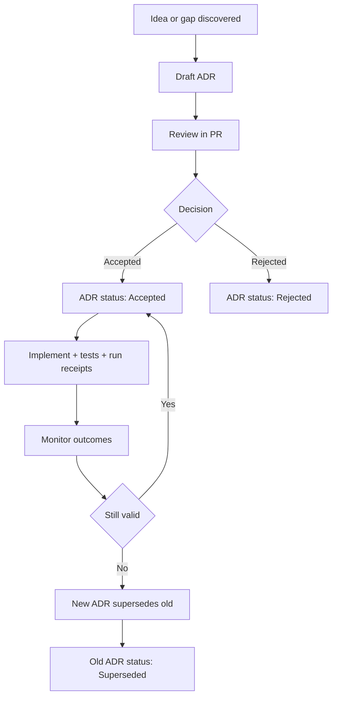

<!-- [KFM_META_BLOCK_V2]
doc_id: kfm://doc/2f1d50c8-1c0b-4e21-aed2-3ddc9e2c9f94
title: Architecture Decisions (ADRs)
type: standard
version: v1
status: draft
owners: KFM Architecture & Governance (TODO: confirm CODEOWNERS)
created: 2026-03-01
updated: 2026-03-01
policy_label: public
related:
  - docs/architecture/
  - docs/templates/ (TODO: confirm ADR template location)
tags: [kfm, architecture, adr, decisions]
notes:
  - This README defines how KFM records significant architecture decisions as ADRs.
  - Keep this file process-focused; keep decisions in ADR-*.md files.
[/KFM_META_BLOCK_V2] -->

# Architecture Decisions (ADRs)

**One-line purpose:** A governed, searchable record of *why* KFM made significant design decisions (not just what we built).


---

## Quick navigation

- [What belongs here](#what-belongs-here)
- [When an ADR is required](#when-an-adr-is-required)
- [ADR lifecycle](#adr-lifecycle)
- [How to write an ADR](#how-to-write-an-adr)
- [ADR template](#adr-template)
- [Review checklist](#review-checklist)
- [ADR index](#adr-index)

---

## What belongs here

This directory contains **Architecture Decision Records (ADRs)** for KFM.

### ✅ Acceptable inputs

- `ADR-####-short-title.md` (or `ADR-YYYYMMDD-short-title.md` if you prefer date-first; pick one convention and stick with it)
- Small decision-support assets referenced by an ADR (e.g., diagrams):
  - `assets/ADR-####/diagram.svg`
  - `assets/ADR-####/benchmark.md`
- An optional index file if we choose to maintain one (this README includes a starter table)

### ❌ Exclusions (keep out)

- General architecture overviews and diagrams (belong in `docs/architecture/` root or a dedicated subfolder)
- Runbooks / ops procedures (belong in runbooks/ops docs)
- Design drafts with no decision (use an RFC/proposal area if present, then convert to an ADR once a decision is made)
- Sensitive details that should not be public (redact/generalize; use correct policy labels)

---

## Where this fits in KFM

`docs/architecture/` is the canonical documentation area for system design and ADRs.  
This `docs/architecture/decisions/` folder is the **single source of truth** for “we decided X over Y, and here’s why.”

> ADRs are intentionally lightweight and durable: they describe tradeoffs and rationale so future maintainers can re-evaluate safely.

---

## When an ADR is required

Write an ADR when a change is **significant** (high cost of change / shapes the system), especially if it touches KFM invariants.

### ADR required (non-exhaustive)
- Trust membrane & policy boundary behavior (who/what can access what)
- “Truth path” lifecycle and promotion gates (RAW → WORK → PROCESSED → CATALOG → PUBLISHED)
- Deterministic identity / hashing conventions (anything that impacts reproducibility)
- Evidence resolution and citation rules (EvidenceRef schemes, bundles, redaction obligations)
- Canonical vs rebuildable stores (what must be rebuildable; what is authoritative)
- API contracts that become public surface area (especially versioning / compatibility)
- Storage/indexing projections that affect performance *and* correctness (e.g., PostGIS as projection)

### ADR optional (but encouraged)
- Choice of a major library/framework where lock-in is plausible
- A new data format for published artifacts (COG, GeoParquet, PMTiles, etc.)
- Non-trivial changes to deployment topology (Kubernetes/Helm, etc.)
- Any decision that would be hard to reverse without a plan

---

## ADR lifecycle



**Status vocabulary (recommended):** Draft → Proposed → Accepted | Rejected → Superseded (or Deprecated).

---

## How to write an ADR

1. **Name it**
   - Choose the next number (e.g., `ADR-0012-…`) and create the file.
2. **Write the decision in one sentence**
   - Example: “We will treat PostGIS as a rebuildable projection, not as canonical storage.”
3. **Capture context + constraints**
   - What problem are we solving, and what invariants apply?
4. **List alternatives**
   - At least 2 credible options (including “do nothing” if relevant).
5. **Record the rationale**
   - Why this choice now? What evidence supports it?
6. **Consequences + tradeoffs**
   - Include both positive and negative outcomes.
7. **Rollback plan**
   - Define what “backing out” looks like (and what would trigger it).
8. **Implementation hooks**
   - Link to contracts/tests/scripts that enforce the decision.
9. **Ship via PR**
   - ADR is merged *with* (or immediately before) the change it governs.

---

## ADR template

Create a new file: `docs/architecture/decisions/ADR-####-short-title.md`

```markdown
<!-- [KFM_META_BLOCK_V2]
doc_id: kfm://doc/<uuid>
title: ADR-####: <Short Title>
type: standard
version: v1
status: draft|review|accepted|rejected|superseded
owners: <names or team>
created: YYYY-MM-DD
updated: YYYY-MM-DD
policy_label: public|restricted|...
related:
  - <PR link or relative path(s)>
tags: [kfm, adr, architecture]
notes:
  - supersedes: ADR-#### (if applicable)
[/KFM_META_BLOCK_V2] -->

# ADR-####: <Short Title>

## Status
- **Status:** Draft | Proposed | Accepted | Rejected | Superseded
- **Date:** YYYY-MM-DD
- **Decision owners:** <team/person>
- **Reviewers:** <team/persons>
- **Supersedes:** ADR-#### (optional)
- **Superseded by:** ADR-#### (optional)

## Context
What problem are we solving? What constraints/invariants apply?

## Decision
One sentence. Be explicit.

## Alternatives considered
1. Option A
2. Option B
3. (Optional) Option C

## Rationale
Why this choice? What evidence supports it?

## Consequences
### Positive
- ...

### Negative / Risks
- ...

### Tradeoffs
- ...

## Security / Governance / Policy impact
- Policy labels affected?
- Any redaction/generalization obligations?
- Threat model changes?

## Reversibility (Rollback plan)
- What would we do to revert?
- What data migrations or compatibility breaks exist?
- What is the “point of no return,” if any?

## Implementation notes
- Required contract changes:
- Required tests/gates:
- Observability / telemetry:
- Migration plan:

## References
- EvidenceRefs / docs / PRs / benchmarks
```

---

## Review checklist

Use this list in the PR that introduces or updates an ADR:

- [ ] Clear decision statement (one sentence)
- [ ] Context explains the problem and constraints
- [ ] Alternatives include at least one credible “other way”
- [ ] Rationale cites evidence (benchmarks, incidents, requirements, policies)
- [ ] Consequences include risks and tradeoffs (not just benefits)
- [ ] Rollback plan is specific and feasible
- [ ] Security/policy implications addressed (labels + obligations)
- [ ] Linked implementation hooks exist (tests/contracts/gates)
- [ ] If this changes core invariants, ADR is referenced from the PR description

---

## ADR index

> If you keep this index, update it in the same PR as the ADR.  
> If you don’t want a manual index, add a script later to auto-generate it from file headers.

| ADR | Title | Status | Date | Supersedes | Link |
|---:|---|---|---:|---:|---|
| (add) | (add) | (add) | (add) | (add) | (add) |

---

## Directory tree (expected)

```text
docs/architecture/decisions/
  README.md
  ADR-0001-<short-title>.md
  ADR-0002-<short-title>.md
  assets/
    ADR-0002/
      diagram.svg
```

---

<a id="back-to-top"></a>
**Back to top:** ↑
