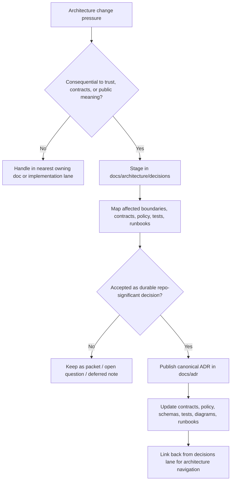

<!-- [KFM_META_BLOCK_V2]
doc_id: kfm://doc/<uuid-NEEDS-VERIFICATION>
title: Architecture Decisions
type: standard
version: v1
status: review
owners: @bartytime4life
created: YYYY-MM-DD
updated: YYYY-MM-DD
policy_label: NEEDS VERIFICATION
related: [../README.md, ../../README.md, ../../adr/README.md, ../diagrams/README.md, ../interfaces/README.md, ../../governance/README.md, ../../runbooks/README.md, ../../../contracts/, ../../../policy/, ../../../schemas/, ../../../tests/]
tags: [kfm, architecture, decisions, adr, evidence-first, trust-membrane]
notes: [Owners confirmed from CODEOWNERS; current public-main snapshot shows this directory as README-only scaffold; docs/adr already exists as a substantive ADR hub; do not create a duplicate architecture-decision truth path without direct repo verification.]
[/KFM_META_BLOCK_V2] -->

# Architecture Decisions

Decision routing, architecture-local staging, and ADR linkage rules for consequential KFM changes.

| Status | Owners | Badges | Quick jump |
|---|---|---|---|
| **experimental** | **@bartytime4life** |     | [Scope](#scope) · [Repo fit](#repo-fit) · [Inputs](#inputs) · [Exclusions](#exclusions) · [Tree](#directory-tree) · [Quickstart](#quickstart) · [Usage](#usage) · [Diagram](#diagram) · [Tables](#reference-tables) · [Task list](#task-list--definition-of-done) · [FAQ](#faq) |

**Repo fit**  
Path: `docs/architecture/decisions/`  
Upstream: [`../README.md`](../README.md) · [`../../README.md`](../../README.md)  
Downstream: [`../../adr/README.md`](../../adr/README.md) · [`../diagrams/README.md`](../diagrams/README.md) · [`../interfaces/README.md`](../interfaces/README.md) · [`../../../contracts/`](../../../contracts/) · [`../../../policy/`](../../../policy/) · [`../../../tests/`](../../../tests/)

> [!IMPORTANT]
> **CONFIRMED:** the current public `main` snapshot exposes this directory as a real directory with a minimal scaffold `README.md`.  
> **CONFIRMED:** `docs/adr/README.md` already exists as a substantive repo-level ADR hub.  
> **PROPOSED working rule:** this directory should function as the **architecture-local decision map, staging lane, and link surface**, while `docs/adr/` remains the **canonical accepted ADR ledger** unless directly verified repo practice proves otherwise.

> [!CAUTION]
> Do **not** let `docs/architecture/decisions/` become a second sovereign ADR system by accident. In KFM, duplicated truth paths are a trust failure, not just a documentation mess.

## Scope

This directory explains **how architecture decisions should be staged, linked, escalated, and handed off** inside the KFM documentation system.

It exists to answer four practical questions:

1. What belongs in an architecture-local decision lane before it becomes a repo-wide accepted decision?
2. When should a decision stay local to `docs/architecture/` versus graduate into `docs/adr/`?
3. What evidence, contracts, and downstream updates are expected when a decision becomes consequential?
4. How should contributors avoid inventing a second decision ledger that drifts from accepted architecture memory?

### Truth posture for this directory

| Label | Meaning here |
|---|---|
| **CONFIRMED** | The current public repo exposes `docs/architecture/decisions/README.md` as a scaffold directory README, and `docs/adr/README.md` already exists as a substantive ADR home. |
| **INFERRED** | The safest repo-native role for this directory is an **architecture-local routing and staging surface**, because that avoids ADR duplication while still giving `docs/architecture/` a place to frame pending decision pressure. |
| **PROPOSED** | Suggested support files, staging packets, and workflow rules in this README are starter patterns, not mounted implementation facts. |
| **UNKNOWN** | Actual in-repo ADR creation workflow, local maintainer habits, automation hooks, and whether any private/internal decision packets already exist outside the public snapshot. |
| **NEEDS VERIFICATION** | Final `doc_id`, exact metadata dates, policy label, and whether the repo wants this directory to remain README-only after the current revision. |

[Back to top](#architecture-decisions)

## Repo fit

This README should feel native to the current docs structure, not like a parallel method imported from elsewhere.

### Directory role map

| Item | Current role | KFM consequence |
|---|---|---|
| `docs/README.md` | Docs root and trust-surface framing | Treat docs as operational product surfaces, not ornamental prose. |
| `docs/architecture/README.md` | Architecture index with scaffold/starter lanes | `decisions/` should stay aligned with architecture navigation and local dependency order. |
| `docs/architecture/decisions/README.md` | Current scaffold landing page | This file is the place to make the lane usable without overclaiming mounted process. |
| `docs/adr/README.md` | Governed ADR index / authoring contract / backlog surface | Accepted cross-cutting architectural decisions should point there, not compete with it. |
| `contracts/`, `policy/`, `schemas/`, `tests/` | Machine-bearing trust surfaces | Consequential decisions should eventually bind to these surfaces, not stop in prose. |

### Working relationship

- `docs/architecture/decisions/` is the **local decision-routing surface** for architecture work.
- `docs/adr/` is the **canonical accepted-decision home** for repo-significant ADRs.
- `docs/architecture/diagrams/` and `docs/architecture/interfaces/` should carry supporting structure when a decision changes system shape or interface meaning.
- `contracts/`, `policy/`, `schemas/`, `tests/`, and runbooks are where decisions become operationally real.

### Why this split is useful

A pure scaffold is too thin to guide contributors. A second ADR ledger is too risky for KFM. The right middle ground is:

- architecture-local **decision intake and routing** here
- accepted, durable, repo-significant **decision records** in `docs/adr/`

[Back to top](#architecture-decisions)

## Inputs

### Accepted inputs

This directory may accept:

- architecture-local decision pressure
- unresolved trade studies with clear scope
- dependency or boundary questions emerging from `docs/architecture/`
- candidate decisions awaiting ADR graduation
- link maps from architecture topics to accepted ADRs
- open questions that block diagrams, interfaces, package boundaries, or trust-surface behavior
- decision packets that summarize affected contracts, policies, tests, runbooks, and rollback implications

### Typical examples

- Whether a change belongs in the governed API, a worker, or a delivery projection.
- Whether a UI behavior is shell state, truth-bearing state, or policy-bearing state.
- Whether a geospatial artifact class is authoritative, derived, or disallowed in a given release lane.
- Whether a proposed 3D surface clears the burden threshold or should remain 2D.
- Whether a runtime outcome needs a new reason code, obligation code, or response-envelope field.
- Whether a route family change is local implementation detail or ADR-worthy architecture law.

### Preferred input format

Use compact, reviewable packets rather than loose notes:

```md
# Decision packet — <topic>

Status: CONFIRMED | INFERRED | PROPOSED | UNKNOWN
Owner: <name or team>
Date: YYYY-MM-DD
Upstream context:
Affected surfaces:
Affected contracts/policies/tests:
Decision pressure:
Options considered:
Recommended direction:
Why now:
Open verification steps:
Graduates to ADR?: yes | no | maybe
```

[Back to top](#architecture-decisions)

## Exclusions

### What does **not** belong here

| Exclusion | Put it here instead | Why |
|---|---|---|
| Accepted repo-wide ADR text | [`../../adr/`](../../adr/) | Avoid a duplicate architecture memory system. |
| Incident procedures / operations runbooks | [`../../runbooks/`](../../runbooks/) | These are execution surfaces, not decision staging. |
| Canonical schema definitions | [`../../../schemas/`](../../../schemas/) / [`../../../contracts/`](../../../contracts/) | Machine-bearing truth belongs with validation surfaces. |
| Policy bundles, reasons, obligations | [`../../../policy/`](../../../policy/) | Policy law should not live only in markdown prose. |
| UI asset catalogs or design-system specifics | Adjacent UI/docs surfaces | Keep this lane focused on decisions, not component inventory. |
| Generic brainstorming with no boundary, evidence, or consequence | Local notes, issue tracker, or scratch doc | This directory should remain reviewable and architecture-bearing. |
| Historical essays detached from live routing value | `docs/reports/` or archival docs | Preserve navigability and actionability. |

### Hard exclusion

Do **not** use this directory to silently publish accepted doctrine that never gets linked into ADRs, contracts, policy, tests, diagrams, or runbooks.

[Back to top](#architecture-decisions)

## Current public-main snapshot

The current public-main snapshot matters because this README must improve a real directory, not invent one.

| Observation | Status | Consequence |
|---|---|---|
| `docs/architecture/decisions/` exists publicly | **CONFIRMED** | This is a real lane, not a hypothetical folder. |
| The directory currently shows only `README.md` | **CONFIRMED** | The lane is present but underdeveloped. |
| The current README is only a scaffold line | **CONFIRMED** | A stronger landing page is warranted. |
| `docs/architecture/README.md` already classifies architecture lanes and notes scaffold status | **CONFIRMED** | This README should align upward with that parent index. |
| `docs/adr/README.md` already provides substantive ADR guidance | **CONFIRMED** | This README must complement, not duplicate, ADR governance. |
| Mounted local repo checkout was directly inspected in this session | **UNKNOWN** | Keep file-growth suggestions explicitly provisional. |

### Interpretation rule

Where public-main evidence and doctrinal PDFs differ in confidence level, prefer:

1. live repo evidence for **what exists now**
2. March 2026 doctrine for **what the lane should protect**
3. explicit `PROPOSED` or `UNKNOWN` labeling for anything in between

[Back to top](#architecture-decisions)

## Directory tree

### Current public-main shape

```text
docs/
└── architecture/
    └── decisions/
        └── README.md
```

### Proposed minimal growth surface

```text
docs/
└── architecture/
    └── decisions/
        ├── README.md
        ├── linked-adrs.md          # PROPOSED pointer table into ../../adr/
        ├── open-questions.md       # PROPOSED architecture-local unresolved decision backlog
        └── packets/
            └── README.md           # PROPOSED packet format + staging rules
```

### Tree rule

This directory should grow **only** when a new file has a stable role:

- `linked-adrs.md` for fast architecture-to-ADR navigation
- `open-questions.md` for unresolved architecture pressure with explicit owners and next checks
- `packets/` for bounded, reviewable decision packets that may later graduate elsewhere

It should **not** become a junk drawer of half-decided markdown.

[Back to top](#architecture-decisions)

## Quickstart

### 1) Verify what exists first

```bash
find docs/architecture/decisions -maxdepth 2 -type f | sort
sed -n '1,220p' docs/architecture/README.md
sed -n '1,260p' docs/adr/README.md
```

### 2) Add a local decision packet only when there is real pressure

```bash
mkdir -p docs/architecture/decisions/packets
cat > docs/architecture/decisions/packets/<yyyy-mm-dd-topic>.md <<'MD'
# Decision packet — <topic>

Status: PROPOSED
Owner: NEEDS VERIFICATION
Date: YYYY-MM-DD
Upstream context:
Affected surfaces:
Affected contracts/policies/tests:
Decision pressure:
Options considered:
Recommended direction:
Open verification steps:
Graduates to ADR?: maybe
MD
```

### 3) Escalate to ADR when the decision becomes consequential

Before graduation:

- link the packet from this README or `linked-adrs.md`
- identify affected contracts, policy surfaces, tests, and runbooks
- create or update the canonical record under [`../../adr/`](../../adr/)
- add downstream updates rather than leaving the decision trapped in prose

> [!NOTE]
> The packet is **not** the accepted architecture decision. It is staging material until the repo’s canonical decision process says otherwise.

[Back to top](#architecture-decisions)

## Usage

### Decision routing rule

| Situation | Start here? | Must graduate to `docs/adr/`? | Typical downstream updates |
|---|---|---:|---|
| Architecture-local trade study with limited blast radius | Yes | Maybe | diagrams, notes, follow-up verification |
| Expensive-to-reverse system boundary choice | Yes | Usually yes | ADR, contracts, policy, tests, runbooks |
| Map/timeline/dossier/Evidence Drawer/Focus shell behavior change | Yes | Usually yes if cross-cutting | UI docs, payload examples, surface-state tests |
| Shared route family / response envelope / trust-state change | Yes | Yes | ADR, OpenAPI/JSON Schema/policy/tests |
| Lane-specific source admission or publication burden clarification | Yes | Maybe | atlas/domain docs, policy, source descriptors |
| Purely editorial wording cleanup | No | No | edit nearest owning doc |
| Incident-only operational response | No | No | runbooks |
| Standalone diagram asset with no decision text | No | No | `../diagrams/` |

### Graduation rule

A staged decision should graduate from this directory when **any** of the following becomes true:

- it changes authority boundaries
- it changes trust-visible runtime outcomes
- it changes route or contract meaning
- it affects promotion, correction, rollback, policy enforcement, or public interpretation

### Architecture-significant triggers

Use the following as a quick gate:

- trust membrane touched
- canonical truth path touched
- authoritative-vs-derived rule touched
- Evidence Drawer or Focus contract touched
- public/steward/review route families touched
- 2D/3D burden rule touched
- release proof, correction propagation, or stale-visible behavior touched

If none of those are touched, the item may not need ADR escalation.

[Back to top](#architecture-decisions)

## Diagram


```mermaid
flowchart TD
    A[Architecture change pressure] --> B{Consequential to trust, contracts, or public meaning?}
    B -- No --> C[Handle in nearest owning doc or implementation lane]
    B -- Yes --> D[Stage in docs/architecture/decisions]
    D --> E[Map affected boundaries, contracts, policy, tests, runbooks]
    E --> F{Accepted as durable repo-significant decision?}
    F -- No --> G[Keep as packet / open question / deferred note]
    F -- Yes --> H[Publish canonical ADR in docs/adr]
    H --> I[Update contracts, policy, schemas, tests, diagrams, runbooks]
    I --> J[Link back from decisions lane for architecture navigation]
```

### What the diagram is trying to prevent

- architecture pressure disappearing into code without a durable record
- duplicate ADR ledgers
- “decision made” prose that never updates machine-bearing trust surfaces
- false closure on unresolved questions

[Back to top](#architecture-decisions)

## Reference tables

### Directory responsibility split

| Surface | Primary job | Keep out |
|---|---|---|
| `docs/architecture/decisions/` | Architecture-local decision staging, routing, and linkage | Accepted ADR canon, raw policy bundles, schema source of truth |
| `docs/adr/` | Canonical accepted architecture decisions | Loose speculative notes with no consequence mapping |
| `docs/architecture/diagrams/` | Structural visual explanation | Unexplained decision law without narrative context |
| `docs/architecture/interfaces/` | Interface-focused architecture explanation | Policy-only records or release-only evidence |
| `contracts/` / `schemas/` | Machine-checkable interface truth | Pure prose justifications with no validation path |
| `policy/` | Decision grammar and deny/allow obligations | UI-only rationales detached from enforcement |
| `tests/` | Proof that decisions hold in behavior | Architectural claims with no executable checks |

### Downstream burden map

| Decision type | Minimum burden before calling it “done” |
|---|---|
| New response envelope or runtime outcome | contract example, invalid case, policy effect, tests |
| New public route family | route description, trust boundary note, auth/policy note, tests |
| Evidence Drawer payload change | payload example, visibility tiers, UI acceptance, keyboard/reduced-motion checks |
| Promotion/correction rule change | ADR or equivalent record, runbook delta, release proof implication |
| 3D allowance | burden statement, audience rule, evidence/inspection parity, fallback path |
| Source admission rule | source-role consequence, rights/sensitivity note, validation impact |

[Back to top](#architecture-decisions)

## Task list & definition of done

### Directory definition of done

- [x] Replace the flat scaffold with a repo-native landing page.
- [x] Make `docs/adr/` relationship explicit.
- [x] State accepted inputs and exclusions clearly.
- [x] Include a meaningful decision-routing diagram.
- [x] Add quickstart commands/snippets.
- [x] Add tables for routing and burden mapping.
- [x] Keep all unverified file growth explicitly **PROPOSED**.
- [ ] Verify whether `linked-adrs.md`, `open-questions.md`, or `packets/` should actually exist in the mounted repo.
- [ ] Replace metadata placeholders after direct repo-maintainer verification.
- [ ] Add real local links to accepted ADRs once the target set is confirmed.

### First-wave follow-up work

1. Verify whether maintainers want this directory to remain README-only.
2. If not, add `linked-adrs.md` as a navigation-only companion.
3. Reconcile this README with any future ADR index or architecture traceability table.
4. Add one architecture-local packet example only after confirming repo preference.
5. Wire links from parent architecture docs once accepted.

[Back to top](#architecture-decisions)

## FAQ

### Why not just put all architecture decisions here?

Because the public repo already has a dedicated `docs/adr/` surface. Reusing that for accepted decisions avoids split authority.

### Can this directory stay README-only?

Yes. That is a plausible and clean outcome. This README is written so the lane is useful even if no other files are added.

### What turns a packet into an ADR?

Cross-cutting consequence. If a decision changes trust boundaries, route meaning, contracts, policy grammar, release/correction behavior, or major shell law, it should graduate.

### Should diagrams or payload examples live beside packets?

Only if the repo explicitly wants that. The safer default is to keep canonical diagrams and machine-bearing examples with their owning surfaces and link outward.

### What is the easiest failure mode here?

Creating a “helpful” second ADR system that slowly diverges from `docs/adr/`, contracts, policy, and tests.

[Back to top](#architecture-decisions)

## Appendix

<details>
<summary>Verification notes, guardrails, and starter checks</summary>

### Direct current public-main surfaces used for this README

- root repo structure
- `.github/CODEOWNERS`
- `.github/PULL_REQUEST_TEMPLATE.md`
- `docs/README.md`
- `docs/architecture/README.md`
- `docs/architecture/decisions/README.md`
- `docs/adr/README.md`
- `docs/reports/readme-structure-reconciliation.md`

### Guardrails preserved from surrounding KFM doctrine

- evidence-first posture
- no silent duplication of truth surfaces
- no implied implementation beyond verified evidence
- map-first/time-aware/trust-visible vocabulary retained
- authoritative-versus-derived caution preserved
- docs treated as operational surfaces, not decorative extras

### Minimal local verification commands

```bash
# confirm directory contents
find docs/architecture/decisions -maxdepth 2 -type f | sort

# inspect related lanes
sed -n '1,260p' docs/adr/README.md
sed -n '1,260p' docs/architecture/README.md
sed -n '1,220p' docs/README.md

# search for decision-related collisions
grep -Rni "ADR" docs/architecture docs/adr | head -n 100
grep -Rni "decision packet\|linked-adrs\|open-questions" docs | head -n 100
```

</details>

[Back to top](#architecture-decisions)
