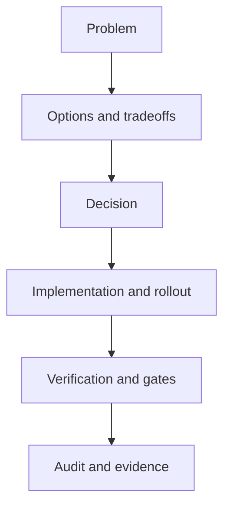

<!-- [KFM_META_BLOCK_V2]
doc_id: kfm://doc/<uuid>
title: ADR-0000 Template
type: standard
version: v1
status: draft
owners: <team-or-names>
created: 2026-03-01
updated: 2026-03-01
policy_label: public
related:
  - docs/architecture/decisions/
tags: [kfm, adr, architecture, decision]
notes:
  - Copy this file to adr-XXXX-<short-title>.md and fill in all REQUIRED sections.
[/KFM_META_BLOCK_V2] -->

# ADR-0000: Template
**Purpose:** Standard Architecture Decision Record (ADR) template for Kansas Frontier Matrix (KFM).  
**Status:** Draft (template) • **Owners:** `<team-or-names>` • **Last updated:** `YYYY-MM-DD`

> NOTE  
> This is a template. For a real ADR, rename the file to `adr-XXXX-<short-title>.md`, set **Status** appropriately, and replace all `<placeholders>`.

## Navigation
- [How to use this template](#how-to-use-this-template)
- [Decision record](#decision-record)
- [Context](#context)
- [Decision drivers](#decision-drivers)
- [Options considered](#options-considered)
- [Decision](#decision)
- [Consequences](#consequences)
- [Security, privacy, and policy](#security-privacy-and-policy)
- [Implementation plan](#implementation-plan)
- [Verification](#verification)
- [Rollback plan](#rollback-plan)
- [Evidence and citations](#evidence-and-citations)
- [Approvals](#approvals)
- [Appendix](#appendix)

---

## How to use this template

### When to write an ADR (guidance)
Write an ADR when you make a decision that:
- Introduces or changes a system invariant
- Impacts governance, policy enforcement, evidence rules, or data promotion gates
- Creates a new cross-cutting dependency (storage, indexing, auth, API boundaries)
- Changes schema/contracts (OpenAPI/JSON Schema), pipeline contracts, or catalog semantics
- Has meaningful tradeoffs, risks, or operational implications

### Status values (recommended)
Use one of:
- **Proposed**
- **Accepted**
- **Rejected**
- **Deprecated**
- **Superseded** (link the replacement ADR)

### Truth discipline tags (required)
For claims and assumptions in this ADR, label them:
- **CONFIRMED**: backed by evidence (links, receipts, tests, docs)
- **PROPOSED**: a plan or recommendation (include rationale + tradeoffs)
- **UNKNOWN**: needs verification (include minimum verification steps)

---

## Decision record

| Field | Value |
|---|---|
| ADR ID | `0000` |
| Title | `Template` |
| Date | `YYYY-MM-DD` |
| Status | `Draft` |
| Decision type | `Process / Template / Architecture / Data / Security / Policy / UX / API` |
| Owners | `<team-or-names>` |
| Deciders | `<names-or-role-group>` |
| Consulted | `<names-or-teams>` |
| Informed | `<names-or-teams>` |
| Related ADRs | `<links-or-IDs>` |
| Supersedes | `<adr-XXXX>` |
| Superseded by | `<adr-XXXX>` |

---

## Context

### Problem statement (required)
Describe what must be decided and why now.

- **What is changing?**
- **What is broken / missing?**
- **What is the user-visible impact?**
- **What constraints are non-negotiable?**

### Scope (required)
- **In scope:** `<…>`
- **Out of scope / non-goals:** `<…>`

### Constraints and invariants impacted (required)
List the invariants you must preserve.

- `<Invariant 1>`
- `<Invariant 2>`
- `<Invariant 3>`

> WARNING  
> If this decision could weaken the trust membrane / policy boundary, you must explicitly explain why it’s still safe and how it is enforced and tested.

---

## Decision drivers

| Driver | Why it matters | Priority |
|---|---|---|
| Evidence traceability | `<reason>` | Must |
| Governance/policy enforcement | `<reason>` | Must |
| Reversibility | `<reason>` | Must |
| Performance/scalability | `<reason>` | Should |
| Developer ergonomics | `<reason>` | Could |

---

## Options considered

> TIP  
> Include 2–4 options if possible. An ADR with only one option is often missing alternatives.

| Option | Summary | Pros | Cons | Risks | Notes |
|---|---|---|---|---|---|
| A | `<…>` | `<…>` | `<…>` | `<…>` | `<…>` |
| B | `<…>` | `<…>` | `<…>` | `<…>` | `<…>` |
| C | `<…>` | `<…>` | `<…>` | `<…>` | `<…>` |

---

## Decision

### Decision statement (required)
**We will:** `<clear, testable statement of the chosen option>`.

### Rationale (required)
Why this option best satisfies the drivers and constraints.

- `<reason 1>`
- `<reason 2>`
- `<reason 3>`

### What changes (required)
- **New:** `<components/contracts/pipelines/tests/docs>`
- **Changed:** `<components/contracts/pipelines/tests/docs>`
- **Removed:** `<components/contracts/pipelines/tests/docs>`
- **Unaffected:** `<components/contracts/pipelines/tests/docs>`

### Conceptual flow (diagram required)

---

## Consequences

### Positive outcomes
- `<benefit 1>`
- `<benefit 2>`

### Negative outcomes / costs
- `<cost 1>`
- `<cost 2>`

### Tradeoffs (required)
- `<tradeoff 1>`
- `<tradeoff 2>`

### Risks (required)
| Risk | Likelihood | Impact | Mitigation | Owner |
|---|---:|---:|---|---|
| `<risk>` | Low/Med/High | Low/Med/High | `<mitigation>` | `<owner>` |

---

## Security, privacy, and policy

### Policy label (required)
- **Policy label:** `public | restricted | confidential | sensitive | …`
- **Redaction obligations:** `<none / describe>`

### Threat model notes (recommended)
- **Abuse cases:** `<…>`
- **Sensitive outputs:** `<…>`
- **New attack surface:** `<…>`

### Access control and auditing (required if applicable)
- **AuthN/AuthZ changes:** `<…>`
- **Audit logging changes:** `<…>`
- **Policy engine changes:** `<…>`

---

## Implementation plan

### Plan of record (required)
Describe the smallest reversible increments.

1. `<step 1>`
2. `<step 2>`
3. `<step 3>`

### Impacted components / interfaces (required)
- **Domain:** `<…>`
- **Use cases:** `<…>`
- **Interfaces/contracts:** `<…>`
- **Infrastructure:** `<…>`

### Data lifecycle / promotion contract impact (required if applicable)
- **Zones impacted:** `RAW | WORK | PROCESSED | CATALOG | PUBLISHED`
- **New/changed gates:** `<…>`
- **Run receipts / audit ledger changes:** `<…>`

---

## Verification

### Definition of done (required)
- [ ] Decision implemented behind appropriate boundaries (no bypass paths)
- [ ] Tests added/updated (unit/integration/policy)
- [ ] Documentation updated (runbooks/contracts/diagrams)
- [ ] Audit artifacts produced (receipts/logs/checksums where relevant)
- [ ] Rollback path validated

### Minimum verification steps (required)
Convert **UNKNOWN → CONFIRMED** with the smallest checks.

1. `<check 1: what to verify, where>`
2. `<check 2: what to verify, where>`
3. `<check 3: what to verify, where>`

---

## Rollback plan

### Rollback trigger (required)
- `<what condition triggers rollback>`

### Rollback steps (required)
1. `<step 1>`
2. `<step 2>`

### Residual risk after rollback
- `<…>`

---

## Evidence and citations

> NOTE  
> Prefer links to governed artifacts: receipts, catalog entries, schema versions, policy tests, and reproducible build outputs.

### Evidence bundle
- **EvidenceBundle ID:** `<id>`
- **EvidenceRefs:**  
  - `<evidence-ref-1>`  
  - `<evidence-ref-2>`

### Artifacts
- **Contracts (OpenAPI/JSON Schema):** `<paths>`
- **Policies (Rego/tests):** `<paths>`
- **Pipelines/configs:** `<paths>`
- **Receipts/logs:** `<paths>`
- **Dashboards/metrics:** `<links>`

### References
- `<docs/spec link 1>`
- `<docs/spec link 2>`

---

## Approvals

| Role | Name | Date | Decision |
|---|---|---|---|
| Owner | `<…>` | `YYYY-MM-DD` | Approve / Reject |
| Security/Policy | `<…>` | `YYYY-MM-DD` | Approve / Reject |
| Data Governance | `<…>` | `YYYY-MM-DD` | Approve / Reject |

---

## Appendix

### Change log
| Date | Change | Author |
|---|---|---|
| `YYYY-MM-DD` | Created | `<…>` |

### Appendix notes (optional)

Notes

- `<extra notes>`
- `<longer rationale>`
- `<extra links>`

---

**Back to top:** [Navigation](#navigation)
