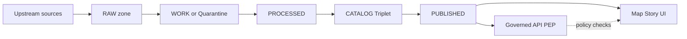

<!-- [KFM_META_BLOCK_V2]
doc_id: kfm://doc/7b9f2d58-59a2-4d5a-9d7c-3e1c9c7e5d0a
title: "ADR-0001 (Example) — Enforce Truth Path + Promotion Contract"
type: adr
version: v1
status: draft
owners: kfm-architecture
created: 2026-03-01
updated: 2026-03-01
policy_label: public
related:
  - TODO: link to the Promotion Contract doc
  - TODO: link to policy label registry
tags:
  - kfm
  - architecture
  - adr
  - governance
notes:
  - "Example ADR: copy this file, rename, and fill in the placeholders."
[/KFM_META_BLOCK_V2] -->

# ADR-0001 (Example) — Enforce Truth Path + Promotion Contract


> **Purpose**: This ADR is an **example**. Copy it when recording a real decision.
>
> **Replace**: `Status`, dates, deciders, and any “example” language when you adopt it for a real decision.

---

## Navigation

- [Context](#context)
- [Decision drivers](#decision-drivers)
- [Decision](#decision)
- [Decision scope](#decision-scope)
- [Promotion gates](#promotion-gates)
- [Consequences](#consequences)
- [Alternatives considered](#alternatives-considered)
- [Implementation sketch](#implementation-sketch)
- [Minimum verification steps](#minimum-verification-steps)
- [Open questions](#open-questions)
- [References](#references)

---

## Context

KFM is an evidence-first geospatial platform. A core risk in platforms that ingest and publish geospatial data is **loss of provenance** (what data came from where), **loss of reproducibility** (can we rebuild?), and **policy bypass** (clients reach around the policy layer to query raw storage directly).

This ADR captures a single architectural decision that reduces those risks:

- Treat the “truth path” lifecycle as **real storage zones + validation gates**, not a metaphor.
- Enforce a **Promotion Contract**: publishing is blocked until minimum gates are satisfied.

## Decision drivers

- **Governance**: Every published dataset must have traceable provenance and licensing/rights metadata.
- **Safety**: Default-deny for sensitive data, and enforce redaction/generalization obligations when needed.
- **Reproducibility**: Published outputs must be reproducible from immutable inputs (or explicitly marked rebuildable).
- **Operational simplicity**: Make gates automatable in CI; fail closed.

## Decision

We will enforce a strict, auditable lifecycle for all datasets and derived artifacts:

1. Data flows through **named zones** (RAW → WORK/Quarantine → PROCESSED → CATALOG/Triplet → PUBLISHED).
2. Movement into **PUBLISHED** is blocked unless the **Promotion Contract** gates are satisfied.
3. **All runtime surfaces** (APIs, tiles, UI, Story pages, Focus Mode answers) are served from **PUBLISHED** and must pass through the **policy enforcement point (PEP)** (i.e., no direct storage/DB reads from UI clients).

### Conceptual flow



## Decision scope

**In scope**

- Any dataset that is exposed via public UI, internal UI, API, tiles, Story Nodes, or Focus Mode.
- Any derived artifact (tiles, indexes, vector extracts, summaries, cached query responses) that might influence user-visible claims.

**Out of scope (for this ADR)**

- The exact storage backend (S3 vs GCS vs NFS, etc.).
- The exact catalog formats beyond “DCAT + STAC + PROV” as a conceptual contract.

## Promotion gates

Promotion to **PUBLISHED** is blocked unless the following minimum gates are met.

| Gate | What must be present | What fails closed looks like |
|---|---|---|
| A — Identity & versioning | `dataset_id`, `dataset_version_id`, deterministic spec hash, content digests | cannot publish; stays in WORK/Quarantine |
| B — Licensing & rights | license/rights fields + snapshot of upstream terms | cannot publish; steward review required |
| C — Sensitivity & redaction | `policy_label` + obligations (generalize geometry, remove fields, etc.) when needed | default-deny; no public access |
| D — Catalog triplet validation | DCAT + STAC + PROV validate and cross-link | cannot publish; broken-link gate |
| E — QA & thresholds | dataset-specific QA checks documented and met | cannot publish; remains quarantined |
| F — Run receipt & audit record | receipt captures inputs, tooling versions, hashes, policy decisions | cannot publish; no “uncited” runtime |
| G — Release manifest | promotion recorded as a manifest referencing artifacts + digests | cannot publish; no “ghost releases” |

> **NOTE**: The gate names (A–G) are intentionally simple so CI checks can be written and understood quickly.

## Consequences

**Positive**

- Published datasets become **auditable** (what, when, how, by whom).
- UI and API behavior becomes easier to reason about: if it’s visible, it’s in PUBLISHED and policy-checked.
- Incidents become debuggable: receipts + catalog triplets are the “paper trail.”

**Negative / costs**

- Higher upfront work to define specs, QA checks, and receipts.
- More CI checks and more “blocked promotions” while the system is immature.

**Risk mitigations**

- Start with one MVP dataset and make the gates real end-to-end before scaling.
- Treat “unknowns” as blockers: record them as open questions + verification steps.

## Alternatives considered

1. **Ad hoc publishing** (copy data into a “public bucket” and document later)
   - Rejected: too easy to lose provenance and violate licensing or sensitivity obligations.

2. **Best-effort metadata** (publish first; fill in catalog/receipts when time allows)
   - Rejected: creates incentives to ship ungoverned outputs and backfill later (often never happens).

3. **Soft gates** (warnings in CI, but not blocking)
   - Rejected: governance must fail closed; warnings become noise.

## Implementation sketch

This is a *non-normative* sketch of how the repository might represent the lifecycle.

```text
# Example layout (verify against the live repo; adjust as needed)

data/
  raw/
  work/
  processed/
  catalog/
  published/

contracts/
  schemas/
  openapi/

policy/
  rego/
  tests/

tools/
  validators/

docs/
  architecture/
    decisions/
```

## Minimum verification steps

If you copy this ADR for a real decision, attach the outputs of the following checks:

- [ ] Capture repo commit hash and root directory tree (`git rev-parse HEAD`, `tree -L 3`).
- [ ] Confirm which work packages already exist (search for spec hashing, policies, validators, evidence resolver, registry schema).
- [ ] Extract CI gate list from `.github/workflows` and document which checks are merge-blocking.
- [ ] Choose a single MVP dataset and verify it can be promoted through all gates with receipts and catalogs.
- [ ] Validate UI cannot bypass the PEP (static analysis + network policies) and EvidenceRefs resolve end-to-end.
- [ ] For Focus Mode: run the evaluation harness; store golden query outputs and diffs as artifacts.

## Open questions

- What is the authoritative list of policy labels and obligations (and where is it versioned)?
- Which artifacts are “canonical” vs “rebuildable,” and what tests enforce that boundary?
- What is the initial MVP dataset and its QA threshold definition?

## References

- KFM vNext governance & blueprint snapshots (as referenced by internal KFM briefs)
- Promotion Contract and lifecycle zones (truth path)
- OPA/Rego default-deny posture and policy tests
