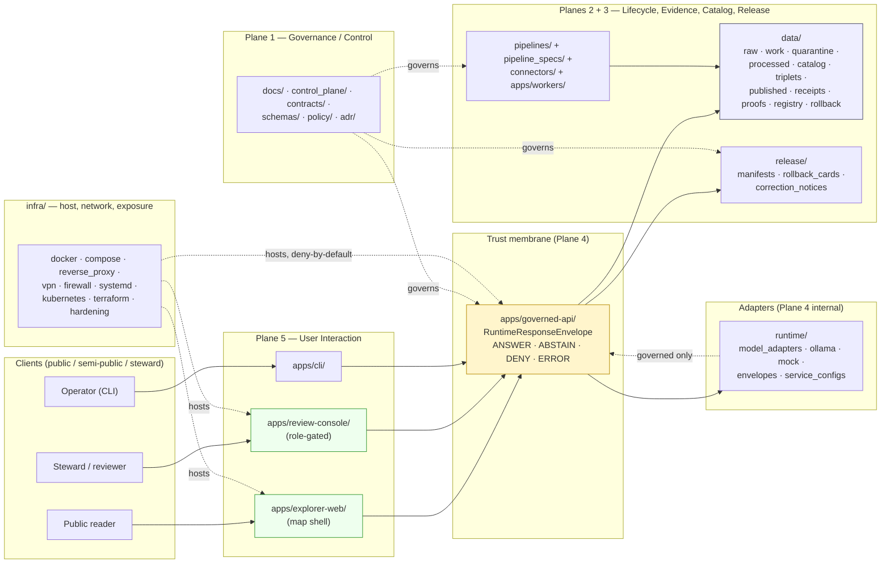

<!-- [KFM_META_BLOCK_V2]
doc_id: kfm://doc/architecture/deployment-topology
title: Deployment Topology
type: standard
version: v1
status: draft
owners: <infra-steward>, <security-steward>, <release-authority>
created: 2026-05-14
updated: 2026-05-14
policy_label: public
related: [
  docs/doctrine/directory-rules.md,
  docs/doctrine/trust-membrane.md,
  docs/architecture/README.md,
  docs/architecture/system-context.md,
  docs/architecture/governed-api.md,
  docs/architecture/map-shell.md,
  docs/runbooks/,
  docs/security/,
  control_plane/release_state_register.yaml
]
tags: [kfm, architecture, deployment, infra, trust-membrane]
notes: [
  "Doctrinal positions are CONFIRMED from supplied corpus; concrete environment, host, CI, signing, and identity-provider claims are UNKNOWN until a repo or environment is mounted.",
  "Five-plane cut is a PROPOSED architectural framing per the Unified Implementation Manual.",
  "All path claims follow directory-rules.md §6.1 / §10."
]
[/KFM_META_BLOCK_V2] -->

# Deployment Topology

> How KFM's planes, applications, runtimes, and infrastructure roots fit together — and how the trust membrane stays intact across every deployment surface.


| Status | Owners | Last reviewed |
|---|---|---|
| `draft` | `<infra-steward>`, `<security-steward>`, `<release-authority>` *(placeholders — verify via `CODEOWNERS` once repo is mounted)* | `2026-05-14` |

---

## Contents

- [1. Purpose and scope](#1-purpose-and-scope)
- [2. Truth posture for this document](#2-truth-posture-for-this-document)
- [3. The five planes](#3-the-five-planes)
- [4. Topology overview](#4-topology-overview)
- [5. Component homes by responsibility root](#5-component-homes-by-responsibility-root)
- [6. Trust membrane and traffic rules](#6-trust-membrane-and-traffic-rules)
- [7. Environments and promotion of deployment artifacts](#7-environments-and-promotion-of-deployment-artifacts)
- [8. Exposure controls and sensitivity posture](#8-exposure-controls-and-sensitivity-posture)
- [9. Secrets, configs, audit](#9-secrets-configs-audit)
- [10. Reversibility and rollback](#10-reversibility-and-rollback)
- [11. Open questions and verification backlog](#11-open-questions-and-verification-backlog)
- [12. Related docs](#12-related-docs)
- [Appendix A — Plane responsibilities, summary](#appendix-a--plane-responsibilities-summary)

---

## 1. Purpose and scope

This document describes **how KFM is deployed** — the cooperating planes, the application surfaces that realize them, the runtime adapters they depend on, the infrastructure roots that host them, and the trust rules that make the topology defensible. It is doctrine *about deployment*; it does not by itself prove any environment exists or behaves as described.

> [!IMPORTANT]
> **Doctrinal positions are CONFIRMED. Implementation maturity is UNKNOWN.** No mounted repository, CI workflow, runtime log, dashboard, or environment artifact was inspected in the session that produced this draft. Every claim about an *actual* host, route, signing key, identity provider, branch protection, or running service is labeled `PROPOSED` or `NEEDS VERIFICATION` until verified against the mounted environment.

In scope:

- The architectural cut of KFM into cooperating planes.
- Which responsibility roots own which deployment concerns.
- The trust-membrane rules every deployment topology MUST preserve.
- The exposure, secrets, audit, and rollback expectations for any concrete environment.

Out of scope (covered by sibling docs):

- Object meaning → `contracts/` and `docs/doctrine/`.
- Machine shape → `schemas/`.
- Admissibility / release decisions → `policy/`, `release/`.
- Source identity, rights, sensitivity → `data/registry/`, `policy/sensitivity/`.
- Concrete CI workflow names, branch protections, secret-store identities (these are environment facts, not architecture).

---

## 2. Truth posture for this document

| Label | Meaning here |
|---|---|
| `CONFIRMED` | Supported by attached doctrine (Directory Rules, Unified Implementation Manual, Whole-UI / Governed-AI Expansion). |
| `PROPOSED` | Design recommendation; placement or behavior not yet verified in any environment. |
| `UNKNOWN` | Not resolvable without mounted repo, environment, or operational evidence. |
| `NEEDS VERIFICATION` | Checkable; not yet checked strongly enough to act as fact. |

`DENY`, `ABSTAIN`, `ANSWER`, and `ERROR` are **finite system outcomes** returned by the governed API, not truth labels — they describe what services do, not what this document claims.

---

## 3. The five planes

KFM is structured as a **governed spatial-evidence system**, not a map app with optional citations. The smallest sound system has five cooperating planes. (`PROPOSED` architectural cut, per Unified Implementation Manual §6.)

| # | Plane | Responsibility | Primary roots |
|---|---|---|---|
| 1 | **Governance / control plane** | Doctrine, registers, authority ladder, drift and verification backlog, ADRs. | `docs/`, `control_plane/`, `contracts/`, `schemas/`, `policy/` |
| 2 | **Lifecycle / data plane** | RAW → WORK / QUARANTINE → PROCESSED → CATALOG / TRIPLET → PUBLISHED, plus receipts, proofs, registry, rollback. Promotion is a governed state transition, not a file move. | `data/`, `pipelines/`, `pipeline_specs/`, `connectors/`, `migrations/` |
| 3 | **Evidence / catalog / proof plane** | `EvidenceRef` resolution to `EvidenceBundle`, STAC / DCAT / PROV catalog closure, signed receipts and manifests. | `data/proofs/`, `data/receipts/`, `data/catalog/`, `release/`, `packages/evidence-resolver/` |
| 4 | **Governed service / API plane** | The operational form of the trust membrane. Returns `RuntimeResponseEnvelope` with finite outcomes. Mediates every public read of canonical state. | `apps/governed-api/`, `runtime/` |
| 5 | **User interaction plane** | Map shell, Evidence Drawer, Focus Mode, review console, story player, CLI. Reads through plane 4 only. | `apps/explorer-web/`, `apps/review-console/`, `apps/cli/`, `packages/ui/`, `packages/maplibre/`, `packages/cesium/` |

> [!NOTE]
> **Downstream carriers are not sovereign truth.** AI runtimes, MapLibre, graph projections, vector indexes, PMTiles, scenes, summaries, and dashboards are downstream carriers in plane 5. None of them replaces source authority, `EvidenceBundle` resolution, `PolicyDecision`, `PromotionDecision`, `ReleaseManifest`, or rollback target.

[Back to top ↑](#contents)

---

## 4. Topology overview

The diagram below shows how the planes line up against the responsibility roots and the trust membrane. Boxes are responsibility roots from Directory Rules; arrows are *governed* read paths. `NEEDS VERIFICATION`: concrete service binaries, ports, hosts, and identity providers are environment-specific and not asserted here.



**Forbidden arrows** *(not drawn — see [§6 Trust membrane and traffic rules](#6-trust-membrane-and-traffic-rules)):* any direct read from a client to `data/raw`, `data/work`, `data/quarantine`, canonical stores, graph stores, object stores, vector indexes, model runtimes, unpublished candidates, credentials, or internal service handles.

[Back to top ↑](#contents)

---

## 5. Component homes by responsibility root

The placement rules below are `CONFIRMED` against `docs/doctrine/directory-rules.md`. Whether a given root currently exists in any specific checkout is `NEEDS VERIFICATION`.

### 5.1 Applications — `apps/`

| Application | Role | Trust posture |
|---|---|---|
| `apps/governed-api/` | The trust membrane in executable form. Returns `RuntimeResponseEnvelope` with finite outcomes. **MUST be the public trust path.** | Public, deny-by-default. |
| `apps/explorer-web/` | Map-first public/semi-public UI. Reads via `governed-api/`; never directly from `data/raw\|work\|quarantine`. | Public, downstream of membrane. |
| `apps/review-console/` | Steward / reviewer surface. Role-gated and audited. | Restricted; separate from public path. |
| `apps/cli/` | Operator CLI. Validation, release dry-runs, reports. | Operator, audited. |
| `apps/workers/` | Background pipeline workers. **Watcher-as-non-publisher applies:** workers emit receipts and candidate decisions, never publish or rewrite catalog. | Internal; no public ingress. |
| `apps/admin/` | Restricted admin. **MUST NOT become the normal public path.** Justified, constrained, documented, audited. | Restricted; outside the normal path. |

> [!WARNING]
> If both `apps/api/` and `apps/governed-api/` exist in a given checkout, the canonical boundary **MUST** be explicit. `apps/governed-api/` is the public trust path; `apps/api/` is either deprecated, internal-only, or a narrowly documented service. Resolve ambiguity by ADR before deploying.

### 5.2 Runtime adapters — `runtime/`

`runtime/` houses provider-agnostic adapter interfaces and local harnesses for AI and other governed runtimes. **Local AI runtimes (Ollama, etc.) MUST stay behind the governed API** and MUST remain subordinate to evidence, policy, review, and release state. They **MUST NOT** receive direct public client traffic and **MUST NOT** read canonical or raw stores directly.

```text
runtime/
├── README.md
├── local/             # local runtime wiring
├── model_adapters/    # adapter interfaces; provider-agnostic
├── ollama/            # local LLM runtime
├── mock/              # MockAdapter for deterministic tests
├── service_configs/   # runtime service config
└── envelopes/         # finite-outcome envelope helpers
```

### 5.3 Infrastructure — `infra/`

`infra/` is the canonical home for **deployment, host, network, and exposure posture**. For a local system exposed through a home firewall, reverse proxy, or VPN, this folder MUST be explicit about:

- Deny-by-default,
- Least privilege,
- No direct model endpoint exposure,
- No raw data exposure,
- Audit logs.

```text
infra/
├── README.md
├── docker/    compose/        reverse_proxy/
├── vpn/       firewall/       systemd/
├── kubernetes/   terraform/   hardening/
```

> [!CAUTION]
> Admin shortcuts MUST be justified, constrained, documented, and kept out of the normal public path. A convenient admin route that becomes reachable to a public client is a trust-membrane breach, not a feature.

### 5.4 Non-secret configuration — `configs/`

`configs/` MUST NOT store real secrets — ever, even for "test" or "local". Real secrets live in environment-specific secret stores referenced by name. If a real secret lands in `configs/`, treat it as a security incident: rotate, audit, and write a runbook entry in `docs/runbooks/`.

[Back to top ↑](#contents)

---

## 6. Trust membrane and traffic rules

The trust membrane is the rule, not the file. Its operational form is `apps/governed-api/`; its doctrinal definition lives in `docs/doctrine/trust-membrane.md`. Any deployment topology preserves these rules.

| # | Rule | Why |
|---|---|---|
| 1 | **No public RAW path.** Public clients and normal UI surfaces never read `data/raw`, `data/work`, `data/quarantine`, unpublished candidate data, or canonical/internal stores. | Lifecycle invariant; promotion is a governed state transition, not a file move. |
| 2 | **No direct model client.** Focus Mode and AI runtime sit behind the governed API after `EvidenceBundle` resolution and policy checks. | Generation is not evidence. AI is interpretive, not the root truth source. |
| 3 | **No canonical/internal client fetch.** MapLibre and other renderers consume released artifacts and governed APIs, not source systems or internal stores. | Renderers are downstream carriers. |
| 4 | **No unreleased tile load.** PMTiles, MVT, MLT, COG, 3D Tiles, style JSON, sprites, and glyphs must be released and manifest-bound. | Tiles are artifacts, not proof; release manifests anchor identity. |
| 5 | **No sensitive geometry hidden only by style.** Sensitivity requires masking, generalization, restricted tier, or denial before public tile generation. | Style toggles are not access control. |
| 6 | **No popup as Evidence Drawer substitute.** Popups can preview; material claims need `EvidenceDrawerPayload` and `EvidenceBundle` resolution. | Cite-or-abstain is the default truth posture. |
| 7 | **No uncited export.** Screenshots, reports, Story Nodes, and Focus answers retain citations and manifest/version references. | Exports leave the trust membrane; provenance must travel with them. |
| 8 | **Watcher-as-non-publisher.** Workers emit receipts and candidate decisions only; they never publish or rewrite catalog. | Separation of duties between observation and release. |

> [!IMPORTANT]
> Every governed response is a `RuntimeResponseEnvelope` with one finite outcome: `ANSWER`, `ABSTAIN`, `DENY`, or `ERROR`. These are the system's vocabulary of refusal as much as of success. A topology that has no way to return `DENY` or `ABSTAIN` is not a governed topology.

[Back to top ↑](#contents)

---

## 7. Environments and promotion of deployment artifacts

`PROPOSED.` Concrete environment counts, names, hosts, identity providers, and CI workflow names are `UNKNOWN` until verified. The shape below is doctrinally consistent and survives most environment counts.

| Environment | Purpose | Receives | Exposure |
|---|---|---|---|
| `local` | Developer loop; mock adapters, fixtures, no live sources. | Fixtures, `MockAdapter`, dry-run policy bundles. | Loopback only. |
| `dev` *(if present)* | Integration; pinned models, mock or sandbox sources. | Pinned dependency set, signed dev manifests. | Internal only; no public path. |
| `staging` *(if present)* | Release rehearsal; mirrors production policy bundles and signing. | Production-shape `ReleaseManifest`, signed receipts. | Internal or staged access; no public crawl. |
| `production` | Public / semi-public publication. | Released artifacts only, with `ReleaseManifest`, `EvidenceBundle`, and rollback target. | Deny-by-default; admin path constrained and audited. |

**Promotion across environments mirrors lifecycle law.** A build does not "go to production" by being copied; it goes by passing the release gates encoded in `policy/release/` and recorded in `release/manifests/`, with a `RollbackCard` ready in `release/rollback_cards/`. `NEEDS VERIFICATION` whether the project uses `cosign` keyless, keyed, or another signing approach; whether OCI/S3 receipt storage is in place; and whether the GitHub App + Checks API integration is active.

> [!TIP]
> If you are about to write "deployed to production" anywhere, check: is there a `ReleaseManifest`? Is there a `RollbackCard`? Is there a signed `RunReceipt`? If any of those is missing, the right verb is "staged" or "candidate," not "deployed."

[Back to top ↑](#contents)

---

## 8. Exposure controls and sensitivity posture

`CONFIRMED` sensitivity posture: certain data classes require **fail-closed** exposure controls regardless of environment. These categories include — non-exhaustively — exact archaeology locations, living-person and DNA-derived material, rare-species occurrence geometry, culturally sensitive route or site information, critical infrastructure details, and high-risk hazards context.

| Concern | Default posture | Where it lives |
|---|---|---|
| Public read of canonical store | `DENY` | `apps/governed-api/` policy precheck |
| Browser fetch of credentials, model endpoints, internal handles | `DENY` | `infra/reverse_proxy/`, `infra/firewall/` |
| Sensitive geometry leak via tile, vector, 3D, screenshot, export | Generalize / redact / restrict / `DENY` before publication | `policy/sensitivity/`, transform receipts in `data/receipts/` |
| Living-person inference via cross-lane join | Aggregation receipt + minimum-cell suppression + person-parcel join `DENY` | `policy/domains/people-dna-land/` |
| AI answer without `EvidenceBundle` resolution | `ABSTAIN` or `DENY` | `apps/governed-api/` Focus Mode runtime |
| Synthetic surface presented as observation | `DENY` admission to public scene | Release manifest + Reality Boundary Note |

> [!WARNING]
> **Exposed local-deployment concerns** — reverse proxy, VPN, auth, CORS, rate limits, logs, secrets, and model endpoints — are `NEEDS VERIFICATION` for any specific environment until deployment evidence is inspected. Do not assume a previous run's posture; check each environment per release.

[Back to top ↑](#contents)

---

## 9. Secrets, configs, audit

- **Secrets** live in environment-specific secret stores referenced by name. They are **never** committed to `configs/` — not for `local`, not for `test`, not for `dev`.
- **Configs** in `configs/` are templates and defaults. Per-environment overrides reference secrets by name only.
- **Audit logs** are mandatory at the membrane (`apps/governed-api/`), at policy decisions, at every promotion, at every `CorrectionNotice`, and at every `RollbackCard` issuance.
- **Telemetry is safe by construction.** It MUST NOT contain raw evidence, prompt text, restricted geometry, secrets, or full `EvidenceBundle` copies.

`NEEDS VERIFICATION` per environment: signing-key custody, audit-log retention, backup/restore behavior, host hardening, dependency CVE posture, and SSO/role mapping. Production auth/SSO integration is `DEFERRED` in the current planning baseline pending identity-provider and threat-model verification.

[Back to top ↑](#contents)

---

## 10. Reversibility and rollback

Every deployment artifact has a reverse. Reversibility is part of the topology, not a feature added later.

| Artifact | Rollback target |
|---|---|
| Schema bump | Versioned predecessor; deprecation rather than silent delete. |
| Policy bundle | Revert to last signed bundle; **fail closed** while policy is ambiguous. |
| Tile / PMTiles / COG release | Prior asset digest; release manifest update + cache/digest withdrawal. |
| Layer release | Layer manifest predecessor; correction notice if claims were materially affected. |
| AI adapter swap | Swap to `MockAdapter`; keep evidence resolution path intact. |
| MapLibre adapter | Retain `MapRuntimePort`; swap to no-op or static mock if runtime integration fails. |
| Public claim | `CorrectionNotice` linked to claim and release; derivative invalidation list. |

> [!NOTE]
> A migration MUST have a corresponding entry under `migrations/rollback/`, even if that entry is "not safe to roll back; forward fix only" with a recorded reason.

[Back to top ↑](#contents)

---

## 11. Open questions and verification backlog

These items are `UNKNOWN` or `NEEDS VERIFICATION` until the mounted repository, the live environments, and the relevant ADRs are inspected.

<details>
<summary><b>Verification backlog — click to expand</b></summary>

| Item | Status | Verification step |
|---|---|---|
| Mounted KFM repository topology | `UNKNOWN` | Mount checkout; inspect roots and drift against Directory Rules. |
| Backend API framework, route conventions, app path | `UNKNOWN` | Inspect `apps/governed-api/`, OpenAPI/GraphQL schemas, route tests. |
| Frontend framework and app path | `UNKNOWN` | Inspect `package.json`, `apps/explorer-web` (or equivalent), router config. |
| Schema-home authority (`schemas/` vs `contracts/`) | `NEEDS VERIFICATION` | Inspect ADR-0001 or equivalent; resolve drift by ADR. |
| Policy engine and version (OPA / Conftest / other) | `NEEDS VERIFICATION` | Inspect policy README, workflow pins, tool lockfiles. |
| CI signing support (cosign keyless / keyed) | `NEEDS VERIFICATION` | Test signing flow in target CI. |
| OCI / S3 receipt storage | `NEEDS VERIFICATION` | Run ORAS or storage proof in controlled CI. |
| GitHub App + Checks API integration | `NEEDS VERIFICATION` | Inspect repo settings; verify merge-blocking behavior. |
| Identity provider / SSO / role mapping | `UNKNOWN` (`DEFERRED`) | Threat model + identity-provider decision before production. |
| Reverse proxy, VPN, firewall posture | `NEEDS VERIFICATION` | Inspect `infra/` configs and live posture per environment. |
| Secret store identities and rotation policy | `NEEDS VERIFICATION` | Inspect runbooks; confirm no real secrets in `configs/`. |
| Audit retention and backup/restore | `NEEDS VERIFICATION` | Inspect runbooks and storage policy. |
| Branch protections | `NEEDS VERIFICATION` | Inspect GitHub settings and workflow names. |
| Source rights and terms per connector | `NEEDS VERIFICATION` | `SourceActivationDecision` before connector activation. |
| Watcher allowlists and dry-run fixture home | `NEEDS VERIFICATION` | Steward-review first 30 days of false-trigger behavior. |
| Performance budgets at public surfaces | `NEEDS VERIFICATION` | Tile load, decode, render, and click-to-drawer benchmarks per device class. |

</details>

[Back to top ↑](#contents)

---

## 12. Related docs

- `docs/doctrine/directory-rules.md` — responsibility roots, placement protocol, README contract.
- `docs/doctrine/trust-membrane.md` — the rule the API enforces.
- `docs/doctrine/lifecycle-law.md` — RAW → WORK / QUARANTINE → PROCESSED → CATALOG / TRIPLET → PUBLISHED.
- `docs/architecture/README.md` — the architecture index.
- `docs/architecture/system-context.md` — KFM in its outer context.
- `docs/architecture/governed-api.md` — the membrane's executable form.
- `docs/architecture/map-shell.md` — `apps/explorer-web/` and the MapLibre adapter boundary.
- `docs/architecture/contract-schema-policy-split.md` — meaning vs shape vs admissibility.
- `docs/runbooks/` — local dev, validation, rollback drills.
- `docs/security/` — threat model, exposure posture, incident response.
- `control_plane/release_state_register.yaml` — release-state truth.
- `release/` — release decisions, manifests, rollback cards, correction notices.

---

## Appendix A — Plane responsibilities, summary

<details>
<summary><b>Plane × root × object family — click to expand</b></summary>

| Plane | Primary roots | Representative object families | Finite outcomes consumed/emitted |
|---|---|---|---|
| **1. Governance / Control** | `docs/`, `control_plane/`, `contracts/`, `schemas/`, `policy/`, `docs/adr/` | `SourceDescriptor` (semantics), `PolicyDecision`, `ReviewRecord`, ADRs | n/a (declarative) |
| **2. Lifecycle / Data** | `data/`, `pipelines/`, `pipeline_specs/`, `connectors/`, `migrations/`, `apps/workers/` | `IngestReceipt`, `DatasetVersion`, `ValidationReport`, `RunReceipt` | emitted: `RunReceipt`, `PromotionDecision` |
| **3. Evidence / Catalog / Proof** | `data/proofs/`, `data/receipts/`, `data/catalog/`, `release/`, `packages/evidence-resolver/` | `EvidenceRef`, `EvidenceBundle`, `ReleaseManifest`, `RollbackCard`, `CorrectionNotice` | emitted: `ReleaseManifest`, `RollbackCard` |
| **4. Governed Service / API** | `apps/governed-api/`, `runtime/` | `RuntimeResponseEnvelope`, `DecisionEnvelope`, `AIReceipt` | emitted: `ANSWER` · `ABSTAIN` · `DENY` · `ERROR` |
| **5. User Interaction** | `apps/explorer-web/`, `apps/review-console/`, `apps/cli/`, `packages/ui/`, `packages/maplibre/`, `packages/cesium/` | `EvidenceDrawerPayload`, `LayerCatalogItem`, `StoryManifest`, `FocusRequest`/`FocusResponse` | consumes: governed envelopes |

</details>

---

<sub>Doctrine references: `docs/doctrine/directory-rules.md` §§3–6, §10, §15; *Unified Implementation Architecture Build Manual* §§6, 9, 27; *Whole-UI + Governed AI Expansion Report* §§11, 25–27.</sub>

**Last updated:** `2026-05-14` · **Status:** `draft` · [Back to top ↑](#contents)
