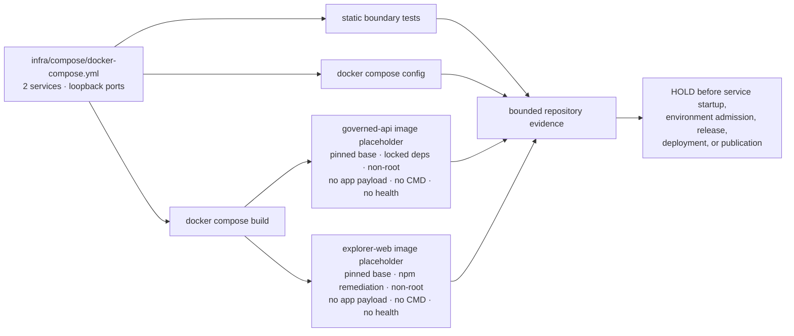
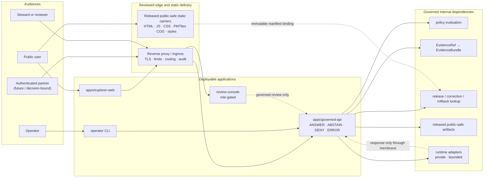

<!-- [KFM_META_BLOCK_V2]
doc_id: kfm://doc/architecture/deployment-topology
title: Deployment Topology — Current Repository Boundary and Readiness Map
type: architecture-reference
version: v2.0-draft
status: draft; repository-grounded; documentation-only; deployment-unverified; non-release; non-publication
owners:
  - "@bartytime4life — CODEOWNERS review route only"
  - "NEEDS VERIFICATION — accountable infrastructure, security, application, runtime, release, and operations stewardship"
created: 2026-05-14
updated: 2026-08-18
policy_label: public
owning_root: docs/
current_path: docs/architecture/deployment-topology.md
responsibility: Explain KFM's current repository-bounded deployment surfaces, intended governed traffic topology, readiness gates, exposure controls, and rollback obligations without becoming application, infrastructure, policy, release, deployment, or publication authority.
truth_posture: cite-or-abstain
evidence_snapshot:
  repository: bartytime4life/Kansas-Frontier-Matrix
  base_ref: main
  base_commit: 9edeb38d2273fdb43e9a31dfb63239223a364c2a
  prior_blob: 73ece039f0da4acf68843cb2dd6d20c6152df9e5
  directory_rules_blob: fd49a0b83e55cef52c1124281f093e263526898d
  directory_rules_decision: ADR-0029 accepted
  codeowners_blob: dd2a84aa514d8ecd9208bc347f90f9a2ed37dd61
  infra_readme_blob: 65237996bcbcd4ce5c4bfce0598de150bdf00fda
  compose_blob: 8a45891700a501f6e18a921ce8d260956441e4b3
  governed_api_dockerfile_blob: a84d9fb0eff8c8557645203f8ddb5e155398d329
  explorer_web_dockerfile_blob: c02f7fa3d3c5dafb3e758491fa20811d0ab5415d
  compose_static_test_blob: 7627d55ec83ec15e848f637522b907c0f55f5e9d
  compose_workflow_blob: a9b51526bbcf9bf80295cc8fd3a9188bcca97da2
  security_workflow_blob: d4bab2d2092f91afb99c0f0c3d769c163e9f1a45
  governed_api_architecture_blob: 06c5fd269fb8a326269f7f8ba98c6b8a75e0fd1a
  explorer_readme_blob: f8f37ed6e396a19ca080ea29b41920afdf03a94b
  release_state_register_blob: f576239f447045b04d7b30c540234d8641ceb7dc
  open_pull_requests_at_preflight: 0
related:
  - README.md
  - system-context.md
  - governed-api.md
  - map-shell.md
  - contract-schema-policy-split.md
  - ../doctrine/directory-rules.md
  - ../doctrine/trust-membrane.md
  - ../doctrine/lifecycle-law.md
  - ../adr/ADR-0029-adopt-directory-governance-standard-v2.md
  - ../security/README.md
  - ../runbooks/README.md
  - ../../infra/README.md
  - ../../infra/compose/README.md
  - ../../apps/governed-api/README.md
  - ../../apps/explorer-web/README.md
  - ../../runtime/README.md
  - ../../release/README.md
notes:
  - "Same-path architecture-document modernization only; no application, infrastructure, workflow, contract, schema, policy, data, release, deployment, publication, or repository-setting state changes."
  - "Current repository evidence replaces the prior no-mounted-repository posture and narrows every deployment claim to its verified scope."
  - "The current Compose and container surfaces are review placeholders. Their static, render, build, and scan paths do not establish service startup, application packaging, environment admission, release, deployment, or publication."
  - "Legacy section anchors are preserved."
[/KFM_META_BLOCK_V2] -->

<a id="top"></a>

# Deployment Topology — Current Repository Boundary and Readiness Map

> **Purpose.** Explain what KFM's repository currently proves about deployment-related surfaces, show the governed topology those surfaces must eventually realize, and keep the gap between buildable placeholders and an admitted operating environment explicit.

[](#2-truth-posture-for-this-document)
[](#1-purpose-and-scope)
[](#4-topology-overview)
[](#4-topology-overview)
[](#7-environments-and-promotion-of-deployment-artifacts)
[](#6-trust-membrane-and-traffic-rules)

| Field | Current evidence-bounded result |
|---|---|
| **Document role** | Cross-cutting explanatory architecture under `docs/architecture/`; not infrastructure configuration, application behavior, policy, release, or deployment authority. |
| **Evidence snapshot** | `main@9edeb38d2273fdb43e9a31dfb63239223a364c2a`. |
| **Directory authority** | Directory Rules v2 is adopted through [`ADR-0029`](../adr/ADR-0029-adopt-directory-governance-standard-v2.md). |
| **Path decision** | `PLACE` at the existing requested path; no move, alias, new root, or authority migration. |
| **Infrastructure root** | [`infra/`](../../infra/) is the confirmed canonical responsibility root for deployment mechanics, hosts, networks, service exposure, infrastructure-as-code, and hardening. |
| **Bounded executable evidence** | A two-service loopback-only Compose placeholder, two non-root security-review container placeholders, deterministic static boundary tests, a read-only render/build smoke workflow, and repository/container security scans. |
| **Application evidence** | Governed API has a small WSGI `ABSTAIN / NOT_IMPLEMENTED` scaffold; Explorer Web has a locked build/test workspace and bounded fixture-first projections. Neither is packaged by the current Dockerfiles or proved deployed. |
| **Runtime evidence** | `runtime/` is an internal canonical root with mixed implementation and no allowed direct public path; production composition remains unverified. |
| **Release evidence** | `release/` contains fixture-first validation surfaces, while operational assembly, promotion, rollback execution, and public parity remain held or unknown. The release-state register has no entries. |
| **Environment evidence** | No current inventory of running hosts, clusters, public endpoints, identity providers, secret stores, or production environments was verified in this change. |
| **Security posture** | Deny by default; no public RAW path, direct model path, canonical-store bypass, style-only protection, or admin shortcut in the normal public path. |
| **Publication effect** | None. A document, image build, scan, workflow, pull request, merge, or reachable process is not KFM release, deployment approval, or publication. |

> [!IMPORTANT]
> **The repository proves a bounded deployment-preparation slice, not a deployment.** The current Compose workflow renders configuration and builds two placeholder images without starting services. The current Dockerfiles intentionally omit application payloads and runtime commands. No production topology, endpoint, identity system, secret store, service health, release binding, or public availability is established here.

> [!CAUTION]
> **Do not collapse build, release, deploy, and publish.** A successful application build proves buildability. A container build proves image construction. A release decision authorizes a bounded immutable release. A deployment places identified release artifacts into an identified environment. Publication exposes a reviewed public-safe product through governed delivery. Each transition needs its own evidence.

> [!WARNING]
> **Direct exposure remains denied.** Browser-to-model, browser-to-runtime, browser-to-canonical-store, browser-to-RAW/WORK/QUARANTINE, and public-to-review/admin paths are defects unless a separately governed and role-bounded interface explicitly authorizes the operation.

**Quick navigation:** [Purpose](#1-purpose-and-scope) · [Truth and evidence](#2-truth-posture-for-this-document) · [Planes](#3-the-five-planes) · [Topology](#4-topology-overview) · [Component homes](#5-component-homes-by-responsibility-root) · [Traffic rules](#6-trust-membrane-and-traffic-rules) · [Environments](#7-environments-and-promotion-of-deployment-artifacts) · [Exposure](#8-exposure-controls-and-sensitivity-posture) · [Secrets and audit](#9-secrets-configs-audit) · [Rollback](#10-reversibility-and-rollback) · [Verification](#11-open-questions-and-verification-backlog) · [Related](#12-related-docs) · [Plane summary](#appendix-a--plane-responsibilities-summary) · [Evidence register](#appendix-b--current-bounded-evidence-register) · [Change history](#appendix-c--change-history)

---

<a id="1-purpose-and-scope"></a>

## 1. Purpose and scope

This page is the human-readable map of KFM deployment responsibilities and boundaries. It connects deployable applications, internal runtimes, infrastructure configuration, released artifacts, policy/evidence checks, security controls, observability, and rollback without taking ownership from any of them.

It answers four questions:

1. What deployment-related repository surfaces are **confirmed** now?
2. Which topology is merely **proposed** as the governed target?
3. Which evidence is required before a candidate can be called built, released, deployed, healthy, or public?
4. Which traffic paths and exposure patterns remain categorically denied?

### In scope

- The current repository-bounded deployment-preparation surface.
- Responsibility planes and their dependency direction.
- The current Compose, container, application, runtime, release, and security maturity boundary.
- The intended trust-membrane traffic shape.
- Minimum environment, deployment, health, observability, security, correction, and rollback evidence.
- Explicit holds and verification work before operational reliance.

### Out of scope

| Concern | Owning surface |
|---|---|
| Object meaning | `contracts/` |
| Machine-valid shape | `schemas/` |
| Allow, deny, restrict, redact, delay, or abstain rules | `policy/` plus governed review |
| Source identity, rights, terms, cadence, and sensitivity | governed source/registry and policy surfaces |
| Lifecycle instances, evidence, receipts, proofs, and published carriers | `data/` |
| Release, correction, withdrawal, rollback, promotion, and signature decisions | `release/` |
| Application implementation | `apps/` |
| Internal runtime composition | `runtime/` |
| Host, network, proxy, firewall, service manager, orchestrator, and IaC mechanics | `infra/` |
| Operational procedure and incident execution | `docs/runbooks/` |
| Human-readable security guidance | `docs/security/` |
| Repository automation and hosted checks | `.github/workflows/` |

### Directory Rules basis

The artifact kind is a human architecture explanation; its authority owner is `docs/`; its lifecycle stage is not applicable; its exposure is public; its mutability is versioned; and its retention is repository lifetime. Exactly one existing path satisfies that signature: `docs/architecture/deployment-topology.md`.

**Placement outcome:** `PLACE`. This update neither creates a deployment root nor moves infrastructure, runtime, release, policy, or data authority into documentation.

[Back to top](#top)

---

<a id="2-truth-posture-for-this-document"></a>

## 2. Truth posture for this document

### Truth labels

| Label | Meaning here |
|---|---|
| `CONFIRMED` | Verified from current repository bytes at the pinned snapshot, an accepted decision, a deterministic test, or a named generated/hosted result already recorded by its owning surface. |
| `PROPOSED` | A target architecture, environment class, readiness gate, or future behavior not established as current operation. |
| `UNKNOWN` | Evidence is insufficient to determine the answer. |
| `NEEDS VERIFICATION` | A concrete repository, environment, runtime, security, or operations check remains. |
| `CONFLICTED` | Current surfaces claim incompatible placement or responsibility and require a governed disposition. |
| `HOLD` | Graduation or exposure must stop until named evidence closes. |

`ANSWER`, `ABSTAIN`, `DENY`, and `ERROR` are runtime outcomes. `PASS`, `FAIL`, `NOT_RUN`, and `NOT_APPLICABLE` are validation outcomes. None substitutes for a truth label, review decision, release state, deployment state, or publication state.

### Current evidence basis

| Evidence | What it supports | What it does not prove |
|---|---|---|
| Accepted Directory Rules and ADR-0029 | `docs/` explanatory placement; `infra/` deployment/exposure ownership; separation of applications, runtime, data, policy, and release | That a particular environment exists or is safe |
| [`infra/README.md`](../../infra/README.md) and direct-child inventory | Canonical infrastructure root; nine standard lanes; current documentation-heavy and placeholder maturity; `infra/flora/` placement conflict | Applied firewall/proxy/VPN/systemd/Kubernetes/Terraform state |
| [`infra/compose/docker-compose.yml`](../../infra/compose/docker-compose.yml) | Two declared build services and loopback-only port mappings | Service startup, port listeners, health, API/UI behavior, or environment admission |
| Current Dockerfiles | Pinned bases, bounded security remediation, deterministic dependency installation, final non-root users | Application payloads, startup commands, health checks, runtime behavior, or deployability |
| [`tests/infra/test_compose_static.py`](../../tests/infra/test_compose_static.py) | Build-context resolution, non-root final users, loopback ports, and selected forbidden-mount/escape checks | Runtime isolation, policy enforcement, secrets safety, or operating-system hardening |
| [`infra-compose-smoke`](../../.github/workflows/infra-compose-smoke.yml) | Compose rendering and placeholder image builds without service start | A running stack, release, deployment, health, or publication |
| [`security.yml`](../../.github/workflows/security.yml) | Declared dependency review, repository scan, container scan, and Scorecard orchestration | Current green status, vulnerability absence, runtime security, or release approval |
| [`governed-api.md`](governed-api.md) and app bytes | WSGI scaffold and three GET routes returning finite negative envelopes | Substantive `ANSWER`, authentication, evidence/policy/release binding, or production service |
| [`apps/explorer-web/README.md`](../../apps/explorer-web/README.md) and package manifest | Locked build/test workspace, fail-closed default entrypoint, bounded fixture-first UI slices | Admitted renderer, live API transport, hosted application, or public product |
| [`runtime/README.md`](../../runtime/README.md) | Internal runtime boundary and no-direct-public-runtime rule | Accepted provider inventory, production isolation, model service health, or deployed composition |
| [`release/README.md`](../../release/README.md) and release register | Canonical release-decision root, fixture-first validation, operational holds, empty proposed register | Assembled approved release, promotion execution, rollback execution, or production parity |
| Current issue and PR searches | No open PR owned this exact path at preflight; security/runtime/release blockers remain tracked elsewhere | Universal absence of external work or future overlap |

### State separation

Do not compress these states into one word such as “ready”:

| State | Example evidence |
|---|---|
| Source present | A file or directory exists at a commit |
| Buildable | Locked build succeeds |
| Image-buildable | Container build succeeds |
| Startable | Process or container starts with a real command |
| Healthy | Declared health checks pass under a pinned environment |
| Integrated | Required service-to-service paths work and denied paths remain denied |
| Release candidate | Immutable candidate identity and prerequisites are assembled |
| Released | Authorized release decision binds approved artifacts |
| Deployed | A named environment runs the named released digests |
| Verified deployment | Post-deploy smoke, policy, health, observability, and rollback checks pass |
| Published | A reviewed public-safe product is exposed through governed delivery |
| Production parity | Deployed bytes/config/policy/release state match the approved records |

The current repository confirms the first two or three states for selected bounded surfaces. It does not establish the later states.

[Back to top](#top)

---

<a id="3-the-five-planes"></a>

## 3. The five planes

The five-plane model is an explanatory responsibility map, not a claim that five separately deployed services exist. A plane may span several roots, and one process may implement parts of more than one plane only when authority and dependency direction remain explicit.

| # | Responsibility plane | Owns | Current bounded repository posture |
|---:|---|---|---|
| 1 | **Governance and control** | Doctrine, accepted decisions, contracts, schemas, policy, registers, placement, review expectations | Broad tracked surface exists; adoption and maturity vary by object family |
| 2 | **Lifecycle and transformation** | Source edge, connectors, pipelines, RAW/WORK/QUARANTINE/PROCESSED movement, registries, receipts | Mixed fixture-first and planning maturity; no deployment claim |
| 3 | **Evidence, catalog, proof, and release** | Evidence resolution, proof/receipt closure, catalog projections, release/correction/rollback decisions, published carrier binding | Multiple bounded profiles exist; operational release remains held |
| 4 | **Governed service and internal runtime** | Executable trust membrane, finite response envelopes, internal runtime adapters, policy/evidence/release projection | Governed API is a negative WSGI scaffold; runtime is internal and mixed |
| 5 | **User interaction and delivery** | Explorer, Evidence Drawer, Focus Mode presentation, review UI, CLI, released static carriers | Explorer has bounded fixture-first slices and a fail-closed default; live integrated map deployment is unproved |

### Dependency direction

```text
governance / contracts / schemas / policy
                     |
                     v
source + lifecycle + evidence + release
                     |
                     v
governed service boundary
                     |
                     v
public and role-gated clients
```

Clients may submit bounded requests upward through approved interfaces. They may not acquire the authority of the planes they call. A browser click is not evidence resolution; an API response is not release approval; a worker success is not publication.

### Anti-collapse rules

- Governance text cannot substitute for executable enforcement.
- Schema conformance cannot substitute for admissibility.
- Evidence resolution cannot substitute for release.
- Release cannot substitute for deployment.
- Deployment cannot substitute for public-safe publication.
- Infrastructure reachability cannot substitute for authorization.
- A container image cannot substitute for an application.
- A health check cannot substitute for end-to-end trust closure.
- A map render cannot substitute for source or evidence authority.
- A model response cannot substitute for an `EvidenceBundle`.

[Back to top](#top)

---

<a id="4-topology-overview"></a>

## 4. Topology overview

### 4.1 CONFIRMED current repository-bounded topology

The current executable infrastructure slice ends at static validation and placeholder image construction:


```mermaid
flowchart LR
    C["infra/compose/docker-compose.yml<br/>2 services · loopback ports"] --> S["static boundary tests"]
    C --> R["docker compose config"]
    C --> B["docker compose build"]

    B --> GA["governed-api image placeholder<br/>pinned base · locked deps · non-root<br/>no app payload · no CMD · no health"]
    B --> EW["explorer-web image placeholder<br/>pinned base · npm remediation · non-root<br/>no app payload · no CMD · no health"]

    S --> E["bounded repository evidence"]
    R --> E
    GA --> E
    EW --> E

    E --> H["HOLD before service startup,<br/>environment admission, release,<br/>deployment, or publication"]
```

**Confirmed properties**

- `governed-api` declares `127.0.0.1:8080:8080`.
- `explorer-web` declares `127.0.0.1:5173:5173`.
- Both build from `infra/docker/`.
- Static tests require final non-root users and reject selected privileged, host-network, Docker-socket, sensitive data, proof, receipt, release, and secret references.
- The smoke workflow renders and builds; it does not run `docker compose up`.
- Security workflow definitions scan repository and container surfaces, but this page does not assert current run conclusions.

**Not established**

- Container commands or entrypoints.
- Application payloads in either image.
- Health checks, readiness checks, or service dependencies.
- Governed API WSGI startup inside the image.
- Explorer build output or static-server startup inside the image.
- API-to-Explorer transport.
- Proxy, TLS, authentication, authorization, CORS, CSP, rate limiting, or audit transport.
- Published artifacts, model runtimes, databases, caches, search, graph, object stores, or source connectors in Compose.
- Any running host, cluster, public endpoint, deployment, or publication.

### 4.2 Current application surfaces outside the placeholder images

| Surface | Confirmed application bytes | Deployment boundary |
|---|---|---|
| Governed API | Standard-library WSGI entrypoint; GET `/bootstrap`, `/layers`, `/evidence`; `ABSTAIN / NOT_IMPLEMENTED`; safe 404/405 errors | Not copied into the current image; no production server, auth, policy, evidence, release, or health integration |
| Explorer Web | Real Vite/TypeScript/Vitest/Playwright workspace; fail-closed default; fixture-first UI projections | Not copied into the current image; renderer admission, live transport, hosting, and public route remain held or unknown |
| Internal runtime | Canonical root with adapter, mock, Ollama, envelope, and service-config documentation/lanes | No direct public path; provider execution, isolation, health, receipts, and production composition unverified |
| Release plane | Fixture-first manifests, decisions, rollback/readiness checks, and workflow holds | No operational release assembly, deployment authorization, or live rollback execution |

This separation matters: repository application bytes can be real while deployment packaging remains a placeholder.

### 4.3 PROPOSED governed target topology

The target below is an architecture obligation, not current deployment evidence:


```mermaid
flowchart LR
    subgraph Audiences["Audiences"]
      PUB["Public user"]
      PARTNER["Authenticated partner<br/>(future / decision-bound)"]
      REVIEWER["Steward or reviewer"]
      OPERATOR["Operator"]
    end

    subgraph Edge["Reviewed edge and static delivery"]
      STATIC["Released public-safe static carriers<br/>HTML · JS · CSS · PMTiles · COG · styles"]
      INGRESS["Reverse proxy / ingress<br/>TLS · limits · routing · audit"]
    end

    subgraph Apps["Deployable applications"]
      EXPLORER["apps/explorer-web"]
      API["apps/governed-api<br/>ANSWER · ABSTAIN · DENY · ERROR"]
      REVIEW["review-console<br/>role-gated"]
      CLI["operator CLI"]
    end

    subgraph Trust["Governed internal dependencies"]
      POLICY["policy evaluation"]
      EVIDENCE["EvidenceRef → EvidenceBundle"]
      RELEASE["release / correction / rollback lookup"]
      PUBLISHED["released public-safe artifacts"]
      RUNTIME["runtime adapters<br/>private · bounded"]
    end

    PUB --> STATIC
    PUB --> EXPLORER
    PARTNER --> INGRESS
    REVIEWER --> INGRESS
    OPERATOR --> CLI

    EXPLORER --> INGRESS
    INGRESS --> API
    INGRESS --> REVIEW
    CLI --> API

    API --> POLICY
    API --> EVIDENCE
    API --> RELEASE
    API --> PUBLISHED
    API --> RUNTIME

    STATIC -. immutable manifest binding .-> RELEASE
    REVIEW -. governed review only .-> API
    RUNTIME -. response only through membrane .-> API
```

### 4.4 Forbidden edges

The following edges remain denied even when technically possible:

```text
public client  -X-> RAW / WORK / QUARANTINE / canonical stores
browser        -X-> model provider / local model runtime
browser        -X-> source credentials / internal service handles
MapLibre       -X-> source system or unreleased lifecycle store
worker         -X-> PUBLISHED or release approval
Compose        -X-> policy authority or source admission
static host    -X-> dynamic canonical truth
review console -X-> unaudited direct file or database mutation
admin surface  -X-> normal public route
CI             -X-> implicit release, deploy, or publication
```

A future topology may add databases, queues, caches, catalogs, object stores, search, graph, or model services. Each addition must preserve the same authority and traffic constraints rather than becoming a new shortcut.

[Back to top](#top)

---

<a id="5-component-homes-by-responsibility-root"></a>

## 5. Component homes by responsibility root

### 5.1 Applications — `apps/`

| Surface | Primary responsibility | Current posture | Deployment implication |
|---|---|---|---|
| `apps/governed-api/` | Executable public trust membrane and finite-outcome projection | Bounded WSGI negative scaffold | May be packaged only after a real command, health behavior, request limits, safe logging, and required evidence/policy/release bindings are defined |
| `apps/explorer-web/` | Browser composition and trust-visible UI | Build/test workspace plus bounded fixture-first slices; renderer and deployment held | May be statically hosted only with reviewed base URL/CSP/integrity/caching and released public-safe carriers; dynamic claims still use Governed API |
| `apps/review-console/` | Role-gated review and stewardship | Not re-audited in this documentation slice | Must remain separate from public access, use authenticated roles, and preserve audit/review semantics |
| `apps/workers/` | Background execution | Not re-audited here | Watcher-as-non-publisher; internal ingress/egress, retries, receipts, and kill switches required |
| `apps/cli/` | Operator and validation interface | Not re-audited here | Operator identity, environment targeting, no implicit release, and audit-safe output required |
| `apps/admin/` | Exceptional restricted administration | Not re-audited here | Must not become the normal public path; every shortcut needs justification, scope, logging, and rollback |

This page does not promote any proposed application decision or claim all listed surfaces are deployable.

### 5.2 Internal runtime — `runtime/`

`runtime/` owns internal adapter composition and provider-specific bindings. It is not an application ingress, secret store, data store, evidence authority, policy authority, or release plane.

Required deployment rules:

- Bind runtime services privately.
- Deny browser and public network access.
- Use an admitted provider-neutral interface.
- Enforce timeout, cancellation, request budget, egress/tool limits, and kill switch.
- Receive evidence/policy/release context from the governed caller.
- Return only through the governed application boundary.
- Emit minimized receipt/audit references without raw prompt, secret, restricted geometry, or full evidence payload leakage.
- Preserve `MockAdapter` or another deterministic fail-safe path for tests and controlled fallback.
- Treat provider health as operational state, never claim truth.

Current provider inventory, model admission, network posture, service health, and production isolation remain **NEEDS VERIFICATION**.

### 5.3 Infrastructure — `infra/`

Accepted Directory Rules make `infra/` the canonical owner of deployment mechanics and exposure posture.

| Lane | Responsibility | Current safe conclusion |
|---|---|---|
| `infra/docker/` | Container construction | Two security-review placeholders build; application packaging is absent |
| `infra/compose/` | Local/Compose orchestration | Two-service loopback placeholder; static/render/build checks only |
| `infra/reverse_proxy/` | Edge routing and proxy mechanics | Guidance lane exists; executable and applied public routing not established here |
| `infra/firewall/` | Host/network deny rules | Guidance lane exists; applied rules not established |
| `infra/vpn/` | Private access mechanics | Guidance lane exists; active VPN and identities not established |
| `infra/systemd/` | Host service management | Guidance lane exists; installed/enabled units and service health not established |
| `infra/kubernetes/` | Cluster orchestration | Guidance lane exists; selected cluster topology and applied manifests not established |
| `infra/terraform/` | Infrastructure-as-code | Guidance lane exists; plans, state, applies, and provider accounts not established |
| `infra/hardening/` | Hardening review and checklist | Review questions exist; environment-specific completion and executable aggregate gate are unproved |
| `infra/flora/` | Domain-named direct child | `CONFLICTED / NEEDS VERIFICATION`; not precedent for more domain infrastructure lanes |

Infrastructure files implement deployment consequences. They do not author policy, approve releases, or turn reachable bytes into public-safe claims.

### 5.4 Non-secret configuration — `configs/`

Tracked configuration may contain defaults, templates, feature declarations, and environment-variable names. It must not contain real credentials or private key material.

A deployment must resolve:

- configuration schema/version;
- source commit and config digest;
- environment class and scope;
- references to secret names, not secret values;
- allowed overrides and precedence;
- policy/release bundle identity where applicable;
- safe default when a value is missing;
- correction and rollback behavior;
- validation of unsupported or unknown keys.

A `.env.example` is documentation. A real `.env` is environment state and must not be committed.

### 5.5 Data, evidence, catalog, and published carriers — `data/`

Infrastructure may mount, copy, cache, or serve only the exact lifecycle classes required by the deployment.

| Data class | Normal public deployment |
|---|---|
| `RAW`, `WORK`, `QUARANTINE` | `DENY` |
| Canonical/internal processed records | `DENY` as direct client path |
| Receipts and proofs | Internal/reference-only unless a reviewed public-safe projection exists |
| Catalog/triplet projections | Governed API or released public-safe projection only |
| `PUBLISHED` carriers | Allowed only when release identity, digest, rights, sensitivity, correction, and rollback obligations close |
| Registry/source descriptors | Governed projection only; no credential or restricted term leakage |
| Cache/index/vector/graph derivatives | Rebuildable internal or released projection; never sovereign truth |

A mounted directory, database table, bucket, CDN object, or tile archive does not become released because infrastructure can reach it.

### 5.6 Release decisions — `release/`

`release/` owns append-only decision records. It does not own payload bytes, container registry contents, deployment state, or public endpoint state.

A deployment candidate should reference, as applicable:

- immutable release/candidate ID;
- application image digest or static artifact digest;
- configuration and policy bundle identities;
- public-safe data/layer/style/carrier manifests;
- evidence/proof/receipt references;
- review and finite decision state;
- correction/withdrawal references;
- rollback target and invalidation plan.

The current release-state register is `PROPOSED` and empty. Do not treat it as proof that no external deployment exists; treat it as proof that this tracked register does not currently record one.

### 5.7 Repository automation — `.github/workflows/`

Workflows may build, scan, validate, rehearse, retain artifacts, and report finite outcomes. They must not silently:

- start a public deployment from ordinary validation;
- promote lifecycle state;
- activate a source;
- author policy or release authority;
- bypass review;
- expose secrets to untrusted events;
- publish candidate data;
- convert a successful scan into vulnerability-absence language.

Any future deployment workflow needs explicit event trust, permissions, environment protection, immutable inputs, artifact identity, approval boundary, receipt, post-deploy verification, correction, and rollback behavior.

[Back to top](#top)

---

<a id="6-trust-membrane-and-traffic-rules"></a>

## 6. Trust membrane and traffic rules

The trust membrane is a system rule. `apps/governed-api/` is its current executable scaffold; static released artifacts may complement it, but no second ungoverned dynamic truth path is allowed.

| # | Required rule | Failure posture |
|---:|---|---|
| 1 | Public and normal semi-public clients never read RAW, WORK, QUARANTINE, unpublished candidates, or canonical/internal stores. | `DENY`; investigate exposure |
| 2 | Browser and map clients never call model/provider runtimes directly. | `DENY`; route through governed service |
| 3 | Claim-bearing `ANSWER` requires resolvable evidence plus policy, review, release, freshness, precision, correction, and citation support appropriate to consequence. | `ABSTAIN`, `DENY`, or `ERROR` |
| 4 | Public static carriers are immutable, digest-bound, manifest-bound, and already public-safe. | Hold or withdraw carrier |
| 5 | Sensitive geometry is generalized, redacted, delayed, restricted, or denied before public artifact generation. | `DENY`; client styling is not protection |
| 6 | Popups and feature properties remain previews; material claim detail uses a governed Evidence Drawer payload. | `ABSTAIN` or narrowed preview |
| 7 | Exports preserve release ID, citations, scope, time, transformations, and correction state. | Deny uncited/unbound export |
| 8 | Review/admin surfaces are separately routed, authenticated, least-privilege, and audited. | `DENY` public path |
| 9 | Workers and watchers emit candidates, receipts, and diagnostics; they do not approve release or write PUBLISHED state. | Hold and record boundary failure |
| 10 | Errors do not disclose stack traces, filesystem paths, credentials, raw evidence, blocked coordinates, adapter internals, or sensitive reason detail. | Safe `ERROR` reference only |
| 11 | Telemetry is minimized and separately governed; it cannot become evidence or a hidden sensitive-data channel. | Drop/redact/deny telemetry |
| 12 | A fail-open dependency, unavailable policy engine, stale release lookup, or ambiguous correction state cannot produce substantive success. | `ABSTAIN`, `DENY`, or `ERROR` |

### Runtime envelope boundary

Every trust-bearing dynamic response resolves to exactly one top-level outcome:

| Outcome | Deployment interpretation |
|---|---|
| `ANSWER` | The deployed service completed the required governed checks and can return a bounded substantive projection. |
| `ABSTAIN` | Evidence, freshness, scope, or support is insufficient for a substantive result. |
| `DENY` | Policy, rights, sensitivity, role, release, or exposure posture forbids disclosure. |
| `ERROR` | Application, adapter, validation, policy, evidence, release, or infrastructure failure prevents a reliable result. |

A liveness endpoint may use ordinary operational status codes, but it must not imply that claim-bearing dependencies, release state, or public policy closure are healthy unless the endpoint explicitly measures them.

### Static delivery boundary

A static edge may serve Explorer assets and already released public-safe carriers without proxying every byte through the dynamic API. That exception is narrow:

- asset identity and release binding are immutable;
- the edge cannot query canonical stores;
- unreviewed files cannot appear through directory listing or permissive origin access;
- cache keys preserve release identity;
- withdrawal and invalidation are testable;
- cross-origin and content-type behavior are reviewed;
- sensitive artifacts are absent, not merely hidden;
- dynamic claim resolution still transits the governed service.

[Back to top](#top)

---

<a id="7-environments-and-promotion-of-deployment-artifacts"></a>

## 7. Environments and promotion of deployment artifacts

### 7.1 Current environment evidence

No authoritative tracked environment inventory, running host list, cluster list, public endpoint list, identity-provider binding, secret-store inventory, or production deployment record was verified in this update.

The current Compose file is a **local development placeholder**, not evidence of a `local`, `dev`, `staging`, or `production` environment.

### 7.2 Illustrative environment classes — PROPOSED, not current fact

A future project may use different names or fewer environments. Whatever the names, the security and release properties must be explicit.

| Illustrative class | Purpose | Minimum exposure posture |
|---|---|---|
| Developer-local | Deterministic build/test loop, mocks, synthetic/public-safe fixtures | Loopback/private only; no live source or public trust claim |
| Integration | Cross-component rehearsal with pinned internal dependencies | Private; no public crawl; test identity and secret isolation |
| Release rehearsal | Production-shape validation of an immutable candidate | Staged access; production-like policy, manifests, health, rollback |
| Public production | Approved public/semi-public service and released carriers | Deny by default; protected admin/review paths; full audit/correction/rollback |

An environment name grants no maturity. A folder named `production`, a cloud account, a Kubernetes namespace, or a GitHub environment is metadata until the required evidence exists.

### 7.3 Minimum environment record

Before relying on any environment, record at least:

| Field group | Required evidence |
|---|---|
| Identity | Stable environment ID, class, owner route, purpose, region/jurisdiction where material |
| Source state | Repository commit, application artifact/image digests, config digest, schema and policy bundle versions |
| Release binding | Release/candidate ID, manifest refs, public-safe carrier digests, correction/rollback target |
| Network | Ingress/egress map, DNS, TLS identity, bound interfaces, proxy/firewall/VPN policy, private services |
| Identity and access | Authentication method, authorization roles, service identities, admin/review separation |
| Secrets | Secret-store identity, reference names, rotation/revocation posture, no secret values in records |
| Data | Allowed lifecycle mounts/stores, encryption posture, retention, backup/restore, prohibited data classes |
| Health | Startup, readiness, dependency, release-parity, and public-path checks with finite failure behavior |
| Security | Image/SBOM/attestation identity, vulnerability and misconfiguration review, exception record |
| Observability | Logs, metrics, traces, alerts, retention, redaction, correlation IDs, ownership |
| Operations | Runbook, incident handoff, maintenance window, capacity assumptions, kill switch |
| Reversibility | Last-known-good target, rollback command/procedure, data/cache invalidation, verification after reversal |

### 7.4 Deployment-readiness gates

The following are architecture gates, not an accepted canonical gate vocabulary. A future contract or policy may name them differently.

1. **Application package closure** — real payload, pinned build, non-root execution where applicable, explicit command/entrypoint, health behavior, and deterministic artifact identity.
2. **Infrastructure render closure** — valid configuration, least privilege, safe mounts, resource limits, restart behavior, no privileged escape, reviewed network paths.
3. **Security and supply-chain closure** — pinned dependencies/actions/bases, SBOM/attestation where required, current scans, license posture, exception handling.
4. **Trust-dependency closure** — evidence, policy, release, correction, runtime, and public-safe carrier dependencies are reachable only through approved paths.
5. **Environment and access closure** — DNS/TLS/ingress/auth/roles/secrets/audit are bound to named reviewed identities.
6. **Operational rehearsal closure** — service startup, health, negative paths, dependency failure, kill switch, backup/restore, and rollback are exercised.
7. **Release binding closure** — immutable release/candidate identity, review state, public-safe artifacts, correction path, rollback target, and deployment authorization align.
8. **Post-deploy verification** — running digests/config/policy match the approved record, denied paths remain denied, observability works, and public claims preserve evidence/correction context.

A missing gate produces `HOLD`, not optimistic deployment language.

### 7.5 Transition vocabulary

Keep these transitions distinct:

```text
source committed
  -> build validated
  -> artifact/image produced
  -> security reviewed
  -> release candidate assembled
  -> release decision approved
  -> deployment authorized
  -> environment changed
  -> post-deploy verified
  -> public exposure confirmed
```

A pull request normally stops before release or deployment. A release may exist without being deployed. A deployment may exist without public publication. A public endpoint may be reachable while still unauthorized or unhealthy.

[Back to top](#top)

---

<a id="8-exposure-controls-and-sensitivity-posture"></a>

## 8. Exposure controls and sensitivity posture

### 8.1 Fail-closed classes

The deployment boundary must assume higher consequence when material includes:

- exact rare-species, rare-plant, habitat, nesting, roosting, or denning locations;
- archaeology, burial, sacred, cultural, paleontological, or collection-site locations;
- living-person, genealogy, health, biometric, DNA, genomic, identity-linkage, or person-parcel data;
- critical infrastructure, utility, transport, emergency, facility, or operational vulnerability detail;
- private-land, well, ownership, occupancy, title, stewardship, or access information;
- source-restricted, licensed, embargoed, consent-bound, sovereign, community-controlled, or unpublished material;
- geometry, time, labels, graph edges, counts, or context that enable reconstruction through composition.

### 8.2 Exposure matrix

| Surface | Default posture | Required proof before widening |
|---|---|---|
| Public dynamic API | Deny by default; finite envelopes | Route contract, auth posture, evidence/policy/release binding, negative tests, safe errors |
| Public static assets | Released public-safe artifacts only | Digest/manifest, rights/sensitivity review, cache withdrawal, content-type/CORS/CSP review |
| Review console | Restricted | Role mapping, least privilege, audit, no public route, safe export |
| Admin surface | Strongly restricted / exceptional | Named need, separate route, MFA/identity decision, audit, kill switch, non-normal public path |
| Model/runtime endpoint | Internal only | Governed caller, private binding, tool/egress limits, no browser path |
| Database/object/graph/vector store | Internal only | Service identity, encryption, allowed lifecycle classes, backup/restore, no public query |
| Logs/metrics/traces | Internal and minimized | Redaction, retention, access, no raw evidence/secrets/reconstructable geometry |
| Download/export | Deny until governed | Release/citation/transform binding, rate/size limits, correction/withdrawal behavior |
| Tiles/PMTiles/COG/3D assets | Released public-safe only | Manifest, source/license, precision transform, integrity, rollback/cache invalidation |

### 8.3 Defense in depth

A public-safe outcome should not depend on one control. Use multiple layers where consequence warrants:

- upstream source/admission restrictions;
- canonical policy and review;
- server-side redaction/generalization/aggregation;
- released derivative rather than restricted input;
- private storage and service identities;
- ingress/authorization limits;
- safe response schema;
- cache/object ACLs;
- export restrictions;
- monitoring and correction/withdrawal;
- tested rollback.

Client-side filters, zoom thresholds, hidden properties, disabled buttons, or undocumented URLs are never sufficient access control.

### 8.4 Exposed local systems

A home-lab or single-host topology is not exempt from KFM trust requirements. Before any non-loopback exposure, verify:

- intended audience and public/private classification;
- router/firewall/NAT state;
- TLS and hostname ownership;
- reverse-proxy route allowlist;
- authentication and role posture;
- CORS, CSP, framing, cache, and content-sniffing headers;
- rate, payload, timeout, and connection limits;
- direct model/internal-store denial;
- secret-store and file-permission posture;
- logging without sensitive payloads;
- dependency and image scan state;
- patch/update plan;
- incident and rollback route.

Unknown posture remains private or loopback-only.

[Back to top](#top)

---

<a id="9-secrets-configs-audit"></a>

## 9. Secrets, configs, audit

### 9.1 Secrets

- Never commit secret values, tokens, private keys, signed URLs, production certificates, or real `.env` files.
- Track only secret reference names and non-sensitive configuration.
- Scope service identities to the smallest required resources.
- Separate application, worker, review, admin, deployment, and CI identities.
- Define rotation, revocation, break-glass, and compromise response before public operation.
- Avoid passing secrets through command lines, build args, client bundles, logs, artifacts, cache keys, or pull-request output.
- Treat accidental exposure as an incident: contain, rotate/revoke, audit use, correct dependent artifacts, and preserve the public-safe record.

The actual secret-store product, identities, rotation cadence, and recovery process are **NEEDS VERIFICATION**.

### 9.2 Configuration

Configuration must be:

- versioned or otherwise identity-bound;
- schema-validated where consequence warrants;
- environment-scoped without silently changing semantic behavior;
- explicit about defaults and missing-value failure;
- separate from policy meaning;
- separate from secret values;
- bound to the deployment record;
- reversible to a known predecessor.

A deployment must not accept an unknown configuration key and silently continue when that key affects exposure, policy, source access, evidence, release, logging, or rollback.

### 9.3 Audit events

At minimum, material environments should make these events inspectable without exposing protected payloads:

| Event | Minimum safe record |
|---|---|
| Deployment start/finish/failure | actor or workflow identity, environment, candidate/release, artifact/config digests, outcome |
| Service startup/shutdown/restart | service identity, version/digest, reason, outcome |
| Policy decision | request correlation, policy/bundle identity, finite result, safe reason code |
| Evidence resolution | correlation, reference identity, resolved/unresolved/denied/error posture, no raw payload |
| Release/correction/withdrawal/rollback | decision/ref identities, affected artifacts, actor/reviewer, outcome |
| Admin/review action | authenticated actor, bounded action, object reference, outcome |
| Secret rotation/revocation | secret reference, actor/process, time, outcome; never value |
| Export/download | caller class, released object, scope, outcome, receipt/audit ref |
| Security control failure | component, safe reason, containment, incident reference |

### 9.4 Telemetry minimization

Logs, metrics, traces, profiles, crash dumps, browser reports, and screenshots must not contain:

- raw evidence payloads;
- full prompts or model responses when restricted;
- credentials or authorization headers;
- exact sensitive coordinates;
- private person/parcel/DNA identifiers;
- full `EvidenceBundle` copies;
- source-restricted content;
- internal filesystem paths where unnecessary;
- detailed denial reasons that enable reconstruction or attack.

Use stable safe correlation IDs and references to restricted records.

### 9.5 Current security and quality signals

| Signal | Current bounded role | Claim limit |
|---|---|---|
| Compose static tests | Deterministic no-network boundary checks | Not runtime or deployment proof |
| Compose render/build workflow | Configuration and placeholder image construction | Services not started |
| Repository/container Trivy scans | HIGH/CRITICAL repository and image review path | Current run and vulnerability absence not asserted here |
| Dependency review | New PR dependency-diff review | Does not cover every transitive/runtime/environment risk |
| CodeQL and dependency-scan companions | Declared code/dependency review lanes | Exact current results require run evidence |
| OpenSSF Scorecard | Default-branch supply-chain posture signal | Not application or environment security proof |
| Explorer build/unit/browser checks | Bounded app build and fixture-first UI behavior | Not live transport, renderer admission, or deployment |
| Governed API tests | Negative-envelope scaffold behavior | Not substantive public service |

Deployment readiness needs all applicable signals plus measured environment evidence; no single green check closes the trust chain.

[Back to top](#top)

---

<a id="10-reversibility-and-rollback"></a>

## 10. Reversibility and rollback

Reversibility has two separate scopes: this documentation change and any future operational deployment.

### 10.1 This documentation change

Before merge, rollback is closing the draft pull request and deleting its scoped branch when authorized. After an authorized merge, rollback is a focused revert of this single Markdown file. No application, infrastructure, data, policy, runtime, release, cache, deployment, or public artifact restoration is required.

### 10.2 Future deployment rollback

A deployment rollback is not merely “redeploy the old image.” It must identify and verify the entire affected state.

| Concern | Minimum rollback binding |
|---|---|
| Application | Last-known-good immutable image/static artifact digest |
| Configuration | Compatible predecessor config and secret-reference set |
| Policy | Last approved policy bundle; fail closed if compatibility is ambiguous |
| Schema/data | Compatibility decision, forward-only rationale where applicable, backup/restore or migration plan |
| Released carriers | Prior manifest/digest plus CDN/object/cache invalidation |
| API/UI | Contract compatibility and negative-state behavior during mixed versions |
| Runtime adapter | Admitted predecessor or deterministic disabled/mock posture |
| Identity/access | Role and service-identity compatibility |
| Observability | Rollback event, verification results, and residual risk |
| Public claim | Correction/withdrawal/supersession notice and derivative invalidation when meaning changed |

### 10.3 Rollback procedure contract

A credible rollback plan states:

1. trigger and authorized initiator;
2. exact source and target identities;
3. preconditions and incompatible states;
4. command or human procedure;
5. expected service/data/cache impact;
6. safe failure posture;
7. post-rollback health and trust checks;
8. correction/withdrawal/public notice obligations;
9. evidence and receipt location;
10. forward-fix or re-release path.

“Rollback supported” without an exercised target and verification is **NEEDS VERIFICATION**.

### 10.4 Correction, withdrawal, and cache invalidation

When a public claim or carrier is materially affected:

- preserve the prior record;
- issue or link the governed correction/withdrawal state;
- invalidate or supersede API, static, tile, search, graph, AI, export, story, screenshot, and cache derivatives as applicable;
- keep clients from silently mixing corrected and uncorrected release identities;
- verify that stale carriers fail safely;
- record the new rollback target.

### 10.5 Disaster recovery and continuity

Production reliance also requires evidence for backup, restore, rebuild-from-source, dependency outage, secret-store outage, policy-service outage, source withdrawal, object-store corruption, and operator unavailability. None is established by the current Compose placeholder.

[Back to top](#top)

---

<a id="11-open-questions-and-verification-backlog"></a>

## 11. Open questions and verification backlog

### 11.1 Verification register

| Priority | Item | Current status | Evidence required before reliance |
|---:|---|---|---|
| P0 | Accountable infrastructure, security, operations, release, and incident roles | `NEEDS VERIFICATION` | Named/approved role assignments; CODEOWNERS remains routing only |
| P0 | Selected deployment topology and environment inventory | `UNKNOWN` | Commit-pinned environment records, hosts/clusters/endpoints, ownership, purpose |
| P0 | Application-bearing images | `HOLD` | Real payloads, explicit commands, health behavior, deterministic build, non-root/runtime permissions |
| P0 | Service startup and integration | `NOT RUN / HOLD` | Compose or equivalent startup, API/UI connection, dependency failures, denied-path tests |
| P0 | Public ingress and identity | `UNKNOWN` | DNS/TLS, reverse proxy, firewall, VPN/private path, authentication, authorization, admin/review separation |
| P0 | Secret store and rotation | `UNKNOWN` | Selected store, service identities, references, rotation/revocation, incident procedure |
| P0 | Release-to-deployment authority | `HOLD` | Accepted candidate/release binding, deployment decision, artifact/config/policy digests, reviewer authority |
| P0 | Rollback and correction execution | `HOLD` | Exercised rollback target, cache/derivative invalidation, post-rollback verification |
| P0 | Incident guidance ↔ restricted runbook handoff | `HOLD` | Resolve issue [#2900](https://github.com/bartytime4life/Kansas-Frontier-Matrix/issues/2900) without exposing restricted procedure |
| P1 | Governed API substantive vertical slice | `PARTIAL / HOLD` | Evidence, policy, citation, release, freshness, correction, safe-error fixtures and tests |
| P1 | EvidenceRef-to-EvidenceBundle governed resolver | `OPEN / HOLD / NEEDS VERIFICATION` | Resolve issue [#2975](https://github.com/bartytime4life/Kansas-Frontier-Matrix/issues/2975); no direct store shortcut |
| P1 | Explorer live transport and renderer admission | `HOLD` | Accepted boundary, pinned dependency, current browser/runtime probe packet, CSP/worker/PMTiles/selection evidence |
| P1 | MapLibre architecture and runtime decisions | `HOLD` | Resolve [#2957](https://github.com/bartytime4life/Kansas-Frontier-Matrix/issues/2957) and execute [#2906](https://github.com/bartytime4life/Kansas-Frontier-Matrix/issues/2906) separately |
| P1 | Reverse proxy/firewall/VPN executable posture | `NEEDS VERIFICATION` | Config payloads, static validation, applied-state evidence, negative reachability tests |
| P1 | CSP, CORS, cache, rate, payload, timeout, and error headers | `UNKNOWN` | Route- and asset-specific test packet at a named environment |
| P1 | Security workflow exact-head outcomes and required-check coupling | `NEEDS VERIFICATION` | Current hosted runs and repository ruleset evidence |
| P1 | SBOM, signature, provenance, and registry binding | `NEEDS VERIFICATION` | Toolchain pins, generated objects, verification, storage, correction/rollback behavior |
| P1 | Observability and safe telemetry | `UNKNOWN` | Metrics/logs/traces design, redaction tests, retention, ownership, dashboards/alerts |
| P1 | Backup, restore, and rebuild | `UNKNOWN` | Measured restore/rebuild drill and recovery objectives |
| P2 | Kubernetes adoption | `UNKNOWN / NOT SELECTED` | Decision, manifests, security context, network policy, secret integration, cluster evidence |
| P2 | Terraform adoption | `UNKNOWN / NOT SELECTED` | Provider/state/backend decision, plans, applies, drift detection, rollback/recovery |
| P2 | Systemd/single-host adoption | `UNKNOWN / NOT SELECTED` | Units, sandboxing, users, file permissions, restart/health, host evidence |
| P2 | Capacity and performance budgets | `NEEDS VERIFICATION` | API latency/error, tile/static delivery, browser, memory, load, long-session results |
| P2 | Multi-region/high availability/disaster recovery | `UNKNOWN / NOT JUSTIFIED` | Consequence/cost analysis, RTO/RPO, failure-domain rehearsal |
| P2 | `infra/flora/` disposition | `CONFLICTED` | Object-by-object placement decision; no new domain infra precedent |

### 11.2 Deployment HOLD conditions

Do not describe an environment as production-ready, deployed, released, or published while any applicable condition remains:

- image lacks real application payload or runtime command;
- service startup or health was not exercised;
- environment identity or running digests are unknown;
- public ingress, auth, secret, or admin/review boundaries are unresolved;
- evidence/policy/release/correction dependencies are absent or fail open;
- source rights or sensitive geometry posture is unknown;
- required security finding lacks disposition;
- rollback target or post-rollback verification is missing;
- incident ownership and private handoff are unresolved;
- public/static carriers are not manifest- and release-bound;
- public clients can reach internal stores or runtime providers;
- observability leaks protected content or cannot diagnose safe failure;
- a check was skipped, vacuous, or run against a different revision.

### 11.3 Minimum graduation packet

A review-ready deployment proposal should include:

- exact repository and release/candidate refs;
- changed application, runtime, config, infra, policy, data, release, and docs paths;
- topology and trust-boundary diagrams;
- threat/exposure preflight;
- immutable artifact and config identities;
- environment and access record;
- startup, health, negative-path, integration, and browser/API tests;
- security/supply-chain results and exceptions;
- evidence/policy/release/correction bindings;
- observability and incident handoff;
- rollback/restore drill;
- introduced, inherited, and external failures;
- explicit non-effects and public exposure decision.

This page is not that packet.

[Back to top](#top)

---

<a id="12-related-docs"></a>

## 12. Related docs

### Governing and explanatory documents

- [`docs/doctrine/directory-rules.md`](../doctrine/directory-rules.md) — adopted placement and authority boundaries.
- [`ADR-0029`](../adr/ADR-0029-adopt-directory-governance-standard-v2.md) — adoption record for Directory Rules v2.
- [`docs/doctrine/trust-membrane.md`](../doctrine/trust-membrane.md) — public-path invariant.
- [`docs/doctrine/lifecycle-law.md`](../doctrine/lifecycle-law.md) — lifecycle and promotion separation.
- [`docs/architecture/README.md`](README.md) — architecture lane contract.
- [`docs/architecture/system-context.md`](system-context.md) — outer system context.
- [`docs/architecture/governed-api.md`](governed-api.md) — current executable membrane scaffold and next gates.
- [`docs/architecture/map-shell.md`](map-shell.md) — browser/renderer boundary.
- [`docs/architecture/contract-schema-policy-split.md`](contract-schema-policy-split.md) — meaning, shape, admissibility, and proof separation.

### Current repository implementation and operations surfaces

- [`infra/README.md`](../../infra/README.md) — canonical infrastructure root and bounded maturity.
- [`infra/compose/README.md`](../../infra/compose/README.md) — current Compose lane contract.
- [`infra/compose/docker-compose.yml`](../../infra/compose/docker-compose.yml) — two-service loopback placeholder.
- [`infra/docker/Dockerfile.governed-api`](../../infra/docker/Dockerfile.governed-api) — governed-api security-review image placeholder.
- [`infra/docker/Dockerfile.explorer-web`](../../infra/docker/Dockerfile.explorer-web) — Explorer security-review image placeholder.
- [`apps/governed-api/README.md`](../../apps/governed-api/README.md) — application boundary.
- [`apps/explorer-web/README.md`](../../apps/explorer-web/README.md) — current bounded browser-shell maturity.
- [`runtime/README.md`](../../runtime/README.md) — internal runtime composition boundary.
- [`release/README.md`](../../release/README.md) — release-decision plane and operational holds.
- [`control_plane/release_state_register.yaml`](../../control_plane/release_state_register.yaml) — proposed empty release-state projection.
- [`docs/security/README.md`](../security/README.md) — security guidance and unresolved operational ownership.
- [`docs/runbooks/README.md`](../runbooks/README.md) — operational-procedure lane.

### Current validation and security surfaces

- [`tests/infra/test_compose_static.py`](../../tests/infra/test_compose_static.py) — deterministic Compose boundary checks.
- [`.github/workflows/infra-compose-smoke.yml`](../../.github/workflows/infra-compose-smoke.yml) — read-only render/build smoke without service start.
- [`.github/workflows/security.yml`](../../.github/workflows/security.yml) — repository, dependency, container, and Scorecard checks.
- [`.github/workflows/codeql.yml`](../../.github/workflows/codeql.yml) — CodeQL companion.
- [`.github/workflows/dependency-scan.yml`](../../.github/workflows/dependency-scan.yml) — dependency-audit companion.
- [`.github/CODEOWNERS`](../../.github/CODEOWNERS) — review routing only.

[Back to top](#top)

---

<a id="appendix-a--plane-responsibilities-summary"></a>

## Appendix A — Plane responsibilities, summary

| Plane | Primary roots | Representative objects/surfaces | Current safe conclusion |
|---|---|---|---|
| Governance/control | `docs/`, `control_plane/`, `contracts/`, `schemas/`, `policy/`, `docs/adr/` | Doctrine, ADR, SourceDescriptor meaning/shape, PolicyDecision, ReviewRecord | Broad repository surface; acceptance and enforcement vary |
| Lifecycle/transformation | `connectors/`, `pipelines/`, `pipeline_specs/`, `data/`, `migrations/`, workers | Source events, DatasetVersion, ValidationReport, RunReceipt, lifecycle data | Mixed maturity; watcher-as-non-publisher |
| Evidence/catalog/release | evidence packages, `data/proofs/`, `data/receipts/`, `data/catalog/`, `data/published/`, `release/` | EvidenceRef, EvidenceBundle, manifests, correction, rollback | Fixture-first progress; operational release held |
| Governed service/runtime | `apps/governed-api/`, `runtime/` | RuntimeResponseEnvelope, internal adapters, finite outcomes | Negative API scaffold; internal runtime deployment unverified |
| User interaction/delivery | `apps/explorer-web/`, review/CLI surfaces, UI/map packages, released static carriers | Evidence Drawer, layer/story/focus projections, exports | Bounded slices; integrated deployed product unproved |
| Infrastructure host/exposure | `infra/`, `configs/`, external environment state | Images, Compose, proxy, firewall, VPN, systemd, cluster, Terraform, hardening | Canonical root confirmed; executable evidence bounded to placeholders and smoke checks |

### Cross-plane invariant

No downstream plane upgrades the authority of an upstream object. Infrastructure can host an application, but it cannot make the application's response true. An API can expose a release, but it cannot approve that release. A UI can visualize evidence, but it cannot create evidence. A model can interpret a bundle, but it cannot become the bundle.

[Back to top](#top)

---

<a id="appendix-b--current-bounded-evidence-register"></a>

## Appendix B — Current bounded evidence register

| Evidence ID | Repository surface | Bounded result | Explicit non-proof |
|---|---|---|---|
| DT-E01 | `infra/` root and README | Canonical deployment/exposure responsibility root; standard child lanes present | No applied environment |
| DT-E02 | Compose placeholder | Two loopback-bound service build declarations | No startup or integration |
| DT-E03 | Governed API Dockerfile | Pinned base, locked hashed requirements, non-root user | No application payload, command, health, or deployment |
| DT-E04 | Explorer Dockerfile | Pinned base, dependency remediation, non-root user | No application payload, command, health, or deployment |
| DT-E05 | Compose static tests | Context, Dockerfile, non-root, loopback, selected forbidden-token checks | No runtime, firewall, auth, policy, or release proof |
| DT-E06 | Compose smoke workflow | Static tests, Compose render, placeholder image build; no service start | No operating stack |
| DT-E07 | Security workflow | Declared dependency/repository/container/Scorecard review graph | No current conclusion or vulnerability absence |
| DT-E08 | Governed API scaffold | WSGI, three GET routes, finite `ABSTAIN / NOT_IMPLEMENTED`, safe 404/405 | No substantive trust-bearing service |
| DT-E09 | Explorer Web | Locked build/test lane, fail-closed default, fixture-first projections | No renderer admission, live transport, host, or publication |
| DT-E10 | Runtime root | Canonical internal boundary; no direct public runtime path | No production provider/runtime readiness |
| DT-E11 | Release root | Fixture-first release/rollback/alias/policy checks with explicit operational holds | No release, deployment, rollback execution, or publication |
| DT-E12 | Release-state register | Proposed metadata shape with zero entries | No proof of external absence or production state |

[Back to top](#top)

---

<a id="appendix-c--change-history"></a>

## Appendix C — Change history

| Version | Date | Change |
|---|---|---|
| `v1` | 2026-05-14 | Initial doctrine-heavy five-plane deployment draft prepared without current repository evidence. |
| `v2.0-draft` | 2026-08-18 | Same-path repository-grounded rewrite: records the bounded Compose/container/API/Explorer/runtime/release/security state, separates current topology from the governed target, adds readiness and environment evidence contracts, preserves legacy anchors, and removes unsupported deployment maturity claims. |

### Correction and rollback note

This document should be corrected whenever current repository or environment evidence invalidates a material state claim. Preserve the evidence snapshot and change history; do not silently turn a proposed topology into implemented fact. A future behavior change should update the owning application, infrastructure, runtime, release, security, and runbook surfaces in the same dependency-closed review packet or state why a companion update is not applicable.

---

<sub>Evidence basis: current repository bytes at `main@9edeb38d2273fdb43e9a31dfb63239223a364c2a`; accepted Directory Rules through ADR-0029; current infrastructure, Compose, Dockerfile, application, runtime, release, and workflow surfaces. This page creates no release, deployment, public endpoint, environment, or publication authority.</sub>

**Last updated:** `2026-08-18` · **Status:** `draft / repository-grounded` · [Back to top](#top)
