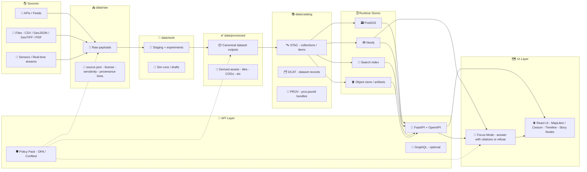
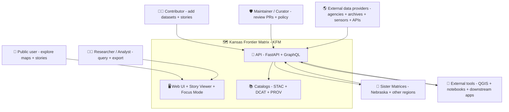
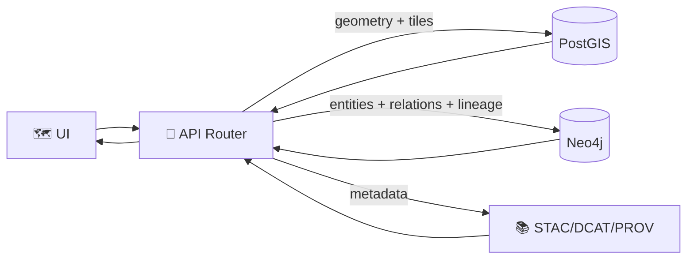
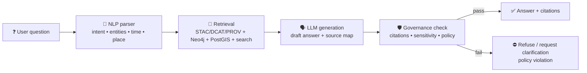
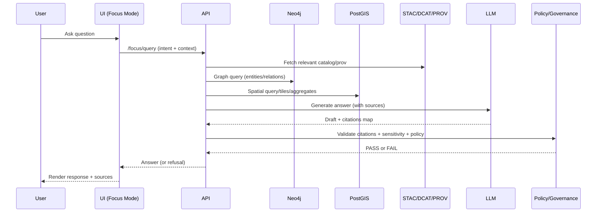
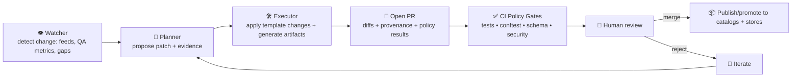
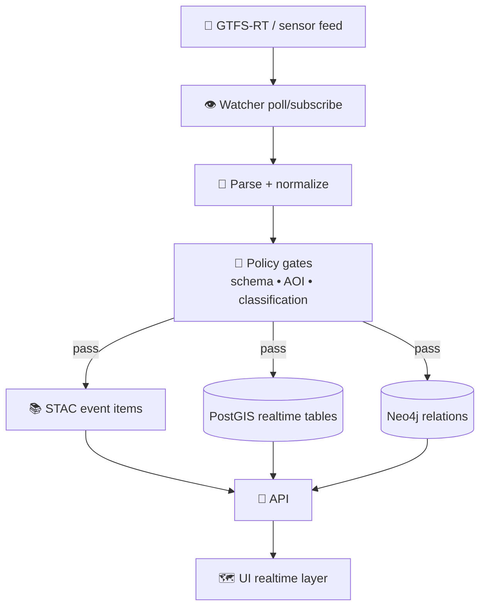
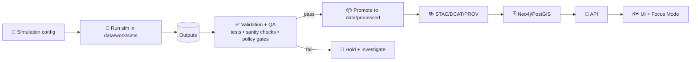
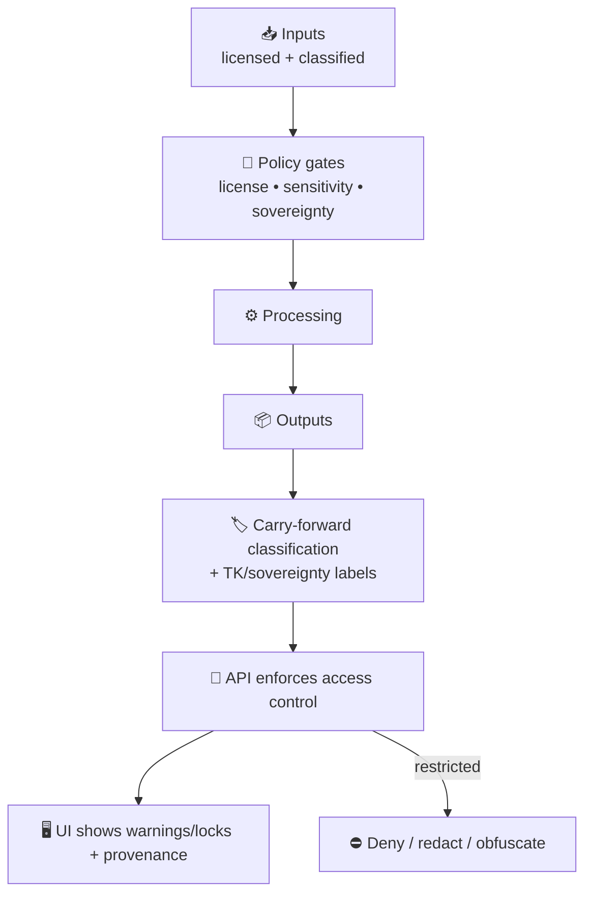

# 🧭 KFM Architecture Diagrams

    

> **Why this folder exists:** KFM diagrams are *not decoration* — they’re a shared mental model + contract for how KFM stays **modular**, **auditable**, and **policy-driven** end‑to‑end.  
> KFM’s guiding rule: anything shown in the UI / Focus Mode must be traceable to cataloged sources and provable processing. :contentReference[oaicite:0]{index=0}

---

## 🧩 What lives in `docs/architecture/diagrams/`

- ✅ **Diagram sources** (prefer: Mermaid `.mmd` / Markdown Mermaid blocks)
- ✅ **Exports** (`.svg` preferred) for stable rendering in docs + PR diffs
- ✅ **Complex diagram sources** (`.drawio`) when Mermaid gets too cramped
- ✅ **This README** = diagram index + canonical “starter” diagrams

### 📁 Folder layout

```text
📁 docs/
  📁 architecture/
    📁 diagrams/
      📄 README.md  👈 you are here
      📄 D01__system_spine.mmd
      📄 D01__system_spine.svg
      📄 D02__c4_context.mmd
      📄 D02__c4_context.svg
      📄 ...
```

---

## 🗺️ Diagram Index

> **Rule of thumb:** If you can’t answer “where did this come from?” and “what policy allowed it?” from the diagrams, we’re missing a diagram.  
> KFM enforces “fail closed” policy gates across ingestion, AI outputs, and publication. :contentReference[oaicite:1]{index=1}

| ID | Diagram | Suggested files | Type | Answers | Evidence anchors |
|---:|---|---|---|---|---|
| D01 | **System Spine** (Raw → Catalogs → Graph/DB → API → UI/Story/Focus) | `D01__system_spine.mmd/.svg` | Mermaid | “How does anything become visible?” | Provenance-first & no black boxes:contentReference[oaicite:2]{index=2} |
| D02 | **C4 Context** | `D02__c4_context.mmd/.svg` | Mermaid | “Who uses KFM & what touches it?” | Federation vision:contentReference[oaicite:3]{index=3} |
| D03 | **C4 Containers** (Web/API/Pipelines/Stores/Policy/Obs) | `D03__c4_containers.mmd/.svg` | Mermaid | “What are the big moving parts?” | Layered modular architecture:contentReference[oaicite:4]{index=4} |
| D04 | **Intake DAG + Policy Gates** (pre-parse → normalize → validate → dedupe → publish) | `D04__intake_dag.mmd/.svg` | Mermaid | “How do we ingest safely?” | OPA gates + artifacts (STAC/GeoParquet/PMTiles):contentReference[oaicite:5]{index=5} |
| D05 | **PostGIS + Neo4j Query Orchestration** | `D05__query_orchestration.mmd/.svg` | Mermaid | “How do geometry + semantics come back together?” | Separate PostGIS vs Neo4j queries:contentReference[oaicite:6]{index=6} |
| D06 | **Focus Mode RAG Pipeline** (retrieve → generate → governance → cite/refuse) | `D06__focus_mode.mmd/.svg` | Mermaid + Seq | “How does the AI answer safely?” | Citations required or refuse:contentReference[oaicite:7]{index=7} |
| D07 | **Watcher–Planner–Executor (W‑P‑E)** | `D07__wpe_agents.mmd/.svg` | Mermaid | “How do bots create PRs safely?” | W‑P‑E loop:contentReference[oaicite:8]{index=8} |
| D08 | **UI Composition** (Map/Timeline/Story/Focus/Provenance) | `D08__ui_composition.mmd/.svg` | Mermaid | “How does the UI stay evidence-first?” | Provenance tooltips + warnings:contentReference[oaicite:9]{index=9} |
| D09 | **Federation** (multi-region DCAT harvest + UI swap endpoints) | `D09__federation.mmd/.svg` | Mermaid | “How do Kansas + sister matrices interoperate?” | DCAT aggregation + config-driven UI:contentReference[oaicite:10]{index=10} |
| D10 | **Real-Time Feeds** (watchers → STAC events → UI layers) | `D10__realtime_feeds.mmd/.svg` | Mermaid | “How do live layers work?” | GTFS‑RT watcher proposal:contentReference[oaicite:11]{index=11} |
| D11 | **Simulation Promotion Path** (sandbox → verify → catalog → publish) | `D11__simulation_promotion.mmd/.svg` | Mermaid | “How do sims become trustworthy?” | Sim runs must be promoted/certified:contentReference[oaicite:12]{index=12} |
| D12 | **Sensitivity + Sovereignty Controls** (classification propagation) | `D12__sensitivity_controls.mmd/.svg` | Mermaid | “How do we handle restricted/cultural data?” | “No output less restricted than inputs”:contentReference[oaicite:13]{index=13} + Mukurtu/TK labels:contentReference[oaicite:14]{index=14} |

---

## 🧠 Canonical Diagrams (embedded)

> These are “starter canonical” diagrams. As the folder matures, keep `Dxx__*.mmd` in sync with the embedded versions.

---

<details>
<summary><strong>🧬 D01 — KFM System Spine</strong> (the “single picture”)</summary>

KFM’s dominant architecture path is:

**Deterministic pipelines → STAC/DCAT/PROV → Graph/DB → API → UI (Map/Timeline/Story) → Focus Mode**.  
This matches KFM’s “contract-first & provenance-first” rule set and ensures no “mystery layers.”:contentReference[oaicite:15]{index=15}:contentReference[oaicite:16]{index=16}



**Why this spine matters:** it’s the architecture guarantee that anything user-facing is backed by catalog + provenance, and anything that can’t be sourced is refused at the AI layer.:contentReference[oaicite:17]{index=17}

</details>

---

<details>
<summary><strong>🧱 D02 — C4 Context</strong> (people & systems)</summary>

Federation (e.g., “Nebraska Frontier Matrix”) is a first-class vision: separate instances can interoperate via open standards and catalog aggregation.:contentReference[oaicite:18]{index=18}



</details>

---

<details>
<summary><strong>🧰 D03 — C4 Containers</strong> (services & boundaries)</summary>

KFM is explicitly modular: front-end, back-end, and pipelines are decoupled and communicate via APIs + data contracts, keeping domain logic isolated from infrastructure decisions.:contentReference[oaicite:19]{index=19}

```mermaid
flowchart LR
  %% UI
  subgraph WEB[🖥 Web]
    FE[React + TypeScript<br/>MapLibre/Cesium • Timeline • Story Nodes]
  end

  %% API & governance
  subgraph API[🧩 API]
    BE[FastAPI (stateless) + OpenAPI]
    GQL[GraphQL (optional)]
    POL[Policy Pack<br/>OPA/Rego + Conftest]
  end

  %% Pipelines
  subgraph PIPE[⚙️ Pipelines & Workers]
    ETL[Deterministic ETL jobs]
    WATCH[Watchers (feeds/schedules)]
    QA[Catalog QA + Metrics]
  end

  %% Data
  subgraph DATA[🗄 Stores]
    PG[(PostGIS)]
    N4J[(Neo4j)]
    OBJ[(Artifacts store)]
    IDX[(Search/Embeddings index)]
  end

  %% Catalogs
  subgraph CAT[📚 Catalog Layer]
    STAC[STAC]
    DCAT[DCAT]
    PROV[PROV-O (prov.jsonld)]
  end

  %% Observability
  subgraph OBS[📈 Observability]
    LOGS[Logs]
    METRICS[Metrics/Telemetry]
    TRACE[Tracing]
  end

  FE --> BE
  FE --> GQL
  BE --> PG
  BE --> N4J
  BE --> IDX
  BE --> STAC
  BE --> DCAT
  BE --> PROV

  ETL --> OBJ
  ETL --> PG
  ETL --> N4J
  ETL --> STAC
  ETL --> DCAT
  ETL --> PROV

  WATCH --> ETL
  QA --> POL
  POL -. gates .- BE
  POL -. gates .- ETL

  BE --> OBS
  ETL --> OBS
```

</details>

---

<details>
<summary><strong>🚦 D04 — Intake DAG + Policy Gates</strong> (safe ingestion)</summary>

KFM’s intake leans on: pre-parsers (incl. OCR), extraction/normalization, strict typing (Pydantic), and **OPA policy gates** that fail-closed. Records that fail go to human QA. :contentReference[oaicite:20]{index=20}

```mermaid
flowchart TD
  IN[📥 Incoming payloads<br/>APIs • PDFs • feeds • attachments] --> PRE[🔎 Pre-parse<br/>MIME sniff • extract attachments • OCR]
  PRE --> EX[🧠 LLM-assisted extraction<br/>fields + confidence]
  EX --> NORM[🧼 Normalize<br/>canonical schema + controlled vocab]
  NORM --> TYPE[🧾 Strict typing<br/>Pydantic models]
  TYPE --> GATE[🚦 Policy gates (OPA/Rego)<br/>AOI checks • mandatory fields • embargo/classification]
  GATE -->|pass| DEDUPE[🧬 Dedupe<br/>stable_id + semantic near-duplicate]
  GATE -->|fail| HQ[👀 Human QA queue<br/>diffs + evidence + confidence]

  DEDUPE --> OUT[📦 Output artifacts]
  OUT --> STAC[STAC Items/Collections]
  OUT --> GPQ[GeoParquet (analytics)]
  OUT --> PMT[PMTiles (low-latency UI)]
  OUT --> PROV[prov.jsonld (lineage)]
  OUT --> DIFF[CSV diffs (auditable deltas)]

  STAC --> SNAP[📦 Snapshot + PR promotion]
  PROV --> SNAP
  DIFF --> SNAP
```

**Promotion model:** changes become official through PRs + CI policy tests, preserving auditability. Conftest policy tests can validate STAC + PROV artifacts directly. :contentReference[oaicite:21]{index=21}

</details>

---

<details>
<summary><strong>🧭 D05 — PostGIS + Neo4j Query Orchestration</strong></summary>

KFM deliberately separates:
- **PostGIS** for geometry-heavy ops (tiles, bbox filters, distance/area)  
- **Neo4j** for semantic relationships and provenance links  
…and the API orchestrates results (rather than doing cross-DB joins at query time).:contentReference[oaicite:22]{index=22}



</details>

---

<details>
<summary><strong>🤖 D06 — Focus Mode Pipeline</strong> (RAG + governance)</summary>

Focus Mode uses a pipeline pattern: **UserQuestion → NLP Parser → Knowledge Retrieval → LLM Answer Generation → Governance Check → AnswerWithCitations**. :contentReference[oaicite:23]{index=23}

Also: **AI output must include citations, or it refuses** (policy gate). :contentReference[oaicite:24]{index=24}



### Focus Mode sequence (who talks to whom)



</details>

---

<details>
<summary><strong>🛰 D07 — Watcher–Planner–Executor (W‑P‑E)</strong> (safe automation)</summary>

W‑P‑E = controlled automation where the AI creates **reviewable PRs**, not silent production mutations. :contentReference[oaicite:25]{index=25}



**Key invariant:** automated output still must satisfy the same policy gates as humans. :contentReference[oaicite:26]{index=26}

</details>

---

<details>
<summary><strong>🗺 D08 — UI Composition</strong> (Map + Timeline + Story + Focus)</summary>

UI is designed to stay evidence-first: provenance tooltips, citation links, and sensitivity warnings/lock indicators are part of the UX (not an afterthought).:contentReference[oaicite:27]{index=27}

Story Nodes are narrative modules (Markdown + JSON) that drive map layers + timeline positions. :contentReference[oaicite:28]{index=28}

```mermaid
flowchart TB
  subgraph UI[🖥 React UI]
    MAP[🗺 Map View<br/>MapLibre (2D) / Cesium (3D)]
    TIME[⏳ Timeline]
    STORY[📖 Story Viewer<br/>Story Nodes]
    FOCUS[🤖 Focus Mode Panel]
    META[🔎 Metadata/Provenance Drawer<br/>STAC/DCAT/PROV]
    LAYERS[🧩 Layer Manager]
    SEARCH[🔍 Search / Browse]
  end

  STORY --> MAP
  STORY --> TIME
  LAYERS --> MAP
  SEARCH --> MAP
  MAP --> META
  TIME --> META
  FOCUS --> META
  FOCUS --> MAP
```

</details>

---

<details>
<summary><strong>🌐 D09 — Federation</strong> (multi-region interoperability)</summary>

Federation is supported by: reusable architecture/config, DCAT-based catalog aggregation, and UI that can point at different endpoints. :contentReference[oaicite:29]{index=29}

```mermaid
flowchart LR
  subgraph KS[🗺 Kansas KFM]
    KS_CAT[DCAT + STAC + PROV]
    KS_API[API]
  end

  subgraph NE[🧭 Nebraska KFM (example)]
    NE_CAT[DCAT + STAC + PROV]
    NE_API[API]
  end

  HUB[🧷 Frontier Matrix Hub<br/>harvest/merge DCAT catalogs] --> SEARCH[🔍 Federated Search]

  KS_CAT --> HUB
  NE_CAT --> HUB

  UI[🖥 UI] --> SEARCH
  UI --> KS_API
  UI --> NE_API
```

</details>

---

<details>
<summary><strong>⚡ D10 — Real‑Time Feeds</strong> (GTFS‑RT / sensors)</summary>

Roadmap proposal: **GTFS‑RT watcher pipeline** to poll transit feeds, create STAC + Neo4j updates, and render a live map layer. :contentReference[oaicite:30]{index=30}



</details>

---

<details>
<summary><strong>🧪 D11 — Simulation Promotion Path</strong> (sandbox → certified)</summary>

Sim outputs must **not** become “official” just because they exist; they live in sandbox areas until verified and promoted into processed + cataloged form. :contentReference[oaicite:31]{index=31}



</details>

---

<details>
<summary><strong>🔒 D12 — Sensitivity + Sovereignty Controls</strong></summary>

KFM encodes sovereignty rules such as **“no output may be less restricted than its inputs”** (classification must not downgrade through processing). :contentReference[oaicite:32]{index=32}

Innovative proposals include integrating Indigenous governance tooling (Mukurtu CMS + Traditional Knowledge labels), differential access rules, and controlled obfuscation for sensitive locations. :contentReference[oaicite:33]{index=33}



</details>

---

## ✅ Diagram Standards (so diagrams stay “diffable” and sane)

### ✍️ Mermaid conventions (do this or CI will hate you)

Pulse Ideas includes a “Mermaid linting” discipline:
- Pin Mermaid versions
- Quote labels consistently
- Avoid complex markdown in node labels
- Validate Mermaid blocks (parse + render) in CI via `mermaid.parse` + `mermaid-cli`:contentReference[oaicite:34]{index=34}

**Recommended rules:**
1. ✅ Keep node labels short; move prose into surrounding markdown.
2. ✅ Quote labels if they include punctuation.
3. ✅ Prefer `flowchart LR` for pipelines (left-to-right reads like a “spine”).
4. ✅ Treat diagrams as *source code*: review diffs like code.

### 🧾 Naming scheme

Use stable, sortable IDs:

- `D01__system_spine.mmd`
- `D06__focus_mode.mmd`
- `D10__realtime_feeds.mmd`

Exports mirror source names:

- `D06__focus_mode.svg`

### 🧪 Definition of Done for a new diagram

- [ ] Added to **Diagram Index** table above
- [ ] Includes **Purpose** + “Questions this answers”
- [ ] References relevant KFM docs (see “Sources” below)
- [ ] Mermaid validated (parse/render) if applicable:contentReference[oaicite:35]{index=35}
- [ ] Exported `.svg` for stable rendering in other docs

---

## 📎 Source Material (Project Files)

> These are the design documents used to synthesize the diagrams above.

### Core KFM docs (primary)

- 📚 Data Intake — Technical & Design Guide: :contentReference[oaicite:36]{index=36}  
  Provenance-first intake philosophy + standards + policy-as-code + federation patterns.:contentReference[oaicite:37]{index=37}

- 🧭 KFM Architecture, Features, and Design: :contentReference[oaicite:38]{index=38}  
  Automated policy gates (schema/STAC/DCAT/PROV/license/sensitivity/provenance) + “citations required” behavior.:contentReference[oaicite:39]{index=39}

- 🤖 KFM AI System Overview: :contentReference[oaicite:40]{index=40}  
  Focus Mode pipeline + W‑P‑E agent loop for safe automation.:contentReference[oaicite:41]{index=41}:contentReference[oaicite:42]{index=42}

- 🖥 UI System Overview: :contentReference[oaicite:43]{index=43}  
  Provenance tooltips, sensitivity warnings/locks, and trust-first UI patterns.:contentReference[oaicite:44]{index=44}

- 📘 Comprehensive Technical Documentation: :contentReference[oaicite:45]{index=45}  
  Contract-first & provenance-first framing + layered architecture + knowledge graph standards (CIDOC‑CRM/GeoSPARQL/OWL‑Time).:contentReference[oaicite:46]{index=46}

- 🌟 Latest Ideas & Future Proposals: :contentReference[oaicite:47]{index=47}  
  Roadmap proposals like GTFS‑RT watcher pipelines + Story Node conventions.:contentReference[oaicite:48]{index=48}

- 💡 Innovative Concepts to Evolve KFM: :contentReference[oaicite:49]{index=49}  
  Indigenous governance + Mukurtu/TK labels + ethical handling patterns for cultural/sensitive data.:contentReference[oaicite:50]{index=50}

- 💓 Pulse Ideas: :contentReference[oaicite:51]{index=51}  
  Practical intake DAG patterns + OPA gates + artifact outputs (STAC/GeoParquet/PMTiles/prov.jsonld) + Mermaid/CI hygiene.:contentReference[oaicite:52]{index=52}:contentReference[oaicite:53]{index=53}

---

## 📦 Embedded Reference Libraries (PDF Portfolios)

> These project files are PDF portfolios (containers). They provide the broader “toolbox” behind KFM’s architecture decisions (AI, geospatial, languages, data engineering).  
> Tip: you can inspect inventories locally with `pdfdetach -list "<file>.pdf"`.

<details>
<summary><strong>🧠 AI Concepts & more</strong> (36 embedded PDFs)</summary>

:contentReference[oaicite:54]{index=54}

Topics span: computational agents, deep learning, pattern recognition, ML under constraints, regression/statistics, and AI law/humanism — useful background when refining D06 (Focus Mode) and governance patterns.

</details>

<details>
<summary><strong>🗺 Maps / Google Maps / Virtual Worlds / Archaeology / WebGL</strong> (14 embedded PDFs)</summary>

:contentReference[oaicite:55]{index=55}

Includes references on GIS basics, map design, projections, WebGL, virtual worlds, and geoprocessing — useful for D08 (UI), 2D/3D rendering decisions, and projection/CRS considerations.  
(Example pipeline reminder: always track projection metadata; common CRS include EPSG:4326 and EPSG:3857.):contentReference[oaicite:56]{index=56}

</details>

<details>
<summary><strong>🧰 Various programming languages & resources</strong> (69 embedded PDFs)</summary>

:contentReference[oaicite:57]{index=57}

A broad engineering library (Docker, CI/CD, cryptography, TS/React/Node, SQL/PostgreSQL, algorithms, Spark, etc.). It underpins how we keep diagrams actionable: pipelines, policy-as-code, and secure web engineering.

</details>

<details>
<summary><strong>🗄 Data Management / Architectures / Data Science / Bayesian Methods</strong> (31 embedded PDFs)</summary>

:contentReference[oaicite:58]{index=58}

Data engineering + governance + Bayesian/stat foundations — supports D04 (intake DAG), D11 (simulation verification), and quality metrics/telemetry thinking.

</details>

---

## 🧯 If something changes…

If code, pipelines, or governance diverge from diagrams, treat it as a **documentation bug**:
- update the diagram(s), or
- open a tracking issue, or
- add a “Known divergence” note in the relevant diagram section

Because KFM’s promise is clarity + auditability — and diagrams are part of how we enforce that promise. :contentReference[oaicite:59]{index=59}

