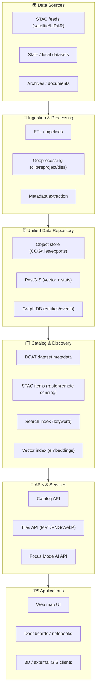
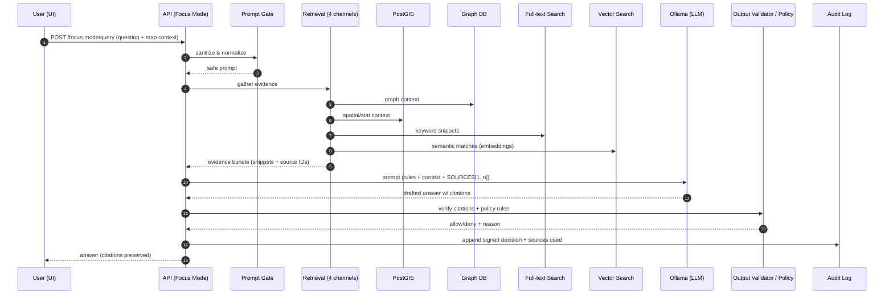
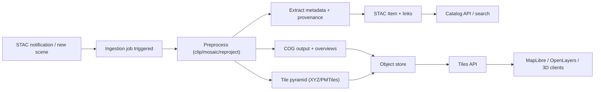

# 📐 Architecture Diagrams


Welcome to the **diagram hub** for the Kansas Frontier Matrix (KFM) 🧭  
This folder is where we keep the *visual truth* of the platform: data flows 🧪, service boundaries 🧩, trust boundaries 🔐, and how the UI “drinks from the same well” 🗺️.

---

## 🎯 What lives in this folder?

**We store diagram *sources* first**, then (optionally) exported assets:

- ✅ **Mermaid** sources: `*.mmd` (preferred for most architecture diagrams)
- ✅ **Draw.io / diagrams.net** sources: `*.drawio` (for complex visuals)
- ✅ **Exports**: `*.svg`, `*.png` (only when needed for external docs, slide decks, or PDFs)

> 🧠 Rule of thumb: if GitHub can render it (Mermaid), keep it in Mermaid.

---

## 🗂️ Recommended folder layout

```text
docs/architecture/diagrams/
├── README.md                    🧾 (you are here)
├── sources/                     🧠 source-of-truth diagrams
│   ├── 00-system-context.mmd
│   ├── 10-layered-architecture.mmd
│   ├── 20-data-ingestion-catalog.mmd
│   ├── 30-api-surface.mmd
│   ├── 40-ai-focus-mode-rag.mmd
│   ├── 50-security-trust-boundaries.mmd
│   ├── 60-ci-cd-devsecops.mmd
│   └── 70-gis-tiles-rendering.mmd
└── exports/                     🖼️ optional exports (generated)
    ├── 00-system-context.svg
    └── 40-ai-focus-mode-rag.svg
```

---

## 🧱 Architecture anchor points (what diagrams should reflect)

KFM is designed as a **layered, modular system**:
- **Data ingestion pipelines** → **unified data repository** → **analytics & AI layer** → **APIs/services** → **apps/dashboards**  
- Microservices mindset: components can be developed/deployed/scaled independently.
- Open standards & interoperability: **STAC/DCAT**, vector/raster standards, tile services, etc.
- Evidence-first AI: retrieval + citations + policy checks (no “free-form hallucination” paths).

➡️ When a diagram is updated, it should align with these “ground truths” in:
- `docs/architecture/system_overview.md`
- `docs/architecture/AI_SYSTEM_OVERVIEW.md`
- `docs/architecture/ai/OLLAMA_INTEGRATION.md`
- `src/server/api/README.md`
- `pipelines/README.md`

---

## 🧾 Diagram index (create/maintain these first)

| Diagram (source) | Type | Answers… | Status |
|---|---|---|---|
| `sources/00-system-context.mmd` | Context | Who uses KFM & what external systems exist? | 🚧 |
| `sources/10-layered-architecture.mmd` | Logical | How do the core layers fit together? | 🚧 |
| `sources/20-data-ingestion-catalog.mmd` | Flow | How do datasets enter → get cataloged → served? | 🚧 |
| `sources/30-api-surface.mmd` | Map | What are the API “front doors” (catalog, tiles, AI)? | 🚧 |
| `sources/40-ai-focus-mode-rag.mmd` | Sequence/Flow | How does Focus Mode RAG work end-to-end? | 🚧 |
| `sources/50-security-trust-boundaries.mmd` | Threat/Boundary | Where are trust boundaries & policy gates? | 🚧 |
| `sources/60-ci-cd-devsecops.mmd` | Pipeline | How does code go from commit → deploy safely? | 🚧 |
| `sources/70-gis-tiles-rendering.mmd` | Flow | How do tiles get generated & consumed by clients? | 🚧 |

> ✅ When a diagram is created, flip its status from 🚧 → ✅ and add an exported `.svg` only if needed.

---

## 🧠 Conventions & style guide

### Naming & ordering
Use numeric prefixes so the folder sorts into a story:

- `00-` Context (who/what/why)
- `10-` Logical layers
- `20-` Data flows
- `30-` API surface
- `40-` AI / RAG flows
- `50-` Security boundaries
- `60-` CI/CD & operations
- `70-` GIS rendering & tiles

### Diagram “language”
Keep diagrams **small and composable**:
- Prefer multiple focused diagrams over one “wall of boxes” 🧱
- Use consistent nouns:
  - **Ingestion** (pipelines/jobs)
  - **Storage** (object store, PostGIS, graph store)
  - **Catalog** (DCAT/STAC metadata)
  - **Search** (full-text + vector)
  - **AI** (Prompt Gate → Retrieval → Ollama → Validation)
  - **Delivery** (API + Tiles + UI)

### Trust boundaries 🔐
Any diagram that crosses:
- public internet → API
- API → data stores
- AI prompt → LLM runtime
must show a **policy gate** or **boundary**.

---

## 🧩 Mermaid templates (copy/paste)

<details>
<summary><b>1) Layered architecture (high level)</b> 🧱</summary>


</details>

<details>
<summary><b>2) Focus Mode AI RAG (sequence)</b> 🤖</summary>


</details>

<details>
<summary><b>3) Remote sensing ingestion (raster pipeline)</b> 🛰️</summary>


</details>

---

## 🛠️ Editing & exporting diagrams

### Mermaid (recommended)
- Edit `*.mmd` in any editor (VS Code works great)
- GitHub renders Mermaid blocks automatically in Markdown/`*.mmd`

Optional export (SVG/PNG) using Mermaid CLI:
```bash
# Example (requires Node)
npx -y @mermaid-js/mermaid-cli \
  -i docs/architecture/diagrams/sources/40-ai-focus-mode-rag.mmd \
  -o docs/architecture/diagrams/exports/40-ai-focus-mode-rag.svg
```

### Draw.io (when needed)
- Keep `*.drawio` as the source of truth
- Export `.svg` (preferred) into `exports/`

---

## ✅ Definition of “done” for a diagram

A diagram PR is “done” when:
- [ ] Source file exists (`sources/*.mmd` or `sources/*.drawio`)
- [ ] Diagram is linked in the index table above
- [ ] Names match conventions (`00-`, `10-`, `20-`, etc.)
- [ ] Trust boundaries are visible where relevant 🔐
- [ ] It answers one clear question (no “kitchen sink” diagrams)
- [ ] If exported, export is **generated** from source and committed only when required

---

## 🧭 Quick tips

- 🧊 Keep node labels short; move details into adjacent docs.
- 🧷 Prefer **stable nouns** (API, Catalog, Tiles, PostGIS, Graph, Object Store).
- 🧼 Don’t encode implementation churn (exact library choices) unless the diagram’s purpose is ops/deployment.
- 🧱 If the diagram exceeds one screen, split it.

---

## 🔗 Related architecture docs (the “why” and “what”)

- `docs/architecture/system_overview.md` — platform layers & overall design
- `docs/architecture/AI_SYSTEM_OVERVIEW.md` — AI system components
- `docs/architecture/ai/OLLAMA_INTEGRATION.md` — Focus Mode + Ollama integration & policy enforcement
- `src/server/api/README.md` — API surface (datasets, catalog/search, tiles, AI endpoints)
- `pipelines/README.md` — ingestion/pipeline orchestration