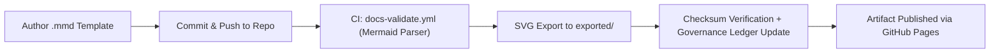

<div align="center">

# 🖼️ **Kansas Frontier Matrix — Architecture Diagrams & Visualization Guide (v2.1.1 · Tier-Ω+∞ Certified)**  
`docs/architecture/diagrams/README.md`

**Mission:** Standardize, govern, and maintain all visual representations of the **Kansas Frontier Matrix (KFM)** system —  
ensuring reproducibility, accessibility, and provenance across architectural diagrams, workflows, and technical visualizations.

[](../../../docs/)
[](../../../.github/workflows/docs-validate.yml)
[](../../../.github/workflows/policy-check.yml)
[](../../../LICENSE)

</div>

---

## 📚 Overview

This directory contains **all diagrams and architectural visualizations** for the Kansas Frontier Matrix repository.  
All images, flowcharts, sequence diagrams, and component overviews must adhere to:

- **MCP-DL v6.4.3** standards for documentation reproducibility.  
- **WCAG 2.1 AA** accessibility requirements.  
- **FAIR+CARE** governance metadata and authorship traceability.  
- **Immutable provenance** via checksums and release manifests.

All diagrams are version-controlled, reproducible, and validated by CI using `docs-validate.yml`.

---

## 🗂️ Directory Layout

```bash
docs/architecture/diagrams/
├── README.md              # This file — Diagram standards and usage guide
├── templates/             # Source templates (Mermaid, PlantUML, etc.)
│   ├── system_overview.mmd
│   ├── etl_pipeline.mmd
│   ├── governance_workflow.mmd
│   └── ai_lifecycle.mmd
└── exported/              # Rendered diagrams (SVG/PNG for publication)
    ├── system_overview.svg
    ├── etl_pipeline.svg
    ├── governance_workflow.svg
    └── ai_lifecycle.svg
```

---

## 🧭 Diagram Standards

| Rule | Description | Enforced By |
|:--|:--|:--|
| **Mermaid syntax only** | Use `.mmd` files to define diagrams for CI validation. | `docs-validate.yml` |
| **Must end with `<!-- END OF MERMAID -->`** | Required marker for parser integrity. | `policy-check.yml` |
| **Readable labels** | Avoid jargon; use spaces instead of underscores. | Manual review |
| **High contrast** | Ensure accessibility; avoid color-only indicators. | WCAG validation |
| **Source control** | Never embed unversioned or generated diagrams. | Git tracking |
| **Checksum verification** | Each exported file tracked in manifest. | `governance-ledger.yml` |

---

## 🧩 Supported Diagram Types

| Type | Extension | Tool | Description |
|:--|:--|:--|:--|
| **Flowchart** | `.mmd` | Mermaid | Process flows and data pipelines |
| **Sequence Diagram** | `.mmd` | Mermaid | Interactions and message order |
| **Class Diagram** | `.mmd` | Mermaid | Schema or entity relationships |
| **Entity Graph** | `.mmd` | Mermaid / Neo4j Bloom | Graph-based data structures |
| **Component Diagram** | `.mmd` | Mermaid | System architecture overviews |
| **Governance Diagram** | `.mmd` | Mermaid | Workflow and compliance models |

> All diagrams must be machine-renderable in GitHub and exported to SVG/PNG under `exported/`.

---

## 🧮 Diagram Rendering Workflow


<!-- END OF MERMAID -->

---

## ⚙️ Commands

Render diagrams locally using the Makefile utilities:

```bash
make diagrams         # Render all .mmd files to exported SVGs
make diagram-checks   # Run lint checks and CI validations
```

Render a single diagram manually:

```bash
npx @mermaid-js/mermaid-cli -i templates/system_overview.mmd -o exported/system_overview.svg
```

---

## 🧠 Metadata Requirements

Each diagram **must** include metadata headers (as a comment block at the top of `.mmd`):

```mmd
%%---
%% title: "System Overview"
%% version: "v2.1.1"
%% author: "@kfm-architecture"
%% description: "High-level visualization of KFM architecture and governance."
%% license: "CC-BY 4.0"
%%---
```

> These are parsed during CI for inclusion in the documentation manifest.

---

## ⚖️ FAIR + CARE Integration

| Principle | Implementation | Evidence |
|:--|:--|:--|
| **Findable** | Each diagram labeled, indexed, and exported with version metadata. | `docs/architecture/diagrams/exported/` |
| **Accessible** | SVGs published under CC-BY 4.0. | GitHub Pages |
| **Interoperable** | Mermaid source & JSON manifests standardized. | `docs-validate.yml` |
| **Reusable** | Versioned templates reusable across pipelines. | `templates/*.mmd` |
| **Collective Benefit** | Accessible diagrams support open education and research. | FAIR+CARE council audit logs |

---

## 🧩 Validation Workflows

| Workflow | Function | Output |
|:--|:--|:--|
| `docs-validate.yml` | Parses all `.mmd` files for Mermaid syntax errors. | `reports/validation/diagram_validation.json` |
| `policy-check.yml` | Confirms `<!-- END OF MERMAID -->` marker presence. | `reports/audit/policy_results.json` |
| `governance-ledger.yml` | Adds checksums of rendered diagrams to provenance log. | `data/reports/audit/data_provenance_ledger.json` |

---

## 🧾 Example Diagram Template (Mermaid)

```mmd
%%---
%% title: "ETL Pipeline Overview"
%% author: "@kfm-architecture"
%% version: "v2.1.1"
%% description: "Shows how data moves through extraction, transformation, and loading."
%% license: "CC-BY 4.0"
%%---

flowchart TD
  A["Raw Data Sources"] --> B["ETL Processing"]
  B --> C["Validation + FAIR+CARE Certification"]
  C --> D["STAC Catalog Publication"]
  D --> E["Archival + Provenance Ledger"]
```
<!-- END OF MERMAID -->

---

## 🧾 Version History

| Version | Date | Author | Summary |
|:--|:--|:--|:--|
| **v2.1.1** | 2025-11-16 | @kfm-architecture | Standardized diagram policy; added metadata headers, CI commands, FAIR+CARE integration. |
| v2.0.0 | 2025-10-25 | @kfm-data-lab | Introduced export and checksum verification pipeline. |
| v1.0.0 | 2025-10-05 | @kfm-architecture | Initial diagram standards and validation rules. |

---

<div align="center">

**Kansas Frontier Matrix © 2025**  
*“Every Diagram Has Provenance — Every System Has a Blueprint.”*  
📍 `docs/architecture/diagrams/README.md` — Architecture diagram governance and visualization guide.

</div>