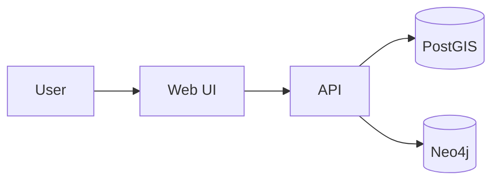
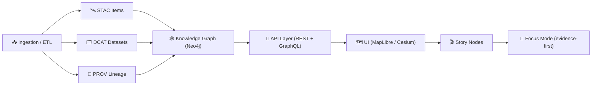

<a id="top"></a>

# 📐 `docs/architecture/diagrams/` — Diagrams-as-Code + Visual Architecture Atlas 🗺️


This folder is the **canonical home for KFM architecture diagrams** (system + dataflow + contracts + deployment + UI flow). Prefer **diagram-as-code** (Mermaid) so changes are diffable and reviewable. Use exported **SVG/PNG** only when necessary.

> ✅ Rule of thumb: if a diagram changes as often as code, it should *live like code*.

---

## 🧭 What belongs here

### ✅ In scope
- 🧱 System architecture (layers, services, boundaries)
- 🔁 Data pipelines (ETL → catalogs → graph → API → UI → Story Nodes → Focus Mode)
- 📦 Contract flows (OpenAPI/GraphQL, schema validation, error envelopes)
- 🗺️ Spatial stack diagrams (STAC/DCAT/PROV, PostGIS, tiles, PMTiles, MapLibre/Cesium)
- 🧬 Provenance + promotion saga diagrams (Sign → Attest → Publish → Catalog)
- 🔐 Security boundaries (trust zones, authN/authZ surfaces, threat-model slices)

### ❌ Out of scope
- Large untracked binaries or screenshots with no editable source
- Diagrams that are purely “marketing” (those belong in `/README.md` or `docs/media/`)
- Un-sourced diagrams that contradict ADRs or the current architecture docs

---

## 🗂️ Directory layout (recommended)

> This folder may start small. Add subfolders only when needed (keep it tidy ✨).

```text
docs/architecture/diagrams/ 📐
├─ README.md                       ✅ (you are here)
├─ _exports/                       🖼️ generated artifacts (optional; keep minimal)
│  ├─ svg/                         🧾 preferred static export format
│  └─ png/                         🖼️ fallback (only when SVG fails)
├─ mermaid/                        🧜 diagram-as-code (preferred)
│  ├─ system/                      🧱 layers, boundaries, context
│  ├─ dataflows/                   🔁 pipeline & lifecycle flows
│  ├─ contracts/                   🧾 API + schema interactions
│  ├─ infra/                       ☁️ deployment + runtime topology
│  └─ ui/                          🧭 navigation + story flows
├─ drawio/                         🧩 editable sources (only if Mermaid is insufficient)
│  ├─ sources/                     🛠️ .drawio files (source-of-truth)
│  └─ exports/                     🖼️ .svg exports referenced by docs
└─ plantuml/                       🧪 optional (if we add CI-rendered UML)
   ├─ sources/                     🧩 .puml
   └─ exports/                     🖼️ generated .svg
```

---

## 🧜 Mermaid standards (preferred)

GitHub renders Mermaid diagrams inside fenced blocks marked `mermaid`. Keep diagrams:
- **small** (prefer multiple diagrams over one mega-diagram)
- **named** and **scoped** (one file = one purpose)
- **commented** with `%%` for reviewer context

### ✅ Mermaid header pattern



### 🧩 Example: KFM end-to-end value chain (starter)



---

## 🖼️ Static images (SVG/PNG) standards

Prefer **SVG** for crisp zoomable diagrams.
- Use **kebab-case** names: `kfm-system-context.v1.svg`
- Always provide **alt text** when embedding
- Add a short caption sentence below the image for accessibility

Example embed:

```md


*System context showing UI → API → PostGIS/Neo4j boundaries.*
```

---

## 🧩 draw.io standards (only when needed)

Use draw.io when:
- you need precise layout / icons / map-like annotation
- Mermaid becomes unreadable

Rules:
- ✅ Commit the **source** file: `drawio/sources/<name>.drawio`
- ✅ Export a **SVG** and reference the SVG in docs: `drawio/exports/<name>.svg`
- ✅ Keep exports deterministic (same canvas size; no huge whitespace)
- ❌ Do not commit auto-generated backups or “_recovered” files

KFM permits simple architecture diagrams using tools like Mermaid or draw.io exports.  [oai_citation:0‡Kansas Frontier Matrix (KFM) – Comprehensive Technical Documentation.docx](file-service://file-PaBDqECcJe7NbC8hvXNGDS)

---

## 🧪 PlantUML / Graphviz (optional lane)

GitHub does not natively render PlantUML/Graphviz. If we adopt these:
- keep sources under `plantuml/sources/`
- generate SVGs in CI into `plantuml/exports/`
- reference SVGs from architecture docs

(If this lane is enabled later, we’ll add a small CI job + linter rule.)

---

## 🏷️ Naming + versioning conventions

### File naming
Use: `<domain>--<purpose>.<kind>.v<major>.{md|svg|png|drawio|puml}`

Examples:
- `system--context.mermaid.v1.md`
- `dataflows--promotion-saga.mermaid.v2.md`
- `infra--runtime-topology.drawio.v1.drawio`
- `infra--runtime-topology.drawio.v1.svg`

### Diagram kinds (pick one)
- `context` (C4 L1)
- `containers` (C4 L2)
- `components` (C4 L3)
- `deployment`
- `sequence`
- `state`
- `flow`
- `schema`

---

## 🧾 Diagram registry

Keep a lightweight index so architecture docs can link consistently.

| Diagram | Kind | Source | Export | Status |
|---|---|---|---|---|
| *(add as you create)* | | | | |

Tip: Prefer linking to the **source** (Mermaid `.md`) and letting GitHub render it inline.

---

## 🔒 Security + governance guardrails

- 🚫 Never place secrets in diagrams (keys, tokens, internal hostnames, private endpoints)
- 🧭 If a diagram implies a policy decision, it should be backed by an ADR in `docs/architecture/adr/`
- 🧾 If a diagram describes data publication or lineage, ensure it aligns with STAC/DCAT/PROV expectations
- 🪶 Respect CARE/FAIR + sovereignty policies when depicting sensitive datasets or communities

---

## ✅ Contribution checklist (fast)

- [ ] Diagram has a clear **scope** and **purpose**
- [ ] Mermaid compiles (renders on GitHub) or SVG is readable at 100% zoom
- [ ] File name follows conventions
- [ ] No secrets / no private URLs
- [ ] Linked from a relevant architecture doc (or added to registry)
- [ ] If it changes behavior/constraints, link an ADR

---

## 📚 References

- KFM guidance encouraging diagrams in docs; Mermaid/draw.io are acceptable.  [oai_citation:1‡Kansas Frontier Matrix (KFM) – Comprehensive Technical Documentation.docx](file-service://file-PaBDqECcJe7NbC8hvXNGDS)  
- Mermaid rendering + diagram best practices for GitHub Markdown.  [oai_citation:2‡Comprehensive Markdown Guide_ Syntax, Extensions, and Best Practices.docx](file-service://file-J6rFRcp4ExCCeCdTevQjxz)

---

## 🔗 Navigation

- ⬅️ **Back to Architecture**: `../README.md`
- 🧭 **Back to Docs Index**: `../../README.md`
- 🏛️ **Governance Charter**: `../../governance/ROOT_GOVERNANCE.md`

<a href="#top">🔝 Back to top</a>
