# 🧭 KFM Architecture Diagrams


> **Why this folder exists:** KFM diagrams are *not decoration* — they’re a shared mental model **and** a contract.  
> If the UI can show it, we should be able to explain: **(1) where it came from**, **(2) what transformations happened**, and **(3) what policy allowed it**.  
> That “evidence-first” contract spans **data pipelines → STAC/DCAT/PROV catalogs → PostGIS/Neo4j → API → UI → Focus Mode** (with governance enforced end-to-end). 🧾🧬🛡️

---

## 🧭 Quick Nav

- [📌 Quick Start](#-quick-start)
- [📁 Folder Layout](#-folder-layout)
- [🗺️ Diagram Index](#️-diagram-index)
- [🧠 Canonical Starter Diagrams](#-canonical-starter-diagrams)
- [✅ Standards & CI](#-standards--ci)
- [🧪 Definition of Done](#-definition-of-done)
- [📎 Sources](#-sources-project-files)
- [🧰 Reference Libraries](#-reference-libraries)

---

## 📌 Quick Start

### ✅ Add a new diagram (the “happy path”)

1. **Pick the next ID** (e.g., `D13`) + a short, sortable name  
   `D13__supply_chain_provenance.mmd`
2. Add **Mermaid source** (`.mmd`) and an **export** (`.svg`)  
3. Update the **Diagram Index** table below  
4. Ensure it answers at least **one concrete question** (and says so)  
5. Open a PR (human-reviewed, policy-gated) 🔀

> Tip: treat diagrams like code — review diffs, require CI checks, keep naming stable. 🧰

---

## 📁 Folder Layout

KFM keeps diagram sources and exports together so changes are reviewable, diffable, and stable in docs.

```text
📁 docs/
  📁 architecture/
    📁 diagrams/
      📄 README.md                  👈 you are here (index + canon)
      📄 diagrams.yml               👈 optional manifest (recommended)
      📄 D01__system_spine.mmd      👈 Mermaid source
      📄 D01__system_spine.svg      👈 Export for stable rendering
      📄 D02__c4_context.mmd
      📄 D02__c4_context.svg
      📁 drawio/                    👈 optional (when Mermaid gets too cramped)
      📁 assets/                    👈 optional (icons, screenshots, etc.)
```

### 🧾 Naming scheme (stable + sortable)

- `D01__system_spine.mmd`
- `D06__focus_mode.mmd`
- `D12__sensitivity_controls.mmd`

Exports mirror source names:

- `D06__focus_mode.svg`

---

## 🧷 Evidence Tags

To keep the index readable, diagrams reference these evidence tags:

- **[ROAD]** Platform overview & roadmap (what we’re building next)
- **[ARCH]** Architecture / features / design (core system layout)
- **[TECH]** Technical documentation (implementation + standards)
- **[UI]** UI architecture guide (Map/Timeline/Story/Focus UX contract)
- **[AI]** AI system overview (Focus Mode, governance, guardrails)
- **[OLL]** LLM runtime integration (Ollama patterns)
- **[MD]** Markdown governance patterns (front-matter, provenance in docs)
- **[SM]** Scientific method / master coder protocol (reproducibility + rigor)
- **[LIB]** Reference libraries (geospatial, AI, data engineering, security)

---

## 🗺️ Diagram Index

> **Rule of thumb:** If we can’t answer **“where did this come from?”** and **“what policy allowed it?”** from the diagrams, we’re missing a diagram.  
> KFM aims for **fail-closed** policy gates across ingestion, AI outputs, and publication — *including how we build & ship artifacts (SBOM/SLSA)*. 🔒🧾

| ID | Diagram | Suggested files | Type | Answers | Status | Evidence |
|---:|---|---|---|---|---|---|
| D01 | **System Spine** (Sources → Raw → ETL → Evidence Catalogs → Stores → API → UI/Story → Focus Mode) | `D01__system_spine.mmd/.svg` | Mermaid | “How does anything become visible?” | ✅ Canon | ARCH • TECH • AI • MD |
| D02 | **C4 Context** | `D02__c4_context.mmd/.svg` | Mermaid | “Who uses KFM & what touches it?” | ✅ Canon | ROAD • ARCH |
| D03 | **C4 Containers** (Web/API/Pipelines/Stores/Policy/Obs/LLM) | `D03__c4_containers.mmd/.svg` | Mermaid | “What are the big moving parts?” | ✅ Canon | TECH • ARCH • OLL |
| D04 | **Intake DAG + Policy Gates** (fetch → parse → normalize → validate → dedupe → publish) | `D04__intake_dag.mmd/.svg` | Mermaid | “How do we ingest safely?” | ✅ Canon | ARCH • TECH |
| D05 | **PostGIS + Neo4j Query Orchestration** | `D05__query_orchestration.mmd/.svg` | Mermaid | “How do geometry + semantics recombine?” | ✅ Canon | TECH |
| D06 | **Focus Mode RAG + Governance** (prompt gate → retrieve → generate → cite/refuse → ledger) | `D06__focus_mode.mmd/.svg` | Mermaid + Seq | “How does AI answer safely?” | ✅ Canon | AI • UI • TECH |
| D07 | **Watcher–Planner–Executor (W‑P‑E)** (bots open PRs; CI gates; humans merge) | `D07__wpe_agents.mmd/.svg` | Mermaid | “How do automations ship safely?” | ✅ Canon | ARCH • TECH • ROAD |
| D08 | **UI Composition** (Map/Timeline/Story/Focus/Provenance/Offline) | `D08__ui_composition.mmd/.svg` | Mermaid | “How does UI stay evidence-first?” | ✅ Canon | UI • MD |
| D09 | **Federation** (multi-region catalogs + endpoint swapping + federated search) | `D09__federation.mmd/.svg` | Mermaid | “How do sister matrices interoperate?” | ✅ Canon | ROAD • ARCH |
| D10 | **Real-Time Feeds** (watchers → events → live layers) | `D10__realtime_feeds.mmd/.svg` | Mermaid | “How do live layers work?” | 🟡 Draft | ROAD • ARCH |
| D11 | **Simulation Promotion Path** (sandbox → verify → catalog → publish) | `D11__simulation_promotion.mmd/.svg` | Mermaid | “How do sims become trustworthy?” | 🟡 Draft | ROAD • SM • TECH |
| D12 | **Sensitivity + Sovereignty Controls** (CARE flags → access control → generalization → UI warnings) | `D12__sensitivity_controls.mmd/.svg` | Mermaid | “How do we handle restricted/cultural data?” | ✅ Canon | UI • TECH • AI |
| D13 | **Supply Chain Provenance** (SBOM/SLSA attestations + signing) | `D13__supply_chain_provenance.mmd/.svg` | Mermaid | “How do we prove builds weren’t tampered?” | 🟡 Recommended | TECH • SM |
| D14 | **LLM Provider Router** (Ollama/local ↔ hosted; policy wrapper) | `D14__llm_provider_router.mmd/.svg` | Mermaid | “How do we swap LLM backends safely?” | 🟡 Recommended | OLL • AI |
| D15 | **AI Security Boundaries** (prompt gate, tool allowlist, secrets isolation, rate limits) | `D15__ai_security_boundaries.mmd/.svg` | Mermaid | “How do we keep Focus Mode contained?” | 🟡 Recommended | AI • TECH |

---

## 🧠 Canonical Starter Diagrams

> These are “starter canonical” diagrams. Keep `Dxx__*.mmd` in sync with the embedded versions below.  
> If the diagram changes, **update both the file and the embedded copy** (or delete embedded copy and link out).

---

<details>
<summary><strong>🧬 D01 — KFM System Spine</strong> (the “single picture”)</summary>

KFM’s dominant path is:

**Deterministic pipelines → Evidence catalogs (STAC/DCAT/PROV) → PostGIS/Neo4j/search → API → UI (Map/Timeline/Story) → Focus Mode**.

Key invariant: user-facing output is always backed by **cataloged evidence** (and policy gates can refuse/redact when evidence isn’t sufficient). 🧾✅

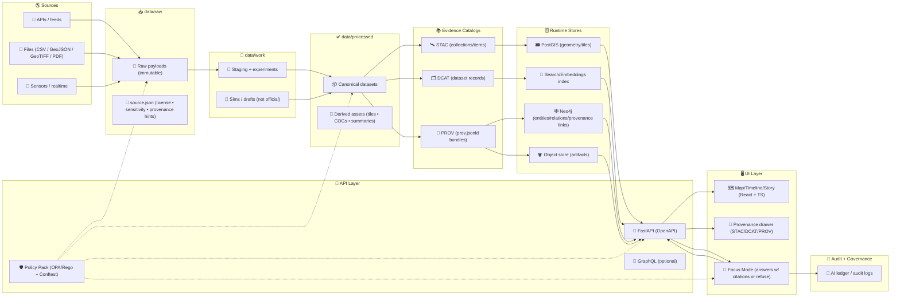

</details>

---

<details>
<summary><strong>🧱 D02 — C4 Context</strong> (people & systems)</summary>

KFM is built for public exploration **and** serious research workflows, with federation as a first-class path (sister matrices + catalog aggregation). 🌐

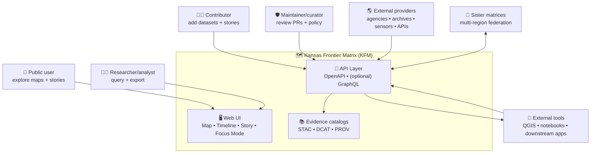

</details>

---

<details>
<summary><strong>🧰 D03 — C4 Containers</strong> (services & boundaries)</summary>

This diagram keeps the “big boxes” honest: **UI**, **API**, **pipelines**, **policy**, **stores**, **observability**, and **LLM runtime** are decoupled and connected via contracts. 🧩

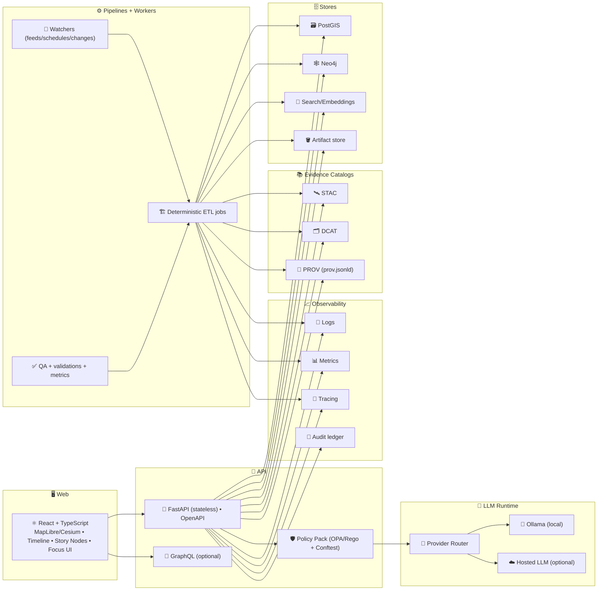

</details>

---

<details>
<summary><strong>🚦 D04 — Intake DAG + Policy Gates</strong> (safe ingestion)</summary>

Intake is designed to be **systematic like code**: fetch → parse → normalize → validate → policy gate → publish artifacts → PR promotion.  
If validation fails, data routes to human QA (fail-closed). ✅🔒

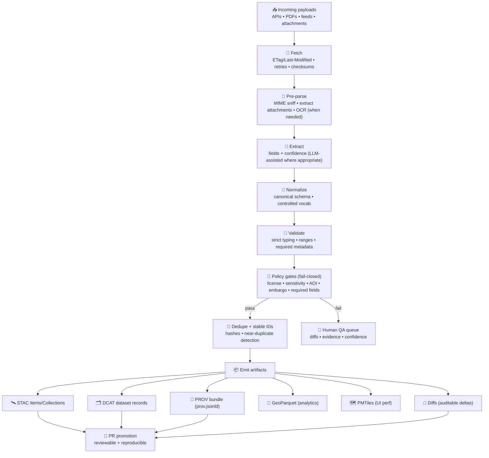

</details>

---

<details>
<summary><strong>🧭 D05 — PostGIS + Neo4j Query Orchestration</strong></summary>

KFM intentionally separates:
- **PostGIS** → geometry-heavy work (tiles, bbox filters, distance, aggregation) 🗺️  
- **Neo4j** → semantic/provenance relationships (entities, events, lineage) 🕸️  
- **API** → orchestration layer (combine results without fragile cross-DB joins) 🧩

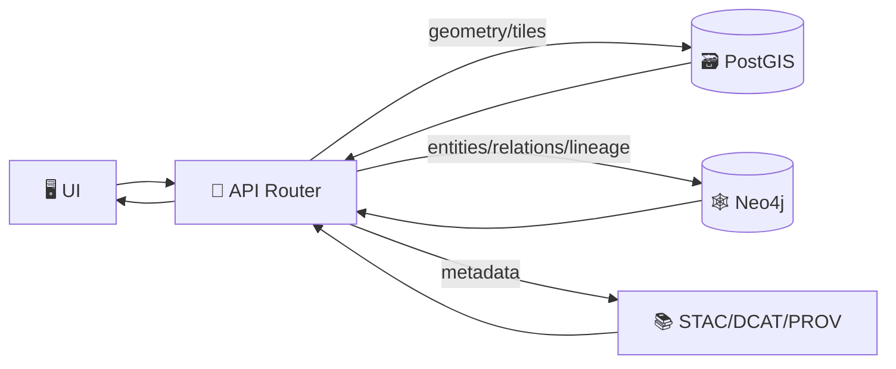

</details>

---

<details>
<summary><strong>🤖 D06 — Focus Mode Pipeline</strong> (RAG + governance + ledger)</summary>

Focus Mode is policy-wrapped by design:

- **Prompt Gate** (sanitize, detect injection, reject disallowed requests) 🛡️  
- **Retrieval** (catalogs + graph + spatial) 🔎  
- **Generation** (draft + citation map) ✍️  
- **Governance** (citations required; sensitivity/bias checks; redact/refuse) 🚦  
- **Ledger/PROV** (AI answer is a traceable derived product) 🧾🧬

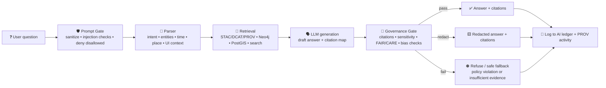

### Focus Mode sequence (who talks to whom)

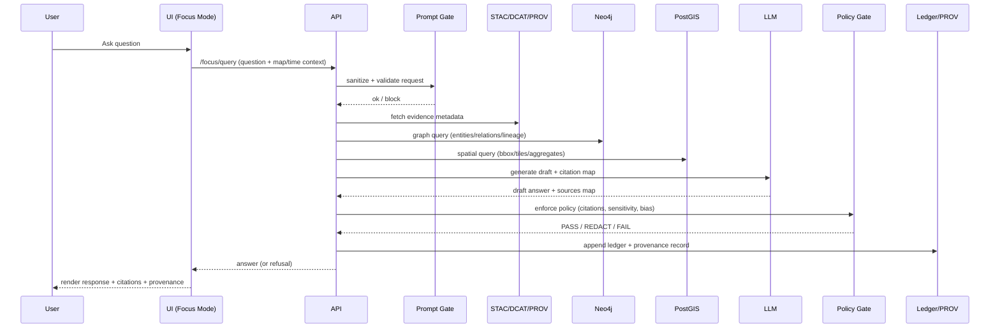

</details>

---

<details>
<summary><strong>🛰 D07 — Watcher–Planner–Executor (W‑P‑E)</strong> (safe automation)</summary>

W‑P‑E is “automation that ships PRs, not silent mutations.”  
It integrates with policy-as-code checks and supply-chain artifacts (checksums/SBOM) so every change is auditable. 🔀✅

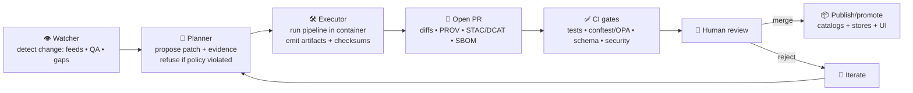

</details>

---

<details>
<summary><strong>🗺 D08 — UI Composition</strong> (Map + Timeline + Story + Focus + Offline)</summary>

The UI is “trust-first”:
- provenance panels + clickable citations 🧾  
- restriction icons + warnings for governed layers 🔒⚠️  
- offline packs for field use (subset bundles) 🧳📱

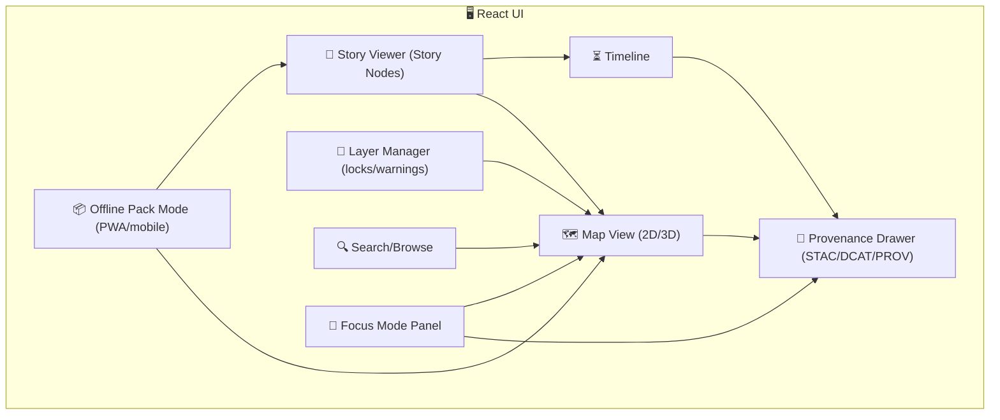

</details>

---

<details>
<summary><strong>🌐 D09 — Federation</strong> (multi-region interoperability)</summary>

Federation is driven by open catalogs and config:
- harvest/merge catalogs (DCAT/STAC) 🗂️  
- UI swaps endpoints based on region/config 🧭  
- optional GraphQL federation patterns for cross-region querying 🧬

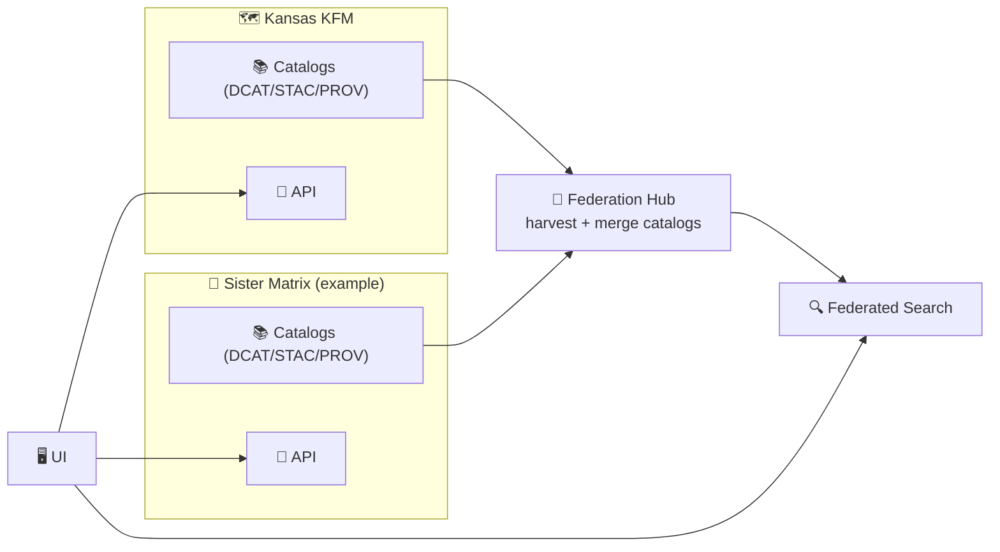

</details>

---

<details>
<summary><strong>⚡ D10 — Real‑Time Feeds</strong> (watchers → events → UI layers)</summary>

Real-time layers follow the same governance rules as batch data — policy gates first, then publish. ⚡✅

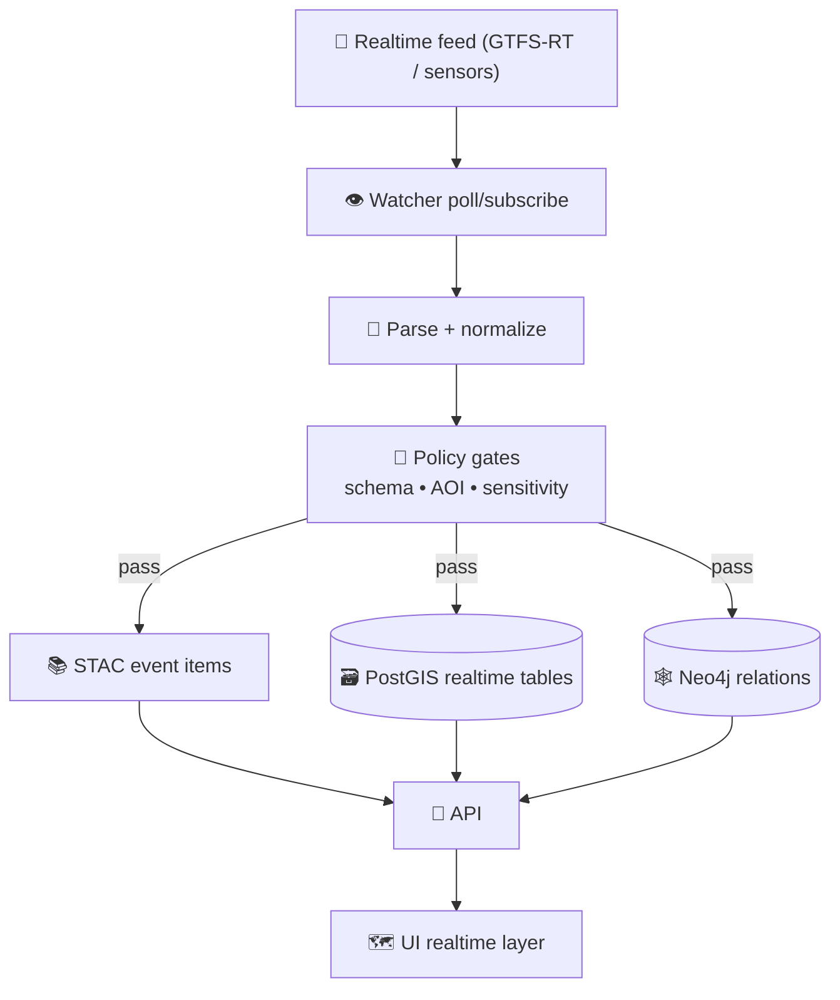

</details>

---

<details>
<summary><strong>🧪 D11 — Simulation Promotion Path</strong> (sandbox → verified → published)</summary>

Sims are powerful — and dangerous — unless promotion is explicit:
- run in **work/sandbox**
- validate + peer review + policy gate
- only then promote to processed/cataloged outputs ✅🧾

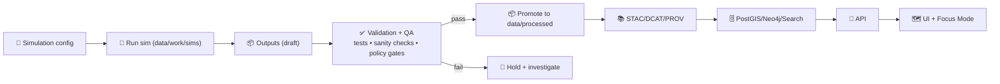

</details>

---

<details>
<summary><strong>🔒 D12 — Sensitivity + Sovereignty Controls</strong> (CARE-driven UX + policy)</summary>

KFM handles sensitive/sovereign data by:
- propagating governance metadata (FAIR/CARE flags) 🏷️  
- enforcing access control at API/runtime 🔐  
- using generalization (e.g., bins) for public views 🟦  
- showing UI warnings/locks and contextual disclaimers 🔒⚠️

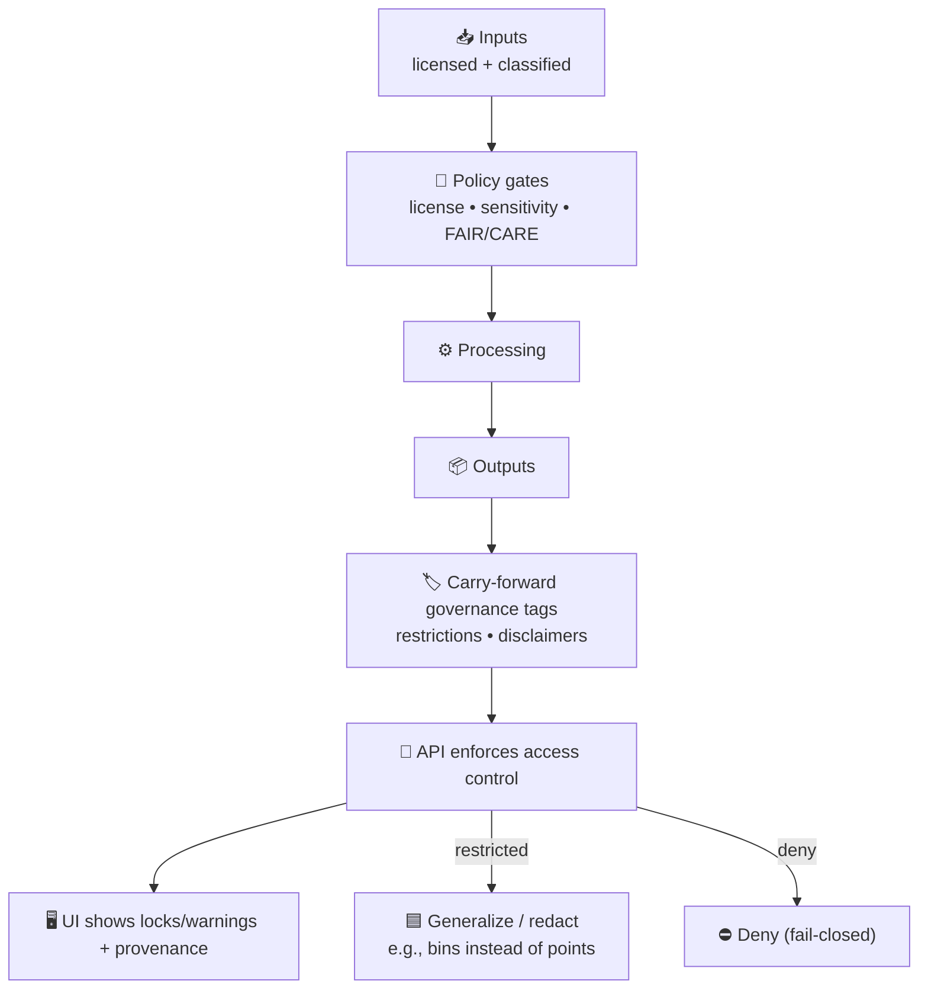

</details>

---

## ✅ Standards & CI

### 🧼 Mermaid conventions (keep diagrams diffable)

1. ✅ Keep node labels short (put prose outside the diagram).  
2. ✅ Quote labels if punctuation gets weird.  
3. ✅ Prefer `flowchart LR` for pipelines (reads like a “spine”).  
4. ✅ Avoid fancy Markdown inside node labels.  
5. ✅ Treat diagrams as *source code* (review diffs like code). 👀

### 🧾 Governed documentation patterns (recommended)

For “contract docs” (like this README or any diagram notes), use **YAML front-matter** and enforce required fields in CI (title, status, version, last_updated, classification, etc.). 🧷

### 🖼 Exports: why `.svg` is preferred

- Stable, crisp, searchable text 🔍  
- Good PR diffs (size and structure are reviewable)  
- Works across docs systems

### 🧪 Suggested CI checks

- Mermaid parse + render (fail the build if invalid)  
- Ensure `.svg` exports are up to date with `.mmd` sources  
- Policy gates for doc metadata (front-matter fields)  
- Lint: Markdown + Mermaid formatting  
- Security hygiene: secrets scan, dependency audits (where applicable) 🛡️

---

## 🧪 Definition of Done

Use this checklist when adding/updating a diagram:

- [ ] Added/updated **Diagram Index** entry  
- [ ] Diagram answers at least **one clear question**  
- [ ] `.mmd` source committed  
- [ ] `.svg` export committed (or justified why not)  
- [ ] Labels are readable + minimal (prose outside)  
- [ ] Evidence tags included (ARCH/TECH/UI/AI/…)  
- [ ] CI passes (Mermaid validation + doc checks)  
- [ ] If the diagram changes system behavior, open/update an issue or ADR 🧾

---

## 📎 Sources (Project Files)

> These are the project docs used to ground the diagram set and the governance rules described here.

### 🧭 Core KFM documents (primary)

- **📘 KFM — Platform Overview & Roadmap**  [oai_citation:0‡Kansas Frontier Matrix (KFM) – Comprehensive Platform Overview and Roadmap.pdf](file-service://file-J9i6fUc35zPWB2U62zUnEN)  
- **🏗️ KFM — Comprehensive Architecture, Features, and Design**  [oai_citation:1‡Kansas Frontier Matrix (KFM) – Comprehensive Architecture, Features, and Design.pdf](file-service://file-Qj23Z329hf1Q1WD86hXYfL)  
- **🧠 KFM — AI System Overview 🧭🤖**  [oai_citation:2‡Kansas Frontier Matrix (KFM) – AI System Overview 🧭🤖.pdf](file-service://file-P4zHoJicw1HG6bXmqFygG8)  
- **🖥️ KFM — UI System Overview (Technical Architecture Guide)**  [oai_citation:3‡Kansas Frontier Matrix (KFM) – Comprehensive UI System Overview (Technical Architecture Guide).pdf](file-service://file-MbEYbsLWBmpXVYXVF79c38)  
- **📚 KFM — Expanded Technical & Design Guide**  [oai_citation:4‡📚 Kansas Frontier Matrix (KFM) – Expanded Technical & Design Guide.pdf](file-service://file-Tjmzn5F3sT5VNvVFhqj1Vo)  [oai_citation:5‡📚 Kansas Frontier Matrix (KFM) – Expanded Technical & Design Guide.pdf](file-service://file-Tjmzn5F3sT5VNvVFhqj1Vo)  
- **📗 KFM — Comprehensive Technical Documentation**  [oai_citation:6‡Kansas Frontier Matrix (KFM) – Comprehensive Technical Documentation.pdf](file-service://file-VgLA7nv34M5muqZ5MQxBLG)  [oai_citation:7‡Kansas Frontier Matrix (KFM) – Comprehensive Technical Documentation.pdf](file-service://file-VgLA7nv34M5muqZ5MQxBLG)  

### 🤖 LLM runtime + infrastructure

- **🦙 KFM AI Infrastructure — Ollama Integration Overview**  [oai_citation:8‡KFM AI Infrastructure – Ollama Integration Overview.pdf](file-service://file-HCn72HddNvaaXqpJL4svTv)  [oai_citation:9‡KFM AI Infrastructure – Ollama Integration Overview.pdf](file-service://file-HCn72HddNvaaXqpJL4svTv)  

### 🧾 Documentation & rigor (process)

- **🧷 MARKDOWN_GUIDE_v13 (governed docs patterns)**  [oai_citation:10‡MARKDOWN_GUIDE_v13.md.gdoc](file-service://file-UYVruFXfueR8veHMUKeugU)  
- **🧪 Scientific Method / Master Coder Protocol (reproducibility & review discipline)**  [oai_citation:11‡Scientific Method _ Research _ Master Coder Protocol Documentation.pdf](file-service://file-HTpax4QbDgguDwxwwyiS32)  
- **📝 Comprehensive Markdown Guide (syntax + governance suggestions)**  [oai_citation:12‡Comprehensive Markdown Guide_ Syntax, Extensions, and Best Practices.docx](file-service://file-J6rFRcp4ExCCeCdTevQjxz)  

### 🗺️ Adjacent / legacy concept docs (useful context)

- **🗺 Kansas-Frontier-Matrix — Open-source Geospatial Historical Mapping Hub Design**  [oai_citation:13‡Data Mining Concepts & applictions.pdf](file-service://file-2uwEbQAFVKpXaTtWgUirAH)  

---

## 🧰 Reference Libraries

> These are “toolbox” libraries that influence architecture decisions (geospatial, AI, data engineering, security).  
> They are often **portfolios** containing multiple embedded PDFs/books.

- **🧠 AI Concepts & more (portfolio)**  [oai_citation:14‡AI Concepts & more.pdf](file-service://file-K6BctJjeUwvyCahLf9qdwr)  
- **🗺 Maps / Google Maps / Virtual Worlds / Archaeology / WebGL (portfolio)**  [oai_citation:15‡Maps-GoogleMaps-VirtualWorlds-Archaeological-Computer Graphics-Geospatial-webgl.pdf](file-service://file-RshcX5sNY2wpiNjRfoP6z6)  
- **🧰 Various programming languages & resources (portfolio)**  [oai_citation:16‡Various programming langurages & resources 1.pdf](file-service://file-4wp3wSSZs7gk5qHWaJVudi)  
- **🗄 Data Management / Architectures / Data Science / Bayesian Methods (portfolio)**  [oai_citation:17‡Data Managment-Theories-Architures-Data Science-Baysian Methods-Some Programming Ideas.pdf](file-service://file-RrXMFY7cP925exsQYermf2)  
- **🐍 Mapping/Modeling + Python/Git/HTTP/CSS/Docker/GraphQL/Security (portfolio)**  [oai_citation:18‡Mapping-Modeling-Python-Git-HTTP-CSS-Docker-GraphQL-Data Compression-Linux-Security.pdf](file-service://file-2QvRgQbts8ENJQSRC6oGme)  
- **🧭 Geographic Info + Security + R/SciPy/MATLAB/ArcGIS/Spark/TypeScript/Web Apps (portfolio)**  [oai_citation:19‡Geographic Information-Security-Git-R coding-SciPy-MATLAB-ArcGIS-Apache Spark-Type Script-Web Applications.pdf](file-service://file-TH7HttQXn8Bh1hVhcj858V)  

### 📚 Selected deep dives (pulled from the library)

- **🧬 Python Geospatial Analysis Cookbook (PostGIS recipes, APIs, routing)**  [oai_citation:20‡KFM- python-geospatial-analysis-cookbook-over-60-recipes-to-work-with-topology-overlays-indoor-routing-and-web-application-analysis-with-python.pdf](file-service://file-2gpiGDZS8iw6EdxGswEdHp)  
- **🔐 Data Mining — Concepts & Applications (privacy techniques, auditing, differential privacy)**  [oai_citation:21‡Data Mining Concepts & applictions.pdf](file-service://file-2uwEbQAFVKpXaTtWgUirAH)  

---

## 🧯 If something changes…

If code, pipelines, governance, or UI behavior diverge from these diagrams, treat it as a **documentation bug**:

- update the diagram(s), or  
- open a tracking issue, or  
- add a “Known divergence” note in the diagram section.

Because KFM’s promise is **clarity + auditability**, and diagrams are part of how we enforce that promise. ✅🧭🧾