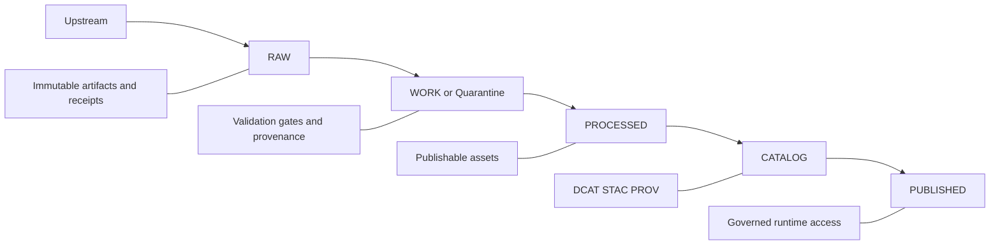
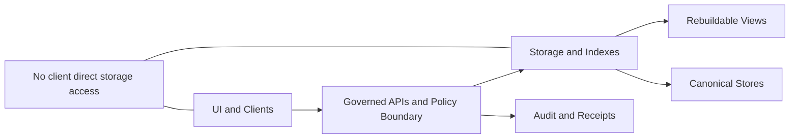
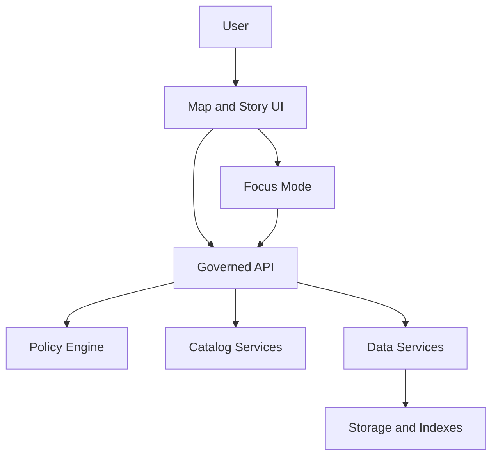
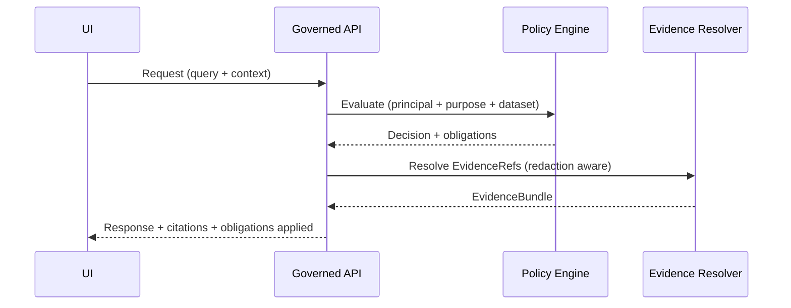

<!-- [KFM_META_BLOCK_V2]
doc_id: kfm://doc/0c7d1c3e-2d0b-4e5f-9f08-1b1f0f0b8c9b
title: Architecture Diagrams README
type: standard
version: v1
status: draft
owners: KFM Maintainers
created: 2026-03-01
updated: 2026-03-01
policy_label: public
related:
  - kfm://doc/architecture
tags: [kfm, architecture, diagrams]
notes:
  - Diagrams-as-code first; exports are derived artifacts.
  - Every diagram that justifies a claim should point to evidence and/or ADRs.
[/KFM_META_BLOCK_V2] -->

# KFM Architecture Diagrams
Map-first, time-aware architecture diagrams (as code) for the Kansas Frontier Matrix (KFM).


> **Purpose**
> This folder is the *single* home for KFM architecture diagrams (system context, data flow, trust membrane, deployment, and runtime boundaries). The diagrams here should be versionable, reviewable, and traceable to the same governance standards as code and schemas.

---

## Quick navigation
- [What belongs here](#what-belongs-here)
- [What must not go here](#what-must-not-go-here)
- [Diagram standards](#diagram-standards)
- [Naming conventions](#naming-conventions)
- [Rendering and exports](#rendering-and-exports)
- [Diagram registry](#diagram-registry)
- [Change workflow](#change-workflow)
- [Templates](#templates)

---

## What belongs here

### ✅ Source diagrams
Prefer **diagrams-as-code** so we can diff and review changes:

- Mermaid: `*.mmd` / `*.md` Mermaid blocks
- PlantUML: `*.puml`
- Draw.io / Diagrams.net: `*.drawio` *(only if an editable source is checked in; avoid “export-only”)*  
- Excalidraw: `*.excalidraw` *(same rule: editable source required)*

### ✅ Derived exports (optional, but recommended)
Exports are helpful for docs and UI embedding, but they are **derived**:

- `*.svg` preferred (diff-friendly-ish, scalable)
- `*.png` acceptable (for platforms that can’t render SVG)
- `*.pdf` acceptable for print packets

> **TIP:** If you commit exports, make them reproducible and keep the *source* diagram authoritative.

---

## What must not go here

- ❌ “Mystery” images (PNG/SVG) with **no editable source** (no `.mmd`, `.puml`, `.drawio`, etc.)
- ❌ Screenshots of whiteboards / slides that cannot be maintained as part of the repo’s truth path
- ❌ Sensitive location details (exact coordinates) for vulnerable/private/culturally restricted sites
- ❌ Diagrams that imply a **direct client → database/storage** path (this violates the trust membrane)

> **WARNING:** If a diagram includes sensitive sites or operational security detail, it must be generalized/redacted and labeled appropriately (policy label, obligations, and reviewer).

---

## Diagram standards

### 1) Align with KFM invariants
All architecture diagrams **MUST** respect and reinforce:
- **Truth path lifecycle** (Upstream → RAW → WORK/Quarantine → PROCESSED → CATALOG → PUBLISHED)
- **Trust membrane**: clients/UX never touch storage directly; access flows through governed APIs/policy boundaries.

### 2) Each diagram must be “reviewable”
Each diagram **SHOULD** include (in-file comment header or adjacent `*.meta.md`):
- `diagram_id` (stable)
- title
- owners
- status (`draft|review|published`)
- updated date
- links to:
  - ADRs (if diagram encodes a design decision)
  - evidence/specs (if diagram justifies a claim)
  - related components/contracts

**Recommended header (Mermaid comment):**
```text
%% diagram_id: kfm://diagram/<slug>
%% title: <Human title>
%% status: draft
%% owners: <team>
%% updated: 2026-03-01
%% related:
%%  - docs/architecture/README.md
%% evidence:
%%  - kfm://evidence/<id>
%% adrs:
%%  - docs/adr/000X-something.md
```

### 3) Prefer the KFM layering model
Use the architecture “stack” as your default lens:

- **Domain** → **Use cases** → **Interfaces (contracts/policy/adapters)** → **Infrastructure**

### 4) Don’t overload diagrams
One diagram = one job.

If a diagram tries to explain **everything**, split it:
- system context (who talks to whom)
- data flow (truth path)
- governance boundary (trust membrane, obligations)
- deployment topology (where it runs)
- sequence diagrams (runtime interactions)

---

## Naming conventions

Keep names sortable and scannable:

**Pattern**
`<area>__<topic>__<type>__v<major>.<ext>`

**Areas**
- `system` (context + major components)
- `data` (truth path, zones, promotion contract)
- `api` (governed API boundary + flows)
- `ui` (map/story/focus flows)
- `infra` (deployment topology)
- `security` (trust membrane, authz/authn, audit)

**Types**
- `context`, `components`, `flow`, `sequence`, `deployment`, `state`

**Examples**
- `system__kfm__context__v1.mmd`
- `data__truth-path__flow__v1.mmd`
- `security__trust-membrane__components__v1.mmd`

> **NOTE:** Version the diagram when meaning changes (not when cosmetics change).

---

## Rendering and exports

This repo may already have tooling for diagram rendering; if not, these are the **recommended** local patterns.

### Mermaid (recommended)
```bash
# Example: render SVG from Mermaid source
npx -y @mermaid-js/mermaid-cli \
  -i data__truth-path__flow__v1.mmd \
  -o exports/data__truth-path__flow__v1.svg
```

### PlantUML (optional)
```bash
# Example: render SVG from PlantUML source
java -jar plantuml.jar -tsvg security__trust-membrane__components__v1.puml
```

### Exports folder convention (recommended)
If you store exports, prefer a predictable location:

```text
docs/architecture/diagrams/
  exports/   # derived artifacts (svg/png/pdf)
  src/       # diagram sources (mmd/puml/drawio/excalidraw)
```

> **TODO:** If the repo already has a different convention, update this README to match it and keep only one standard.

---

## Diagram registry

Maintain a lightweight registry so we can answer: “What diagrams exist, and what are they for?”

| diagram_id | Title | Source | Exports | Scope | Owners | Status | Evidence/ADR |
|---|---|---|---|---|---|---|---|
| kfm://diagram/system-context | KFM System Context | `src/system__kfm__context__v1.mmd` | `exports/system__kfm__context__v1.svg` | platform | TODO | draft | TODO |
| kfm://diagram/truth-path | Truth Path Lifecycle | `src/data__truth-path__flow__v1.mmd` | `exports/data__truth-path__flow__v1.svg` | data/pipeline | TODO | draft | TODO |
| kfm://diagram/trust-membrane | Trust Membrane Boundary | `src/security__trust-membrane__components__v1.mmd` | `exports/security__trust-membrane__components__v1.svg` | governance | TODO | draft | TODO |
| kfm://diagram/deploy-topology | Deployment Topology | `src/infra__deployment__deployment__v1.mmd` | `exports/infra__deployment__deployment__v1.svg` | infra | TODO | draft | TODO |

> **TIP:** Keep the registry honest. If a diagram doesn’t exist yet, it should be clearly labeled `TODO` (or omitted).

---

## Change workflow

### When adding a new diagram
- [ ] Create/edit the **source** diagram (Mermaid/PlantUML/etc.)
- [ ] Include or link to diagram metadata (owners, status, updated date)
- [ ] If the diagram encodes a design decision, add/link an ADR
- [ ] Render exports (if used) and commit them
- [ ] Add/Update the registry entry
- [ ] Ensure the diagram does **not** violate governance (trust membrane, redaction obligations)

### When changing an existing diagram
- [ ] Confirm whether the change is **cosmetic** or **semantic**
- [ ] If semantic: bump `v<major>` and update registry
- [ ] Verify related docs remain consistent (architecture docs, contracts, runbooks)

---

## Templates

### Template: KFM Truth Path (Mermaid)


### Template: Trust Membrane (Mermaid)


<details>
<summary>More templates (context, components, sequence)</summary>

### System context (Mermaid)


### Sequence (Mermaid)


</details>

---

<a id="back-to-top"></a>
**Back to top:** [KFM Architecture Diagrams](#kfm-architecture-diagrams)
