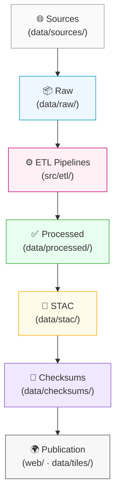

<div align="center">

# 🧩 **Kansas Frontier Matrix — Architecture Diagrams (v2.0.0 · Tier-Ω+∞ Certified)**  
`docs/architecture/diagrams/`

**Mission:** Provide a centralized, version-controlled **visual documentation library** for the **Kansas Frontier Matrix (KFM)** — illustrating **system workflows**, **data pipelines**, **CI/CD automation**, **knowledge-graph semantics**, and **provenance chains** using **reproducible** and **auditable** diagrams.

[](../../../docs/)
[](../../../.github/workflows/stac-validate.yml)
[](../../../.github/workflows/sbom.yml)
[](../../../.github/workflows/slsa.yml)
[](../../../LICENSE)

</div>

---

```yaml
---
title: "Kansas Frontier Matrix — Architecture Diagrams"
document_type: "Diagram Library Index"
version: "v2.0.0"
last_updated: "2025-11-16"
owners: ["@kfm-architecture","@kfm-docs","@kfm-security"]
status: "Stable"
maturity: "Production"
license: "CC-BY 4.0"
tags: ["architecture","diagrams","mermaid","svg","png","provenance","ci","observability"]
alignment:
  - MCP-DL v6.3
  - FAIR / CARE
  - WCAG 2.1 AA (docs)
validation:
  docs_ci_required: true
  mermaid_end_marker: "<!-- END OF MERMAID -->"
  frontmatter_required: ["title","version","last_updated","owners","license"]
observability:
  endpoint: "https://metrics.kfm.ai/docs/diagrams"
  metrics: ["diagram_parse_rate_pct","export_success_pct","broken_link_count","frontmatter_coverage_pct"]
preservation_policy:
  retention: "exports 365d · logs 90d"
  checksum_algorithm: "SHA-256"
---
```

---

## 📚 Overview

`docs/architecture/diagrams/` stores **Mermaid sources (`.mmd`)** and **exports (`.svg`/`.png`)** that accompany the architecture docs.  
Every diagram is: **open-standard**, **renderable in CI**, **captioned**, and **linked** from its parent document. Exports include **provenance metadata** (author, date, version, checksum) in their footer.

---

## 🗂️ Directory Layout

```bash
docs/architecture/diagrams/
├── README.md                        # This index (you are here)
├── data_flow.mmd                    # ETL + validation pipeline
├── web_ui_architecture.mmd          # MapLibre + STAC + UI integration
├── provenance_chain.mmd             # End-to-end lineage + checksums
├── ci_cd_pipeline.mmd               # Actions & policy gates overview
├── system_overview.mmd              # Full KFM system snapshot
├── knowledge_graph.mmd              # CIDOC/PROV/Time schema overview
├── exported/                        # Rendered diagrams (CI produced)
│   ├── data_flow.svg
│   ├── web_ui_architecture.png
│   ├── provenance_chain.svg
│   ├── ci_cd_pipeline.png
│   └── system_overview.svg
└── templates/
    ├── blank_flowchart.mmd
    ├── swimlane_template.mmd
    └── er_template.mmd
```

> **Rule:** Every `.mmd` must render in GitHub and end with `<!-- END OF MERMAID -->`. CI will fail otherwise.

---

## 🧠 Diagram Categories

| Category             | File(s)                                  | Purpose |
|:--|:--|:--|
| **Data Flow & ETL**  | `data_flow.mmd`, `provenance_chain.mmd`  | Source→raw→processed→STAC→checksums→publication |
| **Web Architecture** | `web_ui_architecture.mmd`                | STAC-driven layers, timeline sync, popups |
| **System Overview**  | `system_overview.mmd`                    | Unified view of ETL/AI/KG/API/Web/CI |
| **CI/CD Pipeline**   | `ci_cd_pipeline.mmd`                     | Pre-commit → validation → security → deploy → attest |
| **Knowledge Graph**  | `knowledge_graph.mmd`                    | CIDOC CRM / PROV-O / OWL-Time / GeoSPARQL alignment |

---

## 🧩 Standards for Diagram Creation

| Standard | Requirement | Description |
|:--|:--|:--|
| **Format** | `.mmd` + `.svg`/`.png` | Source and export must co-exist in repo |
| **Color & Contrast** | WCAG AA | Use accessible palette tokens (see below) |
| **Font/Theme** | Minimal, neutral | Avoid proprietary fonts/colors |
| **Labels** | Plain text | ASCII; disambiguate acronyms |
| **Commit** | `add(diagram): <name>` | Semantic commits for adds/changes |
| **Provenance** | Footer metadata | Embed author/date/version/checksum in exports |

**Accessible palette tokens (suggested):**

```yaml
diagram_palette:
  accent: "#3BAFDA"
  ok: "#2E7D32"
  warn: "#F9A825"
  error: "#D32F2F"
  neutral: "#1A1A1A"
```

---

## 🧪 Rendering & Export

### 1) View in GitHub  
Mermaid code is rendered natively inside `.md` files.

### 2) Export Locally (CLI)
```bash
# Single export
npx @mermaid-js/mermaid-cli -i data_flow.mmd -o exported/data_flow.svg

# Build all exports + validate syntax
make diagrams
```

**What `make diagrams` does**
- Validates Mermaid syntax  
- Exports `.svg/.png` to `exported/`  
- Writes `exported/exports.sha256` (checksums)  
- Updates doc references where needed

---

## 🧭 Example: Data Flow (Mermaid)


<!-- END OF MERMAID -->

---

## 🔗 Embedding & Cross-References

| Document | Diagram(s) | Embed Syntax |
|:--|:--|:--|
| `architecture/architecture.md` | `system_overview.mmd`, `ci_cd_pipeline.mmd` | Inline Mermaid or exported `.svg` |
| `architecture/data-architecture.md` | `data_flow.mmd`, `provenance_chain.mmd` | `` |
| `architecture/web-ui-architecture.md` | `web_ui_architecture.mmd` | Same |
| `data/ARCHITECTURE.md` | `data_flow.mmd` | Same |

---

## 🧷 File Naming & Paths

- **Sources**: `kebab-case.mmd` (e.g., `knowledge_graph.mmd`)  
- **Exports**: same basename in `exported/` with `.svg` or `.png`  
- **Relative paths** only in markdown (`diagrams/exported/<file>.svg`)

---

## 🔐 CI Integration

**Workflow snippet** (`docs-validate.yml` excerpt):

```yaml
- name: Validate Mermaid syntax
  run: npx @mermaid-js/mermaid-cli -i docs/architecture/diagrams/system_overview.mmd -o /tmp/test.svg

- name: Build all diagram exports
  run: make diagrams

- name: Check export checksums
  run: sha256sum -c docs/architecture/diagrams/exported/exports.sha256
```

**Policy-as-Code (OPA) gates**  
- Diagrams must end with `<!-- END OF MERMAID -->`  
- Exports must exist for changed `.mmd` sources  
- README must reference new diagrams

---

## ♿ Accessibility & Localization

- Use **plain labels**, avoid color-only meaning; add icons/shape variations when implying status.  
- Ensure **contrast ≥ 4.5:1** for text; ≥ 3:1 for icons/lines.  
- Keep **font sizes** legible when exported (`≥ 12–14 px` at 100%).  
- If diagram includes language strings for UI, provide **BCP-47 `lang` hints** in captions.

---

## 📈 Observability

```yaml
diagram_metrics:
  export_to: "https://metrics.kfm.ai/docs/diagrams"
  fields:
    - diagram_parse_rate_pct
    - export_success_pct
    - broken_link_count
    - frontmatter_coverage_pct
  budgets:
    diagram_parse_rate_pct: 100
    export_success_pct: 100
    broken_link_count: 0
```

---

## 🧪 Provenance & Checksums

On export, CI writes **checksums** and a **provenance JSON**:

```json
{
  "diagram": "data_flow.svg",
  "sha256": "f1b7…",
  "source": "data_flow.mmd",
  "generated_by": "mermaid-cli@<ver>",
  "timestamp": "2025-11-16T09:15:00Z",
  "author": "@kfm-architecture",
  "version": "v2.0.0"
}
```

---

## 🧰 Templates (Start Here)

- `templates/blank_flowchart.mmd` — minimal flow skeleton  
- `templates/swimlane_template.mmd` — roles & handoffs  
- `templates/er_template.mmd` — entity–relationship layout

---

## 🧭 Gallery (Auto-Generated)

> CI injects a thumbnail grid based on `exported/` contents.

<!-- gallery:start -->
<!-- gallery:end -->

---

## 🧠 MCP Compliance Summary

| Pillar | Implementation |
|:--|:--|
| Documentation-first | Each diagram has `.mmd` source, caption, and cross-links |
| Reproducibility | Deterministic CLI export + SHA-256 checks |
| Open Standards | Mermaid + SVG/PNG (open specs) |
| Provenance | Footer tags in exports + `.prov.json` |
| Auditability | CI gates & metrics with public artifacts |

---

## 📎 Related Documentation

- `docs/architecture/architecture.md` — System overview  
- `docs/architecture/data-architecture.md` — Data flow & lineage  
- `docs/architecture/web-ui-architecture.md` — UI integration  
- `.github/workflows/README.md` — CI/CD diagram workflow details

---

## 🗓 Version History

| Version | Date | Summary |
|:--|:--|:--|
| **v2.0.0** | 2025-11-16 | Tier-Ω+∞: added CI export pipeline, accessibility palette, provenance JSON, auto gallery, OPA gates, metrics & budgets, and strict end-marker policy. |
| v1.0.0 | 2025-10-04 | Initial diagram directory with Mermaid sources and exported assets. |

---

<div align="center">

**Kansas Frontier Matrix — Architecture Diagrams**  
*“Visualizing Systems for a Transparent, Reproducible Future.”*  
📍 `docs/architecture/diagrams/` — Source-of-truth for KFM visual documentation.

</div>