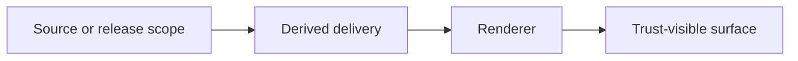
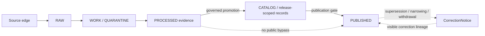
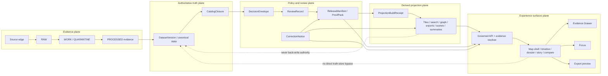
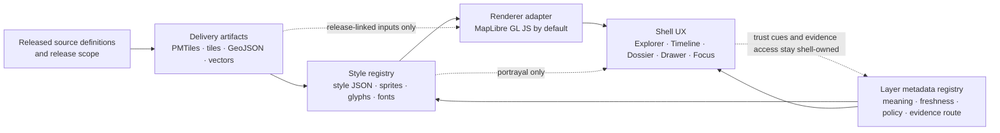
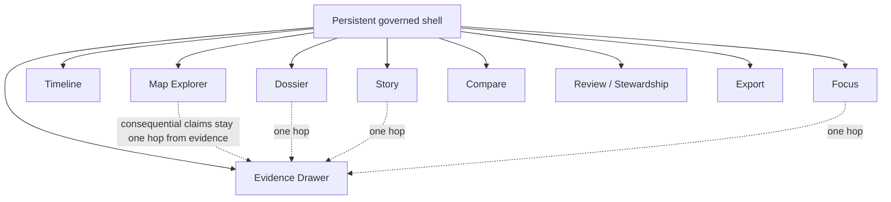

<!-- [KFM_META_BLOCK_V2]
doc_id: kfm://doc/<uuid-to-confirm>
title: Architecture Diagrams
type: standard
version: v1
status: draft
owners: <owners-to-confirm>
created: YYYY-MM-DD
updated: YYYY-MM-DD
policy_label: <policy-label-to-confirm>
related: [<parent-architecture-index-to-confirm>, <adjacent-diagram-assets-to-confirm>]
tags: [kfm]
notes: [Current-session doctrine is CONFIRMED from attached March 2026 KFM manuals; repo-local owners, dates, policy label, and directory inventory remain NEEDS VERIFICATION.]
[/KFM_META_BLOCK_V2] -->

# Architecture Diagrams

Diagram registry, authoring rules, and working guidance for KFM architecture visuals.

| Impact block | Value |
| --- | --- |
| Status | `experimental` *(conservative placeholder until mounted repo maturity is verified)* |
| Owners | `TODO — owners not directly visible in current session` |
| Path | `docs/architecture/diagrams/README.md` |
| Badges |     |
| Quick jump | [Scope](#scope) · [Repo fit](#repo-fit) · [Inputs](#inputs) · [Exclusions](#exclusions) · [Directory tree](#directory-tree) · [Quickstart](#quickstart) · [Usage](#usage) · [Diagram](#diagram) · [Tables](#tables) · [Task list](#task-list--definition-of-done) · [FAQ](#faq) · [Appendix](#appendix) |

> [!IMPORTANT]
> This README is doctrine-grounded but repo-topology-bounded. The attached March 2026 KFM manuals clearly confirm the architecture subjects that belong in this directory, but the mounted repository tree for `docs/architecture/diagrams/` was not directly visible in the current session. Anything about current file inventory, local owners, or adjacent links is therefore marked **PROPOSED**, **UNKNOWN**, or **NEEDS VERIFICATION** rather than being presented as settled repo fact.

## Scope

This directory should hold the diagrams that make KFM's governing architecture inspectable rather than implicit.

In practice, that means diagrams here should center the subjects the corpus treats as load-bearing:

- **CONFIRMED doctrine:** the governed truth path, the trust membrane, the authoritative-versus-derived split, the five-plane model, the map-first and time-aware shell, the Evidence Drawer, finite runtime outcomes, and 2D-first reasoning.
- **CONFIRMED architectural seams:** source onboarding as contract, release-bearing artifact flow, source → delivery → style → renderer → UX ordering, route families, and proof-bearing correction flow.
- **PROPOSED starter packaging:** specific filenames, subfolders, companion notes, and rendered export locations.

### Source basis used for this README

The diagram subjects below were grounded primarily in these attached KFM documents:

- `KFM_Replacement_Grade_Blueprint_Expanded_Final.pdf`
- `kfm_unified_geospatial_architecture_manual_extended.pdf`
- `KFM_MapLibre_UI_Architecture_and_Governed_Interaction_Design.pdf`
- `kfm_components_pass_8_idea_index_category_atlas_expansion_dossier.pdf`
- `Kansas Frontier Matrix Repo-Grounded Deep Research Sprint.pdf`

Supporting ecosystem context used cautiously:

- `MapLibre Ecosystem Research Dossier.pdf`
- `Cesium Ecosystem Technical Knowledge Base Dossier.pdf`

### Reading key

| Label | Meaning in this README |
| --- | --- |
| **CONFIRMED** | Directly supported by the attached KFM doctrine and architecture manuals visible in this session. |
| **INFERRED** | Strongly implied by repeated KFM doctrine, but not directly verified as mounted implementation in the current session. |
| **PROPOSED** | Recommended directory shape, filename, or maintenance pattern that fits the doctrine but was not directly verified in a mounted repo tree. |
| **UNKNOWN** | The current repo state could not be confirmed from directly visible workspace evidence. |
| **NEEDS VERIFICATION** | A specific value should be checked against the mounted repository before commit. |

[Back to top](#architecture-diagrams)

## Repo fit

### Directory role

This README is the working index for the architecture-diagram layer of the repo.

### Path

`docs/architecture/diagrams/README.md`

### Upstream links

- **NEEDS VERIFICATION:** parent architecture index (`<parent-architecture-index-to-confirm>`)
- **NEEDS VERIFICATION:** central architecture/manual index used by repo navigation

### Downstream links

- **NEEDS VERIFICATION:** actual diagram source files beside this README
- **NEEDS VERIFICATION:** rendered exports only after they are confirmed to be generated from governed diagram sources rather than edited by hand

### Fit with the wider architecture set

This directory should sit *below* the core architecture manuals and *above* implementation-specific app, contract, and runbook details:

- Upstream doctrine explains **what** KFM must preserve.
- The diagrams here make those constraints easy to inspect during review.
- Downstream docs, contracts, schemas, tests, and runbooks prove whether the implementation actually follows the diagrams.

[Back to top](#architecture-diagrams)

## Inputs

Accepted inputs for this directory should be narrow and architecture-bearing.

### What belongs here

- Diagram sources that explain **authority**, **flow**, **boundary**, **surface**, or **artifact** relationships.
- Short diagram-adjacent notes that say what is **CONFIRMED**, **INFERRED**, **PROPOSED**, and **UNKNOWN**.
- Release-linked exports of those diagrams when the export is reproducible from the diagram source.
- Diagram packs for thin-slice review, especially where they help teams inspect the hydrology-first path end to end.

### Preferred input types

These file types are **PROPOSED** starter defaults until the actual repo tooling is verified:

- Mermaid diagrams embedded in Markdown or kept as adjacent `.mmd` sources.
- Rendered `.svg` exports for stable review and diff-friendly PR discussion.
- Small companion notes for assumptions, source basis, and update triggers.

### Minimum input quality

A diagram entering this directory should already answer four questions:

1. What architecture question is this diagram helping a reviewer answer?
2. Which elements are **CONFIRMED** doctrine and which are merely **PROPOSED** realization?
3. Where is the trust boundary?
4. What would make this diagram misleading if left unqualified?

[Back to top](#architecture-diagrams)

## Exclusions

This directory should stay disciplined.

### What does **not** belong here

- Marketing graphics, polished hero art, or persuasion-first product visuals.
- Screenshots used as primary truth instead of diagrams tied to doctrine or contracts.
- Full policy prose, ADR bodies, or runbooks that belong in their own documentation surfaces.
- API schemas, payload definitions, or route inventories presented here *as if* the diagram were the canonical contract.
- Unverified repo paths, service names, or route trees drawn as current reality.
- 3D-heavy visuals that do not explicitly justify why disciplined 2D is insufficient.

### Where those things should go instead

- Policy semantics belong in the repo's policy and governance docs.
- Canonical payload shape belongs in contract/schema surfaces.
- Operational drills belong in testing, verification, or runbook docs.
- Product marketing or presentation visuals belong in product/design materials, not the architecture truth layer.

[Back to top](#architecture-diagrams)

## Directory tree

**Current mounted directory inventory:** **UNKNOWN**.

Because the repo tree was not directly visible, the tree below is a **PROPOSED starter layout**, not a claim about current files.

```text
docs/
└── architecture/
    └── diagrams/
        ├── README.md
        ├── context/                  # PROPOSED: system-level context and authority diagrams
        │   ├── kfm-context-five-plane-authority.mmd
        │   ├── kfm-context-truth-path-lifecycle.mmd
        │   └── kfm-context-shell-surface-family.mmd
        ├── delivery/                 # PROPOSED: source→delivery→style→renderer→UX and projection flow
        │   ├── kfm-delivery-source-to-renderer-stack.mmd
        │   └── kfm-delivery-projection-build-flow.mmd
        ├── contracts/                # PROPOSED: artifact lattice and runtime outcome diagrams
        │   ├── kfm-contracts-artifact-lattice.mmd
        │   └── kfm-contracts-runtime-outcomes.mmd
        ├── slices/                   # PROPOSED: thin-slice diagrams such as hydrology-first
        │   └── kfm-slices-hydrology-first-thin-slice.mmd
        └── exports/                  # PROPOSED: rendered SVG or PNG outputs derived from sources above
```

> [!NOTE]
> The manuals are explicit that documentation is part of production and that release evidence should include documentation and accessibility gate results. That makes this directory more than a sketch folder: it should be maintained like a governed architecture surface.

[Back to top](#architecture-diagrams)

## Quickstart

### Add or update a diagram in a review-safe way

1. Start from one architecture question, not from a blank canvas.
2. Pull the smallest relevant doctrine set first.
3. Separate **CONFIRMED** doctrine from **INFERRED** or **PROPOSED** implementation shape.
4. Keep the trust membrane, truth path, and authoritative-versus-derived split visible if they matter to the subject.
5. Register the diagram in the table below before expanding it into variants.
6. Render-check the diagram in GitHub and confirm the text still reads clearly without color alone.

### Copy/paste starter block for a new diagram note

~~~md
### <diagram-id>

- Status: CONFIRMED / INFERRED / PROPOSED / UNKNOWN
- Primary question: <what reviewer question this diagram answers>
- Source basis: <attached KFM docs or verified repo docs>
- Non-goals: <what the diagram intentionally omits>
- Update trigger: <what repo or doctrine change should force a refresh>


```mermaid
flowchart LR
  A[Source or release scope] --> B[Derived delivery]
  B --> C[Renderer]
  C --> D[Trust-visible surface]
```
~~~

### First-pass review rule

If a diagram needs three paragraphs of oral explanation before it becomes trustworthy, it is not ready.

[Back to top](#architecture-diagrams)

## Usage

### Use this directory to make review faster, not looser

A good KFM architecture diagram should do at least one of these jobs well:

- explain **authority placement**;
- explain **state transition order**;
- explain **surface behavior and trust cues**;
- explain **contract/artifact dependency**; or
- explain **thin-slice sequencing**.

### Authoring rules

- Prefer one reviewer question per diagram.
- Keep business meaning in metadata, contracts, or notes when the corpus says it does **not** belong in portrayal logic.
- Show forbidden bypasses when they matter; do not draw only the happy path.
- When a diagram covers runtime behavior, include valid negative outcomes instead of erasing them.
- When a diagram covers UI, keep map and time coequal where the subject demands it.
- When a diagram covers delivery, keep source, delivery, style, renderer, and UX separate.

### Review rules

- Ask whether the diagram preserves KFM doctrine or merely makes the system look finished.
- Ask what evidence object or proof object anchors each consequential arrow.
- Ask whether the diagram hides **UNKNOWN** repo state under confident naming.
- Ask whether a smaller, more exact diagram would be safer.

[Back to top](#architecture-diagrams)

## Diagram

The four diagrams below are intentionally compact. They are meant to establish the directory's visual and doctrinal center of gravity, not to exhaust the full system.

### 1) Truth path lifecycle


```mermaid
flowchart LR
    SE[Source edge]
    RAW[RAW]
    WQ[WORK / QUARANTINE]
    PROC[PROCESSED evidence]
    CAT[CATALOG / release-scoped records]
    PUB[PUBLISHED]
    CN[CorrectionNotice]

    SE --> RAW --> WQ --> PROC -->|governed promotion| CAT -->|publication gate| PUB
    PUB -. supersession / narrowing / withdrawal .-> CN
    CN -. visible correction lineage .-> PUB
    PROC -. no public bypass .-> PUB
```

### 2) Five-plane authority model


```mermaid
flowchart LR
    subgraph P1[Evidence plane]
        SE[Source edge]
        RAW[RAW]
        WQ[WORK / QUARANTINE]
        PROC[PROCESSED evidence]
    end

    subgraph P2[Authoritative truth plane]
        DV[DatasetVersion / canonical state]
        CC[CatalogClosure]
    end

    subgraph P3[Policy and review plane]
        DE[DecisionEnvelope]
        RR[ReviewRecord]
        RM[ReleaseManifest / ProofPack]
        CN[CorrectionNotice]
    end

    subgraph P4[Derived projection plane]
        PB[ProjectionBuildReceipt]
        DP[Tiles / search / graph / exports / scenes / summaries]
    end

    subgraph P5[Experience surfaces plane]
        API[Governed API + evidence resolver]
        SHELL[Map shell / timeline / dossier / story / compare]
        DRAWER[Evidence Drawer]
        FOCUS[Focus]
        EXPORT[Export preview]
    end

    SE --> RAW --> WQ --> PROC --> DV --> CC --> DE --> RR --> RM
    RM --> PB --> DP --> API --> SHELL
    RM --> API
    SHELL --> DRAWER
    SHELL --> FOCUS
    SHELL --> EXPORT
    CN --> RM
    CN --> DP
    CN --> API

    DP -. never back-write authority .-> DV
    SHELL -. no direct truth-store bypass .-> DV
```

### 3) Source → delivery → style → renderer → UX


```mermaid
flowchart LR
    SRC[Released source definitions<br/>and release scope]
    DEL[Delivery artifacts<br/>PMTiles · tiles · GeoJSON · vectors]
    META[Layer metadata registry<br/>meaning · freshness · policy · evidence route]
    STYLE[Style registry<br/>style JSON · sprites · glyphs · fonts]
    RENDER[Renderer adapter<br/>MapLibre GL JS by default]
    UX[Shell UX<br/>Explorer · Timeline · Dossier · Drawer · Focus]

    SRC --> DEL --> STYLE --> RENDER --> UX
    META --> STYLE
    META --> UX

    STYLE -. portrayal only .-> UX
    DEL -. release-linked inputs only .-> RENDER
    UX -. trust cues and evidence access stay shell-owned .-> META
```

### 4) Governed shell surface family


```mermaid
flowchart TB
    SHELL[Persistent governed shell]
    MAP[Map Explorer]
    TIME[Timeline]
    DOSSIER[Dossier]
    STORY[Story]
    DRAWER[Evidence Drawer]
    FOCUS[Focus]
    COMPARE[Compare]
    REVIEW[Review / Stewardship]
    EXPORT[Export]

    SHELL --> MAP
    SHELL --> TIME
    SHELL --> DOSSIER
    SHELL --> STORY
    SHELL --> DRAWER
    SHELL --> FOCUS
    SHELL --> COMPARE
    SHELL --> REVIEW
    SHELL --> EXPORT

    MAP -. consequential claims stay one hop from evidence .-> DRAWER
    DOSSIER -. one hop .-> DRAWER
    STORY -. one hop .-> DRAWER
    FOCUS -. one hop .-> DRAWER
```

> [!WARNING]
> These diagrams describe **CONFIRMED** doctrine and **PROPOSED** starter structure. They do **not** confirm mounted package names, route trees, or renderer bindings in the live repo.

[Back to top](#architecture-diagrams)

## Tables

### Diagram registry

| Diagram ID *(PROPOSED filename stem)* | Corpus status | What it must keep visible | Companion artifact(s) to expect | Current repo state |
| --- | --- | --- | --- | --- |
| `kfm-context-five-plane-authority` | **CONFIRMED** subject / **PROPOSED** file | Evidence plane, authoritative truth, policy/review, derived projections, experience surfaces, and forbidden bypasses | plane-to-service matrix, route-family notes, proof-pack references | **UNKNOWN** |
| `kfm-context-truth-path-lifecycle` | **CONFIRMED** subject / **PROPOSED** file | `Source edge → RAW → WORK/QUARANTINE → PROCESSED → CATALOG → PUBLISHED` plus correction loop | source-descriptor note, release/correction note | **UNKNOWN** |
| `kfm-context-shell-surface-family` | **CONFIRMED** subject / **PROPOSED** file | Map-first shell, timeline coequality, Evidence Drawer, Focus, Review, Compare, Export | shell-state contract, Evidence Drawer payload, dossier payload | **UNKNOWN** |
| `kfm-delivery-source-to-renderer-stack` | **CONFIRMED** subject / **PROPOSED** file | Source → delivery → style → renderer → UX ordering and where business meaning lives | layer metadata contract, style registry note, renderer adapter note | **UNKNOWN** |
| `kfm-contracts-artifact-lattice` | **CONFIRMED** subject / **PROPOSED** file | SourceDescriptor through CorrectionNotice, with EvidenceBundle and RuntimeResponseEnvelope explicit | first schema wave, valid/invalid fixtures | **UNKNOWN** |
| `kfm-slices-hydrology-first-thin-slice` | **CONFIRMED** priority / **PROPOSED** file | End-to-end proof of one public-safe slice from source admission to map, drawer, and correction | lane note, proof-pack checklist, correction drill | **UNKNOWN** |

### Diagram review matrix

| Review lens | What reviewers should ask | Fail signal |
| --- | --- | --- |
| Truth posture | Does the diagram distinguish **CONFIRMED** doctrine from **INFERRED** or **PROPOSED** repo shape? | It presents guessed services or files as current reality. |
| Boundary discipline | Does it keep authoritative truth stronger than derived delivery? | A tile/search/vector/scene layer looks like the source of truth. |
| Trust visibility | Does it keep evidence access, freshness, review state, or policy context visible where needed? | Trust cues vanish at the point of use. |
| Accessibility | Is the diagram readable without color alone and with GitHub's Mermaid renderer? | Meaning depends on color, animation, or off-page explanation. |
| Review usefulness | Does it help a maintainer decide or verify something concrete? | It is too broad, decorative, or vague to drive review. |

### Contract-bearing diagram subjects

| Subject | Why it is architecture-bearing |
| --- | --- |
| Evidence Drawer | It is the main trust-visible drill-through surface, not a secondary appendix. |
| Focus outcomes | `ANSWER`, `ABSTAIN`, `DENY`, and `ERROR` are contract-relevant surface states. |
| Layer metadata | Meaning, freshness, policy, and evidence route live outside paint expressions. |
| Release proof | Release, docs/accessibility gates, and rollback/correction posture are part of the architecture, not release trivia. |
| Hydrology-first slice | It is the smallest end-to-end proof the corpus repeatedly treats as high value. |

[Back to top](#architecture-diagrams)

## Task list / Definition of done

- [ ] The diagram answers one clear architecture question.
- [ ] Every consequential arrow can be explained in terms of KFM doctrine, contracts, or proof objects.
- [ ] Unverified repo paths, component names, and route trees are marked **INFERRED**, **PROPOSED**, or **UNKNOWN**.
- [ ] The trust membrane and authoritative-versus-derived split are visible where relevant.
- [ ] Negative outcomes are shown when the subject includes runtime or publication behavior.
- [ ] The diagram renders correctly in GitHub.
- [ ] The diagram remains understandable without color alone.
- [ ] A maintainer updated this README's registry table if a new diagram was added.
- [ ] Companion docs, contracts, fixtures, or runbooks were updated when the diagram changes behavior-significant meaning.
- [ ] The change can survive a docs/accessibility gate without hand-wavy explanation.

[Back to top](#architecture-diagrams)

## FAQ

### Why not keep one giant “everything” diagram here?

Because the corpus repeatedly favors dependency order, explicit trust seams, and smallest-real-thing execution over impressive but blurry total-system art. A single mega-diagram usually hides the very boundaries KFM most needs reviewers to see.

### Are these diagrams allowed to show proposed repo structure?

Yes, but only when the proposal is labeled as such. The manuals are explicit that fluent architecture prose is not proof of mounted implementation.

### Can a screenshot replace a diagram?

Not for architecture truth. Screenshots can help illustrate a surface, but they do not replace a boundary, flow, or contract diagram.

### When is 3D diagramming acceptable here?

Only when the diagram is helping reviewers reason about a burden-bearing 3D path that a disciplined 2D explanation cannot cover honestly. Even then, the same evidence, policy, and correction rules still apply.

### Why does this README keep calling out hydrology-first?

Because the attached KFM manuals repeatedly treat hydrology as the most credible first end-to-end slice: public-safe, time-rich, map-native, and well suited to evidence drill-through.

[Back to top](#architecture-diagrams)

## Appendix

<details>
<summary><strong>Proposed naming grammar</strong></summary>

Use filenames that stay legible in PRs and diffs.

```text
kfm-<layer>-<subject>.mmd
kfm-<layer>-<subject>.svg
```

Suggested layer prefixes:

- `context` — authority, truth path, planes, shell family
- `delivery` — delivery stack, projections, renderer boundaries
- `contracts` — artifact lattice, runtime outcomes, proof flows
- `slices` — thin-slice, lane-specific end-to-end diagrams

Example starter set:

```text
kfm-context-five-plane-authority.mmd
kfm-context-truth-path-lifecycle.mmd
kfm-delivery-source-to-renderer-stack.mmd
kfm-contracts-artifact-lattice.mmd
kfm-slices-hydrology-first-thin-slice.mmd
```

</details>

<details>
<summary><strong>Proposed change triggers</strong></summary>

Refresh the relevant diagram when any of these change:

- truth-path stage names or promotion law,
- Evidence Drawer payload or Focus outcome grammar,
- route-family boundaries,
- style/layer metadata ownership,
- release proof-pack expectations,
- hydrology-first slice scope,
- 2D/3D burden rules.

</details>

<details>
<summary><strong>Proposed first diagram pack</strong></summary>

If this directory is still thin, the highest-value first pack is:

1. five-plane authority model
2. truth-path lifecycle
3. shell surface family
4. source → delivery → style → renderer → UX
5. contract lattice
6. hydrology-first thin slice

That set covers doctrine, movement, surfaces, delivery, contracts, and one real proving lane without pretending the repo is more mature than the visible evidence supports.

</details>

[Back to top](#architecture-diagrams)