<div align="center">

# 🧩 Kansas Frontier Matrix — Architecture Diagrams  
`docs/architecture/diagrams/`

**Mission:** Provide a centralized visual documentation library for the **Kansas Frontier Matrix (KFM)** —  
illustrating system workflows, data pipelines, CI/CD automation, and provenance chains  
through reproducible and version-controlled diagrams.

[](../../../docs/)
[](../../../.github/workflows/stac-validate.yml)
[](../../../LICENSE)

</div>

---

## 📚 Overview

The `docs/architecture/diagrams/` directory contains **visual documentation assets**  
that complement the text-based architecture files in `docs/architecture/`.

Each diagram helps contributors and users understand how **data flows**,  
**pipelines execute**, **web systems render**, and **metadata connects**  
within the Kansas Frontier Matrix ecosystem.

All diagrams are:
- 🧠 **Reproducible** (version-controlled source code)  
- 🌍 **Open-standard** (SVG, PNG, or Mermaid)  
- 🧾 **Documented** with captions and file metadata  
- 🧩 **Linked** directly from the architecture documents  

---

## 🗂️ Directory Layout

```bash
docs/architecture/diagrams/
├── README.md                        # This file
├── data_flow.mmd                    # Mermaid diagram of ETL + validation pipeline
├── web_ui_architecture.mmd          # Web UI + MapLibre + STAC integration
├── provenance_chain.mmd             # End-to-end data lineage diagram
├── ci_cd_pipeline.mmd               # GitHub Actions automation and validation flow
├── system_overview.mmd              # Full KFM system visual summary
├── exported/                        # Folder for rendered diagrams (PNG/SVG)
│   ├── data_flow.png
│   ├── web_ui_architecture.png
│   ├── provenance_chain.svg
│   └── ci_cd_pipeline.png
└── templates/                       # Optional templates for future diagrams
    ├── blank_flowchart.mmd
    └── example_structure.mmd
````

> All `.mmd` diagrams are rendered using **GitHub-native Mermaid syntax**,
> and corresponding `.png`/`.svg` exports are generated for external embedding (docs, presentations, reports).

---

## 🧠 Diagram Categories

| Category             | File(s)                                 | Description                                                           |
| :------------------- | :-------------------------------------- | :-------------------------------------------------------------------- |
| **Data Flow & ETL**  | `data_flow.mmd`, `provenance_chain.mmd` | Shows how raw data moves through ETL, validation, and STAC pipelines. |
| **Web Architecture** | `web_ui_architecture.mmd`               | Displays how STAC metadata, map tiles, and UI components connect.     |
| **System Overview**  | `system_overview.mmd`                   | Provides a high-level snapshot of the entire project ecosystem.       |
| **CI/CD Pipeline**   | `ci_cd_pipeline.mmd`                    | Illustrates GitHub Actions workflows and data validation triggers.    |
| **Templates**        | `templates/*.mmd`                       | Starter templates for new diagrams under MCP documentation.           |

---

## 🧩 Rendering Diagrams

### 1️⃣ View in GitHub

GitHub natively renders `.mmd` (Mermaid) code blocks in Markdown.
Diagrams appear automatically in all `.md` files.

### 2️⃣ Export Locally

To generate `.png` or `.svg` exports for use in reports or web assets:

**Using Mermaid CLI:**

```bash
npx @mermaid-js/mermaid-cli -i data_flow.mmd -o exported/data_flow.png
```

**Using Makefile target:**

```bash
make diagrams
```

This command:

* Validates `.mmd` syntax
* Generates `.svg` and `.png` in `/exported/`
* Updates references in architecture documentation automatically

---

## 🧩 Example: Data Flow Diagram (Mermaid)

```mermaid
flowchart TD
  A["🌐 Sources\n(data/sources/)"] --> B["📦 Raw Data\n(data/raw/)"]
  B --> C["⚙️ ETL Pipelines\n(src/pipelines/)"]
  C --> D["✅ Processed Data\n(data/processed/)"]
  D --> E["🧩 Metadata & STAC\n(data/stac/)"]
  E --> F["🧾 Checksums\n(data/checksums/)"]
  F --> G["🌍 Web Visualization\n(web/, data/tiles/)"]

  style A fill:#fafafa,stroke:#999
  style B fill:#eef7ff,stroke:#0099cc
  style C fill:#fff0f5,stroke:#cc0077
  style D fill:#e8fff0,stroke:#33aa33
  style E fill:#fffbea,stroke:#ffaa00
  style F fill:#f0e8ff,stroke:#8855cc
  style G fill:#f7f7f7,stroke:#555
```



<!-- END OF MERMAID -->

> This diagram represents the **canonical data flow** of KFM and is reused in `data-architecture.md` and `data/ARCHITECTURE.md`.

---

## 🧱 Standards for Diagram Creation

| Standard              | Requirement                          | Description                                                 |
| :-------------------- | :----------------------------------- | :---------------------------------------------------------- |
| **Format**            | `.mmd` + `.png` / `.svg`             | Source and export formats must coexist for version control. |
| **Font / Theme**      | Minimal, neutral, accessible         | Avoid brand-dependent or non-standard color palettes.       |
| **Labels**            | Plain text (no special characters)   | Ensure readability in CLI and web contexts.                 |
| **Commit Convention** | `add(diagram): <diagram_name>`       | Use semantic commit messages for diagram additions.         |
| **Provenance Tag**    | Footer with creation date and author | Required in exported diagrams for traceability.             |

---

## ⚙️ Integration with Documentation

| File                                       | Linked Diagram(s)                           |
| :----------------------------------------- | :------------------------------------------ |
| `docs/architecture/architecture.md`        | `system_overview.mmd`, `ci_cd_pipeline.mmd` |
| `docs/architecture/data-architecture.md`   | `data_flow.mmd`, `provenance_chain.mmd`     |
| `docs/architecture/web-ui-architecture.md` | `web_ui_architecture.mmd`                   |
| `data/ARCHITECTURE.md`                     | `data_flow.mmd`                             |
| `README.md` (root)                         | `system_overview.mmd` (thumbnail)           |

Diagrams are embedded using GitHub’s Markdown + Mermaid integration,
ensuring visual documentation is version-controlled and reproducible.

---

## 🧠 MCP Compliance Summary

| MCP Principle           | Implementation                                                    |
| :---------------------- | :---------------------------------------------------------------- |
| **Documentation-first** | All diagrams have human-readable `.mmd` sources and descriptions. |
| **Reproducibility**     | Diagrams generated deterministically from source code using CLI.  |
| **Open Standards**      | Uses Mermaid + SVG (open specifications).                         |
| **Provenance**          | Each exported diagram contains version metadata and author tag.   |
| **Auditability**        | Visual lineage directly reflects ETL and CI/CD architecture.      |

---

## 📎 Related Documentation

| Path                                       | Description                                   |
| :----------------------------------------- | :-------------------------------------------- |
| `docs/architecture/architecture.md`        | Full system architecture overview.            |
| `docs/architecture/data-architecture.md`   | Data subsystem and provenance diagrams.       |
| `docs/architecture/web-ui-architecture.md` | Frontend visualization flow diagrams.         |
| `.github/workflows/README.md`              | CI/CD pipeline architecture visual reference. |

---

## 📅 Version History

| Version | Date       | Summary                                                                           |
| :------ | :--------- | :-------------------------------------------------------------------------------- |
| v1.0    | 2025-10-04 | Initial architecture diagram directory documentation (Mermaid + exported assets). |

---

<div align="center">

**Kansas Frontier Matrix** — *“Visualizing Systems for a Transparent, Reproducible Future.”*
📍 [`docs/architecture/diagrams/`](.) · Repository for visual architecture and system flow diagrams.

</div>

