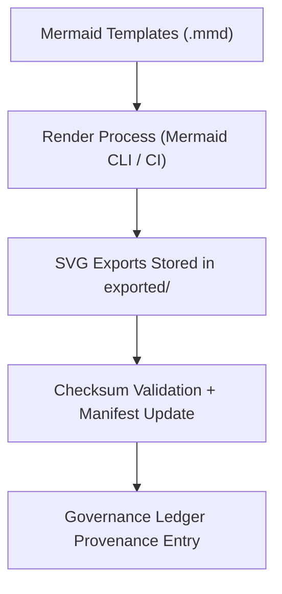

<div align="center">

# 🧾 **Kansas Frontier Matrix — Exported Architecture Diagrams (v2.1.1 · Tier-Ω+∞ Certified)**  
`docs/architecture/diagrams/exported/README.md`

**Mission:** Serve as the **official export registry** for all validated architectural diagrams generated from source templates (`.mmd`) under **MCP-DL v6.4.3**.  
All exported visualizations are versioned, checksum-verified, and permanently preserved for FAIR+CARE documentation governance.

[](../../../../docs/)
[](../../../../.github/workflows/docs-validate.yml)
[](../../../../LICENSE)

</div>

---

## 📚 Overview

The `exported/` directory stores **rendered architecture diagrams** in SVG and PNG formats.  
All visuals originate from **source templates** under `docs/architecture/diagrams/templates/` and are:

- ✅ Generated automatically by CI (`make diagrams` or `docs-validate.yml`)  
- ✅ Validated for **Mermaid syntax**, **WCAG 2.1 AA** contrast, and **metadata completeness**  
- ✅ Version-controlled and cryptographically verified in `manifest.zip`  
- ✅ Licensed openly under **CC-BY 4.0** for reuse  

---

## 🗂️ Directory Layout

```bash
docs/architecture/diagrams/exported/
├── README.md                    # This file — export registry and governance info
│
├── system_overview.svg           # Full system architecture map
├── etl_pipeline.svg              # ETL / data processing pipeline visualization
├── governance_workflow.svg       # FAIR+CARE and CI/CD governance chain
└── ai_lifecycle.svg              # AI/ML model lifecycle + provenance process
```

> **Note:** SVGs are the primary export format for version control; PNGs may be generated for offline publications or presentation materials.

---

## ⚙️ Export Workflow


<!-- END OF MERMAID -->

- **Generation Command:**  
  ```bash
  make diagrams
  ```  
- **Checksum Verification:**  
  `docs-validate.yml` automatically updates SHA-256 hashes under `pipeline_checksums.sha256` and the release manifest.

---

## 🧩 Export Metadata (Embedded)

Each diagram export embeds metadata inside the SVG file header:

```xml
<!--
title: "ETL Pipeline Overview"
version: "v2.1.1"
author: "@kfm-architecture"
description: "Shows how data moves through extraction, transformation, and loading within KFM."
license: "CC-BY 4.0"
checksum: "sha256:a1b2c3d4..."
source: "docs/architecture/diagrams/templates/etl_pipeline.mmd"
-->
```

> Embedded metadata supports FAIR+CARE traceability, aiding automated validation and provenance tracking.

---

## ⚖️ FAIR + CARE Compliance Summary

| Principle | Implementation | Validation Artifact |
|:--|:--|:--|
| **Findable** | Each diagram uniquely named and indexed in manifest. | `releases/v2.1.1/manifest.zip` |
| **Accessible** | Openly available under CC-BY 4.0 license. | `LICENSE` |
| **Interoperable** | Stored as accessible SVGs readable by web and assistive tools. | WCAG validation |
| **Reusable** | Metadata-embedded and checksum-verified for external citation. | `data/reports/audit/data_provenance_ledger.json` |
| **Collective Benefit (CARE)** | Visual documentation improves transparency for researchers and the public. | FAIR+CARE audit reports |

---

## 🧮 Validation & Governance Integration

| Workflow | Function | Output |
|:--|:--|:--|
| `docs-validate.yml` | Renders diagrams and checks syntax | `reports/validation/diagram_validation.json` |
| `policy-check.yml` | Confirms metadata and footer markers | `reports/audit/policy_results.json` |
| `governance-ledger.yml` | Adds checksum entries to provenance log | `data/reports/audit/data_provenance_ledger.json` |

---

## 🧠 Usage Example (in Markdown)

To embed an exported diagram into a document:

```md

```

Or reference with caption:

```html
<figure>
  
  <figcaption>Figure: FAIR+CARE Governance Workflow in the Kansas Frontier Matrix.</figcaption>
</figure>
```

---

## 🧾 Version History

| Version | Date | Author | Summary |
|:--|:--|:--|:--|
| **v2.1.1** | 2025-11-16 | @kfm-architecture | Standardized export governance; added FAIR+CARE metadata and checksum embedding. |
| v2.0.0 | 2025-10-25 | @kfm-docs | Introduced CI rendering and validation pipeline. |
| v1.0.0 | 2025-10-05 | @kfm-architecture | Initial export directory setup for architecture diagrams. |

---

<div align="center">

**Kansas Frontier Matrix © 2025**  
*“Visuals Are Code — Provenance Is Proof.”*  
📍 `docs/architecture/diagrams/exported/README.md` — Registry and governance log for exported architecture diagrams.

</div>