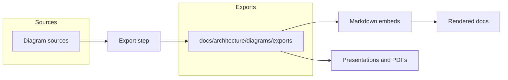

<!-- [KFM_META_BLOCK_V2]
doc_id: kfm://doc/0f6d3a58-5e11-4a45-92f0-2b318a7d4c0d
title: Architecture Diagram Exports
type: standard
version: v1
status: draft
owners: kfm-architecture (TODO: confirm)
created: 2026-03-01
updated: 2026-03-01
policy_label: restricted
related:
  - ../README.md
  - ../../README.md
tags: [kfm, docs, architecture, diagrams, exports]
notes:
  - Exported diagram artifacts (SVG/PNG/PDF) for embedding in markdown and downstream publishing.
  - Treat this folder as build output; edit sources elsewhere and re-export.
[/KFM_META_BLOCK_V2] -->

# Architecture Diagram Exports

**One-line purpose:** Generated diagram artifacts (SVG/PNG/PDF) that are embedded in KFM documentation.

<!-- TODO: align with repo doc status conventions -->


<!-- TODO: add real repo badges (CI, linkcheck, license) once paths are confirmed -->

**Owners:** `kfm-architecture` (TODO: confirm)

---

## Quick links

- [Purpose](#purpose)
- [Directory contract](#directory-contract)
- [How exports are produced](#how-exports-are-produced)
- [Conventions](#conventions)
- [Diagram registry](#diagram-registry)
- [Quality gates](#quality-gates)
- [FAQ](#faq)

---

## Purpose

This directory contains **exported** (rendered) diagram files used by the docs site, GitHub markdown, and other publishing surfaces.

**Principle:** exports are *outputs*.

- ✅ Update diagrams by editing the source (Mermaid / Draw.io / Figma / etc.) and re-exporting.
- ❌ Do **not** hand-edit exported SVG/PNG/PDFs unless there is no source format available.

> **NOTE**
> If a diagram includes sensitive information (e.g., precise locations for vulnerable sites), this folder is not the place to "fix it".
> Fix the **source** and re-export, or escalate for governance review.

[Back to top](#architecture-diagram-exports)

---

## Directory contract

### Where this fits

This folder lives under `docs/architecture/diagrams/` and is reserved for **rendered** diagram assets that other docs can embed.

### Acceptable inputs

| Allowed here | Examples | Why |
|---|---|---|
| Exported diagrams (preferred) | `.svg`, `.png` | GitHub-friendly embeds, deterministic diffs |
| Print exports (when needed) | `.pdf` | Review packets, print-ready diagrams |
| Optional integrity helpers | `.sha256`, `.sig` | Verifiable artifacts (if tooling exists) |

### Exclusions

| Not allowed here | Put it somewhere else | Why |
|---|---|---|
| Editable source files | `../src/` (or the repo’s source-diagram convention) | Prevents mixing source with build output |
| Screenshots of dashboards / UIs | `docs/` next to the doc that needs it (and keep them minimal) | Screenshots age quickly; harder to diff |
| Any file with unclear licensing | quarantine it; add rights metadata first | Avoids downstream rights violations |
| Sensitive data that shouldn’t be broadly replicated | follow policy + redaction obligations | Exports are easy to copy and embed |

[Back to top](#architecture-diagram-exports)

---

## How exports are produced



### Expected source locations

This repo may store diagram sources in one (or more) of these places:

- `docs/architecture/diagrams/src/` (recommended: text-first sources like Mermaid)
- `docs/architecture/diagrams/sources/` (recommended for `.drawio` / editable assets)
- `docs/architecture/` (if the diagram is tightly coupled to a specific doc)

> **TODO (verification):** confirm the actual source-diagram convention in this repo and update links above.

### Export workflow (human)

1. Edit the diagram source.
2. Export to **SVG first** (preferred), plus PNG/PDF if needed.
3. Place exports in this folder.
4. Update the [Diagram registry](#diagram-registry) table.
5. Ensure the [Quality gates](#quality-gates) pass.

### Export workflow (automation)

Automation varies by repo. If tooling exists, it usually looks like one of:

- `make diagrams` / `make docs-diagrams`
- `npm run diagrams:export`
- `python tools/diagrams/export.py`

> **TODO (verification):** search the repo for existing diagram export commands (e.g., `diagrams:export`, `export_diagrams`, `drawio`, `mmdc`). If none exist, treat exports as manual until a script is added.

[Back to top](#architecture-diagram-exports)

---

## Conventions

### Formats

- **SVG (preferred):** crisp at any zoom, small diffs when deterministic.
- **PNG:** only when a consumer can’t handle SVG (some PDFs / slide tools).
- **PDF:** only for print/review packets.

### Naming

Use stable, sortable names so that diffs are obvious:

```
<area>__<diagram_slug>__v<major>[.<minor>[.<patch>]].<ext>
```

Examples:

- `kfm__trust-membrane__v1.svg`
- `kfm__truth-path__v1.png`
- `kfm__deployment-topology__v2.1.svg`

### File hygiene

- Keep exports **deterministic** where possible (avoid embedded timestamps or random IDs).
- Prefer smaller files; compress PNGs.
- Do not embed secrets, tokens, or private hostnames.

[Back to top](#architecture-diagram-exports)

---

## Diagram registry

Keep this registry current so docs authors can find the right diagram without hunting.

| Diagram | What it shows | Primary embed(s) | Source location | Owner | Last updated |
|---|---|---|---|---|---|
| `kfm__truth-path__v1.svg` | Truth path lifecycle zones and promotion gates | `../../KFM_REDESIGN_BLUEPRINT_v13.md` (TODO) | `../src/` (TODO) | (TODO) | (TODO) |
| `kfm__trust-membrane__v1.svg` | Policy boundary: clients → PEP → stores | (TODO) | (TODO) | (TODO) | (TODO) |
| `kfm__data-flow__v1.svg` | End-to-end data flow: upstream → RAW → ... → UI | (TODO) | (TODO) | (TODO) | (TODO) |

> **TIP**
> If you add a new diagram, add a row here *in the same PR*.

[Back to top](#architecture-diagram-exports)

---

## Quality gates

Minimum expectations for exports:

- [ ] **Naming:** follows the naming convention above.
- [ ] **Readable at 100% zoom:** labels don’t overlap.
- [ ] **Accessible embeds:** markdown references include meaningful alt text.
- [ ] **No policy violations:** sensitive locations, restricted details, or private infrastructure are excluded or generalized.
- [ ] **License-safe:** diagrams derived from external sources have rights/attribution documented where required.
- [ ] **Links work:** any referenced docs/anchors exist.
- [ ] **Size:** SVGs stay reasonably small; PNGs are compressed.

Recommended (if tooling exists):

- [ ] Lint Mermaid / validate syntax.
- [ ] Strip non-deterministic metadata from SVG exports.
- [ ] Generate checksums (`.sha256`) for exported files.

[Back to top](#architecture-diagram-exports)

---

## FAQ

<details>
<summary>Why keep exports if GitHub can render Mermaid?</summary>

Mermaid-in-Markdown is great for text-first diagrams, but exports remain useful when:

- You need a **static** artifact for PDFs/review packets.
- You need a diagram in tools that don’t render Mermaid.
- You want a “known-good” render that won’t vary across markdown renderers.

</details>

<details>
<summary>What if I only have a PNG and no source?</summary>

Prefer recreating a source diagram (Mermaid/Draw.io) so future updates are cheap.
If you can’t, keep the PNG, but add a TODO in the registry and document where it came from.

</details>

<details>
<summary>Where should editable diagram sources go?</summary>

Not here.

Put sources in a sibling source directory (e.g., `../src/`), or alongside the owning doc if that’s the repo convention.

</details>

[Back to top](#architecture-diagram-exports)
