# 📤 Architecture Diagram Exports (KFM) 🧱🗺️

**Folder:** `docs/architecture/diagrams/exports/`  
**Purpose:** keep **rendered, embed-ready** diagram assets (SVG/PNG/PDF) used across KFM docs, Story Nodes, and the UI docs.

> ✅ **Rule of thumb:**  
> **Edit sources elsewhere** (Mermaid blocks in docs, `.drawio`, `.puml`, etc.) → **export here** → **reference exports from docs**.

---

## 🧭 Quick Nav

- 📚 **Canonical architecture references**
  - [`docs/MASTER_GUIDE_v13.md`](../../../MASTER_GUIDE_v13.md)
  - [`docs/architecture/KFM_REDESIGN_BLUEPRINT_v13.md`](../../KFM_REDESIGN_BLUEPRINT_v13.md)
  - [`docs/architecture/KFM_VISION_FULL_ARCHITECTURE.md`](../../KFM_VISION_FULL_ARCHITECTURE.md)
  - [`docs/architecture/KFM_NEXT_STAGES_BLUEPRINT.md`](../../KFM_NEXT_STAGES_BLUEPRINT.md)
- 🧠 **AI integration**
  - [`docs/architecture/ai/OLLAMA_INTEGRATION.md`](../../ai/OLLAMA_INTEGRATION.md)
- 🌐 **API surface**
  - [`src/server/api/README.md`](../../../../src/server/api/README.md)
- ⚖️ **Governance gates**
  - [`docs/governance/ROOT_GOVERNANCE.md`](../../../governance/ROOT_GOVERNANCE.md)
  - [`docs/governance/REVIEW_GATES.md`](../../../governance/REVIEW_GATES.md)
  - [`docs/governance/ETHICS.md`](../../../governance/ETHICS.md)
  - [`docs/governance/SOVEREIGNTY.md`](../../../governance/SOVEREIGNTY.md)

---

## 📦 What lives here?

This directory holds **exports** of architecture diagrams so they can be:

- embedded in GitHub Markdown (including platforms that *don’t* render Mermaid),
- dropped into slide decks 🧑‍🏫,
- used in PR discussions/reviews as stable visual snapshots,
- referenced by Story Nodes and Focus bundles without relying on external renderers.

### 🗂️ Expected layout

```text
docs/architecture/diagrams/
├── exports/
│   ├── README.md                  👈 you are here
│   ├── kfm__pipeline__overview.svg
│   ├── kfm__pipeline__overview.png
│   ├── kfm__system__overview.svg
│   ├── kfm__system__overview.png
│   └── ...
└── (diagram sources live outside exports)
    ├── (Mermaid inside .md files)
    ├── (Optional) *.drawio / *.puml / *.dot
    └── ...
```

> 🧩 If you don’t see a `src/` folder for diagram sources yet: that’s OK.  
> The **source of truth** may currently be **Mermaid blocks inside the architecture docs** (recommended for diffability), or external diagram files elsewhere in `docs/architecture/diagrams/`.

---

## 🧱 Diagram set: what we try to keep exported

Below is the **standard set** of exports we want available because they map to the v13 canonical pipeline + architecture surfaces.

### 1) 🗺️ Canonical KFM pipeline flow (high-level)

**What it expresses:**  
Raw sources → ETL/Normalization → STAC/DCAT/PROV boundary artifacts → Graph → API (contracts + redaction) → Map UI (React/MapLibre/(optional) Cesium) → Story Nodes → Focus Mode

**Suggested exports:**
- `kfm__pipeline__overview.svg`
- `kfm__pipeline__overview.png`

#### Mermaid reference (canonical flow)

> GitHub renders Mermaid. If you’re reading this in a renderer that doesn’t: use the exported SVG/PNG above. 👇

```mermaid
flowchart LR
  subgraph Data
    A["Raw Sources"] --> B["ETL + Normalization"]
    B --> C["STAC Items + Collections"]
    C --> D["DCAT Dataset Views"]
    C --> E["PROV Lineage Bundles"]
  end

  C --> G["Neo4j Graph (references back to catalogs)"]
  G --> H["API Layer (contracts + redaction)"]
  H --> I["Map UI — React · MapLibre · (optional) Cesium"]
  I --> J["Story Nodes (governed narratives)"]
  J --> K["Focus Mode (provenance-linked context bundle)"]
```



---

### 2) 🧩 System overview (subsystems + control gates)

**What it expresses (target state):**
- ingestion/processing pipelines ingest raw geospatial + historical sources
- normalization and publication into governed stores
- storage surfaces (e.g., **PostGIS**, **object storage**, **Neo4j**, optional search index)
- API boundary (e.g., **FastAPI**) feeding UI + AI surfaces
- governance controls (e.g., **OPA policy gates**) between sensitive layers
- UI surfaces (React + MapLibre; optional Cesium)
- AI assistant integration (Ollama) with Focus/constraints

**Suggested exports:**
- `kfm__system__overview.svg`
- `kfm__system__overview.png`

---

### 3) ⚖️ Governance + redaction gates

**What it expresses:**
- where policy decisions happen (OPA gates / review gates)
- how “Focus Mode” constrains responses to provenance-linked bundles
- boundary between internal-only sources vs public outputs

**Suggested exports:**
- `kfm__governance__policy_gates.svg`
- `kfm__governance__policy_gates.png`

---

### 4) 📦 Data lifecycle + catalog boundary artifacts

**What it expresses:**
- canonical staging: `data/raw/<domain>/` → `data/work/<domain>/` → `data/processed/<domain>/`
- publication outputs: STAC / DCAT / PROV
- “boundary artifacts” as required interfaces into graph/API/UI

**Suggested exports:**
- `kfm__data__lifecycle.svg`
- `kfm__data__lifecycle.png`

---

## 🧾 File naming conventions (recommended)

Keep names boring, searchable, and sortable ✅

### ✅ Pattern

```text
kfm__<area>__<diagram_name>__v<major>.<minor>.<ext>
```

Examples:
- `kfm__pipeline__overview__v1.0.svg`
- `kfm__system__overview__v1.1.png`
- `kfm__governance__policy_gates__v1.0.pdf`

### 🔎 Notes
- Prefer `__` for segment separators (cleaner grep + avoids spaces).
- Keep `<area>` aligned with docs: `pipeline`, `system`, `governance`, `api`, `ui`, `ai`, `storage`.
- Version bumps:
  - **major** if meaning/layout changes
  - **minor** if labels/typos/clarity changes

> 💡 If you don’t want versioned filenames for every update, use **one stable name** + keep versions in git history.  
> Example stable pair: `kfm__pipeline__overview.svg` and `kfm__pipeline__overview.png`.

---

## 🖼️ Export standards

### Preferred formats
- **SVG** ✅ (best for docs: crisp text, scalable, smaller diffs if exported consistently)
- **PNG** ✅ (best for compatibility: GitHub previews, slides, issues)
- **PDF** ✅ (best for print/review packets)

### Recommended PNG settings
- export width: **1600–2400px**
- keep text readable at 100% zoom
- avoid ultra-huge files (repo bloat)

### Accessibility checklist ♿
- Always embed images with **alt text**
- Avoid conveying meaning by color alone
- Keep labels large and high-contrast

Example embed (from anywhere in `docs/`):

```md

```

---

## 🛠️ Regenerating exports (workflow)

> 🧠 The repo supports Mermaid-in-Markdown diagrams. Exports are the **fallback + distribution** format.

### A) If the source is Mermaid (in a `.md` file)
1. Update the Mermaid block (keep it readable + left-to-right flow for pipelines).
2. Export to SVG/PNG using your preferred Mermaid exporter.
3. Save outputs here under the naming convention.
4. Update any docs that embed the exported asset.

### B) If the source is a diagram file (e.g., `.drawio`)
1. Edit the `.drawio` (or source file) outside `exports/`.
2. Export SVG and PNG.
3. Drop files into this folder.
4. Verify renders cleanly on GitHub.

<details>
<summary>✨ Export sanity checklist (click)</summary>

- [ ] Diagram reflects the **canonical pipeline ordering** (Raw → ETL → STAC/DCAT/PROV → Graph → API → UI → Story → Focus)
- [ ] No secrets, tokens, internal hostnames, private URLs, or sensitive data
- [ ] Labels match current docs (especially **contracts**, **redaction**, **Focus Mode**)
- [ ] SVG text remains text (not rasterized), if possible
- [ ] PNG is readable and under a reasonable size
- [ ] Filenames follow convention
- [ ] Any embedded links (SVG) are relative and repo-safe

</details>

---

## 🔐 Safety & governance note (diagrams are not exempt)

Even “just a diagram” can leak:

- internal endpoints 🧨
- security architecture details 🧷
- sensitive datasets or sovereignty-restricted sources 🛑

Before exporting/committing:
- align with [`docs/governance/REVIEW_GATES.md`](../../../governance/REVIEW_GATES.md)
- ensure diagrams communicate **policy gates** at the right boundaries (e.g., OPA enforcement, Focus Mode constraints)

---

## 🧩 Troubleshooting

- **Diagram looks blurry** → export SVG instead of PNG, or increase PNG resolution.
- **GitHub doesn’t render Mermaid** → confirm the block uses ```mermaid and valid syntax; use exports as fallback.
- **SVG fonts look off** → try exporting with “text as text” enabled; avoid embedding nonstandard fonts.
- **Big diffs on every export** → standardize exporter settings and try to keep consistent formatting.

---

## ✅ Contribution notes

- Keep exports **minimal**: only commit what’s referenced by docs or required for review.
- If you add a new exported diagram, also add a link to it from the relevant architecture doc (or a parent `docs/architecture/diagrams/README.md` if/when added).

---

_✨ Tip: diagrams are part of the system contract. If the picture and the docs disagree, readers will trust the picture first. Keep them in sync._

