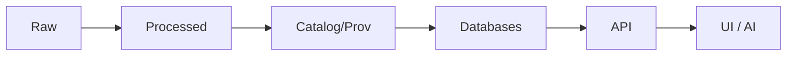

# 🧩 Architecture Diagram Sources (Editable Files)


This folder stores the **editable/source files** for Kansas Frontier Matrix (KFM) architecture diagrams (e.g., `.drawio`, `.excalidraw`, `.mmd`).  
Exports meant for other docs (SVG/PNG) should live **outside** this folder (recommended: `../exports/`).

---

## 🧭 Why this folder exists

KFM diagrams are not “pretty pictures” — they are **living system contracts**.

They must reflect the platform’s core architectural guarantees:

- **Pipeline truth path** is enforced (no shortcuts).
- **UI never talks directly to databases** — everything flows through the governed API.
- **Policy gates** exist at key boundaries (ingestion, serving, AI).
- **AI outputs are grounded** in retrieved data + citations (Focus Mode ethos).

If the diagram contradicts the architecture docs, the diagram is wrong. ✅

---

## 🗂️ Recommended layout

> Adjust if your repo already uses different names — the goal is **consistency**.

```text
📁 docs/
  📁 architecture/
    📁 diagrams/
      📁 sources/            👈 editable diagram sources (this folder)
        📄 README.md         👈 you are here
        🧩 ARCH-001__system-overview.drawio
        🧩 ARCH-006__focus-mode-rag.excalidraw
      📁 exports/            👈 rendered artifacts used by other docs
        🖼️ ARCH-001__system-overview.svg
        🖼️ ARCH-001__system-overview.png
```

---

## 📚 Canonical text sources (the “diagram upstream”)

When updating a diagram, verify it matches these *text-first* specs:

- **System overview / tiers / data flow**
  - `../../system_overview.md`
- **AI architecture overview**
  - `../../AI_SYSTEM_OVERVIEW.md`
- **Ollama + Focus Mode orchestration**
  - `../../ai/OLLAMA_INTEGRATION.md`
- **API contracts and governance patterns**
  - `../../../../src/server/api/README.md`
- **Pipelines & ingestion assumptions**
  - `../../../../pipelines/README.md`

> 💡 Rule of thumb: **update the text spec first**, then update diagrams to match.

---

## 🧠 Non‑negotiable architecture invariants (must show up in diagrams)

### ✅ 1) Canonical pipeline order (truth path)
Use this as the default backbone for system diagrams:



### ✅ 2) Storage is plural (and purpose-built)
Commonly depicted datastores in KFM diagrams:

- 🗃️ **PostGIS** (geospatial truth)
- 🕸️ **Neo4j** (knowledge graph / relationships)
- 🔎 **Search / vector index** (full-text + embeddings)
- 🪣 **Object storage** (COGs, PMTiles/tiles, PDFs, rasters, large assets)

### ✅ 3) Service layer is governed
- 🌐 **FastAPI (REST)** and/or **GraphQL** sits between UI and stores
- 🔐 **OPA policy enforcement** belongs at/near the API boundary (and sometimes also at pipeline gates)

### ✅ 4) Focus Mode AI is retrieval‑grounded
Depict Focus Mode as:

1. **Parse intent** (scope: entities, time, location)
2. **Retrieve knowledge** (graph + docs + geospatial data)
3. **LLM generate** (Ollama)
4. **Post-process** (citations + policy filter)
5. **Return** (answer + clickable references)

---

## 🧾 Diagram inventory (starter set)

Add new diagrams by assigning the next `ARCH-###` id and updating this table.

| ID | Diagram | What it answers | Source file (this folder) | Export target | Upstream spec |
|---:|---|---|---|---|---|
| ARCH-001 | System Overview | “What are the major tiers + flow?” | `ARCH-001__system-overview.drawio` | `../exports/ARCH-001__system-overview.svg` | `../../system_overview.md` |
| ARCH-002 | Data Pipeline | “How does ingestion/ETL work end-to-end?” | `ARCH-002__data-pipeline.drawio` | `../exports/ARCH-002__data-pipeline.svg` | `../../system_overview.md`, `../../../../pipelines/README.md` |
| ARCH-003 | Storage & Indexing | “Where does data live, and why?” | `ARCH-003__storage-indexing.drawio` | `../exports/ARCH-003__storage-indexing.svg` | `../../system_overview.md` |
| ARCH-004 | API + Governance | “How is access controlled and enforced?” | `ARCH-004__api-governance.drawio` | `../exports/ARCH-004__api-governance.svg` | `../../../../src/server/api/README.md` |
| ARCH-005 | UI & Clients | “What clients exist and how do they connect?” | `ARCH-005__ui-clients.drawio` | `../exports/ARCH-005__ui-clients.svg` | `../../system_overview.md` |
| ARCH-006 | Focus Mode RAG | “How does AI retrieve + cite + get filtered?” | `ARCH-006__focus-mode-rag.excalidraw` | `../exports/ARCH-006__focus-mode-rag.svg` | `../../ai/OLLAMA_INTEGRATION.md` |
| ARCH-007 | Remote Sensing Ingestion | “How do STAC/COG/tiles flow?” | `ARCH-007__remote-sensing.drawio` | `../exports/ARCH-007__remote-sensing.svg` | `../../system_overview.md` |
| ARCH-008 | Deployment Topology | “What runs where (containers, orchestration)?” | `ARCH-008__deployment-topology.drawio` | `../exports/ARCH-008__deployment-topology.svg` | `../../system_overview.md` |

---

## ✍️ Naming & versioning conventions

### File naming
Use **stable, searchable** names:

- `ARCH-###__kebab-case-title.<ext>`
- Keep the same basename for exports:
  - `ARCH-001__system-overview.drawio`
  - `ARCH-001__system-overview.svg`
  - `ARCH-001__system-overview.png`

### Diagram header block (put inside the canvas)
Every diagram should include a small header box:

- **Diagram ID**
- **Title**
- **Owner / maintainer**
- **Last updated**
- **Upstream docs** (paths)
- **Notes** (assumptions / scope)

This keeps diagrams reviewable even when exported.

---

## 🎨 Visual consistency rules

- **Flow direction:** left → right (or top → bottom), but be consistent within a diagram set.
- **Boundaries:** draw boxes for tiers (Ingestion / Storage / Serving / UI / AI / Governance).
- **Arrows:** label “what” moves (tiles, features, metadata, embeddings) not just “connects to”.
- **Avoid “hairball” diagrams:** create one high-level diagram + focused sub-diagrams.
- **Icons:** use a consistent icon set; avoid unlicensed vendor icons unless repo allows them.

---

## 🛠️ Tooling guidance

### diagrams.net / draw.io (`.drawio`)
Best for “final” diagrams meant to be maintained long-term.

Recommended export:
- ✅ **SVG** for docs (scales, searchable text)
- ✅ **PNG** for quick previews (optional)

### Excalidraw (`.excalidraw`)
Best for early-stage brainstorming or “whiteboard style” flows.

### Mermaid (`.mmd` or embedded)
Best for quick, text-reviewable diagrams in PRs.

> 📌 If you embed Mermaid in docs, keep the **source** close to the doc using it.  
> This folder is mainly for “visual editor” sources.

---

## 🔁 Update workflow (PR checklist)

- [ ] Confirm upstream architecture doc(s) are correct/updated
- [ ] Update the diagram source file in `docs/architecture/diagrams/sources/`
- [ ] Export updated SVG/PNG into `docs/architecture/diagrams/exports/`
- [ ] Ensure diagram shows the canonical **truth path** (no bypass arrows)
- [ ] Ensure UI → API → Stores is enforced (no UI → DB)
- [ ] Update the **Diagram inventory** table above (if adding/changing)
- [ ] Screenshots in PR description (optional but helpful) 📸

---

## 🧪 “Does this diagram match KFM?” quick self-test

<details>
<summary><strong>Click to expand ✅</strong></summary>

- Does the diagram show **Raw → Processed → Catalog/Prov → Database → API → UI/AI**?
- Is the **API layer** the only access point from UI?
- Are **policy gates** visible at key boundaries (ingest / serve / AI)?
- Are the **datastores labeled by purpose** (PostGIS vs Neo4j vs search/index vs object store)?
- For AI diagrams: does it show **retrieve-first**, then **generate**, then **policy + citations**?

</details>

---

## 🙌 Adding a new diagram

1. Pick the next `ARCH-###`
2. Create the source file in this folder
3. Export to `../exports/`
4. Add a row to **Diagram inventory**
5. Add links from the relevant architecture doc(s) to the export

Keep it small, focused, and truth-path aligned. 🧠🗺️

