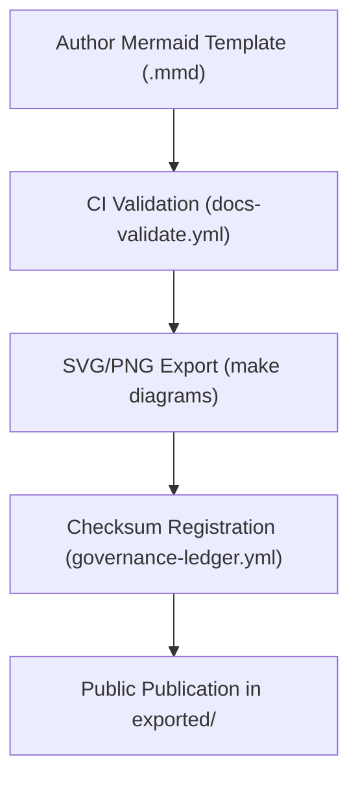

<div align="center">

# 🧩 **Kansas Frontier Matrix — Architecture Diagram Templates (v2.1.1 · Tier-Ω+∞ Certified)**  
`docs/architecture/diagrams/templates/README.md`

**Mission:** Provide reproducible **Mermaid diagram templates** for architectural visualization in the **Kansas Frontier Matrix (KFM)**,  
ensuring visual consistency, FAIR+CARE alignment, and audit-ready design provenance across all system documentation.

[](../../../../docs/)
[](../../../../.github/workflows/docs-validate.yml)
[](../../../../LICENSE)

</div>

---

## 📚 Overview

This directory hosts **source templates (`.mmd`)** used to generate diagrams stored under  
`docs/architecture/diagrams/exported/`.  

Each template follows **Mermaid syntax**, includes **metadata headers**, and adheres to **MCP-DL reproducibility** and  
**WCAG accessibility** requirements. These files serve as the authoritative visualization blueprints for KFM’s system architecture,  
ETL pipelines, AI workflows, and governance processes.

---

## 🗂️ Directory Layout

```bash
docs/architecture/diagrams/templates/
├── README.md                    # This file — authoring guide and template registry
│
├── system_overview.mmd           # Full system architecture flow
├── etl_pipeline.mmd              # ETL and data lineage pipeline
├── governance_workflow.mmd       # FAIR+CARE governance lifecycle
└── ai_lifecycle.mmd              # AI model training and validation cycle
```

---

## 🧠 Template Authoring Rules

| Requirement | Description | Enforced By |
|:--|:--|:--|
| **File extension** | Must end with `.mmd` (Mermaid syntax). | CI policy |
| **Header block** | Each file must start with metadata comments. | Policy-check |
| **Accessible labels** | Use human-readable node names. | Manual review |
| **Consistent color palette** | Avoid color-only distinctions. | WCAG validation |
| **Diagram closure** | Must end with `<!-- END OF MERMAID -->`. | `policy-check.yml` |
| **Checksum generation** | Template integrity tracked in release manifest. | `governance-ledger.yml` |

---

## 🧩 Template Metadata Example

Each Mermaid template must include the following header:

```mmd
%%---
%% title: "System Overview"
%% version: "v2.1.1"
%% author: "@kfm-architecture"
%% description: "High-level diagram showing data, AI, and governance relationships in KFM."
%% license: "CC-BY 4.0"
%%---
```

This header is extracted automatically by `docs-validate.yml` and published to the provenance manifest (`releases/v*/manifest.zip`).

---

## ⚙️ Rendering Workflow


<!-- END OF MERMAID -->

---

## 📊 Template Types

| Template | Purpose | Output File |
|:--|:--|:--|
| `system_overview.mmd` | Shows the entire KFM system architecture and domain interconnections. | `exported/system_overview.svg` |
| `etl_pipeline.mmd` | Visualizes ETL and data lineage pipelines with validation checkpoints. | `exported/etl_pipeline.svg` |
| `governance_workflow.mmd` | Describes FAIR+CARE and governance processes. | `exported/governance_workflow.svg` |
| `ai_lifecycle.mmd` | Represents AI model training, validation, and governance loop. | `exported/ai_lifecycle.svg` |

---

## 🧩 Example Template — ETL Pipeline

```mmd
%%---
%% title: "ETL Pipeline Overview"
%% author: "@kfm-architecture"
%% version: "v2.1.1"
%% description: "Illustrates how data moves through ETL stages under FAIR+CARE validation."
%% license: "CC-BY 4.0"
%%---

flowchart TD
  A["Raw Data Sources (NOAA, USGS, FEMA, KGS)"] --> B["ETL Processing (Python / GDAL / spaCy)"]
  B --> C["Validation + FAIR+CARE Certification"]
  C --> D["Processed Data (GeoJSON, GeoTIFF, CSV)"]
  D --> E["STAC Catalog Registration"]
  E --> F["Governance Ledger + Archival Storage"]
```
<!-- END OF MERMAID -->

---

## ⚖️ FAIR + CARE Integration

| Principle | Implementation | Artifact |
|:--|:--|:--|
| **Findable** | Each diagram template named after its purpose and referenced in manifest. | `releases/v2.1.1/manifest.zip` |
| **Accessible** | Templates are public and reusable under CC-BY 4.0. | `LICENSE` |
| **Interoperable** | Standard Mermaid syntax and metadata header. | `docs-validate.yml` |
| **Reusable** | All templates reproducible and versioned. | `sbom.spdx.json` |
| **Collective Benefit (CARE)** | Open, accessible visuals aid equitable understanding. | FAIR+CARE audit reports |

---

## 🧾 Validation Workflows

| Workflow | Purpose | Output |
|:--|:--|:--|
| `docs-validate.yml` | Validates Mermaid syntax and metadata headers. | `reports/validation/diagram_validation.json` |
| `policy-check.yml` | Confirms `<!-- END OF MERMAID -->` and metadata presence. | `reports/audit/policy_results.json` |
| `governance-ledger.yml` | Logs checksums and provenance of templates. | `data/reports/audit/data_provenance_ledger.json` |

---

## 🧾 Version History

| Version | Date | Author | Summary |
|:--|:--|:--|:--|
| **v2.1.1** | 2025-11-16 | @kfm-architecture | Standardized diagram templates; added metadata headers, CI integration, and FAIR+CARE table. |
| v2.0.0 | 2025-10-25 | @kfm-docs | Introduced rendering workflow and validation policies. |
| v1.0.0 | 2025-10-05 | @kfm-architecture | Created base Mermaid diagram templates for architecture documentation. |

---

<div align="center">

**Kansas Frontier Matrix © 2025**  
*“Every Diagram Starts as a Template — Every Template Ends as Provenance.”*  
📍 `docs/architecture/diagrams/templates/README.md` — Governance reference for all architecture diagram templates.

</div>