<div align="center">

# 🧩 Kansas Frontier Matrix — Diagram Templates  
`docs/architecture/diagrams/templates/`

**Mission:** Provide a standardized set of **Mermaid diagram templates**  
for documenting architecture, pipelines, provenance, and data systems  
in the **Kansas Frontier Matrix (KFM)** repository — ensuring visual  
consistency, traceability, and MCP compliance across all documentation.

[](../../../../docs/)
[](../../../../LICENSE)

</div>

---

## 📚 Overview

The `docs/architecture/diagrams/templates/` directory contains **Mermaid diagram templates**  
that serve as reusable blueprints for visual documentation within KFM.  

These templates help contributors quickly build consistent, accessible, and reproducible diagrams  
for use in architecture, data, pipeline, and CI/CD documentation.

All diagrams follow the **Master Coder Protocol (MCP)** standards of:
- 🧠 Documentation-first  
- 🔁 Reproducibility  
- 🌍 Open Standards (Mermaid + SVG)  
- 🧾 Provenance  
- 🧩 Auditability  

---

## 🗂️ Directory Layout

```bash
docs/architecture/diagrams/templates/
├── README.md                   # This file
├── blank_flowchart.mmd         # Empty starter diagram for custom use
├── example_structure.mmd       # Example system structure diagram
├── pipeline_overview.mmd       # Standard ETL pipeline visualization
└── data_lineage.mmd            # Provenance + metadata linkage example
````

> **Note:**
> Contributors should copy and rename these templates into `docs/architecture/diagrams/`
> before customizing or exporting new architecture visuals.

---

## ⚙️ Template Standards

| Attribute             | Rule                           | Description                                        |
| :-------------------- | :----------------------------- | :------------------------------------------------- |
| **Format**            | `.mmd`                         | Use plain-text Mermaid syntax for source diagrams. |
| **Naming Convention** | `snake_case`                   | Lowercase with underscores (`data_flow.mmd`).      |
| **Encoding**          | UTF-8                          | Required for compatibility across renderers.       |
| **License Header**    | Required                       | Include CC-BY 4.0 attribution comment at top.      |
| **Commit Message**    | `add(diagram): <diagram_name>` | Semantic commit standard for new visuals.          |

---

## 🧩 Example Template — Blank Flowchart

### `blank_flowchart.mmd`


<!-- END OF MERMAID -->

> This serves as a minimal starting point for any new system, pipeline, or architecture visualization.

---

## 🧱 Example Template — Example Structure

### `example_structure.mmd`

```mermaid
%%----------------------------------------------------------
%% Kansas Frontier Matrix — Example System Architecture Template
%% License: CC-BY 4.0 | Author: KFM Documentation Team
%%----------------------------------------------------------
flowchart LR
  A["📦 Data Sources"] --> B["⚙️ Processing Pipelines"]
  B --> C["🧩 Metadata / STAC"]
  C --> D["🌎 Web Visualization"]
```



<!-- END OF MERMAID -->

> Use this structure to represent high-level system workflows or data hierarchies.

---

## 🧮 Template Metadata Block (Optional)

Every `.mmd` template may include a structured metadata comment block for reproducibility.

```text
%% Metadata:
%%   title: Kansas Frontier Matrix — Example Diagram
%%   author: KFM Documentation Team
%%   date_created: 2025-10-04
%%   version: 1.0
%%   license: CC-BY 4.0
%%   description: Example template showing data source to visualization flow.
```

This block:

* Enables automatic metadata extraction during diagram export (`make diagrams-metadata`).
* Embeds provenance in exported `.svg` or `.png` diagrams.
* Supports validation through `docs/architecture/diagrams/exported/_manifest.json`.

---

## 🧩 How to Create a New Diagram

1. **Copy Template:**

   ```bash
   cp docs/architecture/diagrams/templates/blank_flowchart.mmd docs/architecture/diagrams/my_new_diagram.mmd
   ```

2. **Edit in Mermaid Syntax:**
   Use [Mermaid Live Editor](https://mermaid.live) or VSCode preview for development.

3. **Add Metadata Block:**
   Include author, title, and license info.

4. **Export:**

   ```bash
   npx @mermaid-js/mermaid-cli -i my_new_diagram.mmd -o exported/my_new_diagram.png
   ```

5. **Commit:**

   ```bash
   git add docs/architecture/diagrams/my_new_diagram.mmd
   git commit -m "add(diagram): my_new_diagram"
   ```

6. **Reference:**
   Link it in a relevant architecture document:

   ```markdown
   
   ```

---

## 🧰 Rendering & Validation

### Local Render Test

```bash
npx @mermaid-js/mermaid-cli -i example_structure.mmd -o ../exported/example_structure.png
```

### Validate Diagram Syntax

```bash
make diagrams-validate
```

This target checks:

* Mermaid syntax errors
* Metadata block presence
* Proper naming and directory compliance

---

## 🧠 MCP Compliance Summary

| MCP Principle           | Implementation                                                   |
| :---------------------- | :--------------------------------------------------------------- |
| **Documentation-first** | All templates include comments and metadata blocks.              |
| **Reproducibility**     | Diagrams are deterministically generated from versioned sources. |
| **Open Standards**      | Mermaid, SVG, and PNG under open licenses.                       |
| **Provenance**          | Metadata block links diagrams to authors, commits, and dates.    |
| **Auditability**        | Export manifest logs every rendered diagram.                     |

---

## 📎 Related Directories

| Path                                   | Description                                                    |
| :------------------------------------- | :------------------------------------------------------------- |
| `docs/architecture/diagrams/`          | Directory for finalized `.mmd` diagrams.                       |
| `docs/architecture/diagrams/exported/` | Rendered `.svg`/`.png` exports for inclusion in documentation. |
| `Makefile`                             | Automation targets for rendering and validation.               |
| `.github/workflows/site.yml`           | CI/CD job for diagram rendering during site build.             |

---

## 📅 Version History

| Version | Date       | Summary                                                                      |
| :------ | :--------- | :--------------------------------------------------------------------------- |
| v1.0    | 2025-10-04 | Initial diagram template documentation (Mermaid standards + export process). |

---

<div align="center">

**Kansas Frontier Matrix** — *“Every Diagram Begins with a Template. Every Visualization Tells a Story.”*
📍 [`docs/architecture/diagrams/templates/`](.) · Standard templates for KFM architecture and system visualizations.

</div>
