<div align="center">

# 🧩 **Kansas Frontier Matrix — Diagram Templates (v2.0.0 · Tier-Ω+∞ Certified)**  
`docs/architecture/diagrams/templates/`

**Mission:** Provide a **standardized, MCP-DL–compliant** library of **Mermaid diagram templates** for documenting KFM **architecture, pipelines, provenance, CI/CD, web UI, and knowledge graph** — ensuring **visual consistency, traceability, accessibility, and reproducibility** across all docs.

[](../../../../docs/)
[](../../../../.github/workflows/docs-validate.yml)
[](../../../../.github/workflows/slsa.yml)
[](../../../../LICENSE)

</div>

---

```yaml
---
title: "Kansas Frontier Matrix — Diagram Templates"
document_type: "Template Library README"
version: "v2.0.0"
last_updated: "2025-11-16"
owners: ["@kfm-architecture","@kfm-docs","@kfm-design"]
status: "Stable"
maturity: "Production"
license: "CC-BY 4.0"
tags: ["templates","mermaid","architecture","pipeline","provenance","ci-cd","knowledge-graph","a11y"]
alignment:
  - MCP-DL v6.3
  - FAIR / CARE
  - WCAG 2.1 AA (docs)
validation:
  mermaid_end_marker: "<!-- END OF MERMAID -->"
  ci_workflows: ["docs-validate.yml","site.yml","policy-check.yml"]
observability:
  endpoint: "https://metrics.kfm.ai/diagrams/templates"
  metrics: ["template_lint_errors","render_success_pct","frontmatter_coverage_pct"]
preservation_policy:
  retention: "templates permanent · logs 90d"
  checksum_algorithm: "SHA-256"
---
```

---

## 📚 Overview

This directory contains **Mermaid template sources** to quickly build **consistent, accessible, and reproducible** diagrams for KFM.  
Templates embed **MCP metadata**, follow **WCAG-friendly** palettes, and render deterministically in CI.

All diagrams adhere to the **MCP Five**:
- 🧠 **Documentation-first** (each diagram has a rationale and metadata)
- 🔁 **Reproducibility** (CLI/CI rendering from versioned sources)
- 🌍 **Open Standards** (Mermaid + SVG/PNG)
- 🧾 **Provenance** (commit, author, timestamp, checksum)
- 🧩 **Auditability** (docs-validate + policy gates)

---

## 🗂️ Directory Layout

```bash
docs/architecture/diagrams/templates/
├── README.md                    # This file (standards + quickstart)
├── blank_flowchart.mmd          # Minimal starting point for any diagram
├── example_structure.mmd        # High-level system structure
├── pipeline_overview.mmd        # ETL + validation overview (source→web)
├── data_lineage.mmd             # Provenance + STAC + checksums
├── ci_cd_pipeline.mmd           # CI/CD gates + artifacts + environments
├── web_ui_architecture.mmd      # MapLibre + Timeline + STAC-driven configs
└── knowledge_graph.mmd          # CIDOC CRM + PROV-O + OWL-Time ER
```

> **Tip:** Copy a template into `docs/architecture/diagrams/` and adapt it. Exports belong in `docs/architecture/diagrams/exported/`.

---

## ⚙️ Template Standards

| Attribute | Rule | Description |
|:--|:--|:--|
| **Format** | `.mmd` | Mermaid source diagrams only (plain text). |
| **Naming** | `snake_case` | `web_ui_architecture.mmd`, `data_flow.mmd`. |
| **Encoding** | UTF-8 | Cross-platform compatibility. |
| **License Header** | Required | CC-BY 4.0 attribution at top-of-file. |
| **End Marker** | Required | Mermaid blocks end with `<!-- END OF MERMAID -->`. |
| **Commit** | `add(diagram): <name>` | Semantic, searchable history. |

**Accessible palette** (suggested):

```yaml
diagram_palette:
  accent: "#3BAFDA"
  ok: "#2E7D32"
  warn: "#F9A825"
  error: "#D32F2F"
  neutral: "#1A1A1A"
```

---

## 🧩 Template Metadata Block (recommended)

Add a structured metadata comment for provenance extraction during export:

```text
%%----------------------------------------------------------
%% title: Kansas Frontier Matrix — <Diagram Title>
%% author: @kfm-your-handle
%% date_created: 2025-11-16
%% version: 1.0
%% license: CC-BY 4.0
%% description: One-liner describing the intent of this diagram.
%% commit: <auto-filled-on-export>
%%----------------------------------------------------------
```

CI collects these fields into the **export manifest**:  
`docs/architecture/diagrams/exported/_manifest.json`.

---

## 🚀 Quickstart — Create a New Diagram

1) **Copy a template**
```bash
cp docs/architecture/diagrams/templates/pipeline_overview.mmd docs/architecture/diagrams/data_flow.mmd
```

2) **Edit in Mermaid** (GitHub preview / VS Code / Mermaid Live)

3) **Local render test**
```bash
npx @mermaid-js/mermaid-cli -i docs/architecture/diagrams/data_flow.mmd -o docs/architecture/diagrams/exported/data_flow.svg
```

4) **Commit**
```bash
git add docs/architecture/diagrams/data_flow.mmd docs/architecture/diagrams/exported/data_flow.svg
git commit -m "add(diagram): data_flow"
```

5) **Reference in docs**
```markdown

```

---

## 🧪 Rendering & Validation

### Makefile targets
```bash
make diagrams            # Validate .mmd + export SVG/PNG
make diagrams-validate   # Syntax & policy checks only
make diagrams-metadata   # Build exported/_manifest.json with checksums
make clean-diagrams      # Remove exports for fresh render
```

### CI gates (snippet)
```yaml
- name: Validate Mermaid syntax
  run: npx @mermaid-js/mermaid-cli -i docs/architecture/diagrams/system_overview.mmd -o /tmp/test.svg
- name: Build exports
  run: make diagrams
- name: Policy check
  run: npx conftest test docs/architecture/diagrams --policy policies/diagrams
```

---

## 🧱 Example Template — Blank Flowchart

**`blank_flowchart.mmd`**

<!-- END OF MERMAID -->

---

## 🧱 Example Template — Example Structure

**`example_structure.mmd`**

```mermaid
%%----------------------------------------------------------
%% Kansas Frontier Matrix — Example System Architecture Template
%% License: CC-BY 4.0 | Author: KFM Documentation Team
%%----------------------------------------------------------
flowchart LR
  A["📦 Data Sources"] --> B["⚙️ Processing Pipelines"]
  B --> C["🧩 Metadata / STAC"]
  C --> D["🌎 Web Visualization"]
```

<!-- END OF MERMAID -->

---

## 🧱 Example Template — Pipeline Overview

**`pipeline_overview.mmd`**

```mermaid
%%----------------------------------------------------------
%% KFM — Pipeline Overview Template
%% License: CC-BY 4.0 | Author: KFM Data Team
%%----------------------------------------------------------
flowchart TD
  SRC["Sources\nmanifests"] --> RAW["Raw"]
  RAW --> ETL["ETL\ntransform"]
  ETL --> PROC["Processed"]
  PROC --> STAC["STAC\ncatalog"]
  STAC --> WEB["Web\ntiles · viewer"]
```

<!-- END OF MERMAID -->

---

## 🧱 Example Template — Data Lineage

**`data_lineage.mmd`**

<!-- END OF MERMAID -->

---

## ♿ Accessibility Guidance for Diagram Authors

- Maintain **contrast ≥ 4.5:1** for text and **≥ 3:1** for icons/lines.  
- Use **plain labels**; avoid color-only meaning (add shapes/icons).  
- Keep **font sizes ≥ 12–14px** in typical export scaling.  
- Provide **alt text/captions** when embedding exported images into docs.

---

## 🔐 Governance & Policy

- **One-source rule**: every export must map 1:1 to a `.mmd` file.  
- **No binary edits**: never modify `.svg`/`.png` outside the export pipeline.  
- **Provenance footer**: embed author/date/version (auto-injected on export).  
- **Review checklist** (PR template): purpose, scope, owners, end marker present, link placement.

---

## 📈 Observability & Budgets

```yaml
diagram_template_metrics:
  export_to: "https://metrics.kfm.ai/diagrams/templates"
  budgets:
    render_success_pct: 100
    frontmatter_coverage_pct: 100
    broken_link_count: 0
```

---

## 🧠 MCP Compliance Summary

| MCP Pillar | Implementation |
|:--|:--|
| Documentation-first | Template headers + metadata comments |
| Reproducibility | Deterministic export via CLI/CI |
| Open Standards | Mermaid + SVG/PNG under CC-BY |
| Provenance | Manifest + commit + checksum linking |
| Auditability | CI policy gates & export manifest |

---

## 📎 Related Directories

| Path | Description |
|:--|:--|
| `../` | Finalized diagrams and system visuals |
| `../exported/` | Rendered `.svg`/`.png` for docs & site |
| `../../` | Architecture documentation |
| `.github/workflows/site.yml` | Diagram render during site build |
| `Makefile` | Diagram validation/export automation |

---

## 🗓 Version History

| Version | Date | Summary |
|:--|:--|:--|
| **v2.0.0** | 2025-11-16 | Tier-Ω+∞: added template set (pipeline/lineage/CI/graph/web), CI policy gates, observability metrics, accessibility guidance, and metadata contracts. |
| v1.0.0 | 2025-10-04 | Initial template library (blank + example). |

---

<div align="center">

**Kansas Frontier Matrix — Diagram Templates**  
*“Every Diagram Begins with a Template. Every Visualization Tells a Provenanced Story.”*

</div>