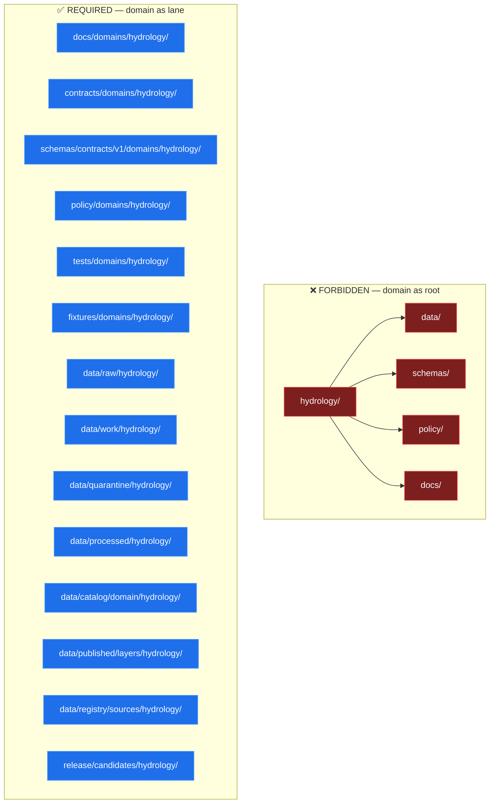
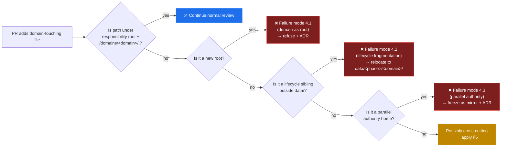

<!-- [KFM_META_BLOCK_V2]
doc_id: kfm://doc/domain-placement-law
title: Domain Placement Law — KFM Architecture Doctrine
type: standard
version: v1.0
status: draft
owners: Docs steward
created: 2026-05-25
updated: 2026-05-25
policy_label: public
related:
  - docs/architecture/directory-rules.md
  - docs/architecture/contract-schema-policy-split.md
  - docs/architecture/system-context.md
  - docs/architecture/map-shell.md
  - docs/architecture/governed-api.md
  - docs/architecture/maplibre-3d.md
  - docs/doctrine/lifecycle-law.md
  - docs/doctrine/authority-ladder.md
  - docs/doctrine/trust-membrane.md
  - docs/adr/ADR-0001-schema-home.md
  - docs/atlases/KFM_Domains_Culmination_Atlas_v1_1.pdf
  - docs/registers/DRIFT_REGISTER.md
  - docs/registers/VERIFICATION_BACKLOG.md
tags: [kfm, doctrine, architecture, domain-placement, directory-rules, bounded-context]
notes:
  - "This document is the architecture-side elaboration of Directory Rules §12. It does NOT supersede Directory Rules; it expands and operationalizes one of its sections."
  - "Owner field is placeholder ('Docs steward'); resolve in CODEOWNERS."
  - "All paths are PROPOSED unless explicitly CONFIRMED at a commit. v1.0 was authored without mounted-repo inspection."
[/KFM_META_BLOCK_V2] -->

# Domain Placement Law

> **A domain is a bounded responsibility, not a folder. It MUST appear as a lane segment inside every responsibility root that touches it — never as a root folder of its own.**


**Status:** draft · **Owner:** Docs steward *(placeholder; verify in `CODEOWNERS`)* · **Last reviewed:** 2026-05-25

> [!IMPORTANT]
> **Authority note.** This document is a **derived doctrine** — it elaborates and operationalizes [Directory Rules §12](./directory-rules.md#12-domain-placement-law). Where this file and Directory Rules conflict, **Directory Rules govern** ([§2.1](./directory-rules.md#21-authority-order)). This document SHOULD be revised when §12 changes; it MUST NOT introduce new placement rules without an ADR per [Directory Rules §2.4](./directory-rules.md#24-changes-that-require-an-adr).

---

## 📑 Contents

- [§0 — Status & Authority](#0-status--authority)
- [§1 — The Law](#1-the-law)
- [§2 — Canonical KFM Domain Inventory](#2-canonical-kfm-domain-inventory)
- [§3 — The Lane Pattern](#3-the-lane-pattern)
- [§4 — Three Failure Modes](#4-three-failure-modes)
- [§5 — Multi-Domain and Cross-Cutting Files](#5-multi-domain-and-cross-cutting-files)
- [§6 — Special-Status Domains](#6-special-status-domains)
- [§7 — Focus Modes Are Not Domains](#7-focus-modes-are-not-domains)
- [§8 — Admitting a New Domain](#8-admitting-a-new-domain)
- [§9 — Reviewer Checklist](#9-reviewer-checklist)
- [§10 — Anti-Patterns Specific to Domain Placement](#10-anti-patterns-specific-to-domain-placement)
- [§11 — Migration Patterns](#11-migration-patterns)
- [§12 — Open Questions and NEEDS VERIFICATION](#12-open-questions-and-needs-verification)
- [§13 — Glossary](#13-glossary)
- [§14 — Changelog](#14-changelog)

---

## 0. Status & Authority

| Field | Value |
|---|---|
| **Document type** | Architecture doctrine (derived from Directory Rules §12) |
| **Edition** | v1.0 — initial split of §12 into a standalone, reviewer-facing architecture document |
| **Authority of these rules** | **CONFIRMED — derives from Directory Rules §12 + §3 + §5.** This document does not create new placement rules; it elaborates the existing law for reviewer and contributor use. |
| **Authority of any specific path quoted here** | **PROPOSED** unless explicitly noted otherwise. v1.0 was authored without mounted-repo inspection; presence of any named path remains **NEEDS VERIFICATION** until checked. |
| **Conformance language** | RFC 2119-style: **MUST / MUST NOT** non-negotiable, **SHOULD / SHOULD NOT** strong default, **MAY** permitted. Same as [Directory Rules §2.2](./directory-rules.md#22-conformance-language-rfc-2119-style). |
| **Owner** | Docs steward *(placeholder; resolve in `CODEOWNERS`)* |
| **Reviewers required for change** | Docs steward + at least one subsystem owner (typically a domain steward when a domain is added). ADR required for: adding/removing a canonical domain (§8), changing the lane pattern (§3), or amending the multi-domain rule (§5). |
| **Supersedes** | None. This is the first edition. **It does NOT supersede Directory Rules §12** — §12 remains the authoritative one-paragraph statement of the law; this document elaborates it. |
| **Related doctrine** | [`docs/architecture/directory-rules.md`](./directory-rules.md) §3, §5, §6, §7, §12, §13; [`docs/architecture/contract-schema-policy-split.md`](./contract-schema-policy-split.md); [`docs/doctrine/lifecycle-law.md`](../doctrine/lifecycle-law.md); [`docs/adr/ADR-0001-schema-home.md`](../adr/ADR-0001-schema-home.md). Background reading: *Domain-Driven Design Reference* (Evans, 2015) — Bounded Context, Ubiquitous Language, Context Map. |
| **Lifecycle invariant** | RAW → WORK / QUARANTINE → PROCESSED → CATALOG / TRIPLET → PUBLISHED. Domains inherit this invariant; they do not redefine it. |
| **Schema-home convention** | `schemas/contracts/v1/domains/<domain>/...` per [ADR-0001](../adr/ADR-0001-schema-home.md) and Directory Rules §6.4. |
| **Last reviewed** | 2026-05-25 |

> **Truth-posture note (v1.0).** This document is grounded in: (a) `docs/architecture/directory-rules.md` v1.3.1 (CONFIRMED authored), specifically §3, §5, §6.1, §6.3, §6.4, §6.5, §6.6, §7.2, §7.4, §9.1, §12; (b) the *Kansas Frontier Matrix — Domains v1.1 + Pass 23/32 Consolidated Atlas* (CONFIRMED authored) — specifically the per-domain ownership/object-family tables and the Ch. 24.13 *Atlas ↔ Dossier ↔ Responsibility-Root Crosswalk*; (c) the *Domain-Driven Design Reference* (Evans, 2015) for the Bounded Context background. **No mounted repo was inspected for v1.0**; every concrete path is **PROPOSED**. The §2 domain inventory is **CONFIRMED** at the domain-name level (every name traces to Directory Rules §12 or the Atlas) but the per-domain lane segments are PROPOSED until verified.

[⤴ Back to top](#-contents)

---

## 1. The Law

The Domain Placement Law is one sentence:

> **A domain MUST appear as a lane segment inside each responsibility root that touches it, and MUST NOT appear as a root folder of its own.**

Three properties follow:

1. **The repo root stays boring.** Adding a domain never adds a root folder. Hydrology, soil, fauna, archaeology, and any other domain expand inside the existing roots — they do not multiply them. ([Directory Rules §3, §5](./directory-rules.md#3-the-deeper-rule).)
2. **The lifecycle stays one lifecycle.** Every domain inherits the same `RAW → WORK / QUARANTINE → PROCESSED → CATALOG / TRIPLET → PUBLISHED` invariant. A domain root would fragment the lifecycle and re-implement it badly. ([Directory Rules §9.1](./directory-rules.md#91-data--the-lifecycle-invariant).)
3. **Cross-domain joins stay possible.** Because every domain occupies the same shaped lane across `data/`, `contracts/`, `schemas/`, `policy/`, `pipelines/`, etc., a habitat × fauna × hydrology validator has a defined non-domain home (§5) instead of an arbitrary parent-folder fight.



> [!NOTE]
> **DDD framing (background, not authority).** A KFM **domain** is a Bounded Context in Evans's sense — a boundary inside which terms (Taxon, HabitatPatch, HazardEvent, …) have defined meaning and ownership. The Law translates that conceptual boundary into a placement rule: same model boundary ⇒ same lane segment across every responsibility root. This document operationalizes the boundary; it does not re-derive DDD.

[⤴ Back to top](#-contents)

---

## 2. Canonical KFM Domain Inventory

KFM recognizes **13 core domains** plus **3 special-status domains** (covered in §6). Names below are **CONFIRMED at the name level** — each traces to [Directory Rules §12](./directory-rules.md#12-domain-placement-law) or to the *KFM Domains v1.1 + Pass 23/32 Consolidated Atlas*. The kebab-case segment in `<segment>` is the canonical filesystem form used inside lane paths.

### 2.1 Core domains (Domain Placement Law applies in full)

| # | Domain | Segment | Atlas dossier | One-line responsibility | Status |
|---|---|---|---|---|---|
| 1 | Hydrology | `hydrology` | [DOM-HYD] | HUC/Watershed/Reach/Gauge/Flow; NFHL regulatory channel; aquatic context for many lanes. | CONFIRMED domain identity |
| 2 | Soil | `soil` | [DOM-SOIL] | SoilMapUnit, SoilComponent; substrate context for habitat, agriculture, hazards. | CONFIRMED domain identity |
| 3 | Fauna | `fauna` | [DOM-FAUNA] | Taxon, Conservation Status, Occurrence (Restricted/Public), RangePolygon, SensitiveSite, MortalityObservation, Invasive Species Record, Redaction Receipt. | CONFIRMED domain identity |
| 4 | Flora | `flora` | [DOM-FLORA] | Plant taxonomy, RarePlantRecord (default T4), ethnobotanical context (steward-reviewed). | CONFIRMED domain identity |
| 5 | Habitat | `habitat` | [DOM-HAB] | HabitatPatch, EcologicalSystem, suitability products. | CONFIRMED domain identity |
| 6 | Geology | `geology` | [DOM-GEOL] | GeologicUnit, Lithology, MineralOccurrence, ResourceEstimate. | CONFIRMED domain identity |
| 7 | Atmosphere / Air | `atmosphere` | [DOM-AIR] | WeatherObservation, ClimateNormal, AirStation, PM2.5/Ozone/AOD, WindField. | CONFIRMED domain identity |
| 8 | Roads / Rail / Trade | `roads-rail-trade` | [DOM-ROADS] | RoadSegment, RailSegment, CorridorRoute, TransportFacility, RouteMembership, Crossing, Bridge, Ferry. | CONFIRMED domain identity |
| 9 | Settlements / Infrastructure | `settlements-infrastructure` | [DOM-SETTLE] | Settlement, Municipality, CensusPlace, Townsite, GhostTown, Fort, Mission, ReservationCommunity, Infrastructure Asset (critical). | CONFIRMED domain identity |
| 10 | Archaeology / Cultural Heritage | `archaeology` | [DOM-ARCH] | ArchaeologicalSite (T4 default), SiteComponent, CulturalTemporalPeriod, SurveyProject, ArtifactRecord; sovereignty review path. | CONFIRMED domain identity |
| 11 | Hazards | `hazards` | [DOM-HAZ] | HazardEvent, HazardObservation, DisasterDeclaration, FloodContext, WildfireDetection, SmokeContext, DroughtIndicator, Earthquake, Heat/Cold. | CONFIRMED domain identity |
| 12 | Agriculture | `agriculture` | [DOM-AG] | CropObservation, YieldObservation, LandUse; aggregate (T0) vs field-candidate (T1) split. | CONFIRMED domain identity |
| 13 | People / Genealogy / DNA / Land | `people-dna-land` | [DOM-PEOPLE] | PersonAssertion, PersonCanonical, LifeEvent, ResidenceEvent, MigrationEvent, FamilyGroup, DNAMatchEvidence, LandParcel; living-person / DNA / person-parcel deny-default. | CONFIRMED domain identity |

> [!IMPORTANT]
> **Naming variance — atlas vs Directory Rules.** Atlas Ch. 24.13 sometimes uses **short** segment names (`schemas/contracts/v1/settlement/`, `contracts/settlement/`, `schemas/contracts/v1/people/`) while Directory Rules §12 uses **long compound** segments (`schemas/contracts/v1/domains/settlements-infrastructure/`, `…/people-dna-land/`). **This document follows Directory Rules § 12 as the canonical form.** The atlas short-names are PROPOSED lineage; reconciliation is an ADR-class question (§12.1 below, OPEN-DPL-01).

### 2.2 Special-status domains (covered in §6)

| # | Domain | Segment | Status | Why "special" |
|---|---|---|---|---|
| 14 | Spatial Foundation | n/a (cross-cutting) | CONFIRMED cross-cutting | Owns CRS, GeographyVersion, projection transform receipts. Used by **every** other domain. Lives mostly in `packages/geo/`, `schemas/contracts/v1/common/`, `docs/architecture/`. Does **not** use the §3 lane pattern. See §6.1. |
| 15 | Frontier Matrix | `matrix` | CONFIRMED cross-cutting | The matrix-cell analytical surface; cells are derived releases, not source truth. Lives in `schemas/contracts/v1/matrix/`, `contracts/matrix/`, `data/published/matrix/`. Uses an *adapted* lane pattern (§6.2). |
| 16 | Planetary / 3D / Digital Twin / Synthetic | n/a — hosted by `packages/maplibre-runtime/` | CONFIRMED cross-cutting (v1.3) | Per [Directory Rules §11](./directory-rules.md#11-ui-and-map-roots) and [`docs/architecture/maplibre-3d.md`](./maplibre-3d.md), 3D is a *rendering mode within MapLibre*, not a domain. Object families (SceneManifest, 3DTileSet, glTFAsset) live under the renderer's lanes, not a domain lane. See §6.3. |

### 2.3 What's NOT a domain (selected)

- **Focus Mode** (`ellsworth`, `riley`, `smoky-hill-corridor`, …) — geographic proof slice. Cross-cutting composition. See §7.
- **Source family** (USGS, FEMA, NOAA, GBIF, …) — connector identity. Lives in `connectors/`, not as a domain.
- **Object family** (EvidenceBundle, SourceDescriptor, RuntimeResponseEnvelope, ReleaseManifest) — cross-cutting contract type. Lives in `contracts/{evidence,source,runtime,release}/`, not under a domain.
- **Lifecycle phase** (raw, work, processed, catalog, published) — temporal stage. Lives as a sibling under `data/`, not as a domain.
- **App** (governed-api, explorer-web, review-console) — deployable unit. Lives in `apps/`, not as a domain.
- **Capability** (validation, signing, attestation, telemetry) — cross-cutting concern. Lives in `tools/`, `packages/`, or `policy/` — not as a domain.

[⤴ Back to top](#-contents)

---

## 3. The Lane Pattern

Every domain in §2.1 MUST appear as the segment `<domain>` inside each responsibility root that touches it, following this pattern. The pattern is **uniform** across domains — if hydrology has it, fauna has the same shape; reviewers can grep with confidence.

### 3.1 The full lane

```text
docs/domains/<domain>/                           # human-facing dossier, README, source notes
contracts/domains/<domain>/                      # semantic Markdown contracts (object meaning)
schemas/contracts/v1/domains/<domain>/           # JSON Schema (object shape) — ADR-0001
policy/domains/<domain>/                         # admissibility, sensitivity, rights, release-gate
tests/domains/<domain>/                          # enforceability proof
fixtures/domains/<domain>/{valid,invalid}/       # golden / valid / invalid sample inputs
packages/domains/<domain>/                       # shared library code for the domain
pipelines/domains/<domain>/                      # executable pipeline logic
pipeline_specs/<domain>/                         # declarative pipeline configuration (no /domains/ prefix per §12)
data/raw/<domain>/<source_id>/<run_id>/          # source-edge captures
data/work/<domain>/<run_id>/                     # normalization workspace
data/quarantine/<domain>/<reason>/<run_id>/      # held failures (rights, sensitivity, schema drift)
data/processed/<domain>/<dataset_id>/<version>/  # validated canonical records
data/catalog/domain/<domain>/                    # STAC/DCAT/PROV/domain-catalog records
data/triplets/<domain>/                          # graph projections (optional, where applicable)
data/published/layers/<domain>/                  # released public-safe layer artifacts
data/registry/sources/<domain>/                  # source registry slice for the domain
release/candidates/<domain>/                     # release candidate dossiers
```

> [!NOTE]
> **Why `pipeline_specs/<domain>/` lacks `domains/` segment.** Directory Rules §12 and §7.4 use `pipeline_specs/<domain>/` *without* an intervening `domains/` segment because `pipeline_specs/` is already a single-purpose root (declarative pipeline configuration); a `domains/` segment would add no information. All other roots use `domains/<domain>/` because they host multiple object families and the segment distinguishes domain-scoped material from cross-cutting material. This irregularity is intentional and CONFIRMED in Directory Rules §12.

### 3.2 The four authority layers, mapped to one domain

| Authority layer | Root | Lane for hydrology | What lives here |
|---|---|---|---|
| **Meaning** (Markdown) | `contracts/` | `contracts/domains/hydrology/` | `gauge_site.md`, `flow_observation.md`, `huc.md`, `nfhl_zone.md` — semantic descriptions, field intent, invariants. |
| **Shape** (JSON Schema) | `schemas/` | `schemas/contracts/v1/domains/hydrology/` | `gauge_site.schema.json`, `flow_observation.schema.json`, `huc.schema.json` — machine-checkable shape, per [ADR-0001](../adr/ADR-0001-schema-home.md). |
| **Admissibility** (policy-as-code) | `policy/` | `policy/domains/hydrology/` | `gauge_site_admission.rego`, `nfhl_release.rego`, `sensitivity_overrides.rego` — allow/deny/restrict/abstain. |
| **Enforceability** (tests + fixtures) | `tests/`, `fixtures/` | `tests/domains/hydrology/`, `fixtures/domains/hydrology/{valid,invalid}/` | Test cases proving the rules; fixtures exercising every DENY/ABSTAIN/ERROR path. |

These four layers MUST stay in lockstep within a domain. A contract change without a schema bump, a policy update without a test, or a fixture without a contract reference is drift. See [Directory Rules §13.1](./directory-rules.md#131-contracts-and-schemas-both-claiming-the-same-authority) and the [contract-schema-policy split doctrine](./contract-schema-policy-split.md).

### 3.3 Concrete example: fauna

```text
docs/domains/fauna/
├── README.md                            # dossier — atlas chapter 7 [DOM-FAUNA]
├── source-notes.md
├── sensitivity-rationale.md             # OccurrenceRestricted T4 / OccurrencePublic T1 split
└── crosswalks.md                        # taxon crosswalk vs upstream GBIF/iNaturalist taxonomy

contracts/domains/fauna/
├── taxon.md
├── conservation_status.md
├── occurrence_restricted.md             # T4 — sovereignty / geoprivacy
├── occurrence_public.md                 # T1 — generalized derivative
├── range_polygon.md
├── seasonal_range.md
├── migration_route.md
├── sensitive_site.md
├── mortality_observation.md
├── disease_observation.md
├── invasive_species_record.md
└── redaction_receipt.md                 # owned cross-cutting; emitted on every redaction

schemas/contracts/v1/domains/fauna/
├── taxon.schema.json
├── occurrence_restricted.schema.json
├── occurrence_public.schema.json
├── range_polygon.schema.json
└── …                                    # one .schema.json per contract object above

policy/domains/fauna/
├── occurrence_admission.rego            # deny default for restricted; generalization rule for public
├── sensitive_site_admission.rego        # default DENY public exposure of exact geometry
├── invasive_species_release.rego
└── redaction_determinism.rego           # redactions MUST be reproducible

tests/domains/fauna/
├── contracts/                           # contract-shape tests
├── policy/                              # rego tests (allow/deny/abstain)
├── pipelines/                           # pipeline tests
└── integration/                         # end-to-end DENY/ABSTAIN/ERROR proof

fixtures/domains/fauna/
├── valid/
│   ├── taxon_minimal.json
│   ├── occurrence_public_generalized.json
│   └── range_polygon_county.json
└── invalid/
    ├── occurrence_restricted_exposed_to_public.json   # negative: T4→T0 leakage
    ├── sensitive_site_with_exact_coords.json          # negative: geoprivacy bypass
    ├── unresolved_evidence_ref.json                    # negative: EvidenceRef must resolve
    └── invasive_species_without_source_descriptor.json # negative: source-admission bypass

packages/domains/fauna/
└── src/                                 # importable from apps/governed-api/, pipelines/, etc.

pipelines/domains/fauna/
└── gbif_ingest.py, inaturalist_ingest.py, redact_occurrence.py, …

pipeline_specs/fauna/                    # NOTE: no /domains/ segment per §3.1
└── gbif_weekly.yaml, occurrence_quarterly_release.yaml, …

data/raw/fauna/gbif/<run_id>/...
data/work/fauna/<run_id>/...
data/quarantine/fauna/sensitive-geometry/<run_id>/...   # held until generalization
data/processed/fauna/occurrence_public/<version>/...
data/catalog/domain/fauna/...
data/published/layers/fauna/             # generalized public layer; never restricted exact coords
data/registry/sources/fauna/             # GBIF, iNaturalist, KDWP, …
release/candidates/fauna/<release_id>/   # dossier per release
```

> [!TIP]
> When in doubt, **grep `docs/domains/hydrology/` and copy the shape**. The lane pattern is intentionally uniform so that a contributor adding a new domain can mechanically derive every lane segment.

[⤴ Back to top](#-contents)

---

## 4. Three Failure Modes

The Law is defended against three concrete failure modes. Each appears in the wild; each has a known fix.

### 4.1 Domain-as-root

**Symptom.** `hydrology/` appears at repo root, with its own `data/`, `schemas/`, `policy/`, `docs/` subtree.

**Why it's wrong.** Violates [Directory Rules §3](./directory-rules.md#3-the-deeper-rule) (root carries repo-wide responsibility) and §5 (canonical root list). The root is no longer boring; cross-domain reviewers must guess which `data/` is canonical. Lifecycle invariants are now per-domain re-implementations instead of one shared spine.

**Fix.** [Directory Rules §13.4](./directory-rules.md#134-domain-folders-becoming-root-folders-and-fragmenting-the-lifecycle) — migrate piece by piece into the §3 lane pattern. Preserve the domain README at `docs/domains/<domain>/README.md`. Open an ADR per [§2.4(1)](./directory-rules.md#24-changes-that-require-an-adr) (canonical root removal).

### 4.2 Lifecycle fragmentation

**Symptom.** A domain has its own `<domain>/raw/`, `<domain>/work/`, `<domain>/published/` siblings instead of using `data/raw/<domain>/`, `data/work/<domain>/`, `data/published/layers/<domain>/`.

**Why it's wrong.** Promotes a path-level structure that *looks* like a lifecycle but isn't governed by the [lifecycle invariant](../doctrine/lifecycle-law.md). Promotion is a **governed state transition, not a file move** ([Directory Rules §9.1](./directory-rules.md#91-data--the-lifecycle-invariant)); a domain-local `published/` doesn't pass through `release/manifests/` and skips the trust membrane.

**Fix.** Move every domain-local lifecycle sibling into `data/<phase>/<domain>/`. Verify the file actually passed through validators, policy gates, EvidenceBundle creation, catalog closure, and a `ReleaseManifest` before it landed in `published/`. If it didn't, it's not published — it's a copy. Quarantine and re-promote per [Directory Rules §14.2](./directory-rules.md#142-for-structural-moves-changing-a-root-splitting-a-phase-schema-home-migration).

### 4.3 Parallel domain authority

**Symptom.** Two homes for the same domain authority — e.g., `contracts/fauna/` *and* `contracts/domains/fauna/`; `schemas/fauna/` *and* `schemas/contracts/v1/domains/fauna/`; `policy/fauna/` *and* `policy/domains/fauna/`.

**Why it's wrong.** Parallel authority — the most common drift in KFM ([Directory Rules §8.3, §13.1, §13.5](./directory-rules.md#83-compatibility-roots-are-not-parallel-authority)). The two paths will diverge silently; downstream tools will pick one and the other will rot.

**Fix.** Pick the §3 canonical path (the one with `/domains/<domain>/` segment). Freeze the non-canonical path as `mirror` or `legacy` per [Directory Rules §8](./directory-rules.md#8-compatibility-roots), with a README declaring class. Open an ADR per [§2.4(5)](./directory-rules.md#24-changes-that-require-an-adr) if both paths are evolving. File a drift entry in `docs/registers/DRIFT_REGISTER.md`.



[⤴ Back to top](#-contents)

---

## 5. Multi-Domain and Cross-Cutting Files

A file that legitimately spans domains MUST be placed under the **lowest common responsibility root that owns the file's responsibility**, *without* a domain segment.

### 5.1 The rule

```text
Single-domain file        → <root>/domains/<domain>/...
Cross-domain file         → <root>/<topic>/...                (no /domains/ segment)
Cross-root cross-domain   → contracts/<topic>/  or  packages/<topic>/  (a top-level family)
```

The decision turns on one question: **does the file's primary responsibility belong to one domain, or does it serve all domains?** If a habitat × fauna × hydrology validator served *only* fauna, fauna would own it; the validator's name and tests would target fauna fixtures. Because it serves three domains equally, no single domain owns it — and dropping it under one domain forces an arbitrary choice that misleads readers.

### 5.2 Cross-cutting placement table

| Concern | Placement | Example |
|---|---|---|
| Cross-domain **validator** (used across ≥2 domain test suites) | `tools/validators/<topic>/...` | `tools/validators/geometry_validity/validate_topology.py` (used by hydrology, hazards, roads-rail-trade). |
| Cross-domain **schema** (one schema cited by ≥2 domains) | `schemas/contracts/v1/<topic>/...` | `schemas/contracts/v1/common/spatial_geometry.schema.json`. Never under `domains/<picked-one>/`. |
| Cross-domain **contract** (semantic Markdown referenced by ≥2 domains) | `contracts/<topic>/...` | `contracts/evidence/evidence_bundle.md` (used by every domain that publishes claims). |
| Cross-domain **policy** | `policy/<topic>/...` | `policy/sensitivity/redaction_determinism.rego` (applies to fauna, flora, archaeology, people-dna-land). |
| Cross-domain **doctrine** | `docs/architecture/<topic>.md` | This file (`docs/architecture/domain-placement-law.md`) covers all domains. |
| Cross-domain **package** | `packages/<topic>/` | `packages/geo/` (CRS, geometry validity — used by every spatially-grounded domain). |
| Cross-domain **pipeline step** | `pipelines/<phase>/...` (e.g., `pipelines/ingest/`, `pipelines/validate/`) | `pipelines/validate/check_evidence_resolution.py`. |
| Cross-domain **fixture** | `fixtures/<topic>/...` or `fixtures/{golden,synthetic}/...` | `fixtures/golden/county_boundary_2020.geojson`. |

### 5.3 Object families that are intrinsically cross-cutting

These object families are owned by KFM doctrine, not by any single domain. They appear in **every** domain that publishes claims and MUST live in their cross-cutting homes (per Atlas v1.1 Object Family × Domain Reference Matrix):

| Object family | Canonical home | Note |
|---|---|---|
| `SourceDescriptor` | `contracts/source/` + `schemas/contracts/v1/source/` | Source steward owns. |
| `EvidenceRef` / `EvidenceBundle` | `contracts/evidence/` + `schemas/contracts/v1/evidence/` | ENCY doctrine owns. |
| `ValidationReport` | `contracts/data/validation_report.md` + `schemas/contracts/v1/data/` | Pipeline subsystem owns. |
| `PolicyDecision` / `DecisionEnvelope` | `contracts/runtime/` + `schemas/contracts/v1/runtime/` | Runtime / policy subsystem owns. |
| `ReleaseManifest` / `PromotionDecision` / `RollbackCard` / `CorrectionNotice` | `contracts/release/` + `schemas/contracts/v1/release/` + `release/` | Release subsystem owns. |
| `RunReceipt` / `AIReceipt` / `IngestReceipt` / `RepresentationReceipt` | `contracts/runtime/` + `data/receipts/` | Process-memory; cross-cutting. |
| `GeographyVersion` / `CoordinateReferenceProfile` | `contracts/common/` + `schemas/contracts/v1/common/` | Spatial Foundation owns (§6.1). |

A domain MAY *cite* these families, but MUST NOT shadow them with a per-domain copy.

### 5.4 When two domains argue about ownership

If two domains claim the same object family, **neither owns it cross-cutting** — promote it to the cross-cutting tier (`contracts/<topic>/`) and have both domains cite it. If the contention is real and bilateral (e.g., a `LandUse` object that agriculture and people-dna-land both want to own), open a placement ADR; do not pick a winner silently. See [Directory Rules §2.4(5)](./directory-rules.md#24-changes-that-require-an-adr).

[⤴ Back to top](#-contents)

---

## 6. Special-Status Domains

Three areas of the KFM model are recognized as **cross-cutting domains** that do not fit the §3 lane pattern. The Law still constrains them — they MUST NOT become root folders — but their lane shape is different.

### 6.1 Spatial Foundation

**Status:** CONFIRMED cross-cutting (Atlas Ch. 3, [DOM-MAP-MASTER]).

**Owns:** Coordinate Reference Profile, Geography Version, projection transform receipts, geometry fingerprint, base-layer descriptor, map style rule, scale-support profile, uncertainty surface, generalization transform.

**Does NOT own:** any single-topic domain truth. Hydrology, soil, geology, hazards, transport, settlements, archaeology, people, habitat, fauna, flora, agriculture, atmosphere — all stay with their lanes.

**Lane shape:**

```text
docs/architecture/system-context.md             # this layer's doctrine
docs/architecture/map-shell.md
packages/geo/                                    # CRS, geometry validity, generalization
schemas/contracts/v1/common/                     # GeographyVersion, CoordinateReferenceProfile
contracts/common/
data/registry/crosswalks/                        # CRS / Geography crosswalks
```

**Why no `/domains/spatial-foundation/`:** Spatial Foundation is the *grammar* that other domains speak. It belongs in `common/` because *every* schema, contract, and registry references it. Placing it under `domains/<spatial-foundation>/` would imply it's one domain among peers — it isn't. It's the substrate.

### 6.2 Frontier Matrix

**Status:** CONFIRMED cross-cutting (Atlas Ch. 17, [UNIFIED]).

**Owns:** Frontier Definition, GeographyVersion, County-Year Panel, Population Observation, Economic Observation, Agriculture Observation, Access Observation, Settlement Status, Land Office Record, Public Land Record, Admin Boundary Change, Crosswalk — **as analytical releases derived from domain truth**, not as source truth.

**Does NOT own:** any source observation. Frontier Matrix cells cite domain releases; they do not edit them.

**Lane shape (adapted from §3, with `matrix` as the segment):**

```text
docs/domains/matrix/                             # or docs/architecture/frontier-matrix.md if doctrine-level
contracts/matrix/                                # MatrixCell, CountyYearPanel
schemas/contracts/v1/matrix/                     # cell schema, panel schema
policy/release/matrix/                           # matrix-cell release rules (NOT under policy/domains/)
tests/matrix/                                    # cell parity, snapshot receipt tests
fixtures/matrix/{valid,invalid}/
data/published/matrix/                           # released cell artifacts
release/candidates/matrix/<release_id>/
```

> [!NOTE]
> **Why `matrix/` not `domains/frontier-matrix/`:** the Atlas reserves `domains/` for source-truth domains; the matrix is a derived analytical surface. Keeping it under `matrix/` (a top-level family in `contracts/`, `schemas/`, etc.) signals "this is not source truth" at path level. This is **PROPOSED**; an ADR may reconcile it under `domains/` if reviewer experience suggests the distinction isn't carrying its weight (see §12 OPEN-DPL-02).

### 6.3 Planetary / 3D / Digital Twin / Synthetic

**Status:** CONFIRMED cross-cutting (Atlas Ch. 18, [MAP-MASTER] [UIAI]; [Directory Rules §11](./directory-rules.md#11-ui-and-map-roots) v1.3).

**Owns:** Scene Manifest, Terrain Model, 3D Tile Set, glTF Asset, Point Cloud, Digital Twin View, Synthetic Surface, ViewState, RepresentationReceipt, Reality Boundary Note.

**Does NOT own:** any domain truth. 3D is a *rendering mode within MapLibre*, not an alternate truth path. Every 3D-enabled layer MUST consume the same `EvidenceBundle` and `DecisionEnvelope` as 2D.

**Lane shape:**

```text
packages/maplibre-runtime/                       # sole governed renderer adapter (v1.3)
schemas/contracts/v1/maplibre/                   # scene_manifest, style_manifest, terrain_model, …
schemas/contracts/v1/3d/                         # 3d_tile_set, gltf_asset, point_cloud, …
policy/maplibre/                                 # 3d_admission, plugin_admission, …
contracts/maplibre/                              # renderer/scene contracts (Markdown)
contracts/3d/                                    # geometry labeling, reality-boundary-notes
docs/architecture/maplibre-3d.md                 # sole-renderer doctrine
tests/maplibre/                                  # renderer/scene tests
fixtures/maplibre/                               # scene_manifest valid/invalid, …
```

**Why no `/domains/planetary-3d/`:** 3D is hosted by the renderer adapter, not stored as a domain. Treating it as a domain would imply alternate truth; the v1.3 doctrine explicitly forbids that. See [`docs/architecture/maplibre-3d.md`](./maplibre-3d.md) and [Directory Rules §13.5 v1.3 anti-patterns](./directory-rules.md#135-additional-anti-patterns).

[⤴ Back to top](#-contents)

---

## 7. Focus Modes Are Not Domains

A **Focus Mode** (`ellsworth`, `riley`, `smoky-hill-corridor`, …) is a county- or region-scale proof slice — a geographic composition that surfaces multiple domains for one bounded area.

**Focus Modes are cross-cutting, but geographically, not topically.** They are governed by their own placement contract — [Directory Rules §6.7](./directory-rules.md#67-focus-modes--proof-slice-placement-contract-v12) — not by the Domain Placement Law. The two patterns coexist:

| Pattern | Identity | Lives where | Example |
|---|---|---|---|
| **Domain** (this document) | Topical bounded context | Lane segments inside responsibility roots | `data/processed/hydrology/`, `contracts/domains/hydrology/`, `policy/domains/hydrology/` |
| **Focus Mode** (Directory Rules §6.7) | Geographic proof slice | Cross-root composition with per-root sub-lane | `docs/focus-modes/ellsworth-county/`, `contracts/focus_mode/`, `fixtures/focus_modes/ellsworth/`, `apps/explorer-web/src/focus-modes/ellsworth/`, `data/published/layers/ellsworth/`, `release/candidates/ellsworth-focus-mode/` |

A Focus Mode **composes** multiple domains — an Ellsworth County slice may surface hydrology + history + infrastructure + hazards + archaeology layers — and the domains continue to live as lanes per this document. **The Focus Mode references them; it does not replace them.**

> [!WARNING]
> **A Focus Mode MUST NOT create per-domain forks.** Bad: `data/published/layers/ellsworth/hydrology/` *in addition to* `data/published/layers/hydrology/ellsworth-subset/`. Pick one — the Focus Mode pattern (area-segmented at the published-layers level, area-bundled by Focus Mode release) is canonical per [Directory Rules §6.7.2](./directory-rules.md#672-canonical-placement-table). The domain pattern continues to own the source-truth lanes (`data/raw/<domain>/`, `data/processed/<domain>/`, etc.) regardless of which area is being surfaced.

[⤴ Back to top](#-contents)

---

## 8. Admitting a New Domain

Adding a domain to the canonical inventory in §2.1 is a **deliberate, ADR-class act** because it affects 14+ lane segments across the repo, the policy surface, the release candidate dossier set, and the per-domain README contract burden ([Directory Rules §15](./directory-rules.md#15-required-readme-contract)).

### 8.1 Eligibility criteria

A candidate is a domain if **all four** hold:

- [ ] **Bounded responsibility.** The candidate owns a distinct slice of subject-matter truth (object families, source families, sensitivity model) that no existing domain owns.
- [ ] **Ubiquitous language.** The candidate has its own terms whose meaning is constrained inside the boundary (in Evans's sense — a Bounded Context).
- [ ] **Lifecycle applicability.** The candidate has source-edge captures that flow through `raw → work → processed → catalog → published`. Cross-cutting *derivations* (analytics, indexes, registers) are NOT domains; they live in `control_plane/`, `data/triplets/`, or `data/registry/`.
- [ ] **Cross-lane relations exist.** The candidate cites or is cited by at least one existing domain. A topic with zero cross-references is either a sub-aspect of an existing domain (place it as a topic inside that lane) or genuinely standalone (consider whether it belongs in KFM at all).

If any criterion fails, the candidate is **not** a domain. Consider §5 cross-cutting placement or §6 special-status framing instead.

### 8.2 Admission procedure

1. **Write a domain-identity dossier** under `docs/domains/<candidate>/README.md` following the Atlas v1.1 section structure (A–H: identity, scope, ubiquitous language, source families, object families, cross-lane relations, viewing products, pipeline shape). Mark the file `status: draft`, `authority: PROPOSED`.
2. **Open an ADR** in `docs/adr/` per [Directory Rules §2.4](./directory-rules.md#24-changes-that-require-an-adr). The ADR MUST cover: context (why a new domain), decision (the segment name, kebab-case), consequences (every lane segment to be created), alternatives considered (which existing domains were rejected as the owner, and why), migration plan (if content is being moved into the new domain), rollback plan.
3. **Review.** Required reviewers: docs steward + at least one existing domain steward whose lane is adjacent to the candidate (e.g., for a new `air-quality-citizen-sensing` candidate, the atmosphere steward; for a new `marine-mammal-strandings` candidate, the fauna steward).
4. **Create every lane segment** referenced in §3.1, each with a `README.md` per [Directory Rules §15](./directory-rules.md#15-required-readme-contract). Empty segments are acceptable at admission time; missing segments are not.
5. **Wire validators.** Add `tests/domains/<candidate>/`, `fixtures/domains/<candidate>/{valid,invalid}/` with at least one valid and one invalid fixture per contract object. Register validators in `tools/validators/registry.yaml`.
6. **Update this document.** Add the candidate to §2.1, regenerate any cross-reference tables. v1.x of this doc per [§14 Changelog](#14-changelog).
7. **Update [Directory Rules §12](./directory-rules.md#12-domain-placement-law)** if the canonical domain list there has changed. If the ADR is purely an addition (no existing domain renamed or removed), Directory Rules update may be deferred to its next edition; cite this document's new entry in the meantime.

### 8.3 Names and segments

- **Segment form:** `kebab-case`, no underscores. Multi-word compounds permitted: `roads-rail-trade`, `settlements-infrastructure`, `people-dna-land`.
- **Stability:** segment names are **stable**. Renaming a domain segment is an ADR-class change per [Directory Rules §14.3](./directory-rules.md#143-for-renames-that-change-object-identity) (it changes what an object's path *means*) and requires a migration manifest in `migrations/data/` with `git_sha_before` / `git_sha_after`.
- **Anti-pattern:** do not coin segment names that overlap an existing object family (e.g., `evidence/` as a domain would collide with `contracts/evidence/`). The §5.3 cross-cutting families have first claim.

[⤴ Back to top](#-contents)

---

## 9. Reviewer Checklist

When a PR touches any path containing a domain segment — adds, moves, renames, or splits — work through this list. This is a **superset** of the [Directory Rules §16 reviewer checklist](./directory-rules.md#16-path-validation-checklist-for-reviewers); items here are domain-specific.

- [ ] **Domain segment exists in §2.1.** If the segment isn't in §2.1, either (a) it's a typo, (b) it's a §6 special-status name (`matrix`, `maplibre`, …), or (c) admission was skipped and §8 needs to run.
- [ ] **Segment form is kebab-case** per §8.3.
- [ ] **The path follows the §3 lane pattern.** Compare against `docs/domains/hydrology/` shape; the new path should be a copy with `hydrology` replaced.
- [ ] **No `/domains/` shortcut.** `contracts/<domain>/<x>.md` without `domains/` is the atlas-short-name form — flag against §12 OPEN-DPL-01.
- [ ] **No domain-as-root.** Reject any new top-level `<domain>/` folder.
- [ ] **No lifecycle fragmentation.** Reject any `<root>/<domain>/{raw,work,processed,published}` sibling structure. Lifecycle phases live under `data/`, not under domain segments.
- [ ] **No parallel authority.** Search the repo for the same domain at the canonical path *and* at any non-canonical path. If both exist, one is drift; flag in `docs/registers/DRIFT_REGISTER.md`.
- [ ] **All four authority layers move together.** A new contract gets a schema, a policy entry (or explicit "no policy needed" note), tests, and at least one valid + one invalid fixture. Per §3.2.
- [ ] **Cross-cutting families not shadowed.** The PR doesn't add `contracts/domains/<domain>/evidence_bundle.md` or similar — `EvidenceBundle` is cross-cutting and lives at `contracts/evidence/` (§5.3).
- [ ] **Cross-domain files routed correctly.** If the file serves ≥2 domains, it lives under the §5.2 cross-cutting placement, not inside one domain.
- [ ] **Special-status domains use their §6 lane.** `matrix/`, `maplibre/`, `3d/` MUST NOT appear under `domains/`.
- [ ] **Focus Modes not confused with domains.** Area names (`ellsworth`, `riley`, `smoky-hill-corridor`) MUST live under the Focus Mode pattern ([Directory Rules §6.7](./directory-rules.md#67-focus-modes--proof-slice-placement-contract-v12)), not under `domains/`.
- [ ] **Per-lane READMEs present** per [Directory Rules §15](./directory-rules.md#15-required-readme-contract). A new domain that lands without `docs/domains/<domain>/README.md` is incomplete.
- [ ] **Rule cited in PR description.** Per [Directory Rules §4 Step 5](./directory-rules.md#step-5--cite-the-rule): name the section of *this* document or Directory Rules that justifies the placement.

[⤴ Back to top](#-contents)

---

## 10. Anti-Patterns Specific to Domain Placement

This complements [Directory Rules §13](./directory-rules.md#13-anti-patterns-and-drift-prevention) with patterns specific to the Law.

| Anti-pattern | Symptom | Fix |
|---|---|---|
| **Topic root masquerading as domain** | `geometry/`, `metadata/`, `tools/`, `analysis/` at root or under `domains/` | These are concerns, not bounded contexts. Move into the right cross-cutting home (§5.2) or into an existing domain's lane. |
| **Atlas-short-name shadow** | `contracts/fauna/` exists *alongside* `contracts/domains/fauna/` | Pick one; freeze the other. §3 canonical form uses `/domains/<domain>/`. See §12 OPEN-DPL-01. |
| **Domain in `runtime/`** | `runtime/flora/`, `runtime/people/` exist as siblings of `runtime/local/`, `runtime/model_adapters/` | Per [Directory Rules §10.1](./directory-rules.md#101-runtime), `runtime/` has fixed substructure. Domain-named runtime folders MAY be misplaced adapters or release content. Reclassify and move per content type. (Also flagged at [Directory Rules §13.5 v1.2](./directory-rules.md#135-additional-anti-patterns).) |
| **Domain in `infra/`** | `infra/hydrology/`, `infra/archaeology/` | `infra/` is about deployment, host, network, exposure — not domain truth. Domains do not have their own firewall rules; the trust membrane (governed-api) does. Move content out. |
| **Cross-cutting object family shadowed** | `contracts/domains/fauna/evidence_bundle.md` exists alongside `contracts/evidence/evidence_bundle.md` | Cross-cutting families MUST NOT be shadowed by per-domain copies. Delete the shadow; cite from the domain README instead. |
| **Single-file domain lane** | `docs/domains/<candidate>/` has only a README and nothing else, with no schemas / policy / data; no admission ADR | This is admission without admission. Either complete §8 (every lane segment populated) or remove the candidate. |
| **Domain rename without migration manifest** | A PR renames `roads-rail-trade/` → `transport/` across multiple roots in one commit | Rename is identity-changing per [Directory Rules §14.3](./directory-rules.md#143-for-renames-that-change-object-identity). Requires ADR + migration manifest with `git_sha_before` / `git_sha_after` + compatibility map for old fixtures. |
| **Domain segment as policy bypass** | A new path `policy/<domain>-bypass/` or `policy/exceptions/<domain>/` | Domain-specific exceptions to admissibility rules belong **inside** `policy/domains/<domain>/`, not in a parallel exception home. Sensitivity overrides have a dedicated home under `policy/sensitivity/`. |
| **Pipeline spec under `/domains/`** | `pipeline_specs/domains/hydrology/` | §3.1 documented that `pipeline_specs/<domain>/` lacks the `domains/` segment. Move to `pipeline_specs/hydrology/`. |
| **Domain-specific README contract divergence** | `docs/domains/fauna/README.md` follows a different section order than `docs/domains/soil/README.md` | Per [Directory Rules §15](./directory-rules.md#15-required-readme-contract), the folder-level README contract is fixed. The Atlas v1.1 per-domain dossier structure (A–H) is the **content** template, but the §15 fields (Purpose, Authority, Status, What belongs, …) MUST appear. |
| **Area treated as domain** | `data/processed/ellsworth-county/` exists as a sibling of `data/processed/hydrology/` | Area names are Focus Modes, not domains. Move to the §7 / Directory Rules §6.7 lane (`data/published/layers/ellsworth/`, etc.). Source-truth stays domain-segmented. |

[⤴ Back to top](#-contents)

---

## 11. Migration Patterns

When a domain placement needs to change — most often when retiring a domain-as-root structure or splitting a too-broad domain — apply the migration disciplines below proportional to scope. All flow from [Directory Rules §14](./directory-rules.md#14-migration-discipline).

### 11.1 Retiring a domain-as-root structure

Symptom: `hydrology/` (or any domain name) exists at repo root with its own subtree.

1. **Open an ADR** per [§2.4(1)](./directory-rules.md#24-changes-that-require-an-adr) (canonical root removal). Cover: which files move, where they go, mirror window length, rollback plan.
2. **Create the lane segments** per §3.1 if they don't exist yet (each with §15 README).
3. **For every file in the old domain-as-root subtree**, classify by responsibility (using [Directory Rules §4 Step 1](./directory-rules.md#step-1--identify-the-responsibility)) and `git mv` to the matching `<root>/domains/<domain>/` lane.
4. **Add a migration manifest** at `migrations/data/<date>-retire-<domain>-root.md` listing every old → new mapping with `git_sha_before` / `git_sha_after`.
5. **Mirror the old paths** as `legacy` per [Directory Rules §8](./directory-rules.md#8-compatibility-roots) (with README declaring class) for the duration of the mirror window (typically 30–90 days for downstream-consumer-bearing paths).
6. **Update every cross-reference** in code, docs, schemas, fixtures, tests, workflows.
7. **Add a deprecation entry** in `control_plane/deprecation_register.yaml` with sunset date.
8. **Verify rollback** with a dry-run rollback card before sunset.
9. **Remove mirrors** only after the window closes and no drift entries have been opened.

### 11.2 Splitting a domain

Symptom: one domain has grown to cover what are clearly two bounded responsibilities (e.g., a `roads-rail-trade` lane wanting to split into `roads-rail/` and `trade-routes/`).

1. **Open an ADR** per [§2.4](./directory-rules.md#24-changes-that-require-an-adr) — splits are content-level identity changes per [§14.3](./directory-rules.md#143-for-renames-that-change-object-identity).
2. **Run §8 admission for the new domain.** Both halves get the full §3 lane.
3. **Map every object family** in the old domain to one of the two new domains. Cross-cutting families (RoadSegment-and-RailSegment-shared `TransportFacility`) move to whichever new domain owns them; if both, promote to a cross-cutting home per §5.
4. **Update Atlas cross-lane edge tables** to reflect the new ownership boundaries.
5. **Schema version bump** for every schema that moves identity per ADR-0001 conventions. Old-fixture parity tests are required.
6. **Correction notices** for any released artifacts that referenced the old domain identity.

### 11.3 Merging two domains

Symptom: two domains are bilaterally citing each other for >50% of their object families with no clean ownership boundary.

This is rare and should be approached skeptically — usually the boundary is real and the cross-citation density is a symptom of an upstream design problem (e.g., a missing intermediate concept). Before merging, exhaust:

- Promoting shared families to cross-cutting (§5.3).
- Adding a third domain that owns the shared concept.
- Reclassifying one as a sub-aspect of the other (which still doesn't merge the lanes; it makes one a topic-folder inside the other's lane).

If a merge is still warranted, follow §11.2 in reverse with an ADR.

### 11.4 Renaming a domain segment

Symptom: the segment name no longer reflects the domain's scope (e.g., `roads-rail-trade` becomes inadequate when trade routes go their own way).

Renaming a domain segment is an [§14.3 identity-changing rename](./directory-rules.md#143-for-renames-that-change-object-identity). It requires:

- ADR per [§2.4](./directory-rules.md#24-changes-that-require-an-adr).
- Schema version bump per ADR-0001.
- Compatibility map for old fixtures.
- Old-fixture parity tests.
- Correction notices for any released artifacts that referenced the old segment.
- Migration manifest under `migrations/data/` with `git_sha_before` / `git_sha_after`.

Renames are expensive. Pick segment names carefully at §8 admission time.

[⤴ Back to top](#-contents)

---

## 12. Open Questions and NEEDS VERIFICATION

These items are explicitly **not resolved** by this document and SHOULD be tracked in `docs/registers/VERIFICATION_BACKLOG.md` and addressed via ADR or per-lane README.

- **OPEN-DPL-01 — Atlas short-name segments vs Directory Rules `/domains/<long-segment>/` form.** Atlas Ch. 24.13 references segments such as `contracts/settlement/`, `schemas/contracts/v1/settlement/`, `contracts/people/` — short, singular, no `/domains/` prefix. Directory Rules §12 (and §3 of this document) require `contracts/domains/settlements-infrastructure/`, `schemas/contracts/v1/domains/people-dna-land/`. Both are defensible; the short forms read more naturally in PR diffs, the long forms preserve domain-as-segment uniformity and avoid name collisions with object families (`contracts/settlement/` vs `Settlement` object). **Resolution required by ADR** per [Directory Rules §2.4(5)](./directory-rules.md#24-changes-that-require-an-adr). Recommendation pending ADR: follow Directory Rules (long form with `/domains/`); the atlas short-names are lineage/PROPOSED. Until ADR, new PRs MUST use the long form.

- **OPEN-DPL-02 — Frontier Matrix placement under `matrix/` vs `domains/matrix/`.** §6.2 places the Frontier Matrix in `contracts/matrix/`, `schemas/contracts/v1/matrix/`, `policy/release/matrix/` — outside the `/domains/` convention because the matrix is a *derived analytical surface*, not source truth. Defensible, but inconsistent with §3's uniform pattern. **Resolution by per-lane README in `contracts/matrix/README.md` clarifying the boundary** is acceptable; alternatively a one-line ADR can adopt `contracts/domains/matrix/` for uniformity. Recommendation pending review: keep `matrix/` (current §6.2) to preserve the source-truth vs analytical-derivative signal at path level.

- **OPEN-DPL-03 — Multi-word vs single-word segment forms.** Some segments are single words (`hydrology`, `soil`, `geology`), others are multi-word compounds (`roads-rail-trade`, `settlements-infrastructure`, `people-dna-land`). The multi-word compounds reflect Atlas-level domain boundaries (e.g., the People/Genealogy/DNA/Land Ownership atlas chapter is one bounded context). Question: should compounds be canonicalized to a single primary token + sub-segments (e.g., `people/{genealogy,dna,land-parcels}/`) or kept flat? **Resolution by per-lane README** is acceptable for now; ADR if the compound forms create import-path friction in `packages/domains/<domain>/`. Recommendation pending review: keep flat compounds (current Directory Rules §12 form); revisit if Python import paths become unwieldy.

- **NEEDS VERIFICATION — Mounted-repo state of every domain lane.** v1.0 was authored without inspection. The 13 core domains × ~14 lane segments = ~182 paths whose presence is PROPOSED. Verification is a routine `git ls-tree -r` scan plus per-lane README spot-check; it does NOT require an ADR.

- **NEEDS VERIFICATION — Cross-lane edge tables vs current implementation.** Atlas Ch. 24.4 specifies which domains own which cross-lane relations (e.g., Fauna-owns-occurrence-relation-to-Habitat). The mounted repo may have diverged. Each divergence is a routine drift-register entry per [Directory Rules §2.5](./directory-rules.md#25-what-to-do-when-this-file-conflicts-with-the-repo).

- **OPEN — Per-domain steward / CODEOWNERS assignment.** Each domain in §2.1 should have a named steward (the reviewer required for changes inside that lane). v1.0 leaves the owner field as "Docs steward" (placeholder). Resolution by `CODEOWNERS` entries; not an ADR. Tracked in `docs/registers/VERIFICATION_BACKLOG.md`.

- **OPEN — Atlas chapter ↔ this document numbering crosswalk.** Atlas chapters 4–18 map to KFM domains; this document's §2.1 lists 13 core domains starting at row 1. A future appendix or per-domain README cross-reference should make the mapping explicit. Routine PR.

[⤴ Back to top](#-contents)

---

## 13. Glossary

Terms used in this document. Cross-domain terms live in [Directory Rules §19](./directory-rules.md#19-glossary) and `docs/doctrine/`; this glossary covers the domain-placement-specific vocabulary.

| Term | Definition |
|---|---|
| **Domain** | A bounded responsibility lane with owned object semantics and governed cross-lane relations. The architectural form of a DDD Bounded Context. The 13 entries in §2.1 are the canonical KFM domains. |
| **Bounded Context** | (DDD, Evans 2015) The boundary inside which a model's terms have defined meaning and ownership. A KFM domain is one Bounded Context. |
| **Lane** | A domain (or topic, or area) segment inside a responsibility root. Example: `data/processed/hydrology/` is the *processed lane for hydrology*. |
| **Lane pattern** | The §3 shape that every core domain occupies across responsibility roots. Uniformity is the point. |
| **Cross-cutting** | Spans ≥2 domains equally; no single domain owns it. Lives under a non-domain segment (§5). |
| **Special-status domain** | Spatial Foundation, Frontier Matrix, Planetary/3D — recognized in KFM doctrine but not subject to the §3 lane pattern. Covered in §6. |
| **Object family** | A class of objects with shared semantics (Taxon, HazardEvent, EvidenceBundle, …). Owned by one domain or cross-cutting; never by two domains. |
| **Atlas short-name** | The atlas Ch. 24.13 segment convention (`settlement`, `people`) — PROPOSED lineage. Diverges from Directory Rules' long-form `/domains/<long-segment>/`. See §12 OPEN-DPL-01. |
| **Domain admission** | The §8 procedure for adding a new domain to §2.1. ADR-class. |
| **Domain rename** | An identity-changing rename of a segment per [Directory Rules §14.3](./directory-rules.md#143-for-renames-that-change-object-identity). Requires ADR + migration manifest + correction notices. |
| **Domain segment** | The kebab-case identifier used inside lane paths (`hydrology`, `roads-rail-trade`, `people-dna-land`). Stable; renaming is expensive. |
| **Lane pattern uniformity** | The property that every core domain occupies the same shape across roots, so a reviewer can grep by analogy. The principal defense against drift. |

[⤴ Back to top](#-contents)

---

## 14. Changelog

### v1.0 — 2026-05-25 (initial split from Directory Rules §12)

**Authority class:** §17 "PR + reviewer sign-off; no ADR" *(per [Directory Rules §17 change-discipline table](./directory-rules.md#17-document-change-discipline))*. This is a new architecture-side elaboration of an existing rule (Directory Rules §12); it does not add, remove, or rename a canonical root, change the schema-home rule, change lifecycle phases, or create parallel authority. It does not bend any §3 invariant.

**Evidence basis:**

1. **Attached doctrine — primary:** [`docs/architecture/directory-rules.md`](./directory-rules.md) v1.3.1 (CONFIRMED authored) — specifically §3 (deeper rule), §5 (canonical root tree), §6 (governance roots), §7 (implementation roots), §9.1 (lifecycle), §12 (Domain Placement Law), §13 (anti-patterns), §16 (reviewer checklist).
2. **Attached doctrine — primary:** *Kansas Frontier Matrix — Domains v1.1 + Pass 23/32 Consolidated Atlas* (CONFIRMED in project corpus) — specifically the per-domain sections (Hydrology, Soil, Fauna, Flora, Habitat, Geology, Atmosphere, Roads/Rail, Settlements/Infrastructure, Archaeology, Hazards, Agriculture, People/DNA/Land, Spatial Foundation, Frontier Matrix, Planetary/3D), Ch. 24.13 (Atlas ↔ Dossier ↔ Responsibility-Root Crosswalk), Ch. 24.14 (Object Family × Domain Reference Matrix), Ch. 24.4 (cross-lane edges).
3. **Supporting:** *Domain-Driven Design Reference* (Evans, 2015) — Bounded Context, Ubiquitous Language definitions used for the §1 framing note.
4. **What v1.0 explicitly does NOT have:** mounted-repo inspection of any lane segment; CI workflow inspection; ADR set inspection; verification that any specific `<root>/domains/<domain>/` path actually exists. All path claims are **PROPOSED**.

**Substantive content:**

| § | Section | Content |
|---|---|---|
| §0 | Status & Authority | Meta block, truth-posture note, derivation from Directory Rules §12. |
| §1 | The Law | One-sentence statement; three consequences; DDD framing note. |
| §2 | Canonical KFM Domain Inventory | 13 core domains + 3 special-status; naming-variance flag (OPEN-DPL-01). |
| §3 | The Lane Pattern | Full 14-segment lane shape; four-authority-layers map; concrete fauna example. |
| §4 | Three Failure Modes | Domain-as-root; lifecycle fragmentation; parallel domain authority; decision-tree Mermaid. |
| §5 | Multi-Domain and Cross-Cutting Files | Decision rule; cross-cutting placement table; intrinsically cross-cutting object families. |
| §6 | Special-Status Domains | Spatial Foundation; Frontier Matrix; Planetary/3D. |
| §7 | Focus Modes Are Not Domains | Pattern contrast table; cross-reference to Directory Rules §6.7. |
| §8 | Admitting a New Domain | Eligibility criteria (4-point check); admission procedure (7 steps); naming rules. |
| §9 | Reviewer Checklist | Domain-specific superset of Directory Rules §16. |
| §10 | Anti-Patterns | Domain-placement-specific anti-patterns (11 entries). |
| §11 | Migration Patterns | Retiring domain-as-root; splitting; merging; renaming. |
| §12 | Open Questions and NEEDS VERIFICATION | OPEN-DPL-01 (atlas-short-name vs long-form); OPEN-DPL-02 (matrix placement); OPEN-DPL-03 (multi-word segments); 4 NEEDS VERIFICATION items. |
| §13 | Glossary | 11 entries specific to domain placement. |
| §14 | Changelog | This entry. |

**What did NOT change** (because there's no prior version): n/a — this is the initial edition.

**Validation:**

- **Self-consistency:** §1 ↔ §3 ↔ §4 cross-reference one another (the Law → the Pattern → the Failures). §5 ↔ §6 cross-reference (cross-cutting vs special-status). §7 ↔ Directory Rules §6.7 explicitly. §9 is a superset of Directory Rules §16. §10 is a domain-specific complement to Directory Rules §13.5.
- **No invariant bend:** Directory Rules §3, §5, §9.1, §12 all unchanged. ADR-0001 schema-home rule unchanged. This document only elaborates and operationalizes; it adds no new rule.
- **No silent resolution of ADR-class questions:** OPEN-DPL-01, -02, -03 are explicitly flagged. No unilateral position taken beyond "pending ADR, prefer X."
- **Reversibility:** to roll back v1.0, delete this file. No upstream artifact is changed by its existence.

**Items deliberately deferred:**

- **Resolution of OPEN-DPL-01** (atlas-short-name vs `/domains/` long-form) — ADR-class per Directory Rules §2.4(5).
- **Resolution of OPEN-DPL-02** (matrix placement under `matrix/` vs `domains/matrix/`) — per-lane README sufficient; ADR optional.
- **Resolution of OPEN-DPL-03** (multi-word vs single-word segments) — per-lane README sufficient; ADR if import-path friction emerges.
- **Mounted-repo verification scan** of all ~182 lane segments — routine PR per Directory Rules §17.
- **CODEOWNERS assignments** for per-domain stewards — routine PR.
- **Atlas chapter ↔ §2.1 numbering crosswalk** as a footnote or appendix — routine PR.

[⤴ Back to top](#-contents)

---

## Related docs

- [`docs/architecture/directory-rules.md`](./directory-rules.md) — **canonical** placement doctrine; §12 is the parent of this document
- [`docs/architecture/contract-schema-policy-split.md`](./contract-schema-policy-split.md) — `TODO` *(four-authority-layers detail underlying §3.2)*
- [`docs/architecture/system-context.md`](./system-context.md) — `TODO`
- [`docs/architecture/map-shell.md`](./map-shell.md) — `TODO` *(consumer of every domain's published layers)*
- [`docs/architecture/governed-api.md`](./governed-api.md) — `TODO` *(trust membrane through which every domain's data flows to public clients)*
- [`docs/architecture/maplibre-3d.md`](./maplibre-3d.md) — sole-renderer doctrine *(referenced in §6.3)*
- [`docs/doctrine/lifecycle-law.md`](../doctrine/lifecycle-law.md) — `TODO` *(domains inherit the lifecycle invariant referenced in §4.2)*
- [`docs/doctrine/authority-ladder.md`](../doctrine/authority-ladder.md) — `TODO`
- [`docs/doctrine/trust-membrane.md`](../doctrine/trust-membrane.md) — `TODO`
- [`docs/adr/ADR-0001-schema-home.md`](../adr/ADR-0001-schema-home.md) — schema-home authority *(referenced in §3.2 and §8.3)*
- [`docs/atlases/KFM_Domains_Culmination_Atlas_v1_1.pdf`](../atlases/) — `TODO` *(canonical per-domain dossiers; §2.1 citations)*
- [`docs/registers/DRIFT_REGISTER.md`](../registers/DRIFT_REGISTER.md) — `TODO` *(operational home for drift items raised here)*
- [`docs/registers/VERIFICATION_BACKLOG.md`](../registers/VERIFICATION_BACKLOG.md) — `TODO` *(operational home for §12 NEEDS VERIFICATION items)*
- *Domain-Driven Design Reference* (Evans, 2015) — Bounded Context, Ubiquitous Language background *(referenced in §1 and §13)*

---

**Last updated:** 2026-05-25 (v1.0 initial edition) · **Doc id:** `kfm://doc/domain-placement-law` · **Authority:** derives from Directory Rules §12 · **Status:** draft

[⤴ Back to top](#-contents)
