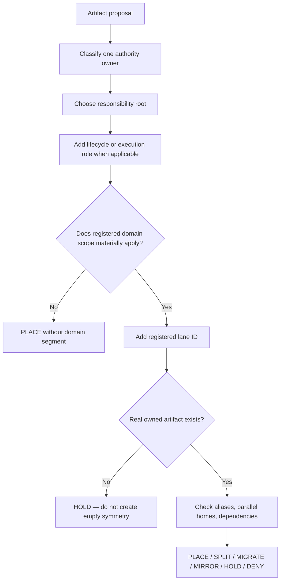

<!-- [KFM_META_BLOCK_V2]
doc_id: kfm://doc/domain-placement-law
title: KFM Domain Placement Law
type: architecture-guidance
version: v2.0.0
status: review
owners:
  - "@bartytime4life"
created: 2026-05-25
updated: 2026-08-18
policy_label: public
owning_root: docs/
responsibility: Explain how registered domain scope is placed inside KFM responsibility roots without creating domain roots, empty symmetry, source duplication, or parallel authority.
truth_posture: CONFIRMED adopted placement doctrine and current repository projections; PROPOSED lane inventory and sensitivity defaults where their source registers remain proposed; UNKNOWN uninspected implementation depth.
evidence_base:
  repository: bartytime4life/Kansas-Frontier-Matrix
  ref: main
  commit: 9cb437d803a431928d3b919d9a7814647f812583
related:
  - ../doctrine/directory-rules.md
  - ../adr/ADR-0029-adopt-directory-governance-standard-v2.md
  - contract-schema-policy-split.md
  - cross-domain-join-policy.md
  - TRUST_MEMBRANE.md
  - ../registers/DOMAIN_LANE.md
  - ../../control_plane/domain_lane_register.yaml
  - ../../control_plane/cross_domain_seam_register.yaml
  - ../../control_plane/root_registry.yaml
  - ../../tools/validators/directory_governance/validate_repository_topology.py
  - ../runbooks/VALIDATOR_ORCHESTRATOR.md
tags:
  - kfm
  - architecture
  - directory-governance
  - domain-lane
  - bounded-context
  - responsibility-root
  - sparse-placement
notes:
  - This document is derived architecture guidance. It does not amend Directory Rules or create domain, source, policy, release, or publication authority.
  - ADR-0029 adopted the exact Directory Rules v2 bytes even though the adopted source file intentionally retains its pre-adoption internal status label.
  - The current domain and seam registers are machine projections only; their proposed status and non-effects remain controlling.
[/KFM_META_BLOCK_V2] -->

<a id="top"></a>

# KFM Domain Placement Law

> **Operating law:** Place an artifact by the responsibility that owns it. Add a registered domain as an interior scope segment only when that responsibility actually exists. A domain is never a repository root, and a domain does not require an empty mirror lane in every root.

> [!IMPORTANT]
> This document is **derived, non-normative architecture guidance**. The accepted placement authority is [Directory Rules v2](../doctrine/directory-rules.md), adopted by [ADR-0029](../adr/ADR-0029-adopt-directory-governance-standard-v2.md). When this document conflicts with those sources, the accepted decision and adopted bytes govern.

## Document control

| Field | Current state |
|---|---|
| Status | `REVIEW` — review-ready replacement for v1.0; not an independent adoption decision |
| Version | `v2.0.0` |
| Owner and review route | `@bartytime4life`, confirmed by repository `CODEOWNERS` for `docs/architecture/` |
| Repository evidence base | `main@9cb437d803a431928d3b919d9a7814647f812583` |
| Authority class | Derived architecture guidance below Directory Rules and accepted ADRs |
| Placement outcome vocabulary | `PLACE`, `SPLIT`, `MIGRATE`, `MIRROR`, `HOLD`, `DENY` |
| Lifecycle invariant | `RAW -> WORK / QUARANTINE -> PROCESSED -> CATALOG / TRIPLETS -> PUBLISHED` |
| Public boundary | Ordinary clients use governed interfaces and released public-safe artifacts, not internal lifecycle stores |
| Supersession | Replaces v1.0 in place; no path move and no compatibility copy |

### Evidence and limits

| Status | Evidence-backed statement |
|---|---|
| **CONFIRMED** | ADR-0029 is accepted and adopts the exact verified Directory Rules v2 bytes at `docs/doctrine/directory-rules.md`. |
| **CONFIRMED** | The adopted source file still contains its original `PROPOSED_FOR_ADOPTION` header because ADR-0029 adopted exact bytes; the ADR records the effective post-adoption status. |
| **CONFIRMED** | Directory Rules v2 makes responsibility primary and scope secondary; domain lanes are sparse, source identity remains source-first, and cross-domain seams use explicit seam homes. |
| **CONFIRMED** | `control_plane/root_registry.yaml` is an active machine projection that declares itself non-authoritative. |
| **CONFIRMED** | `control_plane/domain_lane_register.yaml` currently projects 13 lane IDs, forbids domain roots, requires sparse lanes, and declares `status: PROPOSED`. |
| **CONFIRMED** | `control_plane/cross_domain_seam_register.yaml` is a partial, proposed, cite-only projection for five high-risk seams. |
| **PROPOSED** | The 13-lane inventory, unresolved aliases, sensitivity baselines, and lane-level owner roles remain projections until their stated governance gaps are resolved. |
| **UNKNOWN** | This document does not prove that every projected lane, contract, schema, policy, pipeline, test, release object, or runtime surface exists or is complete. |

## Contents

1. [Purpose and authority](#1-purpose-and-authority)
2. [Normative interpretation](#2-normative-interpretation)
3. [Deterministic placement protocol](#3-deterministic-placement-protocol)
4. [Current domain-lane projection](#4-current-domain-lane-projection)
5. [Responsibility-root routing](#5-responsibility-root-routing)
6. [Data, source, catalog, release, and executable routing](#6-data-source-catalog-release-and-executable-routing)
7. [Cross-domain seams](#7-cross-domain-seams)
8. [Cross-cutting scope, geography, and Focus Mode](#8-cross-cutting-scope-geography-and-focus-mode)
9. [Dependency-closed domain slices](#9-dependency-closed-domain-slices)
10. [Validation and review](#10-validation-and-review)
11. [Adding, renaming, merging, or retiring a lane](#11-adding-renaming-merging-or-retiring-a-lane)
12. [Migration, correction, and rollback](#12-migration-correction-and-rollback)
13. [Anti-patterns](#13-anti-patterns)
14. [Worked placement examples](#14-worked-placement-examples)
15. [Open verification backlog](#15-open-verification-backlog)
16. [Changelog](#16-changelog)

---

## 1. Purpose and authority

This guide answers one question:

> **After an artifact's owner is known, how may domain scope appear in its path without creating a new authority boundary?**

It does not answer whether a domain, source, feature, schema, policy, release, or public product should exist. Those decisions remain with the appropriate contracts, schemas, policy, source admission, accepted ADRs, evidence, review, release, correction, and rollback controls.

### 1.1 Authority order for domain-placement questions

Apply the repository's placement authority in this order:

1. KFM trust, lifecycle, evidence, public-boundary, correction, and rollback invariants.
2. Accepted, unsuperseded ADRs within their scope.
3. The adopted [Directory Rules v2](../doctrine/directory-rules.md).
4. Non-conflicting per-root and adjacent `README.md` contracts.
5. Current repository evidence as implementation fact, not automatic canon.
6. Architecture manuals, domain dossiers, registers, atlases, prompts, and prior plans as lineage or proposal.
7. Generic convention or personal preference.

The current machine projections help validators and reviewers discover expected identities, but they do not create authority:

- [`control_plane/root_registry.yaml`](../../control_plane/root_registry.yaml)
- [`control_plane/domain_lane_register.yaml`](../../control_plane/domain_lane_register.yaml)
- [`control_plane/cross_domain_seam_register.yaml`](../../control_plane/cross_domain_seam_register.yaml)

### 1.2 What this document may and may not do

This document may:

- explain accepted placement law;
- reconcile old examples with current doctrine;
- show bounded placement patterns;
- identify drift, ambiguity, and verification work;
- define reviewer questions and validation expectations.

This document may not:

- add, remove, rename, merge, or adopt a domain;
- create a canonical root, schema home, policy home, or release home;
- activate a source or authorize a cross-domain join;
- lower sensitivity, rights, evidence, review, or release requirements;
- turn a path, validator result, pull request, or diagram into publication authority.

[Back to top](#top)

---

## 2. Normative interpretation

### 2.1 The corrected law

The v1.0 sentence required a domain to appear in every responsibility root that "touches it." Directory Rules v2 narrows that rule:

> **A registered domain MAY appear as an interior scope segment only after the owning responsibility root is selected and only when a real artifact exists for that responsibility. Domain lanes MUST be sparse and evidence-driven. Empty symmetry scaffolding is prohibited.**

This produces six consequences.

1. **Responsibility precedes topic.** Decide whether the artifact is a human document, semantic contract, schema, policy rule, data instance, release decision, executable, test, fixture, or other governed family before adding domain scope.
2. **The repository root stays stable.** A domain name does not justify a top-level directory.
3. **Lanes are sparse.** A lane appears only where implemented responsibility exists. No rule requires an empty policy, package, pipeline, release, or data subtree merely because a domain is registered.
4. **Source identity stays source-first.** One source capture may support several domains without being copied into each domain lane.
5. **Mixed families keep their own ordering.** Catalog, receipt, proof, release, and cross-domain objects may be object-family-first or subtype-first rather than universally domain-first.
6. **Placement never grants authority.** Correct location does not prove truth, rights, policy approval, review, release, deployment, or publication.

### 2.2 Domain as bounded context, not sovereign subsystem

A KFM domain is a bounded semantic context inside shared KFM governance. It may own domain vocabulary, domain records, domain-specific validations, and domain-specific interpretation. It does not own:

- repository-root authority;
- global lifecycle law;
- schema-home or policy-home law;
- source identity merely because a source is useful to the domain;
- another domain's records or sensitivity decisions;
- cross-domain join authority;
- release or publication authority;
- a direct public bypass around governed interfaces.

Domain-driven design is useful background language here: a bounded context defines where a model and its terms apply. KFM adds a stricter governance rule: the context remains a scope dimension inside responsibility roots and must preserve evidence, policy, lifecycle, and release boundaries.

### 2.3 Sparse-lane diagram


```mermaid
flowchart TB
    A["Artifact proposal"] --> B["Classify one authority owner"]
    B --> C["Choose responsibility root"]
    C --> D["Add lifecycle or execution role when applicable"]
    D --> E{"Does registered domain scope materially apply?"}
    E -- "No" --> F["PLACE without domain segment"]
    E -- "Yes" --> G["Add registered lane ID"]
    G --> H{"Real owned artifact exists?"}
    H -- "No" --> I["HOLD — do not create empty symmetry"]
    H -- "Yes" --> J["Check aliases, parallel homes, dependencies"]
    J --> K["PLACE / SPLIT / MIGRATE / MIRROR / HOLD / DENY"]
```

A valid hydrology slice might contain a document, contract, schema, fixtures, validator, and tests while having no hydrology-specific policy bundle, package, pipeline, or release object. That is normal. Completeness is measured against the requested behavior and risk, not against a visually symmetric directory tree.

[Back to top](#top)

---

## 3. Deterministic placement protocol

Before naming a path, classify the artifact with the Directory Rules responsibility signature.

| Axis | Domain-placement question |
|---|---|
| `artifact_kind` | What is it: document, register, contract, schema, policy, executable, data instance, release decision, test, fixture, config, migration, example, or generated output? |
| `authority_owner` | Which one responsibility may define or mutate it? |
| `lifecycle_stage` | Is it pre-RAW, RAW, WORK, QUARANTINE, PROCESSED, CATALOG, TRIPLETS, PUBLISHED, receipt, proof, or registry material? |
| `execution_role` | Is it a deployable app, reusable library, connector, pipeline, declarative spec, repository tool, thin script, runtime adapter, or infrastructure? |
| `scope_kind` | Is scope global, domain, source, geography/Focus Mode, cross-domain seam, or object family? |
| `scope_id` | Which registered identifier applies? |
| `exposure` | Public, semi-public, internal, steward-only, or restricted? |
| `mutability` | Immutable, append-only, versioned replacement, generated, or ephemeral? |
| `retention` | Durable, release-bound, audit-bound, cacheable, or disposable? |
| `physical_storage` | Git, database, object storage, package registry, CI artifact, or external system? |

Then apply this sequence:

1. Classify one authority owner.
2. Choose its canonical responsibility root.
3. Apply root exclusions for artifact kind, exposure, mutation, and lifecycle.
4. Add execution role or lifecycle stage where applicable.
5. Add domain scope only if a registered lane ID materially applies.
6. Check aliases, canonical homes, compatibility homes, generated outputs, and legacy paths.
7. Check dependency direction and public-boundary rules.
8. Emit one finite outcome with evidence.

### 3.1 Finite outcomes

| Outcome | Domain-placement meaning |
|---|---|
| `PLACE` | One canonical responsibility path remains and the domain segment is justified. |
| `SPLIT` | One proposed file mixes independently owned responsibilities or domains and must become linked artifacts. |
| `MIGRATE` | A current file has a known canonical target but lives elsewhere. |
| `MIRROR` | A verified consumer requires a generated one-way compatibility copy with an exit condition. |
| `HOLD` | Lane identity, ownership, alias, sensitivity, or target evidence is unresolved. |
| `DENY` | The path would create a domain root, parallel authority, protected exposure, or another hard-rule violation. |

"Probably under the domain" is not a placement outcome.

[Back to top](#top)

---

## 4. Current domain-lane projection

Directory Rules v2 assigns canonical domain identity to the domain-lane register. The current register, however, explicitly declares itself `PROPOSED`, `machine_projection_only`, and unable to create or remove domains. The table below therefore reports the **current projected inventory**, not a fresh adoption decision.

| Lane ID | Display name | Code alias | Register posture |
|---|---|---|---|
| `agriculture` | Agriculture | `agriculture` | Projected |
| `archaeology` | Archaeology | `archaeology` | Projected |
| `atmosphere` | Atmosphere | `atmosphere` | Projected |
| `fauna` | Fauna | `fauna` | Projected |
| `flora` | Flora | `flora` | Projected |
| `geology` | Geology | `geology` | Projected |
| `habitat` | Habitat | `habitat` | Projected |
| `hazards` | Hazards | `hazards` | Projected |
| `hydrology` | Hydrology | `hydrology` | Projected |
| `people-dna-land` | People, DNA & Land | `people_dna_land` | Projected |
| `roads-rail-trade` | Roads, Rail & Trade | `roads_rail_trade` | Projected |
| `settlements-infrastructure` | Settlements & Infrastructure | `settlements_infrastructure` | Projected |
| `soil` | Soil | `soil` | Projected |

### 4.1 Unresolved aliases

The machine register records these unresolved aliases:

| Noncanonical alias | Projected target |
|---|---|
| `air` | `atmosphere` |
| `settlement` | `settlements-infrastructure` |
| `transport` | `roads-rail-trade` |

An unresolved alias does not authorize a new path. New work uses the projected target identifier or returns `HOLD` when compatibility consequences are unclear. Existing aliases require inventory, consumer evidence, migration state, and rollback before removal.

### 4.2 Sensitivity and ownership limits

The register includes projected sensitivity baselines, but it also states that sensitivity authority is pending governance and that verified owner identities are unavailable beyond the repository review route. Therefore:

- this document does not adopt the projected tier values;
- lowering a restriction requires applicable policy and steward review;
- exact archaeology, sensitive biodiversity, living-person, DNA, land/title, and critical-infrastructure data remain fail-closed;
- `@bartytime4life` is the confirmed repository review route, not proof of every domain-specialist, legal, cultural, privacy, or sovereignty role.

### 4.3 Cross-cutting exclusions

The current register excludes `matrix`, `scene`, and `spatial` from domain identity. They are cross-cutting concerns or representation/composition surfaces, not "special domains." Place their artifacts by the responsibility that owns them:

- matrix definitions and analytical products by contract, schema, data, policy, test, and release family;
- scene, 3D, and representation artifacts by renderer, manifest, evidence, policy, or delivery responsibility;
- spatial foundations by shared geometry, CRS, geography-version, transform, validation, or package responsibility.

Do not add these identifiers to every domain lane and do not create top-level roots for them.

[Back to top](#top)

---

## 5. Responsibility-root routing

The patterns below are routing defaults, not a requirement to create every path.

| Responsibility | Default domain-scoped pattern | Governing constraint |
|---|---|---|
| Human documentation | `docs/domains/<lane_id>/...` | Create only for domain-owned human guidance. Cross-domain architecture belongs under `docs/architecture/cross-domain/`. |
| Semantic meaning | `contracts/domains/<lane_id>/...` | Contracts define meaning and promises, not machine shape or policy. |
| Machine shape | `schemas/contracts/v1/domains/<lane_id>/...` | This is current repository convention and the direction of proposed ADR-0001; do not treat proposed ADR-0001 as accepted or create a parallel schema home. |
| Normative policy | `policy/domains/<lane_id>/...` | Create only when a domain-owned policy rule or bundle exists. A missing bundle is not filled for symmetry. |
| Executable conformance tests | `tests/domains/<lane_id>/...` | Tests prove bounded behavior; they do not grant truth, review, release, or publication status. |
| Reusable synthetic fixtures | `fixtures/domains/<lane_id>/...` | Fixtures must be synthetic/public-safe unless a stricter reviewed fixture policy applies. |
| Domain-owned validator concern | `tools/validators/domains/<lane_id>/...` or an existing concern-specific validator family | Choose by validator responsibility. Whole-system and seam validators do not belong under one participant merely for convenience. |
| Domain-oriented lifecycle data | `data/<lifecycle>/<lane_id>/...` | Use only when domain is the correct secondary scope. Catalog, receipt, proof, registry, and published-carrier families may require another ordering. |
| Release decision family | `release/<object_family>/<lane_id>/...` | Object family precedes domain. A release object is not lifecycle data. |
| Executable transformation | `pipelines/<stage>/<lane_id>/...` | Stage precedes domain; do not use `pipelines/domains/<lane_id>/`. |
| Declarative pipeline spec | `pipeline_specs/<stage>/<lane_id>/...` | Keep declarative specs distinct from executable pipelines. |

### 5.1 Roots that do not imply a domain lane

Several responsibility roots are intentionally organized by another primary dimension:

| Root | Primary routing dimension | Domain rule |
|---|---|---|
| `apps/` | Deployable application | Do not create one app per domain by default. A domain module may exist inside an app only under that app's verified architecture. |
| `packages/` | Reusable, independently testable concern | Do not create `packages/domains/<lane_id>/` for symmetry. Use a domain name only when the package itself is the real reusable concern. |
| `connectors/` | Source family | Use `connectors/<source_family>/`, even when one source supports several domains. |
| `runtime/` | Runtime substrate or bounded adapter | Do not route by domain unless the runtime contract itself proves a domain-owned adapter boundary. |
| `configs/` | Configuration profile | Add domain scope only when the profile's owner and consumers require it. |
| `infra/` | Provider or subsystem | Infrastructure is not domain truth and does not inherit domain ownership automatically. |
| `scripts/` | Thin task wrapper | Scripts do not create authority and should call governed tools. |
| `control_plane/` | Machine-readable governance projection | Domain entries belong in governed registers; one register per domain is not the default. |
| `artifacts/` | Transitional generated output | Generated output is not a trust-bearing domain home. |

[Back to top](#top)

---

## 6. Data, source, catalog, release, and executable routing

### 6.1 Lifecycle data

For a domain-owned data instance, the common shape is:

```text
data/<lifecycle>/<lane_id>/<object-or-dataset-scope>/...
```

Applicable lifecycle and accountability children include:

```text
pre_raw/
raw/
work/
quarantine/
processed/
catalog/
triplets/
receipts/
proofs/
registry/
published/
```

The domain segment is not always the next segment. Determine the owning plane first.

- RAW, WORK, QUARANTINE, and PROCESSED domain records commonly use domain as secondary scope.
- Catalogs are discoverability objects and may be subtype-first or mixed-lane.
- Triplets are projections and must preserve the identities and evidence of their owning records.
- Receipts and proofs are accountability object families; producer or domain does not automatically own their path.
- Registries may be source-, dataset-, layer-, authority-, or domain-indexed.
- Published carriers remain downstream artifacts; placement under `data/published/` does not make them released without release closure.

### 6.2 Source identity is source-first

A source is not duplicated once per consuming domain.

Canonical conceptual routing:

```text
connectors/<source_family>/...
data/registry/sources/<source_id>/...
```

Domain products may reference that source identity from hydrology, agriculture, hazards, habitat, or another lane. They must not copy one canonical source capture into several domain-owned RAW homes merely to simplify local code.

A source-role distinction must also survive domain placement. Observation, forecast, model, regulatory product, advisory, contextual source, aggregate, reconstruction, and synthetic output are not interchangeable because they share a domain.

### 6.3 Catalog routing

Do not force all catalog records into `data/catalog/domain/<lane_id>/`. Catalog objects may be organized by catalog profile or object subtype while carrying a domain field or registered scope reference.

A catalog record:

- describes or indexes an object;
- does not become the object;
- does not replace evidence, proof, review, policy, or release state;
- does not authorize public use.

### 6.4 Release routing

Release decisions use object-family-first placement:

```text
release/candidates/<lane_id>/...
release/manifests/<lane_id>/...
release/promotion_decisions/<lane_id>/...
release/correction_notices/<lane_id>/...
release/withdrawal_notices/<lane_id>/...
release/rollback_cards/<lane_id>/...
release/signatures/<lane_id>/...
```

These are examples of the governing order, not a command to create all families. A release slice adds only the families required by its accepted release contract.

Release objects must remain separate from:

- published data carriers;
- catalogs;
- receipts;
- proofs;
- reviews;
- policy decisions;
- generated documentation artifacts.

### 6.5 Executable routing

For executable domain work, classify the role before the lane:

```text
pipelines/<stage>/<lane_id>/...
pipeline_specs/<stage>/<lane_id>/...
connectors/<source_family>/...
tools/validators/<concern>/...
packages/<shared_concern>/...
apps/<appname>/...
runtime/<substrate>/...
```

A pipeline that emits a receipt, proof, catalog record, or release candidate writes each output through that object's governed repository abstraction. The pipeline's own directory does not become the output's authority home.

[Back to top](#top)

---

## 7. Cross-domain seams

A cross-domain seam is not "shared ownership." Each participant retains its own model, evidence, policy, sensitivity, and release authority. A seam describes permitted interaction without allowing one context to rewrite another.

Directory Rules v2 assigns explicit seam homes:

```text
contracts/cross_domain/
tests/cross_domain/
tools/validators/cross_domain/
docs/architecture/cross-domain/
```

Use `SPLIT`, `HOLD`, or `DENY` when a proposed cross-domain artifact cannot identify one authority owner.

### 7.1 Current seam projection

The current [`cross_domain_seam_register.yaml`](../../control_plane/cross_domain_seam_register.yaml) is partial and proposed. It records five high-risk seams:

- agriculture × soil suitability context;
- archaeology × roads/rail/trade historic-corridor context;
- atmosphere × hazards condition/advisory context;
- fauna × hydrology aquatic-occurrence context;
- hazards × settlements/infrastructure exposure context.

Its defaults are intentionally fail-closed:

- `CITE_ONLY`;
- one EvidenceBundle per participant;
- preserve source roles;
- apply the most restrictive sensitivity and policy;
- require each participant's release state;
- no mutation authority;
- no publication authority.

Every listed seam is currently `HOLD_UNRESOLVED`, has no active seam contract path, and does not allow a public join. This document does not change those outcomes.

### 7.2 Seam ownership rules

A cross-domain relation must state:

1. participating lane IDs;
2. the one owner of the relation or seam contract;
3. what each participant owns;
4. allowed direction and cardinality;
5. EvidenceRef/EvidenceBundle requirements for each participant;
6. temporal and geographic compatibility;
7. sensitivity and precision transformation;
8. policy and review requirements;
9. release requirements;
10. prohibited inferences;
11. correction and rollback propagation.

Do not place a join under one participant merely because its first prototype was written there.

[Back to top](#top)

---

## 8. Cross-cutting scope, geography, and Focus Mode

### 8.1 Cross-cutting concern

A cross-cutting concern such as time, identity, uncertainty, spatial reference, representation, hashing, evidence, or policy is routed by its object family and owner. It is not promoted into a domain merely because every domain uses it.

Examples:

- a common temporal envelope belongs with its semantic contract and machine schema;
- a geometry utility belongs under a reusable package if it is executable shared code;
- a representation receipt belongs with the applicable evidence/accountability family;
- a map scene is a delivery or representation object, not a new source of domain truth.

### 8.2 Geography

County, HUC, watershed, municipality, parcel, corridor, and other geographic scopes refine an already selected responsibility path. They do not become repository roots or domain IDs.

A geography segment requires:

- registered or deterministic identity;
- explicit spatial support;
- appropriate vintage or validity;
- no misleading centroid or guessed boundary;
- policy-safe precision.

### 8.3 Focus Mode

A Focus Mode is a compositional user/product scope, not a domain. It may combine released objects from several domains through governed interfaces. It must not:

- create a `focus-mode/` repository root;
- absorb participant evidence into one uncited narrative;
- lower participant sensitivity;
- read canonical/internal lifecycle stores directly;
- become release or publication authority.

Place each Focus Mode artifact inside the responsibility root that owns it: documentation, contract, schema, fixture, app module, pipeline spec, published carrier, or release decision.

[Back to top](#top)

---

## 9. Dependency-closed domain slices

A coherent domain slice is defined by one observable acceptance boundary, not by a fixed number of folders.

### 9.1 Closure by change type

| Change type | Direct companions to assess |
|---|---|
| Documentation-only clarification | Target Markdown, authority links, navigation, generated-doc relationships, doc lint, and link validation |
| Semantic object addition | Contract, machine schema when applicable, registry/index entry, valid and invalid fixtures, validator, focused tests, and explanatory docs |
| Policy-significant behavior | Semantic and machine contracts, policy rule, allow/deny/hold fixtures, policy tests, reviewer boundary, audit fields, and documentation |
| Pipeline behavior | Pipeline or connector, declarative spec where used, source descriptor, fixtures/mocks, receipts, failure outcomes, tests, and lifecycle documentation |
| Public API or UI behavior | Governed API contract, finite outcomes, evidence/policy/release checks, public-safe payload fixtures, boundary tests, UI trust states, and docs |
| Release-capable change | Candidate identity, policy/review references, receipts, proofs, catalog closure, release manifest, correction/withdrawal path, rollback target, and negative tests |

Not every change needs every companion. Every material claim does need enough companions to make that claim true and testable.

### 9.2 No empty symmetry

These are invalid completion strategies:

- creating placeholder READMEs in every root;
- adding empty `policy/domains/<lane_id>/` folders where no policy exists;
- adding package, pipeline, release, or data lanes solely to make a tree look uniform;
- declaring a domain complete because a directory matrix is filled.

The correct finite outcome for an unneeded lane is absence. The correct outcome for unclear responsibility is `HOLD`.

[Back to top](#top)

---

## 10. Validation and review

### 10.1 Repository topology validation

The current repository registers a deterministic, no-network topology validator:

```bash
python tools/validators/directory_governance/validate_repository_topology.py --format text
```

The canonical validator orchestrator can select the same guardrail from the changed path:

```bash
python tools/validate_all.py \
  --profile changed-area \
  --changed-path docs/architecture/domain-placement-law.md
```

A broader bounded run is:

```bash
python tools/validate_all.py --profile full
```

A green result proves only that the selected repository-owned validators passed for the tested revision. It does not prove source authority, evidence closure, policy approval, review authenticity, release, deployment, or publication.

### 10.2 Domain-placement reviewer checklist

Before approving a domain-scoped path, verify:

- [ ] The artifact has one authority owner.
- [ ] The responsibility root was selected before the domain segment.
- [ ] The lane ID is registered or the change is held pending the required governance decision.
- [ ] No unresolved alias is being hardened into a new canonical path.
- [ ] The lane is materialized only where a real artifact exists.
- [ ] The path does not duplicate source capture, schema, policy, catalog, proof, receipt, or release authority.
- [ ] Cross-domain semantics use an explicit seam boundary.
- [ ] Source roles, temporal support, geography, sensitivity, and release states remain distinct.
- [ ] Public applications do not read internal lifecycle stores.
- [ ] Tests include negative outcomes for likely boundary violations.
- [ ] Documentation states what is confirmed, proposed, unknown, and still needs verification.
- [ ] Migration and rollback are defined for renamed or moved paths.

### 10.3 Documentation validation

At minimum, a change to this file should verify:

- GitHub-flavored Markdown structure;
- relative links and heading anchors;
- no stale link back to the retired architecture copy of Directory Rules;
- no claim that proposed ADR-0001 or the proposed lane/seam registers are accepted;
- no newly invented path, owner, review, policy, release, or implementation claim.

[Back to top](#top)

---

## 11. Adding, renaming, merging, or retiring a lane

Domain identity is a governance decision, not a documentation convenience.

### 11.1 Admission evidence

A proposed lane needs evidence for:

1. a bounded model and ubiquitous language distinct from existing lanes;
2. a defined responsibility that is not merely a source, geography, feature, renderer, format, object family, or cross-cutting concern;
3. owned object families and prohibited ownership;
4. source-role and evidence requirements;
5. sensitivity, rights, sovereignty, and public-boundary posture;
6. cross-domain dependencies and prohibited inferences;
7. one accountable owner role and a review route;
8. deterministic identity and correction implications;
9. an implementation slice that does not require a new repository root.

### 11.2 Decision and implementation order

1. Inventory current paths, aliases, consumers, open branches, and competing proposals.
2. Prepare the governance decision and compatibility analysis.
3. Accept the decision before using it as authority.
4. Update the human and machine lane projections, aliases, and seam references.
5. Add only the responsibility lanes needed by the admitted implementation.
6. Add validators and negative fixtures for the new identity and alias rules.
7. Preserve migration, correction, and rollback evidence.
8. Deliver through a feature branch and review; do not imply release or publication.

Do not change Directory Rules or a lane decision and then treat the unaccepted edit as authority for dependent structural work in the same decision batch.

### 11.3 Rename, merge, and retirement

A lane rename or merge affects stable identity, paths, imports, contracts, schemas, policy, tests, data references, release records, citations, and correction lineage. It requires more than search-and-replace.

The plan must include:

- canonical old and new IDs;
- alias duration and permitted writers;
- all producers and consumers;
- identity preservation;
- one-way migration;
- historical reference behavior;
- validation and replay;
- rollback;
- exit criteria for the alias or retired path.

[Back to top](#top)

---

## 12. Migration, correction, and rollback

### 12.1 Migration sequence

For an existing domain-placement defect:

1. **Freeze authority inputs.** Pin the accepted rules, ADRs, root contracts, and current branch.
2. **Classify the object.** Separate mixed semantic, machine, policy, data, and release responsibilities.
3. **Inventory producers and consumers.** Include code imports, links, workflows, fixtures, generated outputs, runtime reads, and external references visible to the project.
4. **Choose the finite outcome.** `MIGRATE`, `SPLIT`, `MIRROR`, `HOLD`, or `DENY`.
5. **Define the target and compatibility window.** Do not create a second writable authority.
6. **Move with history preservation.** Prefer `git mv` or an equivalent history-preserving change.
7. **Repair references and generators.** Generated copies remain one-way.
8. **Validate exact behavior and negative boundaries.**
9. **Record migration and rollback evidence.**
10. **Retire the old path only after zero-writer and zero-consumer evidence.**

### 12.2 Correction

If a published or released object references a renamed or misclassified lane, correction must preserve the original identifier and explain the successor. Do not silently rewrite historical receipts, proofs, manifests, citations, or release records.

### 12.3 Rollback

For a documentation-only update to this file, rollback is a commit revert restoring the prior bytes. For structural migration, rollback must also restore:

- previous consumers and imports;
- previous registry and alias state;
- prior generated projections;
- prior runtime routing if changed;
- correction and cache state where public artifacts were affected.

A rollback target does not erase the migration record.

[Back to top](#top)

---

## 13. Anti-patterns

| Anti-pattern | Required disposition |
|---|---|
| `hydrology/`, `archaeology/`, or another domain at repository root | `DENY` |
| Creating the same empty lane under docs, contracts, schemas, policy, tests, data, pipelines, and release | `DENY` empty symmetry |
| Using `air`, `transport`, or `settlement` as a new canonical path while aliases remain unresolved | `HOLD` or governed migration |
| Copying one canonical source capture into every consuming domain | `DENY`; preserve source-first identity |
| Putting a schema in `contracts/` or policy in `schemas/` for convenience | `DENY` parallel authority |
| Putting release decisions under `data/`, `catalog/`, or `artifacts/` | `DENY` |
| Putting a cross-domain join under one participant with no context map | `SPLIT` or `HOLD` |
| Treating a catalog record, tile, graph edge, map layer, dashboard, or AI answer as root truth | `DENY` |
| Letting a public app read RAW, WORK, QUARANTINE, or unreleased internal stores | `DENY` |
| Inferring domain completeness from directory presence | `ABSTAIN` from maturity claim |
| Letting a watcher create PUBLISHED state or silently write main | `DENY` |
| Deleting an old lane or alias before consumer and historical-reference closure | `HOLD` |
| Using a proposed register or ADR as if accepted | `DENY` authority escalation |
| Treating a passing topology validator as release approval | `DENY` semantic overreach |

[Back to top](#top)

---

## 14. Worked placement examples

### 14.1 Domain contract and schema

**Request:** Define a hydrology observation assessment object.

**Placement reasoning:**

- meaning belongs to `contracts/`;
- machine shape belongs to `schemas/`;
- hydrology is the bounded scope;
- fixtures and tests prove the bounded contract;
- no source, policy, pipeline, package, or release lane is created unless the behavior requires it.

Illustrative result:

```text
contracts/domains/hydrology/<object>.md
schemas/contracts/v1/domains/hydrology/<object>.schema.json
fixtures/domains/hydrology/<object>/{valid,invalid}/
tests/domains/hydrology/test_<object>.py
tools/validators/domains/hydrology/validate_<object>.py
```

The exact validator path remains subject to existing concern-level conventions. Do not create a second validator family when an existing one owns the concern.

### 14.2 One source supporting several domains

**Request:** Use an official station feed for hydrology and agriculture context.

**Correct posture:**

```text
connectors/<source_family>/...
data/registry/sources/<source_id>/...
```

Hydrology and agriculture products reference the same source identity. They keep separate domain semantics, observation types, temporal support, policy, and release state. No duplicated source capture is created under two domain roots.

### 14.3 Cross-domain atmosphere × hazards context

**Request:** Relate atmospheric observations to a hazard advisory.

Current seam posture is `HOLD_UNRESOLVED`. Before implementation, a reviewed seam contract must preserve:

- atmosphere ownership of observations, models, and forecast context;
- hazards ownership of hazard-event and official-advisory context;
- the prohibition on treating an advisory as a measurement;
- the prohibition on treating a modeled forecast as observed condition;
- one EvidenceBundle per participant;
- most-restrictive policy and sensitivity;
- separate participant release states.

The seam belongs in explicit cross-domain homes, not beneath atmosphere or hazards alone.

### 14.4 Release manifest for one domain

**Request:** Record a hydrology release candidate.

A release manifest is a release-governance object:

```text
release/manifests/hydrology/<release_id>.json
```

The released carrier may live under `data/published/...`; its catalog description may live under `data/catalog/...`; its receipts and proofs remain separate accountability objects. None substitutes for the others.

### 14.5 County Focus Mode

**Request:** Build an Ellsworth County experience combining hydrology, hazards, roads, and settlements.

Ellsworth County is geography/product scope, not a new domain. Each artifact routes by its owner: app module, API contract, schema, fixture, published carrier, or release decision. The public experience consumes governed released surfaces and preserves the evidence and restrictions of every participant.

[Back to top](#top)

---

## 15. Open verification backlog

| ID | Status | Question | Closure evidence |
|---|---|---|---|
| `DPL-VERIFY-001` | `NEEDS_VERIFICATION` | When will the proposed domain-lane register receive an accepted registration-authority decision? | Accepted ADR or adopted register authority with immutable identity and reviewer record |
| `DPL-VERIFY-002` | `NEEDS_VERIFICATION` | Which projected lane paths and responsibilities exist on current main, and at what maturity? | Commit-pinned recursive inventory plus tests/artifacts for each claimed capability |
| `DPL-VERIFY-003` | `NEEDS_VERIFICATION` | How will `air`, `transport`, and `settlement` aliases converge without breaking consumers? | Alias inventory, migration record, compatibility tests, and rollback |
| `DPL-VERIFY-004` | `NEEDS_VERIFICATION` | Which authority adopts or replaces the projected sensitivity baselines? | Accepted policy/ADR and per-domain steward review |
| `DPL-VERIFY-005` | `NEEDS_VERIFICATION` | When will the five held cross-domain seams receive explicit contracts or documented denial? | Accepted seam decisions, contracts, fixtures, validators, and review state |
| `DPL-VERIFY-006` | `NEEDS_VERIFICATION` | Is `schemas/contracts/v1/domains/<lane_id>/` fully ratified as the domain schema convention? | Accepted schema-home decision or successor plus compatibility proof |
| `DPL-VERIFY-007` | `UNKNOWN` | Which external consumers depend on historical domain paths or aliases? | External-consumer inventory and migration acknowledgment |
| `DPL-VERIFY-008` | `NEEDS_VERIFICATION` | Which domain-specific owner and independent-review roles can be named without invention? | Maintainer decision and updated governance records |

Unresolved items fail closed. They do not authorize parallel homes or speculative scaffolding.

[Back to top](#top)

---

## 16. Changelog

### v2.0.0 — 2026-08-18

- Rebased the document on the exact Directory Rules v2 bytes adopted by ADR-0029.
- Recorded the current main evidence base and the confirmed `CODEOWNERS` review route.
- Replaced the v1.0 "every root" symmetry rule with the accepted sparse, evidence-driven lane law.
- Separated responsibility, lifecycle, execution role, and scope through the Directory Rules responsibility signature.
- Replaced the stale "13 core + 3 special domains" framing with the current proposed 13-lane projection and explicit cross-cutting exclusions.
- Preserved the proposed status and non-effects of the domain and cross-domain seam registers.
- Corrected source placement to source-family/source-ID routing instead of domain-first duplication.
- Corrected pipeline routing to stage-first and release routing to object-family-first.
- Removed universal domain-first catalog and package assumptions.
- Added finite placement outcomes, explicit seam homes, fail-closed seam defaults, dependency-closed slice guidance, current topology validation, migration discipline, and rollback.
- Replaced placeholder ownership with the repository-confirmed `@bartytime4life` review route while preserving unverified specialist roles as open work.

### v1.0 — 2026-05-25

Initial derived guide based on the pre-v2 Directory Rules and document-only evidence. Retained in Git history; superseded in place by v2.0.0.

[Back to top](#top)
