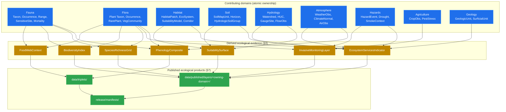
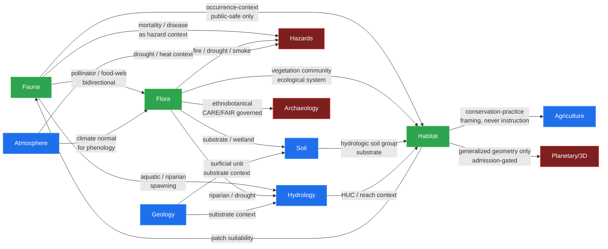

<!-- [KFM_META_BLOCK_V2]
doc_id: kfm://doc/ecology-cross-domain
title: Ecology as a Cross-Domain Concern — KFM Architecture Doctrine
type: standard
version: v1.0
status: draft
owners: Docs steward
created: 2026-05-25
updated: 2026-05-25
policy_label: public
related:
  - docs/architecture/directory-rules.md
  - docs/architecture/domain-placement-law.md
  - docs/architecture/contract-schema-policy-split.md
  - docs/domains/fauna/
  - docs/domains/flora/
  - docs/domains/habitat/
  - docs/domains/soil/
  - docs/domains/hydrology/
  - docs/domains/atmosphere/
  - docs/domains/hazards/
  - docs/domains/agriculture/
  - docs/domains/geology/
  - docs/standards/SENSITIVITY_RUBRIC.md
  - docs/standards/REDACTION_DETERMINISM.md
  - docs/doctrine/lifecycle-law.md
  - docs/doctrine/trust-membrane.md
  - docs/atlases/KFM_Domains_Culmination_Atlas_v1_1.pdf
tags: [kfm, doctrine, architecture, ecology, cross-domain, biodiversity, conservation, fauna, flora, habitat]
notes:
  - "Ecology is NOT a KFM domain. This document operationalizes that fact under Domain Placement Law §5 and §10."
  - "Owner field is placeholder ('Docs steward'); resolve in CODEOWNERS."
  - "All paths are PROPOSED unless explicitly CONFIRMED at a commit. v1.0 was authored without mounted-repo inspection."
[/KFM_META_BLOCK_V2] -->

# Ecology as a Cross-Domain Concern

> **Ecology is not a domain in KFM — it is a pattern of evidence that emerges when Fauna, Flora, Habitat, Soil, Hydrology, Atmosphere, Hazards, Agriculture, and Geology cite one another. The atoms belong to the contributing domains; the composition belongs to this document.**

**Status:** draft · **Owner:** Docs steward *(placeholder; verify in `CODEOWNERS`)* · **Last reviewed:** 2026-05-25

> [!IMPORTANT]
> **Not a domain.** Ecology MUST NOT become a `docs/domains/ecology/` folder, a `data/processed/ecology/` lane, or any other domain-shaped placement. Per [Domain Placement Law §1, §5, and §10](./domain-placement-law.md#1-the-law) and [Directory Rules §12, §13.4](./directory-rules.md#12-domain-placement-law), ecological concerns are **cross-cutting** — they compose evidence owned by multiple bounded contexts. This document is the architecture-side home for that composition. Atomic facts continue to live in their owning domain lanes (Fauna owns Taxon; Flora owns Plant Taxon; Habitat owns HabitatPatch; etc.).

---

## 📑 Contents

- [§0 — Status & Authority](#0-status--authority)
- [§1 — Why Ecology Is Not a Domain](#1-why-ecology-is-not-a-domain)
- [§2 — The Cross-Domain Composition Map](#2-the-cross-domain-composition-map)
- [§3 — Derived Ecological Concepts and Their Placement](#3-derived-ecological-concepts-and-their-placement)
- [§4 — Cross-Lane Edges](#4-cross-lane-edges)
- [§5 — Sensitivity, Geoprivacy, Rights, and CARE/FAIR](#5-sensitivity-geoprivacy-rights-and-carefair)
- [§6 — Taxonomic Authority Anchoring](#6-taxonomic-authority-anchoring)
- [§7 — Ecological Products and Where They Live](#7-ecological-products-and-where-they-live)
- [§8 — What Ecology MUST NOT Do](#8-what-ecology-must-not-do)
- [§9 — Reviewer Checklist for Ecology-Touching PRs](#9-reviewer-checklist-for-ecology-touching-prs)
- [§10 — Open Questions and NEEDS VERIFICATION](#10-open-questions-and-needs-verification)
- [§11 — Glossary](#11-glossary)
- [§12 — Changelog](#12-changelog)

---

## 0. Status & Authority

| Field | Value |
|---|---|
| **Document type** | Architecture doctrine (cross-domain composition; derived from Domain Placement Law §5 and §10) |
| **Edition** | v1.0 — initial cross-domain framing for ecology |
| **Authority of these rules** | **CONFIRMED — derives from Domain Placement Law (§5 cross-cutting placement, §10 anti-patterns) + Directory Rules §12 + Atlas v1.1 Ch. 24.4 (Cross-Lane Relation Atlas) + Atlas v1.1 Ch. 24.5 (Sensitivity Tier Reference T0–T4).** This document does not create new placement rules; it operationalizes existing law for a recurring multi-domain pattern. |
| **Authority of any specific path quoted here** | **PROPOSED** unless explicitly noted. v1.0 was authored without mounted-repo inspection. Mounted-repo presence of any named path remains **NEEDS VERIFICATION**. |
| **Conformance language** | RFC 2119-style: **MUST / MUST NOT** non-negotiable, **SHOULD / SHOULD NOT** strong default, **MAY** permitted. Same as [Directory Rules §2.2](./directory-rules.md#22-conformance-language-rfc-2119-style). |
| **Owner** | Docs steward *(placeholder; resolve in `CODEOWNERS`)*. Per-concern reviewers: Fauna steward + Flora steward + Habitat steward are the minimum review surface for ecology-touching PRs. |
| **Reviewers required for change** | Docs steward + at least two of the contributing domain stewards (Fauna, Flora, Habitat, Soil, Hydrology, Atmosphere, Hazards, Agriculture, Geology). ADR required for: promoting a derived ecological concept to a cross-cutting object family (§5.3 of DPL); changing the §5 sensitivity-tier defaults; introducing a new derived product class. |
| **Supersedes** | None. First edition. **Does not supersede** any domain dossier — Atlas v1.1 per-domain chapters (Fauna, Flora, Habitat, etc.) remain authoritative for atomic concepts. |
| **Related doctrine** | [`docs/architecture/directory-rules.md`](./directory-rules.md), [`docs/architecture/domain-placement-law.md`](./domain-placement-law.md), [`docs/architecture/contract-schema-policy-split.md`](./contract-schema-policy-split.md), [`docs/atlases/KFM_Domains_Culmination_Atlas_v1_1.pdf`](../atlases/) Chapters 5 (Soil), 6 (Habitat), 7 (Fauna), 8 (Flora), 24.4 (Cross-Lane Relations), 24.5 (Sensitivity Tiers), 24.14 (Object Family × Domain Matrix). Background: *Domain-Driven Design Reference* (Evans, 2015) — Shared Kernel, Customer/Supplier, Open Host Service patterns; FAIR Data Principles (Wilkinson et al., 2016); CARE Principles for Indigenous Data Governance (GIDA, 2019). |
| **Lifecycle invariant** | RAW → WORK / QUARANTINE → PROCESSED → CATALOG / TRIPLET → PUBLISHED. Inherited; ecological derivations enter the lifecycle at **PROCESSED** (after their contributing atomic facts have closed evidence). |
| **Default sensitivity posture** | **Deny-default for sensitive taxa.** T4 by default for occurrence-restricted, rare-plant precise locations, and sensitive sites; T1 generalized public derivatives require `RedactionReceipt` + `ReviewRecord` + `PolicyDecision`. See [§5](#5-sensitivity-geoprivacy-rights-and-carefair). |
| **Last reviewed** | 2026-05-25 |

> **Truth-posture note (v1.0).** This document is grounded in: (a) [`docs/architecture/domain-placement-law.md`](./domain-placement-law.md) v1.0 and [`docs/architecture/directory-rules.md`](./directory-rules.md) v1.3.1 (CONFIRMED authored); (b) *KFM Domains v1.1 + Pass 23/32 Consolidated Atlas* — Chapters 5–8 (Soil, Habitat, Fauna, Flora) per-domain dossiers; Ch. 24.4 (Cross-Lane Relation Atlas) for the §4 edge tables; Ch. 24.5 (Tier Reference T0–T4) for the §5 sensitivity table; Ch. 24.14 (Object Family × Domain Reference Matrix); (c) `kfm_unified_doctrine_synthesis.md` §16 per-domain sensitivity matrix; (d) Pass 10 Idea Index entries C7-07 (ITIS TSN), C7-08 (GBIF Backbone), C10 (Biodiversity subdomain), C6-01 (Sensitivity), C6-04 (Grid generalization). **No mounted repo was inspected for v1.0**; every concrete path is **PROPOSED**.

[⤴ Back to top](#-contents)

---

## 1. Why Ecology Is Not a Domain

KFM applies the [Domain Placement Law](./domain-placement-law.md) eligibility test (§8.1 there) to every candidate domain. Ecology fails it on the first criterion.

| DPL §8.1 criterion | Result for "ecology" | Why |
|---|---|---|
| **Bounded responsibility** with distinct ownership | ❌ FAIL | Every atomic ecological fact is already owned. Taxon = Fauna. Plant Taxon = Flora. HabitatPatch + EcologicalSystem + Habitat Quality Score = Habitat. SoilMapUnit = Soil. Watershed/Reach = Hydrology. WeatherObservation/ClimateNormal = Atmosphere. There is no remainder for an "ecology" domain to own. |
| **Ubiquitous language** distinct from neighbors | ❌ FAIL | "Food web," "biodiversity," "ecosystem services," "ecological community" — these terms compose existing domain vocabularies (Taxon × HabitatPatch × VegetationCommunity × ConnectivityEdge). They are *derived*, not primary. |
| **Lifecycle applicability** (own source-edge captures) | ❌ FAIL | Ecology has no `data/raw/ecology/` because the source data is already in `data/raw/{fauna,flora,habitat,soil,hydrology,…}/`. Ecology consumes; it does not capture. |
| **Cross-lane relations exist** | ✅ pass | Ecology has the cross-lane relations — that is what it *is*. But this one passing criterion does not promote it; it confirms it is cross-cutting. |

> [!NOTE]
> **DDD framing.** In Evans's terms, ecology is a **Shared Kernel** pattern across multiple Bounded Contexts (Fauna, Flora, Habitat, …), not a Bounded Context itself. The contributing domains use shared concepts (Taxon, EvidenceBundle, GeographyVersion) and emit derivations (species richness grid) without merging into a single context. The right architectural move for a Shared Kernel is **explicit cross-domain doctrine** — this document — not a new domain folder.

### 1.1 Three failure modes if ecology were treated as a domain

1. **Parallel authority.** A `docs/domains/ecology/taxon.md` would shadow `docs/domains/fauna/taxon.md` ([Directory Rules §13.5](./directory-rules.md#135-additional-anti-patterns) anti-pattern "Cross-cutting object family shadowed").
2. **Truth fragmentation.** A `data/processed/ecology/` lane would create a second copy of occurrence data that diverges from Fauna's canonical version ([DPL §4.2](./domain-placement-law.md#42-lifecycle-fragmentation)).
3. **Ownership ambiguity.** A "joint" Fauna/Flora/Habitat domain would have no clear steward, no clear review burden, and no clear correction-path owner. KFM's authority ladder requires a single owner per object family.

### 1.2 What ecology IS, architecturally

Ecology is the **set of evidence-bounded compositions** that emerge when contributing domains cite one another under governed cross-lane joins. Concretely:

- **Atoms** (Taxon, Plant Taxon, HabitatPatch, SoilMapUnit, …) live in their owning domains.
- **Cross-lane edges** (Fauna ↔ Habitat occurrence-context, Flora ↔ Soil substrate-context, Fauna ↔ Flora food-web context) live in [Atlas v1.1 Ch. 24.4](../atlases/) as doctrine and as governed joins in `policy/cross-lane/`.
- **Derivations** (species richness grid, biodiversity index, suitability surface, invasive monitoring layer) live in `data/triplets/` or `data/processed/<owning-domain>/` per §3 below, with **EvidenceBundle** support tracing back to every contributing atom.
- **Published products** live in `data/published/layers/<owning-domain>/` and `data/published/api_payloads/`, each with a `ReleaseManifest` and (if rendered in 3D) a `RepresentationReceipt`.

[⤴ Back to top](#-contents)

---

## 2. The Cross-Domain Composition Map

Ecological evidence in KFM is built from atoms owned by **nine contributing domains**. The map below pairs each atom with its owning domain — copying this map into a per-feature PR description is the canonical way to make composition visible at review time.

### 2.1 Atomic ownership

| Atomic concept | Object family | Owning domain | Atlas dossier |
|---|---|---|---|
| Animal taxonomic identity | Taxon, Taxon Crosswalk | Fauna | [DOM-FAUNA] |
| Animal occurrence (restricted) | Occurrence Restricted | Fauna | [DOM-FAUNA] |
| Animal occurrence (public-safe) | Occurrence Public | Fauna | [DOM-FAUNA] |
| Animal range / seasonal range / migration | RangePolygon, SeasonalRange, MigrationRoute | Fauna | [DOM-FAUNA] |
| Animal sensitive site | SensitiveSite | Fauna | [DOM-FAUNA] |
| Animal mortality / disease | MortalityObservation, DiseaseObservation | Fauna | [DOM-FAUNA] |
| Invasive animal record | Invasive Species Record (animal subtype) | Fauna | [DOM-FAUNA] |
| Plant taxonomic identity | Plant Taxon, FloraTaxon Crosswalk | Flora | [DOM-FLORA] |
| Plant occurrence / specimen | Flora Occurrence, SpecimenRecord | Flora | [DOM-FLORA] |
| Rare plant location | Rare Plant Record | Flora | [DOM-FLORA] |
| Vegetation community | Vegetation Community | Flora | [DOM-FLORA] |
| Invasive plant record | InvasivePlantRecord | Flora | [DOM-FLORA] |
| Plant phenology | Phenology Observation | Flora | [DOM-FLORA] |
| Habitat patch / ecological system | HabitatPatch, EcologicalSystem | Habitat | [DOM-HAB] |
| Land cover observation | LandCoverObservation | Habitat | [DOM-HAB] |
| Habitat quality / suitability | Habitat Quality Score, SuitabilityModel | Habitat | [DOM-HAB] |
| Connectivity / corridor | ConnectivityEdge, Corridor | Habitat | [DOM-HAB] |
| Restoration opportunity | Restoration Opportunity, StewardshipZone | Habitat | [DOM-HAB] |
| Soil substrate | SoilMapUnit, SoilComponent, Horizon, SoilProperty | Soil | [DOM-SOIL] |
| Hydrologic context | Watershed, HUCUnit, ReachIdentity, GaugeSite, FlowObservation | Hydrology | [DOM-HYD] |
| Water quality | Water Quality Observation | Hydrology | [DOM-HYD] |
| Climate / weather context | WeatherObservation, ClimateNormal, AirObservation | Atmosphere | [DOM-AIR] |
| Hazard exposure (fire, drought, flood, disease) | HazardEvent, HazardObservation, DroughtIndicator, SmokeContext | Hazards | [DOM-HAZ] |
| Agricultural pressure | CropObservation, Pest Stress Indicator | Agriculture | [DOM-AG] |
| Geologic / surficial substrate | GeologicUnit, SurficialUnit, Lithology | Geology | [DOM-GEOL] |

> [!IMPORTANT]
> **The Cross-Cutting Object Family Rule applies.** `SourceDescriptor`, `EvidenceRef`, `EvidenceBundle`, `ValidationReport`, `PolicyDecision`, `RedactionReceipt`, `ReleaseManifest`, `RepresentationReceipt`, `GeographyVersion`, `CoordinateReferenceProfile` — these are cross-cutting per [DPL §5.3](./domain-placement-law.md#53-object-families-that-are-intrinsically-cross-cutting). Ecology cites them; it does NOT shadow them with ecology-specific copies.

### 2.2 The composition view (Mermaid)

[⤴ Back to top](#-contents)

---

## 3. Derived Ecological Concepts and Their Placement

A **derived ecological concept** is a finding that exists only because two or more atomic facts have been joined under a governed policy. Derivations are not atoms; they have an EvidenceBundle that must resolve back to every contributing atom, and they enter the lifecycle at PROCESSED — never at RAW.

### 3.1 Placement rule for derivations

The rule turns on **which contributing domain has the strongest stewardship interest**:

| If the derivation primarily concerns… | …it lives under… | Steward owns review |
|---|---|---|
| Animal taxonomic patterns (species richness, food web, occurrence density) | `data/processed/fauna/<derivation>/<version>/` + `data/published/layers/fauna/` | Fauna steward |
| Plant taxonomic patterns (vegetation community structure, invasive plant front, phenology composite) | `data/processed/flora/<derivation>/<version>/` + `data/published/layers/flora/` | Flora steward |
| Habitat structure (suitability surface, connectivity, corridor analysis, restoration prioritization) | `data/processed/habitat/<derivation>/<version>/` + `data/published/layers/habitat/` | Habitat steward |
| Genuinely multi-domain with no dominant stewardship (ecosystem services, biodiversity index for a county, ecological community footprint) | `data/triplets/ecology/<derivation>/<version>/` + `data/published/layers/<area>/` if Focus-Mode-scoped | Multi-steward review (Fauna + Flora + Habitat) |
| Cross-domain validators producing only an EvidenceBundle attestation (not a new layer) | `tools/validators/ecology/<check>.py` | Validator-suite owner |
| Graph projections that surface relationships (taxon-habitat edges, food-web triples) | `data/triplets/ecology/<projection>/` | Triplets-subsystem owner |

> [!NOTE]
> **Why `data/triplets/ecology/` exists and `data/processed/ecology/` does not.** The lifecycle invariant ([Directory Rules §9.1](./directory-rules.md#91-data--the-lifecycle-invariant)) gates `data/processed/` on owning-domain validation. A multi-domain derivation has no single owning domain at `processed/` level. By contrast, `data/triplets/` is explicitly the graph-projection home — it expects cross-domain composition. So when no single domain dominates, the derivation enters lifecycle at `triplets/`, not at `processed/`. This is **not** the creation of an "ecology domain"; `data/triplets/` is an existing lifecycle phase ([Directory Rules §9.1](./directory-rules.md#91-data--the-lifecycle-invariant)), and `ecology/` is a topic segment inside it — analogous to `data/triplets/graph_deltas/` or `data/triplets/exports/`.

### 3.2 Standard derivations and their canonical homes

| Derivation | Definition | Canonical home | Inputs |
|---|---|---|---|
| **Species Richness Grid** | Count of distinct species per spatial unit, per time slice, per generalization tier. | `data/published/layers/fauna/species_richness_grid/` (animals); `data/published/layers/flora/species_richness_grid/` (plants); `data/published/layers/<area>/species_richness/` (combined, Focus-Mode-scoped). | Fauna Occurrence Public + Flora Occurrence + GeographyVersion. T1 default; T4 if any contributing record is sensitive. |
| **Occurrence Density Grid** | Heatmap of records per unit area; generalized per sensitivity rules. | `data/published/layers/fauna/occurrence_density/`; `data/published/layers/flora/occurrence_density/`. | Owning-domain Occurrence Public only. Restricted records NEVER cross. |
| **Food Web Context** | Triplet projection of predator-prey, pollinator, herbivory relations. | `data/triplets/ecology/food_web/<version>/` | Fauna Taxon × Flora Plant Taxon × literature-sourced trophic edges (own `SourceDescriptor`). |
| **Biodiversity Index** (Shannon, Simpson, etc.) | Scalar diversity index per spatial unit per time. | `data/processed/fauna/biodiversity_index/` (animal-specific); `data/processed/flora/biodiversity_index/` (plant-specific); `data/triplets/ecology/biodiversity_combined/` (multi-kingdom). | Owning-domain Occurrence Public + GeographyVersion. |
| **Suitability Surface** | Modeled probability of habitat suitability per spatial unit per species. | `data/processed/habitat/suitability_surface/<species>/<version>/` | HabitatPatch + LandCoverObservation + SuitabilityModel + Fauna or Flora target Taxon. **`Model Run Receipt` required.** |
| **Connectivity / Corridor Layer** | Modeled or empirical movement corridors between habitat patches. | `data/processed/habitat/connectivity/<version>/` | HabitatPatch + ConnectivityEdge + Corridor + roads-rail-trade barrier context. |
| **Invasive Monitoring Layer** | Composite layer of invasive plant + invasive animal presence per area. | `data/published/layers/<area>/invasive_monitoring/` | Flora InvasivePlantRecord + Fauna invasive subtype + Hazards exposure context. |
| **Phenology Composite** | Time-aware composite of bloom, leaf-out, migration timing. | `data/triplets/ecology/phenology/<version>/` | Flora Phenology Observation + Fauna MigrationRoute + Atmosphere ClimateNormal. |
| **Ecosystem Services Indicator** | Modeled ecosystem function per spatial unit (pollination, water filtration, carbon). | `data/processed/habitat/ecosystem_services/<service>/<version>/` | HabitatPatch + SoilProperty + Watershed + Vegetation Community + agricultural context. **`Model Run Receipt` required;** **`Reality Boundary Note` required** if a synthetic surface is involved (per [`docs/architecture/maplibre-3d.md`](./maplibre-3d.md)). |
| **Ecological Community Footprint** | Spatial extent of named ecological communities (e.g., "tallgrass prairie remnant"). | `data/triplets/ecology/communities/<community>/<version>/` | Flora Vegetation Community + Habitat EcologicalSystem + Soil + Hydrology context. |

### 3.3 Evidence requirements for every derivation

Per the trust membrane ([Directory Rules §7.1](./directory-rules.md#71-apps--deployable-applications), [Trust Membrane doctrine](../doctrine/trust-membrane.md)), **every ecological derivation MUST**:

1. **Resolve EvidenceRef back to every contributing atom.** An `EvidenceBundle` listing only Fauna sources is incomplete for a multi-domain derivation; it must enumerate Flora, Habitat, Soil, etc. contributors as appropriate.
2. **Carry a `Model Run Receipt`** if the derivation involved any model (suitability surfaces, biodiversity indices, ecosystem services indicators). The receipt records: model identity, version, training data EvidenceBundle, parameter set, run timestamp, output digest. Lives in `data/receipts/ai/` per [Directory Rules §9.1](./directory-rules.md#91-data--the-lifecycle-invariant).
3. **Carry a `Reality Boundary Note`** if any contributing geometry is reconstructed, interpolated, or synthetic (per [`docs/architecture/maplibre-3d.md`](./maplibre-3d.md)).
4. **Pass through `ReleaseManifest`** before becoming public-safe. Direct write to `data/published/` is forbidden ([Directory Rules §13.5 anti-patterns](./directory-rules.md#135-additional-anti-patterns)).
5. **Apply sensitivity rules of the strictest contributing record.** A species-richness grid that includes any T4 species defaults to T1 (generalized) only if the T4 contributions have valid `RedactionReceipt` records; otherwise the entire derivation is T4. See §5.

[⤴ Back to top](#-contents)

---

## 4. Cross-Lane Edges

The Atlas v1.1 Ch. 24.4 Cross-Lane Relation Atlas is the canonical edge inventory. This section restates the **ecologically-relevant** edges (those that compose into the derivations of §3) and notes their constraints. Where Atlas v1.1 and this document conflict, **Atlas v1.1 governs** ([Directory Rules §2.1](./directory-rules.md#21-authority-order) authority order).

### 4.1 Habitat as integrating context

| Owner | Cites from | Relation | Constraint |
|---|---|---|---|
| Habitat | Fauna | Habitat patch + ecological system provide context for occurrence interpretation. | Restricted occurrences NEVER cross into habitat-quality model evaluation; only Occurrence Public flows. |
| Habitat | Flora | Vegetation community feeds ecological system mapping. | Rare-plant exact location DENIED to public consumers; generalized derivatives only. |
| Habitat | Agriculture | Conservation-practice candidates framed by habitat-quality scores. | **Never used to instruct land management** — KFM is observational, not prescriptive. |
| Habitat | Planetary/3D | Habitat patches admitted to 3D scenes only via generalized geometry. | Sensitive habitat DENIED in 3D ([`docs/architecture/maplibre-3d.md`](./maplibre-3d.md) admission rule). |

### 4.2 Fauna as occurrence and disease source

| Owner | Cites from | Relation | Constraint |
|---|---|---|---|
| Fauna | Habitat | Occurrence records (public-safe only) feed habitat-quality model evaluation. | Restricted occurrences NEVER cross. Default-deny per [Atlas Ch. 24.5](../atlases/). |
| Fauna | Flora | Pollinator, food-web, invasive, ecological community context. | Edge preserved bidirectionally; both domains record the same edge with their respective `EvidenceRef`. |
| Fauna | Hazards | Mortality / disease observations as hazard context (wildlife disease, fish kills). | Rights and stewardship checks required; some mortality events are themselves sensitive (e.g., endangered-species die-offs). |
| Fauna | Agriculture | Pest stress indicators agriculture-owned; fauna provides taxonomic identity only. | Fauna does not own pest-stress framing; the join is a citation, not a transfer of authority. |

### 4.3 Flora as botanical and community source

| Owner | Cites from | Relation | Constraint |
|---|---|---|---|
| Flora | Habitat | Habitat association and vegetation community context. | Public-safe only; rare-plant exact locations DENIED. |
| Flora | Fauna | Pollinator, food-web, invasive, biodiversity context. | Bidirectional citation; food-web edges are graph-only at `data/triplets/ecology/food_web/`. |
| Flora | Soil / Hydrology | Substrate, wetland, riparian, drought context. | Joins are advisory; do NOT promote a soil or hydrology record to "flora truth." |
| Flora | Hazards | Fire, drought, flood, smoke, vegetation stress. | Hazards owns the event; Flora owns the vegetation-response observation. |
| Flora | Archaeology | Ethnobotanical context (steward-reviewed). | **CARE/FAIR governance applies** ([§5.3](#53-care--fair-for-ethnobotanical-and-cultural-data)); never overrides cultural-heritage authority. |

### 4.4 The full ecological edge graph (Mermaid)

> [!TIP]
> **Edges are bidirectional citations, not data transfers.** When Fauna cites Habitat for occurrence context, no data leaves Habitat's lane — Fauna gets an `EvidenceRef` pointing at a Habitat-owned record. The data continues to live in `data/processed/habitat/`; only the *reference* travels.

[⤴ Back to top](#-contents)

---

## 5. Sensitivity, Geoprivacy, Rights, and CARE/FAIR

Ecology is **the most-exercised domain in KFM for sensitivity controls** (Pass 10 C10 dossier, [DOM-FAUNA] / [DOM-FLORA] / [DOM-ARCH] cross-references). Three families of constraint apply, each with deny-default posture:

### 5.1 The T0–T4 tier scheme (Atlas Ch. 24.5)

| Tier | Audience | Ecological example | Required transform / gate |
|---|---|---|---|
| **T0** Open | Any public client via governed API | Common species range polygon; HUC12 watershed; SSURGO public soil layer | Standard Gates A–G ([Lifecycle Law](../doctrine/lifecycle-law.md)). |
| **T1** Generalized | Any public client via governed API, after transform | Species richness grid (county-resolution); occurrence density (5 km cell); generalized public flora layer; phenology composite | `RedactionReceipt` OR `AggregationReceipt`; transform recorded; `PolicyDecision`. |
| **T2** Reviewer | Stewards, reviewers, named research collaborators | Suitability surface for sensitive species; raw biodiversity index with rare-species contributions; ethnobotanical context awaiting steward review | Authentication + `PolicyDecision` + correction path active. |
| **T3** Restricted | Named authorized parties only | Exact-coordinate occurrence under research-data-sharing agreement; eBird EBD derivative under restricted-use terms | Named-party agreement + rights closure + recorded access. |
| **T4** Denied | — | OccurrenceRestricted exact coordinates; RarePlantRecord precise location; SensitiveSite; sacred sites; endangered-species mortality | DENY default; existence may be acknowledged only as steward review permits. |

### 5.2 Per-object default tiers (Atlas Ch. 24.5.2 ecology subset)

| Domain / object class | Default tier | Allowed transforms | Required gates |
|---|---|---|---|
| Fauna — sensitive occurrence (S1/S2 NatureServe; KDWP SINC) | **T4** | Geoprivacy generalization (grid coarsening, fuzzing, suppression) + `RedactionReceipt` → T1. | `RedactionReceipt` + `ReviewRecord` + `PolicyDecision`. |
| Fauna — range polygon | T1 | Aggregate / generalized public-safe layer. | `AggregationReceipt` or `RedactionReceipt`. |
| Fauna — SensitiveSite | **T4** | NO generalization releases this to T0; T2 only with steward review; T3 only under named agreement. | Sovereignty/conservation review + `ReviewRecord` + `PolicyDecision`. |
| Flora — rare-plant precise locations | **T4** | Generalization + `RedactionReceipt` → T1; ethnobotanical context governed under CARE/FAIR (§5.3). | `RedactionReceipt` + `ReviewRecord`. |
| Flora — Vegetation Community (public extent) | T0 / T1 | Generalization to the appropriate scale; no exact rare-plant locations. | Standard Gates A–G. |
| Habitat — HabitatPatch (general extent) | T0 | Public layer; standard generalization. | Standard Gates A–G. |
| Habitat — StewardshipZone (sensitive) | T2 | Public summary only; precise locations to reviewers. | `policy/sensitivity/stewardship_zone.rego`. |
| Habitat — Regulatory critical habitat (USFWS) | T0 | Mirror the federal release; do not extend beyond federal scope. | Source-authority check; federal-release alignment. |
| Hydrology — well / withdrawal records | T1 / T2 | Aggregation; private-owner join denial. | `AggregationReceipt`; person-parcel join denial. |
| Atmosphere — observed weather | T0 / T1 | Stale-state badge; operational disclaimer. | Stale-state policy. |
| **Multi-domain derivation including any T4 contribution** | **T4 if no valid redaction; otherwise T1** | Each T4 contributor's `RedactionReceipt` must be valid; aggregate must satisfy strictest contributor. | All §3.3 evidence requirements + every contributor's redaction chain. |

> [!WARNING]
> **The strictest-contributor rule is non-negotiable.** A species-richness grid that includes any T4 species without a valid `RedactionReceipt` chain is T4 entirely — not a generalized public layer with the sensitive species "averaged out." Per [Atlas v1.1 §16](../atlases/) and [`kfm_unified_doctrine_synthesis.md`](../../kfm_unified_doctrine_synthesis.md) §16: derived layers carry the highest tier of any contributing record until the redaction chain proves otherwise.

### 5.3 CARE + FAIR for ethnobotanical and cultural data

Ecological data sometimes touches Indigenous knowledge — ethnobotany (Flora ↔ Archaeology citation), traditional ecological knowledge (TEK), sacred-site adjacency. Two principle frameworks apply, both **EXTERNAL doctrine** referenced here for cross-reference, not authored in KFM:

- **FAIR Data Principles** (Findable, Accessible, Interoperable, Reusable). KFM's default open posture aligns with FAIR for T0–T1 ecological data.
- **CARE Principles for Indigenous Data Governance** (Collective Benefit, Authority to Control, Responsibility, Ethics). For ethnobotanical and cultural-heritage-adjacent ecological data, CARE OVERRIDES FAIR default-open. The Atlas treats this as a **deny-default with steward review** posture ([Atlas Ch. 24.5.2 Archaeology rows](../atlases/), extended to ecology via the Flora ↔ Archaeology edge).

| Concern | Posture | Owning doctrine |
|---|---|---|
| Ethnobotanical plant use records | T2 / T3 default; T0 only with explicit community-consent record | [`policy/sensitivity/ethnobotanical/`](../../policy/) (PROPOSED) |
| Sacred-site-adjacent species records | T4 default — adjacency itself is a signal | [`policy/sensitivity/sacred-site-adjacency.rego`](../../policy/) (PROPOSED) |
| Indigenous TEK contributions | Sovereignty review required; CARE applies | Archaeology + Flora steward joint review |
| Citizen-sensor occurrence (iNaturalist obscured-coordinate records) | Geoprivacy honored; never un-obscure | `policy/sensitivity/citizen-sensor-geoprivacy.rego` (PROPOSED) |

> [!CAUTION]
> **CARE is not auto-derivable from a SourceDescriptor.** KFM cannot determine cultural-heritage relevance from a taxonomic ID alone (e.g., big bluestem is botanically common but culturally significant to Plains tribes). CARE-relevance is a **steward-reviewed flag** on the record, not a computed property. Default DENY for ethnobotanical context until the flag is set explicitly.

### 5.4 The geoprivacy generalization staircase

When an occurrence is sensitive but a public-safe derivative is desired, the standard staircase (PROPOSED; per [Pass 10 C6-04](../../KFM_Components_Pass_10_Idea_Index_Category_Atlas_and_Expansion_Dossier.pdf)):

1. **Raw**: exact coordinate. T4. NEVER public.
2. **Obscured-by-source**: source-applied fuzz (e.g., iNaturalist "obscured" mode, ~10 km box). T3 or T2 depending on contract.
3. **KFM-generalized to grid cell**: 1 km, 5 km, 10 km, county. Generalization choice driven by species-specific sensitivity. Emits `RedactionReceipt`. → T1.
4. **KFM-aggregated**: density grid, richness grid. Emits `AggregationReceipt`. → T0 or T1.
5. **Public release**: T0 or T1 only, via `ReleaseManifest`.

Generalization MUST be **deterministic** (per [Pass-10 C6-03 `REDACTION_DETERMINISM`](../standards/)): the same input + the same redaction rules MUST produce the same output. Non-deterministic redaction is a failure mode — it makes audit impossible.

[⤴ Back to top](#-contents)

---

## 6. Taxonomic Authority Anchoring

Every ecological record in KFM MUST anchor to at least one taxonomic authority. The KFM anchoring rule (per [Pass 10 C7-07, C7-08](../../KFM_Components_Pass_10_Idea_Index_Category_Atlas_and_Expansion_Dossier.pdf)):

| Authority | Identifier | Role | Required? |
|---|---|---|---|
| **ITIS** Integrated Taxonomic Information System | TSN (Taxonomic Serial Number) | Federal U.S. authority. Required anchor for any species-level record where ITIS has coverage. | **MUST** if ITIS covers the taxon. |
| **GBIF Backbone Taxonomy** | DOI 10.15468/39omei (versioned) | International crosswalk. Required where ITIS lags or for international comparability. | **MUST** as second anchor; **MUST be the primary anchor** where ITIS is silent. |
| **NatureServe** | Element Global ID | Conservation status (S-rank, G-rank). Drives [Atlas Ch. 24.5](../atlases/) sensitivity tier defaults. | **SHOULD** for any species with conservation-status implications. |
| **KDWP SINC** Kansas Species in Need of Conservation | KDWP species code | State-level sensitivity; pairs with NatureServe for Kansas context. | **SHOULD** for in-state records. |
| **USFWS ECOS** | LSID / TESS ID | Federal listed-species status; critical habitat anchor. | **MUST** for any federally-listed taxon. |

### 6.1 The ITIS-vs-GBIF disagreement case

ITIS lags GBIF on currency and on coverage of invertebrates, fungi, and some plants. Both authorities sometimes place a name in different higher classifications.

**KFM rule:** record BOTH anchors when both exist; record the version pin (ITIS pull date, GBIF Backbone DOI version) in the `RunReceipt`. Downstream queries can replay against the same backbone. When the two authorities **disagree on the accepted name**, the policy default (PROPOSED, per [Pass 10 C7-07 open question](../../KFM_Components_Pass_10_Idea_Index_Category_Atlas_and_Expansion_Dossier.pdf)) is:

- **Federal-data reconciliation queries** → default to ITIS.
- **International biodiversity queries** → default to GBIF Backbone.
- **A "disagreement surface"** SHOULD be emitted in `data/registry/crosswalks/taxonomy/itis_gbif_disagreements/` listing every taxon where the two authorities place a name differently. This is its own published artifact; downstream consumers can choose either authority and see the divergence.

> [!NOTE]
> **The disagreement surface is itself a release.** It carries an EvidenceBundle (the two pinned authority versions), a release timestamp, and a stable identifier. Treating taxonomic disagreement as something to *publish* rather than *hide* is consistent with KFM's evidence-first posture.

### 6.2 GBIF Backbone version pinning

The GBIF Backbone is re-versioned periodically (Pass 10 C7-08). Long-running ecological pipelines MUST tolerate a Backbone version change without invalidating prior receipts:

1. The Backbone DOI version active at the time of a record's ingestion is pinned in that record's `RunReceipt`.
2. When Backbone re-versions, KFM SHOULD run a **Backbone-version migration playbook** (PROPOSED runbook at `docs/runbooks/biodiversity/gbif_backbone_version_rotation.md`) that diffs old vs new and migrates downstream artifacts.
3. Records that cannot be re-resolved against the new Backbone get a `correction_notice` and an updated `EvidenceBundle`; the prior version remains accessible as historical state.

[⤴ Back to top](#-contents)

---

## 7. Ecological Products and Where They Live

Ecological products are the **release-bearing outputs** that public clients consume — layers, API payloads, story exports, AI Focus Mode answers. Each MUST live in its responsibility-root lane and pass through the trust membrane.

### 7.1 Layer products

| Product | Path | Source | Sensitivity |
|---|---|---|---|
| Species range (public, generalized) | `data/published/layers/fauna/species_range/` or `data/published/layers/flora/species_range/` | Fauna RangePolygon (T1) or Flora RangePolygon (T1) | T0 / T1 |
| Species richness grid | `data/published/layers/fauna/species_richness/` (animals); `data/published/layers/flora/species_richness/` (plants); `data/published/layers/<area>/species_richness/` (combined, Focus Mode) | Owning-domain Occurrence Public + GeographyVersion | T0 / T1; T4 if redaction chain incomplete |
| Occurrence density grid | `data/published/layers/<owning-domain>/occurrence_density/<resolution>/` | Owning-domain Occurrence Public only | T0 / T1; restricted records NEVER cross |
| Invasive monitoring layer | `data/published/layers/<area>/invasive_monitoring/` | Flora InvasivePlantRecord + Fauna invasive subtype | T0 / T1 |
| Habitat suitability surface (per species) | `data/published/layers/habitat/suitability/<species>/<version>/` | HabitatPatch + LandCoverObservation + SuitabilityModel + target Taxon | T1 / T2; `Model Run Receipt` required |
| Connectivity / corridor layer | `data/published/layers/habitat/connectivity/` | HabitatPatch + ConnectivityEdge + Corridor | T0 / T1 |
| Vegetation community layer | `data/published/layers/flora/vegetation_community/` | Vegetation Community + Habitat EcologicalSystem | T0 / T1 |
| Phenology composite (time-aware) | `data/published/layers/flora/phenology/<year>/` or as a time-aware layer manifest | Phenology Observation + ClimateNormal + MigrationRoute | T0 / T1 |
| Ecosystem services indicator | `data/published/layers/habitat/ecosystem_services/<service>/<version>/` | Habitat + Soil + Hydrology + Vegetation Community | T1 / T2; `Model Run Receipt` + `Reality Boundary Note` if synthetic |

### 7.2 API payload products

Ecological API payloads are governed-API responses served through `apps/governed-api/`. They MUST return a `RuntimeResponseEnvelope` with finite outcome (ANSWER / ABSTAIN / DENY / ERROR).

| Payload | Endpoint *(PROPOSED; NEEDS VERIFICATION)* | Returns |
|---|---|---|
| Taxon detail | `/v1/fauna/taxa/<tsn>` or `/v1/flora/taxa/<tsn>` | Owning-domain canonical + ITIS/GBIF anchors |
| Occurrence search (public-safe only) | `/v1/fauna/occurrences?<filters>` or `/v1/flora/occurrences?<filters>` | Generalized public-safe records ONLY; restricted records produce DENY |
| Species at point | `/v1/ecology/at-point?lat=&lon=&buffer=` | Species list with EvidenceRef per species; T4 species omitted unless reviewer authenticated |
| Biodiversity score for area | `/v1/ecology/biodiversity?area=<focus_mode_id>` | Scalar score + composition breakdown + EvidenceBundle |
| Habitat suitability at point | `/v1/habitat/suitability?lat=&lon=&species=<tsn>` | Suitability score + `Model Run Receipt` + `Reality Boundary Note` if synthetic |

> [!IMPORTANT]
> **No "ecology" endpoint owns truth.** The `/v1/ecology/at-point` and `/v1/ecology/biodiversity` endpoints are **composition surfaces** — they assemble responses from Fauna, Flora, and Habitat governed endpoints. The truth lives in the per-domain endpoints; the ecology endpoint is a courtesy composer for common queries.

### 7.3 Story and export products

Ecological story exports (per [Atlas Ch. 21](../atlases/), phase 15) — narrative-style outputs combining maps, evidence drawers, and AI summaries — MUST carry:

- A story-snapshot receipt (`StoryExport` contract).
- `EvidenceBundle` covering every cited claim.
- `CorrectionNotice` path if the story is later found to contain a claim that has been corrected.
- `policy_label` indicating audience.

Stories MUST NOT make ecological claims that exceed the contributing layers' release tier — a T1 layer can support a T0 story claim only if the story-level aggregation produces a T0-safe statement.

[⤴ Back to top](#-contents)

---

## 8. What Ecology MUST NOT Do

This section is the anti-pattern register specific to ecology cross-domain work. It complements [Directory Rules §13](./directory-rules.md#13-anti-patterns-and-drift-prevention) and [Domain Placement Law §10](./domain-placement-law.md#10-anti-patterns-specific-to-domain-placement).

| Anti-pattern | Symptom | Fix |
|---|---|---|
| **Ecology-as-domain** | `docs/domains/ecology/` exists; `data/processed/ecology/` exists; `policy/domains/ecology/` exists. | Per §1, ecology is cross-cutting. Move docs to `docs/architecture/ecology-cross-domain.md` (this file); move processed artifacts to the owning-domain lane (§3.1) or to `data/triplets/ecology/` for genuine multi-stewardship derivations; delete `policy/domains/ecology/` — its rules belong inside the contributing domains' policy lanes or in `policy/sensitivity/`. |
| **Atom shadowed in ecology layer** | An "ecology" file redefines `Taxon`, `EvidenceBundle`, or another cross-cutting family. | Cross-cutting families MUST NOT be shadowed ([DPL §10](./domain-placement-law.md#10-anti-patterns-specific-to-domain-placement)). Cite from the owning home (`contracts/source/` for `SourceDescriptor`, `contracts/evidence/` for `EvidenceBundle`, etc.). |
| **Sensitive species in public layer without redaction chain** | A species-richness grid includes a T4 species with no `RedactionReceipt` chain. | Quarantine; refuse promotion; require valid redaction chain per §5. Strictest-contributor rule applies. |
| **Restricted occurrence flows to public payload** | `apps/governed-api/` returns `OccurrenceRestricted` directly. | Governed API MUST gate on policy; restricted records produce DENY response. Audit the route and the policy bundle. |
| **AI summary treated as evidence** | An AI-generated ecological statement is cited as the source of a claim. | Per [Trust Membrane doctrine](../doctrine/trust-membrane.md) and `tools/README.md` finite-outcome rule, AI is interpretive — never sovereign. AI claims MUST cite `EvidenceBundle`; if the bundle is insufficient, AI ABSTAINS. AI output is not authoritative evidence. |
| **Suitability surface without Model Run Receipt** | A habitat suitability layer ships without recording model version, training data, parameter set, or run timestamp. | Refuse promotion. Suitability models are policy-significant (they imply where conservation effort should go); they MUST carry full receipt closure per §3.3. |
| **Synthetic surface without Reality Boundary Note** | A 3D habitat scene with interpolated terrain ships without explanation. | Per [`docs/architecture/maplibre-3d.md`](./maplibre-3d.md), every synthetic / interpolated 3D surface MUST emit a `Reality Boundary Note` visible in the Evidence Drawer. Reject the release without it. |
| **Non-deterministic redaction** | The same input occurrence + same redaction rules produces different generalized outputs across runs. | Per [`docs/standards/REDACTION_DETERMINISM.md`](../standards/) (PROPOSED), redaction MUST be deterministic. Fix the generalization algorithm; emit a `correction_notice` for any released records that used the non-deterministic version. |
| **Cross-lane edge added without owning steward sign-off** | A PR adds a new Fauna↔Hydrology citation without the Hydrology steward reviewing. | Cross-lane edges require both owners' sign-off (Atlas Ch. 24.4 governance). |
| **Ethnobotanical context published without CARE review** | A Flora ↔ Archaeology citation surfaces ethnobotanical information without sovereignty review. | Per §5.3, CARE OVERRIDES FAIR default-open for cultural-heritage-adjacent material. Quarantine; require Archaeology steward + relevant community-stakeholder review. |
| **GBIF Backbone version unpinned** | A release uses GBIF Backbone but does not record which version. | Per §6.2 and Pass 10 C7-08, Backbone DOI version MUST be pinned in the `RunReceipt`. Refuse promotion. |
| **Conservation status as instruction** | KFM publishes "this species should be protected" as a claim. | KFM is observational, not prescriptive. Conservation status is a *recorded fact* (NatureServe S-rank, USFWS listing); KFM cites it, never instructs from it. |
| **Habitat suitability cited as land-management policy** | An external consumer interprets a KFM habitat suitability layer as KFM telling them to do X. | The layer is informational. Add a clear disclaimer to the `policy_label` and the `ReleaseManifest`. Coordinate with the steward to ensure the public-facing description does not invite the misinterpretation. |
| **"Public-safe" without redaction receipt** | A layer is labeled "public-safe" but no `RedactionReceipt` exists. | The label is a claim; the receipt is the evidence. Without the receipt, the layer is not public-safe — it is unverified. Quarantine. |

[⤴ Back to top](#-contents)

---

## 9. Reviewer Checklist for Ecology-Touching PRs

A PR is **ecology-touching** if it adds, modifies, or moves any file under: `data/processed/{fauna,flora,habitat}/`, `data/triplets/ecology/`, `data/published/layers/{fauna,flora,habitat}/`, `policy/domains/{fauna,flora,habitat}/`, `policy/sensitivity/{ethnobotanical,sacred-site-adjacency,citizen-sensor-geoprivacy}/`, `tools/validators/ecology/`, or any file that joins records from ≥2 of the contributing domains in §2.1.

This checklist is in addition to the [Directory Rules §16](./directory-rules.md#16-path-validation-checklist-for-reviewers) and [Domain Placement Law §9](./domain-placement-law.md#9-reviewer-checklist) checklists.

- [ ] **Ecology is not a domain.** No new `docs/domains/ecology/`, `data/processed/ecology/`, `contracts/domains/ecology/`, `schemas/contracts/v1/domains/ecology/`, or `policy/domains/ecology/` paths appear in the PR.
- [ ] **Atomic placement preserved.** Every atomic record (Taxon, Plant Taxon, HabitatPatch, …) is in its owning domain's lane per §2.1 — not duplicated under an ecology umbrella.
- [ ] **Cross-cutting families not shadowed.** `EvidenceBundle`, `SourceDescriptor`, `RedactionReceipt`, `ReleaseManifest` cited from their canonical homes; no ecology-local copies introduced.
- [ ] **Derivation placement correct.** A new derivation lives at the §3.1-mapped path (owning-domain `processed/` if dominant, `data/triplets/ecology/` if multi-steward).
- [ ] **EvidenceBundle resolves to every contributor.** For a multi-domain derivation, the bundle enumerates Fauna + Flora + Habitat + (whoever else contributed).
- [ ] **Model Run Receipt present** for every model-derived output (suitability, biodiversity index, ecosystem services).
- [ ] **Reality Boundary Note present** for any synthetic / interpolated / reconstructed surface.
- [ ] **Sensitivity tier respects strictest contributor.** No T4 record in a public layer without a valid redaction chain.
- [ ] **Geoprivacy generalization deterministic.** Same input + same rules → same output. (Per [`docs/standards/REDACTION_DETERMINISM.md`](../standards/).)
- [ ] **ITIS or GBIF Backbone anchored** for every species-level record. Both where possible.
- [ ] **GBIF Backbone version pinned** in `RunReceipt` for any record using GBIF anchoring.
- [ ] **CARE review applied** for any Flora ↔ Archaeology citation; ethnobotanical material defaults DENY without explicit community-consent flag.
- [ ] **Cross-lane edge stewardship.** New Fauna↔X edges have both Fauna steward sign-off AND X steward sign-off (X = Habitat, Flora, Hazards, Atmosphere, etc.).
- [ ] **No prescriptive language.** Suitability, conservation status, hazard exposure are observational. The PR does not introduce instructional or land-management-directive phrasing.
- [ ] **Trust membrane preserved.** No `apps/explorer-web/` direct read of `data/raw|work|quarantine`. Public payloads go through `apps/governed-api/`.
- [ ] **Release manifest cited.** Any new `data/published/layers/` content has a corresponding `release/manifests/<release_id>.json`.
- [ ] **Drift register check.** No path that contradicts this document or the Domain Placement Law lands without a `docs/registers/DRIFT_REGISTER.md` entry.

[⤴ Back to top](#-contents)

---

## 10. Open Questions and NEEDS VERIFICATION

- **OPEN-ECO-01 — `data/triplets/ecology/` as the home for multi-steward derivations.** §3.1 places derivations with no dominant stewardship under `data/triplets/ecology/`. This is consistent with [Directory Rules §9.1](./directory-rules.md#91-data--the-lifecycle-invariant) (triplets as graph projections) but introduces a new topic segment (`ecology/`) inside `triplets/`. **Resolution by per-lane README in `data/triplets/ecology/README.md`** is acceptable; alternatively a one-line ADR can formalize the segment. **Recommendation pending review:** README is sufficient.

- **OPEN-ECO-02 — Phenology composite home.** §3.2 places `PhenologyComposite` under `data/triplets/ecology/phenology/` because it joins Flora + Fauna + Atmosphere. But Flora's per-domain `Phenology Observation` is also a candidate parent (single-steward, Flora). The choice depends on whether the composite's primary use case is plant-phenology framing (Flora-owned) or multi-kingdom phenology (`triplets/`-owned). **Resolution by ADR if both versions are needed.** Recommendation: start in `data/triplets/ecology/phenology/` and migrate if Flora ownership becomes dominant.

- **OPEN-ECO-03 — ITIS vs GBIF tie-breaker policy.** Pass 10 C7-07 open question: the corpus has not codified the disagreement policy. §6.1 proposes context-dependent defaults (federal-reconciliation → ITIS; international → GBIF). **Resolution by codifying in `policy/standards/taxonomy_disagreement.rego`** (PROPOSED). The disagreement surface (§6.1) is its own release artifact.

- **OPEN-ECO-04 — `policy/sensitivity/ethnobotanical/` placement.** §5.3 mentions this path as PROPOSED. The placement is consistent with the existing `policy/sensitivity/` substructure but the specific rules for ethnobotanical context (sovereignty review path, community-consent flag) are not yet authored. **Resolution by routine PR + steward review.** Tracked in `docs/registers/VERIFICATION_BACKLOG.md`.

- **OPEN-ECO-05 — `/v1/ecology/` API endpoints.** §7.2 PROPOSES composition endpoints under `/v1/ecology/`. The endpoints would assemble responses from per-domain endpoints. This is consistent with the trust membrane (`apps/governed-api/` composing internal calls) but adds a new top-level API segment. **Resolution:** ADR for the `/v1/ecology/` prefix; OR rename the proposed endpoints to live under the dominant contributor (`/v1/fauna/biodiversity`, etc.). Recommendation pending review: the `/v1/ecology/` prefix is preferable for discoverability; ADR confirms.

- **OPEN-ECO-06 — Biodiversity restricted-use registry.** Pass 10 C10 suggested-future-work: build the biodiversity restricted-use registry as a small machine-readable asset under the policy bundle. eBird EBD, NatureServe rare data, KDWP SINC, etc. each have different reuse terms. **Resolution by authoring `data/registry/biodiversity_restricted_use.yaml`** (PROPOSED). Routine PR.

- **NEEDS VERIFICATION — Mounted-repo state of every ecology-touching path.** All §3.2 derivation homes, §5.2 policy paths, §7.1 layer paths, and §7.2 API endpoints are PROPOSED. Verification requires `git ls-tree -r` plus CI workflow inspection plus per-lane README spot-check.

- **NEEDS VERIFICATION — Atlas Ch. 24.4 cross-lane edges vs current implementation.** Atlas v1.1 specifies which domains own which cross-lane relations. The mounted repo may have diverged. Each divergence is a routine drift-register entry per [Directory Rules §2.5](./directory-rules.md#25-what-to-do-when-this-file-conflicts-with-the-repo).

- **NEEDS VERIFICATION — Conservation status freshness.** NatureServe S-ranks, USFWS listings, and KDWP SINC are updated periodically. KFM should have a runbook for refreshing these and emitting `correction_notice` records when status changes. **Resolution by authoring `docs/runbooks/biodiversity/conservation_status_refresh.md`** (PROPOSED). Tracked in `docs/registers/VERIFICATION_BACKLOG.md`.

[⤴ Back to top](#-contents)

---

## 11. Glossary

Terms used in this document. Cross-domain terms live in [Directory Rules §19](./directory-rules.md#19-glossary) and [Domain Placement Law §13](./domain-placement-law.md#13-glossary); this glossary covers ecology-specific vocabulary.

| Term | Definition |
|---|---|
| **Atomic ecological fact** | A primary observation owned by exactly one domain (Taxon → Fauna; HabitatPatch → Habitat). |
| **Derivation** | A finding that exists because two or more atomic facts have been joined under governed policy. Enters lifecycle at PROCESSED. |
| **Composition surface** | An API endpoint or layer that *assembles* atomic facts and derivations; never owns truth itself. Example: `/v1/ecology/at-point`. |
| **Strictest-contributor rule** | A derived layer carries the highest sensitivity tier of any contributing record unless every higher-tier contribution has a valid redaction chain. |
| **Geoprivacy generalization staircase** | The §5.4 stepwise transform from exact coordinate (T4) → obscured (T3/T2) → KFM-generalized (T1) → KFM-aggregated (T0/T1) → public release. |
| **Deterministic redaction** | Per [`docs/standards/REDACTION_DETERMINISM.md`](../standards/) (PROPOSED): same input + same rules → same output. Required for auditability. |
| **Taxonomic anchor** | A reference to ITIS TSN, GBIF Backbone DOI, NatureServe Element Global ID, KDWP SINC code, or USFWS LSID. Every species-level record MUST carry at least one. |
| **Backbone version pin** | The specific GBIF Backbone DOI version active when a record was ingested; recorded in `RunReceipt`. |
| **Disagreement surface** | The published `data/registry/crosswalks/taxonomy/itis_gbif_disagreements/` artifact listing taxa where ITIS and GBIF Backbone place a name differently. |
| **CARE Principles** | Indigenous Data Governance: Collective Benefit, Authority to Control, Responsibility, Ethics. (GIDA 2019.) Overrides FAIR default-open for ethnobotanical / cultural-heritage-adjacent material. |
| **FAIR Principles** | Findable, Accessible, Interoperable, Reusable (Wilkinson et al. 2016). KFM's default open posture for T0–T1 data. |
| **Ethnobotanical context** | Records linking plant taxa to cultural use; governed by CARE; default DENY without explicit community-consent flag. |
| **Sacred-site adjacency** | A signal that a species record's location is near a known sacred site; itself sensitive. T4 default. |
| **Citizen-sensor obscuration** | Source-applied coordinate fuzz on platforms like iNaturalist; KFM honors and never un-obscures. |
| **Strictest contributor** | In a multi-domain derivation, the contributing record with the highest sensitivity tier. Drives the derivation's default tier per the strictest-contributor rule. |
| **Reality Boundary Note** | Per [`docs/architecture/maplibre-3d.md`](./maplibre-3d.md): a contract object telling the user where a 3D scene is reconstructed / interpolated / synthetic. Required for any synthetic ecological surface. |
| **Model Run Receipt** | Per [Directory Rules §9.1](./directory-rules.md#91-data--the-lifecycle-invariant): a `data/receipts/ai/` record capturing model identity, version, parameter set, input EvidenceBundle, and output digest for any model-derived output. |

[⤴ Back to top](#-contents)

---

## 12. Changelog

### v1.0 — 2026-05-25 (initial cross-domain framing)

**Authority class:** §17 "PR + reviewer sign-off; no ADR" *(per [Directory Rules §17](./directory-rules.md#17-document-change-discipline))*. This document is a new architecture-side elaboration of [Domain Placement Law §5 (cross-cutting placement)](./domain-placement-law.md#5-multi-domain-and-cross-cutting-files) and [§10 (anti-patterns)](./domain-placement-law.md#10-anti-patterns-specific-to-domain-placement) for a recurring multi-domain concern. It does not add, remove, or rename a canonical root, change the schema-home rule, change lifecycle phases, or create parallel authority. It does not bend any §3 invariant of Directory Rules.

**Evidence basis:**

1. **Attached doctrine — primary:** [`docs/architecture/directory-rules.md`](./directory-rules.md) v1.3.1; [`docs/architecture/domain-placement-law.md`](./domain-placement-law.md) v1.0. The Domain Placement Law established the §5 cross-cutting framing; this document operationalizes it for ecology.
2. **Attached doctrine — primary:** *KFM Domains v1.1 + Pass 23/32 Consolidated Atlas* — specifically Ch. 5 (Soil), Ch. 6 (Habitat), Ch. 7 (Fauna), Ch. 8 (Flora), and Ch. 24.4 (Cross-Lane Relation Atlas), Ch. 24.5 (Sensitivity Tier Reference T0–T4), Ch. 24.14 (Object Family × Domain Reference Matrix).
3. **Attached doctrine — primary:** [`kfm_unified_doctrine_synthesis.md`](../../kfm_unified_doctrine_synthesis.md) §16 (Per-domain sensitivity matrix) for the strictest-contributor rule framing.
4. **Attached doctrine — supporting:** *Pass 10 Idea Index* — C7-07 (ITIS TSN authority), C7-08 (GBIF Backbone DOI), C10 (Biodiversity subdomain), C6-01 (Sensitivity), C6-04 (Grid generalization), C5-08 (Lineage Required).
5. **Attached doctrine — supporting:** *Master MapLibre Components-Functions-Features* v2.1 Section Q (Sensitive Geometry, Geoprivacy, Rights, and Policy); [`docs/architecture/maplibre-3d.md`](./maplibre-3d.md) for Reality Boundary Note requirements.
6. **External framework references:** FAIR Data Principles (Wilkinson et al., 2016) and CARE Principles for Indigenous Data Governance (GIDA, 2019) — referenced as EXTERNAL doctrine (KFM aligns with both; neither was re-authored here).
7. **What v1.0 explicitly does NOT have:** mounted-repo inspection; CI workflow inspection; ADR set inspection; verification of any specific path. All path claims are **PROPOSED**.

**Substantive content:**

| § | Section | Content |
|---|---|---|
| §0 | Status & Authority | Meta block; truth-posture note; derivation from DPL §5 and §10. |
| §1 | Why Ecology Is Not a Domain | DPL §8.1 eligibility test applied to "ecology" — fails 3 of 4 criteria; three failure modes; DDD Shared Kernel framing. |
| §2 | Cross-Domain Composition Map | Atomic-ownership table; cross-cutting object family rule restatement; Mermaid composition diagram. |
| §3 | Derived Ecological Concepts and Their Placement | §3.1 placement rule (dominant-stewardship test); §3.2 ten standard derivations and their canonical homes; §3.3 five evidence requirements. |
| §4 | Cross-Lane Edges | Restated Atlas Ch. 24.4 edges (Habitat, Fauna, Flora as integrating/source perspectives); Mermaid edge diagram. |
| §5 | Sensitivity, Geoprivacy, Rights, and CARE/FAIR | T0–T4 tier scheme; per-object default tiers (ecology subset of Atlas Ch. 24.5.2); CARE/FAIR for ethnobotanical and cultural data; geoprivacy generalization staircase. |
| §6 | Taxonomic Authority Anchoring | ITIS / GBIF / NatureServe / KDWP SINC / USFWS ECOS anchoring rule; ITIS-vs-GBIF disagreement case; GBIF Backbone version pinning. |
| §7 | Ecological Products and Where They Live | Layer products; API payload products; story and export products. |
| §8 | What Ecology MUST NOT Do | 13 anti-patterns specific to ecology cross-domain work. |
| §9 | Reviewer Checklist | Domain-specific superset of DPL §9 and Directory Rules §16. |
| §10 | Open Questions and NEEDS VERIFICATION | OPEN-ECO-01 through OPEN-ECO-06; three NEEDS VERIFICATION items. |
| §11 | Glossary | 17 entries specific to ecology cross-domain. |
| §12 | Changelog | This entry. |

**What did NOT change** (because this is the initial edition): n/a.

**Validation:**

- **Self-consistency:** §1 (not a domain) ↔ §2 (atomic ownership) ↔ §3 (where derivations live) ↔ §8 (anti-patterns) all cross-reference one another. §5 (sensitivity) ↔ §9 (reviewer checklist) ↔ §8 (anti-patterns) cross-reference. §4 (cross-lane edges) ↔ Atlas Ch. 24.4 — Atlas governs per §0 *Related doctrine*.
- **No invariant bend:** [Directory Rules §3, §5, §9.1, §12](./directory-rules.md) all unchanged. [Domain Placement Law §1, §3, §5](./domain-placement-law.md) all unchanged. ADR-0001 schema-home rule unchanged. This document only elaborates and operationalizes; it adds no new rule.
- **No silent resolution of ADR-class questions:** OPEN-ECO-01 through OPEN-ECO-06 explicitly flagged. No unilateral position taken beyond "pending ADR, prefer X."
- **No new authority created:** ecology remains cross-cutting. No new domain, no new root, no new schema home, no new policy home, no new release home.
- **Reversibility:** to roll back v1.0, delete this file. No upstream artifact is changed by its existence.

**Items deliberately deferred:**

- **Resolution of OPEN-ECO-01** (`data/triplets/ecology/` segment formalization) — per-lane README sufficient; ADR optional.
- **Resolution of OPEN-ECO-02** (PhenologyComposite home) — defer until usage clarifies; ADR if dual placement becomes needed.
- **Resolution of OPEN-ECO-03** (ITIS vs GBIF tie-breaker policy) — author `policy/standards/taxonomy_disagreement.rego` as PROPOSED routine PR.
- **Resolution of OPEN-ECO-04** (`policy/sensitivity/ethnobotanical/` rules) — author with steward review; routine PR.
- **Resolution of OPEN-ECO-05** (`/v1/ecology/` API segment) — ADR for the prefix; recommendation: adopt it.
- **Resolution of OPEN-ECO-06** (biodiversity restricted-use registry) — author `data/registry/biodiversity_restricted_use.yaml`; routine PR.
- **Per-derivation README files** at every §3.2 canonical home — each is a routine PR per [Directory Rules §15](./directory-rules.md#15-required-readme-contract).
- **Per-edge stewardship-approval records** for Atlas Ch. 24.4 edges — routine governance work.
- **CARE/FAIR external doctrine cross-reference document** (`docs/standards/CARE_FAIR.md` PROPOSED) — referenced here as EXTERNAL but not authored.

[⤴ Back to top](#-contents)

---

## Related docs

- [`docs/architecture/directory-rules.md`](./directory-rules.md) — **canonical** placement doctrine; §12, §13.4, §13.5 govern this document
- [`docs/architecture/domain-placement-law.md`](./domain-placement-law.md) — **parent doctrine**; §5 (cross-cutting) and §10 (anti-patterns) authorize this document
- [`docs/architecture/contract-schema-policy-split.md`](./contract-schema-policy-split.md) — `TODO` *(four-authority-layers detail underlying §3.3)*
- [`docs/architecture/maplibre-3d.md`](./maplibre-3d.md) — sole-renderer doctrine *(referenced in §3.3 and §8 for Reality Boundary Note)*
- [`docs/architecture/system-context.md`](./system-context.md) — `TODO`
- [`docs/architecture/governed-api.md`](./governed-api.md) — `TODO` *(trust membrane through which §7.2 endpoints serve)*
- [`docs/architecture/map-shell.md`](./map-shell.md) — `TODO` *(consumer of §7.1 ecological layers)*
- [`docs/domains/fauna/`](../domains/fauna/) — `TODO` *(Atlas Ch. 7; atomic ownership of Taxon, Occurrence, Range, …)*
- [`docs/domains/flora/`](../domains/flora/) — `TODO` *(Atlas Ch. 8; atomic ownership of Plant Taxon, Vegetation Community, …)*
- [`docs/domains/habitat/`](../domains/habitat/) — `TODO` *(Atlas Ch. 6; atomic ownership of HabitatPatch, EcologicalSystem, Suitability, …)*
- [`docs/domains/soil/`](../domains/soil/) — `TODO` *(Atlas Ch. 5)*
- [`docs/domains/hydrology/`](../domains/hydrology/) — `TODO` *(Atlas Ch. 4)*
- [`docs/domains/atmosphere/`](../domains/atmosphere/) — `TODO`
- [`docs/domains/hazards/`](../domains/hazards/) — `TODO`
- [`docs/domains/agriculture/`](../domains/agriculture/) — `TODO`
- [`docs/domains/geology/`](../domains/geology/) — `TODO`
- [`docs/standards/SENSITIVITY_RUBRIC.md`](../standards/SENSITIVITY_RUBRIC.md) — `TODO` *(PROPOSED; T0–T4 rubric)*
- [`docs/standards/REDACTION_DETERMINISM.md`](../standards/REDACTION_DETERMINISM.md) — `TODO` *(PROPOSED; deterministic generalization requirement)*
- [`docs/doctrine/lifecycle-law.md`](../doctrine/lifecycle-law.md) — `TODO`
- [`docs/doctrine/trust-membrane.md`](../doctrine/trust-membrane.md) — `TODO` *(governs §3.3 evidence requirements)*
- [`docs/atlases/KFM_Domains_Culmination_Atlas_v1_1.pdf`](../atlases/) — `TODO` *(authoritative source for per-domain dossiers; Ch. 24.4 and Ch. 24.5 cross-references throughout)*
- [`docs/registers/DRIFT_REGISTER.md`](../registers/DRIFT_REGISTER.md) — `TODO`
- [`docs/registers/VERIFICATION_BACKLOG.md`](../registers/VERIFICATION_BACKLOG.md) — `TODO`
- *Domain-Driven Design Reference* (Evans, 2015) — Shared Kernel pattern background *(referenced in §1 and §11)*
- FAIR Data Principles (Wilkinson et al., 2016) — EXTERNAL reference *(§0, §5.3)*
- CARE Principles for Indigenous Data Governance (GIDA, 2019) — EXTERNAL reference *(§0, §5.3)*

---

**Last updated:** 2026-05-25 (v1.0 initial edition) · **Doc id:** `kfm://doc/ecology-cross-domain` · **Authority:** derives from Domain Placement Law §5, §10 + Atlas Ch. 24.4, Ch. 24.5 · **Status:** draft · **Default sensitivity posture:** T1 (generalized) for derivations; T4 (deny-default) for any contribution from sensitive taxa

[⤴ Back to top](#-contents)
