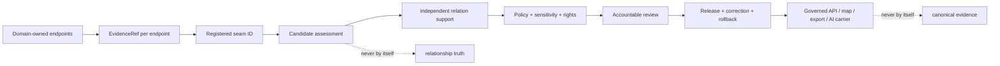
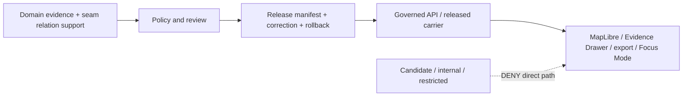

<!-- [KFM_META_BLOCK_V2]
doc_id: kfm://doc/ecology-cross-domain
title: Ecology as a Cross-Domain Concern — Current Architecture and Implementation Boundary
type: architecture
version: v2.0.1
status: draft; repository-grounded; cross-domain-umbrella; join-policy-inactive; non-publisher
owners:
  - "@bartytime4life"
created: 2026-05-25
updated: 2026-08-18
policy_label: public
owning_root: docs/
responsibility: Explain how ecology-shaped claims compose domain-owned evidence through bounded cross-domain seams without creating an Ecology domain, parallel truth authority, or public bypass.
base_commit: 75de13010bb615ad9b6b219d52e2e830c924c7ab
prior_blob: 3a6b8237dae3de364171452778353de79ca73625
lineage_v1_blob: d8eed34dac129fbe484a968b0649571b39ab6bc8
directory_governance: ADR-0029 adopts docs/doctrine/directory-rules.md as the sole writable Directory Rules authority; this existing same-path page is retained as an umbrella architecture surface and does not register a seam.
truth_posture: CONFIRMED current repository evidence; PROPOSED ecology composition architecture; UNKNOWN production enforcement unless explicitly identified below
related:
  - docs/doctrine/directory-rules.md
  - docs/adr/ADR-0029-adopt-directory-governance-standard-v2.md
  - docs/architecture/domain-placement-law.md
  - docs/architecture/cross-domain-invasives.md
  - docs/architecture/cross-lane-join-policy.md
  - docs/architecture/contract-schema-policy-split.md
  - docs/architecture/TRUST_MEMBRANE.md
  - control_plane/domain_lane_register.yaml
  - control_plane/cross_domain_seam_register.yaml
  - control_plane/policy_gate_register.yaml
  - contracts/cross_domain/README.md
  - contracts/biodiversity/README.md
  - contracts/joins/cross_lane_join_assessment.md
  - fixtures/ecology/README.md
  - tools/validators/biodiversity/README.md
  - tools/validators/atmosphere_biodiversity/README.md
  - docs/domains/fauna/
  - docs/domains/flora/
  - docs/domains/habitat/
tags: [kfm, architecture, ecology, biodiversity, cross-domain, seams, fauna, flora, habitat, geoprivacy, evidence, non-publisher]
notes:
  - "Ecology is not registered as a KFM domain lane at the pinned repository state."
  - "This page explains an umbrella concern; operational relationships must be decomposed into registered, bounded seam IDs."
  - "The current generic cross-lane join policy is inactive. Fixture helper outcomes do not authorize relationship truth, review, release, or publication."
  - "@bartytime4life is the only verified CODEOWNERS route. Ecology stewardship and independent review authority remain NEEDS VERIFICATION."
[/KFM_META_BLOCK_V2] -->

# Ecology as a Cross-Domain Concern

> **Operating rule.** Ecology is an umbrella for evidence-bounded composition across domain lanes. Fauna, Flora, Habitat, Soil, Hydrology, Atmosphere, Hazards, Agriculture, Geology, and other registered lanes retain authority over their own facts. Every consequential relationship must be expressed through a bounded seam, preserve source role and sensitivity, resolve evidence, and remain a candidate until policy, review, and release gates close.

| Field | Current bounded result |
|---|---|
| **Evidence snapshot** | `main@75de13010bb615ad9b6b219d52e2e830c924c7ab` |
| **Architecture page** | **CONFIRMED** at this path; explanatory umbrella only |
| **Directory authority** | **CONFIRMED / ACCEPTED:** [ADR-0029](../adr/ADR-0029-adopt-directory-governance-standard-v2.md) adopts [Directory Rules v2](../doctrine/directory-rules.md) |
| **Ecology domain lane** | **Not present** in the current proposed machine projection; the projection itself does not create or remove domains |
| **Cross-domain seam coverage** | **PROPOSED / partial:** five high-risk seams are registered for review and all remain `HOLD_UNRESOLVED`; no generic Ecology seam exists |
| **Candidate assessment** | **CONFIRMED / bounded:** a deterministic, fixture-only cross-lane candidate assessment exists; its `ALLOW` outcome means only “emit a reviewable candidate” |
| **Generic join policy** | **Inactive:** no accepted generic evaluator, bundle, selector, or outward join-policy decision emitter is established |
| **Ecology-named support surfaces** | **CONFIRMED paths, bounded authority:** fixture and compatibility/index READMEs exist; they do not establish an Ecology domain or complete runtime |
| **Public/release path** | **UNKNOWN / not proven complete** for generic ecology composition |
| **Review route** | `@bartytime4life` through `CODEOWNERS`; domain stewardship and independent policy/release review remain **NEEDS VERIFICATION** |

> [!IMPORTANT]
> **This page is not a seam registration, semantic contract, machine schema, policy bundle, validator, EvidenceBundle, review decision, release decision, or publication path.** It explains how those responsibility roots must compose.

> [!CAUTION]
> **There is no omnibus “Ecology join.”** A proposed relationship such as Fauna × Hydrology aquatic occurrence or Flora × Soil substrate context must receive a stable seam ID, participating-domain ownership, explicit relation meaning, source-role limits, sensitivity posture, evidence requirements, and finite outcomes. Absence from the current seam register is not permission.

> [!WARNING]
> **Sensitive or reconstructable ecological locations fail closed.** A join may be more sensitive than either endpoint alone. Public styling, aggregation, omission, or a passing validator cannot substitute for an approved transform, policy decision, review state, release state, correction path, and rollback target.

**Quick navigation:** [Status](#0-status--authority) · [Why not a domain](#1-why-ecology-is-not-a-domain) · [Composition map](#2-the-cross-domain-composition-map) · [Derivations](#3-derived-ecological-concepts-and-their-placement) · [Edges](#4-cross-lane-edges) · [Sensitivity](#5-sensitivity-geoprivacy-rights-and-carefair) · [Taxonomy](#6-taxonomic-authority-anchoring) · [Products](#7-ecological-products-and-where-they-live) · [Anti-patterns](#8-what-ecology-must-not-do) · [Review](#9-reviewer-checklist-for-ecology-touching-prs) · [Open items](#10-open-questions-and-needs-verification) · [Glossary](#11-glossary) · [History](#12-changelog)

---

## 0. Status & Authority

### 0.1 Authority order for this page

| Question | Governing evidence |
|---|---|
| Where does a cross-domain artifact belong? | Accepted [Directory Rules v2](../doctrine/directory-rules.md), accepted ADRs, then current repository evidence |
| Does Ecology exist as a registered domain? | Current domain-lane authority and its machine projection; this page cannot create a domain |
| What does a relationship mean? | A participating-domain or cross-domain semantic contract, never this architecture summary alone |
| Is a candidate admissible? | Accepted and active policy, rights, sensitivity, purpose, audience, and review controls |
| Is a relationship true? | Resolvable endpoint evidence plus independent relationship support; a join key or overlap is insufficient |
| May a product be public? | Governed release state, obligations, correction support, and rollback support |
| What is implemented now? | Pinned code, schemas, fixtures, tests, workflows, emitted artifacts, and runtime evidence |

The current path is retained because the user requested a same-path modernization and the file already has inbound references. Directory Rules v2 §12.5 routes **new shared seam explanations** to `docs/architecture/cross-domain/<seam_id>.md`. This umbrella page does not claim that pattern for itself, does not move, rename, or tombstone the existing path, and does not create a new seam ID. Any later path migration requires reference closure, alias handling, validation, and rollback.

### 0.2 Current repository evidence

| Surface | Confirmed state at the pinned snapshot | Safe interpretation |
|---|---|---|
| [`docs/doctrine/directory-rules.md`](../doctrine/directory-rules.md) | Exact v2 bytes adopted by accepted ADR-0029 | Sole writable human Directory Rules authority |
| [`docs/architecture/domain-placement-law.md`](./domain-placement-law.md) | Repository-grounded v2 guidance aligned to accepted Directory Rules | Current derived domain/cross-domain placement explanation; non-normative |
| [`docs/architecture/cross-domain-invasives.md`](./cross-domain-invasives.md) | Repository-grounded v2 domain-specific seam explanation; Fauna/Flora contracts remain draft, generic join policy inactive, public path unproven | Corroates the bounded-seam and non-collapse pattern without creating Ecology or Invasives authority |
| [`control_plane/domain_lane_register.yaml`](../../control_plane/domain_lane_register.yaml) | `PROPOSED`, machine-projection-only register with 13 domain entries; Ecology is absent | Corroborates the non-domain posture but cannot create or remove a domain |
| [`control_plane/cross_domain_seam_register.yaml`](../../control_plane/cross_domain_seam_register.yaml) | `PROPOSED`, partial, navigational/review-only register; five seams; all `HOLD_UNRESOLVED`; no public joins | Helps route risk and review; does not authorize a relationship |
| [`docs/architecture/cross-lane-join-policy.md`](./cross-lane-join-policy.md) | Repository-grounded architecture; fixture-first candidate assessment; policy inactive | Strongest current explanation of candidate, policy, evidence, and release separation |
| [`contracts/cross_domain/README.md`](../../contracts/cross_domain/README.md) | Cross-domain semantic-contract coordination README; concrete seam contracts not established by the README | Meaning belongs in bounded seam contracts, not under an Ecology domain |
| [`fixtures/ecology/README.md`](../../fixtures/ecology/README.md) | Synthetic, public-safe cross-domain fixture boundary | The name `ecology` is a scenario label, not a domain or truth authority |
| [`contracts/biodiversity/README.md`](../../contracts/biodiversity/README.md) | Compatibility/coordination README; no sovereign biodiversity authority | Composite meanings may be documented while atomic ownership remains domain-local |
| [`tools/validators/biodiversity/README.md`](../../tools/validators/biodiversity/README.md) | At its pinned evidence snapshot, only a parent/routing README was established; no parent executable was confirmed | Do not claim biodiversity composition enforcement from the folder name |
| [`tools/validators/atmosphere_biodiversity/README.md`](../../tools/validators/atmosphere_biodiversity/README.md) | At its pinned evidence snapshot, the seam was README-only and fail-closed | No executable atmosphere-to-biodiversity enforcement is proven here |
| [`contracts/joins/cross_lane_join_assessment.md`](../../contracts/joins/cross_lane_join_assessment.md) and companions | Closed, synthetic assessment profile with deterministic helper, fixtures, tests, and workflow | Proves a bounded candidate-assessment slice, not generic ecology truth or policy |

### 0.3 Truth labels used here

- **CONFIRMED** — verified from the pinned repository state or accepted decision.
- **PROPOSED** — architecture, relationship, product, or next step not established as current implementation or policy.
- **UNKNOWN** — insufficient evidence to state the result.
- **NEEDS VERIFICATION** — a concrete repository, runtime, source, rights, policy, or steward check remains.

### 0.4 Non-effects

This page does not:

- register Ecology as a domain or lifecycle lane;
- authorize a cross-domain seam, join, graph edge, or inference;
- choose a canonical taxonomic authority;
- activate a source or live network path;
- fix a sensitivity tier, redaction threshold, or geoprivacy parameter;
- create or amend semantic contracts, schemas, policy, fixtures, validators, tests, workflows, receipts, proofs, catalogs, or release objects;
- authorize public API routes, map layers, exports, AI answers, release, deployment, promotion, or publication.

[Back to top](#top)

---

## 1. Why Ecology Is Not a Domain

### 1.1 Current determination

Ecology is not registered as a KFM domain at the pinned repository state. More importantly, the architecture has no evidence-backed need for a single Ecology bounded context that owns all ecological facts.

| Test | Result | Reason |
|---|---|---|
| Exclusive atomic responsibility | **No** | Taxa, occurrences, habitat, soils, reaches, atmospheric observations, hazard events, and agricultural observations already have owning lanes. |
| Independent source-intake authority | **No generic Ecology intake proven** | Source admission must route records to the source and domain that own their meaning. |
| One coherent policy boundary | **No** | Rare taxa, habitat models, cultural context, water observations, and agricultural aggregates have different rights and sensitivity obligations. |
| One coherent correction owner | **No** | A correction to a Fauna occurrence, Habitat model, or Hydrology reach remains owned by that lane and must propagate to dependents. |
| Cross-domain relationships | **Yes** | This is evidence that ecology is a composition concern, not evidence for a new domain. |

The current `domain_lane_register.yaml` is only a proposed machine projection, so its omission is not the sole legal basis. The durable basis is responsibility: no generic Ecology authority may absorb or rewrite facts already owned by registered bounded contexts.

### 1.2 Four failure modes of Ecology-as-domain

1. **Parallel authority.** Ecology-local copies of Taxon, Occurrence, HabitatPatch, SoilProperty, EvidenceBundle, or ReleaseManifest would compete with their owning families.
2. **Source-role laundering.** A modeled suitability surface, contextual overlap, or graph projection could be relabeled as observed ecological truth.
3. **Sensitivity flattening.** One Ecology policy could average away the stricter rights, sovereignty, geoprivacy, or purpose limits of a participating record.
4. **Omnibus seam ambiguity.** A generic `ecology` join would hide which domains participate, what relation is asserted, who owns correction, and what evidence independently supports the relationship.

### 1.3 What Ecology is architecturally

Ecology is:

- a **reader-facing umbrella** for common multi-domain questions;
- a **context map** showing which bounded contexts own which facts and how candidate relations may be assessed;
- a **review discipline** requiring registered seam identity, endpoint authority, relation semantics, evidence, policy, release, correction, and rollback;
- a **family of possible derived products**, each of which still needs a specific owner or seam contract.

Ecology is not automatically a Domain-Driven Design **Shared Kernel**. A Shared Kernel is a deliberately shared model subset with explicit governance and integration discipline. No generic Ecology shared model is established by this page. The safer DDD analogy is a **Context Map**: independent bounded contexts interact through named relationships and published contracts without merging their models.

### 1.4 Ecology, biodiversity, and compatibility names

`ecology` and `biodiversity` appear in current support paths. Their presence does not create domain authority:

- `fixtures/ecology/` is a synthetic scenario boundary;
- `contracts/biodiversity/` is documented as compatibility/cross-domain coordination;
- `tools/validators/biodiversity/` is a routing README whose parent executable was not established at its pinned evidence snapshot.

A later accepted ADR and dependency-closed migration could change those classifications. Until then, the names remain support or compatibility vocabulary, not sovereign domain identity.

[Back to top](#top)

---

## 2. The Cross-Domain Composition Map

### 2.1 Atomic ownership

The table is a reviewer-oriented ownership map, not a complete contract or schema inventory.

| Atomic fact or knowledge family | Owning lane | Cross-domain use |
|---|---|---|
| Animal taxon, occurrence, range, sensitive site, mortality, disease | Fauna | Referenced by habitat, hydrology, hazards, agriculture, or biodiversity-shaped products without transferring Fauna authority |
| Plant taxon, specimen/occurrence, rare-plant record, vegetation community, phenology | Flora | Referenced as botanical, vegetation, substrate-response, or cultural context while Flora retains identity and sensitivity authority |
| Habitat patch/system, land-cover observation, quality, suitability, connectivity, restoration candidate | Habitat | Provides spatial/model context; modeled suitability does not become occurrence truth |
| Soil map unit, component, horizon, property | Soil | Provides substrate or suitability context; soil properties do not prove crop response or species occurrence |
| HUC/reach/gauge/water observation | Hydrology | Provides aquatic, riparian, watershed, or water-condition context; public HUC identity does not reveal a sensitive occurrence |
| Atmospheric observation, forecast, model, climate normal, air observation | Atmosphere | Provides condition context while observation, forecast, model, and advisory roles remain distinct |
| Hazard event, observation, advisory context, drought/smoke/flood exposure | Hazards | Owns hazard identity and official-advisory context; proximity does not prove ecological impact |
| Crop, pest-stress, land-use, yield, or agricultural observation | Agriculture | Owns agricultural impact/context; taxonomic identity remains with Fauna or Flora |
| Geologic/surficial unit and lithologic context | Geology | Provides substrate context; interpreted geology does not become biological observation |
| Archaeological/cultural context | Archaeology | May constrain ethnobotanical or cultural interpretation; cultural sensitivity and provenience remain archaeology-owned and fail closed |
| Roads, rail, settlements, infrastructure, land, or administrative context | Their registered lanes | May support barrier, exposure, or planning context without transferring identity or exposing protected assets or people |

### 2.2 Composition stages

```mermaid
flowchart LR
    A["Domain-owned endpoints"] --> B["EvidenceRef per endpoint"]
    B --> C["Registered seam ID"]
    C --> D["Candidate assessment"]
    D --> E["Independent relation support"]
    E --> F["Policy + sensitivity + rights"]
    F --> G["Accountable review"]
    G --> H["Release + correction + rollback"]
    H --> I["Governed API / map / export / AI carrier"]

    D -. "never by itself" .-> X["relationship truth"]
    I -. "never by itself" .-> Y["canonical evidence"]
```

Every stage answers a different question. Endpoint validity, relationship validity, policy admissibility, review approval, release approval, and public delivery must not collapse into one status.

### 2.3 Keystone composition invariants

1. **Atomic ownership remains separate.** A relation points to domain-owned records; it does not rewrite them.
2. **Source role and knowledge character remain explicit.** Observed, regulatory, modeled, aggregate, administrative, candidate, and synthetic inputs are not interchangeable.
3. **Endpoint evidence and relation evidence remain separable.** Two valid endpoints do not prove a relationship.
4. **Space, time, scale, precision, uncertainty, and cardinality remain part of the claim.** Overlap or proximity cannot erase support limits.
5. **Sensitivity is monotonic and composition-aware.** The output inherits at least the strictest input posture and may become more restrictive because of the combination.
6. **Rights, consent, and purpose do not transfer by adjacency.** Permission for one input or use does not authorize the derivative.
7. **Candidate status remains visible.** Matching, overlap, helper `ALLOW`, workflow success, or schema validity cannot become authoritative relation truth.
8. **Corrections cascade.** A correction, withdrawal, supersession, or newly restricted input invalidates dependent candidates and released derivatives.
9. **Public clients remain behind the trust membrane.** Candidate records, exact sensitive locations, unreleased joins, and internal policy reasons are not normal public paths.

### 2.4 Current seam register: ecology-relevant examples

The current machine register is partial and non-authoritative. These entries are examples of the bounded-seam model, not permissions.

| Seam ID | Current status | Ecology relevance | Prohibited collapse |
|---|---|---|---|
| `fauna--hydrology--aquatic-occurrence-context` | `HOLD_UNRESOLVED`; public join false | Reach/HUC and water context may frame aquatic occurrence evidence | Aquatic occurrence is not an established population; a public HUC is not a precise occurrence |
| `agriculture--soil--suitability-context` | `HOLD_UNRESOLVED`; public join false | Soil context may inform an agricultural suitability candidate | Soil property is not observed yield; private farm/operator/parcel/yield joins remain prohibited |
| `atmosphere--hazards--condition-advisory-context` | `HOLD_UNRESOLVED`; public join false | Atmospheric conditions may contextualize ecological hazard/exposure work through separate seams | Advisory is not measurement; modeled forecast is not observed condition |

No entry grants mutation or publication authority. Other ecological relationships remain **unregistered or NEEDS VERIFICATION** until a bounded seam packet is reviewed.

[Back to top](#top)

---

## 3. Derived Ecological Concepts and Their Placement

### 3.1 A derivation is a new claim, not a convenient copy

A derived ecological product may combine domain-owned facts, contextual joins, models, aggregation, or graph projection. It therefore needs its own identity, semantics, evidence, uncertainty, sensitivity analysis, correction dependencies, and release posture. It does not automatically “enter at PROCESSED,” and it does not become authoritative because it is stored under `data/`, rendered on a map, indexed in a graph, or described here.

### 3.2 Placement by responsibility and seam identity

| Artifact responsibility | Placement rule | Current boundary |
|---|---|---|
| Single-domain derived meaning | Keep the semantic owner in the owning domain contract/lane | Cross-domain inputs may be cited, but they do not change ownership automatically |
| Cross-domain relation or composite meaning | `contracts/cross_domain/<seam_id>/` | Requires a registered seam ID; the current coordination README does not establish concrete seam contracts |
| Machine shape | Use the current canonical schema authority and bind the shape to the specific object/seam identity | This page does not create a new Ecology schema home |
| Join admissibility | Use an accepted, active policy family or pair profile | Generic join policy is currently inactive; missing evaluator/bundle binding holds the operation |
| Shared validator | `tools/validators/cross_domain/<seam_id>/` | A README or helper alone is not enforcement |
| Cross-domain test | `tests/cross_domain/<seam_id>/` | Synthetic, no-network positive and fail-closed cases are required before relying on behavior |
| Shared seam explanation | `docs/architecture/cross-domain/<seam_id>.md` | New seam pages follow Directory Rules v2 §12.5 |
| Graph/triplet projection | The governed `data/triplets/` family with stable relation identity and provenance | A graph projection is downstream and non-sovereign |
| Released carrier | The applicable `data/published/` and `release/` families | Requires policy, review, proof, release, correction, and rollback closure |
| Umbrella fixture example | `fixtures/ecology/` only when cross-domain behavior is essential | Remains synthetic and non-authoritative; domain-owned fixtures belong in domain lanes |

> [!IMPORTANT]
> **Do not choose an arbitrary “lead domain” merely to obtain a path.** Choose an owning domain only when that domain genuinely owns the derived meaning. Otherwise, register a seam and use the responsibility root that owns the artifact.

### 3.3 Common derivation classes

| Candidate product | Owning posture | Required distinction | Current status |
|---|---|---|---|
| Animal-only or plant-only richness/density | Fauna or Flora when the measure uses only that lane's public-safe occurrence family | Aggregation is not exact occurrence; sampling effort and temporal support remain visible | Product-specific implementation **NEEDS VERIFICATION** |
| Combined biodiversity/richness measure | Cross-domain derived product with a bounded seam and explicit method | A combined score must not hide missing kingdoms, sampling bias, sensitive contributors, or incompatible time/space support | No generic released product proven |
| Habitat suitability surface | Habitat-owned model output citing target-taxon and environmental inputs | Suitability is modeled support, not observed presence, population, or conservation instruction | Product-specific implementation **NEEDS VERIFICATION** |
| Food-web, pollinator, herbivory, or invasive relation | Cross-domain relation family | Co-occurrence or literature similarity is not a confirmed relation without independent support | Seam/contract/policy **NEEDS VERIFICATION** |
| Phenology composite | Specific Flora/Fauna/Atmosphere seam or domain-owned product, depending on the claim | Correlation with weather/climate is not causation; observation and modeled fields remain distinct | No canonical composite home chosen here |
| Invasive monitoring presentation | Fauna and Flora keep subtype authority; cross-domain presentation follows the invasives architecture | A unified display must not create a unified canonical `InvasiveRecord` or management instruction | Implementation **NEEDS VERIFICATION** |
| Ecosystem-service or ecological-condition indicator | Explicit model/indicator owner plus bounded contributing seams | Indicator, scenario, or model output is interpretive and uncertainty-bearing, not direct observation | No generic release proven |
| Aquatic occurrence context | Fauna-owned occurrence plus Hydrology-owned reach/HUC/water context | Current registered seam remains on hold; public HUC cannot stand in for sensitive location | `HOLD_UNRESOLVED` |

### 3.4 Minimum claim packet for a cross-domain derivation

A reviewable packet should make the following separately inspectable. Exact field names remain contract/schema decisions.

- stable candidate/product ID and seam ID;
- endpoint IDs, owning domains, object versions, and correction state;
- source role or knowledge character for each input;
- observation/valid/publication/retrieval times where material;
- spatial support, scale, precision, geometry version, and uncertainty;
- `EvidenceRef` for each endpoint and independent support for the asserted relationship;
- derivation or model identity, method/specification hash, input digest set, output digest, and reproducibility posture;
- rights, sovereignty, sensitivity, audience, purpose, transform, and review obligations;
- finite outcome and reason code for schema, evidence, policy, review, release, and runtime stages;
- release, correction, withdrawal, cache invalidation, and rollback references before public use.

Missing relationship support yields `ABSTAIN` or a review hold. Missing or unsafe rights/sensitivity yields `DENY` or quarantine. Tool failure yields `ERROR`. No stage falls back to an unsafe allow.

[Back to top](#top)

---

## 4. Cross-Lane Edges

### 4.1 Current implementation boundary

The repository currently proves a deterministic, fixture-only **candidate assessment**, not a generic ecology relation system. The current helper can compare bounded synthetic inputs and emit finite assessment outcomes. It does not:

- establish relationship truth;
- run an accepted generic join-policy bundle;
- resolve EvidenceRefs to EvidenceBundles for all ecological claims;
- assign accountable domain review;
- write lifecycle state;
- create graph edges of record;
- release or publish a derivative.

In the current profile, helper `ALLOW` means only **emit a reviewable `CANDIDATE_RELATION` report**. It must not be translated to `OPEN`, `ANSWER`, policy permission, review approval, release, or publication.

### 4.2 Edge classes and guardrails

| Edge class | Example | What it may support | What it cannot prove by itself |
|---|---|---|---|
| Contextual join | Fauna occurrence × Habitat patch; Flora occurrence × Soil/Hydrology context | “This record is within the declared context and support window” | Habitat use, establishment, causality, suitability, abundance, or trend |
| Identity/crosswalk relation | Source-native taxon ID × accepted domain taxon identity | Candidate equivalence, synonym, or mapping under a pinned source/version | Timeless equivalence, conservation status, or occurrence truth |
| Model-input relation | Habitat model × land cover × taxon target × climate/soil/hydrology inputs | Reconstructable model lineage and bounded suitability output | Observed presence, future certainty, or management instruction |
| Interaction relation | Pollinator, predator-prey, herbivory, invasive, disease-vector | A relation supported by its own evidence and scope | A relation inferred only from co-occurrence or taxonomy |
| Exposure relation | Hazard/condition × habitat/taxon/settlement context | Bounded exposure context under aligned time and space | Impact, mortality, damage, or causation without independent observation |
| Presentation composition | Several released layers in one map, report, or story | Coordinated public-safe viewing with separate evidence/release identity | A new canonical composite merely because layers are displayed together |

### 4.3 Common ecology-facing seam candidates

| Participating lanes | Ownership that must remain visible | Required caution |
|---|---|---|
| Fauna × Habitat | Fauna owns taxon/occurrence; Habitat owns patch/system/model context | Restricted occurrence must not be reconstructed through habitat geometry or suitability output |
| Flora × Habitat | Flora owns taxon/specimen/occurrence; Habitat owns ecological-system/model context | Rare-plant precision and habitat-derived inference may increase output sensitivity |
| Fauna × Hydrology | Fauna owns occurrence and sensitivity; Hydrology owns HUC/reach/water context | Current registered seam remains on hold; no public location inference |
| Flora × Soil/Hydrology | Flora owns botanical observation; Soil/Hydrology own substrate and water context | Context is not proof of plant presence or causal response |
| Fauna × Flora | Each lane owns taxonomic and occurrence facts | Pollinator/food-web/invasive relations need independent relation evidence |
| Atmosphere × Fauna/Flora/Habitat | Atmosphere owns observation/forecast/model; biological lanes own response/occurrence/model output | Weather correlation does not prove ecological effect or causation |
| Hazards × Fauna/Flora/Habitat | Hazards owns event/advisory/exposure context; biological lanes own observed response | Advisory or footprint does not prove impact; false-clear behavior must fail closed |
| Agriculture × Soil/Habitat/Fauna/Flora | Agriculture owns crop/yield/pest-stress context; other lanes own substrate/habitat/taxonomy | No private parcel/operator join; no ecological or management instruction from context alone |
| Flora × Archaeology/cultural context | Flora owns botanical identity; Archaeology/cultural authority owns provenience and sensitivity | Sovereignty and cultural review are required; absence of permission fails closed |

Unregistered rows are architecture candidates only. They require bounded seam identity and the appropriate contract, schema, policy, fixtures, tests, review, and release evidence before consequential use.

### 4.4 Source-role preservation

The current `CrossLaneJoinAssessment` profile uses seven source-role values: `OBSERVED`, `REGULATORY`, `MODELED`, `AGGREGATE`, `ADMINISTRATIVE`, `CANDIDATE`, and `SYNTHETIC`. That vocabulary is **confirmed only for the current fixture profile**, not adopted here as a universal ecology taxonomy.

Ecology-facing products must still preserve the underlying distinction:

- a regulatory designation is not an observation;
- a forecast or model is not an observed condition;
- an aggregate is not a point, person, parcel, or single event;
- a candidate is not released truth;
- synthetic fixtures and reconstructed surfaces are not evidence of real-world conditions.

[Back to top](#top)

---

## 5. Sensitivity, Geoprivacy, Rights, and CARE/FAIR

### 5.1 Current policy boundary

No generic, accepted Ecology sensitivity policy is established by this page. The current domain-lane machine projection carries proposed sensitivity baselines and explicitly states that sensitivity authority remains pending. The cross-domain seam projection applies the **most restrictive** input policy/sensitivity as a default and permits no public join, but it is also proposed and non-authoritative.

The durable architecture rule is fail-closed:

> A composition inherits at least the strictest applicable endpoint posture and may become more restrictive when the combination exposes a protected location, identity, behavior, cultural relationship, infrastructure detail, private-land relationship, or other harmful inference.

### 5.2 Exposure decision sequence

Before any public or semi-public ecology-shaped product:

1. verify source identity, authority role, rights, terms, attribution, and permitted purpose;
2. resolve endpoint evidence and current correction/withdrawal state;
3. assess endpoint sensitivity and join-induced inference risk;
4. preserve source-applied obscuration, withholding, aggregation, or access controls;
5. select a deterministic, reviewable transform when policy permits one;
6. record transform identity, reason, input/output digests, and non-reversibility or residual risk;
7. obtain the required policy and accountable review decisions;
8. close release, correction, withdrawal, cache invalidation, and rollback support;
9. expose only the released public-safe carrier through governed interfaces.

### 5.3 Geoprivacy rules

- Exact or reconstructable locations for sensitive taxa, nests, dens, roosts, hibernacula, spawning/aggregation sites, rare plants, telemetry, stewardship zones, protected habitat, or private-land-linked records fail closed.
- KFM must not reverse, narrow, or infer through source-provided obscuration.
- Styling or client-side filtering is not redaction. Sensitive transformation occurs before public delivery.
- Aggregation does not automatically remove risk. Sparse counts, repeated time slices, neighboring grids, model outputs, or joins can permit reconstruction.
- Public documentation should describe the control and review obligation without publishing thresholds, fuzzing parameters, source identifiers, or other control-defeating detail.
- The same governed input and transform specification should produce reproducible output where deterministic transformation is practical.

### 5.4 Rights, sovereignty, and cultural context

Ethnobotanical, traditional ecological knowledge, sacred/cultural adjacency, tribal or community-governed material, and other culturally sensitive relationships require qualified authority and purpose-specific review. External CARE and FAIR frameworks may inform review, but citing them does not create KFM permission, consent, source rights, or release authority.

When authority, consent, sovereignty, cultural sensitivity, or permitted use is unresolved, the correct result is quarantine, hold, `DENY`, or `ABSTAIN`—not inferred openness.

### 5.5 Finite outward outcomes

| Outcome | Ecology composition meaning |
|---|---|
| `ANSWER` | The requested released claim is evidence-resolved, policy-safe, citation-valid, in scope, and supported for the requested space/time/precision |
| `ABSTAIN` | Evidence, relation support, scale, time, freshness, or scope is insufficient or conflicted |
| `DENY` | Rights, consent, sensitivity, sovereignty, source terms, audience, purpose, or release state prohibits exposure |
| `ERROR` | Resolver, policy, validator, adapter, release lookup, or runtime failed; never fall back to allow |

Candidate-assessment outcomes and public runtime outcomes remain different vocabularies. Do not map helper `ALLOW` directly to public `ANSWER`.

[Back to top](#top)

---

## 6. Taxonomic Authority Anchoring

### 6.1 Authority belongs to domain contracts and source registries

This architecture page does not declare one external taxonomy mandatory, choose an accepted name, or settle conflicts among taxonomic sources. Those choices require current source verification, source descriptors, rights review, domain semantic contracts, versioned crosswalks, and accepted policy where disagreement affects public claims.

For every taxonomy-dependent record or derivative, preserve:

- source-native identifier, submitted name, source version/release, and retrieval time;
- owning-domain identity and the contract/schema version used to normalize it;
- mapping type, confidence/quality class, evidence references, reviewer state, and effective time;
- accepted-name/synonym/higher-classification disagreement rather than silently flattening it;
- conservation, regulatory, invasive, or sensitivity status as separate assertions with separate authority and time;
- correction and supersession lineage when an upstream classification changes.

### 6.2 Crosswalk outcomes

| Situation | Required posture |
|---|---|
| One source-native ID maps unambiguously under an accepted versioned profile | Emit a candidate or validated crosswalk according to that profile; preserve both identities |
| Two authorities disagree | Preserve both assertions and the disagreement; narrow or abstain when the requested use requires one unresolved choice |
| Source version changes | Re-run the governed crosswalk, compare changes, preserve prior identity, and propagate correction/supersession to dependents |
| Taxon is unresolved or absent from a target authority | Preserve the native record and mark the crosswalk unresolved; do not invent a match |
| Mapping would expose sensitive or restricted source detail | Apply the applicable policy or deny the mapping/output; taxonomic normalization does not override geoprivacy |

### 6.3 Current verification boundary

This task did not verify current endpoint status, terms, versions, coverage, or identifier behavior for ITIS, GBIF, NatureServe, USFWS, KDWP, or any other external taxonomy/conservation source. The v1.0 mandatory-source and tie-breaker rules are therefore removed from current architecture claims. They remain lineage proposals until a source-ledger and domain-policy decision re-establish them with current evidence.

[Back to top](#top)

---

## 7. Ecological Products and Where They Live

### 7.1 Product authority classes

| Product class | What it is | Authority boundary |
|---|---|---|
| Domain-derived record/layer | A product whose meaning remains owned by one domain | May cite cross-domain context; must not transfer endpoint ownership |
| Cross-domain candidate/derivative | A relation, indicator, model output, or composite requiring a seam | Remains candidate until meaning, evidence, policy, review, and release close |
| Graph/search/index projection | A rebuildable projection for discovery or relationship traversal | Never sovereign truth; each consequential edge resolves to evidence and release state |
| Map/tile/PMTiles/COG carrier | A released public-safe spatial carrier | Renderer and pixels do not create evidence, policy, or publication authority |
| Governed API payload | A finite-outcome response over released, policy-safe inputs | Must not expose candidate/internal/sensitive reasons or canonical stores directly |
| Evidence Drawer/export/story | An inspection or communication surface | Preserves evidence, release ID, scope, transforms, uncertainty, and correction state |
| Focus Mode/AI explanation | Interpretive language over resolved released evidence | Must cite or abstain; model output is not evidence or approval |

### 7.2 Current implementation boundary

| Surface | Current evidence | Safe statement |
|---|---|---|
| `fixtures/ecology/` | Directory README exists and defines a synthetic cross-domain boundary | Useful for public-safe examples; no complete consumer inventory is established by the README |
| `contracts/biodiversity/` | Compatibility/coordination README exists | Does not establish canonical biodiversity object families or schemas |
| `tools/validators/biodiversity/` | Routing README documents no confirmed parent executable at its pinned snapshot | Do not claim parent biodiversity validation is implemented |
| `tools/validators/atmosphere_biodiversity/` | README-only seam at its pinned snapshot | Do not claim executable Atmosphere × biodiversity enforcement |
| Cross-lane candidate assessment | Contract, schema, helper, 19-case synthetic fixture matrix, focused tests, and read-only workflow are documented in current architecture | Bounded candidate assessment is implemented; generic ecology policy/release is not |
| Generic Ecology API endpoints or public layers | Not proven by the inspected evidence | `UNKNOWN`; no route or product is claimed here |

The v1.0 proposed `/v1/ecology/...` routes and canonical product paths are removed as current claims. New routes, layer homes, or release families require repository evidence, placement review, contracts/schemas/policy, negative tests, and governed release closure.

### 7.3 Public delivery flow

```mermaid
flowchart LR
    E["Domain evidence + seam relation support"] --> P["Policy and review"]
    P --> R["Release manifest + correction + rollback"]
    R --> A["Governed API / released carrier"]
    A --> M["MapLibre / Evidence Drawer / export / Focus Mode"]

    C["Candidate / internal / restricted"] -. "DENY direct path" .-> M
```

Public clients consume governed APIs and released public-safe carriers. They do not read RAW, WORK, QUARANTINE, candidate, canonical, internal-registry, policy-input, or direct model-runtime stores as their normal path.

### 7.4 Product acceptance questions

Before calling an ecology-shaped product releasable, answer:

- What exact claim does the product carry?
- Which domain owns each endpoint and which seam owns the relation meaning?
- What source role, knowledge character, space/time support, uncertainty, and correction state does each input carry?
- What independently supports the relationship or derivation?
- What rights, sensitivity, purpose, audience, transform, and review obligations apply to the output?
- What proof, manifest, correction, withdrawal, cache invalidation, and rollback records bind the released carrier?
- Can every consequential UI or AI statement resolve through `EvidenceRef` to admissible `EvidenceBundle` support?

[Back to top](#top)

---

## 8. What Ecology MUST NOT Do

| Anti-pattern | Why it fails | Required correction |
|---|---|---|
| Create `docs/domains/ecology/`, `data/processed/ecology/`, `policy/domains/ecology/`, or equivalent domain lanes | Creates unaccepted domain and parallel authority | Keep atomic facts in registered domains; use bounded seam artifacts in owning responsibility roots |
| Use one generic “Ecology” seam for unrelated relations | Hides participants, meaning, evidence, sensitivity, correction, and review ownership | Register specific seam IDs and contracts |
| Pick a convenient lead domain for a genuinely shared relation | Transfers authority without semantic basis | Use `cross_domain/<seam_id>` placement under the owning responsibility root |
| Treat `data/triplets/ecology/` or any graph/index path as sovereign truth | Projection can drift and may lack relation evidence or release state | Bind every consequential edge to canonical endpoints, evidence, provenance, policy, and release |
| Treat a README, placeholder, compatibility folder, or workflow badge as implementation | Documentation and orchestration do not prove runtime behavior | Verify executable, tests, emitted artifacts, and consumers at a pinned revision |
| Treat helper `ALLOW`, schema validity, matching key, overlap, or CI success as relationship truth | These prove only bounded computation or shape | Keep `CANDIDATE_RELATION` visible; require relation evidence, policy, review, and release |
| Reuse endpoint evidence as relationship evidence | Two real records may have no supported relationship | Require independent relationship support or abstain |
| Convert model, forecast, aggregate, synthetic fixture, or reconstruction into observation | Launders knowledge character | Preserve role and uncertainty; label derivative honestly |
| Infer causality from proximity, correlation, co-occurrence, or temporal order | Exceeds evidence support | Narrow to contextual relation or require causal evidence |
| Average or downgrade sensitivity across contributors | Combination may expose protected information | Apply the strictest applicable posture and assess join-induced sensitivity |
| Reverse source obscuration or expose generalization parameters | Defeats geoprivacy | Preserve source controls; keep public control-defeating detail out of docs and outputs |
| Hard-code a universal taxonomic authority or silent tie-breaker in architecture prose | External coverage and policy can change; disagreement becomes hidden | Use versioned source descriptors, domain contracts, crosswalk evidence, and explicit conflict outcomes |
| Add a public Ecology route that reads internal or candidate stores | Bypasses the trust membrane | Compose only released public-safe products behind governed APIs |
| Use AI text, map pixels, tiles, graph edges, or dashboards as evidence | Delivery surfaces are interpretive | Resolve EvidenceRef to EvidenceBundle or abstain |
| Release without correction and dependency invalidation | Corrected endpoints leave stale derivatives public | Record dependency lineage and propagate correction, withdrawal, cache invalidation, and rollback |

[Back to top](#top)

---

## 9. Reviewer Checklist for Ecology-Touching PRs

A change is ecology-touching when it composes records, claims, models, policy, fixtures, tests, maps, APIs, exports, or AI output across two or more domain lanes for an ecology/biodiversity-shaped use.

- [ ] **Base and overlap are current.** The PR identifies its base commit and reconciles open PRs/branches touching the same path or seam.
- [ ] **Directory authority is current.** Placement is checked against accepted ADR-0029 and `docs/doctrine/directory-rules.md`, not the legacy architecture copy.
- [ ] **Ecology is not made a domain.** No new Ecology domain, source, lifecycle, contract, schema, policy, release, or public authority is implied by naming.
- [ ] **A specific seam is named.** Participants, seam ID, relation class, status, contract path, and authority allocation are explicit.
- [ ] **Atomic ownership is preserved.** Each endpoint remains in its registered domain and keeps independent correction authority.
- [ ] **Meaning, shape, policy, tooling, evidence, review, and release remain separate.** No artifact substitutes for another responsibility root.
- [ ] **Source role and knowledge character are preserved.** Modeled, aggregate, regulatory, administrative, candidate, and synthetic inputs are not relabeled as observations.
- [ ] **Space/time/scale/precision/uncertainty are compatible.** Unsupported intersections, stale inputs, no-data, and scope mismatch fail closed.
- [ ] **Evidence resolves separately.** Every endpoint has evidence, and the asserted relationship has independent support.
- [ ] **Candidate status is visible.** Helper `ALLOW` or a passing validator does not become relation truth, `ANSWER`, policy approval, or release.
- [ ] **Sensitivity and rights are composition-aware.** Strictest input posture and join-induced inference risk are evaluated; source obscuration is preserved.
- [ ] **Policy is actually active for the requested use.** A README or proposed pair profile is not treated as an accepted evaluator/bundle binding.
- [ ] **Review authority is accountable.** CODEOWNERS routing is not represented as a completed ReviewRecord or independent approval.
- [ ] **Release is complete before public use.** Manifest, proof, obligations, correction, withdrawal, cache invalidation, and rollback references exist.
- [ ] **Public clients remain governed.** No direct RAW/WORK/QUARANTINE/candidate/internal/model path is introduced.
- [ ] **Fixtures are synthetic and no-network by default.** No real sensitive coordinate, private payload, restricted identifier, or control-defeating detail enters tests or docs.
- [ ] **External source facts are current and pinned where required.** Versions, terms, identifiers, and coverage are not copied from stale planning prose.
- [ ] **Documentation stays bounded.** Current behavior is supported by pinned evidence; proposals remain labeled; no parallel authority is created.
- [ ] **Validation and rollback are stated.** Changed-area checks, residual failures, and the prior blob/commit rollback target are recorded.

[Back to top](#top)

---

## 10. Open Questions and NEEDS VERIFICATION

| ID | Open item | Current status | Evidence needed to close |
|---|---|---|---|
| `OPEN-ECO-01` | Should this legacy umbrella page remain at `docs/architecture/ecology-cross-domain.md`, become an index under `docs/architecture/cross-domain/`, or be replaced by seam-specific pages? | **HOLD / no move in this change** | Inbound-reference inventory, semantic split, alias/migration plan, path validation, rollback |
| `OPEN-ECO-02` | Which ecology-facing seams should enter the partial seam register first? | **NEEDS VERIFICATION** | Domain-owner decision, relation semantics, risk ranking, evidence/policy fixtures, ADR-S-14 disposition |
| `OPEN-ECO-03` | When may the generic join-policy family become active? | **HOLD** | Accepted policy authority, evaluator/bundle binding, outward decision shape, negative tests, review/release integration |
| `OPEN-ECO-04` | What is the canonical future of `contracts/biodiversity/`, `tools/validators/biodiversity/`, `fixtures/ecology/`, and other compatibility/support names? | **NEEDS VERIFICATION** | Recursive inventory, consumers, authority classification, migration/alias decision, rollback |
| `OPEN-ECO-05` | What versioned taxonomic identity and crosswalk policy governs Fauna and Flora? | **NEEDS VERIFICATION** | Current official-source research, SourceDescriptors, domain contracts, crosswalk schema, conflict policy, correction tests |
| `OPEN-ECO-06` | Which sensitivity vocabulary and per-domain defaults are accepted? | **NEEDS VERIFICATION** | Accepted policy/ADR, qualified domain and sovereignty review, deterministic transform tests |
| `OPEN-ECO-07` | Which ecology-shaped products and public claims are actually implemented or released? | **UNKNOWN** | Current code/config/tests, emitted EvidenceBundles, manifests, published carriers, deployed runtime evidence |
| `OPEN-ECO-08` | How are corrections to an endpoint propagated to joins, graph projections, tiles, search, exports, stories, and AI caches? | **NEEDS VERIFICATION** | Dependency registry, invalidation tests, correction/withdrawal rehearsal, rollback proof |
| `OPEN-ECO-09` | Who holds accountable ecology-seam, sensitivity, policy, and independent release-review roles? | **NEEDS VERIFICATION** | Verified StewardshipAssignments/ReviewRecords; CODEOWNERS alone is insufficient |
| `OPEN-ECO-10` | Which exact-head CI checks are required for cross-domain ecology changes? | **NEEDS VERIFICATION** | Workflow inventory, hosted run evidence, ruleset/required-check mapping, failure classification |

### 10.1 Smallest safe next implementation slice

A future implementation should choose **one** bounded seam and one public-safe synthetic fixture family. It should reuse the current cross-lane candidate-assessment envelope, add no network/model calls, preserve endpoint and relation evidence separately, exercise `ALLOW`-as-candidate plus `ABSTAIN`, `DENY`, and `ERROR`, and stop before source activation, policy acceptance, lifecycle promotion, release, or publication. Placement and ownership must be rechecked at that future base commit.

[Back to top](#top)

---

## 11. Glossary

| Term | Meaning in this page |
|---|---|
| **Atomic fact** | A record or assertion whose meaning and correction authority belong to one domain lane |
| **Ecology umbrella** | Reader-facing architecture vocabulary for multi-domain ecological composition; not a domain or seam |
| **Endpoint** | One domain-owned object participating in a candidate relationship |
| **Seam** | A registered, bounded relationship context with stable ID, participants, authority allocation, constraints, and review posture |
| **Relation evidence** | Independent support for the asserted relationship; endpoint evidence alone is insufficient |
| **Candidate relation** | A reviewable result of bounded computation; not graph truth, policy approval, review approval, or release |
| **Knowledge character** | Whether information is observed, modeled, regulatory, aggregate, administrative, candidate, synthetic, or another explicitly governed role |
| **Derived ecological product** | A new indicator, relation, model output, composite, graph projection, or carrier created from one or more domain inputs |
| **Contextual join** | A relation that establishes bounded spatial/temporal/contextual association without asserting causality or transfer of ownership |
| **Join-induced sensitivity** | Additional exposure risk created by combining otherwise permissible inputs |
| **Strictest applicable posture** | The minimum protection inherited from participating inputs and obligations; the result may be more restrictive |
| **Geoprivacy** | Controls that prevent public or unauthorized reconstruction of protected ecological locations |
| **Graph projection** | A rebuildable relationship/index surface; never sovereign truth without evidence and release binding |
| **Released carrier** | A versioned public/semi-public API, layer, tile, export, or story authorized by a release decision and rollback support |
| **Correction cascade** | Invalidation and regeneration of dependent joins/products after an input is corrected, withdrawn, superseded, or newly restricted |
| **Trust membrane** | The boundary requiring public clients to use governed interfaces and released public-safe carriers |
| **Cite-or-abstain** | Consequential claims resolve to admissible evidence or return a bounded negative outcome |

[Back to top](#top)

---

## 12. Changelog

### v2.0.1 — 2026-08-18

**Change class:** post-merge exact-main evidence refresh; no semantic, governance, policy, schema, runtime, release, or publication change.

- Advanced the evidence snapshot to `main@75de13010bb615ad9b6b219d52e2e830c924c7ab` after PR #3019 and concurrent direct-architecture dependencies landed.
- Recorded immediate prior blob `3a6b8237dae3de364171452778353de79ca73625` and retained v1 lineage blob `d8eed34dac129fbe484a968b0649571b39ab6bc8`.
- Added the merged Domain Placement Law v2 as current derived placement guidance.
- Added Cross-Domain Invasives v2 as a corroborating, domain-specific example: Fauna and Flora retain separate authority; generic join policy remains inactive; no public path is inferred.
- Rechecked open-PR overlap, current-main ancestry, relative targets, Markdown structure, and the one-file diff.

**Rollback:** restore immediate prior blob `3a6b8237dae3de364171452778353de79ca73625`. The v2.0.0 content and its Git history remain intact.

### v2.0.0 — 2026-08-18

**Change class:** material same-path documentation modernization; no governance, policy, schema, runtime, release, or publication change.

- Grounded the page in `main@9cb437d803a431928d3b919d9a7814647f812583` and recorded prior blob `d8eed34dac129fbe484a968b0649571b39ab6bc8`.
- Replaced the obsolete architecture-path Directory Rules authority with accepted ADR-0029 and `docs/doctrine/directory-rules.md`.
- Preserved the core non-domain and atomic-ownership model while changing the DDD analogy from an asserted Shared Kernel to a bounded Context Map unless a shared model is explicitly adopted.
- Reframed Ecology as an umbrella over multiple registered seams rather than a single implicit Ecology join.
- Added the current domain-lane projection, partial seam register, fixture-first candidate-assessment implementation, inactive generic policy boundary, and compatibility/README-only surfaces.
- Removed unverified canonical product paths, `/v1/ecology/` routes, mandatory external taxonomic anchors, fixed tie-breakers, numeric sensitivity defaults, redaction thresholds, and CI claims from current architecture assertions.
- Added endpoint-versus-relation evidence separation, join-induced sensitivity, finite-outcome non-collapse, correction cascade, public-path rules, a repository-grounded review checklist, and an explicit verification backlog.
- Preserved the established section headings and anchors so inbound links remain stable.

**Validation for this revision:** complete-file review; current-main and overlap recheck; accepted Directory Rules and ADR review; related contract/register/fixture/validator inspection; relative-link target verification; Markdown structure checks; exact branch diff review; hosted CI reported separately.

**Rollback:** restore prior blob `d8eed34dac129fbe484a968b0649571b39ab6bc8` on the feature branch. No other repository surface is changed by this revision.

### v1.0 — 2026-05-25

Initial cross-domain framing. It established the durable thesis that Ecology is not a domain and preserved atomic ownership across Fauna, Flora, Habitat, Soil, Hydrology, Atmosphere, Hazards, Agriculture, and Geology. Its no-mounted-repository evidence boundary, legacy Directory Rules references, proposed paths, mandatory taxonomy choices, fixed sensitivity tables, and proposed API/product surfaces are superseded by the v2.0.0 repository-grounded treatment above. The v1.0 Git history remains the lineage record.

[Back to top](#top)

---

## Related repository surfaces

- [Directory Rules v2](../doctrine/directory-rules.md) — accepted placement authority
- [ADR-0029](../adr/ADR-0029-adopt-directory-governance-standard-v2.md) — adoption and compatibility migration decision
- [Domain Placement Law v2](./domain-placement-law.md) — current derived placement guidance
- [Cross-Domain Invasives v2](./cross-domain-invasives.md) — bounded Fauna/Flora invasive-composition example
- [Cross-Lane Join Policy](./cross-lane-join-policy.md) — current candidate, policy, evidence, release, and public-boundary architecture
- [Contract / Schema / Policy Split](./contract-schema-policy-split.md) — meaning, shape, admissibility, and enforceability separation
- [Trust Membrane](./TRUST_MEMBRANE.md) — governed public-path boundary
- [`domain_lane_register.yaml`](../../control_plane/domain_lane_register.yaml) — proposed domain-lane machine projection
- [`cross_domain_seam_register.yaml`](../../control_plane/cross_domain_seam_register.yaml) — proposed partial seam-review projection
- [`policy_gate_register.yaml`](../../control_plane/policy_gate_register.yaml) — proposed policy-gate projection; current generic join entry absent
- [`contracts/cross_domain/`](../../contracts/cross_domain/README.md) — cross-domain semantic-contract coordination boundary
- [`contracts/biodiversity/`](../../contracts/biodiversity/README.md) — biodiversity compatibility/coordination boundary
- [`fixtures/ecology/`](../../fixtures/ecology/README.md) — synthetic cross-domain fixture boundary
- [`tools/validators/biodiversity/`](../../tools/validators/biodiversity/README.md) — parent/routing README and implementation boundary
- [`tools/validators/atmosphere_biodiversity/`](../../tools/validators/atmosphere_biodiversity/README.md) — narrow seam README and implementation boundary

**Last updated:** 2026-08-18 · **Doc ID:** `kfm://doc/ecology-cross-domain` · **Status:** draft · **Authority:** explanatory architecture · **Publication effect:** none

[Back to top](#top)
