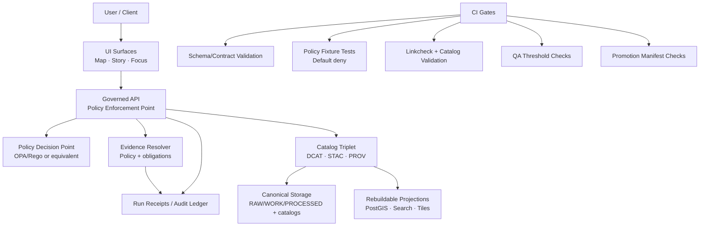

<!-- [KFM_META_BLOCK_V2]
doc_id: kfm://doc/2f0f7f5a-90c3-4d9c-80c0-0c5bf5a0d2d8
title: Architecture Enforcement
type: standard
version: v1
status: draft
owners: TBD
created: 2026-03-01
updated: 2026-03-01
policy_label: TBD
related:
  - docs/architecture/README.md
  - docs/architecture/governance/README.md
  - policy/README.md
  - tools/README.md
tags: [kfm, architecture, enforcement, governance, policy, ci]
notes:
  - This README documents *how* KFM enforces invariants (trust membrane, promotion gates, policy) across CI + runtime.
  - Keep this directory focused on enforceable, testable contracts—not aspirational prose.
[/KFM_META_BLOCK_V2] -->

# Architecture Enforcement

**One-line purpose:** Define *how KFM’s invariants become enforced behavior* (CI gates + runtime checks + auditable receipts), so every user-facing output is traceable and policy-correct.

 <!-- TODO: set to review/published -->


 <!-- TODO: link to policy bundle -->

---

## Navigation

- [What “enforcement” means in KFM](#what-enforcement-means-in-kfm)
- [Non-negotiable invariants enforced here](#non-negotiable-invariants-enforced-here)
- [Enforcement surfaces](#enforcement-surfaces)
- [Promotion Contract enforcement](#promotion-contract-enforcement)
- [Policy enforcement model](#policy-enforcement-model)
- [Evidence and citation enforcement](#evidence-and-citation-enforcement)
- [Directory contract](#directory-contract)
- [How to add a new enforcement gate](#how-to-add-a-new-enforcement-gate)
- [Minimum verification steps](#minimum-verification-steps)
- [Appendix: templates](#appendix-templates)

---

## What enforcement means in KFM

In KFM, **enforcement** is the set of mechanisms that turn governance intent into:

- **CI-blocking gates** (cannot merge / cannot promote / cannot publish)
- **Runtime enforcement points** (cannot access restricted resources, cannot leak sensitive metadata)
- **Auditable outputs** (receipts, manifests, provenance bundles) so decisions are inspectable and reproducible

> **Design posture:** If policy or evidence is uncertain, the system **fails closed** (deny, abstain, or reduce scope) rather than guessing.

[Back to top](#architecture-enforcement)

---

## Non-negotiable invariants enforced here

These are the invariants this directory is responsible for making enforceable and testable:

1. **Truth path lifecycle**
   - Data moves through explicit zones (RAW → WORK/QUARANTINE → PROCESSED → CATALOG/TRIPLET → PUBLISHED).
   - Promotion is blocked unless gates pass (identity, licensing, sensitivity, validation, receipts, etc.).

2. **Trust membrane**
   - Clients/UI must not bypass governed APIs.
   - Policy is enforced at runtime before data/evidence is returned.

3. **Policy parity**
   - The **same** policy semantics (or at least the same fixtures and outcomes) must hold in **CI and runtime**.

4. **Evidence-first UX and cite-or-abstain AI**
   - “Citations” are **resolvable EvidenceRefs**, not pasted URLs.
   - Story publishing and Focus Mode must verify citations; if verification fails, **abstain** or narrow.

5. **No sensitive leakage**
   - Do not leak restricted metadata via error paths (403/404), logs, or UI.

[Back to top](#architecture-enforcement)

---

## Enforcement surfaces



### Quick mental model

| Layer | What it enforces | Typical failure mode |
|---|---|---|
| CI gates | “This change cannot ship” | merge blocked |
| Promotion gates | “This dataset/story cannot be published” | promotion blocked / quarantined |
| Runtime PEP | “This request cannot be served” | 403 / abstain / generalized output |
| Evidence resolver | “This citation cannot be used” | citation fails → refuse, narrow, or abstain |
| Audit/receipts | “This decision must be inspectable” | missing receipts blocks promotion/publish |

[Back to top](#architecture-enforcement)

---

## Promotion Contract enforcement

Promotion is the act of moving from **Raw/Work** into **Processed + Catalog/Lineage**, and therefore into runtime surfaces.

### Minimal gate checklist (fail-closed)

Use this list for implementation and for reviews. Promotion must be blocked unless all required gates pass.

- [ ] **Identity & versioning**: stable dataset_version_id, deterministic spec hash, content digests
- [ ] **Licensing & rights**: license fields present; snapshot of upstream terms stored
- [ ] **Sensitivity + redaction plan**: policy_label assigned; obligations defined (generalize geometry, remove fields, etc.)
- [ ] **Catalog triplet validation**: DCAT/STAC/PROV validate under profiles; cross-links resolve
- [ ] **QA thresholds**: dataset-specific checks exist; failures quarantined
- [ ] **Run receipt + audit record**: inputs/outputs/tooling/policy decisions captured; audit append-only
- [ ] **Release/promotion manifest**: promotion recorded as a manifest referencing digests

> NOTE: Gates should be framed so they can be automated in CI and reviewed during steward sign-off.

[Back to top](#architecture-enforcement)

---

## Policy enforcement model

KFM uses a **Policy Decision Point (PDP)** and multiple **Policy Enforcement Points (PEPs)**.

### PDP + PEP pattern

- **PDP:** evaluates policy (OPA/Rego or equivalent)
- **PEPs:**
  - **CI PEP:** policy tests + schema validation block merges
  - **Runtime API PEP:** policy checks before serving data
  - **Evidence Resolver PEP:** policy checks before resolving EvidenceRefs and returning bundles
  - **UI:** shows policy badges/notices but **never makes policy decisions**

### Default-deny expectations

- Default deny for restricted/sensitive resources.
- If a public representation is allowed, publish a separate **public_generalized** version.
- Never leak restricted metadata in error responses (403/404) or logs.
- Treat redaction/generalization as first-class transforms recorded in provenance.

[Back to top](#architecture-enforcement)

---

## Evidence and citation enforcement

### What counts as a “citation”

A “citation” in KFM is:

- an **EvidenceRef**
- that **resolves** (via the evidence resolver) into an **EvidenceBundle**
- and is **policy-allowed**
- and includes enough metadata/provenance to inspect and reproduce the claim

### Hard gates

- **Story publishing**: all citations must resolve; otherwise publish is blocked.
- **Focus Mode**: citations must resolve and be policy-allowed; otherwise the model must abstain or reduce scope.

[Back to top](#architecture-enforcement)

---

## Directory contract

### Where this fits in the repo

This directory lives under `docs/architecture/` and documents **enforcement mechanics**: how invariants are implemented, tested, and audited.

### Acceptable inputs

Place documents here that are:

- enforcement **contracts** (what must be true)
- enforcement **mechanisms** (how it’s enforced, where it runs)
- enforcement **tests** (fixtures, golden tests, CI gate definitions)
- enforcement **checklists** and “Definition of Done” for gates
- diagrams that explain **control points** (CI, promotion, runtime, evidence)

Examples of appropriate doc types:

- “Policy parity: CI vs runtime semantics”
- “Promotion gates and their CI checks”
- “Evidence resolver contract + failure modes”
- “Sensitive data: default deny + generalization strategy”
- “Audit receipts: schema + required fields”

### Exclusions

Do **not** put these here:

- general architecture overviews (belongs in `docs/architecture/` root)
- detailed dataset specs (belongs in `data/` or dataset registry/spec locations)
- raw policy rules and fixtures (belongs in `policy/`)
- operational runbooks (belongs in `docs/runbooks/` or similar)
- UI component specs not related to enforcement (belongs in UI docs)

[Back to top](#architecture-enforcement)

---

## How to add a new enforcement gate

1. **Name the invariant** (what could go wrong? what harm is prevented?).
2. **Choose the enforcement point(s)**:
   - CI gate, promotion gate, runtime gate, evidence gate, or a combination.
3. **Define the failure mode** (must fail closed; define user-facing behavior).
4. **Add a testable contract**:
   - schema rules, fixture tests, or golden tests.
5. **Emit audit evidence**:
   - receipt field, manifest field, provenance link, or decision_id.
6. **Add minimum verification steps**:
   - the smallest set of checks a reviewer can run to confirm the gate works.

> TIP: If the gate can’t be automated or tested, it’s not an enforcement gate yet—treat it as a proposal until it is.

[Back to top](#architecture-enforcement)

---

## Minimum verification steps

These are the smallest checks needed to convert “we think enforcement exists” into “enforcement is confirmed”.

- **Policy parity**
  - Confirm policy bundle is versioned and has fixture-driven tests.
  - Confirm CI runs those tests and blocks merges on regression.

- **Promotion gates**
  - Confirm there is a validator for DCAT/STAC/PROV and a link checker.
  - Confirm promotion requires: IDs, digests, QA report, receipt, and manifest.

- **Runtime PEP**
  - Confirm API layer calls PDP before serving dataset queries/tiles/evidence.
  - Confirm unauthorized requests fail closed and do not leak metadata.

- **Evidence resolver**
  - Confirm EvidenceRef → EvidenceBundle resolution is policy-checked.
  - Confirm Story/Focus publishing/answering hard-fails if citations don’t resolve.

- **Auditability**
  - Confirm receipts/manifests include digests + policy decision identifiers.

[Back to top](#architecture-enforcement)

---

## Appendix: templates

<details>
<summary><strong>Template: enforcement doc skeleton</strong></summary>

```markdown
# <Enforcement topic>

## Invariant
## Threat / failure mode
## Enforcement points (CI / promotion / runtime / evidence)
## Test plan (fixtures/golden tests)
## Audit fields emitted
## Minimum verification steps
```
</details>

<details>
<summary><strong>Template: gate definition of done</strong></summary>

```markdown
- [ ] Gate documented (invariant, scope, failure mode)
- [ ] Gate implemented at correct PEP(s)
- [ ] Gate is automated in CI and/or promotion tooling
- [ ] Gate has tests (fixtures + negative cases)
- [ ] Gate emits audit evidence (receipt/manifest/prov link)
- [ ] Gate has a rollback story (reversible change)
```
</details>
