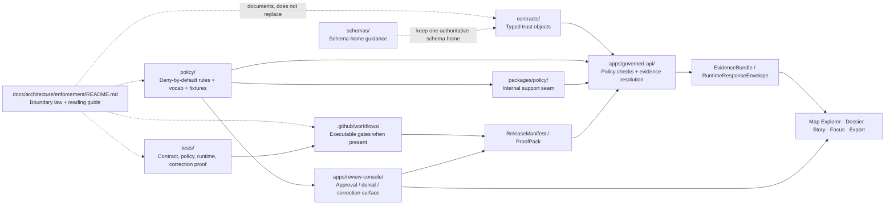

<!-- [KFM_META_BLOCK_V2]
doc_id: kfm://doc/<TODO-VERIFY-UUID>
title: Enforcement
type: standard
version: v1
status: draft
owners: @bartytime4life
created: 2026-03-01
updated: 2026-03-26
policy_label: <TODO-VERIFY-POLICY-LABEL>
related: [docs/README.md, docs/architecture/README.md, contracts/README.md, schemas/README.md, policy/README.md, tests/README.md, .github/workflows/README.md, apps/governed-api/README.md, apps/review-console/README.md, packages/policy/README.md]
tags: [kfm]
notes: [owners verified from current public-main CODEOWNERS; created and updated derived from GitHub file history on public main; doc_id and policy_label still need direct repo doc-record confirmation; docs/architecture/README.md still classifies this lane as scaffold-level and should be reconciled]
[/KFM_META_BLOCK_V2] -->

# Enforcement

Architecture boundary map for how Kansas Frontier Matrix turns doctrine into machine-checkable gates across contracts, policy, tests, workflows, runtime mediation, and trust-visible product surfaces.

> **Status:** experimental  
> **Owners:** `@bartytime4life`  
>       
> **Repo fit:** `docs/architecture/enforcement/README.md` → upstream [`../README.md`](../README.md), [`../../README.md`](../../README.md), [`../../governance/README.md`](../../governance/README.md), [`../../runbooks/README.md`](../../runbooks/README.md), [`../../standards/README.md`](../../standards/README.md) · enforcement-adjacent machine surfaces [`../../../contracts/README.md`](../../../contracts/README.md), [`../../../schemas/README.md`](../../../schemas/README.md), [`../../../policy/README.md`](../../../policy/README.md), [`../../../tests/README.md`](../../../tests/README.md), [`../../../.github/workflows/README.md`](../../../.github/workflows/README.md) · runtime consumers [`../../../apps/governed-api/README.md`](../../../apps/governed-api/README.md), [`../../../apps/review-console/README.md`](../../../apps/review-console/README.md), [`../../../packages/policy/README.md`](../../../packages/policy/README.md)  
> **Quick jumps:** [Scope](#scope) · [Repo fit](#repo-fit) · [Evidence basis](#evidence-basis) · [Accepted inputs](#accepted-inputs) · [Exclusions](#exclusions) · [Current public-main snapshot](#current-public-main-snapshot) · [Directory tree](#directory-tree) · [Quickstart](#quickstart) · [Usage](#usage) · [Diagram](#diagram) · [Enforcement points](#enforcement-points) · [Task list](#task-list--definition-of-done) · [FAQ](#faq) · [Appendix](#appendix)

> [!IMPORTANT]
> This README explains where enforcement **must live** in KFM. It does **not** become a second enforcement engine.  
> Contracts define shapes. Policy decides. Tests prove. Workflows gate. Governed runtime surfaces apply those gates at request time. Docs keep that boundary legible.

---

## Scope

`docs/architecture/enforcement/` is the architecture-facing guide to enforcement boundaries in KFM.

It should help a reviewer answer four questions quickly:

1. **Where does a rule actually live?**
2. **What is only documented, and what is expected to become executable?**
3. **Which surfaces must move together when enforcement changes?**
4. **What can this repo currently prove on public-main evidence, and what still needs direct verification?**

### Truth posture used here

| Label | Meaning in this README | Typical use here |
|---|---|---|
| **CONFIRMED** | Directly supported by currently visible repo/docs evidence | Existing paths, owner mapping, README-defined responsibilities |
| **INFERRED** | Strongly implied by multiple KFM sources, but not directly proven as mounted implementation | Cross-surface handoffs, likely enforcement seams |
| **PROPOSED** | Recommended repo-ready shape consistent with KFM doctrine | Starter review flow, future hardening tasks, expansion guidance |
| **UNKNOWN** | Not directly verified in the currently visible repo/workspace evidence | Live workflow catalog, mounted proof objects, runtime emitters |
| **NEEDS VERIFICATION** | Important enough to call out before treating as settled | `doc_id`, `policy_label`, schema-home authority, active-branch inventory, runtime depth |

### Working rule

KFM enforcement is **layered**, not monolithic:

- docs explain the boundary,
- contracts constrain structure,
- policy evaluates allow/deny/obligation logic,
- tests prove positive and negative behavior,
- workflows make checks executable,
- governed runtime surfaces apply those checks to outward requests,
- correction keeps lineage visible after release.

[Back to top](#enforcement)

---

## Repo fit

| Item | Role here |
|---|---|
| **Path** | `docs/architecture/enforcement/README.md` |
| **Primary job** | Explain how KFM enforcement crosses docs, contracts, policy, tests, workflows, and runtime trust surfaces |
| **Upstream reading** | [`../../README.md`](../../README.md), [`../README.md`](../README.md) |
| **Parallel architecture context** | [`../../governance/README.md`](../../governance/README.md), [`../../runbooks/README.md`](../../runbooks/README.md), [`../../standards/README.md`](../../standards/README.md) |
| **Machine-enforced neighbors** | [`../../../contracts/README.md`](../../../contracts/README.md), [`../../../schemas/README.md`](../../../schemas/README.md), [`../../../policy/README.md`](../../../policy/README.md), [`../../../tests/README.md`](../../../tests/README.md), [`../../../.github/workflows/README.md`](../../../.github/workflows/README.md) |
| **Runtime enforcement neighbors** | [`../../../apps/governed-api/README.md`](../../../apps/governed-api/README.md), [`../../../apps/review-console/README.md`](../../../apps/review-console/README.md), [`../../../packages/policy/README.md`](../../../packages/policy/README.md) |
| **Why this lane exists** | To stop “enforcement” from dissolving into vague prose on one side, or hidden runtime magic on the other |

### Boundary reminder

A healthy KFM enforcement doc should make it easier to answer:

- **What gets merge-blocked?**
- **What gets denied at runtime?**
- **What gets surfaced as abstain/deny/error instead of bluffing?**
- **What evidence and correction objects must remain visible when the system says “no”?**

[Back to top](#enforcement)

---

## Evidence basis

| Evidence layer | Status | Used here for |
|---|---|---|
| Current public `main` `docs/architecture/enforcement/README.md` | **CONFIRMED** | current lane text, section rhythm, relative links, and lane-level claims |
| GitHub history for this path | **CONFIRMED** | `created` / `updated` date derivation and visible scaffold → substantive transition on public `main` |
| Current public `main` `.github/CODEOWNERS` | **CONFIRMED** | owner verification for `@bartytime4life` |
| Current public `main` adjacent README surfaces | **CONFIRMED** | neighbor responsibilities, README-only vs substantive posture, and cross-surface terminology |
| March 2026 KFM doctrine corpus | **CONFIRMED** | trust membrane, truth path, authoritative-versus-derived split, finite runtime outcomes, proof-object families, and hydrology-first sequencing |
| Branch protection rules, required checks, mounted policy bundles, runtime emitters, proof packs, and deployment manifests | **UNKNOWN** | not presented here as current implementation fact without mounted proof |

### Interpretation rule

Use the public tree for **what exists now**, GitHub history for **this file’s visible document timeline**, and the March 2026 doctrine corpus for **what these surfaces are supposed to mean**.

When those layers diverge, keep the mismatch visible instead of smoothing it into certainty.

[Back to top](#enforcement)

---

## Accepted inputs

This directory should accept material like the following:

| Accepted here | Why it belongs here |
|---|---|
| Enforcement boundary maps | Explains how layers compose without duplicating executable content |
| Gate sequence docs | Clarifies order across contracts → policy → tests → workflows → runtime |
| Proof-object matrices | Shows which trust objects matter at which enforcement point |
| Review / release / correction enforcement guides | Keeps approval, denial, rollback, and correction behavior legible |
| Runtime outcome semantics | Documents how `ANSWER`, `ABSTAIN`, `DENY`, and `ERROR` should be interpreted across surfaces |
| Cross-links to adjacent authoritative surfaces | Helps maintainers navigate without creating duplicate rule homes |
| ADR pointers | Records enforcement-significant decisions such as schema-home authority or workflow gate model |

---

## Exclusions

This directory should **not** become a storage area for the mechanisms it describes.

| Do **not** put here | Put it here instead |
|---|---|
| Canonical JSON Schemas / OpenAPI source of truth | [`../../../contracts/README.md`](../../../contracts/README.md) and the eventual authoritative schema home |
| Executable policy bundles, fixtures, tests | [`../../../policy/README.md`](../../../policy/README.md) |
| Generic verification suites or runtime behavior tests | [`../../../tests/README.md`](../../../tests/README.md) |
| GitHub Actions workflow YAML and gate automation | [`../../../.github/workflows/README.md`](../../../.github/workflows/README.md) |
| Governed API enforcement code | [`../../../apps/governed-api/README.md`](../../../apps/governed-api/README.md) |
| Steward review implementation | [`../../../apps/review-console/README.md`](../../../apps/review-console/README.md) |
| Internal policy support code that is not the authoritative policy bundle | [`../../../packages/policy/README.md`](../../../packages/policy/README.md) |
| Live proof artifacts, manifests, receipts, audit traces | Their governed runtime, review, release, or data homes |

> [!NOTE]
> KFM docs are production surfaces, but they are still **downstream of enforcement**.  
> This README should improve trust, not replace enforcement with explanation.

[Back to top](#enforcement)

---

## Current public-main snapshot

The current public-main signal for this lane is uneven on purpose: some surfaces are already strong, while others are still README-first or placeholder-first.

| Surface | Current signal | How to read it safely |
|---|---|---|
| `docs/architecture/enforcement/README.md` | Substantive README on current public `main`; visible history shows scaffold creation on `2026-03-01` and a clarity/detail revision on `2026-03-26` | Treat this file as the specific lane source; treat older scaffold references elsewhere as reconciliation work, not lane truth |
| `docs/architecture/README.md` | Substantive architecture index, but its current snapshot still classifies `enforcement/README.md` as scaffold-level | Use it as the directory navigation anchor, but prefer this file for lane detail until the index is reconciled |
| `contracts/README.md` | Substantive boundary README; current public tree for this lane remains README-only | Strong on role; not proof of a live contract registry |
| `schemas/README.md` | Substantive boundary README; current public tree remains README-only and schema-home authority is still pending | Keep schema authority singular and explicit before making stronger claims |
| `policy/README.md` | Substantive policy doctrine README | Strong on deny-by-default posture; not proof of mounted `.rego` bundles or policy tests |
| `tests/README.md` | Substantive verification README | Strong on proof burdens; not proof of full runnable suite depth |
| `.github/workflows/README.md` | README present; current public tree for the workflow lane is README-only | Do **not** infer checked-in merge-blocking YAML from historical Actions activity alone |
| `apps/governed-api/README.md` | Substantive boundary README | Runtime trust seam is named; route family, response-envelope depth, and even path continuity still need proof |
| `apps/review-console/README.md` | Substantive boundary README | Review is shell variation, not a separate truth system; child routes, panels, and fixtures remain unverified |
| `packages/policy/README.md` | Substantive cautionary README | Internal package support is not the authoritative policy home |

> [!CAUTION]
> Current public `main` contains a real cross-doc drift: this file is substantive, while `docs/architecture/README.md` still reports `enforcement/README.md` as scaffold-level in its snapshot table.  
> Treat the child README as the specific lane source and queue index reconciliation in the same change stream.

### Reading consequence

When repo evidence is README-first, use README claims for **responsibility and intended boundary**, not for hidden implementation depth.

[Back to top](#enforcement)

---

## Directory tree

### Current path evidence

```text
docs/
└── architecture/
    └── enforcement/
        └── README.md
```

### Enforcement-adjacent reading chain

```text
docs/architecture/enforcement/README.md
├── ../../README.md
├── ../README.md
├── ../../../contracts/README.md
├── ../../../schemas/README.md
├── ../../../policy/README.md
├── ../../../tests/README.md
├── ../../../.github/workflows/README.md
├── ../../../apps/governed-api/README.md
├── ../../../apps/review-console/README.md
└── ../../../packages/policy/README.md
```

### Interpretation rule

The tree above shows **confirmed path visibility**, not equal maturity.  
A named path is not the same as a fully populated enforcement lane.

[Back to top](#enforcement)

---

## Quickstart

Use this sequence before claiming that “enforcement exists” for any change.

```bash
# 1) Re-check the docs lane
sed -n '1,220p' docs/README.md
sed -n '1,260p' docs/architecture/README.md
sed -n '1,260p' docs/architecture/enforcement/README.md

# 2) Re-check machine-enforced neighbors
sed -n '1,240p' contracts/README.md
sed -n '1,240p' schemas/README.md
sed -n '1,260p' policy/README.md
sed -n '1,240p' tests/README.md
sed -n '1,240p' .github/workflows/README.md

# 3) Re-check runtime boundaries
sed -n '1,220p' apps/governed-api/README.md
sed -n '1,220p' apps/review-console/README.md
sed -n '1,220p' packages/policy/README.md

# 4) Search trust-bearing enforcement terms
grep -RInE 'DecisionEnvelope|ReviewRecord|ReleaseManifest|ProofPack|EvidenceBundle|RuntimeResponseEnvelope|CorrectionNotice|ANSWER|ABSTAIN|DENY|ERROR|cite-or-abstain|trust membrane' \
  docs contracts schemas policy tests .github apps packages 2>/dev/null || true
```

### Minimum review habit

Before merging an enforcement-significant doc change:

1. read the adjacent authoritative README surfaces again,
2. verify whether the claim is **README intent** or **checked-in executable reality**,
3. update the neighboring docs if the boundary changed,
4. keep new unknowns visible instead of smoothing them away.

[Back to top](#enforcement)

---

## Usage

### Reading order for reviewers

1. [`../../README.md`](../../README.md)
2. [`../README.md`](../README.md)
3. [`../../../contracts/README.md`](../../../contracts/README.md)
4. [`../../../schemas/README.md`](../../../schemas/README.md)
5. [`../../../policy/README.md`](../../../policy/README.md)
6. [`../../../tests/README.md`](../../../tests/README.md)
7. [`../../../.github/workflows/README.md`](../../../.github/workflows/README.md)
8. [`../../../apps/governed-api/README.md`](../../../apps/governed-api/README.md)
9. [`../../../apps/review-console/README.md`](../../../apps/review-console/README.md)
10. this file, to confirm that the narrative boundary still matches the executable and semi-executable surfaces

### Reading order for authors

Use this README when you need to answer:

- “Where should this rule live?”
- “Is this a contracts change, a policy change, a tests change, a workflow change, or a runtime change?”
- “What else must move so trust does not fragment?”
- “Can I honestly call this enforced, or only documented?”

### Enforcement-significant changes

| Change type | Examples | Move together |
|---|---|---|
| Contract family change | `DecisionEnvelope`, `EvidenceBundle`, `RuntimeResponseEnvelope`, `CorrectionNotice` | contracts · schemas · tests · runtime docs |
| Policy grammar change | reason codes, obligations, reviewer roles, deny/default logic | policy · contracts/vocab surface · tests · review docs |
| Runtime outcome change | `ANSWER`, `ABSTAIN`, `DENY`, `ERROR` semantics | contracts · policy · tests · governed API · shell docs |
| Gate automation change | merge-blocking validators, release checks, docs gates | workflows · tests · contracts/policy docs |
| Review / correction change | approval, denial, rollback, correction visibility | policy · review console · runtime docs · runbooks |
| Boundary exception change | direct-store bypass, hidden model path, side-door package logic | architecture docs · governed API docs · package docs · ADRs |

> [!WARNING]
> Any change that weakens finite outcomes, cite-or-abstain behavior, correction visibility, or the governed API boundary should be treated as architecture-significant, not “just documentation.”

[Back to top](#enforcement)

---

## Diagram


```mermaid
flowchart LR
    Docs["docs/architecture/enforcement/README.md<br/>Boundary law + reading guide"]
    Contracts["contracts/<br/>Typed trust objects"]
    Schemas["schemas/<br/>Schema-home guidance"]
    Policy["policy/<br/>Deny-by-default rules + vocab + fixtures"]
    Tests["tests/<br/>Contract, policy, runtime, correction proof"]
    Workflows[".github/workflows/<br/>Executable gates when present"]
    GovAPI["apps/governed-api/<br/>Policy checks + evidence resolution"]
    Review["apps/review-console/<br/>Approval / denial / correction surface"]
    PkgPolicy["packages/policy/<br/>Internal support seam"]
    Release["ReleaseManifest / ProofPack"]
    Runtime["EvidenceBundle / RuntimeResponseEnvelope"]
    Surfaces["Map Explorer · Dossier · Story · Focus · Export"]

    Docs -. documents, does not replace .-> Contracts
    Docs -.-> Policy
    Docs -.-> Tests
    Docs -.-> Workflows

    Schemas -. keep one authoritative schema home .-> Contracts

    Contracts --> GovAPI
    Policy --> GovAPI
    Policy --> Review
    Policy --> PkgPolicy
    PkgPolicy --> GovAPI

    Tests --> Workflows
    Workflows --> Release
    Review --> Release
    Release --> GovAPI

    GovAPI --> Runtime
    Runtime --> Surfaces
    Review --> Surfaces
```

### Diagram reading rule

The most important edge is the one KFM refuses to hide:

**public or steward surfaces do not jump around governed mediation just because data or models exist elsewhere.**

[Back to top](#enforcement)

---

## Enforcement points

### Boundary rules worth keeping close

- **Docs explain enforcement; they do not substitute for it.**
- **Schema-home authority should stay singular, not drift into parallel truth surfaces.**
- **Policy remains deny-by-default, with explicit reasons and obligations.**
- **Tests must prove negative paths, not only happy paths.**
- **Workflow automation matters only when it is actually checked in and active.**
- **Runtime answering must remain finite and policy-aware.**
- **Correction must travel forward visibly rather than overwrite history.**

### Enforcement surface matrix

| Surface | Primary job | Must prove or preserve | Must never be mistaken for |
|---|---|---|---|
| `contracts/` | Typed trust-object boundary | structure, required fields, finite enums, extension discipline | policy decision logic |
| `schemas/` | Schema-home clarity and companion structure | no silent contract drift, no parallel schema universes | a second contract authority |
| `policy/` | deny-by-default decision logic | reasons, obligations, review-bearing gates, publication constraints | UI-only warnings |
| `tests/` | governed proof | invalid fixtures, citation-negative behavior, correction drills, stale/denied states | generic QA bucket |
| `.github/workflows/` | executable gate wiring | merge/deploy blocking where adopted, repeatable validators | proof that gates exist before they are checked in |
| `apps/governed-api/` | runtime enforcement seam | policy checks, evidence resolution, finite outward outcomes | direct store or model access path |
| `apps/review-console/` | steward enforcement surface | approval, denial, correction, quarantine-safe handling | alternate truth backend |
| `packages/policy/` | internal support seam | reuse without policy-home confusion | the authoritative policy bundle |
| `docs/architecture/enforcement/` | architecture narrative and cross-linking | legible boundaries, explicit unknowns, synchronized guidance | the enforcing mechanism itself |

### Finite runtime outcomes

| Outcome | Minimum enforcement expectation | User-facing consequence |
|---|---|---|
| `ANSWER` | citations are present, evidence resolves, policy permits output | visible claim with drill-through path |
| `ABSTAIN` | support is partial or missing, and the system declines to improvise | calm non-answer, explicit reason, no bluff |
| `DENY` | policy blocks disclosure, action, or precision level | visible restriction with reason/obligation path |
| `ERROR` | runtime or dependency failure stays explicit and auditable | no hallucinated fallback; error remains reconstructable |

### Trust objects that enforcement most commonly touches

| Object / state | Why it matters here |
|---|---|
| `DecisionEnvelope` | Connects review/policy outcome to a specific governed decision |
| `ReviewRecord` | Prevents invisible approvals or denials |
| `ReleaseManifest` / proof pack | Makes publication and rollback traceable |
| `EvidenceBundle` | Keeps evidence resolution inspectable at point of use |
| `RuntimeResponseEnvelope` | Carries finite runtime outcome semantics |
| `CorrectionNotice` | Preserves supersession, withdrawal, narrowing, and reissue lineage |
| stale / generalized / partial / withdrawn states | Keeps negative and limited states visible instead of implied away |

[Back to top](#enforcement)

---

## Task list / definition of done

### This README is in good standing when

- [ ] `doc_id` and `policy_label` are retired from placeholder state
- [ ] `created` and `updated` stay synchronized with Git history on the active branch
- [ ] all relative links resolve on the active branch
- [ ] the “Current public-main snapshot” section has been rechecked against current reality
- [ ] the current snapshot in `docs/architecture/README.md` is reconciled so this lane is not simultaneously labeled scaffold-level there
- [ ] any enforcement-significant architecture change updates this file and the neighboring authoritative surface docs together
- [ ] no prose here implies merge-blocking automation, live bundles, or runtime emitters without direct evidence

### The enforcement lane is materially real when

- [ ] one authoritative schema-home decision is explicit
- [ ] first-wave contract files and valid/invalid fixtures are visible
- [ ] policy bundles, finite vocab registries, and policy tests are visible
- [ ] workflow automation is either checked in and documented, or its absence is made explicit
- [ ] governed API docs can point to real route, envelope, or response evidence
- [ ] correction and rollback behavior are documented with visible proof objects or drills
- [ ] at least one thin slice proves the sequence end to end instead of leaving it documentary

[Back to top](#enforcement)

---

## FAQ

### Why have an enforcement README if docs do not enforce?

Because the repo already separates **docs**, **contracts**, **policy**, **tests**, **workflows**, and **runtime** into distinct trust-bearing surfaces. Without a boundary README, people tend to blur them together.

### Does this file prove merge-blocking enforcement already exists?

No. It should only describe where such enforcement belongs, how to verify it, and what must move together when it changes.

### Is the schema home settled?

Not from the currently visible public-main evidence. This README keeps that ambiguity visible on purpose.

### Is UI messaging itself enforcement?

No. UI trust cues matter, but they are downstream of contracts, policy, tests, workflow gates, and governed runtime mediation.

### What is the fastest way to create false confidence here?

Treat README intent as if it were already executable reality, or treat runtime convenience as permission to bypass the governed API boundary.

[Back to top](#enforcement)

---

## Appendix

<details>
<summary><strong>What this README can safely say today</strong></summary>

- This path exists on current public `main`.
- GitHub history shows a visible scaffold-to-substantive transition for this lane during March 2026.
- The architecture index is still the stronger directory navigation surface, but it currently needs reconciliation because it still classifies this lane as scaffold-level.
- Contracts, policy, tests, workflows, governed API, review console, and `packages/policy/` all have visible README-defined roles.
- The strongest safe use for this file right now is as a boundary guide, review aid, and cross-surface sync point.

</details>

<details>
<summary><strong>What still needs direct repo verification before publish</strong></summary>

- stable KFM document UUID for this lane
- policy label for this document
- whether `docs/architecture/enforcement/` should remain README-only or gain child docs
- authoritative schema home and actual `.schema.json` inventory
- actual workflow YAML inventory and which gates are required
- actual policy bundle / fixture / test inventory
- actual governed API route families, response envelopes, and emitter depth
- actual correction / rollback proof traces

</details>

<details>
<summary><strong>Review shortcut</strong></summary>

If you only have a few minutes, re-check these in order:

1. [`../README.md`](../README.md)
2. [`../../../contracts/README.md`](../../../contracts/README.md)
3. [`../../../policy/README.md`](../../../policy/README.md)
4. [`../../../tests/README.md`](../../../tests/README.md)
5. [`../../../.github/workflows/README.md`](../../../.github/workflows/README.md)
6. [`../../../apps/governed-api/README.md`](../../../apps/governed-api/README.md)

Then come back here and verify that this README still describes the same boundary.

</details>

[Back to top](#enforcement)