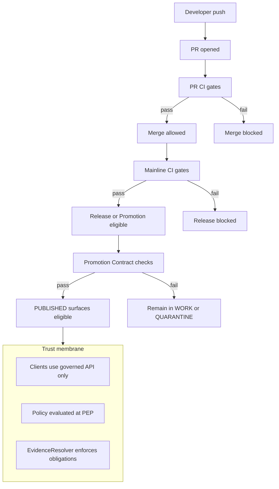

<!-- [KFM_META_BLOCK_V2]
doc_id: kfm://doc/ba112a28-502a-4449-ac78-56555b4642b0
title: CI Checks
type: standard
version: v1
status: draft
owners: KFM Maintainers
created: 2026-03-01
updated: 2026-03-01
policy_label: public
related:
  - kfm://doc/<TODO: trust-membrane>
  - kfm://doc/<TODO: promotion-contract>
  - docs/architecture/enforcement/
tags: [kfm, architecture, enforcement, ci, gates]
notes:
  - This document defines the CI gate registry that enforces KFM invariants and the Promotion Contract.
  - Repo-specific workflow filenames and local commands are intentionally left as TODO until verified.
[/KFM_META_BLOCK_V2] -->

# CI Checks

**Purpose:** Define the *required* CI checks (“gates”) that enforce KFM’s non-negotiable invariants and **fail closed** when evidence, policy, provenance, or rights metadata are missing.

**Status:** draft • **Owners:** KFM Maintainers • **Policy label:** public


## Navigation

- [Scope](#scope)
- [Design principles](#design-principles)
- [Gating model](#gating-model)
- [Gate registry](#gate-registry)
- [Promotion Contract mapping](#promotion-contract-mapping)
- [Trust membrane mapping](#trust-membrane-mapping)
- [How to run checks locally](#how-to-run-checks-locally)
- [How to add a new gate](#how-to-add-a-new-gate)
- [Minimum verification steps](#minimum-verification-steps)

---

## Scope

This file defines **what must be true** before code, policies, schemas, catalogs, or data artifacts can be merged or promoted.

In scope:

- **PR merge gates** (fast feedback; must pass before merge)
- **Mainline gates** (deeper test suite; must pass before release/promotion)
- **Promotion Contract gates** (block moving a dataset version to PUBLISHED)
- **Security and compliance checks** that protect the trust membrane and prevent leakage

Out of scope:

- CD rollout mechanics (deployments, canaries, rollback automation)
- Environment-specific operational runbooks (those live under runbooks/)

### Where this doc fits

```text
docs/
  architecture/
    enforcement/
      ci-checks.md   # you are here
```

---

## Design principles

### Fail closed

If a gate cannot be evaluated (missing fixtures, missing catalogs, missing schema, missing evidence), CI **must fail**.

> **Why:** KFM’s governance intent becomes enforceable behavior through validation gates—especially the Promotion Contract and trust membrane. If CI is permissive under uncertainty, the trust membrane is porous.

### Evidence-first

A “pass” must be backed by **inspectable artifacts** (reports, receipts, manifests) stored as CI artifacts.

### Fast-first, deep-later

PR checks should be optimized for quick iteration. Deep checks (e2e, heavy validation, rebuildability tests) can run on merge to main and/or on a schedule.

### Make invariants testable

KFM invariants are only real if encoded as tests:

- **Truth path lifecycle** and **Promotion Contract gates**
- **Trust membrane** (no direct store access; policy enforced at the PEP)
- **Catalog triplet** (DCAT + STAC + PROV) correctness + cross-linking
- **Cite-or-abstain** (hard citation verification gate)

---

## Gating model



### CI stages

| Stage | Trigger | Primary goal | Blocking? |
|---|---|---:|:---:|
| PR CI | pull_request | stop unsafe merges early | ✅ |
| Mainline CI | push to main | ensure full suite is green | ✅ |
| Promotion CI | release/promotion workflow | block unsafe publication | ✅ |
| Nightly | schedule | catch drift (deps, links, scans) | ⚠️ depends |

> **NOTE:** “Promotion CI” can be a GitHub Actions workflow, a CLI command in a controlled runner, or both. The key requirement is **automation + auditable outputs**.

---

## Gate registry

The registry below is the contract: **every gate has an ID**, a clear failure condition, and a local entrypoint.

Legend:

- **CONFIRMED intent:** required by KFM governance/design docs.
- **PROPOSED implementation:** suggested tooling/wiring; verify against the live repo.

### PR gates (fast)

| Gate ID | Intent | What it blocks | Typical implementation (PROPOSED) | Outputs (evidence) |
|---|---|---|---|---|
| CI-PR-01 | Code quality baseline | lint/format regressions | eslint/biome/prettier, ruff/black, gofmt, etc. | lint + format report |
| CI-PR-02 | Unit tests | broken core logic | language test runner | junit / coverage |
| CI-PR-03 | Contract lint | breaking API/schema contracts | OpenAPI lint (e.g., Spectral), JSON Schema validation | contract lint report |
| CI-PR-04 | Policy unit tests | policy regressions / default-allow | OPA/Rego tests (opa test / conftest) | policy test report |
| CI-PR-05 | Docs hygiene | broken internal links | markdown link checker | link report |
| CI-PR-06 | Secret scan | credential leaks | gitleaks/trufflehog | secret scan report |

### Mainline gates (deeper)

| Gate ID | Intent | What it blocks | Typical implementation (PROPOSED) | Outputs (evidence) |
|---|---|---|---|---|
| CI-MAIN-01 | Integration tests | broken service boundaries | docker compose / testcontainers | junit logs |
| CI-MAIN-02 | E2E smoke | broken user-critical flows | Playwright/Cypress | traces + screenshots |
| CI-MAIN-03 | Catalog validators | invalid DCAT/STAC/PROV, broken cross-links | validator suite + link graph check | validation report |
| CI-MAIN-04 | Deterministic hashing | spec drift / non-determinism | golden tests across OS | golden diffs |
| CI-MAIN-05 | Supply-chain scan | known vulnerable deps | SCA (dependabot + osv-scanner, etc.) | vuln report |
| CI-MAIN-06 | Container/IaC scan | insecure infra configs | Trivy + IaC scanners | scan reports |

### Promotion gates (must fail closed)

These gates correspond to the Promotion Contract.

| Gate ID | Promotion Contract gate | What it blocks | Outputs (evidence) |
|---|---|---|---|
| CI-PROMO-A | Identity & versioning | promoting without stable IDs / hashes | identity + digest report |
| CI-PROMO-B | Licensing & rights | promoting unlicensed/unknown rights | rights snapshot + validation |
| CI-PROMO-C | Sensitivity & redaction | leaking sensitive details | policy decision + redaction diff |
| CI-PROMO-D | Catalog triplet validation | unresolvable evidence | validator + link graph report |
| CI-PROMO-E | QA thresholds | publishing low-quality / failing QA | QA report w/ thresholds |
| CI-PROMO-F | Run receipt & audit | non-reproducible runs | receipt validation + audit append |
| CI-PROMO-G | Release manifest | untracked releases | manifest + digest verification |

---

## Promotion Contract mapping

KFM’s Promotion Contract is designed so it can be automated in CI; promotion to PUBLISHED must be blocked unless the required artifacts exist and validate.

### Gate-by-gate checklist

> The checklist below is **the minimum**. Dataset-specific specs may add additional checks.

- **Gate A — Identity & versioning**
  - dataset_id + dataset_version_id exist
  - spec_hash is deterministic
  - content digests exist for RAW and PROCESSED artifacts

- **Gate B — Licensing & rights metadata**
  - license/rights fields are present
  - upstream terms snapshot artifact exists

- **Gate C — Sensitivity classification & redaction plan**
  - policy_label assigned
  - obligations exist when needed (generalize geometry, remove fields)
  - default-deny policy tests pass

- **Gate D — Catalog triplet validation (DCAT + STAC + PROV)**
  - DCAT, STAC, PROV validate
  - cross-links resolve (no guessing)

- **Gate E — QA & thresholds**
  - QA report exists
  - thresholds met or dataset remains in QUARANTINE

- **Gate F — Run receipt & audit record**
  - run receipt validates against schema
  - audit record append is successful (append-only)

- **Gate G — Release manifest**
  - promotion recorded as a release manifest
  - references match canonical objects (digests)

---

## Trust membrane mapping

### What must be enforced

The trust membrane is the boundary that prevents policy bypass:

- clients/UI **do not** access storage directly
- all reads/writes pass through **governed API (PEP)**
- policy evaluation and evidence resolution happen at the boundary

### CI gates that enforce it

| Invariant / risk | Gate(s) | How it fails closed |
|---|---|---|
| Direct store access from UI/client | CI-MAIN-01 + CI-PR-02 | integration tests assert no direct DB credentials in client bundles; repository interfaces only |
| Policy regressions (default-allow) | CI-PR-04 + CI-PROMO-C | OPA tests require default-deny; fixtures cover restricted scenarios |
| Evidence leakage | CI-MAIN-02 + CI-PROMO-C | e2e ensures restricted artifacts/fields are not returned; redaction obligations honored |
| Unverifiable citations | CI-MAIN-03 + CI-PROMO-D | citations must resolve via EvidenceResolver; broken links block |

---

## How to run checks locally

> **WARNING:** Repo-specific commands are **not confirmed** here. This section defines the *required shape* of local entrypoints.

### Required developer entrypoints

Every CI gate MUST have a corresponding local command.

**Minimum contract (pick one):**

- `make check` (recommended)
- `./scripts/ci.sh`
- `task check` (Taskfile)

### Suggested command map (PROPOSED)

```bash
# fast (PR-equivalent)
make lint
make test
make contracts
make policy-test
make linkcheck

# deep (mainline)
make integration-test
make e2e
make catalog-validate
make hash-golden

# promotion
make promote-check DATASET_VERSION_ID=...   # fail closed
```

---

## How to add a new gate

1. Add a row to the appropriate section of the [Gate registry](#gate-registry).
2. Implement the gate in CI with:
   - clear inputs
   - deterministic outputs
   - artifact upload (reports/receipts)
3. Add a local entrypoint (see [How to run checks locally](#how-to-run-checks-locally)).
4. If the gate is blocking, update branch protection rules / required checks.
5. Add/extend fixtures so the gate fails meaningfully.

Definition of Done:

- [ ] Gate has an ID + owner
- [ ] Gate produces artifacts that can be inspected later
- [ ] Gate is deterministic (no time-of-day randomness without pinning)
- [ ] Gate has at least one negative test (proves it fails when it should)
- [ ] Docs updated (this file + any relevant runbooks)

---

## Minimum verification steps

This document is intentionally *conservative* about repo specifics. To convert “PROPOSED” into “CONFIRMED”, verify the following in the live repository:

1. **Workflow inventory**
   - list `.github/workflows/*.yml`
   - map each workflow/job to a Gate ID

2. **Local commands**
   - identify the canonical local entrypoints (`make`, `scripts/`, `task`, `npm`, etc.)
   - ensure every CI job has a local equivalent

3. **Branch protection wiring**
   - confirm required checks for `main`
   - confirm CODEOWNERS coverage for `contracts/`, `policy/`, and `data/registry`

4. **Promotion workflow**
   - confirm how “promotion” is invoked (CLI, workflow_dispatch, protected environment)
   - confirm artifacts emitted: receipts, manifests, catalogs, digests

5. **Fail-closed tests**
   - confirm missing license, missing policy_label, broken EvidenceRefs, and invalid catalogs all fail CI

---

<details>
<summary>Appendix: Suggested GitHub Actions layout (PROPOSED)</summary>

```text
.github/workflows/
  ci-pr.yml           # CI-PR-* gates
  ci-main.yml         # CI-MAIN-* gates
  ci-promotion.yml    # CI-PROMO-* gates
  ci-nightly.yml      # scheduled drift checks
```

Pseudo-structure (illustrative):

```yaml
name: ci-pr
on: [pull_request]
jobs:
  lint:
    runs-on: ubuntu-latest
    steps: ...
  unit:
    runs-on: ubuntu-latest
    steps: ...
  policy:
    runs-on: ubuntu-latest
    steps: ...
```

</details>

---

*Back to top:* [CI Checks](#ci-checks)
