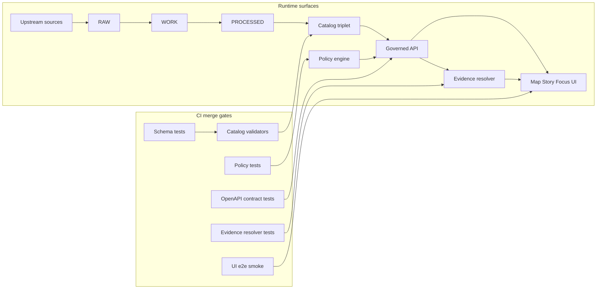

<!-- [KFM_META_BLOCK_V2]
doc_id: kfm://doc/7f9d0b63-5b9b-47dc-9f93-4a2b8a6f7e5e
title: Contract Testing
type: standard
version: v1
status: draft
owners: KFM Architecture
created: 2026-03-01
updated: 2026-03-01
policy_label: public
related:
  - docs/architecture/enforcement/
  - kfm://concept/promotion-contract
  - kfm://concept/trust-membrane
  - kfm://concept/policy-as-code
  - kfm://concept/catalog-triplet
  - kfm://concept/evidence-resolver
  - kfm://concept/openapi-contracts
  - kfm://concept/story-node-v3
  - kfm://concept/focus-mode-eval
  - kfm://concept/run-receipts
  - kfm://concept/linkcheck
tags: [kfm, architecture, enforcement, contracts, testing]
notes:
  - Contract testing is part of the Promotion Contract (Gate F) and is merge-blocking.
  - This doc is written to be actionable even if the repo layout evolves.
[/KFM_META_BLOCK_V2] -->

# Contract testing


**Purpose:** Make governance enforceable by treating schemas, policies, catalogs, and APIs as *contracts* and encoding them as **merge-blocking tests**.

---

## Quick navigation

- [Why contract testing exists](#why-contract-testing-exists)
- [Contract surfaces](#contract-surfaces)
- [Where contract tests run](#where-contract-tests-run)
- [Test matrix](#test-matrix)
- [Patterns and rules](#patterns-and-rules)
- [Implementation sketch](#implementation-sketch)
- [Definition of done](#definition-of-done)
- [Minimum verification steps](#minimum-verification-steps)

---

## Why contract testing exists

KFM’s “trust membrane” and “truth path” only hold if **every boundary has an enforceable contract**.

Contract testing prevents:

- **Policy drift:** CI “green” that doesn’t match runtime policy behavior.
- **Schema drift:** catalogs, receipts, Story Nodes, and DTOs that “look fine” but break downstream.
- **Silent breaking changes:** API changes that compile but break UI/clients.
- **Evidence failures:** citations that cannot resolve (or resolve but leak restricted content).

> **Non-negotiable:** If a contract is violated, the system must **fail closed** (block merge, block promotion, or abstain).

---

## Where this doc fits

- **Location:** `docs/architecture/enforcement/contract-testing.md`
- **Role:** Defines the contract surfaces and the merge-blocking tests that enforce them.
- **Related:** Promotion Contract gates, policy-as-code, evidence resolver, catalog triplet, OpenAPI.

## Acceptable inputs

This doc should be updated when you change:

- contract artifacts (schemas, OpenAPI, policy pack, catalog profiles)
- CI gates/lanes that run contract tests
- promotion workflow requirements for Gate F

## Exclusions

This doc is *not*:

- a full CI implementation guide (see CI workflow docs)
- a load/performance testing guide
- a replacement for standards docs (DCAT/STAC/PROV profiles)

## Contract surfaces

Contract surfaces are the boundaries where drift causes governance failures. KFM treats these as first-class, testable interfaces.

## Architecture overview



A “contract surface” is any artifact where one module/team/stage produces structured output that another module/stage consumes.

### Contract surface taxonomy

| Surface | Primary artifacts (contract) | Producer | Consumer | What breaks if contract drifts | Minimum test |
|---|---|---|---|---|---|
| **Promotion gates** | Promotion Contract gates (incl. Gate F) | CI + stewards | Promotion workflow | Unreviewable or unsafe data reaches runtime | Gate checks are merge/promotion blocking |
| **Catalog triplet** | DCAT + STAC + PROV profiles | Pipeline / catalog builder | API, evidence resolver, UI | Discovery & evidence resolution become ambiguous | Profile validation + cross-link check |
| **Policy-as-code** | OPA/Rego bundle + fixtures | Governance | CI, runtime API, evidence resolver | CI guarantees meaningless if runtime differs | Fixture-based allow/deny + obligations |
| **API surface** | OpenAPI specs + DTO schemas | API implementers | UI, CLI, external clients | UI/client breakage; policy bypass via schema gaps | OpenAPI diff + request/response validation |
| **Evidence resolution** | EvidenceRef schemes + EvidenceBundle schema | Evidence resolver | Focus Mode, Story publish, UI evidence drawer | “Cite-or-abstain” fails; leakage risk | Integration tests: resolve + policy filter |
| **Story publishing** | Story Node schema + publish gate | Story authoring | Runtime story renderer | Stories publish without resolvable citations | Schema + citation resolve tests |
| **Focus Mode** | Focus response schema + citation verifier | Focus orchestrator | UI and audit ledger | Hallucination / leakage without receipts | Golden query harness + contract validation |

---

## Where contract tests run

Contract tests are not one thing; they’re a set of checks placed at the points where drift is most expensive.

### 1) Local developer loop (recommended)
- Run contract tests locally before opening a PR.
- Goal: catch schema drift and missing fixtures early.

### 2) PR CI (required)
- Contract tests must be **merge-blocking**.
- Goal: guarantee that any promoted artifact is valid and any served API response matches its declared contract.

### 3) Promotion / release workflows (required)
- Promotion MUST be blocked unless contracts validate.
- Goal: ensure “PUBLISHED” only serves promoted dataset versions with validated catalogs, receipts, and policy labels.

### 4) Runtime “belt and suspenders” checks (recommended)
- Runtime should validate critical DTOs/citations at the boundary (especially for public surfaces).
- Goal: prevent accidental leakage from untested paths.

---

## Test matrix

> Treat this matrix as a checklist for what must exist *somewhere* in CI, even if the implementation language/tooling changes.

### Minimum categories

- **Unit tests**: deterministic hashing (`spec_hash`), controlled vocab checks.
- **Schema tests**: DCAT/STAC/PROV profiles; Story Node and receipt schemas.
- **Policy tests**: fixture-driven allow/deny/obligation outcomes.
- **Contract tests**: OpenAPI schema diff checks and DTO validation.
- **Integration tests**: evidence resolver resolves sample refs and enforces redaction.
- **E2E tests (smoke)**: evidence drawer shows license/version; citations resolve.

---

## Patterns and rules

### Rule 1: Contract-first (do not “discover” the contract from code)
- Contracts are first-class artifacts.
- Any contract change triggers strict versioning and compatibility checks.

### Rule 2: CI/runtime parity for policy (minimum: fixtures + outcomes)
- CI and runtime must share policy semantics.
- If you cannot guarantee identical engines, you must guarantee identical fixtures/outcomes.

### Rule 3: Explainable failures
Every failing contract test must:
1) point to the exact artifact that violated the contract,
2) show the violated constraint,
3) provide the minimum remediation steps.

### Rule 4: No hidden network dependencies
Contract tests should run offline:
- use fixtures,
- use local sample catalogs,
- avoid “live upstream” calls.

### Rule 5: Include negative tests
Positive tests only prove you handled the happy path.

At minimum, include these negative cases:
- missing license
- missing policy label
- broken DCAT↔STAC↔PROV cross-links
- unresolved EvidenceRefs
- restricted dataset requested by a public user
- Story publish attempt with unresolvable citations

---

## Implementation sketch

> ⚠️ **Repo paths below are conventional and may not match the live repo.** Treat them as a default layout to adopt *or map to your existing structure*.

### Suggested contract artifact locations

- `contracts/openapi/` — OpenAPI specs
- `contracts/schemas/` — JSON Schemas (Story Node, receipts, Focus responses, registry entries)
- `policy/` — OPA/Rego bundle + fixtures + tests
- `tests/contracts/` — provider-side contract tests (OpenAPI validation, schema validation)
- `tests/integration/evidence/` — evidence resolver integration tests
- `tools/validation/` — validators + link checker

### CI lane recommendation (proposed)

Create a merge-blocking “contracts” lane that runs:

1. **Schema compilation** (JSON Schema + OpenAPI parse)
2. **Schema fixtures** (valid + invalid samples)
3. **Policy fixtures** (OPA tests; deny-by-default)
4. **Catalog profile validators** (DCAT/STAC/PROV)
5. **OpenAPI contract tests** (DTO validation + schema diffs)
6. **Evidence resolver integration tests** (public vs steward contexts)

### Provider-side OpenAPI contract test (pseudo)

```bash
# Example: validate that server responses conform to OpenAPI
# (implementation can be TS, Python, Go — the contract is what matters)

./tools/validate-openapi \
  --spec contracts/openapi/kfm-api-v1.yaml \
  --base-url http://localhost:8080 \
  --cases tests/contracts/cases/*.json
```

### Evidence resolver integration test (pseudo)

```text
Given: a sample catalog triplet (DCAT/STAC/PROV) and a policy pack
When: /api/v1/evidence/resolve is called with dcat://, stac://, prov://, doc:// refs
Then:
  - returns an EvidenceBundle with stable IDs + digest
  - enforces policy label filtering
  - returns obligations (e.g., show_notice for generalized data)
  - does not leak restricted metadata for public user context
```

---

## Definition of done

A contract testing change is DONE when:

- [ ] contract tests are **merge-blocking**
- [ ] contract artifacts include **valid and invalid fixtures**
- [ ] policy pack has **fixture-driven tests** and **default deny** behavior
- [ ] catalog profile validators run and cross-link checks pass
- [ ] evidence resolver integration tests cover **public** and **restricted** scenarios
- [ ] Focus Mode has an evaluation harness with golden queries (if Focus is in scope)
- [ ] failure output is explainable (points to artifact + fix)

---

## Minimum verification steps

If you are adopting this into an existing repo, do the smallest checks that convert “unknown” into “confirmed”:

1. Capture repo commit + root tree (for traceability).
2. Identify where contracts live today (OpenAPI, schemas, policy pack).
3. Extract the CI gate list and confirm which checks are branch-protection required.
4. Pick one pilot dataset version and prove it can pass:
   - catalog validation,
   - policy tests,
   - evidence resolver resolution,
   - OpenAPI contract tests.
5. Verify UI cannot bypass policy enforcement (static + runtime checks).

---

## Appendix

<details>
<summary><strong>Appendix A — Example denial message style</strong></summary>

**Bad (not actionable):**
- “schema validation failed”

**Good (actionable):**
- `DENY: dcat_required_fields` — Missing `dct:license` in `data/catalog/dcat/dataset.json`
- Fix: set `dct:license` to an SPDX identifier or `dct:rights` with rights holder, then re-run `make validate-catalog`.

</details>

<details>
<summary><strong>Appendix B — Contract test ownership</strong></summary>

Suggested ownership model:

- API team owns OpenAPI + DTO contract tests.
- Standards / data platform owns DCAT/STAC/PROV profile validators.
- Governance owns policy pack and fixture library.
- Evidence team owns evidence resolver contract + integration tests.

Cross-team contracts should have explicit CODEOWNER-style owners.

</details>
