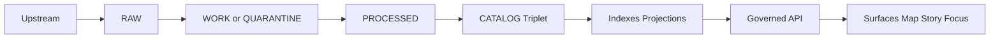
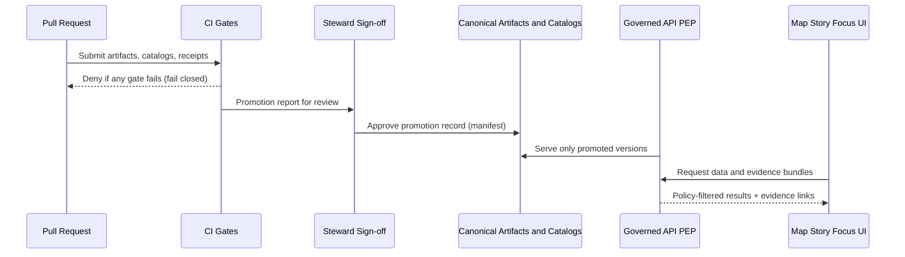

<!-- [KFM_META_BLOCK_V2]
doc_id: kfm://doc/6d7b8f58-6f8a-4d3c-a8b8-9b7c5d2d6e2a
title: Data Promotion Gates
type: standard
version: v1
status: draft
owners: TBD
created: 2026-03-01
updated: 2026-03-01
policy_label: public
related:
  - TBD
tags: [kfm, architecture, enforcement, promotion, governance, truth-path]
notes:
  - Codifies the Promotion Contract gates as CI- and runtime-enforceable checks.
  - This doc is “how it must behave” (normative); exact tool choices are implementation details.
[/KFM_META_BLOCK_V2] -->

# Data Promotion Gates
**Fail-closed promotion from RAW → WORK/QUARANTINE → PROCESSED → CATALOG → PUBLISHED** using automated gates that emit evidence (receipts, catalogs, provenance) and prevent policy/rights bypass.

[](#)
[](#)
[](#)
[](#)

---

## Quick navigation
- [Purpose](#purpose)
- [Where this fits in the repo](#where-this-fits-in-the-repo)
- [Truth path zones](#truth-path-zones)
- [Promotion Contract gates](#promotion-contract-gates)
- [Enforcement points](#enforcement-points)
- [Failure modes](#failure-modes)
- [Definition of Done](#definition-of-done)
- [Minimum verification steps](#minimum-verification-steps)
- [Appendix](#appendix)

---

## Purpose
This document defines **what must be true** before any dataset version can be **promoted** into runtime surfaces.

Promotion gates exist to ensure:

- **Reproducibility:** every served artifact is traceable to immutable inputs and deterministic transforms.
- **Governance enforcement:** licensing/rights and sensitivity controls are enforced *before* publication.
- **Evidence-first UX:** published layers and claims are backed by resolvable evidence bundles.
- **Trust membrane integrity:** clients never bypass policy by directly touching storage/DB.

> **WARNING**  
> “Promotion” is not a copy/move operation. It is a **governed decision** recorded with artifacts (catalog triplet + receipts + policy label) and enforced by CI + runtime.

---

## Where this fits in the repo
**Path:** `docs/architecture/enforcement/data-promotion-gates.md`

### Relationship to the system
- Sits under `docs/architecture/enforcement/` because this is about **hard enforcement** (CI + runtime), not just guidance.
- Complements (but does not replace) dataset-specific onboarding specs and QA rules.

### Acceptable inputs (what belongs here)
- Normative gate definitions and invariants
- Tables/checklists for required artifacts per gate
- Cross-cutting enforcement patterns: CI, policy tests, contract tests, runtime “serve only promoted versions”
- Minimal, implementation-agnostic pseudocode for gate evaluation (optional)

### Exclusions (what must NOT go here)
- Dataset-specific QA thresholds (those belong in each dataset’s spec)
- Credentials, tokens, secrets, internal endpoints
- “How to run the pipeline” step-by-step operational runbooks (link those instead)
- One-off exceptions (“temporary allow”) without a referenced governance decision record

---

## Truth path zones



### Zone intent (summary)
- **RAW:** immutable acquisition snapshot (append-only).
- **WORK/QUARANTINE:** transforms + QA + redaction candidates; quarantine blocks promotion.
- **PROCESSED:** publishable artifacts in approved formats with checksums.
- **CATALOG/TRIPLET:** cross-linked DCAT + STAC + PROV (+ run receipts) as the canonical “contract surface”.
- **PUBLISHED:** governed runtime surfaces may only serve promoted dataset versions.

> **NOTE**  
> “Indexes/DB/search/tiles” are treated as rebuildable projections. The canonical truth is artifacts + catalogs + provenance.

---

## Promotion Contract gates

### Gate philosophy
- **Fail closed:** if a required artifact is missing, invalid, unlinked, or policy-denied → **do not publish**.
- **Automatable:** every gate must be expressible as deterministic CI checks and reproducible validators.
- **Composable:** dataset-specific checks extend the baseline contract; they do not replace it.

### Gate matrix (baseline)
| Gate | What must be present (minimum) | Typical validator(s) | Output evidence | If it fails |
|---|---|---|---|---|
| A — Identity & versioning | Stable `dataset_id`; immutable `dataset_version_id` derived from `spec_hash` / stable spec | Schema + deterministic hash tests | Version manifest, stable IDs | Block promotion; require spec fix |
| B — Licensing & rights | Explicit license/rights + attribution; snapshot of upstream terms | License presence/allowlist checks | Rights snapshot artifact | **Quarantine** if unclear |
| C — Sensitivity & redaction plan | `policy_label` assigned; obligations defined; redaction/generalization recorded in lineage | Policy fixtures + obligation checks | Redaction plan + lineage links | Default-deny or require generalized derivative |
| D — Catalog triplet validation | DCAT + STAC + PROV exist, validate, and cross-link | Validators + link checks | Validated triplet + link map | Block; EvidenceRefs must not guess |
| E — Run receipt & checksums | `run_receipt` exists; inputs/outputs enumerated with checksums; environment recorded | Receipt schema validation + checksum verification | Receipt per run + digests | Block; cannot claim reproducibility |
| F — Policy tests & contract tests | OPA policy tests pass; evidence resolver can resolve at least one EvidenceRef in CI; API/schema contracts validate | Policy unit tests + contract tests | CI gate report | Block merge and promotion |
| G — Optional but recommended (production posture) | SBOM + build provenance; performance smoke checks; accessibility smoke checks | Supply-chain tooling + smoke tests | Attestations + perf/a11y reports | May block in prod, warn in dev |

> **TIP**  
> Treat Gate G as “**prod required** / **dev optional**” via environment policy. Keep the *schema* consistent; tune strictness through policy.

### Operational “must match” constraint: triplet ↔ evidence resolution
Promotion must ensure the **catalog triplet** cross-links identifiers such that **EvidenceRefs resolve** deterministically. If EvidenceRefs require guesswork, the system is not evidence-first.

---

## Enforcement points

Promotion gates are not “a checklist someone reads.” They are enforced at multiple Policy Enforcement Points (PEPs):



### 1) CI enforcement (merge-blocking)
**CI is the first hard line.** It must:
- validate schemas and profiles (registry/spec, triplet, receipts)
- run policy tests (fixtures-driven)
- run cross-link checks (DCAT ↔ STAC ↔ PROV)
- run at least one evidence resolution check in CI (no “citation by URL”)

### 2) Promotion workflow enforcement (release/publish step)
Promotion action must:
- record “what was promoted” as a manifest (who/what/why, digests, policy decisions)
- update “published pointers” only to versions that passed all gates
- write an append-only audit record of the action

### 3) Runtime enforcement (serve-path)
Runtime must:
- **only serve promoted dataset versions**
- apply `policy_label` filtering and redaction obligations
- log governed runs (including Focus Mode and Story publishing) with receipts

### 4) UI enforcement (trust surface, not policy engine)
UI must:
- surface policy badges + license + version + evidence drawer
- never compute allow/deny decisions (the UI can only display decisions)

---

## Failure modes

### Quarantine triggers
Quarantine is not a punishment; it is a safety valve.

Common quarantine triggers:
- license unclear or missing
- sensitive-location risk without a redaction/generalization plan
- failed schema/QA thresholds
- upstream instability that prevents reproducible acquisition

### Required behaviors on failure
- Fail closed with actionable error messages (which gate, which artifact, what to fix)
- No partial publish (no “ship without provenance”)
- No leakage in logs/receipts (receipts must be policy-classified too)

---

## Definition of Done

### Dataset integration ticket is DONE only when
- Registry/spec updated (owner, license, `policy_label`, cadence/contact)
- RAW acquisition immutable with manifest + checksums
- Processed artifacts present with digests and predictable paths
- DCAT + STAC + PROV validate and cross-link; link checks succeed
- Policy decisions recorded; default-deny tests pass; generalized derivatives created if needed
- Evidence resolver resolves representative EvidenceRefs into EvidenceBundles
- UI smoke tests: evidence drawer resolves selections; restricted layers denied or generalized
- Audit: run receipt emitted; audit ledger append; access controls verified

---

## Minimum verification steps

When applying this in *this repo*, do the smallest checks that prevent overreach:

- Capture repo commit hash and root directory tree (so “enforcement” matches reality)
- Confirm which gate tooling exists (validators, policy pack, evidence resolver checks)
- Extract CI gate list from `.github/workflows` and document which checks are merge-blocking
- Choose one MVP dataset and prove it can be promoted end-to-end with receipts + triplet
- Verify UI cannot bypass the Governed API boundary (static analysis + network policy tests)

---

## Appendix

<details>
<summary><strong>PROPOSED: Gate evaluation result shape (for CI reports)</strong></summary>

```json
{
  "dataset_id": "example_dataset",
  "dataset_version_id": "example_dataset@v_abc123",
  "target_zone": "PUBLISHED",
  "allow": false,
  "gates": [
    {"gate": "A", "pass": true, "notes": ["spec_hash stable"]},
    {"gate": "B", "pass": false, "notes": ["license missing"]},
    {"gate": "C", "pass": false, "notes": ["policy_label not assigned"]}
  ],
  "required_actions": [
    "Add explicit license/rights + upstream terms snapshot",
    "Assign policy_label and add redaction plan if needed"
  ]
}
```

</details>

<details>
<summary><strong>PROPOSED: How to tune strictness per environment</strong></summary>

- Dev: Gate G warnings allowed (but recorded)
- Staging: Gate G required for performance smoke tests
- Prod: Gate G required + supply-chain attestations required

Store strictness as policy input, not hard-coded logic.
</details>

---

_Back to top: [Quick navigation](#quick-navigation)_
