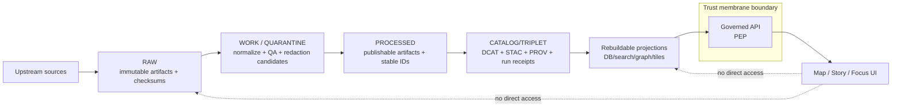
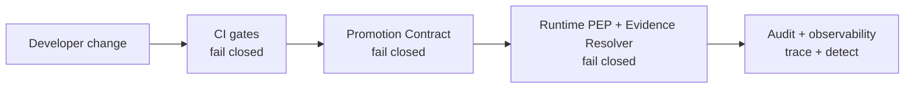

<!-- [KFM_META_BLOCK_V2]
doc_id: kfm://doc/6d98d6e8-8b50-4e5e-9a51-521e1a6e8d7a
title: Architecture Invariants and Enforcement
type: standard
version: v1
status: draft
owners: kfm-maintainers@TODO
created: 2026-03-01
updated: 2026-03-01
policy_label: public
related:
  - docs/architecture/README.md
  - docs/architecture/enforcement/
  - docs/policy/
  - contracts/
tags: [kfm, architecture, enforcement, invariants, governance, trust-membrane, truth-path]
notes:
  - This document is normative: invariants are requirements and MUST be enforced by tests and promotion gates.
  - If this document conflicts with an implementation detail, fix the implementation (or update this doc via ADR).
[/KFM_META_BLOCK_V2] -->

# Architecture Invariants and Enforcement
A single place to define **non-negotiable system invariants** and **how we enforce them** (CI + promotion gates + runtime controls).


<!-- TODO: add repo CI badge + CODEOWNERS badge when paths are confirmed -->

## Quick navigation
- [Why this exists](#why-this-exists)
- [Reference model](#reference-model)
- [Invariant catalog](#invariant-catalog)
- [Enforcement mechanisms](#enforcement-mechanisms)
- [How to change invariants](#how-to-change-invariants)
- [Minimum verification checklist](#minimum-verification-checklist)
- [Appendices](#appendices)

---

## Why this exists
KFM is designed around a set of architectural and governance invariants (the “trust membrane”, “truth path”, and “promotion contract” are the big ones). These are not aspirational slogans.

**An invariant is only real if it is enforced.** In KFM, enforcement means:
- **Fail closed in CI** (merges/promotion blocked if required artifacts/validations are missing)
- **Fail closed at promotion** (no dataset version becomes serveable unless gates pass)
- **Fail closed at runtime** (the API/evidence resolver is the policy boundary; clients cannot bypass it)

> **Normative language**
> - **MUST** = required, not optional
> - **SHOULD** = strongly recommended; deviations require documented rationale
> - **MAY** = optional

[Back to top](#architecture-invariants-and-enforcement)

---

## Reference model
### Truth path and trust membrane (conceptual)


### Layering rule (architecture posture)
```mermaid
flowchart TB
  Domain[Domain models + rules] --> UseCases[Use cases / workflows]
  UseCases --> Interfaces[Interfaces / contracts]
  Interfaces --> Infra[Infrastructure adapters<br/>(storage, DB, search, policy engine)]
```

**Key rule:** domain logic does not talk directly to infrastructure. It talks through interfaces.

[Back to top](#architecture-invariants-and-enforcement)

---

## Invariant catalog
This is the **normative list**. Each invariant includes:
- a **testable rule** (what must always be true),
- an **enforcement strategy** (how we stop regressions),
- a **minimum verification** (the smallest check to convert “we think” into “we know”).

> **Status tags**
> - **CONFIRMED**: defined as non-negotiable in KFM design docs
> - **PROPOSED**: recommended enforcement approach; may evolve

### Catalog table (living)
| ID | Invariant | Status | Testable rule (MUST) | Primary enforcement points |
|---:|---|---|---|---|
| INV-001 | Truth path lifecycle | CONFIRMED | Data moves only through **Upstream → RAW → WORK/QUARANTINE → PROCESSED → CATALOG/TRIPLET → PUBLISHED**. RAW is append-only. | Promotion tooling; zone validators; CI checks |
| INV-002 | Promotion Contract gates | CONFIRMED | Promotion to a served surface is **blocked** unless all minimum gates pass (identity, license, sensitivity, triplet validation, QA, receipts, release manifest). | Promotion CLI; CI; steward sign-off |
| INV-003 | Trust membrane | CONFIRMED | **Clients never access storage/DB directly.** All reads are mediated by the governed API + policy + evidence resolver. | Network controls; code architecture tests; runtime authz |
| INV-004 | Catalog triplet is a contract surface | CONFIRMED posture / PROPOSED profiles | DCAT/STAC/PROV must validate and cross-link; EvidenceRefs resolve without guessing. | Schema validators + linkcheck in CI; promotion gate |
| INV-005 | Evidence-first UX | CONFIRMED concept | Every user-visible layer/claim MUST expose: dataset_version_id, license/rights, policy label, provenance link, artifact digests. | UI e2e tests; API contract tests |
| INV-006 | Cite-or-abstain (Focus + Story) | CONFIRMED | Any answer/story claim that requires evidence MUST cite EvidenceRefs that resolve; **citation verification is a hard gate**; otherwise abstain or reduce scope. | Focus evaluation harness; story publish gate; CI citation lint |
| INV-007 | Canonical vs rebuildable stores | CONFIRMED | Canonical truth lives in object storage + catalogs + provenance/audit. DB/search/graph/tiles are rebuildable projections. | Infra design reviews; projection rebuild tests |
| INV-008 | Deterministic identity/hashing | CONFIRMED | dataset_id + dataset_version_id + spec_hash are deterministic; content digests are recorded; drift is detectable. | Golden hash tests; receipt validators |
| INV-009 | Policy semantics match in CI and runtime | CONFIRMED requirement | The same allow/deny + obligations outcomes MUST hold in CI and runtime; otherwise CI guarantees are meaningless. | Policy fixture tests; runtime contract tests |
| INV-010 | Default-deny for restricted/sensitive | PROPOSED defaults aligned to posture | Restricted/sensitive datasets default to deny; public outputs require separate public_generalized derivatives; no restricted metadata leaks in errors. | Policy tests; redaction tests; response-shape tests |
| INV-011 | Licensing is enforceable, not paperwork | CONFIRMED direction | Promotion requires license/rights metadata; “metadata-only reference” is allowed; exports must include attribution; story publish blocks if rights unclear. | CI metadata checks; publish gates |
| INV-012 | Auditability: receipts + append-only logs | CONFIRMED direction | Every promotion and Focus run emits a receipt with hashes + policy decisions; audit log is append-only and access controlled. | Receipt schema validation; audit storage controls |
| INV-013 | No overreach about repo reality | CONFIRMED posture | Do not claim a module exists unless verified; keep “unknown → verified” steps explicit. | Review checklist; CI doc lint (optional) |

[Back to top](#architecture-invariants-and-enforcement)

---

## Enforcement mechanisms
This section is about *how* we make the invariants real.

### Enforcement map


### 1) CI enforcement
**Principle:** if a change could break trust, it MUST be test-detectable and MUST block merges.

Minimum CI categories (required over time):
- **Unit tests:** domain logic, deterministic hashing/spec_hash canonicalization, controlled vocab validation
- **Schema tests:** DCAT/STAC/PROV profile validation and registry schema validation
- **Policy tests:** fixture-driven allow/deny/obligation tests (default deny is explicit)
- **Contract tests:** OpenAPI/DTO validation, backward compatible change checks
- **Integration tests:** evidence resolver resolves sample refs end-to-end
- **E2E UI tests:** evidence drawer shows license + version; story citations resolve; Focus verification gate holds

> PROPOSED: Make “policy + schema + linkcheck + hash golden tests” required status checks on the default branch.

### 2) Promotion enforcement
Promotion is the **boundary where artifacts become serveable**. The Promotion Contract is the mechanism that turns governance intent into enforceable behavior.

**Minimum gates (summary):**
- **Gate A — Identity & versioning:** dataset_id + dataset_version_id + deterministic spec_hash; artifact digests
- **Gate B — Licensing & rights:** license/rights metadata + upstream terms snapshot
- **Gate C — Sensitivity & redaction:** policy_label + obligations + evidence of applied redactions/generalizations
- **Gate D — Catalog triplet validation:** DCAT/STAC/PROV validate and cross-link; EvidenceRefs resolve
- **Gate E — QA thresholds:** dataset-specific checks documented and met; failures quarantined
- **Gate F — Run receipt & audit:** receipt captures inputs/tools/hashes/policy decisions; audit ledger append-only
- **Gate G — Release manifest:** promotion recorded and reproducible

**Operational rule:** if any gate output is missing, promotion MUST stop.

### 3) Runtime enforcement (Trust membrane)
Runtime enforcement is centered on a **Policy Enforcement Point (PEP)** and an **Evidence Resolver**.

Required properties:
- **Policy is evaluated before serving data** (not after)
- **Redaction/generalization obligations are applied before returning responses**
- **EvidenceRefs are the only supported citation primitive** (not ad-hoc URLs)
- **Audit references exist for every privileged decision** (allow/deny, promotion, Focus answers)

> PROPOSED infra controls:
> - If deployed on Kubernetes: namespace-scoped NetworkPolicies and/or cluster-wide default-deny where safe.
> - If not on Kubernetes: equivalent firewall/service-mesh controls so UI cannot reach stores directly.

### 4) Security and sensitive-location protection
KFM treats security as part of governance.
- Precise geometries belong in restricted datasets.
- Public outputs (if allowed) are separate generalized dataset versions.
- Tiles and exports MUST enforce policy (no “static hosting bypass”).

### 5) Observability and auditing
Audit and observability are not “nice to have”—they are part of the trust surface.
- Receipts and logs are append-only.
- Logs must be redacted for PII/restricted info and access-controlled.

[Back to top](#architecture-invariants-and-enforcement)

---

## How to change invariants
Invariants are a governance boundary. Changes require a reversible, auditable process.

### Change protocol (required)
1. **Propose** the change in an ADR (or equivalent governed decision record).
2. **Update this catalog**: add/modify the invariant row (ID never reused).
3. **Add/modify enforcement tests** so violations fail closed.
4. **Run the minimum verification steps** and attach artifacts (logs, receipts, validator output).
5. **Merge only when gates are green** and stewardship review (if required) is recorded.

### Non-negotiable rule
If the enforcement cannot be expressed as a test or gate, it is not an invariant yet.

[Back to top](#architecture-invariants-and-enforcement)

---

## Minimum verification checklist
Use this list to convert Unknown → Verified and to avoid “documentation hallucination”.

- [ ] Capture repo commit hash + root directory tree (e.g., `git rev-parse HEAD`, `tree -L 3`)
- [ ] Confirm which work packages already exist (search for spec_hash, policy pack, validators, evidence resolver route, dataset registry schema)
- [ ] Extract CI gate list from `.github/workflows` and document which checks block merges
- [ ] Choose one MVP dataset and promote it through all gates with receipts + catalogs
- [ ] Validate UI cannot bypass the PEP (static analysis + network controls)
- [ ] For Focus Mode: run the evaluation harness and store golden query outputs + diffs as artifacts

[Back to top](#architecture-invariants-and-enforcement)

---

## Appendices
### Appendix A — Invariant template (copy/paste)
Use this when proposing a new invariant.

```yaml
id: INV-XXX
name: "<short name>"
status: PROPOSED | CONFIRMED
owner: "<team or CODEOWNERS group>"
severity: critical | high | medium | low
rule_must: >
  Describe the non-negotiable rule as a MUST statement.
enforcement:
  ci:
    - "<test name / workflow>"
  promotion:
    - "<gate name / validator>"
  runtime:
    - "<PEP/Policy check>"
minimum_verification:
  - "<smallest command / test that proves this is enforced>"
evidence:
  - "<doc link / ADR id / spec id>"
change_history:
  - date: YYYY-MM-DD
    change: "<what changed and why>"
```

### Appendix B — Enforcement DoD (Definition of Done)
A new invariant (or change) is “done” only when:
- [ ] It is listed in the catalog table (with stable ID)
- [ ] At least one automated check fails closed when violated
- [ ] The check is wired into CI and/or promotion gates
- [ ] A maintainer can reproduce verification from recorded artifacts (logs/receipts)
- [ ] Any policy-impacting change has fixtures/tests for allow/deny + obligations

### Appendix C — Source documents (internal)
- “KFM — Definitive Design & Governance Guide (vNext)” (2026-02-20)
- “KFM — Architecture, Governance, and Delivery Plan / Tooling the KFM pipeline” (vNext)
- “KFM Source Snapshots Bundle” (vNext tables)

[Back to top](#architecture-invariants-and-enforcement)
