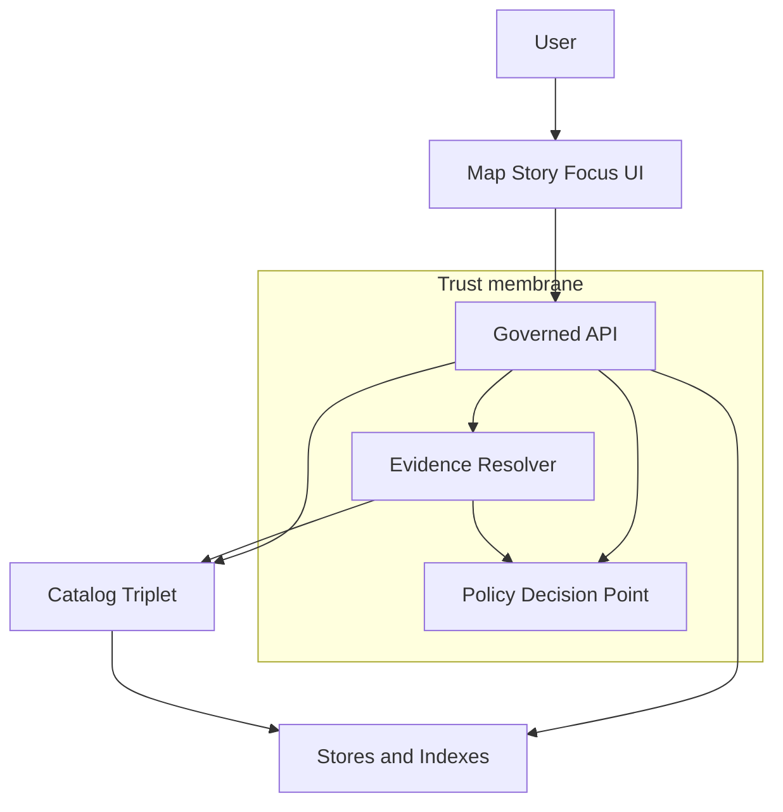

<!-- [KFM_META_BLOCK_V2]
doc_id: kfm://doc/4f7c6d4c-4c2c-4d16-9d9d-2e2f5f2edbb3
title: Policy Enforcement Points
type: standard
version: v1
status: draft
owners: TBD
created: 2026-03-01
updated: 2026-03-01
policy_label: public
related:
  - kfm://doc/trust-membrane
  - kfm://doc/promotion-contract
  - kfm://doc/evidence-resolution
tags: [kfm, architecture, enforcement, policy, pep]
notes:
  - Derived from vNext governance and tooling briefs; verify repo wiring before treating as implemented.
[/KFM_META_BLOCK_V2] -->

# Policy Enforcement Points

One place to look to answer: **Where is policy enforced, and what exactly happens when policy says no?**


<!-- TODO: replace badges with repo-local equivalents if you standardize them -->

## Navigation

- [Overview](#overview)
- [Where this document fits](#where-this-document-fits)
- [Core concepts](#core-concepts)
- [Reference architecture](#reference-architecture)
- [PEP registry](#pep-registry)
- [Decision and obligation contract](#decision-and-obligation-contract)
- [Enforcement by surface](#enforcement-by-surface)
- [Audit and policy safe errors](#audit-and-policy-safe-errors)
- [Test and verification checklist](#test-and-verification-checklist)
- [Appendix](#appendix)

---

## Overview

KFM is designed around a **trust membrane**: clients and UIs do not access databases, object storage, or indexes directly. Instead, *every* read/write that can expose data is mediated by a governed interface that enforces policy decisions.

This document defines **policy enforcement points** (PEPs): the specific locations in the system where a policy decision is enforced (allow, deny, or allow-with-obligations) and turned into observable behavior (filtered results, generalized geometry, blocked publication, etc.).

### Non negotiables

- **Fail closed**: if policy cannot be evaluated (PDP down, inputs missing, unknown label), the PEP denies.
- **Shared semantics**: CI policy checks and runtime policy checks must agree, or CI guarantees are meaningless.
- **UI is not a policy engine**: the UI may display policy badges/notices and must render obligations, but it must not be the only layer enforcing access control.
- **No policy bypass**: no direct storage access from browser apps; no “debug endpoints” that leak restricted metadata.

---

## Where this document fits

- **Path**: `docs/architecture/enforcement/policy-enforcement-points.md`
- **Role in repo**: architecture guardrail. This is the map of all “chokepoints” where governance is enforced.
- **Audience**: backend engineers, data/pipeline engineers, security reviewers, stewards.

### Acceptable inputs

- Diagrams, tables, and checklists that describe enforcement locations and behaviors.
- References to policy labels, obligations, and runtime/CI controls.
- Implementation notes that are explicit about whether they are **CONFIRMED**, **PROPOSED**, or **UNKNOWN** in the live repo.

### Exclusions

- Full policy rule sets (those live under `policy/`).
- Service-level configuration for a specific deployment (those live under `infra/` / `configs/`).
- Dataset-specific sensitivity rules (those live in dataset specs and/or policy data inputs).

---

## Core concepts

### Policy Decision Point

The **Policy Decision Point** is the engine that evaluates a policy request and returns:

- decision: allow or deny
- obligations: required transformations, notices, attribution rules, review requirements
- decision identifiers: stable references for auditability

Implementation note: KFM design docs assume an OPA/Rego-based PDP pattern, but the architecture only requires that policy is versioned, testable, and consistent across CI and runtime.

### Policy enforcement point

A **Policy Enforcement Point** is any component that:

1. constructs the policy input context (user, action, resource, purpose),
2. calls the PDP,
3. *enforces the outcome* (including obligations),
4. records enough information to audit the decision without leaking restricted metadata.

### Obligations

Obligations are **not optional**. They are the mechanism that turns “allow with constraints” into safe output.
Examples:

- generalize geometry (cell size, rounding)
- remove attributes (field allowlist/denylist)
- attach attribution and license text to downloads/exports
- show UI notices (generalized, rights-limited, etc.)
- require steward review before publishing

---

## Reference architecture



Notes:

- The UI only talks to the governed API (and evidence resolver endpoints exposed through it).
- The governed API and evidence resolver are the main runtime PEPs.
- CI and promotion gates are the main build-time and publish-time PEPs.

---

## PEP registry

This registry is the checklist for “did we add an enforcement point for the new feature?”

| PEP ID | Surface | What it protects | When it runs | Decision outcome enforced |
|---|---|---|---|---|
| PEP-CI-001 | CI | Repo contributions | PR and merge | Block merge on policy deny |
| PEP-PROMOTE-001 | Promotion | Movement into runtime surfaces | Promotion event | Block promotion unless gates pass |
| PEP-API-READ-001 | Runtime API | Dataset discovery, query, tiles, exports | Every request | Filter, deny, or shape output |
| PEP-EVIDENCE-001 | Evidence resolver | EvidenceRefs and EvidenceBundles | Resolve and render | Fail closed if unresolvable or unauthorized |
| PEP-STORY-001 | Story publishing | Story Nodes and cited evidence | Publish | Block publish unless citations resolve and are allowed |
| PEP-FOCUS-001 | Focus Mode | Governed Q and A | Ask | Policy precheck, citation verifier, receipt output |
| PEP-NET-001 | Network boundary | Direct access to stores | Always | Prevent bypass even if app misconfigured |

Legend:

- **CONFIRMED**: CI, runtime API checks, evidence resolver checks, story citation gates, Focus Mode cite-or-abstain loop.
- **PROPOSED**: explicit network PEP as a named enforcement point; implement as Kubernetes NetworkPolicies and storage IAM.

---

## Decision and obligation contract

Every PEP should use the same contract to avoid “special cases” that become policy bypasses.

### Minimum policy input

```json
{
  "user": {
    "principal": "user:abc",
    "role": "public",
    "groups": []
  },
  "action": "read",
  "resource": {
    "kind": "dataset_version",
    "id": "kfm://dataset/noaa_ncei_storm_events@2026-02.abcd1234",
    "policy_label": "public"
  },
  "context": {
    "purpose": "map_view",
    "client": "ui",
    "request_id": "req-123"
  }
}
```

### Minimum policy output

```json
{
  "decision_id": "kfm://policy_decision/xyz",
  "decision": "allow",
  "policy_label": "public",
  "reason_codes": [],
  "obligations": [],
  "evaluated_at": "2026-03-01T00:00:00Z",
  "policy_bundle_digest": "sha256:..."
}
```

### Enforcement rules

- **deny**: return policy-safe errors and do not leak restricted existence via different error shapes.
- **allow**: return full output.
- **allow with obligations**: apply transformations before returning output, and record which obligations were applied.

---

## Enforcement by surface

### CI and pull request enforcement

**Goal**: prevent non-compliant artifacts from being merged.

Minimum expected gates:

- schema validation for registry entries, contracts, receipts
- policy tests using fixtures, deny by default
- link checking for catalog triplet consistency
- “kill switch” capability for emergency freeze

Implementation guidance:

- Enforce policy in CI using fixture-driven tests so you can prove policy outcomes are stable.
- Treat CI policy violations as governance signals, not developer annoyance. Make the denial messages readable.

### Promotion and publication enforcement

**Goal**: nothing becomes user-visible until it meets the Promotion Contract.

Promotion is an explicit PEP because it is the boundary between pipeline artifacts and runtime surfaces.

Minimum gates you should expect to enforce:

- identity and deterministic versioning
- license and rights metadata
- sensitivity classification and redaction plan
- catalog triplet validation and cross-links
- QA thresholds
- run receipt and audit record
- promotion manifest referencing digests

### Runtime governed API

**Goal**: policy is enforced on every request that returns data.

Typical runtime enforcement patterns:

- dataset discovery: hide restricted by default; filter by role
- dataset query: enforce bbox/time/filters, apply obligations, and generalize or redact where required
- tile delivery: only policy-safe tiles; cache keys include policy and auth context
- exports/downloads: always include attribution and license text; deny if rights unclear

### Evidence resolver

**Goal**: treat citations as resolvable evidence, not pasted URLs.

Rules:

- if an EvidenceRef cannot be resolved deterministically, fail closed
- if policy denies, return a policy-safe denial
- always return digests and provenance pointers for allowed bundles
- record obligations applied to the evidence bundle

### Story publishing

**Goal**: publishing is a governed event.

Rules:

- a Story Node cannot be published unless citations resolve through the evidence resolver
- review state must be captured as part of publishing
- disallow precise coordinates in narratives unless policy explicitly allows

### Focus Mode

**Goal**: no unsupported claims and no restricted leakage.

The Focus Mode control loop is a PEP chain:

1. policy precheck
2. retrieval scoped to allowed corpora
3. evidence bundling via the evidence resolver
4. synthesis
5. hard citation verification gate
6. audit receipt

If citations cannot be verified, Focus Mode must narrow scope or abstain.

### Network boundary and bypass prevention

**PROPOSED but recommended**: name and test the network-level PEP.

- enforce that frontend pods cannot reach object storage endpoints directly
- enforce that only the governed API service account can reach databases and index services
- ensure “debug ports” are not reachable from outside the cluster
- include automated tests or policy checks that validate this posture

---

## Audit and policy safe errors

### Audit requirements

Every PEP must emit an audit record sufficient to answer:

- who requested what action, when
- which policy bundle version decided
- what obligations were applied
- which dataset versions, artifacts, and digests were involved
- whether the decision was deny, allow, or allow-with-obligations

### Policy safe errors

Policy denials must avoid turning the system into an oracle.

Rules:

- do not reveal restricted dataset existence via 404 vs 403 differences
- do not include restricted titles, extents, or identifiers in denial bodies
- prefer stable reason codes for internal logs and steward tools, not public error detail

---

## Test and verification checklist

Use this checklist before promoting a feature that adds a new surface or endpoint.

### CI

- [ ] Policy tests are fixture-driven and required for merge.
- [ ] Deny by default is enforced for new labels and new actions.
- [ ] Link checker blocks broken EvidenceRefs and catalog links.

### Runtime

- [ ] All data endpoints call the PDP before touching stores or indexes.
- [ ] Evidence resolver is the only way to resolve EvidenceRefs.
- [ ] Focus Mode includes citation verification and fails closed.
- [ ] Exports include license and attribution text automatically.

### Bypass resistance

- [ ] Browser apps cannot access stores directly.
- [ ] Network rules block direct DB and object storage access from UI tiers.
- [ ] Error behavior is policy-safe and consistent.

---

## Appendix

### Minimal Rego policy pattern

This is illustrative only. The policy pack in `policy/` is authoritative.

```rego
package kfm.authz

default allow = false

allow {
  input.user.role == "steward"
}

allow {
  input.user.role == "public"
  input.action == "read"
  input.resource.policy_label == "public"
}

obligations[o] {
  input.resource.policy_label == "public_generalized"
  o := {"type": "show_notice", "message": "Geometry generalized due to policy."}
}
```

### Definition of done for adding a new PEP

- [ ] PEP is listed in the registry table above.
- [ ] PEP has unit tests for allow, deny, and obligations applied.
- [ ] PEP emits an audit event with policy bundle digest and decision id.
- [ ] End-to-end test proves the UI cannot bypass it.
