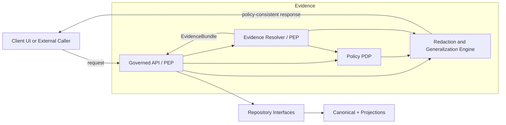

<!-- [KFM_META_BLOCK_V2]
doc_id: kfm://doc/9b3f0d2e-cc36-4d0e-8a8d-7d6c5c4d2e8b
title: Redaction and generalization tests
type: standard
version: v1
status: draft
owners: KFM Platform + Governance
created: 2026-03-01
updated: 2026-03-01
policy_label: public
related:
  - docs/architecture/enforcement/README.md
  - docs/architecture/enforcement/policy-enforcement-points.md
  - docs/architecture/enforcement/policy-decision-contract.md
  - policy/ (policy-as-code bundle; not confirmed in repo)
  - tests/ (test suites + fixtures; not confirmed in repo)
tags: [kfm, governance, enforcement, testing, redaction, generalization]
notes:
  - This doc defines REQUIRED tests that prevent sensitive leakage across API, tiles, evidence bundles, stories, and Focus Mode.
  - Paths and commands are written as “expected targets”; verify in the live repo before wiring CI.
[/KFM_META_BLOCK_V2] -->

# Redaction and Generalization Tests
**Purpose:** Define the *fail-closed* test suite that proves KFM does **not** leak restricted metadata (especially coordinates/PII) and that all allowed outputs are **policy-consistent** via redaction/generalization obligations.


**Status:** draft • **Owners:** KFM Platform + Governance • **Last updated:** 2026-03-01

---

## Quick navigation
- [Goals](#goals)
- [Threat model](#threat-model)
- [Definitions](#definitions)
- [Architecture view](#architecture-view)
- [Policy decision and obligations contract](#policy-decision-and-obligations-contract)
- [Test categories](#test-categories)
- [Test matrix](#test-matrix)
- [Fixtures and synthetic test data](#fixtures-and-synthetic-test-data)
- [CI wiring](#ci-wiring)
- [Definition of Done](#definition-of-done)
- [Appendix](#appendix)

---

## Goals
### What this test suite MUST guarantee
1. **No policy bypass:** all user-facing surfaces (API, tiles, Focus Mode, Story publishing, evidence resolver) enforce *the same* allow/deny + obligations semantics.
2. **No sensitive leakage:** forbidden coordinates, bounding boxes, restricted dataset identifiers, PII fields, or “helpful” error details do not appear in:
   - API payloads
   - tile endpoints + tile metadata
   - evidence bundles
   - Story Node sidecars
   - Focus Mode outputs
   - logs and run receipts
3. **Generalization is deterministic + recorded:** when policy allows only generalized public representations, the transformation is reproducible and treated as a first-class governance action (recorded in provenance/receipts).

### Non-goals
- This file does **not** define the full policy model. It defines what we must be able to *prove by tests*.
- This file does **not** pick the final generalization algorithms (grid size, admin boundaries, k-anonymity thresholds). Those are policy inputs; tests enforce whatever the policy declares.

[Back to top](#redaction-and-generalization-tests)

---

## Threat model
### Primary leakage paths we test against
- **Direct response leakage:** geometry/bbox, `lat/lon`, or “exact_location” fields returned to public users.
- **Tile metadata leakage:** public tile servers leak restricted extents via `bbox`, `bounds`, or implicit layer metadata.
- **Error-message leakage:** 403/404 includes dataset slug, policy_label, or “you tried to access restricted_sensitive_location…”.
- **Index leakage:** search snippets or cached results contain restricted coordinates or document fragments not allowed for this user.
- **Receipt/log leakage:** audit artifacts store PII or sensitive locations in plaintext when receipts are later exposed or shared.
- **Cross-surface mismatch:** CI says “safe” but runtime differs (or vice versa), invalidating governance guarantees.

---

## Definitions
- **Redaction:** remove or mask information. Examples:
  - drop fields entirely (`owner_name`, `exact_location`)
  - replace with `null`
  - replace with a token like `"[REDACTED]"` (avoid if it leaks field presence)
- **Generalization:** reduce precision while preserving utility. Examples:
  - snap-to-grid / coarsen geometry
  - aggregate records to safe geographies (county/tract) with minimum counts
  - time-bucket events (day → month; timestamp → year)
- **Policy label:** dataset/version classification that drives allow/deny and required obligations.
- **Obligation:** machine-readable instruction returned by policy that the PEP must apply before any response is released.
- **PDP:** Policy Decision Point (e.g., OPA) producing allow/deny + obligations.
- **PEP:** Policy Enforcement Point(s) that apply PDP outputs in CI and runtime.

---

## Architecture view
KFM’s trust membrane means clients never access storage/DB directly; enforcement must happen before serving any data or evidence. This diagram highlights the enforcement seams our tests must cover.



**Test implication:** every path from “caller” → “response” must be proven to apply obligations (or deny) with no side channels.

[Back to top](#redaction-and-generalization-tests)

---

## Policy decision and obligations contract
### Minimal decision shape (test fixture contract)
A policy evaluation MUST return:
- decision (`allow`/`deny`)
- policy_label
- decision_id + rule_id (for audit)
- reason codes (for policy-safe UX / review)
- obligations (typed list; deterministic parameters)

Example (illustrative):
```json
{
  "decision_id": "kfm://policy_decision/xyz",
  "policy_label": "restricted_sensitive_location",
  "decision": "deny",
  "reason_codes": ["SENSITIVE_SITE", "RIGHTS_UNCLEAR"],
  "obligations": [
    {"type": "generalize_geometry", "min_cell_size_m": 5000},
    {"type": "remove_attributes", "fields": ["exact_location", "owner_name"]}
  ],
  "evaluated_at": "2026-02-20T12:00:00Z",
  "rule_id": "deny.restricted_dataset.default"
}
```

### Obligation types we MUST be able to test (starter list)
This is a minimal set of obligation types implied by KFM guidance (expand as policy evolves):

| Obligation type | Applies to | Parameters | Enforcement expectation |
|---|---|---|---|
| `remove_attributes` | feature payloads, evidence cards, exports | `fields[]` | fields absent everywhere (including nested objects) |
| `generalize_geometry` | GeoJSON/STAC items, tiles, map_state bbox | `min_cell_size_m` | output geometry/bbox is coarsened; original precision not recoverable |
| `min_count_threshold` | aggregated tables | `k` | deny or suppress buckets with count < k |
| `show_notice` | UI-facing bundles | `message` | surfaced as an obligation card/notice (does not change data) |
| `deny_export` | exports/downloads | none | block export endpoints even if browse is allowed |

> NOTE: If a new obligation type is added, it MUST ship with:
> - unit tests for the obligation interpreter
> - integration tests for at least one runtime surface
> - regression test proving “no leakage” for the new case

---

## Test categories
### 1) PDP policy fixture tests (allow/deny + obligations)
**Goal:** prove policy rules behave as intended, including default-deny, and that obligations are emitted correctly.

**Expected structure (verify in repo):**
- `policy/rego/` — rego modules
- `policy/fixtures/` — JSON inputs (user context, resource metadata)
- `policy/tests/` — rego tests

**Must-have tests**
- public can read `public`
- public cannot read `restricted` / `restricted_sensitive_location`
- `public_generalized` produces `show_notice` obligation
- deny-by-default holds when no rule matches
- decisions are stable across refactors (golden fixtures)

### 2) PEP obligation interpreter unit tests (pure function)
**Goal:** given `(payload, obligations)` return `sanitized_payload`.

**Must-have assertions**
- removed fields truly absent (not null, not empty string, not nested)
- generalized geometry changes precision and removes original geometry
- text fields cannot “smuggle” coordinates (e.g., `"coords: -95.123, 39.456"`)
- stable deterministic output (same input → same output)

### 3) API contract-level tests (schema + no-leak)
**Goal:** prove API output DTOs never violate policy.

**Key cases**
- deny responses are generic and policy-safe
- allow responses contain only policy-consistent extents (bbox/geometry)
- “discovery” endpoints do not reveal restricted dataset lists to public users

### 4) Evidence resolver integration tests
**Goal:** resolving an EvidenceRef produces an EvidenceBundle that is policy-allowed and obligation-sanitized.

**Must-have assertions**
- evidence bundle includes policy decision info
- restricted artifacts are not linked to public users
- STAC items inside bundles have policy-consistent geometry/bbox

### 5) Tiles + exports leakage tests
**Goal:** public tiles and exports are safe.

**Must-have assertions**
- **“no restricted bbox leakage”**: public tile metadata never reveals restricted bbox
- **“no coordinate fields”**: exports for restricted-sensitive datasets never include coordinate-bearing fields
- cache keys do not include sensitive request parameters
- static hosting cannot bypass policy checks

### 6) Focus Mode evaluation harness tests (golden queries)
**Goal:** prove Focus Mode refuses restricted requests and never leaks restricted coordinates or metadata.

**Must-have assertions**
- restricted questions → policy-safe refusal
- every citation resolves and is allowed
- “sensitivity leakage” suite passes: no restricted coords, no restricted dataset list, no restricted evidence cards
- regression tests: golden queries across dataset versions

[Back to top](#redaction-and-generalization-tests)

---

## Test matrix
This matrix is intentionally “surface-first”: we test the same policy scenario across every place the system can leak.

| Surface | Scenario | User role | policy_label | Expected | Key assertions |
|---|---|---:|---|---|---|
| API | dataset discovery | public | restricted exists | deny-by-omission | restricted dataset not listed; no hint in counts |
| API | read features | public | public | allow | no obligations; full geometry OK |
| API | read features | public | restricted | deny | generic error; no dataset slug/label in response |
| STAC | get item | public | public_generalized | allow + obligations | geometry/bbox generalized; show_notice present |
| Tiles | tilejson/metadata | public | restricted_sensitive_location | deny or generalized-only | no bbox leakage; no backdoor via metadata |
| Evidence | resolve ref | public | restricted | deny | bundle not returned; no artifact hrefs |
| Stories | publish gate | contributor | mixed citations | block if any restricted | all citations resolve and are policy-allowed |
| Focus Mode | query asks “list restricted datasets” | public | n/a | refuse | refusal correctness; audit_ref present; no hints |
| Receipts/logs | view receipt (public) | public | restricted run exists | redact | no PII/coords; structural data only |

---

## Fixtures and synthetic test data
### Fixture rules (MUST)
- **No real sensitive locations.** Use synthetic points and fabricated identifiers.
- Include “trap strings” that look like coordinates in text to test exfiltration (e.g., `"-95.12345, 39.54321"`).
- Include geometry in multiple encodings:
  - GeoJSON `geometry`
  - bbox arrays
  - nested coordinates in properties
- Version fixtures alongside policy labels (so changes are intentional and reviewable).

### Recommended fixture set (starter)
- `fixtures/users/public.json`
- `fixtures/users/steward.json`
- `fixtures/resources/dataset_public.json`
- `fixtures/resources/dataset_public_generalized.json`
- `fixtures/resources/dataset_restricted_sensitive_location.json`
- `fixtures/payloads/feature_sensitive_point.geojson`
- `fixtures/payloads/stac_item_sensitive.json`
- `fixtures/payloads/evidence_bundle_sensitive.json`

---

## CI wiring
> WARNING: commands below are placeholders until verified against repo tooling.

**Required CI gates (fail closed):**
- Policy tests: `opa test ...` (or equivalent)
- Unit tests: redaction/generalization engine
- Contract tests: OpenAPI/DTO schema validation
- Integration tests: evidence resolver and at least one STAC/API route
- Focus Mode golden tests: “sensitivity leakage” + “refusal correctness”

**Branch protection expectation**
- Any failure blocks merge.
- Any change to policy rules or obligation interpreter requires updated fixtures and regression tests.

---

## Definition of Done
- [ ] Policy pack has fixture-driven tests proving allow/deny + obligations for each policy_label.
- [ ] Obligation interpreter has unit tests for each obligation type.
- [ ] “No restricted bbox leakage” and “no coordinate fields” tests exist for tiles/exports.
- [ ] Evidence resolver integration tests prove no restricted artifacts leak to public users.
- [ ] Focus Mode evaluation harness includes “sensitivity leakage” tests + golden queries.
- [ ] CI enforces all the above as required checks (merge blocked on regressions).

---

## Appendix
<details>
<summary><strong>A. “Coordinate-bearing” field denylist (starter)</strong></summary>

This list is intentionally broad; tighten over time with policy review.

- `geometry`, `geom`, `bbox`, `bounds`, `centroid`
- `lat`, `latitude`, `lon`, `lng`, `longitude`
- `x`, `y` (when schema indicates coordinates)
- `exact_location`, `location`, `address` (dataset-dependent)
- `owner_name`, `person_name`, `email`, `phone` (PII fields)

</details>

<details>
<summary><strong>B. Output scanning heuristic (last line of defense)</strong></summary>

Even with typed redaction, run a final “leak scan” over serialized outputs:

- reject if regex matches coordinate-like patterns
- reject if forbidden keys appear
- reject if restricted dataset identifiers appear for public users

This is not a substitute for correct enforcement; it’s a backstop against accidental leaks.

</details>

<details>
<summary><strong>C. Suggested property-based tests</strong></summary>

- Randomly generate GeoJSON points in Kansas bbox.
- Randomly generate obligation parameters (`min_cell_size_m`).
- Assert:
  - generalized output differs from input
  - input coordinates do not occur anywhere in output
  - output precision obeys policy

</details>
