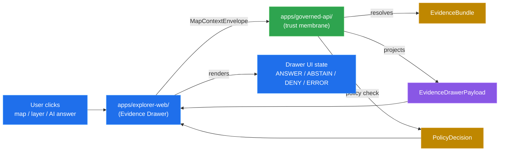
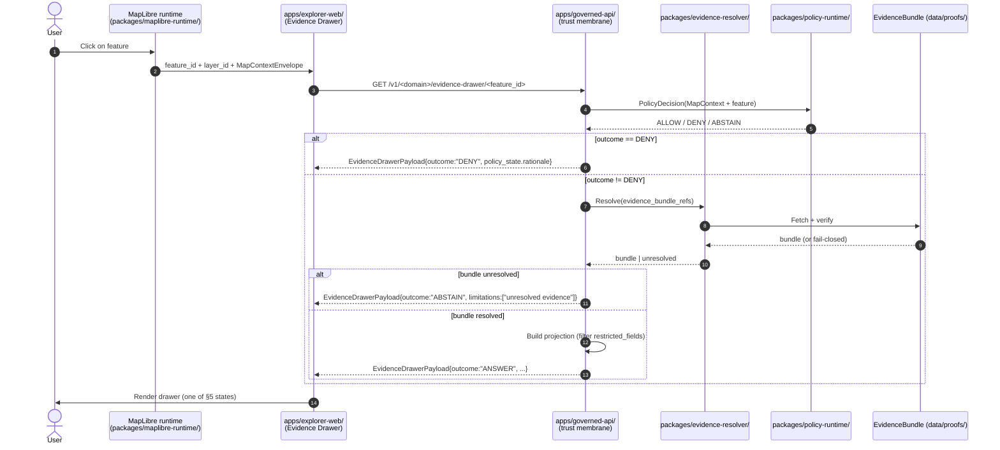
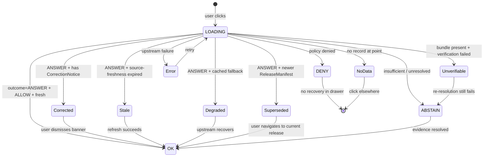
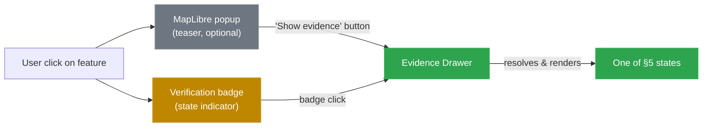

<!-- [KFM_META_BLOCK_V2]
doc_id: kfm://doc/evidence-drawer
title: Evidence Drawer — KFM Architecture Doctrine
type: standard
version: v1.0
status: draft
owners: AI surface steward, UI lead
created: 2026-05-25
updated: 2026-05-25
policy_label: public
related:
  - docs/architecture/directory-rules.md
  - docs/architecture/domain-placement-law.md
  - docs/architecture/map-shell.md
  - docs/architecture/governed-api.md
  - docs/architecture/maplibre-3d.md
  - docs/doctrine/trust-membrane.md
  - docs/doctrine/truth-posture.md
  - schemas/contracts/v1/ui/evidence_drawer_payload.schema.json
  - schemas/contracts/v1/evidence/evidence_bundle.schema.json
  - contracts/ui/evidence_drawer_payload.md
tags: [kfm, doctrine, architecture, ui, evidence-drawer, trust-membrane, focus-mode]
notes:
  - "Evidence Drawer is a UI projection of EvidenceBundle — never the truth itself. EvidenceBundle is canonical; EvidenceDrawerPayload is the governed projection."
  - "Owner field is placeholder; resolve in CODEOWNERS."
  - "All paths and route names are PROPOSED unless explicitly CONFIRMED at a commit. v1.0 was authored without mounted-repo inspection."
[/KFM_META_BLOCK_V2] -->

# Evidence Drawer

> **The trust surface for every clicked feature, every layer, and every AI answer. A governed projection of EvidenceBundle into a UI shape — never a substitute for the bundle itself.**


**Status:** draft · **Owners:** AI surface steward + UI lead *(placeholder; verify in `CODEOWNERS`)* · **Last reviewed:** 2026-05-25

> [!IMPORTANT]
> **The drawer is a projection, not the source of truth.** `EvidenceBundle` is canonical evidence ([`contracts/evidence/evidence_bundle.md`](../../contracts/evidence/evidence_bundle.md)); `EvidenceDrawerPayload` is its UI-shaped projection. The drawer renders what the bundle already proved — it does not compute new policy, infer new sensitivity, or reword the citation set. When the bundle says ABSTAIN, the drawer shows ABSTAIN; the drawer cannot recover into ANSWER on its own.

---

## 📑 Contents

- [§0 — Status & Authority](#0-status--authority)
- [§1 — What the Evidence Drawer Is (and Is Not)](#1-what-the-evidence-drawer-is-and-is-not)
- [§2 — Where It Lives](#2-where-it-lives)
- [§3 — The EvidenceDrawerPayload Contract](#3-the-evidencedrawerpayload-contract)
- [§4 — Resolution Lifecycle](#4-resolution-lifecycle)
- [§5 — Trust-Visible States](#5-trust-visible-states)
- [§6 — Per-Domain Projections](#6-per-domain-projections)
- [§7 — Click Resolution, Popups, and Badges](#7-click-resolution-popups-and-badges)
- [§8 — Accessibility Requirements](#8-accessibility-requirements)
- [§9 — What the Drawer MUST NOT Do](#9-what-the-drawer-must-not-do)
- [§10 — Reviewer Checklist for Drawer-Touching PRs](#10-reviewer-checklist-for-drawer-touching-prs)
- [§11 — Open Questions and NEEDS VERIFICATION](#11-open-questions-and-needs-verification)
- [§12 — Glossary](#12-glossary)
- [§13 — Changelog](#13-changelog)

---

## 0. Status & Authority

| Field | Value |
|---|---|
| **Document type** | Architecture doctrine (single UI component; cross-cutting across all 13 KFM domains) |
| **Edition** | v1.0 — initial component-architecture authoring |
| **Authority of these rules** | **CONFIRMED — derives from:** Atlas card `KFM-P1-FEAT-0065` ("Evidence Drawer required on layers, popovers, and AI answers"; CONFIRMED doctrine per Pass-20 Part II); *Master MapLibre Components-Functions-Features v2.1* §N (Evidence Drawer Payloads), §S (Accessibility, UX, and Trust-Visible States); Atlas v1.1 per-domain J. tables (every domain has an "Evidence Drawer payload" endpoint); [Domain Placement Law §5](./domain-placement-law.md#5-multi-domain-and-cross-cutting-files) (cross-cutting placement). |
| **Authority of any specific path/route quoted here** | **PROPOSED** unless explicitly noted. v1.0 was authored without mounted-repo inspection. Schema and contract homes follow [ADR-0001 schema home](../adr/ADR-0001-schema-home.md). |
| **Conformance language** | RFC 2119-style: **MUST / MUST NOT** non-negotiable; **SHOULD / SHOULD NOT** strong default; **MAY** permitted. Same as [Directory Rules §2.2](./directory-rules.md#22-conformance-language-rfc-2119-style). |
| **Owners** | AI surface steward (Focus Mode and trust-state binding) + UI lead (rendering and accessibility). |
| **Reviewers required for change** | AI surface steward + UI lead + Docs steward. ADR required for: changing the `EvidenceDrawerPayload` schema in a breaking way; introducing a new finite-outcome state beyond ANSWER/ABSTAIN/DENY/ERROR; permitting the drawer to read from `data/raw|work|quarantine`. |
| **Supersedes** | None. First edition. Does not supersede atlas card `KFM-P1-FEAT-0065` — operationalizes it. |
| **Related doctrine** | [`docs/architecture/directory-rules.md`](./directory-rules.md), [`docs/architecture/domain-placement-law.md`](./domain-placement-law.md), [`docs/architecture/map-shell.md`](./map-shell.md), [`docs/architecture/governed-api.md`](./governed-api.md), [`docs/architecture/maplibre-3d.md`](./maplibre-3d.md), [`docs/doctrine/trust-membrane.md`](../doctrine/trust-membrane.md), [`docs/doctrine/truth-posture.md`](../doctrine/truth-posture.md), [`contracts/evidence/evidence_bundle.md`](../../contracts/evidence/evidence_bundle.md), [`contracts/runtime/runtime_response_envelope.md`](../../contracts/runtime/runtime_response_envelope.md). |
| **Default sensitivity posture** | **Drawer renders policy-filtered state only.** Restricted fields never reach the drawer; the drawer shows DENY/ABSTAIN/redacted-summary instead. |
| **Last reviewed** | 2026-05-25 |

> **Truth-posture note (v1.0).** Grounded in: (a) [`docs/architecture/directory-rules.md`](./directory-rules.md) v1.3.1, [`docs/architecture/domain-placement-law.md`](./domain-placement-law.md) v1.0; (b) Atlas card `KFM-P1-FEAT-0065` (CONFIRMED doctrine; Pass-20 Part II explicitly states Evidence Drawer is mandatory on layers, popovers, and AI answers); (c) *Master MapLibre Components-Functions-Features v2.1* §N (Evidence Drawer Payloads), §S (Accessibility, UX, and Trust-Visible States), §M (component table for the Evidence Drawer); (d) Atlas v1.1 per-domain J. tables (Atmosphere, Settlements/Infrastructure, Archaeology, Frontier Matrix, and others each include an "Evidence Drawer payload" endpoint with `EvidenceDrawerPayload + EvidenceBundle projection` returning ANSWER / ABSTAIN / DENY / ERROR). **No mounted repo, CI workflow, or running UI was inspected for v1.0.** Every concrete route name, package path, and component file name is **PROPOSED**.

[⤴ Back to top](#-contents)

---

## 1. What the Evidence Drawer Is (and Is Not)

### 1.1 The two-line definition

> **The Evidence Drawer is the trust-visible UI surface that appears when a user clicks a layer, feature, popover, or AI answer in `apps/explorer-web/`. It renders the governed projection of the underlying EvidenceBundle — citations, source summary, policy state, sensitivity, review state, release state, and limitations — so the user can decide whether to trust the claim.**

### 1.2 Three things it IS

1. **A projection of canonical evidence.** It takes `EvidenceBundle` (truth-bearing object that outranks generated language) and renders it as `EvidenceDrawerPayload` (UI-shaped). The bundle is canonical; the drawer is presentational.
2. **A finite-outcome surface.** Every drawer state resolves to one of ANSWER / ABSTAIN / DENY / ERROR — the same grammar as the governed API and Focus Mode. There is no "loading forever" state; there is no "kind of evidence" state.
3. **A keyboard-accessible trust surface.** Per *Master MapLibre v2.1 §S* and `ML-S-061` ("Keyboard-accessible Evidence Drawer and Focus Mode remain required for trust surfaces"), the drawer MUST be operable without a mouse, MUST expose ARIA labels, and MUST show stale / failed-verification / no-data states perceptibly — not just visually.

### 1.3 Five things it is NOT

| It is NOT | Because |
|---|---|
| The source of truth | `EvidenceBundle` is canonical (per [`contracts/evidence/evidence_bundle.md`](../../contracts/evidence/evidence_bundle.md)). The drawer is a projection; if it disagrees with the bundle, the bundle wins. |
| A popup | A MapLibre popup is a lightweight hover/click affordance. The drawer is the persistent trust surface. *Master MapLibre v2.1 §N: "Popup is not substitute"*. They may coexist (popup teases, drawer proves), but popups MUST NOT carry citations as if they were the drawer. |
| A verification badge | Badges are entry points; the drawer is the destination. Per `ML-061-139` ("Badge clicks should open proof details rather than replacing the Evidence Drawer"), badges OPEN the drawer; they do not replace it. |
| An AI answer surface | AI Focus Mode answers go through their own `RuntimeResponseEnvelope` + `AIReceipt` surface. The drawer shows the **evidence cited by** the AI answer; it does not generate or critique the answer itself. |
| A policy engine | Policy lives in `policy/`. The drawer renders `PolicyDecision` outcomes; it does not recompute them. *Master MapLibre v2.1 ML-056-019: "Do not recompute policy meaning in UI."* |

### 1.4 The trust-membrane position

The drawer sits at the **public edge of the trust membrane** ([`docs/doctrine/trust-membrane.md`](../doctrine/trust-membrane.md)). Every byte the user sees in the drawer has passed through `apps/governed-api/` and resolved against `EvidenceBundle`. The drawer cannot read from `data/raw/`, `data/work/`, `data/quarantine/`, or any internal store — that is a [Directory Rules §13.5](./directory-rules.md#135-additional-anti-patterns) anti-pattern ("Public route reads canonical store"), and the drawer is a public route.



[⤴ Back to top](#-contents)

---

## 2. Where It Lives

The drawer is a **cross-cutting UI component** per [Domain Placement Law §5.2](./domain-placement-law.md#52-cross-cutting-placement-table) and [Directory Rules §11](./directory-rules.md#11-ui-and-map-roots). It does NOT belong to any single domain.

### 2.1 Canonical placement table

| Concern | Canonical home | Notes |
|---|---|---|
| **UI component code** | `apps/explorer-web/src/evidence-drawer/` | Component, hooks, state machine. **PROPOSED.** |
| **Shared UI primitives** | `packages/ui/src/evidence-drawer/` | Reusable building blocks if other apps (e.g., `apps/review-console/`) reuse them. **PROPOSED.** |
| **Renderer-adapter integration** | `packages/maplibre-runtime/src/feature-click-resolver.ts` | The `click → MapContextEnvelope → governed-API` bridge; lives inside the renderer adapter per [`docs/architecture/maplibre-3d.md`](./maplibre-3d.md) §7.2.a. **PROPOSED.** |
| **Semantic contract (Markdown)** | `contracts/ui/evidence_drawer_payload.md` | Field meaning, invariants. Per [Directory Rules §6.3](./directory-rules.md#63-contracts--object-meaning). **PROPOSED.** |
| **Machine schema (JSON Schema)** | `schemas/contracts/v1/ui/evidence_drawer_payload.schema.json` | Per [ADR-0001 schema home](../adr/ADR-0001-schema-home.md). **PROPOSED.** |
| **Drawer projection policy** | `policy/runtime/drawer_projection.rego` | What fields the drawer is allowed to show given a `PolicyDecision`. **PROPOSED.** |
| **Tests** | `tests/ui/evidence-drawer/`, `tests/contracts/evidence_drawer_payload/`, `tests/policy/drawer_projection/`, `tests/integration/maplibre/feature_click_to_drawer/` | Four parallel test homes (UI, contract, policy, integration). **PROPOSED.** |
| **Fixtures** | `fixtures/ui/evidence_drawer/{valid,invalid}/`, `fixtures/maplibre/click_to_drawer/` | Per-state valid + invalid fixtures (one per §5 state). **PROPOSED.** |
| **Per-domain projections** | Each domain's J-section in Atlas v1.1; route name TBD per [Directory Rules §18.a](./directory-rules.md#18a-carried-forward-from-v10) | `/v1/<domain>/evidence-drawer/<feature_id>` (PROPOSED; route style NEEDS VERIFICATION). |
| **Storybook / preview** | `apps/explorer-web/src/evidence-drawer/stories/` (or wherever `apps/explorer-web/` stages component preview) | Each §5 state has at least one story. **PROPOSED.** |

> [!IMPORTANT]
> **Drawer artifacts MUST NOT shadow cross-cutting object families.** `EvidenceBundle`, `EvidenceRef`, `PolicyDecision`, `RuntimeResponseEnvelope`, `SourceDescriptor`, `RedactionReceipt` are cross-cutting per [Domain Placement Law §5.3](./domain-placement-law.md#53-object-families-that-are-intrinsically-cross-cutting). The drawer **cites** them; it does not redefine them under `contracts/ui/` or `schemas/contracts/v1/ui/`. Only `EvidenceDrawerPayload` and `MapContextEnvelope` are drawer-owned cross-cutting families.

### 2.2 The component-tree view (PROPOSED)

```text
apps/explorer-web/
├── src/
│   ├── evidence-drawer/
│   │   ├── EvidenceDrawer.tsx              # root component; orchestrates state
│   │   ├── DrawerHeader.tsx                # feature_id + layer_id + close
│   │   ├── SourceSummary.tsx               # SourceDescriptor projection
│   │   ├── CitationList.tsx                # citations (links → EvidenceBundle)
│   │   ├── PolicyBadge.tsx                 # ALLOW/DENY/ABSTAIN/restricted
│   │   ├── SensitivityBadge.tsx            # T0–T4 indicator
│   │   ├── ReleaseStateBadge.tsx           # released / candidate / stale / superseded
│   │   ├── ReviewStateBadge.tsx            # reviewed / pending / corrected
│   │   ├── LimitationsList.tsx             # explicit caveats (e.g., "AOD is not PM2.5")
│   │   ├── CorrectionsBanner.tsx           # if CorrectionNotice exists
│   │   ├── EmptyStates/
│   │   │   ├── StaleState.tsx              # source freshness expired
│   │   │   ├── AbstainState.tsx            # insufficient evidence
│   │   │   ├── DenyState.tsx               # policy-denied
│   │   │   ├── ErrorState.tsx              # upstream error
│   │   │   ├── NoDataState.tsx             # nothing at click point
│   │   │   └── UnverifiableState.tsx       # bundle present but verification failed
│   │   ├── hooks/
│   │   │   ├── useEvidenceDrawerPayload.ts # governed-API call hook
│   │   │   └── useDrawerState.ts           # finite-state machine wrapper
│   │   ├── state-machine.ts                # ANSWER/ABSTAIN/DENY/ERROR finite-state
│   │   └── stories/                        # one story per §5 state
└── …
```

[⤴ Back to top](#-contents)

---

## 3. The EvidenceDrawerPayload Contract

The `EvidenceDrawerPayload` is the wire contract between `apps/governed-api/` and the drawer component. *Master MapLibre v2.1 §M* records its required field intent; the schema home is `schemas/contracts/v1/ui/evidence_drawer_payload.schema.json` per [ADR-0001](../adr/ADR-0001-schema-home.md).

### 3.1 Required fields (per Master MapLibre v2.1 §M)

| Field | Type | Meaning | Source |
|---|---|---|---|
| `feature_id` | string | Stable identifier for the clicked feature. | Layer manifest. |
| `layer_id` | string | The layer in which the feature lives. | Layer manifest. |
| `evidence_bundle_refs` | `EvidenceRef[]` | One or more references resolving to `EvidenceBundle` records. | Resolved via `packages/evidence-resolver/`. |
| `source_summary` | object | Compact projection of `SourceDescriptor`: source name, authority role, rights, sensitivity tier, freshness, citation. | `contracts/source/source_descriptor.md`. |
| `citations` | `Citation[]` | The citation set the user can follow. Each cites an `EvidenceBundle` claim. | `EvidenceBundle.claims[*].citations`. |
| `policy_state` | object | Projected `PolicyDecision`: outcome (ALLOW/DENY/ABSTAIN), rationale code, restricted-fields list. | `contracts/runtime/policy_decision.md`. |
| `release_state` | object | `ReleaseManifest` references: release_id, release_time, supersedes, rollback_target. Plus stale-state marker if relevant. | `contracts/release/release_manifest.md`. |
| `review_state` | object | Whether the underlying claim has been steward-reviewed; correction_notice references if any. | `contracts/governance/review_record.md`. |
| `limitations` | `Limitation[]` | Explicit caveats (e.g., "AQI is not concentration"; "AOD is not PM2.5"; "model output, not observation"). | Per-domain `EvidenceBundle.limitations`. |
| `outcome` | enum | `ANSWER` / `ABSTAIN` / `DENY` / `ERROR`. The finite-outcome marker. | This contract. |

### 3.2 Optional fields

| Field | When present | Meaning |
|---|---|---|
| `correction_notice_refs` | If `release_state.has_corrections === true` | Pointers to `CorrectionNotice` records for any claims that have been corrected. |
| `representation_receipt_ref` | If the drawer is opened on a 3D-rendered feature | Per [`docs/architecture/maplibre-3d.md`](./maplibre-3d.md), the `RepresentationReceipt` for the render batch that produced the visible feature. |
| `reality_boundary_note_ref` | If the layer contains synthetic / interpolated / reconstructed surface | The `RealityBoundaryNote` explaining where reality ends and synthesis begins. |
| `redaction_receipt_refs` | If any displayed field was redacted from a higher-tier original | The `RedactionReceipt` chain proving the redaction is deterministic and reviewed. |
| `model_run_receipt_ref` | If the claim involved model output | The `ModelRunReceipt` for the model that produced the result. |
| `accessibility` | Always when image / map / chart content present | Alt text, perceivable description; per *Master MapLibre v2.1 §S* and `ML-064-059` (Evidence Drawer image cards must use alt text and captions from source metadata). |

### 3.3 Field invariants

These invariants MUST hold; the drawer schema validators MUST enforce them; CI MUST refuse promotion of any payload that violates them.

1. **At least one `evidence_bundle_refs` entry unless `outcome ∈ {DENY, ERROR}`.** ANSWER and ABSTAIN payloads MUST carry resolvable evidence references; the drawer is not allowed to display claims without evidence.
2. **Every `citations[*]` MUST resolve.** A dangling citation is a failure of citation validation ([`CitationValidationReport`](../../contracts/runtime/citation_validation_report.md), per *Master MapLibre v2.1 §M*); the drawer either ABSTAINS or displays an explicit "unresolved citation" badge — never silently drops.
3. **`policy_state.restricted_fields` enumerates every field omitted for policy reasons.** Silent omission is forbidden. If `OccurrenceRestricted` data was filtered out, the payload MUST say so under `restricted_fields` even if it omits the values themselves.
4. **`outcome === DENY` ⇒ `policy_state.rationale` MUST be present.** A deny without a reason is opaque; the drawer rationale code (not the rule body) is shown to the user.
5. **`outcome === ABSTAIN` ⇒ at least one of `limitations`, `evidence_bundle_refs` (with `insufficient_for_claim` reason), or `release_state.stale` MUST be populated.** Abstain without a reason is fluent guessing.
6. **Cross-cutting families MUST NOT be embedded in full.** The payload carries **references** (`evidence_bundle_refs`, `correction_notice_refs`, `release_manifest_ref`); the underlying objects resolve via the governed API. Embedding the full `EvidenceBundle` inline duplicates canonical truth and risks divergence.

### 3.4 Schema sketch (PROPOSED)

> [!NOTE]
> The fragment below is **illustrative** — the canonical machine-checkable schema lives at `schemas/contracts/v1/ui/evidence_drawer_payload.schema.json`. It is **PROPOSED**; mounted-repo verification required.

```json
{
  "$schema": "https://json-schema.org/draft/2020-12/schema",
  "$id": "https://kfm.example/schemas/contracts/v1/ui/evidence_drawer_payload.schema.json",
  "title": "EvidenceDrawerPayload",
  "type": "object",
  "required": ["feature_id", "layer_id", "outcome"],
  "properties": {
    "feature_id":            { "type": "string" },
    "layer_id":              { "type": "string" },
    "outcome":               { "enum": ["ANSWER", "ABSTAIN", "DENY", "ERROR"] },
    "evidence_bundle_refs":  { "type": "array", "items": { "$ref": "../evidence/evidence_ref.schema.json" } },
    "source_summary":        { "$ref": "./source_summary.schema.json" },
    "citations":             { "type": "array", "items": { "$ref": "./citation.schema.json" } },
    "policy_state":          { "$ref": "../runtime/policy\_decision.schema.json#/$defs/projection" },
    "release_state":         { "$ref": "../release/release_state.schema.json" },
    "review_state":          { "$ref": "../governance/review_state.schema.json" },
    "limitations":           { "type": "array", "items": { "type": "string" } },
    "correction_notice_refs":     { "type": "array", "items": { "$ref": "../release/correction_notice_ref.schema.json" } },
    "representation_receipt_ref": { "$ref": "../maplibre/representation_receipt_ref.schema.json" },
    "reality_boundary_note_ref":  { "$ref": "../3d/reality_boundary_note_ref.schema.json" },
    "redaction_receipt_refs":     { "type": "array", "items": { "$ref": "../source/redaction_receipt_ref.schema.json" } },
    "model_run_receipt_ref":      { "$ref": "../ai/model_run_receipt_ref.schema.json" },
    "accessibility":              { "$ref": "./drawer_accessibility.schema.json" }
  },
  "allOf": [
    { "$comment": "Invariant 1: ANSWER/ABSTAIN require evidence_bundle_refs",
      "if":   { "properties": { "outcome": { "enum": ["ANSWER", "ABSTAIN"] } } },
      "then": { "required": ["evidence_bundle_refs"], "properties": { "evidence_bundle_refs": { "minItems": 1 } } }
    },
    { "$comment": "Invariant 4: DENY requires policy_state.rationale",
      "if":   { "properties": { "outcome": { "const": "DENY" } } },
      "then": { "required": ["policy_state"], "properties": { "policy_state": { "required": ["rationale"] } } }
    }
  ]
}
```

[⤴ Back to top](#-contents)

---

## 4. Resolution Lifecycle

### 4.1 Click-to-drawer (CONFIRMED doctrine)



### 4.2 The five governing invariants of the resolution path

1. **No direct store reads.** The drawer NEVER calls `data/raw/`, `data/work/`, `data/quarantine/`, or any internal store. It only calls `apps/governed-api/`. ([Directory Rules §13.5](./directory-rules.md#135-additional-anti-patterns) "Public route reads canonical store".)
2. **Policy check before evidence resolution.** A `DENY` decision short-circuits — no `EvidenceBundle` lookup happens for denied requests. This prevents timing-based information leaks.
3. **Evidence resolution is fail-closed.** If `EvidenceBundle` cannot be resolved (unreachable, integrity failure, missing claim), the drawer ABSTAINS with an explicit reason. It does not silently fall back to a layer description or popup payload.
4. **The projection MUST drop restricted fields, not the citation.** When `policy_state.restricted_fields` filters values, the citations remain visible (so users see *that* evidence exists, even if its content is restricted to reviewers).
5. **Latency budgets.** Per *Master MapLibre v2.1 §T* and the v1.5 update packet's "Interaction-to-drawer latency budget" test: click → governed-API → drawer-appears within the agreed SLO; stale / error states are visible if the SLO is exceeded. No infinite spinners.

### 4.3 What the runtime does, in order

1. **MapLibre `click` event** captured in `packages/maplibre-runtime/src/feature-click-resolver.ts`.
2. **MapContextEnvelope built** from current viewport (visible_layers, bounds, zoom, pitch, bearing, filters, time_window, selected_features). Per *Master MapLibre v2.1 §M*.
3. **Drawer state machine transitions to LOADING** with progress indicator (NOT an infinite spinner; bound by SLO).
4. **Governed-API call** to `/v1/<domain>/evidence-drawer/<feature_id>` with `MapContextEnvelope` as body.
5. **Governed-API performs PolicyDecision** via `packages/policy-runtime/`. Restricted fields filtered.
6. **Governed-API resolves `EvidenceBundle`** via `packages/evidence-resolver/` for non-denied requests.
7. **Governed-API emits `RunReceipt`** to `data/receipts/runtime/`; per [Directory Rules §9.1](./directory-rules.md#91-data--the-lifecycle-invariant), every governed-API call leaves a receipt.
8. **Response builds `EvidenceDrawerPayload`** with the §5 outcome marker.
9. **Drawer renders** the matching §5 state.

[⤴ Back to top](#-contents)

---

## 5. Trust-Visible States

The drawer has exactly **ten visible states**, plus loading. Each MUST be visually distinct, keyboard-accessible, and screen-reader-perceivable. Per *Master MapLibre v2.1 §S* (`ML-061-140`: "Unknown, stale, or failed verification states need distinct visual treatment") and `ML-S-063` ("No-data and unverifiable states are UI requirements").

### 5.1 The state table

| State | Outcome | Visual treatment (PROPOSED) | When | Required content |
|---|---|---|---|---|
| **OK / Released** | ANSWER | Green badge, full content | Released, in-date, fully evidence-backed, ALLOW policy | Everything in §3.1 |
| **Corrected** | ANSWER | Amber CORRECTED banner above content | `CorrectionNotice` exists | Banner with link to correction notice; original + corrected values |
| **Stale** | ANSWER (with warning) | Amber STALE badge | Source freshness expired per `SourceDescriptor.cadence` | Stale-source label; original release_time; days-since-staleness |
| **Degraded** | ANSWER (with warning) | Orange DEGRADED badge | Cached / fallback served (e.g., upstream unreachable but cached PMTiles available, per `ML-064-017`) | Degradation reason; cache age; "values may differ from canonical" caveat |
| **Superseded** | ANSWER (or ABSTAIN if user is on outdated layer) | Blue SUPERSEDED badge | A newer `ReleaseManifest` exists | Link to current release; "you are viewing release_id X; current is Y" |
| **ABSTAIN** | ABSTAIN | Gray ABSTAIN state | Insufficient evidence, unresolved citation, model output without supporting bundle | Reason (one of: insufficient evidence, unresolved citation, missing receipt, stale beyond tolerance); guidance ("a reviewer will resolve this") |
| **DENY** | DENY | Red DENY state with rationale | Policy denied (rights, sensitivity, sovereignty, restricted-use license) | Rationale code (not rule body); pointer to public-safe alternative if any; appeal path |
| **No Data** | ANSWER (with explicit "no data at point") | Pale gray NO DATA state | Click landed on a layer point with no record | "No record at this location"; nearest-record link if helpful; not the same as DENY |
| **Unverifiable** | ABSTAIN | Yellow UNVERIFIABLE badge | Bundle present but verification (signature, hash, attestation) failed | Failure reason ("signature did not verify", "hash mismatch", "missing attestation"); admin contact path |
| **Error** | ERROR | Red ERROR state | Upstream system failure (governed API 5xx, network) | "Couldn't load evidence — try again" + retry control; **never** a fallback to inferred content |

### 5.2 State diagram



> [!WARNING]
> **The state set is closed.** A new state requires an ADR per §0 (Reviewers required for change). Don't invent a "PROVISIONAL" or "MAYBE-OK" state — it defeats the finite-outcome guarantee. Use the existing ten + LOADING.

### 5.3 Per-state accessibility contract

Per *Master MapLibre v2.1 §S* and `ML-S-049`, every state MUST:

- Have a unique ARIA `role` + `aria-live` configuration appropriate to its urgency (DENY and ERROR are assertive; STALE and Degraded are polite; OK and NoData are off).
- Use a color **plus** an icon **plus** a text label — never color alone (WCAG 1.4.1 Use of Color).
- Maintain a 4.5:1 contrast ratio against background (WCAG 1.4.3 / 1.4.11).
- Expose a keyboard-operable "Why this state?" affordance that opens the rationale.

[⤴ Back to top](#-contents)

---

## 6. Per-Domain Projections

Every KFM domain has an "Evidence Drawer payload" endpoint per Atlas v1.1 J-section. The endpoint is the **per-domain composition surface** — it builds the cross-cutting `EvidenceDrawerPayload` shape with domain-specific limitations and sensitivity defaults.

### 6.1 The thirteen domain projections (Atlas v1.1)

| Domain | J-section endpoint (Atlas v1.1) | Domain-specific limitations |
|---|---|---|
| Hydrology | `Hydrology Evidence Drawer payload → EvidenceDrawerPayload + EvidenceBundle projection` | HUC version pin; NFHL regulatory disclaimer; gauge-site freshness window |
| Soil | "Soil Evidence Drawer payload" | SSURGO/gNATSGO version pin; `SoilTimeCaveat` for legacy survey vintages |
| Habitat | "Habitat Evidence Drawer payload" | `Model Run Receipt` for suitability surfaces; CARE label for stewardship zones |
| Fauna | "Fauna Evidence Drawer payload" | Geoprivacy generalization marker; ITIS TSN + GBIF Backbone version pin |
| Flora | "Flora Evidence Drawer payload" | RarePlantRecord geoprivacy; CARE label for ethnobotanical context |
| Geology | "Geology Evidence Drawer payload" | GeologyBoundaryVersion pin; advisory disclaimer for resource estimates |
| Atmosphere / Air | "Atmosphere/Air Evidence Drawer payload" | **"AQI is not concentration"**, **"AOD is not PM2.5"**, **"model fields are not observations"**, low-cost-sensor caveat |
| Hazards | "Hazards Evidence Drawer payload" | **"KFM is observational, not emergency-alert authority"** disclaimer (Atlas Ch. 12) |
| Roads / Rail / Trade | "Roads/Rail Evidence Drawer payload" | Historic-route uncertainty surface; modern vs historic distinction |
| Settlements / Infrastructure | "Settlements/Infrastructure Evidence Drawer payload" | Critical-infrastructure deny banner; legal-municipality vs census distinction |
| Archaeology | "Archaeology Evidence Drawer payload" | Sovereignty review note; "exact location denied" banner for T4 sites; CARE label |
| Hazards | (above) | (above) |
| Agriculture | "Agriculture Evidence Drawer payload" | Aggregate-vs-field-candidate distinction; "private operator joins denied" |
| People / Genealogy / DNA / Land | "People/DNA/Land Evidence Drawer payload" | **Living-person fields deny banner**; DNA-consent banner; person-parcel join denial |
| **+ Frontier Matrix** *(special-status)* | "Frontier Matrix Evidence Drawer payload" | Cell-snapshot receipt; "matrix cell is analytical release, not source truth" disclaimer |
| **+ Planetary / 3D** *(special-status; per [`maplibre-3d.md`](./maplibre-3d.md))* | "Planetary/3D Evidence Drawer payload" | `RealityBoundaryNote` marker; "scene is reconstructed / interpolated" banner; admission-decision rationale |

### 6.2 The drawer schema is generic; projections specialize it

Per `ML-056-014` ("Generic Evidence Drawer schema gap") and `ML-056-015` ("Drawer projection separates UI from canonical evidence"): **`EvidenceDrawerPayload` is one generic schema; per-domain projections specialize via `limitations`, `policy_state.restricted_fields`, and `source_summary`.**

This means:

- **One schema** at `schemas/contracts/v1/ui/evidence_drawer_payload.schema.json` covers every domain.
- **Per-domain limitations registries** at `policy/domains/<domain>/drawer_limitations.yaml` (PROPOSED) record the standard limitations that domain MUST attach (e.g., Atmosphere's "AQI is not concentration").
- **Per-domain projection tests** at `tests/domains/<domain>/evidence_drawer/` verify that domain-specific caveats are correctly attached on each ANSWER/ABSTAIN payload.

The drawer COMPONENT does NOT need per-domain code — it renders whatever `EvidenceDrawerPayload` it receives. Domain-specific rendering hooks (e.g., custom limitation icons) are themed via the payload, not coded into the drawer.

> [!TIP]
> **No per-domain drawer components.** Per `ML-056-014`: "per-domain drawer schemas scale linearly" — that's the problem to avoid. There is **one** drawer component; domains supply payload content. Don't create `apps/explorer-web/src/evidence-drawer/fauna/`, `…/flora/`, etc.

[⤴ Back to top](#-contents)

---

## 7. Click Resolution, Popups, and Badges

Three trust-adjacent UI affordances coexist. Each has a defined role; **none may substitute for the drawer** (per `ML-061-139`).

### 7.1 The three affordances

| Affordance | Role | Triggers what |
|---|---|---|
| **MapLibre popup** | Lightweight feature teaser on hover/click | Shows feature name, layer, one-line summary. Has a **"Show evidence"** button that opens the drawer. |
| **Verification badge** | Trust-state icon on the layer/feature/legend | Per `ML-061-138` and `ML-061-140`: exposes verified / stale / degraded / unverified state at a glance. **Clicking the badge opens the drawer** (`ML-061-139`). |
| **Evidence Drawer** | Full trust surface | Shows everything in §3. Persistent (does not auto-dismiss); explicit close. |

### 7.2 Resolution priority

When a user clicks the map, the drawer is the destination for the trust answer. The popup MAY appear first as a teaser; the badge MAY appear on the popup as a state indicator; both MUST link to the drawer.



### 7.3 What's forbidden

- **Citations in popups** as if they were the citation set. Per *Master MapLibre v2.1 §N* component table: "Popup is not substitute". A popup may *mention* that evidence exists; it MUST NOT list citations as the canonical set.
- **Badge as evidence**. Per `ML-061-090` ("Attestation badges should be backed by receipts and not visual trust theater") and the anti-pattern "Badge as proof substitute": a green badge alone is theater; the badge MUST link to the drawer where the receipt and EvidenceBundle live.
- **Drawer-less feature interaction.** Per atlas card `KFM-P1-FEAT-0065`: every public claim, every map feature, every layer state, every AI answer MUST have an Evidence Drawer or equivalent trust-visible payload available. A clickable feature without a drawer path is incomplete.

### 7.4 Export and screenshot behavior

Per `ML-061-141` ("Exports and screenshots should preserve verification badge state and manifest ID"): any exported map, story export, or screenshot that includes badges MUST preserve the badge state and the linked `ReleaseManifest` ID at the time of export. This is so consumers of the export can verify they're looking at the same release the map was showing. Story exports inherit this rule via [`docs/architecture/governed-api.md`](./governed-api.md) (and [Atlas Ch. 21 phase 15](../atlases/)).

[⤴ Back to top](#-contents)

---

## 8. Accessibility Requirements

Per *Master MapLibre v2.1 §S* and atlas card `ML-S-049` ("Keyboard-accessible drawer and badge controls are required for trust visibility"), accessibility is **non-negotiable** for the drawer. Trust visibility is trust ONLY when every user can access it.

### 8.1 Required affordances

- [ ] **Keyboard operability.** The drawer opens, navigates, and closes without a mouse. Tab order is meaningful. Escape closes. Focus returns to the triggering badge or popup on close.
- [ ] **ARIA roles.** The drawer container has `role="dialog"` (or `complementary`, depending on persistence model) with `aria-labelledby` pointing to the drawer title.
- [ ] **`aria-live` for state changes.** When the drawer state transitions (loading → ANSWER, ANSWER → corrected, etc.), the change is announced. Urgency-appropriate (`polite` for stale, `assertive` for DENY/ERROR).
- [ ] **Color + icon + label for every state.** Per §5.3. WCAG 1.4.1 (Use of Color). The DENY state, for example, is NOT only red — it has a deny icon and a "Denied" text label.
- [ ] **Contrast.** 4.5:1 minimum for body text; 3:1 for large text and graphical elements (WCAG 1.4.3 / 1.4.11).
- [ ] **Alt text on images.** Every image card in the drawer (per `ML-064-059`, `ML-064-091`) carries alt text from `SourceDescriptor.media[*].alt` or `EvidenceBundle.media[*].alt`. **Missing alt is a DENY / WARN policy** at the projection stage.
- [ ] **Screen-reader-perceivable map context.** Per `ML-S-051` ("Time slider state should be perceivable and not only visual"): if the drawer references a time window from `MapContextEnvelope.time_window`, the window is announced as text, not only displayed as a slider position.
- [ ] **No-data and unverifiable states perceivable.** Per `ML-S-063` ("No-data and unverifiable states are UI requirements"): these MUST have explicit text, not only iconography.
- [ ] **Reduced-motion respect.** Drawer open/close animations honor `prefers-reduced-motion`.

### 8.2 CI accessibility tests

Per *Master MapLibre v2.1 §S* required validations:

| Test category | What it asserts | Live in |
|---|---|---|
| Keyboard navigation | Tab order, Escape close, focus restoration | `tests/ui/evidence-drawer/keyboard.spec.*` |
| Contrast / color | 4.5:1 / 3:1 ratios across all §5 states | `tests/ui/evidence-drawer/contrast.spec.*` |
| ARIA / screen reader | Roles, labels, live regions announce correctly | `tests/ui/evidence-drawer/aria.spec.*` |
| State-perceivability | Each §5 state has text + icon + color | `tests/ui/evidence-drawer/state_perceivability.spec.*` |
| Alt-text presence | No image card without alt | `tests/ui/evidence-drawer/alt_text.spec.*` |
| Visual regression | §5 state snapshots stay stable | `tests/ui/evidence-drawer/visual.spec.*` |

> [!CAUTION]
> **An accessibility regression is a release blocker.** Per [Directory Rules §16](./directory-rules.md#16-path-validation-checklist-for-reviewers) reviewer checklist and *Master MapLibre v2.1 §S* "fail-closed" stance: a failing a11y test is not a warning — it's a refusal-to-promote. The drawer cannot be the trust surface for users who cannot use it.

[⤴ Back to top](#-contents)

---

## 9. What the Drawer MUST NOT Do

This is the drawer-specific anti-pattern register. It complements [Directory Rules §13](./directory-rules.md#13-anti-patterns-and-drift-prevention), [Domain Placement Law §10](./domain-placement-law.md#10-anti-patterns-specific-to-domain-placement), and [`docs/architecture/ecology-cross-domain.md`](./ecology-cross-domain.md) §8.

| Anti-pattern | Symptom | Fix |
|---|---|---|
| **Drawer as truth** | The drawer renders a value not present in any `EvidenceBundle`. | `EvidenceBundle` is canonical (per [Trust Membrane doctrine](../doctrine/trust-membrane.md)); the drawer projects. Quarantine the route; require resolution. |
| **Popup substitutes for drawer** | A popup shows full citations and trust state as if it were the drawer. | Popups are teasers; per *Master MapLibre v2.1 §N*, "Popup is not substitute". Refactor: popup → "Show evidence" button → drawer. |
| **Badge as evidence** | A green badge appears without a backing receipt; clicking the badge does nothing or shows a tooltip. | Per `ML-061-090` and `ML-061-139`: badges link to drawer; drawer shows the receipt. Wire the click. |
| **Silent restricted-field drop** | The drawer omits sensitive fields without indicating they were filtered. | Per §3.3 invariant 3: `policy_state.restricted_fields` MUST enumerate omissions. Add the enumeration; show "N fields restricted" in the UI. |
| **DENY without rationale** | The drawer shows a generic "denied" with no reason code. | Per §3.3 invariant 4: DENY requires `policy_state.rationale`. Add the rationale code + appeal path (if any). |
| **ABSTAIN without reason** | The drawer ABSTAINS but gives no reason. | Per §3.3 invariant 5: ABSTAIN requires at least one of limitations, unresolved-evidence reference, or stale flag. Surface it. |
| **Drawer reads internal store** | The drawer fetches from `data/raw/`, `data/work/`, `data/quarantine/`, or directly from a model adapter. | Per §1.4 and [Directory Rules §13.5](./directory-rules.md#135-additional-anti-patterns): the drawer MUST go through `apps/governed-api/`. Refactor; add a runtime-proof test. |
| **AI summary in drawer without AIReceipt** | The drawer renders generated text without an `AIReceipt` and citation-validation record. | The drawer is for evidence, not generation. AI content goes through Focus Mode and emits `AIReceipt`. If AI text appears in the drawer, it MUST cite the AIReceipt and the validated citations. |
| **Infinite spinner** | The drawer shows LOADING forever when the upstream is slow or unreachable. | Per §4.2 invariant 5: latency budget is enforced; on SLO timeout the drawer transitions to ERROR (with retry) or DEGRADED (with cached) — never persistent LOADING. |
| **Drawer renders DENY content for inspection** | The drawer is implemented to fetch denied fields server-side and then "hide" them client-side via style or CSS. | Style-only hiding is forbidden (compare *Master MapLibre v2.1* anti-pattern: "Style-filter geoprivacy — exact sensitive geometry exists in public tile but is hidden by style/filter"). The projection MUST drop restricted values on the server side; client receives only allowed data. |
| **Per-domain drawer components** | `apps/explorer-web/src/evidence-drawer/fauna/`, `apps/explorer-web/src/evidence-drawer/archaeology/`, etc. exist as parallel components. | Per §6.2 and `ML-056-014`: one generic component, per-domain projections via payload content. Delete the per-domain components; theme via payload. |
| **Drawer recomputes policy** | The drawer calls a policy engine on the client to filter fields. | Per `ML-056-019`: "Do not recompute policy meaning in UI." Policy lives server-side; drawer renders. |
| **Citations point to layer descriptions, not EvidenceBundle** | The "citation" link goes to a layer info page instead of to a real evidence source. | Citations MUST cite `EvidenceBundle` claims, not UI metadata. Per `CitationValidationReport`: fail closed on un-resolvable citations. |
| **3D scene drawer without RealityBoundaryNote** | A drawer opens on a 3D-rendered feature whose layer contains synthetic surface, but no `RealityBoundaryNote` reference is present. | Per [`maplibre-3d.md`](./maplibre-3d.md) and §3.2 (optional fields): synthetic surface ⇒ `RealityBoundaryNote` required. Refuse promotion. |
| **Stale state hidden** | Source freshness has expired but the drawer renders as OK. | Per `ML-061-094`: stale-source UI state derives from normalized timing fields. The stale check is a `release_state.stale` flag enforced at projection. If it's missing, add it. |
| **No-data conflated with DENY** | A click on a layer point with no record returns DENY. | "No record at this point" is ANSWER + NoData, not DENY. DENY means policy refused. Distinguish at the projection. |

[⤴ Back to top](#-contents)

---

## 10. Reviewer Checklist for Drawer-Touching PRs

A PR is **drawer-touching** if it modifies: `apps/explorer-web/src/evidence-drawer/`, `packages/ui/src/evidence-drawer/`, `packages/maplibre-runtime/src/feature-click-resolver.ts`, `contracts/ui/evidence_drawer_payload.md`, `schemas/contracts/v1/ui/evidence_drawer_payload.schema.json`, `policy/runtime/drawer_projection.rego`, any `/v1/<domain>/evidence-drawer/...` route handler in `apps/governed-api/`, or any test under `tests/ui/evidence-drawer/` or `tests/integration/maplibre/feature_click_to_drawer/`.

This checklist is in addition to [Directory Rules §16](./directory-rules.md#16-path-validation-checklist-for-reviewers) and [Domain Placement Law §9](./domain-placement-law.md#9-reviewer-checklist).

### Contract & schema

- [ ] **`EvidenceDrawerPayload` schema unchanged or version-bumped.** Breaking field changes require ADR per §0.
- [ ] **Every required field present** in the projection (§3.1).
- [ ] **All §3.3 invariants verified by tests.** New invariants added if applicable.
- [ ] **Cross-cutting families cited by reference**, not embedded inline.

### Trust path

- [ ] **No direct store reads** from the drawer. All calls go through `apps/governed-api/`.
- [ ] **Policy decision short-circuits before evidence resolution** (§4.2 invariant 2).
- [ ] **Evidence resolution fail-closed** to ABSTAIN, not silent fallback (§4.2 invariant 3).
- [ ] **Restricted fields dropped server-side**, not style-hidden client-side.

### States

- [ ] **All ten §5 states + LOADING covered** by fixtures and stories.
- [ ] **No new state introduced** outside ANSWER / ABSTAIN / DENY / ERROR without ADR.
- [ ] **DENY carries rationale.** ABSTAIN carries reason.
- [ ] **Stale, Corrected, Superseded, Degraded** distinguished from each other in UI and in tests.

### Accessibility

- [ ] **Keyboard operability** verified by test.
- [ ] **ARIA roles + `aria-live` regions** present and announce correctly.
- [ ] **Contrast ≥ 4.5:1** body / 3:1 large.
- [ ] **Color + icon + text** on every state.
- [ ] **Alt text** on every image card; missing-alt DENY/WARN policy active.
- [ ] **Reduced-motion** respected.

### Per-domain projections

- [ ] **No per-domain drawer components introduced** (§6.2).
- [ ] **Domain-specific limitations** in `policy/domains/<domain>/drawer_limitations.yaml` (or PROPOSED home pending ADR) attached on each ANSWER/ABSTAIN payload.
- [ ] **Per-domain projection test** added or updated under `tests/domains/<domain>/evidence_drawer/`.

### 3D and special-status

- [ ] **`RepresentationReceipt` reference** present when the drawer is opened on a 3D-rendered feature.
- [ ] **`RealityBoundaryNote` reference** present when any contributing layer has synthetic / interpolated surface.
- [ ] **3D Admission Decision** rationale shown in policy_state when relevant.

### Latency, error, and retry

- [ ] **SLO-bounded latency** verified by test; no infinite LOADING.
- [ ] **Retry control** present on ERROR; clears state cleanly on success.
- [ ] **Cached fallback** announces DEGRADED state with cache age (`ML-064-017`).

### Trust-membrane

- [ ] **`RunReceipt` emitted** to `data/receipts/runtime/` for every drawer-open call.
- [ ] **No direct model output** in the drawer body (AI text only via Focus Mode + `AIReceipt`).
- [ ] **Story export preserves drawer state and manifest ID** if the PR touches the export path (`ML-061-141`).

[⤴ Back to top](#-contents)

---

## 11. Open Questions and NEEDS VERIFICATION

- **OPEN-EVD-01 — `/v1/<domain>/evidence-drawer/<feature_id>` route style.** §2.1 and §4 PROPOSE this route prefix. Atlas v1.1 J-tables mark "exact route UNKNOWN" for every domain. **Resolution by ADR** for the route prefix + path-parameter conventions. Recommendation: per-domain prefix preserves [Domain Placement Law §3](./domain-placement-law.md#3-the-lane-pattern) uniformity; alternative is a single `/v1/evidence-drawer/<feature_id>` (composition-style) endpoint that resolves domain from `feature_id`. Both are defensible; the latter reduces route proliferation but loses some review-time obviousness.

- **OPEN-EVD-02 — `policy/domains/<domain>/drawer_limitations.yaml` placement.** §6.2 PROPOSES this home for per-domain drawer limitations registries. Alternatives: `contracts/ui/drawer_limitations/<domain>.md` (treats limitations as semantic), `data/registry/drawer_limitations/` (treats them as append-only registry). **Resolution by per-lane README** is acceptable; ADR if the registry becomes ADR-significant (which it would if `RuntimeResponseEnvelope` decisions depend on the registry content). Recommendation: keep under `policy/domains/<domain>/` since limitations affect projection (a policy concern).

- **OPEN-EVD-03 — Drawer state for "user is not authorized for this layer at all".** §5 defines DENY for policy-restricted *fields*; what about a user clicking on a layer they're not authenticated for? Two options: (a) DENY at the layer level (drawer never opens — the layer isn't even visible); (b) drawer opens with a special "AUTH-REQUIRED" sub-state. **Resolution by ADR.** Recommendation: (a) — the layer should not be visible if the user lacks authorization; per [Trust Membrane doctrine](../doctrine/trust-membrane.md), the membrane is operationalized at layer-discovery time, not drawer-open time.

- **OPEN-EVD-04 — Whether to publish `EvidenceDrawerPayload` shape externally.** The schema is currently internal. Should KFM publish the schema as part of the public API contract (so downstream consumers can build their own drawers)? **Resolution by ADR.** Recommendation: yes — the schema is generic and stable, and external consumers will want to inspect KFM evidence themselves; publishing it under `schemas/contracts/v1/ui/` with a public versioning policy is consistent with KFM's evidence-first posture.

- **OPEN-EVD-05 — Drawer behavior under Focus Mode.** When a Focus Mode AI answer cites multiple features, does each citation open the drawer independently, or does the drawer show a multi-claim view? **Resolution by ADR or per-design exploration.** Recommendation: each citation opens an independent drawer-state (one-citation-per-drawer keeps the projection bounded); multi-claim views are out-of-scope and live in the Focus Mode answer surface itself, not in the drawer.

- **OPEN-EVD-06 — Drawer behavior on slow upstreams.** §4.2 invariant 5 references an SLO but does not specify it. **Resolution by SLO setting + ADR** for the SLO threshold. Recommendation pending SLO calibration: 1.5 s P95 click-to-drawer for the OK case; 3 s P95 ceiling before forced DEGRADED or ERROR transition.

- **NEEDS VERIFICATION — Mounted-repo state of all drawer-touching paths.** v1.0 was authored without inspection. §2.1's component-tree placement, the route names, the schema home, the policy home are all PROPOSED.

- **NEEDS VERIFICATION — `EvidenceDrawerPayload` schema authoring status.** Master MapLibre v2.1 §M lists the field intent; whether the actual `schemas/contracts/v1/ui/evidence_drawer_payload.schema.json` has been authored is NEEDS VERIFICATION.

- **NEEDS VERIFICATION — Story export preservation behavior.** §7.4 cites `ML-061-141`; whether the live story-export tool actually preserves drawer state and manifest ID requires inspection of `tools/export/` (or wherever story exports live; per [Directory Rules §7.5](./directory-rules.md#75-tools-and-scripts) the path is PROPOSED).

[⤴ Back to top](#-contents)

---

## 12. Glossary

Drawer-specific terms. Cross-domain terms live in [Directory Rules §19](./directory-rules.md#19-glossary) and [Domain Placement Law §13](./domain-placement-law.md#13-glossary).

| Term | Definition |
|---|---|
| **Evidence Drawer** | The UI component in `apps/explorer-web/` that renders `EvidenceDrawerPayload` for a clicked feature / layer / AI answer. The trust surface at the public edge of the trust membrane. |
| **`EvidenceDrawerPayload`** | The wire contract between `apps/governed-api/` and the drawer. A governed projection of `EvidenceBundle` plus `PolicyDecision`, `ReleaseManifest` state, and `review_state` — UI-shaped, finite-outcome-marked. Lives at `schemas/contracts/v1/ui/evidence_drawer_payload.schema.json` (PROPOSED). |
| **`MapContextEnvelope`** | The typed bounded map-context sent to the governed API when the drawer asks for a payload. Carries visible_layers, bounds, zoom, pitch, bearing, filters, time_window, selected_features. Per *Master MapLibre v2.1 §M*. |
| **Drawer projection** | The act of transforming `EvidenceBundle` (canonical) into `EvidenceDrawerPayload` (UI-shaped), applying `PolicyDecision` to filter restricted fields. Happens in `apps/governed-api/`, never in the client. |
| **Trust-visible state** | One of the ten §5 outcomes (OK / Corrected / Stale / Degraded / Superseded / ABSTAIN / DENY / NoData / Unverifiable / Error) + LOADING. The closed set of finite outcomes the drawer can show. |
| **Stale-source badge** | The Stale §5 state indicator. Triggered when a `SourceDescriptor.cadence` window has elapsed without new admission. Per Atlas Ch. 24.8 stale-state markers. |
| **Restricted-fields enumeration** | The `policy_state.restricted_fields` list inside `EvidenceDrawerPayload` — names the fields that were dropped from the projection for policy reasons. Silent omission is forbidden. |
| **Click-to-drawer SLO** | The latency budget from MapLibre click event to drawer-rendered state. PROPOSED at 1.5 s P95 (OK case) / 3 s P95 ceiling (forced DEGRADED/ERROR transition). See §11 OPEN-EVD-06. |
| **Per-domain projection** | The per-domain endpoint that emits `EvidenceDrawerPayload` with domain-specific limitations and sensitivity defaults. There is one drawer component; thirteen per-domain projections. |
| **Verification badge** | A small UI affordance on a layer / legend / feature that indicates trust state at a glance. Clicking it opens the drawer (per `ML-061-139`). Badge is entry; drawer is destination. |
| **Drawer story** | A Storybook (or equivalent) preview for one §5 state. Required: one story per state plus the LOADING state. |

[⤴ Back to top](#-contents)

---

## 13. Changelog

### v1.0 — 2026-05-25 (initial component-architecture authoring)

**Authority class:** §17 "PR + reviewer sign-off; no ADR" *(per [Directory Rules §17](./directory-rules.md#17-document-change-discipline))*. This document operationalizes existing doctrine (atlas card `KFM-P1-FEAT-0065`, Master MapLibre v2.1 §N and §S, Atlas v1.1 per-domain J-tables) for the Evidence Drawer specifically. It does not add, remove, or rename a canonical root, change the schema-home rule, change lifecycle phases, or create parallel authority. It does not bend any [§3 invariant of Directory Rules](./directory-rules.md#3-the-deeper-rule).

**Evidence basis:**

1. **Primary — atlas card `KFM-P1-FEAT-0065`** ("Evidence Drawer required on layers, popovers, and AI answers"): CONFIRMED doctrine status; states "Drawer content should come from governed envelopes, not client inference or raw model output" and "Users need to inspect evidence, policy, source, and release state at the point of interpretation."
2. **Primary — *Master MapLibre Components-Functions-Features v2.1*** — §N (Evidence Drawer Payloads and Click Resolution), §S (Accessibility, UX, and Trust-Visible States), §M (component table for Evidence Drawer), §T (latency/performance budgets). Specifically: `EvidenceDrawerPayload` field intent (§3.1); generic-schema-with-per-domain-specialization rule (`ML-056-014`, `ML-056-015`); badge-opens-drawer rule (`ML-061-138`, `ML-061-139`, `ML-061-140`); stale-state markers (`ML-061-094`); keyboard-accessibility requirement (`ML-S-049`, `ML-S-061`); no-data and unverifiable state requirement (`ML-S-063`); export preservation (`ML-061-141`); cached-fallback DEGRADED state (`ML-064-017`); alt-text requirement (`ML-064-059`, `ML-064-091`).
3. **Primary — Atlas v1.1 per-domain J-tables**: Hydrology, Soil, Habitat, Fauna, Flora, Geology, Atmosphere, Hazards, Roads/Rail/Trade, Settlements/Infrastructure, Archaeology, Agriculture, People/DNA/Land, Frontier Matrix, and Planetary/3D — each has an "Evidence Drawer payload" endpoint with `EvidenceDrawerPayload + EvidenceBundle projection` returning ANSWER / ABSTAIN / DENY / ERROR.
4. **Primary — Atlas Ch. 24.8 stale-state markers** for the §5.1 Stale state definition.
5. **Supporting — [`docs/architecture/directory-rules.md`](./directory-rules.md) v1.3.1**, [`docs/architecture/domain-placement-law.md`](./domain-placement-law.md) v1.0, [`docs/architecture/maplibre-3d.md`](./maplibre-3d.md) for §3.2 optional fields (`RepresentationReceipt`, `RealityBoundaryNote`).
6. **What v1.0 explicitly does NOT have:** mounted-repo inspection; CI workflow inspection; running-UI test results; verification of any specific route name, component file, or schema file. All path/route claims are **PROPOSED**.

**Substantive content:**

| § | Section | Content |
|---|---|---|
| §0 | Status & Authority | Meta block; truth-posture note; explicit reference to atlas card KFM-P1-FEAT-0065 and Master MapLibre v2.1 §N + §S. |
| §1 | What the Evidence Drawer Is (and Is Not) | Two-line definition; three IS / five IS NOT; trust-membrane position; Mermaid resolution flow. |
| §2 | Where It Lives | Canonical placement table (9 rows); component-tree view; cross-cutting object family rule restatement. |
| §3 | `EvidenceDrawerPayload` Contract | Required fields (9); optional fields (5); field invariants (6); illustrative JSON Schema fragment. |
| §4 | Resolution Lifecycle | Sequence diagram (click → governed-API → drawer); five governing invariants; nine-step ordered runtime. |
| §5 | Trust-Visible States | Ten-state table + LOADING; state-machine Mermaid; per-state accessibility contract. |
| §6 | Per-Domain Projections | Atlas v1.1 J-table per-domain projection inventory; one-schema-many-projections principle. |
| §7 | Click Resolution, Popups, and Badges | Three affordances table; resolution priority Mermaid; what's forbidden; export/screenshot behavior. |
| §8 | Accessibility Requirements | Eight required affordances; six CI accessibility test categories. |
| §9 | What the Drawer MUST NOT Do | 16 anti-patterns specific to drawer behavior. |
| §10 | Reviewer Checklist | Drawer-specific superset of Directory Rules §16; six checklist clusters. |
| §11 | Open Questions and NEEDS VERIFICATION | OPEN-EVD-01 through OPEN-EVD-06; three NEEDS VERIFICATION items. |
| §12 | Glossary | 11 drawer-specific entries. |
| §13 | Changelog | This entry. |

**What did NOT change** (this is the initial edition): n/a.

**Validation:**

- **Self-consistency:** §1 (what it is) ↔ §3 (contract) ↔ §5 (states) ↔ §9 (anti-patterns) all reinforce one another. §6 (per-domain projections) ↔ Atlas v1.1 J-tables. §8 (accessibility) ↔ §10 reviewer checklist.
- **No invariant bend:** [Directory Rules §3, §5, §9.1](./directory-rules.md) unchanged. [Domain Placement Law §1, §3, §5](./domain-placement-law.md) unchanged. ADR-0001 schema-home rule unchanged. This document only elaborates existing doctrine.
- **No silent resolution of ADR-class questions:** OPEN-EVD-01 through OPEN-EVD-06 explicitly flagged.
- **No new authority created:** the drawer remains a cross-cutting UI component. No new root, no new domain, no new policy home, no new schema home.
- **Reversibility:** to roll back v1.0, delete this file.

**Items deliberately deferred:**

- **Authoring of `contracts/ui/evidence_drawer_payload.md`** semantic contract — routine PR.
- **Authoring of `schemas/contracts/v1/ui/evidence_drawer_payload.schema.json`** with the full invariants from §3.3 — routine PR; the fragment in §3.4 is illustrative.
- **Authoring of `policy/runtime/drawer_projection.rego`** — routine PR.
- **Per-domain `policy/domains/<domain>/drawer_limitations.yaml`** — 13 routine PRs (one per core domain) + 2 for special-status (Frontier Matrix, Planetary/3D). See OPEN-EVD-02.
- **SLO calibration and ADR** for the click-to-drawer budget — OPEN-EVD-06.
- **Route prefix ADR** — OPEN-EVD-01.
- **Layer-level authentication state ADR** — OPEN-EVD-03.
- **External schema publication ADR** — OPEN-EVD-04.

[⤴ Back to top](#-contents)

---

## Related docs

- [`docs/architecture/directory-rules.md`](./directory-rules.md) — **canonical** placement doctrine; §6.4 (schemas), §6.5 (policy), §13.5 (anti-patterns) govern this document's placement decisions
- [`docs/architecture/domain-placement-law.md`](./domain-placement-law.md) — **parent doctrine**; §5 (cross-cutting) authorizes this document's placement
- [`docs/architecture/map-shell.md`](./map-shell.md) — `TODO` *(host shell for the drawer)*
- [`docs/architecture/governed-api.md`](./governed-api.md) — `TODO` *(trust membrane through which drawer payloads flow)*
- [`docs/architecture/maplibre-3d.md`](./maplibre-3d.md) — sole-renderer doctrine *(referenced in §3.2 for `RepresentationReceipt` and `RealityBoundaryNote`)*
- [`docs/architecture/ecology-cross-domain.md`](./ecology-cross-domain.md) — cross-domain composition doctrine *(referenced via the strictest-contributor rule applied to ecological drawers)*
- [`docs/doctrine/trust-membrane.md`](../doctrine/trust-membrane.md) — `TODO` *(the membrane the drawer sits on)*
- [`docs/doctrine/truth-posture.md`](../doctrine/truth-posture.md) — `TODO` *(cite-or-abstain default)*
- [`contracts/evidence/evidence_bundle.md`](../../contracts/evidence/evidence_bundle.md) — `TODO` *(canonical evidence object that the drawer projects)*
- [`contracts/runtime/runtime_response_envelope.md`](../../contracts/runtime/runtime_response_envelope.md) — `TODO` *(finite-outcome grammar shared with drawer)*
- [`contracts/runtime/policy_decision.md`](../../contracts/runtime/policy_decision.md) — `TODO` *(policy_state projection source)*
- [`contracts/release/release_manifest.md`](../../contracts/release/release_manifest.md) — `TODO` *(release_state projection source)*
- [`contracts/ui/evidence_drawer_payload.md`](../../contracts/ui/evidence_drawer_payload.md) — `TODO` *(semantic contract for this document's wire contract; PROPOSED authoring)*
- [`schemas/contracts/v1/ui/evidence_drawer_payload.schema.json`](../../schemas/) — `TODO` *(machine schema; PROPOSED authoring)*
- [`docs/atlases/KFM_Domains_Culmination_Atlas_v1_1.pdf`](../atlases/) — `TODO` *(per-domain J-tables for §6.1; Ch. 24.8 stale-state markers for §5)*
- *Master MapLibre Components-Functions-Features v2.1* — `TODO` *(§N Evidence Drawer Payloads; §S Accessibility; §M component table; §T performance)*

---

**Last updated:** 2026-05-25 (v1.0 initial edition) · **Doc id:** `kfm://doc/evidence-drawer` · **Authority:** derives from atlas KFM-P1-FEAT-0065 + Master MapLibre v2.1 §N/§S + Atlas v1.1 per-domain J-tables · **Status:** draft

[⤴ Back to top](#-contents)
