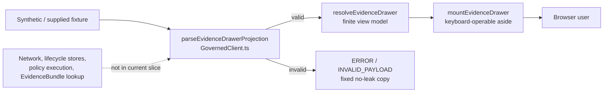
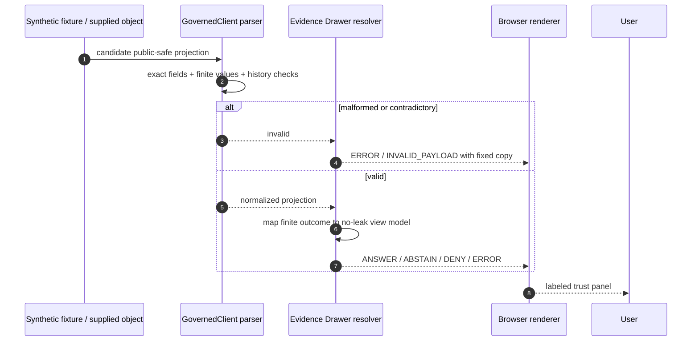

<!-- [KFM_META_BLOCK_V2]
doc_id: kfm://doc/evidence-drawer
title: Evidence Drawer — Current Architecture and Implementation Boundary
type: architecture
version: v2.0.0
status: draft; repository-grounded; bounded-executable; projection-only; live-transport-unverified
owners:
  - "@bartytime4life"
created: 2026-05-25
updated: 2026-08-18
policy_label: public
owning_root: "docs/"
responsibility: Explain the Evidence Drawer trust surface, the current public-safe projection slice, and the boundaries that keep browser rendering subordinate to evidence, policy, review, release, correction, and rollback authority.
base_commit: 75de13010bb615ad9b6b219d52e2e830c924c7ab
prior_blob: ff66403209e9de60dc8ac4d1c6e8dfdc27476b23
directory_governance: ADR-0029 adopts docs/doctrine/directory-rules.md as the sole writable human Directory Rules authority; this same-path architecture page remains under the docs responsibility root.
truth_posture: CONFIRMED current repository evidence; PROPOSED production composition; UNKNOWN live runtime, deployment, and release enforcement unless explicitly identified
related:
  - docs/doctrine/directory-rules.md
  - docs/adr/ADR-0029-adopt-directory-governance-standard-v2.md
  - .github/CODEOWNERS
  - docs/architecture/ui/EVIDENCE_DRAWER.md
  - contracts/ui/evidence_drawer_payload.md
  - contracts/evidence/evidence_drawer_payload.md
  - schemas/contracts/v1/ui/evidence_drawer_payload.schema.json
  - schemas/contracts/v1/evidence/evidence_drawer_payload.schema.json
  - fixtures/ui/evidence_drawer_payload/README.md
  - tools/validators/ui/validate_evidence_drawer_payload.py
  - tests/validators/test_validate_evidence_drawer_payload.py
  - apps/explorer-web/src/adapters/GovernedClient.ts
  - apps/explorer-web/src/features/evidence_drawer/README.md
  - apps/explorer-web/src/features/evidence_drawer/index.tsx
  - apps/explorer-web/tests/evidence-drawer.test.ts
  - .github/workflows/evidence-drawer-payload.yml
tags: [kfm, architecture, ui, evidence-drawer, evidencebundle, evidenceref, trust-membrane, finite-outcomes, accessibility, correction, no-leak]
notes:
  - "EvidenceDrawerPayload is a governed public-safe UI projection. It is not EvidenceBundle closure, policy, review, release, proof storage, correction authority, or publication authority."
  - "The current executable slice is fixture-only and no-network: strict parsing, finite view-state resolution, keyboard-operable rendering, synthetic fixtures, validators, and tests."
  - "Live governed API transport, map-click routing, upstream evidence and policy authenticity, release enforcement, production accessibility, deployment, and public publication remain NEEDS VERIFICATION."
  - "The UI/evidence semantic-contract home seam and the relationship to docs/architecture/ui/EVIDENCE_DRAWER.md remain unresolved; this page does not settle either by repetition."
[/KFM_META_BLOCK_V2] -->

<a id="top"></a>

# Evidence Drawer

> **Operating rule.** The Evidence Drawer renders a governed, public-safe projection of already-evaluated evidence. It never turns map properties, badges, popups, model text, schema validity, or browser state into truth.


| Field | Current bounded result |
|---|---|
| **Evidence snapshot** | `main@75de13010bb615ad9b6b219d52e2e830c924c7ab` |
| **Directory authority** | **CONFIRMED / ACCEPTED:** [ADR-0029](../adr/ADR-0029-adopt-directory-governance-standard-v2.md) adopts [Directory Rules v2](../doctrine/directory-rules.md) |
| **Architecture page** | **CONFIRMED** at this existing path; same-path modernization only |
| **UI projection profile** | **CONFIRMED present / PROPOSED semantics:** closed profile `kfm.explorer.evidence-drawer.public-safe.v1` |
| **Executable browser slice** | **CONFIRMED present:** strict fixture parser, finite resolver, keyboard open/close, focus return, fixed no-leak negative copy |
| **Validation surfaces** | **CONFIRMED present:** closed schema, valid/invalid fixtures, deterministic no-network validator, Python tests, Explorer tests, read-only workflow |
| **Live governed API transport** | **UNKNOWN / not proven by the inspected slice** |
| **Map-click, popup, badge, Focus Mode, export, and correction handoffs** | **NEEDS VERIFICATION** |
| **Production policy/evidence/review/release authenticity** | **UNKNOWN** |
| **Contract-home seam** | **UNRESOLVED:** UI-family bounded profile exists; evidence-family sibling remains `PATH-NEEDS-REVIEW` |
| **Review route** | `@bartytime4life` through [`CODEOWNERS`](../../.github/CODEOWNERS); independent stewardship remains **NEEDS VERIFICATION** |
| **Release/publication effect** | **None.** This page and the bounded fixture slice do not publish a claim |

> [!IMPORTANT]
> **Projection is not closure.** The UI profile can describe finite outcome, citations, trust state, and bounded history. It cannot prove that an `EvidenceRef` resolved, that an `EvidenceBundle` is authentic, that policy allowed disclosure, that review occurred, or that a release is public.

> [!CAUTION]
> **Current executable evidence is intentionally narrow.** The inspected adapter says it is fixture-only and performs no network or lifecycle-store access. Do not describe that slice as a live EvidenceRef-to-EvidenceBundle resolver, production API integration, or deployed public feature.

> [!WARNING]
> **Negative states are no-leak states.** `DENY`, `ERROR`, malformed payloads, and unavailable governed responses must not reflect restricted, diagnostic, or unsupported input text into the browser.

**Quick navigation:** [Status](#0-status--authority) · [Definition](#1-what-the-evidence-drawer-is-and-is-not) · [Placement](#2-where-it-lives) · [Contract](#3-the-current-evidencedrawerpayload-contract) · [Lifecycle](#4-resolution-lifecycle) · [States](#5-trust-visible-states) · [Domains](#6-per-domain-projections) · [Launch surfaces](#7-click-resolution-popups-and-badges) · [Accessibility](#8-accessibility-requirements) · [Anti-patterns](#9-what-the-drawer-must-not-do) · [Review](#10-reviewer-checklist-for-drawer-touching-prs) · [Open items](#11-open-questions-and-needs-verification) · [Glossary](#12-glossary) · [History](#13-changelog)

---

## 0. Status & Authority

### 0.1 Authority order for this page

| Question | Governing evidence |
|---|---|
| Where does an artifact belong? | Accepted [Directory Rules v2](../doctrine/directory-rules.md), accepted ADRs, then current repository evidence |
| What does `EvidenceDrawerPayload` mean? | The applicable semantic contract, paired schema, and any accepted successor decision |
| What is implemented now? | Pinned code, schemas, fixtures, tests, workflows, and generated artifacts tied to a known revision |
| What supports a claim? | Resolved evidence and its authoritative evidence contract; never this page or the browser projection |
| May a field be shown? | Policy, rights, sensitivity, purpose, audience, review, and release state |
| Is a payload public? | Governed release evidence, not schema validity, a passing test, a commit, or a pull request |
| Who reviews repository changes? | Verified `CODEOWNERS` route; role assignments and independent approval remain separate records |

This page explains architecture and current implementation boundaries. It does not amend contracts, schemas, policy, source admission, review authority, release state, or runtime behavior.

### 0.2 Current repository evidence

| Surface | Confirmed state at the pinned snapshot | Safe interpretation |
|---|---|---|
| [`docs/doctrine/directory-rules.md`](../doctrine/directory-rules.md) and [ADR-0029](../adr/ADR-0029-adopt-directory-governance-standard-v2.md) | Directory Rules v2 is the accepted, sole writable human placement authority | This page remains under the existing `docs/architecture/` responsibility lane; the legacy architecture copy of Directory Rules is not authority |
| [`schemas/contracts/v1/ui/evidence_drawer_payload.schema.json`](../../schemas/contracts/v1/ui/evidence_drawer_payload.schema.json) | Closed Draft 2020-12 schema with four finite outcomes, bounded trust state, and optional bounded history | Proves a machine-declared public-safe profile exists; does not prove upstream evidence or public release |
| [`contracts/ui/evidence_drawer_payload.md`](../../contracts/ui/evidence_drawer_payload.md) | Draft v0.3 bounded profile with explicit non-effects and current validation commands | Strongest current UI-facing semantic description |
| [`contracts/evidence/evidence_drawer_payload.md`](../../contracts/evidence/evidence_drawer_payload.md) | Adjacent evidence-family contract marked `PATH-NEEDS-REVIEW`; paired evidence schema is described as a permissive scaffold | The UI/evidence authority split is unresolved; neither file may silently erase the other |
| [`fixtures/ui/evidence_drawer_payload/`](../../fixtures/ui/evidence_drawer_payload/README.md) | Valid and invalid synthetic fixture lanes are present | Supports deterministic declaration testing only |
| [`tools/validators/ui/validate_evidence_drawer_payload.py`](../../tools/validators/ui/validate_evidence_drawer_payload.py) | Closed-schema and cross-field validator; fixture-first; no-network | Checks declaration consistency, correction acyclicity, negative-history non-resolution, and no-leak rules |
| [`tests/validators/test_validate_evidence_drawer_payload.py`](../../tests/validators/test_validate_evidence_drawer_payload.py) | Focused tests assert fixture polarity, schema closure, correction rules, deterministic execution, and network denial | Test source is present; tests were not executed in this documentation-only run |
| [`apps/explorer-web/src/adapters/GovernedClient.ts`](../../apps/explorer-web/src/adapters/GovernedClient.ts) | Strict fixture-only parser for profile `kfm.explorer.evidence-drawer.public-safe.v1`; no transport or lifecycle-store access | Browser boundary fails closed without claiming live API behavior |
| [`apps/explorer-web/src/features/evidence_drawer/index.tsx`](../../apps/explorer-web/src/features/evidence_drawer/index.tsx) | Finite view-model resolver and keyboard-operable `<aside>` renderer | Confirms a bounded app-local rendering slice, not a complete drawer product |
| [`apps/explorer-web/tests/evidence-drawer.test.ts`](../../apps/explorer-web/tests/evidence-drawer.test.ts) | Tests cover ANSWER, stale ABSTAIN, superseded history, DENY/ERROR no-leak, malformed payloads, and no network/store reads | Supports the declared fixture boundary; does not authenticate upstream records |
| [`.github/workflows/evidence-drawer-payload.yml`](../../.github/workflows/evidence-drawer-payload.yml) | Read-only, fixture-only workflow exists for schema/fixtures/tests/receipt integrity | Workflow presence is not a required-check result, release decision, or publication proof |
| [`apps/explorer-web/src/features/evidence_drawer/README.md`](../../apps/explorer-web/src/features/evidence_drawer/README.md) | Repository-grounded feature boundary documents the bounded executable slice and open production gaps | Component README, not architecture authority or runtime proof |
| [`docs/architecture/ui/EVIDENCE_DRAWER.md`](./ui/EVIDENCE_DRAWER.md) | Earlier UI-oriented architecture page remains present | Its relationship to this page needs consolidation or a documented division of responsibility; this change does not decide that migration |

### 0.3 Truth labels

- **CONFIRMED** — verified from the pinned repository state or an accepted decision.
- **PROPOSED** — architecture, profile semantics, production flow, or future work not established as current runtime or authority.
- **UNKNOWN** — insufficient evidence to state a current result.
- **NEEDS VERIFICATION** — a concrete repository, runtime, policy, rights, review, release, accessibility, or deployment check remains.

### 0.4 Non-effects

This page does not:

- resolve an `EvidenceRef` or construct an `EvidenceBundle`;
- activate a source, network connector, route, model runtime, or policy bundle;
- approve rights, sensitivity, review, release, correction, or rollback;
- create a public API, map-click path, Focus Mode path, export path, or deployment;
- make a schema-valid payload truthful or public;
- settle the `contracts/ui/` versus `contracts/evidence/` semantic-home seam;
- supersede, move, rename, or delete [`docs/architecture/ui/EVIDENCE_DRAWER.md`](./ui/EVIDENCE_DRAWER.md);
- publish, promote, release, deploy, or expose lifecycle stores.

[Back to top](#top)

---

## 1. What the Evidence Drawer Is (and Is Not)

### 1.1 Definition

The Evidence Drawer is a browser-side trust panel for a governed `EvidenceDrawerPayload`. Its job is to make the finite outcome and the public-safe projection of evidence, citations, limitations, trust state, and bounded correction or negative history inspectable.

The current executable slice consumes synthetic or supplied payload objects. A future production composition may open the same panel from map features, badges, tables, Focus Mode citations, or other released surfaces, but those launch integrations are not proven by the inspected slice.

### 1.2 It is

1. **A public-safe projection surface.** It renders fields permitted by a closed UI profile.
2. **A finite outcome surface.** It resolves only `ANSWER`, `ABSTAIN`, `DENY`, or `ERROR`.
3. **A fail-closed browser boundary.** Missing, malformed, contradictory, denied, or errored inputs do not become partial answers.
4. **A bounded history surface.** Negative evidence and correction lineage may remain visible only under the profile's non-current rules.
5. **An app-local accessibility surface.** The current renderer provides labeled structure, keyboard open/close, Escape handling, and focus return.

### 1.3 It is not

| It is not | Governing boundary |
|---|---|
| `EvidenceBundle` | Evidence closure remains upstream and separate |
| An EvidenceRef resolver | The inspected adapter performs no network or store access |
| A policy engine | Policy meaning and disclosure decisions must be settled before projection |
| A release or publication authority | Release state cannot be created by UI, schema, tests, workflow, or docs |
| A map popup or badge | Those may become launch affordances; they are not evidence |
| An AI answer surface | Generated language remains governed separately and subordinate to evidence |
| A canonical correction store | The payload may display bounded lineage; it does not issue or authenticate corrections |
| A direct lifecycle-store client | Browser access to RAW, WORK, QUARANTINE, PROCESSED, CATALOG/TRIPLET, proofs, or internal stores is forbidden |
| A claim derived from feature properties | Renderer properties are interaction context, not authoritative support |

### 1.4 Current bounded architecture


```mermaid
flowchart LR
    F["Synthetic / supplied fixture"] --> P["parseEvidenceDrawerProjection<br/>GovernedClient.ts"]
    P -->|valid| R["resolveEvidenceDrawer<br/>finite view model"]
    P -->|invalid| E["ERROR / INVALID_PAYLOAD<br/>fixed no-leak copy"]
    R --> M["mountEvidenceDrawer<br/>keyboard-operable aside"]
    M --> U["Browser user"]

    X["Network, lifecycle stores,<br/>policy execution, EvidenceBundle lookup"] -. "not in current slice" .-> P
```

The dashed path is intentionally absent from the current fixture-only implementation.

[Back to top](#top)

---

## 2. Where It Lives

The target is an existing architecture page under the `docs/` responsibility root. Accepted Directory Rules place semantic meaning in `contracts/`, machine shape in `schemas/`, executable app composition in `apps/`, reusable fixtures in `fixtures/`, validators in `tools/validators/`, tests in `tests/` or the owning app, and workflow orchestration in `.github/workflows/`.

| Responsibility | Current path | Status and boundary |
|---|---|---|
| Cross-cutting architecture | `docs/architecture/evidence-drawer.md` | This page; repository-grounded explanation |
| UI-oriented architecture companion | `docs/architecture/ui/EVIDENCE_DRAWER.md` | Existing overlapping page; consolidation relationship unresolved |
| UI-facing semantic profile | `contracts/ui/evidence_drawer_payload.md` | Confirmed draft bounded profile |
| Evidence-facing sibling semantics | `contracts/evidence/evidence_drawer_payload.md` | Confirmed, `PATH-NEEDS-REVIEW` |
| UI machine shape | `schemas/contracts/v1/ui/evidence_drawer_payload.schema.json` | Confirmed closed public-safe profile |
| Evidence-family machine scaffold | `schemas/contracts/v1/evidence/evidence_drawer_payload.schema.json` | Confirmed sibling surface; final authority unresolved |
| Reusable synthetic examples | `fixtures/ui/evidence_drawer_payload/{valid,invalid}/` | Confirmed |
| Deterministic declaration validator | `tools/validators/ui/validate_evidence_drawer_payload.py` | Confirmed, no-network |
| Validator tests | `tests/validators/test_validate_evidence_drawer_payload.py` | Confirmed |
| Browser parser | `apps/explorer-web/src/adapters/GovernedClient.ts` | Confirmed fixture-only parser |
| Browser view model and renderer | `apps/explorer-web/src/features/evidence_drawer/index.tsx` | Confirmed bounded implementation |
| Feature boundary documentation | `apps/explorer-web/src/features/evidence_drawer/README.md` | Confirmed |
| Explorer unit tests | `apps/explorer-web/tests/evidence-drawer.test.ts` | Confirmed |
| Read-only CI orchestration | `.github/workflows/evidence-drawer-payload.yml` | Confirmed |

### 2.1 Domain integration is not uniform

The repository must not be summarized as having complete per-domain drawer integration merely because domain-named files exist.

- [`apps/explorer-web/src/features/domains/hydrology/EvidenceDrawer.tsx`](../../apps/explorer-web/src/features/domains/hydrology/EvidenceDrawer.tsx) currently re-exports the generic Evidence Drawer implementation.
- [`apps/explorer-web/src/features/domains/archaeology/EvidenceDrawer.tsx`](../../apps/explorer-web/src/features/domains/archaeology/EvidenceDrawer.tsx) is still a greenfield placeholder.

These two confirmed examples prove that domain integration maturity is uneven. A complete domain inventory requires a separate pinned scan. Domain wrappers must not create parallel evidence, policy, schema, or release authority.

[Back to top](#top)

---

## 3. The Current `EvidenceDrawerPayload` Contract

The current bounded machine profile is defined by [`schemas/contracts/v1/ui/evidence_drawer_payload.schema.json`](../../schemas/contracts/v1/ui/evidence_drawer_payload.schema.json) and explained by [`contracts/ui/evidence_drawer_payload.md`](../../contracts/ui/evidence_drawer_payload.md).

### 3.1 Profile and top-level fields

| Field | Current machine meaning |
|---|---|
| `profile` | Exact constant `kfm.explorer.evidence-drawer.public-safe.v1` |
| `id` | Bounded projection identifier |
| `outcome` | `ANSWER`, `ABSTAIN`, `DENY`, or `ERROR` |
| `reason_code` | Stable public-safe reason |
| `title`, `summary` | Governed display text; negative states use fixed browser copy |
| `evidence_refs` | Bounded public-safe evidence identifiers permitted by the outcome |
| `citations` | Bounded HTTPS citations permitted by the outcome |
| `limitations` | Public-safe caveats |
| `trust_state` | Source role, policy, review, release, freshness, and correction labels |
| `history` | Optional bounded negative outcomes and correction edges |

The schema is closed with `additionalProperties: false`. Unknown fields fail validation.

### 3.2 Trust-state dimensions

| Dimension | Current values |
|---|---|
| `source_role` | `authoritative`, `official`, `derived`, `context` |
| `policy` | `ALLOW`, `ABSTAIN`, `DENY`, `ERROR` |
| `review` | `REVIEWED`, `PENDING`, `NOT_APPLICABLE` |
| `release` | `RELEASED`, `UNRELEASED`, `WITHDRAWN` |
| `freshness` | `CURRENT`, `STALE`, `UNKNOWN` |
| `correction` | `NONE`, `CURRENT`, `CORRECTED`, `SUPERSEDED` |

These labels are projection declarations. The browser does not authenticate them.

### 3.3 Cross-field rules enforced by the current validator and parser

#### `ANSWER`

- `reason_code` is `SUPPORTED`;
- evidence references and citations are nonempty;
- policy is `ALLOW`;
- review is `REVIEWED`;
- release is `RELEASED`;
- freshness is `CURRENT`;
- superseded evidence cannot answer;
- correction history, when present, is complete, acyclic, and terminates in current support.

#### `ABSTAIN`

- uses a non-supported reason and policy `ABSTAIN`;
- may retain bounded public-safe evidence references or negative history where the reason permits;
- superseded, held, withdrawn, or revoked reasons require matching non-current history;
- never upgrades stale or unresolved support into an answer.

#### `DENY`

- uses a non-supported reason and policy `DENY`;
- exposes no evidence references, citations, or history identifiers;
- browser copy is fixed so restricted input text is not reflected.

#### `ERROR`

- uses `UPSTREAM_ERROR` and policy `ERROR`;
- exposes no evidence references, citations, or history;
- malformed projections become the app-local `INVALID_PAYLOAD` error state;
- absent input becomes the app-local `NO_GOVERNED_RESPONSE` abstention state.

### 3.4 Bounded history

A negative-history item declares:

- a safe evidence identifier;
- state `HELD`, `DENIED`, `SUPERSEDED`, `REVOKED`, or `WITHDRAWN`;
- a matching reason code;
- canonical UTC-second recording time;
- `visible_in_runtime: true`;
- `resolvable_as_current: false`.

Correction edges must be unique, acyclic, non-self-referential, and bound to superseded prior evidence. Only a terminal correction target may support the current answer.

### 3.5 Authority limit

> [!IMPORTANT]
> A schema-valid payload is only a valid projection candidate. It does not establish evidence authenticity, policy approval, review authority, release status, correction authenticity, rollback completion, deployment, or public publication.

[Back to top](#top)

---

## 4. Resolution Lifecycle

### 4.1 Confirmed fixture-only path


```mermaid
sequenceDiagram
    autonumber
    participant F as Synthetic fixture / supplied object
    participant G as GovernedClient parser
    participant V as Evidence Drawer resolver
    participant B as Browser renderer
    participant U as User

    F->>G: candidate public-safe projection
    G->>G: exact fields + finite values + history checks
    alt malformed or contradictory
        G-->>V: invalid
        V-->>B: ERROR / INVALID_PAYLOAD with fixed copy
    else valid
        G-->>V: normalized projection
        V->>V: map finite outcome to no-leak view model
        V-->>B: ANSWER / ABSTAIN / DENY / ERROR
    end
    B-->>U: labeled trust panel
```

Confirmed behavior:

1. No network request is made by the inspected parser or drawer feature.
2. No lifecycle-store path is read.
3. Missing input becomes a bounded abstention.
4. Invalid input becomes a fixed error state.
5. `DENY` and `ERROR` suppress evidence, citations, history, and untrusted text.
6. `ANSWER` renders only parsed governed fields.
7. History remains separate from current support.

### 4.2 Proposed production composition

A production path would require, at minimum:

```text
released interaction context
  -> governed request
  -> policy / rights / sensitivity precheck
  -> EvidenceRef resolution and EvidenceBundle integrity checks
  -> citation, review, release, correction, and rollback checks
  -> public-safe EvidenceDrawerPayload projection
  -> current strict parser
  -> finite browser view
```

The following are **NEEDS VERIFICATION** or **UNKNOWN** at the pinned snapshot:

- live request transport and endpoint shape;
- map feature, popup, badge, table, Story Node, or Focus Mode launch wiring;
- authoritative EvidenceRef-to-EvidenceBundle lookup;
- source-rights and sensitivity enforcement;
- review and release authenticity;
- correction-store lookup and cache invalidation;
- production telemetry and audit receipts;
- deployment configuration and public accessibility;
- required-check enforcement.

### 4.3 Fail-closed order

The production design must preserve this order:

1. validate the request and actor context;
2. apply rights, sensitivity, access, and release prechecks;
3. resolve admissible evidence;
4. verify citations and integrity;
5. project only public-safe fields;
6. validate the closed UI payload;
7. render one finite outcome.

A browser fallback to layer properties, popup text, cached model output, or a permissive sibling schema is forbidden.

[Back to top](#top)

---

## 5. Trust-Visible States

The current public profile has **four outcomes**, not ten independent top-level outcomes. Freshness, review, release, correction, and negative history refine those outcomes.

### 5.1 Outcome table

| Outcome | Typical current reasons | Browser posture |
|---|---|---|
| `ANSWER` | `SUPPORTED` | Render governed title, summary, evidence refs, HTTPS citations, limitations, trust labels, and safe correction history |
| `ABSTAIN` | `MISSING_EVIDENCE`, `STALE_EVIDENCE`, `CITATION_UNRESOLVED`, `HELD_EVIDENCE`, `SUPERSEDED_EVIDENCE`, `WITHDRAWN_EVIDENCE`, `REVOKED_EVIDENCE` | Render fixed reason copy; show only bounded details permitted by the profile |
| `DENY` | `POLICY_DENIED`, `RIGHTS_UNRESOLVED`, `SENSITIVE_DETAIL_RESTRICTED` | Render fixed no-leak copy; expose no evidence, citations, or history |
| `ERROR` | `UPSTREAM_ERROR` | Render fixed error copy; expose no evidence or diagnostics |

The app-local `INVALID_PAYLOAD` and `NO_GOVERNED_RESPONSE` codes are view-model safeguards, not schema `reason_code` values.

### 5.2 State refinements

- **Stale** is currently an `ABSTAIN` with `STALE_EVIDENCE`, not an `ANSWER` warning.
- **Superseded**, **withdrawn**, **revoked**, and **held** evidence remains non-current history.
- **Corrected** may be an `ANSWER` only when the correction chain is complete and the terminal evidence ref is current support.
- **Denied** history is not exposed in a public `DENY` projection.
- **No data** has no separate schema outcome; a future semantics decision must map it explicitly without inventing a fifth finite outcome.
- **Degraded** has no current top-level outcome or reason code; adding one requires contract/schema/parser/test review rather than UI-only invention.

### 5.3 Visual treatment

The current TypeScript slice creates semantic text labels and ARIA state. It does not by itself prove production colors, icons, contrast, motion, responsive layout, or localization. Those remain UI implementation and accessibility obligations, not facts established by this page.

[Back to top](#top)

---

## 6. Per-Domain Projections

### 6.1 Shared profile, domain-owned meaning

The current bounded UI profile is generic. Domain-owned services or fixtures may supply:

- domain claim labels and scope;
- evidence identifiers and citations;
- source-role and limitation text;
- rights and sensitivity outcomes;
- review, release, freshness, and correction state.

Those values must be settled upstream by the owning domain and governance surfaces. The generic browser component must not hard-code domain truth, rewrite domain caveats, or introduce a parallel domain schema merely for presentation.

### 6.2 Current maturity is uneven

The confirmed Hydrology wrapper re-exports the generic drawer. The confirmed Archaeology wrapper remains a placeholder. This page therefore does not claim complete domain coverage, uniform route support, or identical domain fixtures.

A later domain-conformance inventory should classify each domain surface as one of:

- generic re-export;
- bounded domain adapter;
- placeholder;
- bespoke implementation requiring convergence;
- absent;
- not inspected.

### 6.3 Sensitive domains

For archaeology, fauna, flora, people/DNA/land, infrastructure, or any other sensitive lane:

- restricted values must be removed before the browser projection;
- `DENY` must not disclose evidence or history identifiers;
- generalization, redaction, consent, sovereignty, purpose, and audience decisions remain upstream;
- the drawer may display a public-safe reason code, not the protected rule body or exact detail;
- a map style, hidden DOM node, popup, or client filter is not a sensitivity control.

[Back to top](#top)

---

## 7. Click Resolution, Popups, and Badges

### 7.1 Architectural roles

| Surface | Permitted role | Prohibited role |
|---|---|---|
| Map feature | Launch context with stable feature/layer identity | Evidence or policy authority |
| Popup / tooltip | Short non-consequential teaser and launch affordance | Complete citation or trust surface |
| Trust / attestation badge | Finite state indicator linked to inspectable support | Proof by color or icon |
| Evidence Drawer | Full public-safe projection of the governed outcome | Evidence creation, policy execution, or release |
| Focus Mode citation | Launch context for inspecting cited support | Back channel to raw model output |
| Export / screenshot | Carrier that preserves release and citation context when implemented | Independent truth artifact |

### 7.2 Current implementation boundary

The inspected Evidence Drawer slice exposes a local `mountEvidenceDrawer` trigger for deterministic browser testing. It does not prove:

- MapLibre click event wiring;
- popup or badge routing;
- stable feature-to-payload request identity;
- Focus Mode citation handoff;
- export/share preservation;
- production governed-client transport.

Those integrations should reuse the strict parser and finite view model rather than bypass them.

### 7.3 Anti-substitution rule

A popup, badge, map property, layer description, screenshot, Story Node, or AI answer cannot stand in for the drawer. Conversely, the drawer cannot stand in for the underlying `EvidenceBundle`, policy decision, review record, release manifest, correction notice, or rollback record.

[Back to top](#top)

---

## 8. Accessibility Requirements

Accessibility is part of the trust surface because an evidence explanation that some users cannot reach or understand is not fully inspectable.

### 8.1 Confirmed in the current bounded renderer

The current `mountEvidenceDrawer` implementation provides:

- a native button to open the panel;
- `aria-controls` and `aria-expanded`;
- an `<aside>` with `role="complementary"`;
- `aria-labelledby` and outcome-dependent `aria-live`;
- a native close button;
- Escape-to-close behavior;
- focus movement into the drawer;
- focus return to the prior connected element or trigger;
- labeled lists for trust state, evidence refs, citations, history, and limitations;
- fixed no-leak text for negative and invalid states.

### 8.2 Needs verification before production claims

- focus trapping and behavior with multiple interactive controls;
- reduced-motion support;
- responsive/mobile behavior;
- non-map alternative navigation;
- color, icon, and text parity;
- visual contrast and high-contrast modes;
- screen-reader testing across supported browsers;
- heading and landmark integration inside the full Explorer shell;
- localization and long-text behavior;
- production browser tests against live transport;
- accessibility enforcement as a required release check.

### 8.3 Accessibility failure posture

A payload or renderer that leaks restricted text, loses finite state, strands focus, or makes trust state imperceptible must fail closed. This page does not claim that all production accessibility gates are currently enforced.

[Back to top](#top)

---

## 9. What the Drawer MUST NOT Do

| Anti-pattern | Failure | Required correction |
|---|---|---|
| **Drawer as truth** | UI text or map properties become claim support | Resolve and cite authoritative evidence upstream or abstain |
| **Direct network/store access** | Browser reads lifecycle, proof, model, or canonical stores | Route through the governed trust membrane; keep browser projection-only |
| **Client-side policy** | UI recomputes sensitivity or hides fields with CSS | Remove restricted values server-side and project only allowed state |
| **Permissive fallback** | Closed UI profile fails, then a sibling permissive schema is accepted | Return `INVALID_PAYLOAD`; resolve schema authority separately |
| **DENY or ERROR reflection** | Restricted or diagnostic input text appears in output | Use fixed no-leak copy and empty support/history fields |
| **ABSTAIN upgraded to ANSWER** | Stale or unresolved evidence is displayed as fact | Preserve finite outcome and reason code |
| **History as current support** | Held, denied, superseded, revoked, or withdrawn ref appears in current evidence | Reject the payload |
| **Correction cycle** | Prior and active refs form a loop or ambiguous chain | Reject; require acyclic terminal binding |
| **Badge as proof** | Visual state has no inspectable support path | Make the badge a launch affordance only |
| **Popup as drawer** | Teaser carries full trust semantics without governed projection | Open the drawer for consequential inspection |
| **Direct model text** | Generated language appears as evidence | Use governed AI envelopes and cited evidence; drawer stays evidence-facing |
| **Per-domain authority fork** | Domain UI redefines shared finite outcomes or evidence meaning | Reuse the shared profile; specialize upstream data and limitations |
| **Schema pass as publication** | Validator result is presented as released truth | Require evidence, policy, review, release, correction, and rollback closure |
| **Documentation as runtime proof** | This page or a README is cited as proof of live behavior | Verify code, tests, workflows, artifacts, and runtime state |

[Back to top](#top)

---

## 10. Reviewer Checklist for Drawer-Touching PRs

A change is drawer-touching when it modifies the UI profile, contracts, fixtures, validator, Explorer parser, view model, renderer, tests, workflow, launch integration, or upstream producer.

### Authority and placement

- [ ] The owning responsibility root is identified.
- [ ] No new parallel evidence, contract, schema, policy, source, proof, release, or correction home is created.
- [ ] The unresolved UI/evidence contract-home seam is not silently declared resolved.
- [ ] `@bartytime4life` is used only as the verified GitHub review route; unverified steward identities are not invented.

### Contract and parser parity

- [ ] Profile identifier, required fields, outcomes, reason codes, and trust-state enums remain synchronized.
- [ ] Unknown fields fail closed.
- [ ] `ANSWER`, `ABSTAIN`, `DENY`, and `ERROR` cross-field rules remain exact.
- [ ] App-local `INVALID_PAYLOAD` and `NO_GOVERNED_RESPONSE` are not added to the wire schema by accident.
- [ ] A breaking profile change is versioned and reviewed with migration/rollback evidence.

### Evidence, policy, and no-leak boundary

- [ ] Browser code performs no direct lifecycle-store, proof-store, model-runtime, or canonical-store read.
- [ ] `DENY` and `ERROR` expose no evidence refs, citations, history, or untrusted text.
- [ ] Restricted values are removed upstream, not hidden in the DOM or by style.
- [ ] ABSTAIN reasons and non-current history remain visible only within public-safe bounds.
- [ ] Schema validity is not described as evidence or release proof.

### Correction and history

- [ ] Negative state and reason code agree.
- [ ] Historical evidence does not overlap current support.
- [ ] Correction edges are unique, acyclic, and non-self-referential.
- [ ] Every correction prior is represented as superseded history.
- [ ] Every terminal correction target supporting an answer is current.

### Accessibility

- [ ] Keyboard open, close, Escape, and focus return remain tested.
- [ ] Landmarks, labels, and live regions match the rendered outcome.
- [ ] No state relies on color alone.
- [ ] New interactive content has a defined focus order and non-map alternative.
- [ ] Production-only accessibility claims are backed by production-oriented evidence.

### Validation

Current repository-native focused commands are:

```bash
python tools/validators/ui/validate_evidence_drawer_payload.py --fixtures
python -m unittest -q tests.validators.test_validate_evidence_drawer_payload
pnpm --filter explorer-web test
pnpm --filter explorer-web build
```

The dedicated workflow is [`.github/workflows/evidence-drawer-payload.yml`](../../.github/workflows/evidence-drawer-payload.yml). A green run proves only its bounded checks. It does not resolve evidence, execute policy, authenticate review, authorize release, deploy, or publish.

[Back to top](#top)

---

## 11. Open Questions and NEEDS VERIFICATION

| ID | Status | Question or gap | Closure evidence |
|---|---|---|---|
| `OPEN-EVD-01` | **NEEDS VERIFICATION** | What is the final semantic authority split between `contracts/ui/evidence_drawer_payload.md` and `contracts/evidence/evidence_drawer_payload.md`? | Accepted decision or contract migration with schema, fixture, validator, reference, and rollback closure |
| `OPEN-EVD-02` | **NEEDS VERIFICATION** | Should `docs/architecture/evidence-drawer.md` and `docs/architecture/ui/EVIDENCE_DRAWER.md` be consolidated, or retain distinct whole-system/UI responsibilities? | Documentation-system decision, inbound-link inventory, stable-anchor plan, and reversible migration |
| `OPEN-EVD-03` | **UNKNOWN** | Which live governed API endpoint and request envelope, if any, currently serves this profile? | Pinned route/config/code plus representative no-network or runtime test |
| `OPEN-EVD-04` | **UNKNOWN** | Is EvidenceRef-to-EvidenceBundle resolution integrated into the drawer path? | Resolver contract, repository abstraction, policy/review/release checks, fixtures, tests, and runtime evidence |
| `OPEN-EVD-05` | **NEEDS VERIFICATION** | Which domain wrappers are generic re-exports, bounded adapters, placeholders, bespoke forks, or absent? | Commit-pinned recursive inventory and convergence plan |
| `OPEN-EVD-06` | **UNKNOWN** | Are map click, popup, badge, Focus Mode, table, Story Node, export, and share launch paths wired to the strict profile? | Integration tests and current route/adapter evidence |
| `OPEN-EVD-07` | **UNKNOWN** | Which upstream component guarantees source rights, sensitive-field removal, review authenticity, release state, and correction completeness? | Accepted authority map, policy tests, and end-to-end fixtures |
| `OPEN-EVD-08` | **NEEDS VERIFICATION** | Should no-data or degraded service receive new reason codes, or map to existing outcomes? | Contract/schema decision with parser, fixture, accessibility, and migration tests |
| `OPEN-EVD-09` | **UNKNOWN** | Are production accessibility obligations enforced across supported browsers and non-map paths? | Browser matrix, screen-reader review, contrast/motion checks, and required CI evidence |
| `OPEN-EVD-10` | **UNKNOWN** | Are the dedicated workflow and aggregate UI checks required by branch/ruleset policy? | Current GitHub ruleset and required-check evidence |
| `OPEN-EVD-11` | **UNKNOWN** | Does a released correction invalidate cached drawer projections, exports, search, map state, and AI citations? | Correction/withdrawal propagation rehearsal and rollback receipt |
| `OPEN-EVD-12` | **NEEDS VERIFICATION** | Is the generated authoring receipt still current against all bound artifact bytes? | Receipt validator result tied to the exact branch head |

[Back to top](#top)

---

## 12. Glossary

| Term | Meaning |
|---|---|
| **Evidence Drawer** | Browser-side trust panel that renders one governed public-safe projection and finite outcome |
| **`EvidenceDrawerPayload`** | Closed UI projection profile; not evidence closure or release authority |
| **`EvidenceRef`** | Governed pointer whose authoritative resolution remains upstream |
| **`EvidenceBundle`** | Evidence-bearing object that outranks UI and generated language |
| **Projection** | Upstream transformation from governed evidence/policy/review/release state into fields safe for a particular UI audience |
| **Finite outcome** | `ANSWER`, `ABSTAIN`, `DENY`, or `ERROR` |
| **Reason code** | Stable public-safe explanation of the finite outcome |
| **Trust state** | Projection labels for source role, policy, review, release, freshness, and correction |
| **Negative history** | Held, denied, superseded, revoked, or withdrawn evidence retained as non-current audit context |
| **Correction chain** | Acyclic mapping from superseded prior evidence to a terminal active evidence ref |
| **No-leak copy** | Fixed browser text that prevents denied, errored, malformed, or diagnostic input from being reflected |
| **Fixture-only** | Current bounded execution over synthetic/supplied files or objects without live source, network, or lifecycle-store access |
| **Trust membrane** | Governed boundary that must resolve evidence and apply policy before public-safe projection |
| **Launch surface** | Map feature, popup, badge, table, Focus Mode citation, Story Node, or export affordance that may open the drawer but cannot supply truth |

[Back to top](#top)

---

## 13. Changelog

### v2.0.0 — 2026-08-18

**Change class:** same-path, repository-grounded semantic modernization.

- Replaced the obsolete no-repository posture with a pinned current-state inventory.
- Replaced the legacy architecture-copy Directory Rules authority with accepted ADR-0029 and `docs/doctrine/directory-rules.md`.
- Recorded the actual closed UI schema, UI semantic contract, fixtures, validator, tests, workflow, fixture-only parser, view-state resolver, and renderer.
- Corrected the old ten-state model to the current four finite outcomes plus trust-state and history refinements.
- Removed the illustrative schema and speculative route, package, policy, SLO, and per-domain completeness claims.
- Distinguished confirmed no-network browser behavior from unverified live governed API, EvidenceBundle resolution, map-click, Focus Mode, export, and deployment paths.
- Recorded the unresolved UI/evidence contract-home seam and the overlapping UI architecture page without deciding a migration.
- Added current no-leak, correction-chain, accessibility, reviewer, validation, and rollback boundaries.
- Preserved the established numbered sections `0` through `13` for inbound-anchor stability.

### v1.0 — 2026-05-25

Initial doctrine-oriented component architecture. The edition remains useful as lineage, but its no-mounted-repo assumptions, proposed-only implementation claims, illustrative schema, route proposals, state taxonomy, and Directory Rules references are superseded by v2.0.0 at this same path.

### Rollback

Restore prior blob `ff66403209e9de60dc8ac4d1c6e8dfdc27476b23`. No contract, schema, fixture, validator, test, workflow, app code, data, release object, or runtime state is changed by this documentation-only update.

[Back to top](#top)
