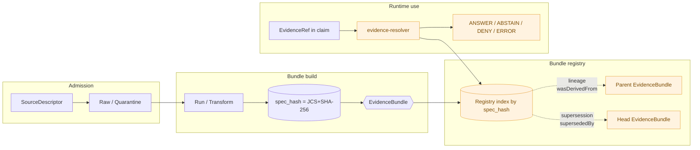
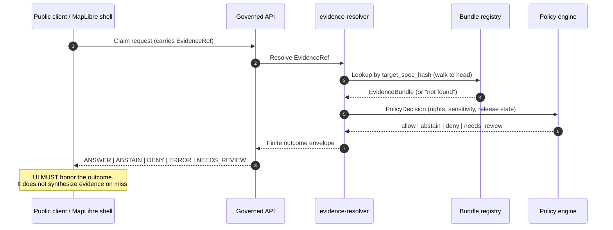

<a id="top"></a>
<!-- [KFM_META_BLOCK_V2]
doc_id: kfm://doc/architecture/evidence-identity
title: Kansas Frontier Matrix — Evidence & Identity (Architecture Note)
type: architecture
version: v0.1 (draft)
status: draft
owners: <ARCHITECTURE_STEWARD>  # PROPOSED — placeholder pending owner assignment
created: 2026-05-25
updated: 2026-05-25
policy_label: public
related:
  - docs/doctrine/directory-rules.md
  - docs/doctrine/truth-posture.md
  - docs/doctrine/trust-membrane.md
  - docs/doctrine/lifecycle-law.md
  - docs/architecture/contract-schema-policy-split.md
  - docs/architecture/governed-api.md
  - docs/architecture/connected-dots-architecture-brief.md
  - docs/adr/ADR-0001-schema-home.md
  - docs/standards/PROV.md
  - contracts/evidence/evidence_ref.md
  - contracts/evidence/evidence_bundle.md
  - schemas/contracts/v1/evidence/
  - packages/evidence-resolver/
tags: [kfm, architecture, evidence, evidencebundle, evidenceref, identity, spec-hash, jcs, cite-or-abstain, trust-membrane]
notes:
  - All repository paths are PROPOSED; no mounted repo, CI, or runtime was inspected in this session.
  - Schema field lists are PROPOSED per Pass-32 (KFM-P26-PROG-0004, KFM-P26-PROG-0005); they are not asserted as live schema content.
  - Owner, last-updated metadata, and badge link targets are placeholders pending verification.
[/KFM_META_BLOCK_V2] -->

# Kansas Frontier Matrix — Evidence & Identity

**How KFM names what counts as evidence, how it makes that identity reproducible, and how the runtime resolver turns identity into a finite, trust-bearing answer.**


> **Status:** draft · **Owners:** `<ARCHITECTURE_STEWARD>` (placeholder) · **Updated:** 2026-05-25

> [!IMPORTANT]
> **This note is doctrine synthesis, not implementation evidence.** Doctrine claims (the existence and role of `EvidenceBundle`, `EvidenceRef`, the JCS+SHA-256 spec-hash convention, the trust-membrane invariant) are **CONFIRMED at doctrine rank**. Specific schema field lists, file paths, package names, and CI/runtime behavior are **PROPOSED** or **NEEDS VERIFICATION** until checked against a mounted repository.

---

## Contents

- [1. Purpose & scope](#1-purpose--scope)
- [2. Where this note belongs](#2-where-this-note-belongs)
- [3. The object family](#3-the-object-family)
- [4. Deterministic identity](#4-deterministic-identity)
- [5. `EvidenceBundle`](#5-evidencebundle)
- [6. `EvidenceRef`](#6-evidenceref)
- [7. Bundle registry · lineage · supersession](#7-bundle-registry--lineage--supersession)
- [8. The resolver as trust membrane](#8-the-resolver-as-trust-membrane)
- [9. Source-role anti-collapse and identity](#9-source-role-anti-collapse-and-identity)
- [10. Schema, contract, and code homes](#10-schema-contract-and-code-homes)
- [11. Tensions & open questions](#11-tensions--open-questions)
- [12. Anti-patterns](#12-anti-patterns)
- [13. Acceptance criteria](#13-acceptance-criteria)
- [14. Appendix — illustrative shapes](#14-appendix--illustrative-shapes)
- [15. Related docs](#15-related-docs)

---

## 1. Purpose & scope

This note is the architecture-level explanation of **how KFM identifies evidence and binds it to claims**. It sits between the human doctrine in `docs/doctrine/` and the machine artifacts under `contracts/evidence/`, `schemas/contracts/v1/evidence/`, `policy/`, and `packages/evidence-resolver/`. It explains the contract a reader needs to keep in mind when reading any KFM published claim: *what is the thing being identified, how is its identity computed, and what does the runtime do with it.* **[CONFIRMED — doctrine; PROPOSED — paths]**

**In scope.** The `EvidenceBundle` / `EvidenceRef` pair, deterministic identity (`spec_hash`), the source-role-aware identity rule, the bundle registry and its lineage/supersession structure, the finite-outcome resolver envelope, and the relationship of all of the above to the RAW → PUBLISHED lifecycle.

**Out of scope.** Field-level schemas (those live under `schemas/contracts/v1/evidence/` — **PROPOSED**); the semantic contract Markdown for each object (those live under `contracts/evidence/` — **PROPOSED**); admissibility policy (`policy/` — **PROPOSED**); the governed-API surface (`docs/architecture/governed-api.md` — **NEEDS VERIFICATION**); and the trust-membrane invariant at full doctrinal depth (`docs/doctrine/trust-membrane.md` — **NEEDS VERIFICATION**).

> [!NOTE]
> **One-line rule.** *Every public KFM claim that depends on evidence resolves its `EvidenceRef` to an `EvidenceBundle` through a governed resolver, or it abstains.* **[PROPOSED — per KFM-P1-PROG-0013, KFM-P26-IDEA-0006; CONFIRMED at doctrine rank in Pass-20 Part II]**

[Back to top](#top)

---

## 2. Where this note belongs

Per `directory-rules.md` v1.3 §6.1 and the *KFM Unified Implementation Architecture Build Manual* §5.1, architecture notes are placed under `docs/architecture/`. The proposed canonical path of this file is therefore:

```text
docs/architecture/evidence-identity.md   # PROPOSED — Directory Rules §6.1, Build Manual §5.1
```

**Directory Rules basis.** `docs/` *explains*; `contracts/` *defines meaning*; `schemas/` *defines shape*; `policy/` *defines admissibility*; `packages/` *implements*. This note belongs in `docs/architecture/` because its job is to explain how those four artifacts cooperate — not to be any one of them. **[CONFIRMED — Directory Rules §6.1, §6.3, §6.4, §6.5; PROPOSED — exact filename and slot]**

| Question | Where the answer lives | Status |
|---|---|---|
| What does an `EvidenceBundle` *mean*? | `contracts/evidence/evidence_bundle.md` | **PROPOSED** |
| What *shape* is enforced? | `schemas/contracts/v1/evidence/evidence_bundle.schema.json` | **PROPOSED** — KFM-P26-PROG-0004 |
| What *gates* its admission and release? | `policy/` (evidence and release lanes) | **PROPOSED** |
| How is it *resolved* at runtime? | `packages/evidence-resolver/` | **PROPOSED** — KFM-P26-PROG-0008, Directory Rules §6.7.2 glossary |
| How is its *identity* computed? | This note + `docs/standards/PROV.md` + (proposed) `docs/standards/CANONICALIZATION.md` | **PROPOSED** |

[Back to top](#top)

---

## 3. The object family

The evidence-identity object family is small and load-bearing. Each row below is **CONFIRMED at doctrine rank** in the *KFM Unified Implementation Architecture Build Manual* §7.1 and the KFM Encyclopedia; the *placement column* is **PROPOSED**.

| Object | One-line role | Public on release? | Proposed home |
|---|---|---|---|
| `SourceDescriptor` | Admission record for a source — identity, role, rights, cadence. | Only safe metadata. | `data/registry/source_descriptors/` |
| `EvidenceRef` | Small, portable pointer to evidence that must be resolved before use. | Yes, where safe. | `contracts/evidence/evidence_ref.md` + `schemas/contracts/v1/evidence/evidence_ref.schema.json` |
| `EvidenceBundle` | Resolved, policy-safe evidence context for a claim — the **canonical evidence artifact**. | Yes, where safe. | `contracts/evidence/evidence_bundle.md` + `schemas/contracts/v1/evidence/evidence_bundle.schema.json` + `data/proofs/` (instances) |
| `RunReceipt` | Pins a pipeline/tool action to inputs, outputs, policy, hashes, tool versions. | Referenced in proof. | `data/receipts/` |
| `AIReceipt` | Model/tool invocation metadata. **No private chain-of-thought storage.** | Administrative/proof. | `data/receipts/` |
| `PolicyDecision` | Allow/deny/abstain/error result with reasons. | Summary visible; sensitive reasons may be redacted. | `data/receipts/` (envelope) / `policy/` (rules) |
| `ValidationReport` | Machine result of schema/geometry/catalog/citation/policy checks. | Summary visible. | `data/proofs/` |
| `PromotionReceipt` | Auditable state-transition record across promotion gates. | Summary visible. | `release/` |

> [!NOTE]
> **`artifacts/` is not the home for any of these.** Trust-bearing receipts and proofs live under `data/receipts/`, `data/proofs/`, and `release/`. `artifacts/` is build/docs/qa scratch. **[CONFIRMED — Directory Rules §13]**

[Back to top](#top)

---

## 4. Deterministic identity

KFM identifies trust-bearing records by **content**, not by file path or by a name a human assigned.

### 4.1 The `spec_hash` rule

**CONFIRMED — Pass-10 C1-02.** A KFM `spec_hash` is computed by canonicalizing the record to a deterministic byte sequence and taking SHA-256 over those bytes. The recorded form is `jcs:sha256:<hex>`. Canonicalization removes whitespace variance, sorts keys, and normalizes numbers, so two implementations producing the same logical object always produce the same hash.

| Canonicalization | When to use | Hash form | Status |
|---|---|---|---|
| **RFC 8785 JCS** | Default for JSON records (receipts, schemas, contracts, evidence bundles). | `jcs:sha256:<hex>` | **CONFIRMED — Pass-10 C1-02** |
| **URDNA2015 + N-Quads** | Reserved for cases where RDF-semantic equivalence is the relevant invariant (e.g., federated SPARQL). | `urdna2015:sha256:<hex>` | **CONFIRMED — Pass-10 C8-05; tension flagged §11.1** |

> [!CAUTION]
> Hashing developer-formatted JSON **is not acceptable** — trivial reformatting silently breaks re-runs, audits, and `spec_hash` gates. The canonicalization step is the load-bearing part, not the hash function. **[CONFIRMED — Pass-10 C1-02]**

### 4.2 Source-role-aware identity for domain objects

For domain-level objects (the dozens of object types under the eleven KFM domains), the Pass-23/32 Atlas records a **PROPOSED deterministic basis**:

```text
identity := H( source_id ‖ object_role ‖ temporal_scope ‖ normalized_digest )
```

where `H` is the JCS+SHA-256 procedure of §4.1, `source_id` and `object_role` are admission-time fields on the `SourceDescriptor`, `temporal_scope` records the bounded time window for which the record is claimed to hold, and `normalized_digest` is the canonical hash of the record's substantive fields. **[PROPOSED — Pass-23/32 Atlas §24, recurring across all domains]**

> [!IMPORTANT]
> **The Domain-Driven Design rationale.** Eric Evans' *Entity* pattern (DDD reference, p. 11) says the model "must define what it means to be the same thing" by attaching a guaranteed-unique symbol that "must correspond to the identity distinctions in the model." JCS+SHA-256 *is* that attached symbol for KFM; the source-role-aware basis above is *what KFM means by sameness*.

### 4.3 What identity does

The `spec_hash` is the operational fulcrum of KFM. It makes evidence **portable** across storage tiers, makes change-detection **cheap** (compare hashes, not contents), makes tombstones **specific** (the retracted hash names exactly what was retracted), and makes promotion gates **idempotent** (the same `spec_hash` produces the same gate outcome). **[CONFIRMED — Pass-10 C1-02; CONFIRMED — Pass-10 §7.3 "Deterministic Identity"]**

[Back to top](#top)

---

## 5. `EvidenceBundle`

An `EvidenceBundle` is **the canonical evidence artifact for consequential claims**. It packages identity, inputs, parameters, artifacts, checks, integrity, and signatures into one inspectable object that survives republication. **[PROPOSED — KFM-P26-IDEA-0003; CONFIRMED — Pass-10 C8-04 evidence-bundle pattern]**

The PROPOSED schema (KFM-P26-PROG-0004) requires the following families of fields:

| Field family | What it carries | Status |
|---|---|---|
| `bundle_id` | Stable identifier for the bundle (PROPOSED: `kfm://evidence-bundle/<sha256>`). | **PROPOSED** |
| `identity` / `spec_hash` | JCS+SHA-256 canonical hash of the bundle body. | **PROPOSED**; identity rule **CONFIRMED** |
| `inputs` | References (by digest) to the source records and prior bundles consumed. | **PROPOSED** |
| `parameters` | Pinned tool versions, model identity, run parameters, seed. | **PROPOSED** |
| `artifacts` | `{path, digest}` pairs for every artifact produced. | **PROPOSED** |
| `checks` | `ValidationReport` references and citation-validation outcomes. | **PROPOSED** |
| `integrity` | Hash chain over the included artifacts. | **PROPOSED** |
| `signatures` / `attestations` | Cosign/SLSA/in-toto attestation references; DSSE bundle digests. | **PROPOSED** — Pass-10 C1-03, C1-04 |

The bundle is canonicalized (JCS by default; URDNA2015 only where RDF-semantic equivalence is the invariant), hashed, and stored at a content-addressed URI. STAC items and catalog records reference it by content address as `kfm:evidence_ref`. **[CONFIRMED — Pass-10 C4-04, C8-04]**

> [!NOTE]
> **What an `EvidenceBundle` is *not*.** It is not the source itself, not the raw payload, not a free-form generated summary, and not a substitute for the source ledger. It is the *resolved support package* downstream consumers verify against.

[Back to top](#top)

---

## 6. `EvidenceRef`

An `EvidenceRef` is the **small pointer** carried by every consequential claim. It is what travels in catalog items, layer manifests, popup payloads, Focus Mode responses, and Drawer payloads. Until it resolves to an `EvidenceBundle`, the claim is not yet trust-bearing.

The PROPOSED schema (KFM-P26-PROG-0005) requires:

| Field | What it carries | Status |
|---|---|---|
| `ref_id` | Stable identifier for the reference itself. | **PROPOSED** |
| `target_spec_hash` | The bundle identity the reference resolves to. | **PROPOSED** |
| `expected_bundle_digest` | Tamper-evident expected digest of the resolved bundle. | **PROPOSED** |
| `resolution` | Strategy fields supporting the resolution triad below. | **PROPOSED** |
| `policy_metadata` | Sensitivity, rights, and policy-label hints used by the gate. | **PROPOSED** |

**The resolution triad.** `EvidenceRef` resolution **PROPOSED** supports three lookup modes, used together, not in alternation: deterministic `spec_hash` lookup; runtime `RunReceipt` lookup; quarantine attestation for inputs crossing trust boundaries. **[PROPOSED — KFM-P26-IDEA-0002]**

[Back to top](#top)

---

## 7. Bundle registry · lineage · supersession

The bundle registry is the **durable index of all admitted `EvidenceBundles`**, organized by deterministic identity and threaded with two distinct chains. **[CONFIRMED at doctrine rank — KFM-P6-PROG-0009]**



| Chain | Question it answers | Operational property |
|---|---|---|
| **Lineage** (`wasDerivedFrom`, PROV-O) | *What did this bundle descend from?* | Powers proof-pack assembly and cross-artifact consistency checks. |
| **Supersession** (`supersededBy`) | *What is the current version of this bundle?* | Resolver walks the chain to the **head**; only the head is runtime-eligible. The older bundle remains **addressable for audit**. |

> [!IMPORTANT]
> **The registry is append-only.** Supersession is a *new link*, not a deletion. This is what makes correction history queryable and rollback non-destructive. **[CONFIRMED — KFM-P6-PROG-0009]**

> [!CAUTION]
> **Open tension (PROPOSED).** Append-only registries grow indefinitely; the corpus mentions but does not pin down a compaction or archival strategy. Tracked as a §11 open question.

[Back to top](#top)

---

## 8. The resolver as trust membrane

**The runtime resolver is what enforces cite-or-abstain in software.** A KFM client never renders a consequential claim from an `EvidenceRef` directly. It calls the resolver, and the resolver returns one of a small set of finite outcomes. **[PROPOSED — KFM-P26-IDEA-0006, KFM-P26-PROG-0008; CONFIRMED at doctrine rank in Pass-20 Part II]**

| Finite outcome | When it is returned | What the client may render |
|---|---|---|
| `ANSWER` (a.k.a. `PASS`) | `EvidenceRef`, `EvidenceBundle`, `PromotionReceipt`, policy, and digest checks all resolve. | The claim, with citations and trust badges. |
| `ABSTAIN` | Required evidence is missing, stale, or unresolved; or a composed claim has any unresolved required evidence. | An explicit "evidence not available" surface. **Never** a plausible-sounding placeholder. |
| `DENY` | Policy gate denies (rights, sensitivity, geometry exposure, release state, model-output-as-evidence). | The denial reason summary; sensitive reasons may be redacted. |
| `ERROR` | Resolution itself failed (registry unreachable, schema mismatch, digest tampering). | An error surface; do **not** fall back to ungoverned content. |
| `NEEDS_REVIEW` | Evidence is borderline (e.g., aged review, policy version drift). | Route to steward; do not publish silently. |

**The composed-claim rule.** A claim composed of multiple required `EvidenceRefs` renders only when **all** required references resolve. Any unresolved required evidence **MUST** force abstention. **[PROPOSED — KFM-P26-IDEA-0008]**



> [!IMPORTANT]
> **No public path bypasses the resolver.** Public clients and the MapLibre shell consume **governed interfaces**, not canonical or internal stores. A map shell that reads the catalog or raw store directly inherits no governance and breaks the trust membrane. **[CONFIRMED — Atlas §24.9.2 trust-membrane anti-patterns; Directory Rules §13]**

[Back to top](#top)

---

## 9. Source-role anti-collapse and identity

Identity is computed over **source role** as well as content. This is deliberate: an observed reading and a modeled estimate of the same quantity are different things and must remain different objects. **[CONFIRMED — Atlas §24.1]**

| Role | Definition (CONFIRMED doctrine) | Identity consequence |
|---|---|---|
| **Observed** | Direct reading/measurement tied to place and time. | Set at admission; **never** relabeled by promotion. |
| **Regulatory** | Authoritative determination by a governing body. | Cited as regulatory context; never collapsed to "observed". |
| **Modeled** | Derived product from inputs/parameters; uncertainty preserved. | Cited with model identity, run receipt, and bounds. |
| **Aggregate** | Published summary over a unit (county/year/HUC). | Cited with aggregation receipt; never per-place. |
| **Administrative** | Compiled record for administration/registration. | Cited as administrative context. |
| **Candidate** | Pending promotion; never publishable. | No `PUBLISHED` edge until merged. |
| **Synthetic** | Reconstruction/generation; carries Reality Boundary Note. | Never presented as observed reality. |

Because `source_role` participates in the identity hash (§4.2), promotion **cannot** silently "upgrade" a role. A corrected role produces a **new descriptor**, a **new identity**, and a `CorrectionNotice` — not an in-place edit. **[CONFIRMED — Atlas §24.1.2]**

[Back to top](#top)

---

## 10. Schema, contract, and code homes

All paths in this table are **PROPOSED** until verified against a mounted repository. They follow `directory-rules.md` v1.3 §6.3, §6.4, §6.5, and §6.7.2.

| Artifact | Proposed home | Status |
|---|---|---|
| `EvidenceRef` meaning (Markdown) | `contracts/evidence/evidence_ref.md` | **PROPOSED** — Directory Rules §6.3 |
| `EvidenceBundle` meaning (Markdown) | `contracts/evidence/evidence_bundle.md` | **PROPOSED** — Directory Rules §6.3 |
| `evidence_ref.schema.json` | `schemas/contracts/v1/evidence/evidence_ref.schema.json` | **PROPOSED** — KFM-P26-PROG-0005; Directory Rules §6.4 |
| `evidence_bundle.schema.json` | `schemas/contracts/v1/evidence/evidence_bundle.schema.json` | **PROPOSED** — KFM-P26-PROG-0004; Directory Rules §6.4 |
| Runtime resolution envelope schema | `schemas/contracts/v1/runtime/runtime_evidence_resolution.schema.json` | **PROPOSED** — KFM-P26-PROG-0011 |
| Composed-claim schema | `schemas/contracts/v1/evidence/composed_claim.schema.json` | **PROPOSED** — KFM-P26-PROG-0012 |
| Evidence admission/release policies | `policy/` (evidence + release lanes) | **PROPOSED** — Directory Rules §6.5 |
| Resolver implementation | `packages/evidence-resolver/` | **PROPOSED** — KFM-P26-PROG-0008; Directory Rules §6.7.2 (resolver named in glossary line ~1263) |
| Bundle instances | `data/proofs/` | **PROPOSED** — Directory Rules §13; Atlas glossary line ~1263 |
| Receipts (Run/AI) | `data/receipts/` | **PROPOSED** — Directory Rules §13 |
| Validators | `tools/validators/validate_evidence_bundle.py` | **PROPOSED** — Directory Rules §6.7.2 (Focus Mode validator naming) |
| Fixtures | `fixtures/{valid,invalid}/evidence/` | **PROPOSED** — Directory Rules §6.6 |

> [!NOTE]
> `.schema.json` files **never** live under `contracts/`. Meaning lives in `contracts/`; machine shape lives in `schemas/`. **[CONFIRMED — Directory Rules §6.3, §6.4; ADR-0001]**

[Back to top](#top)

---

## 11. Tensions & open questions

| ID | Tension | Status |
|---|---|---|
| **EID-Q1** | **JCS vs URDNA2015 for graph documents.** Pass-10 C8-05 names JCS as the default but the dividing line for when URDNA2015 is *required* (federated SPARQL, RDF-semantic equivalence) is not codified. A downstream consumer that verifies a JCS-hashed bundle with URDNA2015 fails *silently*. | **NEEDS VERIFICATION** — proposed home for resolution: `docs/standards/CANONICALIZATION.md` (PROPOSED per Pass-10 C1-02 expansion) |
| **EID-Q2** | **Bundle registry compaction.** The registry is append-only by invariant; compaction and archival strategy are not pinned. | **PROPOSED** — KFM-P6-PROG-0009 |
| **EID-Q3** | **Run receipt field-name drift.** Pass-10 C1-01 notes drift between `fetch_time`/`fetched_at` and `http_validators`/`source_validators`. A single canonical run-receipt schema is needed. | **PROPOSED** — adopt `run_receipt.v1` (Pass-10 C1-01 expansion) |
| **EID-Q4** | **`PROV.md` vs `PROVENANCE.md` naming.** Prior-session-authored standard exists at `docs/standards/PROV.md`; the corpus elsewhere references `PROVENANCE.md`. | **NEEDS VERIFICATION** — ADR pending per Directory Rules §18 OPEN-DR-01 |
| **EID-Q5** | **Resolver location vs orchestrator location.** Directory Rules §6.7.2 places the resolver at `packages/evidence-resolver/`; mounted-repo verification is not in this session. | **UNKNOWN** — requires mounted repo |
| **EID-Q6** | **`kfm:` namespace IRI base and versioning.** Pass-10 §8.3 names `kfm:` as the controlled extension namespace; the IRI base and version-pinning process are not codified. | **PROPOSED** |
| **EID-Q7** | **Backend tier for the bundle registry / lineage events.** OpenLineage and PROV-O are named (Pass-10 C1-05, C8-03); the backend tier (Marquez, DataHub, custom) is not chosen. | **PROPOSED** |

[Back to top](#top)

---

## 12. Anti-patterns

Drawn from Atlas §24.9 and Directory Rules §13.

> [!WARNING]
> Each of the patterns below **breaks the trust membrane** if allowed to ship. They are listed so reviewers can recognize and reject them; they are not safe alternatives.

- **Public client reads RAW / WORK / QUARANTINE.** Promotion is bypassed; the resolver is bypassed.
- **Map shell consumes canonical/internal stores directly.** The renderer becomes the public surface and inherits no governance.
- **AI returns uncited language.** Generated text substitutes for evidence; the cite-or-abstain rule is broken.
- **AI answers from RAW/WORK rather than `EvidenceBundle`.** The model becomes its own truth source.
- **`EvidenceRef` rendered as fact without resolution.** Skips the runtime trust membrane.
- **Aggregate cited as a per-place observation.** Source-role collapse; matrix-cell semantics violated.
- **Synthetic surface presented without a Reality Boundary Note.** Reconstruction is read as observation.
- **In-place edit of `source_role`.** Identity collapse; promotion silently "upgrades" the record. Required pattern: new descriptor + `CorrectionNotice`.
- **Receipts/proofs stored under `artifacts/`.** Mixes build scratch with trust-bearing records. Correct homes: `data/receipts/`, `data/proofs/`, `release/`.

[Back to top](#top)

---

## 13. Acceptance criteria

Implementation maturity for this note's content is verified by the tests below. **All are PROPOSED.**

| # | Test | Expected behavior |
|---|---|---|
| 1 | **Evidence closure** | Every clicked public feature resolves to an `EvidenceBundle` or returns visible `ABSTAIN` / `ERROR`. |
| 2 | **No public RAW path** | Browser cannot reach RAW, WORK, QUARANTINE, canonical stores, unpublished candidates, or direct model runtime. |
| 3 | **`spec_hash` reproducibility** | The canonical hash of a checked-in spec at CI time matches the hash a runtime computes at execution time, byte-for-byte. |
| 4 | **Resolver finite-outcome envelope** | Every resolver call returns exactly one of `ANSWER`, `ABSTAIN`, `DENY`, `ERROR`, `NEEDS_REVIEW`. Free-form uncertainty is rejected by the schema. |
| 5 | **Composed-claim all-or-abstain** | A composed claim with N required `EvidenceRefs`, where ≥ 1 is unresolved, MUST return `ABSTAIN`. |
| 6 | **Registry append-only invariant** | Supersession appends a new link; older bundles remain addressable; deletion is not a supported operation outside ADR-governed retraction. |
| 7 | **Source-role anti-collapse** | A promotion attempt that re-labels `source_role` is rejected; correction goes via new descriptor + `CorrectionNotice`. |
| 8 | **Replay determinism** | Given the same input evidence, prompt contract hash, model + parameter pin, and seed, the recorded `spec_hash` of the resulting `RunReceipt` / `AIReceipt` matches a recorded golden hash. Replay drift is a build break. |
| 9 | **Tamper detection** | A modified bundle byte stream produces a different hash; the resolver returns `ERROR` rather than rendering. |
| 10 | **Citation validation** | `CitationValidationReport` enumerates missing or stale evidence; no fall-through to "best-effort" rendering. |

[Back to top](#top)

---

## 14. Appendix — illustrative shapes

> [!NOTE]
> The shapes below are **illustrative, not authoritative**. They are derived from the PROPOSED schemas (KFM-P26-PROG-0004 / 0005 / 0011 / 0012) plus the Pass-10 C1-01 / C1-02 patterns. Once the canonical schemas land under `schemas/contracts/v1/evidence/`, that file — not this appendix — is the source of truth.

<details>
<summary><strong>A. Illustrative <code>EvidenceRef</code> (PROPOSED)</strong></summary>

```json
{
  "ref_id": "kfm://evidence-ref/<NEEDS_VERIFICATION>",
  "target_spec_hash": "jcs:sha256:<HEX_TO_BE_COMPUTED>",
  "expected_bundle_digest": "sha256:<HEX_TO_BE_COMPUTED>",
  "resolution": {
    "by_spec_hash": true,
    "by_run_receipt": false,
    "by_quarantine_attestation": false
  },
  "policy_metadata": {
    "policy_label": "public",
    "sensitivity_class": "<NEEDS_VERIFICATION>",
    "rights_spdx": "<NEEDS_VERIFICATION>"
  }
}
```
</details>

<details>
<summary><strong>B. Illustrative <code>EvidenceBundle</code> skeleton (PROPOSED)</strong></summary>

```json
{
  "bundle_id": "kfm://evidence-bundle/<sha256-of-canonical-bytes>",
  "identity": {
    "spec_hash": "jcs:sha256:<HEX_TO_BE_COMPUTED>",
    "canonicalization": "rfc8785-jcs"
  },
  "inputs": [
    { "ref": "kfm://source/<NEEDS_VERIFICATION>", "digest": "sha256:..." }
  ],
  "parameters": {
    "tool_versions": { "<tool>": "<pin>" },
    "model_pin": null,
    "seed": null
  },
  "artifacts": [
    { "path": "data/proofs/<NEEDS_VERIFICATION>", "digest": "sha256:..." }
  ],
  "checks": [
    { "type": "ValidationReport", "ref": "kfm://proof/<NEEDS_VERIFICATION>" },
    { "type": "CitationValidationReport", "ref": "kfm://proof/<NEEDS_VERIFICATION>" }
  ],
  "integrity": { "hash_chain": "sha256:..." },
  "signatures": [
    { "type": "cosign", "bundle_digest": "sha256:<NEEDS_VERIFICATION>" }
  ]
}
```
</details>

<details>
<summary><strong>C. Illustrative resolver envelope (PROPOSED)</strong></summary>

```json
{
  "outcome": "ANSWER",
  "envelope_version": "v1",
  "evidence_ref": { "ref_id": "kfm://evidence-ref/...", "...": "..." },
  "resolved_bundle": {
    "bundle_id": "kfm://evidence-bundle/...",
    "spec_hash": "jcs:sha256:..."
  },
  "policy_decision": {
    "decision": "allow",
    "policy_version": "<NEEDS_VERIFICATION>",
    "reasons": []
  },
  "checks": { "digest_verified": true, "schema_verified": true, "bounds_verified": true },
  "abstain_reason": null,
  "deny_reason": null,
  "error": null
}
```

Other valid `outcome` values: `ABSTAIN`, `DENY`, `ERROR`, `NEEDS_REVIEW`. When `outcome != "ANSWER"`, `resolved_bundle` MAY be null and the corresponding `*_reason` field MUST be populated.

</details>

<details>
<summary><strong>D. JCS+SHA-256 compute step (PROPOSED, illustrative)</strong></summary>

```text
1. Serialize the record as JSON.
2. Canonicalize via RFC 8785 JCS:
   - Sort object keys lexicographically.
   - Normalize numbers per JCS rules.
   - Strip insignificant whitespace.
3. Take SHA-256 over the canonical bytes.
4. Record as: jcs:sha256:<lowercase-hex>
```

A pinned JCS implementation per language (e.g., `rfc8785` for Python; equivalent libraries for TypeScript and Go) is **PROPOSED** per Pass-10 C1-02 expansion. The decision matrix between JCS and URDNA2015 is **PROPOSED** for `docs/standards/CANONICALIZATION.md` and is tracked here as **EID-Q1**.

</details>

[Back to top](#top)

---

## 15. Related docs

| Doc | Relationship | Status |
|---|---|---|
| `docs/doctrine/directory-rules.md` (v1.3) | Placement authority for every artifact named here. | **CONFIRMED — attached** |
| `docs/doctrine/truth-posture.md` | Cite-or-abstain at full doctrinal depth. | **NEEDS VERIFICATION** — referenced from directory-rules.md |
| `docs/doctrine/trust-membrane.md` | The runtime invariant the resolver enforces. | **NEEDS VERIFICATION** — referenced from directory-rules.md |
| `docs/doctrine/lifecycle-law.md` | RAW → PUBLISHED phase law. | **NEEDS VERIFICATION** — referenced from directory-rules.md |
| `docs/architecture/contract-schema-policy-split.md` | Why meaning / shape / admissibility / proof are separate. | **NEEDS VERIFICATION** — referenced from directory-rules.md |
| `docs/architecture/governed-api.md` | The public surface the resolver answers for. | **NEEDS VERIFICATION** — referenced from Build Manual §5.1 |
| `docs/architecture/connected-dots-architecture-brief.md` | How this note fits the larger trust spine. | **PROPOSED at this path** — CONFIRMED authored prior session |
| `docs/standards/PROV.md` | Provenance vocabulary used in lineage chains. | **CONFIRMED authored prior session**; naming variance with `PROVENANCE.md` tracked as EID-Q4 / Directory Rules OPEN-DR-01 |
| `docs/standards/CANONICALIZATION.md` | JCS-vs-URDNA2015 decision matrix. | **PROPOSED** — Pass-10 C1-02 expansion; not yet authored |
| `docs/standards/RUN_RECEIPT.md` | Canonical run-receipt schema reference. | **PROPOSED** — Pass-10 C1-01 expansion; not yet authored |
| `docs/adr/ADR-0001-schema-home.md` | Why `schemas/contracts/v1/...` is canonical. | **PROPOSED at this path** — CONFIRMED referenced |
| `contracts/evidence/evidence_bundle.md` | Semantic Markdown for the bundle. | **PROPOSED — not yet authored** |
| `contracts/evidence/evidence_ref.md` | Semantic Markdown for the reference. | **PROPOSED — not yet authored** |
| `schemas/contracts/v1/evidence/` | Machine schema home. | **PROPOSED** |
| `packages/evidence-resolver/` | Resolver implementation. | **PROPOSED** |
| `KFM_Unified_Implementation_Architecture_Build_Manual.md` §5, §7.1, §7.2 | Object-family register and deterministic-identity section. | **CONFIRMED — attached** |
| `Kansas_Frontier_Matrix_-_Domains_v1_1___Pass_23_32_Consolidated_Atlas.md` §24 | Source-role anti-collapse and the per-domain identity rule. | **CONFIRMED — attached** |
| `KFM_Components_Pass_10_Idea_Index_Category_Atlas_and_Expansion_Dossier` C1, C4, C8 | Foundational identity / receipt / bundle ideas. | **CONFIRMED — attached** |
| `DomainDriven_Design_Reference.pdf` p. 11 (*Entity*) | The pattern KFM's identity rule operationalizes. | **CONFIRMED — attached** |

---

**Last updated:** 2026-05-25 · **Edition:** v0.1 (draft) · **Spec hash:** *PROPOSED — to be emitted via canonical JCS+SHA-256 once a hashing tool is wired.* · [Back to top](#top)
