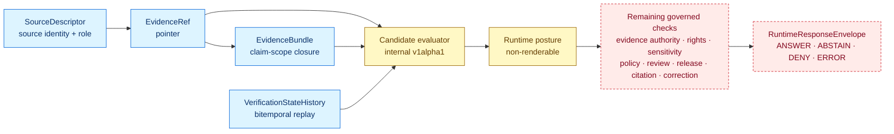
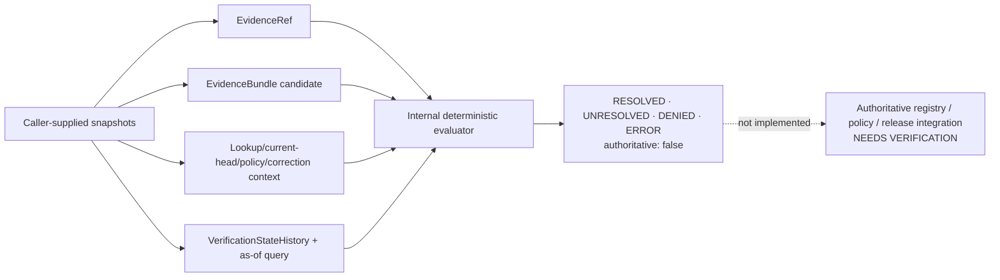

<a id="top"></a>
<!-- [KFM_META_BLOCK_V2]
doc_id: kfm://doc/architecture/evidence-identity
title: Kansas Frontier Matrix — Evidence & Identity (Architecture Note)
type: architecture
version: v0.2
status: draft; repository-grounded; explanatory; mixed-maturity; non-authoritative
owners: NEEDS VERIFICATION — CODEOWNERS routes documentation review; no independently verified evidence, identity, policy, release, or runtime steward assignment was established
created: 2026-05-25
updated: 2026-08-18
policy_label: public; architecture; evidence; identity; cite-or-abstain; non-release; non-publication
current_path: docs/architecture/evidence-identity.md
owning_root: docs/
responsibility: Explain how the repository-present EvidenceRef, EvidenceBundle, verification-history, hashing, candidate-resolution, and governed-runtime surfaces compose without transferring authority among contracts, schemas, policy, implementation, evidence, review, release, or publication roots.
truth_posture: cite-or-abstain; current-state claims are pinned to the evidence snapshot; proposed public resolver, registry, identity grammar, policy, release, and runtime behavior remain visibly bounded
evidence_snapshot:
  repository: bartytime4life/Kansas-Frontier-Matrix
  base_ref: main
  base_commit: d59b4bd403ff918fce1e839b1fcfd5e77592a7f4
  target_prior_blob: fe012598b3ccefb61d0fdc87d0766eb3e4cc1247
  directory_rules_blob: fd49a0b83e55cef52c1124281f093e263526898d
  directory_rules_decision: ADR-0029 accepted
  evidence_ref_schema_blob: 42f499df613a9d68e5ca6fc5ec75ff8058c155b9
  evidence_bundle_contract_blob: 731c348832add23cddd14e796aa56ce2b9268259
  evidence_bundle_schema_blob: cf5256831b63dca46a5f68b168441adcf68b8751
  spec_hash_contract_blob: 0c2c1161ddb565d4f9f17ef81080b27b8d951937
  spec_hash_schema_blob: 80b496b01b8de8c0e8ba67bf020977e6b1f3c652
  verification_state_history_contract_blob: 93070c981d492585a3b66adc9adc1bfbce31f87c
  evidence_resolver_readme_blob: d64f112e9fe6538178c74dd31cc751235781c7f3
  evidence_resolver_core_blob: 7b4b0cc4b808db5c180a52a68e6bf50ae4476e18
  evidence_resolver_runtime_projection_blob: af3fe40b628e15530878e4bbe0449e5d61827442
  evidence_resolver_workflow_blob: 39f9ba31bf6d88987e3f7281d3a92a62546a08da
related:
  - ../doctrine/directory-rules.md
  - ../doctrine/trust-membrane.md
  - ../doctrine/lifecycle-law.md
  - ../adr/ADR-0029-adopt-directory-governance-standard-v2.md
  - ../adr/ADR-0013-spec_hash-and-run_id-identity-grammar.md
  - ./contract-schema-policy-split.md
  - ./governed-api.md
  - ../standards/PROV.md
  - ../standards/PROVENANCE.md
  - ../../contracts/common/spec_hash.md
  - ../../contracts/evidence/evidence_ref.md
  - ../../contracts/evidence/evidence_bundle.md
  - ../../contracts/evidence/verification_state_history.md
  - ../../schemas/contracts/v1/common/spec_hash.schema.json
  - ../../schemas/contracts/v1/evidence/evidence_ref.schema.json
  - ../../schemas/contracts/v1/evidence/evidence_bundle.schema.json
  - ../../packages/evidence-resolver/README.md
  - ../../packages/evidence-resolver/src/evidence_resolver/core.py
  - ../../packages/evidence-resolver/src/evidence_resolver/runtime_projection.py
  - ../../fixtures/packages/evidence_resolver/v1alpha1/README.md
  - ../../tests/packages/evidence_resolver/README.md
  - ../../.github/workflows/evidence-resolver.yml
tags: [kfm, architecture, evidence, evidence-bundle, evidence-ref, identity, spec-hash, verification-history, evidence-resolver, cite-or-abstain, trust-membrane]
notes:
  - "v0.2 replaces the May 2026 proposal-only posture with a current-repository explanation pinned to main@d59b4bd403ff918fce1e839b1fcfd5e77592a7f4."
  - "The current common spec_hash wire value is sha256:<64-lowercase-hex>; jcs:sha256:<hex> remains a proposed and conflicted ADR-0013 target, not current write behavior."
  - "The implemented evidence resolver is an internal, no-network, non-authoritative v1alpha1 candidate evaluator. RESOLVED means CONTINUE_GOVERNED_CHECKS, never public ANSWER."
  - "This documentation update changes no contract, schema, policy, fixture, test, validator, workflow, package behavior, lifecycle state, release state, runtime behavior, or publication state."
[/KFM_META_BLOCK_V2] -->

# Kansas Frontier Matrix — Evidence & Identity

> How KFM's repository-present evidence pointers, claim-scope bundles, deterministic digests, verification histories, and bounded resolver checks fit together—and exactly where the current implementation stops.

[](#current-status-and-evidence-boundary)
[](../adr/ADR-0029-adopt-directory-governance-standard-v2.md)
[](../../schemas/contracts/v1/evidence/evidence_ref.schema.json)
[](../../schemas/contracts/v1/evidence/evidence_bundle.schema.json)
[](../../packages/evidence-resolver/README.md)
[](./governed-api.md)
[](../adr/ADR-0013-spec_hash-and-run_id-identity-grammar.md)
[](#authority-boundary)

> [!IMPORTANT]
> **This page explains current repository surfaces; it does not create their authority.** `contracts/` owns meaning, `schemas/` owns machine shape, `policy/` owns admissibility, implementation packages own only their declared behavior, `data/` owns governed instances, and `release/` owns release, correction, withdrawal, and rollback decisions. A valid pointer, schema, hash, fixture, test, workflow, or internal `RESOLVED` candidate is not evidence truth and is not permission to render a public `ANSWER`.

> [!CAUTION]
> **Current implementation is intentionally narrower than the target architecture.** The repository contains a deterministic, no-network candidate evaluator. It does not query an authoritative registry, construct evidence, infer claim scope, evaluate rights or sensitivity, make policy or review decisions, verify release state, or publish. Its `RESOLVED` status projects only to `CONTINUE_GOVERNED_CHECKS` with `authoritative: false` and `renderable: false`.

## Current status and evidence boundary

| Surface | Current repository-grounded result at `main@d59b4bd403…` | Claim limit |
|---|---|---|
| Placement authority | Accepted [`ADR-0029`](../adr/ADR-0029-adopt-directory-governance-standard-v2.md) adopts the exact bytes of [`docs/doctrine/directory-rules.md`](../doctrine/directory-rules.md). | Establishes responsibility-root placement; it does not make this explanatory page a contract, policy, or runtime authority. |
| `EvidenceRef` | Contract, schema, fixture family, and dedicated schema-validator wrapper are present. | Structural validity and pointer semantics do not prove resolution, bundle closure, rights, release, or public answer fitness. |
| `EvidenceBundle` | Contract, closed top-level schema, fixture family, and dedicated schema-validator wrapper are present. | Schema validity does not prove claim-scope equivalence, evidence authority, citation accuracy, rights clearance, review, or release. |
| `spec_hash` | Current common schema carries `{ "value": "sha256:<64-lowercase-hex>" }`; a bounded JCS + SHA-256 implementation is recorded by current ADR evidence. | The candidate `jcs:sha256:<hex>` wire form remains proposed and conflicted; hash equality is not truth or release authority. |
| Verification history | A bounded `VerificationStateHistory` contract, schema, validator/replay helper, synthetic fixtures, and one resolver consumer are present. | It replays verification state only; it does not create evidence, resolve basis references, or authorize `ANSWER`. |
| Evidence resolver | `packages/evidence-resolver/` implements `kfm/evidence-ref-bundle-candidate/v1alpha1` over caller-supplied snapshots. | Internal candidate evaluation only; no live registry, policy engine, source, review, release, or public endpoint. |
| Runtime projection | `RESOLVED` maps to `CONTINUE_GOVERNED_CHECKS`; negative candidate states map fail-closed. Every projection is non-authoritative and non-renderable. | This is a guard against authority inflation, not a public response implementation. |
| Governed API | Current architecture evidence records fail-closed `ABSTAIN / NOT_IMPLEMENTED` scaffold routes and no substantive `ANSWER` path. | No end-to-end EvidenceRef-to-EvidenceBundle public route, production service, or publication maturity is claimed. |
| Hosted validation | Workflow definitions exist for the bounded resolver profile. | Workflow presence is not exact-head execution evidence; current branch results must be inspected separately. |

<a id="authority-boundary"></a>

### Authority boundary

This page owns one responsibility: **explain how the evidence and identity surfaces compose**.

| Question | Authority owner |
|---|---|
| What does `EvidenceRef`, `EvidenceBundle`, or `VerificationStateHistory` mean? | [`contracts/evidence/`](../../contracts/evidence/README.md) |
| What machine representation is valid? | [`schemas/contracts/v1/evidence/`](../../schemas/contracts/v1/evidence/) and referenced common/policy schemas |
| What does `spec_hash` mean today? | [`contracts/common/spec_hash.md`](../../contracts/common/spec_hash.md), its schema, and current executable evidence |
| May evidence or a claim be disclosed? | `policy/`, policy inputs, review state, source rights, sensitivity, and release authority |
| Can a candidate be checked without hidden I/O? | [`packages/evidence-resolver/`](../../packages/evidence-resolver/README.md) within its explicit alpha boundary |
| Which reusable synthetic cases exercise the boundary? | [`fixtures/`](../../fixtures/README.md) |
| Which executable assertions and validators prove a bounded claim? | [`tests/`](../../tests/README.md), [`tools/validators/`](../../tools/validators/README.md), and invoking workflows |
| Which instance is evidence, proof, receipt, catalog, or published data? | Governed `data/` object families and lifecycle planes |
| Which release, correction, withdrawal, or rollback decision applies? | `release/` |
| How do readers understand the composition? | This page and adjacent architecture/root documentation |

---

## Contents

- [1. Purpose & scope](#1-purpose--scope)
- [2. Where this note belongs](#2-where-this-note-belongs)
- [3. The object family](#3-the-object-family)
- [4. Deterministic identity](#4-deterministic-identity)
- [5. `EvidenceBundle`](#5-evidencebundle)
- [6. `EvidenceRef`](#6-evidenceref)
- [7. Bundle registry · lineage · supersession](#7-bundle-registry--lineage--supersession)
- [8. The resolver as trust membrane](#8-the-resolver-as-trust-membrane)
- [9. Source-role anti-collapse and identity](#9-source-role-anti-collapse-and-identity)
- [10. Schema, contract, and code homes](#10-schema-contract-and-code-homes)
- [11. Tensions & open questions](#11-tensions--open-questions)
- [12. Anti-patterns](#12-anti-patterns)
- [13. Acceptance criteria](#13-acceptance-criteria)
- [14. Appendix — illustrative shapes](#14-appendix--illustrative-shapes)
- [15. Related docs](#15-related-docs)

---

## 1. Purpose & scope

This note explains **how KFM identifies evidence and binds it to claims without collapsing pointer, closure, verification, policy, review, release, and public-response authority into one object**.

The current architecture has three distinct levels:

1. **Definition level** — semantic contracts and machine schemas define `EvidenceRef`, `EvidenceBundle`, `VerificationStateHistory`, and `spec_hash`.
2. **Candidate-check level** — the internal evidence-resolver package evaluates explicit caller-supplied objects and snapshots deterministically, without network or store access.
3. **Governed public level** — the intended trust membrane applies evidence authority, rights, sensitivity, policy, review, release, citation, freshness, correction, and other obligations before a public `ANSWER` may exist.

Only levels 1 and a bounded part of level 2 are currently established by the repository evidence inspected for this page. The public level remains fail-closed.

**In scope**

- the current `EvidenceRef` and `EvidenceBundle` contract/schema shapes;
- the current common `spec_hash` shape and the unresolved wire-grammar decision;
- the bitemporal verification-history profile consumed by the resolver;
- the internal resolver's explicit inputs, checks, statuses, and non-authority;
- the conservative projection from candidate status toward governed runtime posture;
- the placement and dependency boundaries among documentation, contracts, schemas, policy, packages, fixtures, tests, validators, data, and release roots.

**Out of scope**

- selecting or activating an authoritative evidence registry;
- creating or admitting evidence;
- deciding claim-scope equivalence;
- source-rights or sensitivity adjudication;
- policy evaluation, human review, promotion, release, publication, or deployment;
- a production `ANSWER` route;
- accepting [`ADR-0013`](../adr/ADR-0013-spec_hash-and-run_id-identity-grammar.md) or migrating hash wire formats;
- changing any contract, schema, package, workflow, or runtime behavior.

> [!NOTE]
> **One-line rule.** A consequential public claim may reach `ANSWER` only after its evidence pointers close into an applicable EvidenceBundle **and** every remaining governed check closes. The current resolver can establish only a non-authoritative candidate result; it cannot grant public-answer authority.

[Back to top](#top)

---

## 2. Where this note belongs

The existing tracked path is confirmed:

```text
docs/architecture/evidence-identity.md
```

Accepted Directory Rules place human-readable cross-root explanations in `docs/architecture/`. This page is therefore a `PLACE` at its current path: it explains how several responsibility roots cooperate, but it does not own their meaning, shape, admissibility, implementation, data instances, or release decisions.

**Directory Rules basis**

- `docs/` explains the system to humans;
- `contracts/` defines semantic meaning;
- `schemas/` defines machine-checkable shape;
- `policy/` defines admissibility and obligations;
- `packages/` owns reusable implementation;
- `fixtures/`, `tests/`, and `tools/validators/` own reusable examples and bounded conformance evidence;
- `data/` owns governed lifecycle, evidence, receipt, proof, catalog, and published instances;
- `release/` owns release, correction, withdrawal, and rollback decisions.

The page may reference all of those roots. It may not transfer authority among them.

| Question | Current answer surface | Status |
|---|---|---|
| What does an `EvidenceRef` mean? | [`contracts/evidence/evidence_ref.md`](../../contracts/evidence/evidence_ref.md) | **CONFIRMED present; draft semantic contract** |
| What does an `EvidenceBundle` mean? | [`contracts/evidence/evidence_bundle.md`](../../contracts/evidence/evidence_bundle.md) | **CONFIRMED present; draft semantic contract** |
| What machine shape is checked? | [`schemas/contracts/v1/evidence/`](../../schemas/contracts/v1/evidence/) | **CONFIRMED present; schema metadata remains `PROPOSED`** |
| What checks run in the bounded resolver? | [`packages/evidence-resolver/`](../../packages/evidence-resolver/README.md) | **CONFIRMED internal alpha implementation** |
| What controls public outcomes? | [`RuntimeResponseEnvelope`](../../contracts/runtime/runtime_response_envelope.md), governed API, policy, review, release, and correction surfaces | **Mixed maturity; substantive `ANSWER` not established** |
| What records semantic lineage? | [`PROV.md`](../standards/PROV.md) | **CONFIRMED present; draft standard** |
| What records build/supply-chain provenance? | [`PROVENANCE.md`](../standards/PROVENANCE.md) | **CONFIRMED present; draft standard** |

[Back to top](#top)

---

## 3. The object family

The current evidence-identity architecture uses separate objects because each answers a different question.

| Object or surface | One-line role | Current repository evidence | Explicit non-effect |
|---|---|---|---|
| `SourceDescriptor` | Declares source identity, role, rights, cadence, and admission posture upstream of evidence. | Source-family surfaces exist elsewhere; this page did not verify one authoritative resolver input. | Does not become evidence merely by existing. |
| `EvidenceRef` | Small governed pointer: `ref`, `kind`, and optional `bundle_ref`. | Contract, schema, fixtures, and validator wrapper are present. | Not claim-scope closure, policy clearance, proof storage, release approval, or AI authority. |
| `EvidenceBundle` | Claim-scope closure artifact containing refs, records, citations, rights, sensitivity, transforms, checksums, and spec linkage. | Contract, schema, fixtures, and validator wrapper are present. | Not policy, review, release, public response, or publication authority. |
| `SpecHash` | Compact SHA-256 reference to a declared specification representation. | Contract and schema are present; bounded JCS hashing behavior exists elsewhere. | Matching hashes do not prove truth, authority, or admissibility. |
| `VerificationStateHistory` | Append-ordered bitemporal state history for one evidence subject. | Contract/schema/validator/replay helper and resolver consumption are present. | Does not resolve basis refs, create a bundle, or authorize `ANSWER`. |
| Resolver candidate | Pure evaluation of explicit pointer, candidate bundle, lookup snapshot, and verification replay. | `kfm/evidence-ref-bundle-candidate/v1alpha1` is implemented. | `RESOLVED` is not public `ANSWER`; output is always non-authoritative. |
| Runtime posture projection | Maps candidate status to the next safe disposition. | Implemented with `renderable: false`. | Does not perform remaining governed checks. |
| `RuntimeResponseEnvelope` | Public finite-outcome carrier: `ANSWER`, `ABSTAIN`, `DENY`, or `ERROR`. | Contract/schema and negative governed-api scaffold are present. | An envelope shape alone does not make an answer evidence-backed or released. |
| Policy, review, release, correction | Decide whether closed evidence may be used and what current release state applies. | Responsibility roots and contracts exist with mixed maturity. | Cannot be inferred from resolver success or CI. |


```mermaid
flowchart LR
  SRC["SourceDescriptor\nsource identity + role"]
  REF["EvidenceRef\npointer"]
  BUNDLE["EvidenceBundle\nclaim-scope closure"]
  HIST["VerificationStateHistory\nbitemporal replay"]
  CAND["Candidate evaluator\ninternal v1alpha1"]
  POSTURE["Runtime posture\nnon-renderable"]
  GATES["Remaining governed checks\nevidence authority · rights · sensitivity\npolicy · review · release · citation · correction"]
  API["RuntimeResponseEnvelope\nANSWER · ABSTAIN · DENY · ERROR"]

  SRC --> REF
  REF --> BUNDLE
  REF --> CAND
  BUNDLE --> CAND
  HIST --> CAND
  CAND --> POSTURE
  POSTURE --> GATES
  GATES --> API

  classDef current fill:#ddf4ff,stroke:#0969da,color:#0a3069;
  classDef bounded fill:#fff8c5,stroke:#9a6700,color:#633c01;
  classDef target fill:#ffebe9,stroke:#cf222e,color:#82071e,stroke-dasharray:4 3;
  class SRC,REF,BUNDLE,HIST current;
  class CAND,POSTURE bounded;
  class GATES,API target;
```

The final two nodes are architectural obligations, not a claim that an end-to-end substantive route currently exists.

[Back to top](#top)

---

## 4. Deterministic identity

KFM separates **stable object handles**, **content or specification digests**, and **execution identity**. They are related but not interchangeable.

### 4.1 Current `spec_hash` posture

The current repository has two different layers that must be kept explicit:

| Layer | Current state | Safe conclusion |
|---|---|---|
| Common machine shape | `spec_hash` is an object with required `value` matching `^sha256:[a-f0-9]{64}$`. | `sha256:<64-lowercase-hex>` is the current schema wire value. |
| Bounded hashing implementation | Current ADR evidence records RFC 8785 JCS canonicalization followed by SHA-256. | Deterministic JCS + SHA-256 behavior exists for its bounded declared profiles. |
| Candidate target grammar | Proposed ADR-0013 names `jcs:sha256:<64-lowercase-hex>`. | This is **PROPOSED / CONFLICTED**, not the current write format. |
| Universal hash-domain policy | Not accepted or fully represented in the common schema. | Consumers must know what bytes/profile were hashed; a valid string alone is insufficient. |

> [!WARNING]
> Do not silently rewrite current `sha256:` values to `jcs:sha256:`. The prefix migration is compatibility-significant and remains blocked on an accepted identity/canonicalization decision, fixtures, producer/consumer inventory, migration behavior, and rollback evidence.

### 4.2 What a matching hash proves

A matching hash proves only that the same admitted value produced the same digest under the same declared byte-selection, canonicalization, and hash-domain profile.

It does **not** prove:

- that the evidence is true or authoritative;
- that the pointer resolves to the right claim scope;
- that citations are accurate or sufficient;
- that rights and sensitivity permit disclosure;
- that policy, review, release, freshness, correction, or rollback gates have closed;
- that a public `ANSWER` is safe.

### 4.3 Stable IDs, pointer identity, and bundle identity

| Identifier | Current role | Important distinction |
|---|---|---|
| `EvidenceRef.ref` | Pointer to one evidence item. | The schema does not impose a universal URI grammar. |
| `EvidenceRef.bundle_ref` | Optional claimed membership in a bundle. | Optional means pre-closure is representable; it is not verified merely because the string exists. |
| `EvidenceBundle.bundle_id` | Stable bundle handle constrained by the bundle schema pattern. | A handle is not a content digest and is not release state. |
| `EvidenceBundle.spec_hash.value` | Reference to a governing specification representation. | Current contract does not establish it as a universal bundle-content address. |
| `VerificationStateHistory.history_id` | Stable history-document identity. | The history's own hash and replay rules remain profile-specific. |
| `run_id` | Activity identity proposed in ADR-0013. | Must never be folded into deterministic content identity merely to make values unique. |

### 4.4 Source-role-aware sameness

Source role remains a load-bearing semantic distinction: observed, modeled, regulatory, aggregate, administrative, candidate, and synthetic material must not collapse into one identity merely because payload values resemble one another.

Current implementation boundary:

- `EvidenceRef.kind` distinguishes `measurement`, `record`, `dataset`, and `artifact`; it is **not** a source-role vocabulary.
- The generic evidence resolver does not inspect a `source_role` field.
- The resolver does not machine-check `claim_scope` equivalence.
- Domain-specific sameness and source-role rules remain owned by domain contracts, source admission, identity profiles, policy, and correction lineage.

Therefore, a candidate `RESOLVED` result must not be read as proof that source-role or domain-identity semantics have closed.

[Back to top](#top)

---

## 5. `EvidenceBundle`

`EvidenceBundle` is the current semantic and machine-shape family for **claim-scope evidence closure**. It packages the support needed for later policy, review, release, runtime, map, export, and AI decisions. It does not make those decisions itself.

### 5.1 Current schema fields

| Field | Required | Current machine meaning |
|---|---:|---|
| `bundle_id` | Yes | Stable handle matching `^[a-z][a-z0-9_:.-]*$`. |
| `claim_scope` | Yes | String describing the scope of claims the bundle is intended to support. |
| `evidence_refs` | Yes | Non-empty array of current `EvidenceRef` objects. |
| `source_records` | Yes | Non-empty array of source-record handles. |
| `citations` | Yes | Non-empty array of citation strings. |
| `rights` | Yes | Closed object requiring `license`. |
| `sensitivity` | Yes | Current sensitivity-label object: `level`, `reason`, `applied_at`. |
| `transforms` | Yes | Ordered array of transform descriptions; the array may be empty. |
| `checksums` | Yes | Non-empty map whose values match `sha256:<64-lowercase-hex>`. |
| `spec_hash` | Yes | Current common SpecHash object. |

The schema forbids undeclared top-level fields.

### 5.2 What current validation establishes

Schema validation can establish that:

- required fields are present;
- arrays and closed objects have the configured shape;
- refs conform to the EvidenceRef schema;
- checksum and bundle-ID strings match configured patterns;
- sensitivity references the configured sensitivity-label schema;
- undeclared top-level fields are rejected.

Schema validation cannot establish that:

- the `claim_scope` string is semantically equivalent to the requested claim;
- referenced source records exist or are authoritative;
- citations support the exact claim;
- the stated license is accurate or sufficient;
- sensitivity classification is correct;
- transforms are valid, complete, or reversible;
- checksums match actual governed bytes;
- `spec_hash` was produced from the intended hash domain;
- policy, review, release, correction, or rollback state permits use.

### 5.3 Additional bounded resolver checks

The candidate evaluator adds several checks over an explicit supplied bundle:

- candidate, pointer, and lookup bundle IDs must agree;
- the exact `EvidenceRef.ref` + `kind` pair must be a bundle member;
- member `bundle_ref` values may not point to another bundle;
- verification history must bind to the same `EvidenceRef.ref`;
- the replayed verification state must be eligible;
- the caller-supplied lookup snapshot must mark the bundle as current head;
- caller-supplied policy and correction contexts must not block continuation.

Those checks are useful but remain necessary-not-sufficient. The resolver's own limitations explicitly say that claim scope is not machine-checked and citations, rights, sensitivity, review, release, and publication authority remain open.

[Back to top](#top)

---

## 6. `EvidenceRef`

`EvidenceRef` is the smallest governed pointer in the current evidence family.

### 6.1 Current schema fields

| Field | Required | Current meaning |
|---|---:|---|
| `ref` | Yes | Pointer or identifier for the evidence item. |
| `kind` | Yes | One of `measurement`, `record`, `dataset`, or `artifact`. |
| `bundle_ref` | No | Claimed EvidenceBundle membership after closure; absence represents a pre-closure pointer. |

The schema forbids undeclared fields.

> [!IMPORTANT]
> Earlier proposal fields such as `ref_id`, `target_spec_hash`, `expected_bundle_digest`, `resolution`, and `policy_metadata` are **not part of the current EvidenceRef schema**. Architecture prose must not present them as implemented fields.

### 6.2 Pointer and closure rules

1. `ref` identifies the evidence item but does not prove the item exists or is authoritative.
2. `kind` informs downstream handling but does not encode source role, rights, sensitivity, review, or release state.
3. Missing `bundle_ref` means the pointer is pre-closure by default.
4. A present `bundle_ref` is only a claim of bundle membership until governed resolution verifies it.
5. EvidenceRef alone cannot support a claim-grade public `ANSWER` where bundle closure is required.
6. Corrected, superseded, revoked, or withdrawn support must invalidate or repoint dependent bundles, releases, drawers, exports, and generated summaries through their owning authorities.

### 6.3 Current resolver behavior

For the internal alpha candidate to become `RESOLVED`:

- `bundle_ref` must be present;
- caller-supplied lookup and candidate bundle IDs must match it;
- the supplied bundle must include the exact `ref` + `kind` pair;
- verification history must be valid, subject-bound, and replay to `ACTIVE` for the requested bitemporal point;
- current-head, caller-policy, and correction context must not block continuation.

Even then, runtime posture remains `CONTINUE_GOVERNED_CHECKS`, not `ANSWER`.

[Back to top](#top)

---

## 7. Bundle registry · lineage · supersession

The target architecture needs authoritative lookup, lineage, correction, and current-head behavior. **Current repository evidence does not establish a production bundle registry or a resolver-owned registry abstraction.**

### 7.1 What is implemented now

The current evaluator receives snapshots from its caller rather than fetching them:

| Supplied input | What it represents | What the package does not do |
|---|---|---|
| `bundle_candidate` | One explicit EvidenceBundle candidate, or `null`. | Does not query a proof store or construct a bundle. |
| `lookup_context.bundle_id` | Caller's claimed lookup result. | Does not perform lookup. |
| `lookup_context.current_head` | Caller's claimed current-head posture. | Does not walk a supersession chain. |
| `lookup_context.policy_outcome` | Caller's canonical policy-outcome projection. | Does not evaluate policy. |
| `lookup_context.policy_decision_ref` | Reference binding the policy context. | Does not resolve the decision. |
| `lookup_context.correction_state` | `ACTIVE`, `SUPERSEDED`, `WITHDRAWN`, or `UNKNOWN`. | Does not read correction or release stores. |
| `lookup_context.correction_ref` | Reference for a blocking correction state where required. | Does not verify the correction object. |
| `verification_history` | One validated bitemporal verification transition chain. | Does not resolve `basis_refs` or create evidence authority. |
| `verification_as_of` | Effective and recorded query times. | Does not consult a hidden clock. |

### 7.2 Bitemporal verification replay

`VerificationStateHistory` preserves two distinct time axes:

- `effective_at` — when a verification transition applies to the subject;
- `recorded_at` — when KFM recorded that transition.

The replay query independently supplies `effective_as_of` and `recorded_as_of`. The resolver requires exact subject binding and treats every replay other than `ACTIVE` as unresolved:

| Replayed state | Candidate consequence |
|---|---|
| `ACTIVE` | Does not block candidate resolution; remaining checks still apply. |
| `CORRECTED` | `UNRESOLVED` with a verification correction issue. |
| `SUPERSEDED` | `UNRESOLVED`; successor following is outside the current package. |
| `REVOKED` | `UNRESOLVED`. |
| `UNKNOWN` | `UNRESOLVED`; absence is not active verification. |

### 7.3 What remains unimplemented or unresolved

- authoritative bundle storage and lookup;
- authoritative binding between a reference and the expected candidate digest;
- a governed repository/store abstraction owned by accountable stewards;
- successor discovery and supersession-chain traversal;
- correction/withdrawal object resolution and propagation;
- append-only retention, compaction, archival, and rollback mechanics for registry state;
- production consumers and operational evidence.


```mermaid
flowchart LR
  CALLER["Caller-supplied snapshots"]
  REF["EvidenceRef"]
  CANDIDATE["EvidenceBundle candidate"]
  LOOKUP["Lookup/current-head/policy/correction context"]
  HISTORY["VerificationStateHistory + as-of query"]
  CHECK["Internal deterministic evaluator"]
  RESULT["RESOLVED · UNRESOLVED · DENIED · ERROR\nauthoritative: false"]
  FUTURE["Authoritative registry / policy / release integration\nNEEDS VERIFICATION"]

  CALLER --> REF
  CALLER --> CANDIDATE
  CALLER --> LOOKUP
  CALLER --> HISTORY
  REF --> CHECK
  CANDIDATE --> CHECK
  LOOKUP --> CHECK
  HISTORY --> CHECK
  CHECK --> RESULT
  RESULT -. not implemented .-> FUTURE
```

[Back to top](#top)

---

## 8. The resolver as trust membrane

The repository currently implements **a bounded candidate gate inside the future trust path**, not the complete trust membrane.

### 8.1 Implemented profile

| Property | Current value |
|---|---|
| Profile | `kfm/evidence-ref-bundle-candidate/v1alpha1` |
| Inputs | Explicit EvidenceRef, optional candidate bundle, lookup context, verification history, and bitemporal as-of query |
| I/O | None: no registry, filesystem, environment, DNS, socket, service, source, or model call in core evaluation |
| Parsing | Bounded UTF-8 JSON with duplicate-key, non-finite-number, size, depth, collection, string, and number limits |
| Output statuses | `RESOLVED`, `UNRESOLVED`, `DENIED`, `ERROR` |
| Authority | Always `authoritative: false` |
| Public renderability | Always false after runtime projection |
| State retention | None |
| Hidden time | None; as-of values are explicit inputs |

Status precedence is fail-closed:

```text
ERROR > DENIED > UNRESOLVED > RESOLVED
```

### 8.2 Candidate status versus runtime outcome

The current runtime projection prevents authority inflation:

| Candidate status | Projected disposition | Public meaning |
|---|---|---|
| `RESOLVED` | `CONTINUE_GOVERNED_CHECKS` | Not `ANSWER`; carry bundle ID forward to remaining checks. |
| `UNRESOLVED` | `ABSTAIN` | Do not synthesize support on a miss. |
| `DENIED` | `DENY` | Do not expose blocked content. |
| `ERROR` | `ERROR` | Do not fall back to ungoverned data or prose. |

For `RESOLVED`, the projection requires these next checks:

```text
evidence_authority
rights
sensitivity
policy
review
release
citation
correction
```

The projection also emits:

```text
authoritative: false
renderable: false
```

### 8.3 Governed API relationship

The governed API architecture currently records three fail-closed scaffold GET routes that return `ABSTAIN / NOT_IMPLEMENTED`. No substantive `ANSWER` route, evidence-store lookup, policy evaluation, release binding, or public EvidenceBundle response is established by the inspected evidence.

A safe future integration must preserve this order:

```text
EvidenceRef + explicit candidate snapshots
  -> internal candidate evaluation
  -> non-renderable runtime posture
  -> evidence authority / rights / sensitivity / policy / review / release / citation / correction
  -> RuntimeResponseEnvelope
  -> public client honors ANSWER | ABSTAIN | DENY | ERROR
```

> [!WARNING]
> Wiring `RESOLVED` directly to an API or map `ANSWER` would violate the current package boundary, the runtime projection, cite-or-abstain, and the trust membrane.

[Back to top](#top)

---

## 9. Source-role anti-collapse and identity

KFM must preserve source role, evidence kind, claim scope, temporal support, and derivation state as distinct dimensions.

| Dimension | Example vocabulary | Current owner |
|---|---|---|
| Evidence carrier kind | `measurement`, `record`, `dataset`, `artifact` | EvidenceRef contract/schema |
| Source authority role | observed, modeled, regulatory, aggregate, administrative, candidate, synthetic | Source/domain contracts and policy; not the generic resolver |
| Claim scope | Claim statement, geography, time, method, permitted inference | EvidenceBundle plus domain/claim contracts; current schema stores a string only |
| Verification state | active, corrected, superseded, revoked, unknown | VerificationStateHistory profile |
| Correction/release state | active, superseded, withdrawn, unknown and governed release objects | Correction/release authorities; caller-supplied to current resolver |
| Public outcome | `ANSWER`, `ABSTAIN`, `DENY`, `ERROR` | RuntimeResponseEnvelope and governed runtime |

Guardrails:

1. `kind=measurement` does not prove an observation is authoritative, current, public-safe, or correctly located.
2. A modeled result must not be promoted into an observed identity by changing a label in place.
3. An aggregate must not be cited as item-level or place-level evidence when the claim requires finer support.
4. A synthetic or generated artifact remains derived and must not become root evidence merely because it has a checksum or bundle membership.
5. Correcting a source role, identity basis, or claim scope requires explicit correction/supersession lineage appropriate to the affected object family.
6. The current generic resolver does not close these semantics; callers must not imply otherwise.

[Back to top](#top)

---

## 10. Schema, contract, and code homes

The paths below are confirmed at the inspected main commit. Their statuses remain distinct.

| Artifact | Current home | Current state |
|---|---|---|
| This explanatory architecture page | `docs/architecture/evidence-identity.md` | **CONFIRMED tracked path; draft explanatory authority** |
| EvidenceRef meaning | [`contracts/evidence/evidence_ref.md`](../../contracts/evidence/evidence_ref.md) | **CONFIRMED v0.2 draft** |
| EvidenceBundle meaning | [`contracts/evidence/evidence_bundle.md`](../../contracts/evidence/evidence_bundle.md) | **CONFIRMED v0.2 draft** |
| Verification history meaning | [`contracts/evidence/verification_state_history.md`](../../contracts/evidence/verification_state_history.md) | **CONFIRMED bounded v0.1.0 draft** |
| SpecHash meaning | [`contracts/common/spec_hash.md`](../../contracts/common/spec_hash.md) | **CONFIRMED v0.2 draft** |
| EvidenceRef machine shape | [`schemas/contracts/v1/evidence/evidence_ref.schema.json`](../../schemas/contracts/v1/evidence/evidence_ref.schema.json) | **CONFIRMED; `x-kfm.status=PROPOSED`** |
| EvidenceBundle machine shape | [`schemas/contracts/v1/evidence/evidence_bundle.schema.json`](../../schemas/contracts/v1/evidence/evidence_bundle.schema.json) | **CONFIRMED; `x-kfm.status=PROPOSED`** |
| Verification history machine shape | [`schemas/contracts/v1/evidence/verification_state_history.schema.json`](../../schemas/contracts/v1/evidence/verification_state_history.schema.json) | **CONFIRMED bounded profile** |
| SpecHash machine shape | [`schemas/contracts/v1/common/spec_hash.schema.json`](../../schemas/contracts/v1/common/spec_hash.schema.json) | **CONFIRMED; `x-kfm.status=PROPOSED`** |
| EvidenceRef schema validator | [`tools/validators/validate_evidence_ref.py`](../../tools/validators/validate_evidence_ref.py) | **CONFIRMED JSON Schema runner wrapper** |
| EvidenceBundle schema validator | [`tools/validators/validate_evidence_bundle.py`](../../tools/validators/validate_evidence_bundle.py) | **CONFIRMED JSON Schema runner wrapper** |
| Candidate resolver package | [`packages/evidence-resolver/`](../../packages/evidence-resolver/README.md) | **CONFIRMED internal non-deployable alpha** |
| Candidate evaluator | [`core.py`](../../packages/evidence-resolver/src/evidence_resolver/core.py) | **CONFIRMED bounded pure implementation** |
| Runtime posture projection | [`runtime_projection.py`](../../packages/evidence-resolver/src/evidence_resolver/runtime_projection.py) | **CONFIRMED non-renderable projection** |
| Verification replay helper | [`verification_history.py`](../../packages/evidence-resolver/src/evidence_resolver/verification_history.py) | **CONFIRMED bounded helper** |
| Synthetic resolver fixtures | [`fixtures/packages/evidence_resolver/v1alpha1/`](../../fixtures/packages/evidence_resolver/v1alpha1/README.md) | **CONFIRMED public-safe fixture family** |
| Resolver tests | [`tests/packages/evidence_resolver/`](../../tests/packages/evidence_resolver/README.md) | **CONFIRMED focused test family** |
| Resolver workflow | [`.github/workflows/evidence-resolver.yml`](../../.github/workflows/evidence-resolver.yml) | **CONFIRMED workflow definition; run state separate** |
| Public response architecture | [`docs/architecture/governed-api.md`](./governed-api.md) | **CONFIRMED fail-closed scaffold description** |
| Policy evaluation | `policy/` | **Responsibility root confirmed; resolver integration not established** |
| Materialized evidence/proof instances | `data/proofs/` and related governed data families | **Responsibility home confirmed; authoritative resolver store not established** |
| Release/correction/rollback | `release/` | **Responsibility home confirmed; resolver integration not established** |

> [!NOTE]
> A path's presence proves that bytes exist. It does not prove adoption, runtime use, production deployment, public exposure, or release authority.

[Back to top](#top)

---

## 11. Tensions & open questions

| ID | Open question or conflict | Current status / closure evidence needed |
|---|---|---|
| **EID-Q1** | Which `spec_hash` wire grammar is authoritative? Current schemas and code use `sha256:<hex>`; proposed ADR-0013 targets `jcs:sha256:<hex>`. | **CONFLICTED / HOLD** — accept or revise ADR-0013, define hash domains, inventory producers/consumers, add compatibility fixtures, and prove migration/rollback. |
| **EID-Q2** | What exact object or bytes does each EvidenceBundle `spec_hash` identify? | **NEEDS VERIFICATION** — accepted normalization/hash-domain profile and producer tests. |
| **EID-Q3** | Which accountable owner and repository/store abstraction provides authoritative EvidenceRef-to-bundle lookup? | **HOLD** — named ownership, accepted interface, immutable lookup evidence, and no parallel store. |
| **EID-Q4** | How is `claim_scope` represented and machine-checked beyond a free-form string? | **PROPOSED** — accepted claim contract/schema, spatial/temporal/method boundaries, positive/negative fixtures, and semantic tests. |
| **EID-Q5** | How are source authority, rights, sensitivity, and policy evaluated rather than caller-supplied? | **NEEDS VERIFICATION** — accepted policy inputs/rules, source registry binding, safe reason projection, and negative tests. |
| **EID-Q6** | How does a candidate `RESOLVED` state advance through review, release, citation, correction, and rollback without becoming an authority shortcut? | **PROPOSED** — governed adapter, complete remaining-check contract, release-backed fixtures, and fail-closed runtime tests. |
| **EID-Q7** | Which authoritative record supplies current-head, correction, withdrawal, and successor state? | **HOLD** — correction/release contract binding, repository abstraction, replay semantics, and propagation tests. |
| **EID-Q8** | What is the first substantive public `ANSWER` vertical slice? | **UNKNOWN / not implemented** — one released synthetic fixture, EvidenceBundle closure, policy/review/release/citation/correction checks, and governed-api tests. |
| **EID-Q9** | Who owns the resolver package, evidence contracts, identity grammar, and release integration? | **NEEDS VERIFICATION** — named human/accountable roles and independent review where policy-significant. |
| **EID-Q10** | What hosted checks are required and green for the exact implementation head? | **NEEDS VERIFICATION per change** — inspect exact-head runs and branch/ruleset requirements; workflow definitions alone are insufficient. |

[Back to top](#top)

---

## 12. Anti-patterns

> [!WARNING]
> Each anti-pattern below inflates a weaker artifact into authority it does not own.

- **Treating `EvidenceRef` as evidence closure.** A pointer is not an EvidenceBundle.
- **Treating `bundle_ref` as verified membership.** A string does not prove lookup, digest binding, current-head posture, or bundle membership.
- **Treating schema validity as semantic support.** Valid shape does not prove claim scope, source authority, citation accuracy, rights, or release.
- **Treating `spec_hash` as truth.** Hash equality is representation/profile equality only.
- **Silently migrating `sha256:` to `jcs:sha256:`.** This breaks current contracts, schemas, fixtures, code, receipts, and consumers without an accepted migration decision.
- **Mapping internal `RESOLVED` directly to public `ANSWER`.** Current projection explicitly requires `CONTINUE_GOVERNED_CHECKS` and is non-renderable.
- **Letting the resolver infer policy from missing context.** The package is fail-closed and caller policy remains explicitly bound.
- **Using mutable current rows as verification history.** Bitemporal replay requires append-ordered events and explicit as-of inputs.
- **Ignoring corrected, superseded, revoked, withdrawn, or unknown state.** Non-active support must not silently render.
- **Collapsing evidence kind into source role.** `measurement` does not mean authoritative observed evidence.
- **Collapsing generated artifacts into root evidence.** Tiles, reports, models, summaries, and AI output remain derived carriers.
- **Public client reads RAW, WORK, QUARANTINE, canonical stores, proof stores, or model runtimes directly.** Public clients use governed interfaces and released public-safe artifacts.
- **Storing trust-bearing receipts or proofs as disposable build artifacts.** Object-family and lifecycle homes remain separate.
- **Claiming workflow presence as exact-head proof.** Inspect the actual run tied to the actual commit.

[Back to top](#top)

---

## 13. Acceptance criteria

### 13.1 Current bounded implementation evidence

| Criterion | Current state at inspected main | Evidence boundary |
|---|---|---|
| EvidenceRef contract/schema alignment | **CONFIRMED** for `ref`, `kind`, optional `bundle_ref` | Does not prove runtime resolution. |
| EvidenceBundle contract/schema alignment | **CONFIRMED** for the current required field set | Does not prove semantic or policy closure. |
| Dedicated schema validators | **CONFIRMED present** | JSON Schema fixture validation only. |
| Bounded JSON parsing | **CONFIRMED implemented** | Applies to internal candidate profile only. |
| Bundle identity consistency and membership | **CONFIRMED implemented** | Caller supplies lookup/candidate snapshots. |
| Verification-history validation and bitemporal replay | **CONFIRMED implemented** | Profile-specific, synthetic, non-authoritative. |
| Subject binding and non-active fail-closed behavior | **CONFIRMED implemented** | Does not resolve history basis refs. |
| Current-head, policy, and correction context checks | **CONFIRMED implemented as caller-supplied checks** | Package does not evaluate or retrieve those authorities. |
| Candidate status precedence and deterministic serialization | **CONFIRMED implemented** | Internal statuses only. |
| No-network / no-hidden-I/O boundary | **CONFIRMED by package design and focused test contract; exact run state separate** | No claim of production isolation or deployment. |
| Runtime projection blocks `RESOLVED -> ANSWER` | **CONFIRMED implemented** | Remaining checks are listed, not implemented end to end. |
| Resolver workflow definition | **CONFIRMED present** | Exact-head pass/fail/pending must be inspected after each change. |

Repository-native focused commands documented by the package are:

```bash
make evidence-resolver
make evidence-resolver-deny
```

The verification-history profile additionally documents:

```bash
KFM_NO_NETWORK=1 python tools/validators/validate_verification_state_history.py --fixtures
KFM_NO_NETWORK=1 python -m pytest -q tests/schemas/test_verification_state_history.py
```

### 13.2 Required evidence before substantive public `ANSWER`

A first claim-bearing `ANSWER` slice is not complete until it proves, with realistic synthetic fixtures and negative cases:

- [ ] authoritative EvidenceRef lookup with one accepted store/repository abstraction;
- [ ] bundle identity and expected-digest binding under an accepted hash-domain profile;
- [ ] claim-scope applicability, including required spatial, temporal, source-role, and method bounds;
- [ ] evidence authority and source admission;
- [ ] rights and sensitivity evaluation;
- [ ] policy decision binding and safe reason projection;
- [ ] review-state requirements;
- [ ] release-manifest and rollback binding;
- [ ] citation completeness and citation validation;
- [ ] freshness and correction/withdrawal/current-head handling;
- [ ] public RuntimeResponseEnvelope mapping with exact `ANSWER`, `ABSTAIN`, `DENY`, and `ERROR` fixtures;
- [ ] governed-api integration without direct internal-store access;
- [ ] no-network unit tests and classified integration-test boundaries;
- [ ] no model call or generated-language fallback on evidence miss;
- [ ] correction and withdrawal propagation to API, Evidence Drawer, map, exports, caches, and AI summaries where applicable;
- [ ] exact-head hosted checks and required-check status;
- [ ] named ownership, review, and rollback path.

[Back to top](#top)

---

## 14. Appendix — illustrative shapes

> [!NOTE]
> These examples mirror the current schemas and internal runtime projection at the inspected commit. They are synthetic examples, not evidence, proof, policy, review, release, or publication records.

<details>
<summary><strong>A. Current <code>EvidenceRef</code> shape</strong></summary>

```json
{
  "ref": "evidence:synthetic:record-001",
  "kind": "record",
  "bundle_ref": "bundle:synthetic:example:v1"
}
```

A pre-closure pointer omits `bundle_ref`:

```json
{
  "ref": "evidence:synthetic:record-001",
  "kind": "record"
}
```

</details>

<details>
<summary><strong>B. Current <code>EvidenceBundle</code> shape</strong></summary>

```json
{
  "bundle_id": "bundle:synthetic:example:v1",
  "claim_scope": "Synthetic documentation example only",
  "evidence_refs": [
    {
      "ref": "evidence:synthetic:record-001",
      "kind": "record",
      "bundle_ref": "bundle:synthetic:example:v1"
    }
  ],
  "source_records": [
    "source-record:synthetic:001"
  ],
  "citations": [
    "Synthetic fixture citation; not a factual source"
  ],
  "rights": {
    "license": "synthetic-test-only"
  },
  "sensitivity": {
    "level": "public",
    "reason": "Synthetic fixture contains no real source, person, or location data",
    "applied_at": "2026-08-18T00:00:00Z"
  },
  "transforms": [],
  "checksums": {
    "source-record:synthetic:001": "sha256:0123456789abcdef0123456789abcdef0123456789abcdef0123456789abcdef"
  },
  "spec_hash": {
    "value": "sha256:abcdef0123456789abcdef0123456789abcdef0123456789abcdef0123456789"
  }
}
```

This shape can pass structural validation while remaining non-authoritative. The example does not prove source existence, checksum correctness, policy allowance, review, release, or claim truth.

</details>

<details>
<summary><strong>C. Current non-renderable projection for a <code>RESOLVED</code> candidate</strong></summary>

```json
{
  "candidate_status": "RESOLVED",
  "disposition": "CONTINUE_GOVERNED_CHECKS",
  "authoritative": false,
  "renderable": false,
  "bundle_id": "bundle:synthetic:example:v1",
  "reason_code": "candidate/resolved",
  "required_next_checks": [
    "evidence_authority",
    "rights",
    "sensitivity",
    "policy",
    "review",
    "release",
    "citation",
    "correction"
  ],
  "limitations": [
    "not_a_public_answer",
    "not_render_authority",
    "not_policy_clearance",
    "not_review_or_release_approval",
    "not_publication_authority"
  ]
}
```

</details>

<details>
<summary><strong>D. Current hash grammar versus proposed target</strong></summary>

```text
Current common schema value:
  sha256:<64-lowercase-hex>

Current bounded algorithm evidence:
  RFC 8785 JCS canonical bytes -> SHA-256

Proposed ADR-0013 target wire form:
  jcs:sha256:<64-lowercase-hex>

Current decision:
  ADR-0013 remains proposed; do not migrate by documentation inference.
```

</details>

[Back to top](#top)

---

## 15. Related docs

| Document or surface | Relationship | Current status at inspected main |
|---|---|---|
| [`docs/doctrine/directory-rules.md`](../doctrine/directory-rules.md) | Adopted placement authority through ADR-0029. | **CONFIRMED accepted authority; exact adopted bytes retain an internal proposal label** |
| [`ADR-0029`](../adr/ADR-0029-adopt-directory-governance-standard-v2.md) | Makes the doctrine path the sole writable Directory Rules authority. | **ACCEPTED** |
| [`docs/doctrine/trust-membrane.md`](../doctrine/trust-membrane.md) | Doctrine boundary this architecture helps operationalize. | **CONFIRMED present; draft doctrine** |
| [`docs/architecture/contract-schema-policy-split.md`](./contract-schema-policy-split.md) | Explains responsibility separation used throughout this page. | **CONFIRMED repository-grounded draft** |
| [`docs/architecture/governed-api.md`](./governed-api.md) | Public finite-outcome and current negative-scaffold boundary. | **CONFIRMED repository-grounded draft; no substantive `ANSWER` path established** |
| [`ADR-0013`](../adr/ADR-0013-spec_hash-and-run_id-identity-grammar.md) | Proposed content/activity identity grammar and current implementation conflict record. | **PROPOSED / CONFLICTED** |
| [`contracts/common/spec_hash.md`](../../contracts/common/spec_hash.md) | Current semantic meaning of the common SpecHash object. | **CONFIRMED v0.2 draft** |
| [`contracts/evidence/evidence_ref.md`](../../contracts/evidence/evidence_ref.md) | Canonical semantic pointer contract. | **CONFIRMED v0.2 draft** |
| [`contracts/evidence/evidence_bundle.md`](../../contracts/evidence/evidence_bundle.md) | Canonical claim-scope closure contract. | **CONFIRMED v0.2 draft** |
| [`contracts/evidence/verification_state_history.md`](../../contracts/evidence/verification_state_history.md) | Bitemporal verification/replay contract consumed by the resolver. | **CONFIRMED bounded v0.1.0 draft** |
| [`packages/evidence-resolver/README.md`](../../packages/evidence-resolver/README.md) | Current implementation and non-authority boundary. | **CONFIRMED internal alpha** |
| [`packages/evidence-resolver/src/evidence_resolver/core.py`](../../packages/evidence-resolver/src/evidence_resolver/core.py) | Bounded candidate evaluation. | **CONFIRMED implementation** |
| [`runtime_projection.py`](../../packages/evidence-resolver/src/evidence_resolver/runtime_projection.py) | Prevents `RESOLVED` from becoming public `ANSWER`. | **CONFIRMED implementation** |
| [`VerificationStateHistory` fixtures/tests](../../fixtures/contracts/v1/evidence/verification_state_history/README.md) | Synthetic bitemporal states and negative coverage. | **CONFIRMED bounded test surface** |
| [`PROV.md`](../standards/PROV.md) | Semantic claim lineage using W3C PROV/PAV. | **CONFIRMED present; draft standard** |
| [`PROVENANCE.md`](../standards/PROVENANCE.md) | Build/supply-chain provenance boundary. | **CONFIRMED present; draft standard** |

---

**Last updated:** 2026-08-18 · **Edition:** v0.2 · **Evidence snapshot:** `main@d59b4bd403ff918fce1e839b1fcfd5e77592a7f4` · **Publication effect:** none · [Back to top](#top)
