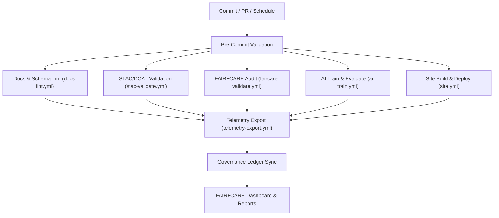

<div align="center">

# ⚙️ **Kansas Frontier Matrix — GitHub Architecture & Governance Automation**
`docs/architecture/github-architecture.md`

**Purpose:**  
Describe the **CI/CD, governance, and automation architecture** of the Kansas Frontier Matrix (KFM) GitHub environment.  
Define how **workflows, validations, security, telemetry, and governance checks** operate to maintain **FAIR+CARE**, **ISO**, **SLSA**, and **MCP-DL v6.3** compliance.

[](../README.md)
[](../../LICENSE)
[](../standards/faircare.md)
[](../security/supply-chain.md)
[](#)
</div>

---

## 📘 Overview

KFM’s **GitHub Architecture** is a **governance-integrated CI/CD system** that automates validation, documentation, security, and sustainability across data, AI, and web domains.

It integrates:
- 🧩 **GitHub Actions** — validation, build, provenance, and telemetry pipelines  
- ⚖️ **FAIR+CARE Governance** — ethical compliance & CARE-tag validation  
- 🔒 **SLSA + SBOMs** — verifiable build & artifact integrity with Cosign attestations  
- ♻️ **Telemetry Integration** — sustainability metrics aggregated into `focus-telemetry.json`  
- 📜 **Governance Ledger Sync** — continuous traceability of workflow outcomes  

---

## 🗂️ Directory Context

```plaintext
docs/
 └── architecture/
     ├── github-architecture.md     # This document
     ├── api-architecture.md        # API & knowledge graph
     ├── data-architecture.md       # STAC/DCAT & contracts
     └── web-ui-design.md           # Frontend & accessibility
```

Associated workflow documentation:
```
docs/workflows/
 ├── faircare-validate.yml.md
 ├── stac-validate.yml.md
 ├── telemetry-export.yml.md
 ├── docs-lint.yml.md
 ├── ai-train.yml.md
 ├── site.yml.md
 └── README.md
```

---

## ⚙️ CI/CD Governance Pipeline



### Summary
All workflows emit normalized metrics to **`releases/v10.2.0/focus-telemetry.json`**, which the **governance ledger** references for ethical certification and sustainability SLOs.

---

## 🧩 Workflow Layers

| Layer | Workflow(s) | Purpose |
|-------|--------------|---------|
| **Validation** | `docs-lint.yml`, `stac-validate.yml` | Structural & metadata compliance |
| **Ethical Governance** | `faircare-validate.yml` | FAIR+CARE audits, PII detection, CARE tags |
| **AI Governance** | `ai-train.yml` | Train/eval with explainability, drift, SBOM, provenance |
| **Publishing** | `site.yml` | Build & deploy docs/portal with SLSA attestations |
| **Telemetry** | `telemetry-export.yml` | Merge sustainability & performance metrics |

---

## 🧮 Workflow Policies

| Category | Policy | Enforcement |
|-----------|--------|-------------|
| **Branch Protection** | Required status checks for all governance workflows | GitHub branch rules |
| **Reviews** | 1 maintainer + 1 governance reviewer | FAIR+CARE Council |
| **Energy Efficiency** | Cancel duplicates to save energy | `concurrency` key |
| **Telemetry Sync** | Append all metrics to `focus-telemetry.json` | `telemetry-export.yml` |
| **Immutable Releases** | Lock `releases/**` artifacts post-tag | Governance ledger |

---

## 🔐 Security & Provenance

| Feature | Implementation |
|---------|----------------|
| **OIDC Auth** | Builds and signatures use short-lived identity tokens |
| **SBOM** | Syft/CycloneDX create SPDX inventories for each release |
| **Signing** | Cosign signs artifacts and telemetry with Sigstore |
| **SLSA** | Workflows emit provenance attestations for build artifacts |
| **Dependency Scans** | `npm audit`, `pip-audit`, and `trivy` run nightly |

---

## 📊 Telemetry Schema Integration

Telemetry conforms to `schemas/telemetry/workflows/docs-github-architecture-v3.json`.

| Field | Type | Description |
|--------|------|-------------|
| `workflow` | string | Workflow name |
| `status` | string | Success / Warning / Failure |
| `duration_sec` | number | Runtime |
| `energy_wh` | number | Energy usage |
| `carbon_gco2e` | number | CO₂e emissions |
| `branch` | string | Git ref or tag |
| `event_type` | string | `push`, `pull_request`, `schedule` |
| `timestamp` | string | ISO 8601 UTC |

Aggregation occurs hourly in **`telemetry-export.yml`**.

---

## 🧾 Internal Citation

```text
Kansas Frontier Matrix (2025). GitHub Architecture & Governance Automation (v10.2.3).
Defines CI/CD, FAIR+CARE governance, provenance, and sustainability architecture for automated ethical validation across the Kansas Frontier Matrix repository.
```

---

## 🕰️ Version History

| Version | Date | Author | Summary |
|---------:|------|--------|---------|
| v10.2.3 | 2025-11-09 | `@kfm-devops` | Align to v10.2: added `site.yml`, SLSA/Cosign integration, telemetry schema v3, and governance dashboard linkage. |
| v9.9.0  | 2025-11-08 | `@kfm-devops` | Sustainability metrics, SLSA provenance, telemetry integration. |
| v9.8.0  | 2025-11-06 | `@kfm-core` | Ledger linkages and branch protection automation. |

---

<div align="center">

**Kansas Frontier Matrix**  
*Governed CI/CD × FAIR+CARE Ethics × Sustainable Automation*  
© 2025 Kansas Frontier Matrix · CC-BY 4.0 · Master Coder Protocol v6.3 · Diamond⁹ Ω / Crown∞Ω Ultimate Certified  

[Back to Architecture Index](README.md) · [Governance Charter](../standards/governance/ROOT-GOVERNANCE.md)

</div>
