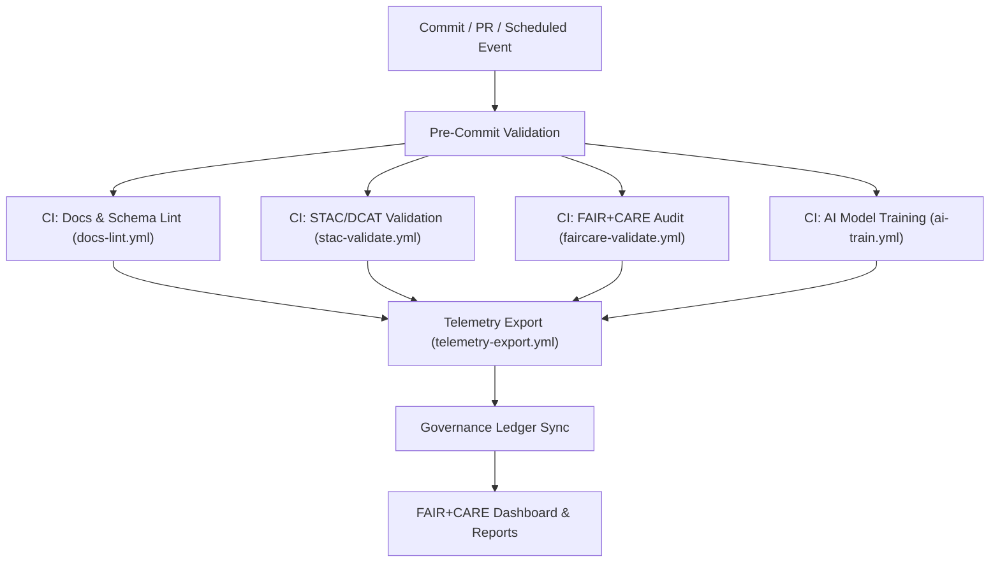
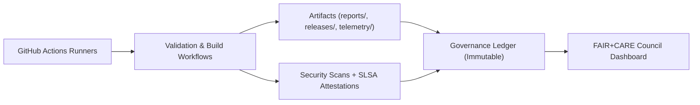

<div align="center">

# ⚙️ **Kansas Frontier Matrix — GitHub Architecture & Governance Automation**  
`docs/architecture/github-architecture.md`

**Purpose:**  
Describe the **CI/CD, governance, and automation architecture** of the Kansas Frontier Matrix (KFM) GitHub environment.  
Defines how **workflows, validations, telemetry, and governance checks** operate across repositories to maintain **FAIR+CARE**, **ISO**, and **MCP-DL v6.3** compliance.

[](../README.md)
[](../../LICENSE)
[](../standards/faircare.md)
[](#)

</div>

---

## 📘 Overview

The **GitHub Architecture** of the Kansas Frontier Matrix (KFM) is a **governance-integrated CI/CD system** that automates validation, documentation, and ethical compliance across all project domains — data, AI, web, and governance.

It integrates:
- 🧩 **GitHub Actions** — automated pipelines for validation, telemetry, and governance audits  
- ⚙️ **FAIR+CARE Governance** — ethical compliance validation for datasets and models  
- 🔒 **SLSA Provenance + SBOMs** — verifiable build and artifact integrity  
- ♻️ **Telemetry Integration** — sustainability metrics aggregated into `focus-telemetry.json`  
- 📜 **Governance Ledger Sync** — continuous traceability of workflow results into the FAIR+CARE ledger  

---

## 🗂️ Directory Context

```plaintext
docs/
 └── architecture/
     ├── github-architecture.md     # This document
     ├── api-architecture.md        # API and knowledge graph
     ├── data-architecture.md       # Data modeling and STAC/DCAT mapping
     └── web-ui.md                  # Frontend and accessibility standards
```

Associated workflow documentation:
```
docs/workflows/
 ├── faircare-validate.yml.md
 ├── stac-validate.yml.md
 ├── telemetry-export.yml.md
 ├── docs-lint.yml.md
 ├── ai-train.yml.md
 └── README.md
```

---

## ⚙️ CI/CD Governance Pipeline



### Summary:
Each workflow feeds validation metrics to a unified **telemetry pipeline**,  
which merges all results into `releases/v9.9.0/focus-telemetry.json`.  
This file is then referenced by the **governance ledger** for ethical certification.

---

## 🧩 Workflow Layers

| Layer | Workflow(s) | Purpose |
|-------|--------------|---------|
| **Validation Layer** | `docs-lint.yml`, `stac-validate.yml` | Ensure structural and metadata compliance. |
| **Ethical Governance Layer** | `faircare-validate.yml` | Run FAIR+CARE audits and PII detection. |
| **AI Governance Layer** | `ai-train.yml` | Train models with ethical explainability and telemetry output. |
| **Telemetry & Reporting Layer** | `telemetry-export.yml` | Aggregate metrics for sustainability and performance dashboards. |

Each layer is autonomous but fully integrated through telemetry normalization.

---

## 🧮 Workflow Policies

| Category | Policy | Enforcement |
|-----------|--------|-------------|
| **Branch Protection** | Required status checks for all governance workflows. | GitHub branch rules |
| **Review Requirements** | 1 maintainer + 1 governance reviewer for merges. | FAIR+CARE Council |
| **Concurrent Limits** | Workflows cancel duplicates to save energy. | Concurrency key |
| **Telemetry Sync** | All metrics appended to `focus-telemetry.json`. | telemetry-export.yml |
| **Immutable Releases** | Artifacts under `releases/**` locked post-tag. | Governance ledger |

---

## ⚖️ FAIR+CARE Automation Standards

| FAIR+CARE Principle | Enforcement Mechanism | Reference |
|---------------------|-----------------------|------------|
| **Findable** | Workflow logs indexed by telemetry ID and UUID. | telemetry-export.yml |
| **Accessible** | Public workflow documentation in `docs/workflows/`. | docs-lint.yml |
| **Interoperable** | Workflow outputs conform to JSON schemas. | stac-validate.yml |
| **Reusable** | CC-BY workflow documentation templates. | templates/workflow_template.md |
| **CARE — Responsibility** | Carbon and bias metrics tracked in telemetry. | faircare-validate.yml |
| **CARE — Ethics** | Data flagged for review auto-quarantined. | abandonment_candidates registry |

---

## 🧠 Governance Ledger Integration

The **governance ledger** links workflow outcomes to ethical certification events.

| Ledger Field | Description | Source |
|---------------|-------------|--------|
| `workflow_name` | The name of the CI job. | GitHub metadata |
| `commit_sha` | Verified commit hash. | CI environment |
| `status` | PASS / FAIL / REMEDIATED. | Workflow output |
| `energy_wh` | Workflow energy consumption. | Telemetry schema |
| `care_tag` | Governance classification (public, restricted, sensitive). | FAIR+CARE validation |
| `audited_by` | Governance council reviewer ID. | Council record |

All ledger updates are stored under:
```
releases/v9.9.0/governance/ledger_snapshot.json
```

---

## ♻️ Sustainability & Energy Management

All CI/CD workflows adhere to **ISO 50001 energy efficiency** principles.

| Metric | Target | Workflow |
|--------|--------|----------|
| Average runtime | ≤ 15 min | All workflows |
| Energy per run | ≤ 50 Wh | telemetry-export.yml |
| Carbon offset | 100% | FAIR+CARE ledger |
| Telemetry merge frequency | Hourly | telemetry-export.yml |

Energy data is appended to `focus-telemetry.json` under `energy_wh` and `carbon_gco2e` keys.

---

## 🔐 Security & Provenance

KFM’s CI/CD infrastructure incorporates **SLSA Level 3** provenance.

| Feature | Implementation |
|----------|----------------|
| **OIDC Authentication** | All builds and artifact signatures use short-lived identity tokens. |
| **SBOM Generation** | Syft creates SPDX-compliant inventories for each release. |
| **Cosign Signing** | Artifacts and telemetry files signed with Sigstore. |
| **SLSA Provenance** | Workflows emit attestations for all build artifacts. |
| **Dependency Security** | `npm audit`, `pip-audit`, and `trivy` run nightly. |

---

## 🧭 Environment Architecture



---

## 🧩 Telemetry Schema Integration

Telemetry emitted from GitHub workflows conforms to:
`schemas/telemetry/workflows/docs-github-architecture-v1.json`

| Field | Type | Description |
|--------|------|-------------|
| `workflow` | string | Workflow name (`docs-lint`, `faircare-validate`, etc.) |
| `status` | string | Success / Warning / Failure |
| `duration_sec` | number | Total workflow runtime |
| `energy_wh` | number | Energy usage in watt-hours |
| `carbon_gco2e` | number | Carbon emissions equivalent |
| `branch` | string | Git reference or release tag |
| `event_type` | string | `push`, `pull_request`, `schedule` |
| `timestamp` | string | ISO 8601 UTC timestamp |

Telemetry aggregation occurs hourly under `telemetry-export.yml`.

---

## 🧾 Internal Citation

```text
Kansas Frontier Matrix (2025). GitHub Architecture & Governance Automation (v9.9.0).
Defines CI/CD, FAIR+CARE governance, provenance, and sustainability architecture for automated ethical validation across the Kansas Frontier Matrix repository.
```

---

## 🕰️ Version History

| Version | Date | Author | Summary |
|---------:|------|--------|---------|
| v9.9.0 | 2025-11-08 | `@kfm-devops` | Added sustainability metrics, SLSA provenance, and telemetry integration. |
| v9.8.0 | 2025-11-06 | `@kfm-core` | Expanded governance ledger linkages and branch protection automation. |
| v9.7.0 | 2025-11-02 | `@kfm-core` | Established GitHub automation and workflow architecture documentation. |

---

<div align="center">

**Kansas Frontier Matrix**  
*Governed CI/CD × FAIR+CARE Ethics × Sustainable Automation*  
© 2025 Kansas Frontier Matrix · CC-BY 4.0 · Master Coder Protocol v6.3 · FAIR+CARE Certified · Diamond⁹ Ω / Crown∞Ω Ultimate Certified  

[Back to Architecture Index](README.md) · [Governance Charter](../standards/governance/ROOT-GOVERNANCE.md)

</div>

