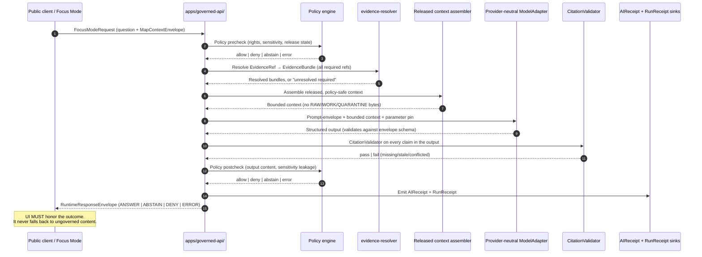

<a id="top"></a>
<!-- [KFM_META_BLOCK_V2]
doc_id: kfm://doc/architecture/governed-ai
title: Kansas Frontier Matrix — Governed AI (Architecture Note)
type: architecture
version: v0.1 (draft)
status: draft
owners: <GOVERNED_AI_STEWARD>  # PROPOSED — placeholder pending owner assignment
created: 2026-05-25
updated: 2026-05-25
policy_label: public
related:
  - docs/doctrine/directory-rules.md
  - docs/doctrine/truth-posture.md
  - docs/doctrine/trust-membrane.md
  - docs/doctrine/lifecycle-law.md
  - docs/architecture/governed-api.md
  - docs/architecture/evidence-identity.md
  - docs/architecture/map-shell.md
  - docs/architecture/contract-schema-policy-split.md
  - docs/architecture/connected-dots-architecture-brief.md
  - docs/adr/ADR-0001-schema-home.md
  - docs/standards/PROV.md
  - contracts/runtime/runtime_response_envelope.md
  - contracts/runtime/ai_receipt.md
  - schemas/contracts/v1/runtime/
  - schemas/contracts/v1/ai/
  - policy/ai/
  - runtime/model_adapters/
  - runtime/mock/
  - runtime/ollama/
  - runtime/envelopes/
  - apps/governed-api/
  - ai-build-operating-contract.md
tags: [kfm, architecture, governed-ai, focus-mode, ai-receipt, cite-or-abstain, runtime-envelope, trust-membrane]
notes:
  - All repository paths are PROPOSED; no mounted repo, CI workflow, runtime, or dashboard was inspected in this session.
  - Placement gap flagged: `governed-ai.md` does NOT appear in the `docs/architecture/` illustrative tree in directory-rules.md v1.3 (§6.1) — see §2 and §15.
  - AIReceipt and RuntimeResponseEnvelope field lists are PROPOSED per the KFM Unified Doctrine Synthesis §21 and Build Manual §15.4.
  - Owner, last-updated metadata, and badge link targets are placeholders pending verification.
[/KFM_META_BLOCK_V2] -->

# Kansas Frontier Matrix — Governed AI

**How KFM lets AI interpret released evidence — and how it ensures AI never becomes a truth source, a publication route, or a way around policy.**


> **Status:** draft · **Owners:** `<GOVERNED_AI_STEWARD>` (placeholder) · **Updated:** 2026-05-25

> [!IMPORTANT]
> **AI is interpretive, not the root truth source.** This note is **CONFIRMED at doctrine rank** for the rule, the flow, the finite outcomes, and the AIReceipt requirement. Specific schemas, paths, packages, route names, and runtime behavior are **PROPOSED** or **NEEDS VERIFICATION** until checked against a mounted repository.

---

## Contents

- [1. Purpose & scope](#1-purpose--scope)
- [2. Where this note belongs](#2-where-this-note-belongs)
- [3. The AI rule](#3-the-ai-rule)
- [4. Required flow](#4-required-flow)
- [5. Finite outcomes](#5-finite-outcomes)
- [6. `AIReceipt` — the AI's promise of accountability](#6-aireceipt--the-ais-promise-of-accountability)
- [7. Adapter contract & order](#7-adapter-contract--order)
- [8. `RuntimeResponseEnvelope`](#8-runtimeresponseenvelope)
- [9. Citation validation & cite-or-abstain](#9-citation-validation--cite-or-abstain)
- [10. AI hard denials](#10-ai-hard-denials)
- [11. Sensitive-domain interactions](#11-sensitive-domain-interactions)
- [12. Anti-patterns](#12-anti-patterns)
- [13. Schema, contract, and code homes](#13-schema-contract-and-code-homes)
- [14. Acceptance criteria](#14-acceptance-criteria)
- [15. Tensions & open questions](#15-tensions--open-questions)
- [16. Appendix — illustrative shapes](#16-appendix--illustrative-shapes)
- [17. Related docs](#17-related-docs)

---

## 1. Purpose & scope

This note is the architecture-level explanation of **how AI is wired into KFM**. It sits between the human doctrine in `docs/doctrine/`, the governed-API trust membrane at `apps/governed-api/`, the evidence and identity contract in `docs/architecture/evidence-identity.md`, and the runtime implementation under `runtime/` and `packages/`. **[CONFIRMED — doctrine; PROPOSED — paths]**

**One-line rule.** AI may *interpret* released, policy-safe `EvidenceBundle` content and *return finite outcomes* on a governed envelope. It MUST NOT decide truth, read canonical stores directly, bypass policy, publish uncited answers, or persist chain-of-thought as evidence. **[CONFIRMED — KFM Unified Implementation Architecture Build Manual §15.1; AI Build Operating Contract §§20–21; Unified Doctrine Synthesis §20]**

**In scope.** The AI rule; the required Focus-Mode flow; the finite-outcome envelope; the `AIReceipt`; the provider-neutral model-adapter contract; citation validation; AI hard denials; sensitive-domain interactions; anti-patterns; and acceptance tests.

**Out of scope.** Field-level schemas (those live under `schemas/contracts/v1/runtime/` and `schemas/contracts/v1/ai/` — **PROPOSED**); the broader trust-membrane invariant at full doctrinal depth (`docs/doctrine/trust-membrane.md` — **NEEDS VERIFICATION**); the governed-API executable form (`docs/architecture/governed-api.md` + `apps/governed-api/` — **PROPOSED**); the deterministic-identity contract (`docs/architecture/evidence-identity.md` — **PROPOSED at path**, drafted in this session); and the map-shell wiring (`docs/architecture/map-shell.md` — **NEEDS VERIFICATION**).

> [!NOTE]
> **Focus Mode is the canonical AI surface.** Other AI use is allowed (e.g., review-console drafting, validator suggestions), but every AI surface MUST be downstream of evidence + policy and MUST emit an `AIReceipt`. Focus Mode is documented here because it is the load-bearing public AI experience and it exercises every governance gate at once.

[Back to top](#top)

---

## 2. Where this note belongs

Per `directory-rules.md` v1.3 §6.1 and the *KFM Unified Implementation Architecture Build Manual* §5.1, architecture notes are placed under `docs/architecture/`. The proposed canonical path of this file is therefore:

```text
docs/architecture/governed-ai.md   # PROPOSED — Directory Rules §6.1, Build Manual §5.1
```

> [!CAUTION]
> **Placement gap (NEEDS VERIFICATION).** The illustrative `docs/architecture/` tree in `directory-rules.md` v1.3 §6.1 lists `README.md`, `system-context.md`, `deployment-topology.md`, `governed-api.md`, `map-shell.md`, and `contract-schema-policy-split.md` — but **does not** list `governed-ai.md`. The rationale for adding it is symmetric to the addition of `maplibre-3d.md` in v1.3: AI is a Cross-Domain System distinct from the API (Atlas §19), distinct from the map shell, and substantial enough to deserve its own architecture note. Resolution should be tracked in `docs/registers/DRIFT_REGISTER.md` and resolved by ADR (see §15 EID-Q1 below).

**Directory Rules basis.** `docs/` *explains*; `contracts/` *defines meaning*; `schemas/` *defines shape*; `policy/` *defines admissibility*; `runtime/` *implements adapters and envelopes*; `apps/governed-api/` *exposes the public trust membrane*. This note belongs in `docs/architecture/` because its job is to explain how those six artifacts cooperate around AI — not to be any one of them. **[CONFIRMED — Directory Rules §6.1, §6.3, §6.4, §6.5, §10.1]**

| Question | Where the answer lives | Status |
|---|---|---|
| What does `AIReceipt` *mean*? | `contracts/runtime/ai_receipt.md` | **PROPOSED** — Directory Rules §6.3 lists `runtime/` family under `contracts/` |
| What *shape* is enforced? | `schemas/contracts/v1/runtime/ai_receipt.schema.json` | **PROPOSED** |
| What does `RuntimeResponseEnvelope` *mean*? | `contracts/runtime/runtime_response_envelope.md` | **PROPOSED** |
| What *shape* is enforced? | `schemas/contracts/v1/runtime/runtime_response_envelope.schema.json` | **PROPOSED** |
| What *gates* AI requests and responses? | `policy/ai/` | **PROPOSED** |
| What *implements* the adapters? | `runtime/model_adapters/`, `runtime/mock/`, `runtime/ollama/`, `runtime/envelopes/` | **CONFIRMED at doctrine** — Directory Rules §10.1 |
| What *exposes* AI to public clients? | `apps/governed-api/` (never a direct browser route) | **CONFIRMED at commit** — Directory Rules §11; live-repo evidence per *Repository Structure Guiding Document* v0.1 |

[Back to top](#top)

---

## 3. The AI rule

The AI rule is a short list of MAYs and MUST NOTs. It is **CONFIRMED at doctrine rank** in the AI Build Operating Contract §21, the Unified Doctrine Synthesis §20, the Build Manual §15.1, and the Connected-Dots Brief §9.

| AI **MAY** do | AI **MUST NOT** do |
|---|---|
| Summarize resolved `EvidenceBundle` content in plain language with citations. | Invent support from map pixels, feature properties, vector search, or model memory. |
| Return `ANSWER`, `ABSTAIN`, `DENY`, or `ERROR` in a **validated** `RuntimeResponseEnvelope`. | Emit unclassified prose-only answers to public UI. |
| Draft candidate explanations or safe map-actions **for steward review**. | Approve release, change review state, publish claims, or bypass policy. |
| Produce `AIReceipt` with provider/model profile, parameter pin, evidence refs, policy decisions, and hashes. | **Persist private chain-of-thought as an evidence object.** |
| **Abstain** when `EvidenceBundle` resolution or citation validation fails. | Treat absence of evidence as an opportunity for plausible generation. |
| Use structured outputs that validate against the runtime envelope schema. | Return free-form JSON outside the validated schema. |

> [!IMPORTANT]
> **No chain-of-thought as truth object.** KFM MAY store auditable summaries, inputs, outputs, hashes, citations, policy decisions, validation reports, and receipts. KFM MUST NOT store private chain-of-thought as evidence, proof, or publication justification. **[CONFIRMED — AI Build Operating Contract §21.4]**

[Back to top](#top)

---

## 4. Required flow

Every AI response in KFM passes through the same governed sequence. Skipping any step breaks the trust membrane.



The textual form, **CONFIRMED at doctrine rank** in Build Manual §15.3 and AI Build Operating Contract §21.1:

```text
User question + MapContextEnvelope
  → scope classification
  → policy precheck
  → EvidenceRef → EvidenceBundle resolver
  → released or authorized context assembly
  → provider-neutral ModelAdapter
  → structured output validation
  → CitationValidator
  → policy postcheck
  → RuntimeResponseEnvelope
  → AIReceipt + RunReceipt
  → UI finite outcome
```

> [!NOTE]
> **Pre-check and post-check are separate decisions.** Policy precheck protects the *prompt* and the *context assembly* (do we even let this question reach the model?). Policy postcheck protects the *output* (did the model leak a sensitive coordinate, an uncited claim, or a synthetic surface presented as observed?). Both decisions are recorded.

[Back to top](#top)

---

## 5. Finite outcomes

KFM AI MUST return exactly one of a small set of outcomes. Free-form uncertainty is rejected by the envelope schema. **[CONFIRMED — AI Build Operating Contract §21.2; Atlas §24.3.1]**

| Outcome | When it is returned | UI surface | Status |
|---|---|---|---|
| `ANSWER` | Evidence sufficient, policy permits, citations validate, release state allows, review state (if required) is recorded. | Substantive cited answer + Evidence Drawer link. | **CONFIRMED — Atlas §24.3.1** |
| `ABSTAIN` | Required evidence is missing/stale/unresolved; or citation validation fails; or composed-claim has any unresolved required ref. | Non-substantive note with reason. **Never invents.** | **CONFIRMED — Atlas §24.3.1** |
| `DENY` | Policy, rights, sensitivity, or release state forbids the answer. Sensitive lanes default here. | Denial reason summary; alternative non-restricted surface where possible. Sensitive reasons may be redacted. | **CONFIRMED — Atlas §24.3.1** |
| `ERROR` | The governed API cannot evaluate — missing schema, malformed query, contract violation, infrastructure failure. | Finite, actionable error. Never silently falls through to another lane. | **CONFIRMED — Atlas §24.3.1** |
| `NARROWED` *(optional extension)* | Answer was issued within a tighter scope than requested due to evidence or policy bounds. | Same as ANSWER + scope-narrowed note. | **PROPOSED — AI Build Operating Contract §8 envelope extensions** |
| `BOUNDED` *(optional extension)* | Answer issued with explicit confidence/coverage bounds. | Same as ANSWER + bounds. | **PROPOSED — AI Build Operating Contract §8 envelope extensions** |

> [!IMPORTANT]
> **`NARROWED` and `BOUNDED` are *optional* extensions** and admissible **only if** the contract and schema explicitly define them. A response that uses them without the schema entry is invalid. **[CONFIRMED — AI Build Operating Contract §21.2]**

[Back to top](#top)

---

## 6. `AIReceipt` — the AI's promise of accountability

`AIReceipt` records what the AI saw, what it was told to do, and what it produced — **without persisting hidden reasoning as evidence**. **[CONFIRMED at doctrine rank — Unified Doctrine Synthesis §21; Master MapLibre Components v2.1; Atlas §19 Cross-Domain Systems]**

```text
AIReceipt {
  receipt_id:                stable_id,
  provider_id:               e.g., "ollama:local" | "openai-compatible:<provider>",
  model_pin:                 e.g., "<model_name>@sha256:…",
  parameter_pin:             { temperature, top_p, seed, num_ctx, … },
  prompt_contract_hash:      spec_hash(prompt_contract),
  context_refs:              [ EvidenceBundle.id, MapContextEnvelope.id, … ],
  pre_policy_check:          PolicyDecision.id,
  post_policy_check:         PolicyDecision.id,
  citation_validation:       CitationValidationReport.id,
  outcome:                   ANSWER | ABSTAIN | DENY | ERROR,
  reason_codes:              [ … ],
  output_envelope_hash:      spec_hash(RuntimeResponseEnvelope),
  timing_ms:                 int,
  timestamp_utc:             ISO 8601
}
```

> [!CAUTION]
> **Local-runtime config matters.** Default context windows on local model runtimes can change between releases. `num_ctx` and other parameter pins MUST be **explicit and captured in `AIReceipt`**; runtime-config drift triggers a fail-safe fallback. **[CONFIRMED — Unified Doctrine Synthesis §20, citing SRC-MAP v1.8 ML-063-046]**

**Identity discipline.** Every `AIReceipt` is content-addressed via JCS+SHA-256 over its canonical bytes (per `docs/architecture/evidence-identity.md` §4). The `prompt_contract_hash` and `output_envelope_hash` fields are JCS+SHA-256 over the *contract* and the *response envelope*, respectively. **[PROPOSED — KFM-IDX-REC family; CONFIRMED canonicalization at doctrine rank — Pass-10 C1-02]**

**No-CoT principle.** An `AIReceipt` lists what the model *was given* and what it *produced*, plus references to validation outcomes. It MUST NOT include a verbatim hidden reasoning trace, scratch tokens, deliberation traces, or any field that operationally functions as private chain-of-thought storage. **[CONFIRMED — AI Build Operating Contract §21.4]**

[Back to top](#top)

---

## 7. Adapter contract & order

KFM is **provider-neutral** by construction. The first governed-AI slice MUST NOT start with a specific provider, a browser chat panel, or UI polish. Provider choice (including local runtimes such as Ollama) is admissible **only behind the governed boundary**: adapter contract, evidence gates, finite envelopes, citation validation, receipts. **[CONFIRMED — AI Build Operating Contract §21.5; Build Manual §15.2; Directory Rules §10.1]**

| Adapter | Role | Build phase | Proposed home |
|---|---|---|---|
| **MockAdapter** | Deterministic fixture adapter; no network, no model, no I/O. Used in CI and replay tests. | First implementation. | `runtime/mock/` — **CONFIRMED at doctrine** — Directory Rules §10.1 |
| **NullAdapter** | Explicit disabled/offline adapter returning `ABSTAIN` or `ERROR`. Used when no live runtime is configured. | With MockAdapter. | `runtime/model_adapters/null/` — **PROPOSED** |
| **OllamaAdapter** | Local/private runtime behind the governed API only. **No public client traffic.** | After contracts, policy, and citation tests pass. | `runtime/ollama/` — **CONFIRMED at doctrine** — Directory Rules §10.1 |
| **OpenAICompatibleAdapter** | Provider-compatible runtime behind the same internal adapter contract. | After adapter contract and external-provider verification. | `runtime/model_adapters/openai_compatible/` — **PROPOSED** |

> [!IMPORTANT]
> **MockAdapter-first rule.** Before live model integration, a governed-AI slice SHOULD prove the behavior with deterministic fixtures covering: cited answer; missing-evidence abstention; stale-evidence abstention; policy denial; sensitive-geometry denial; citation-failure abstention; runtime error; `AIReceipt` emitted; no direct model client path. **[CONFIRMED — AI Build Operating Contract §21.3]**

**Provider-neutral adapter pattern.** A future swap from one local model to another, or from local to remote, is a **configuration change** — not an architecture change. Adapter swaps update the `provider_id`, `model_pin`, and `parameter_pin` fields of `AIReceipt` and nothing else.

[Back to top](#top)

---

## 8. `RuntimeResponseEnvelope`

The envelope is the **shape every AI response wears** before it reaches a public client. It is small, finite, and validated against a JSON Schema. **[CONFIRMED at doctrine rank — Build Manual §15.4; Atlas §24.3; AI Build Operating Contract §21]**

```json
{
  "schema": "kfm.runtime.response_envelope.v1",
  "request_id": "focus_req:...",
  "outcome": "ANSWER | ABSTAIN | DENY | ERROR",
  "answer": "Bounded cited answer only when outcome is ANSWER.",
  "citations": ["eref:001"],
  "abstain_reason": null,
  "denial_reason": null,
  "error_code": null,
  "policy_decision_id": "policy:...",
  "citation_validation_report_id": "citation:...",
  "ai_receipt_id": "receipt:ai:...",
  "release_id": "release:...",
  "visible_limitations": ["Only released public-safe evidence used."]
}
```

**Cross-envelope rule.** When `outcome != "ANSWER"`, `answer` MUST be null/empty and `citations` MUST be empty. The corresponding `*_reason` / `error_code` field MUST be populated. The envelope schema enforces this. **[PROPOSED — Build Manual §15.4 sketch]**

**Negative-state vocabulary.** Downstream UI distinguishes the *reason* the envelope is non-`ANSWER` through the `MISSING_EVIDENCE`, `SOURCE_STALE`, `DENIED_BY_POLICY`, `GENERALIZED_GEOMETRY`, `RESTRICTED_ACCESS`, `CONFLICTED_SUPPORT`, `CITATION_FAILED`, `RELEASE_WITHDRAWN`, and `RUNTIME_ERROR` codes. **[CONFIRMED — AI Build Operating Contract §22.2]**

[Back to top](#top)

---

## 9. Citation validation & cite-or-abstain

`CitationValidationReport` is the **gate that enforces cite-or-abstain in software**. Every claim inside an `ANSWER` envelope MUST be supported by at least one `EvidenceRef` that resolves to a released `EvidenceBundle`. **[CONFIRMED at doctrine rank — Unified Doctrine Synthesis §21; Atlas §24]**

**PROPOSED rules** (Unified Doctrine Synthesis §21, citing SRC-P23):

1. Every claim in an `ANSWER` envelope cites at least one `EvidenceRef`.
2. Each cited `EvidenceRef` resolves to an `EvidenceBundle` that is itself in a released state.
3. **Stale citations** (source freshness threshold exceeded) force `ABSTAIN`.
4. **Conflicted citations** (two sources disagree, no resolution recorded) are surfaced — not silently picked.
5. **Structured-output schema failure** before display → `ERROR`.

> [!NOTE]
> **Composed-claim all-or-abstain.** A claim composed of multiple required `EvidenceRefs` renders only when **all** required references resolve. Any unresolved required evidence MUST force `ABSTAIN`. **[PROPOSED — KFM-P26-IDEA-0008; CONFIRMED interaction with `docs/architecture/evidence-identity.md` §8]**

[Back to top](#top)

---

## 10. AI hard denials

The following conditions MUST produce `DENY` or `ERROR`. They are **CONFIRMED at doctrine rank** in Build Manual §15.5 and AI Build Operating Contract §21.

> [!WARNING]
> If any of the conditions below is reached and an `ANSWER` envelope is returned anyway, the trust membrane has been breached and the release is invalid.

- Browser calls model runtime directly.
- Context includes RAW / WORK / QUARANTINE / private / canonical direct access.
- Evidence is not published, cataloged, or proof-backed.
- Sensitive precise geometry would leak.
- Rights are unknown.
- Citation validator fails.
- Source ledger is missing.
- Policy engine unavailable.
- Model output includes uncited consequential claims.
- AI generation routed through admin shortcut. **[CONFIRMED anti-pattern — Atlas §24.9.2]**

[Back to top](#top)

---

## 11. Sensitive-domain interactions

KFM's sensitive-domain matrix applies to every AI surface. The defaults below are **CONFIRMED at doctrine rank** in the AI Build Operating Contract §23.2 and Atlas §24.10; per-domain stewards may amend defaults during adoption. **Until ratified, the most restrictive applicable row applies.**

| Sensitive lane | AI default at public surface | What AI MAY do internally |
|---|---|---|
| Archaeology — site locations | `DENY` exact coordinates; `ABSTAIN` if generalization not pre-computed. | Summarize generalized site context for stewards behind review console. |
| Indigenous / cultural records | `DENY` unless steward-approved. | Draft steward-review notes; no public answer until steward gate passes. |
| Burial / sacred sites | `DENY` exact location. | Summarize regional context without place names if approved. |
| Rare species (exact occurrence) | `DENY` exact coordinates. | Summarize generalized public-safe grid data. |
| Critical infrastructure | `DENY` or `RESTRICTED_ACCESS`. | Coarse depiction only; never operational detail. |
| Living-person data | `DENY` PII; aggregate only. | Summarize aggregates; never per-person joins. |
| Genealogy / DNA | `DENY` joins to living persons. | Time-windowed or aggregated summaries only. |
| Private-land assertions | `ABSTAIN` unless rights documented. | Cite the rights gap explicitly; do not infer ownership. |
| Hazards / emergency | `BOUNDED` answers only; defer to official sources. | Summarize released `EvidenceBundle` content with disclaimer; never serve as alert authority. |
| Restricted source terms | `DENY` derivative public release. | Internal-only summarization, with source-rights field captured in `AIReceipt`. |
| Exact-harm coordinates | `DENY`. | Generalize or refuse entirely. |

> [!IMPORTANT]
> **KFM is not an alert authority.** Using KFM AI as an instruction, warning, or life-safety surface is an out-of-scope use named in Atlas §24.9.2. Hazards, air-quality, and hydrology AI surfaces MUST defer to the official source and MUST NOT issue directive language. **[CONFIRMED — Atlas §24.9.2]**

[Back to top](#top)

---

## 12. Anti-patterns

Drawn from Atlas §24.9, Directory Rules §13, and Unified Doctrine Synthesis §29.

| Anti-pattern | What goes wrong | Counter-rule |
|---|---|---|
| AI returns uncited language. | Generated text substitutes for evidence; cite-or-abstain broken. | Focus Mode; AI-surface steward; `CitationValidationReport` blocks display. |
| AI answers from RAW / WORK rather than `EvidenceBundle`. | AI becomes its own truth source. | Governed-AI runtime; `AIReceipt` evaluator. |
| AI presents synthetic content as observed reality. | Reconstruction read as observation. | Reality Boundary Note; Representation Receipt; deny-by-default 3D admission. |
| AI generation routed through admin shortcut. | Admin bypass becomes a normal-path public route. | Trust-membrane audit; deny-by-default infra; `apps/governed-api/` is the only public route. |
| Persisting private chain-of-thought as an evidence object. | Generation masquerades as proof; private reasoning leaks into audit. | `AIReceipt` records inputs/outputs/hashes only. |
| Source-role upgrade by paraphrase (e.g., quoting an aggregate as a per-place fact). | Source-role anti-collapse violated through AI prose. | Cite-or-abstain; AIReceipt sampling; banned-phrase lints; periodic audit. |
| Browser calls model runtime directly. | Trust membrane bypassed; receipts skipped. | Local runtimes MUST stay behind `apps/governed-api/`. |
| Free-form JSON outside the validated envelope. | Schema enforcement bypassed. | Structured output validation before display; envelope schema is the contract. |
| Treating an Atlas summary as evidence. | Reference views promoted to authority. | `EvidenceBundle` remains the only authoritative evidence object. |

[Back to top](#top)

---

## 13. Schema, contract, and code homes

All paths in this table are **PROPOSED** until verified against a mounted repository. They follow `directory-rules.md` v1.3 §6.3, §6.4, §6.5, §10.1, and §11.

| Artifact | Proposed home | Status |
|---|---|---|
| `AIReceipt` meaning (Markdown) | `contracts/runtime/ai_receipt.md` | **PROPOSED** — Directory Rules §6.3 (runtime family) |
| `RuntimeResponseEnvelope` meaning (Markdown) | `contracts/runtime/runtime_response_envelope.md` | **PROPOSED** — Directory Rules §6.3 |
| `CitationValidationReport` meaning (Markdown) | `contracts/runtime/citation_validation_report.md` | **PROPOSED** |
| `FocusModeRequest` / `FocusModeResponse` (Markdown) | `contracts/focus_mode/focus_mode_payload.md` | **PROPOSED** — Directory Rules §6.7.2 (new top-level family) |
| `ai_receipt.schema.json` | `schemas/contracts/v1/runtime/ai_receipt.schema.json` | **PROPOSED** |
| `runtime_response_envelope.schema.json` | `schemas/contracts/v1/runtime/runtime_response_envelope.schema.json` | **PROPOSED** |
| `citation_validation_report.schema.json` | `schemas/contracts/v1/runtime/citation_validation_report.schema.json` | **PROPOSED** |
| AI admission / output policy | `policy/ai/` | **PROPOSED** — Directory Rules §6.5 |
| Model-adapter interface | `runtime/model_adapters/` | **CONFIRMED at doctrine** — Directory Rules §10.1 |
| MockAdapter | `runtime/mock/` | **CONFIRMED at doctrine** — Directory Rules §10.1 |
| OllamaAdapter | `runtime/ollama/` | **CONFIRMED at doctrine** — Directory Rules §10.1 |
| Envelope helpers | `runtime/envelopes/` | **CONFIRMED at doctrine** — Directory Rules §10.1 |
| Public route surface | `apps/governed-api/` | **CONFIRMED at commit** — Directory Rules §11; live-repo evidence per *Repository Structure Guiding Document* v0.1 |
| Validators | `tools/validators/validate_ai_receipt.py`, `tools/validators/validate_runtime_response_envelope.py` | **PROPOSED** — flat validator naming per Directory Rules §6.7.2 |
| AI fixtures | `fixtures/{valid,invalid}/ai/` | **PROPOSED** — Directory Rules §6.6 |
| Focus Mode area wirings | `apps/explorer-web/src/focus-modes/<area>/` | **CONFIRMED at doctrine; CONFIRMED at commit `b6a27916…` for `apps/explorer-web/`** — Directory Rules §11 |

> [!NOTE]
> `.schema.json` files **never** live under `contracts/`. Meaning lives in `contracts/`; machine shape lives in `schemas/`; policy admissibility in `policy/`; implementation in `runtime/` and `apps/`. **[CONFIRMED — Directory Rules §6.3, §6.4, §6.5; ADR-0001]**

[Back to top](#top)

---

## 14. Acceptance criteria

Implementation maturity for this note's content is verified by the tests below. **All are PROPOSED** until fixtures land in a mounted repository.

| # | Test | Expected behavior |
|---|---|---|
| 1 | **No public model path** | Browser cannot reach a model runtime directly. All AI traffic flows through `apps/governed-api/`. |
| 2 | **No raw context** | Prompt context never includes RAW / WORK / QUARANTINE / canonical-store bytes; only released `EvidenceBundle` content. |
| 3 | **Finite-outcome envelope** | Every `RuntimeResponseEnvelope` validates against the v1 schema and carries exactly one of `ANSWER` / `ABSTAIN` / `DENY` / `ERROR` (or schema-defined extension). |
| 4 | **Cited-answer rule** | `ANSWER` envelope MUST have ≥ 1 citation; every citation MUST resolve to a released `EvidenceBundle`. Otherwise `ABSTAIN`. |
| 5 | **MockAdapter parity** | MockAdapter, NullAdapter, and live adapters produce envelopes that validate against the same schema and the same finite-outcome set. |
| 6 | **AIReceipt emission** | Every AI invocation emits an `AIReceipt` with provider, model_pin, parameter_pin, context refs, pre/post policy decisions, citation report, and envelope hash. |
| 7 | **No-CoT** | `AIReceipt` MUST NOT contain a private chain-of-thought trace. Schema rejects any field that operationally functions as private-reasoning storage. |
| 8 | **Local-runtime config capture** | `parameter_pin` records `num_ctx` (and equivalent) for local runtimes; drift triggers fail-safe fallback. |
| 9 | **Replay determinism** | Given the same prompt-contract hash, model pin, parameter pin, evidence refs, and seed, the recorded `AIReceipt` canonical hash matches a recorded golden hash. Replay drift is a build break. |
| 10 | **Sensitive-geometry denial** | Style-only hiding fails; exact sensitive geometry never reaches the model context. Negative fixtures cover archaeology, rare species, infrastructure, living-person joins. |
| 11 | **Stale-evidence abstention** | When `SourceDescriptor` cadence has expired and no fresh admission is recorded, AI ABSTAINs and records the reason code. |
| 12 | **Policy parity** | The same policy bundle that gates CI merges (`policy/ai/`) is enforced at runtime by the governed-API. Drift between CI and runtime is a class of bug. |
| 13 | **Admin-shortcut audit** | Trust-membrane audit confirms no admin endpoint is reachable from the normal public path. |
| 14 | **No private-reasoning leak** | Output text scanning rejects responses that include scratch-pad markers or operationally-CoT-shaped passages even within `answer`. |

[Back to top](#top)

---

## 15. Tensions & open questions

| ID | Tension | Status |
|---|---|---|
| **GAI-Q1** | **Placement gap.** `docs/architecture/governed-ai.md` is not in the `directory-rules.md` v1.3 §6.1 illustrative tree. Symmetric with the v1.3 addition of `maplibre-3d.md`; resolution is by ADR or by amendment to Directory Rules. | **NEEDS VERIFICATION** — tracked here; surface in `docs/registers/DRIFT_REGISTER.md` |
| **GAI-Q2** | **`NARROWED` / `BOUNDED` extension scope.** AI Build Operating Contract §21.2 permits these as optional extensions only if the contract and schema define them. The envelope schema has not yet pinned which fields they require. | **PROPOSED** — pin in `schemas/contracts/v1/runtime/runtime_response_envelope.schema.json` |
| **GAI-Q3** | **Prompt-envelope signing.** Pass-23 KFM-P8-PROG-0017 describes a signed prompt envelope (DSSE-style) so the agent can refuse forged prompts. Per-prompt vs per-session scope is unresolved. | **NEEDS VERIFICATION** — Pass-23 open question carried forward |
| **GAI-Q4** | **Local-runtime context-window pinning.** `num_ctx` defaults on local runtimes change between releases; the precise drift policy is not codified. | **PROPOSED** — capture in `AIReceipt.parameter_pin`; fail-safe fallback on drift |
| **GAI-Q5** | **Side-channel inference via AI prose.** Aggregate + context joins can leak per-place fact through paraphrase even when geometry is generalized. Atlas §24.10 names paraphrase detection and AIReceipt sampling as residual concerns. | **PROPOSED** — bans, lints, periodic sampling; no closed solution yet |
| **GAI-Q6** | **Replay-cache strategy for remote-model adapters.** Replay-verification needs cached responses (per `tests/replay/fixtures/<use_case>/cached_responses/` — PROPOSED). The corpus does not pin cadence or TTL. | **PROPOSED** |
| **GAI-Q7** | **`policy/ai/` lane boundaries.** Where AI policy ends and where source-sensitivity policy begins is not codified. Both must be evaluated; coordination is open. | **PROPOSED** |
| **GAI-Q8** | **Output-text CoT detection.** Test #14 ("no private-reasoning leak") needs a defined detector. None is pinned. | **PROPOSED** |
| **GAI-Q9** | **Review-console drafting scope.** AI may draft candidate explanations and steward-review notes; the boundary between drafting and approval is doctrine-CONFIRMED but its mechanical enforcement (e.g., a `review_console_draft` flag in `AIReceipt`) is not pinned. | **PROPOSED** |

[Back to top](#top)

---

## 16. Appendix — illustrative shapes

> [!NOTE]
> The shapes below are **illustrative, not authoritative**. They are derived from the PROPOSED schemas (KFM Unified Doctrine Synthesis §21; Build Manual §15.4; AI Build Operating Contract §21; Master MapLibre Components v2.1). Once canonical schemas land under `schemas/contracts/v1/runtime/` and `schemas/contracts/v1/ai/`, that file — not this appendix — is the source of truth.

<details>
<summary><strong>A. Illustrative <code>FocusModeRequest</code> (PROPOSED)</strong></summary>

```json
{
  "request_id": "focus_req:<NEEDS_VERIFICATION>",
  "question": "<bounded user question — see prompt contract>",
  "map_context_envelope": {
    "id": "ctx:<NEEDS_VERIFICATION>",
    "camera": { "lng": -98.5, "lat": 38.5, "zoom": 6 },
    "bounds": [[-102.0, 36.99], [-94.59, 40.0]],
    "time": { "instant": "2026-05-25T00:00:00Z", "version_lock": null },
    "selected_layer_ids": [],
    "selected_feature_id": null,
    "release_ids": ["release:<NEEDS_VERIFICATION>"]
  },
  "required_evidence_refs": [
    { "ref_id": "kfm://evidence-ref/<NEEDS_VERIFICATION>" }
  ],
  "adapter_pin": {
    "provider_id": "<NEEDS_VERIFICATION>",
    "model_pin": "<NEEDS_VERIFICATION>",
    "parameter_pin": { "temperature": 0.0, "top_p": 1.0, "seed": 1, "num_ctx": 8192 }
  },
  "prompt_contract_hash": "jcs:sha256:<HEX_TO_BE_COMPUTED>"
}
```
</details>

<details>
<summary><strong>B. Illustrative <code>RuntimeResponseEnvelope</code> — <code>ANSWER</code> case (PROPOSED)</strong></summary>

```json
{
  "schema": "kfm.runtime.response_envelope.v1",
  "request_id": "focus_req:<NEEDS_VERIFICATION>",
  "outcome": "ANSWER",
  "answer": "<bounded cited answer text>",
  "citations": [
    { "ref_id": "kfm://evidence-ref/<NEEDS_VERIFICATION>",
      "resolved_bundle_id": "kfm://evidence-bundle/<NEEDS_VERIFICATION>" }
  ],
  "abstain_reason": null,
  "denial_reason": null,
  "error_code": null,
  "policy_decision_id": "policy:<NEEDS_VERIFICATION>",
  "citation_validation_report_id": "citation:<NEEDS_VERIFICATION>",
  "ai_receipt_id": "receipt:ai:<NEEDS_VERIFICATION>",
  "release_id": "release:<NEEDS_VERIFICATION>",
  "visible_limitations": ["Only released public-safe evidence used."]
}
```
</details>

<details>
<summary><strong>C. Illustrative <code>RuntimeResponseEnvelope</code> — <code>ABSTAIN</code> case (PROPOSED)</strong></summary>

```json
{
  "schema": "kfm.runtime.response_envelope.v1",
  "request_id": "focus_req:<NEEDS_VERIFICATION>",
  "outcome": "ABSTAIN",
  "answer": null,
  "citations": [],
  "abstain_reason": {
    "code": "MISSING_EVIDENCE",
    "detail": "One or more required EvidenceRefs did not resolve to a released EvidenceBundle."
  },
  "denial_reason": null,
  "error_code": null,
  "policy_decision_id": "policy:<NEEDS_VERIFICATION>",
  "citation_validation_report_id": "citation:<NEEDS_VERIFICATION>",
  "ai_receipt_id": "receipt:ai:<NEEDS_VERIFICATION>",
  "release_id": null,
  "visible_limitations": ["Evidence for this question is not yet released."]
}
```

Other valid `abstain_reason.code` values include `SOURCE_STALE`, `CONFLICTED_SUPPORT`, `CITATION_FAILED`, and `RELEASE_WITHDRAWN`. (See §8.)
</details>

<details>
<summary><strong>D. Illustrative <code>AIReceipt</code> (PROPOSED)</strong></summary>

```json
{
  "receipt_id": "receipt:ai:<NEEDS_VERIFICATION>",
  "provider_id": "ollama:local",
  "model_pin": "<model_name>@sha256:<NEEDS_VERIFICATION>",
  "parameter_pin": {
    "temperature": 0.0,
    "top_p": 1.0,
    "seed": 1,
    "num_ctx": 8192
  },
  "prompt_contract_hash": "jcs:sha256:<HEX_TO_BE_COMPUTED>",
  "context_refs": [
    "kfm://evidence-bundle/<NEEDS_VERIFICATION>",
    "ctx:<NEEDS_VERIFICATION>"
  ],
  "pre_policy_check": "policy:<NEEDS_VERIFICATION>",
  "post_policy_check": "policy:<NEEDS_VERIFICATION>",
  "citation_validation": "citation:<NEEDS_VERIFICATION>",
  "outcome": "ANSWER",
  "reason_codes": [],
  "output_envelope_hash": "jcs:sha256:<HEX_TO_BE_COMPUTED>",
  "timing_ms": 0,
  "timestamp_utc": "2026-05-25T00:00:00Z"
}
```

> [!CAUTION]
> No `chain_of_thought` field. No `scratchpad` field. No `private_reasoning` field. The receipt records *what the model saw and what it produced*, not how it deliberated.

</details>

<details>
<summary><strong>E. Illustrative MockAdapter fixture matrix (PROPOSED)</strong></summary>

| Fixture | Inputs | Expected outcome | Expected reason code |
|---|---|---|---|
| `cited_answer` | Released bundles, valid citations, policy allow. | `ANSWER` | n/a |
| `missing_evidence` | One required `EvidenceRef` unresolved. | `ABSTAIN` | `MISSING_EVIDENCE` |
| `stale_evidence` | `SourceDescriptor` cadence expired. | `ABSTAIN` | `SOURCE_STALE` |
| `conflicted_support` | Two cited bundles disagree, no resolution recorded. | `ABSTAIN` | `CONFLICTED_SUPPORT` |
| `citation_failed` | Output cites a `ref_id` that does not validate. | `ABSTAIN` | `CITATION_FAILED` |
| `policy_deny_rights` | Rights field unknown. | `DENY` | `DENIED_BY_POLICY` (rights) |
| `policy_deny_sensitive_geometry` | Exact sensitive geometry in context. | `DENY` | `DENIED_BY_POLICY` (sensitivity) |
| `release_withdrawn` | Cited bundle's release was withdrawn. | `ABSTAIN` or `DENY` | `RELEASE_WITHDRAWN` |
| `runtime_error_schema` | Malformed structured output. | `ERROR` | `RUNTIME_ERROR` (schema) |
| `runtime_error_infra` | Policy engine unreachable. | `ERROR` | `RUNTIME_ERROR` (infra) |

All fixtures: an `AIReceipt` is emitted; the envelope validates against schema; no direct model-client path is observed.

</details>

<details>
<summary><strong>F. Sketch — signed prompt envelope (PROPOSED, Pass-23 KFM-P8-PROG-0017)</strong></summary>

```text
PromptEnvelope {
  issuer:                   <agent boundary identity>,
  audience:                 <intended audience / capability scope>,
  capability_scope:         [ "focus_mode.answer", "review_console.draft", … ],
  content_hash:             jcs:sha256:<HEX>,
  signature:                <DSSE-style signature reference>,
  envelope_lifetime:        per-prompt | per-session    # NEEDS VERIFICATION
}
```

**Why.** Without envelope verification, the agent cannot distinguish an authoritative instruction from its operator from a forged instruction in a document it just read. **Tension.** Envelope verification adds latency; cache strategies are not specified. **[CONFIRMED — Pass-23 KFM-P8-PROG-0017; NEEDS VERIFICATION — lifetime / cache strategy]**

</details>

[Back to top](#top)

---

## 17. Related docs

| Doc | Relationship | Status |
|---|---|---|
| `docs/doctrine/directory-rules.md` (v1.3) | Placement authority; AI runtime root `runtime/` defined in §10.1. | **CONFIRMED — attached** |
| `docs/doctrine/truth-posture.md` | Cite-or-abstain at full doctrinal depth. | **NEEDS VERIFICATION** — referenced from directory-rules.md |
| `docs/doctrine/trust-membrane.md` | The runtime invariant `apps/governed-api/` enforces. | **NEEDS VERIFICATION** — referenced from directory-rules.md |
| `docs/doctrine/lifecycle-law.md` | RAW → PUBLISHED phase law. AI MAY consume only PUBLISHED content. | **NEEDS VERIFICATION** — referenced from directory-rules.md |
| `docs/architecture/governed-api.md` | The executable trust membrane the AI sits behind. | **NEEDS VERIFICATION** — listed in directory-rules.md v1.3 §6.1 tree |
| `docs/architecture/evidence-identity.md` | EvidenceBundle / EvidenceRef / spec_hash contract this note depends on. | **PROPOSED at path** — drafted in this session |
| `docs/architecture/map-shell.md` | Click-to-truth and Evidence Drawer wiring the Focus Mode flow uses. | **NEEDS VERIFICATION** — listed in directory-rules.md v1.3 §6.1 tree |
| `docs/architecture/contract-schema-policy-split.md` | Why meaning / shape / admissibility / proof are separate. | **NEEDS VERIFICATION** — referenced from directory-rules.md |
| `docs/architecture/connected-dots-architecture-brief.md` §9 | How governed AI fits the larger trust spine. | **PROPOSED at path** — CONFIRMED authored prior session |
| `docs/standards/PROV.md` | Provenance vocabulary used in lineage chains and AIReceipt context refs. | **CONFIRMED authored prior session**; naming variance tracked elsewhere (Directory Rules OPEN-DR-01) |
| `docs/adr/ADR-0001-schema-home.md` | Why `schemas/contracts/v1/...` is canonical. | **PROPOSED at path** — CONFIRMED referenced |
| `contracts/runtime/ai_receipt.md` | Semantic Markdown for `AIReceipt`. | **PROPOSED — not yet authored** |
| `contracts/runtime/runtime_response_envelope.md` | Semantic Markdown for `RuntimeResponseEnvelope`. | **PROPOSED — not yet authored** |
| `contracts/focus_mode/focus_mode_payload.md` | Semantic Markdown for Focus Mode request/response. | **PROPOSED** — Directory Rules §6.7.2 new top-level family |
| `schemas/contracts/v1/runtime/` | Machine-schema home for AIReceipt and envelopes. | **PROPOSED** |
| `policy/ai/` | AI admissibility policy. | **PROPOSED** — Directory Rules §6.5 |
| `runtime/model_adapters/`, `runtime/mock/`, `runtime/ollama/`, `runtime/envelopes/` | Adapter implementations and envelope helpers. | **CONFIRMED at doctrine** — Directory Rules §10.1 |
| `apps/governed-api/` | The only public path AI traffic flows through. | **CONFIRMED at commit `b6a27916…`** — Directory Rules §11 |
| `ai-build-operating-contract.md` §§20–21 | Governed-AI runtime contract: required flow, finite outcomes, MockAdapter-first, no-CoT, provider neutrality. | **CONFIRMED — attached** |
| `KFM_Unified_Implementation_Architecture_Build_Manual.md` §15 | Governed AI and Focus Mode — flow text, envelope sketch, hard denials, adapter order. | **CONFIRMED — attached** |
| `kfm_unified_doctrine_synthesis.md` §§20–21 | `AIReceipt` field skeleton; citation-validation rules; local-runtime config caveats. | **CONFIRMED — attached** |
| `Master_MapLibre_Components-Functions-Features_v2_1_FULL.md` §7.O / §7.Q | Focus Mode component register; sensitive-geometry fail-closed rules. | **CONFIRMED — attached** |
| `Kansas_Frontier_Matrix_-_Domains_v1_1___Pass_23_32_Consolidated_Atlas.md` §§19, 24.3, 24.9, 24.10 | Cross-Domain Systems register; finite-outcome reference; trust-membrane anti-patterns; AI-governance risk rows. | **CONFIRMED — attached** |
| `KFM_Components_Pass_10_Idea_Index_Category_Atlas_and_Expansion_Dossier` C12-03 (GENERATED_RECEIPT) | Sibling receipt class for AI-authored code. Not the same as `AIReceipt` (which is per-inference). | **CONFIRMED — attached** |

---

**Last updated:** 2026-05-25 · **Edition:** v0.1 (draft) · **Spec hash:** *PROPOSED — to be emitted via canonical JCS+SHA-256 once a hashing tool is wired.* · [Back to top](#top)
